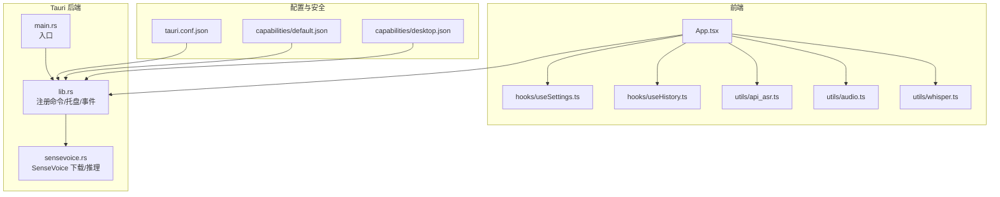
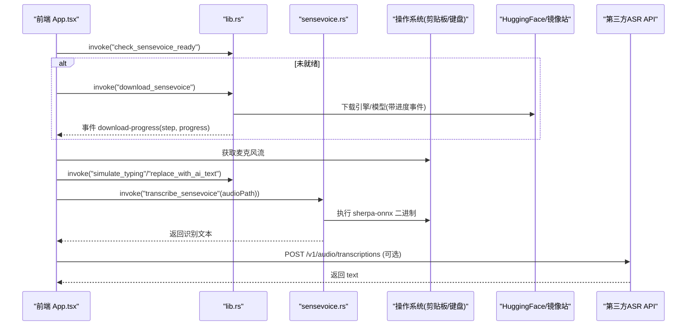
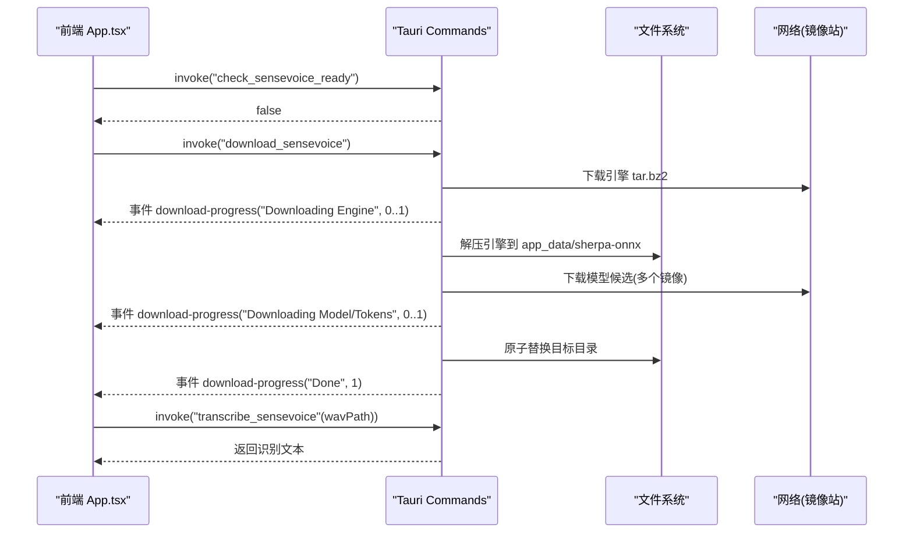
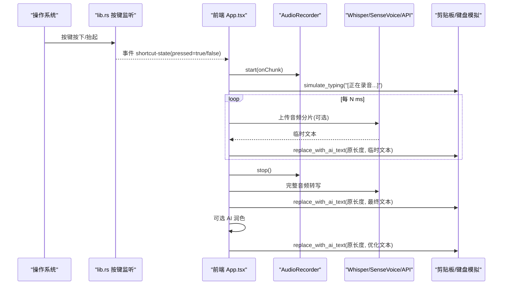
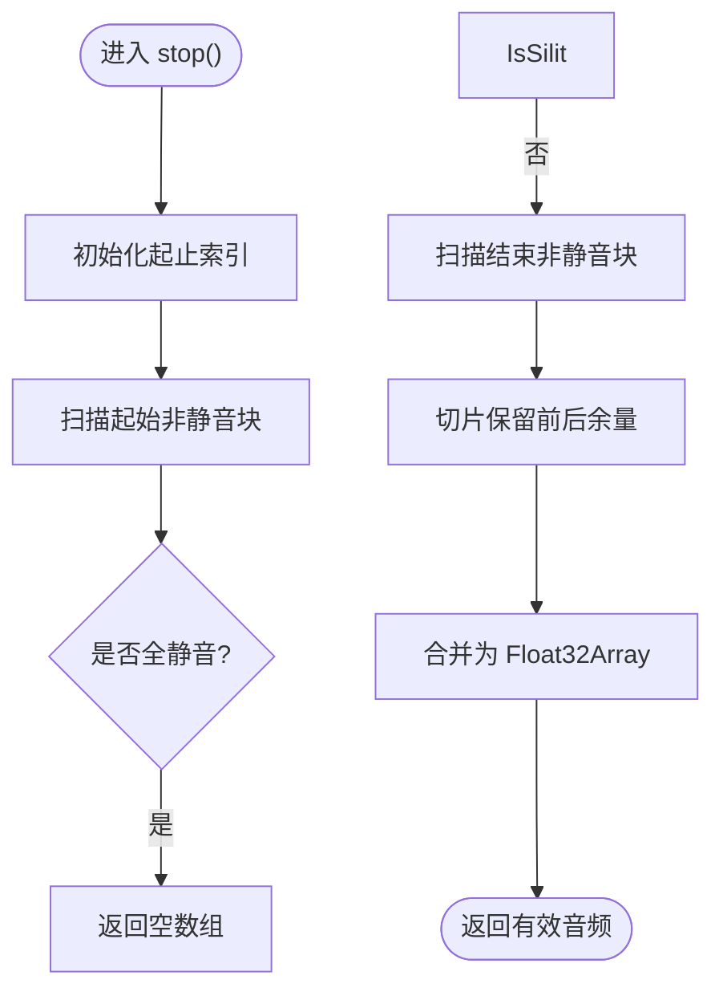
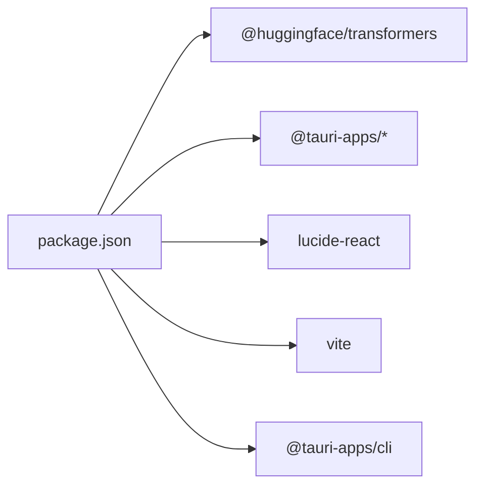

# API 参考文档

<cite>
**本文引用的文件**
- [src-tauri/src/main.rs](file://src-tauri/src/main.rs)
- [src-tauri/src/lib.rs](file://src-tauri/src/lib.rs)
- [src-tauri/src/sensevoice.rs](file://src-tauri/src/sensevoice.rs)
- [src-tauri/tauri.conf.json](file://src-tauri/tauri.conf.json)
- [src-tauri/capabilities/default.json](file://src-tauri/capabilities/default.json)
- [src-tauri/capabilities/desktop.json](file://src-tauri/capabilities/desktop.json)
- [src/App.tsx](file://src/App.tsx)
- [src/hooks/useSettings.ts](file://src/hooks/useSettings.ts)
- [src/hooks/useHistory.ts](file://src/hooks/useHistory.ts)
- [src/utils/api_asr.ts](file://src/utils/api_asr.ts)
- [src/utils/audio.ts](file://src/utils/audio.ts)
- [src/utils/whisper.ts](file://src/utils/whisper.ts)
- [package.json](file://package.json)
</cite>

## 目录
1. [简介](#简介)
2. [项目结构](#项目结构)
3. [核心组件](#核心组件)
4. [架构总览](#架构总览)
5. [详细组件分析](#详细组件分析)
6. [依赖分析](#依赖分析)
7. [性能考虑](#性能考虑)
8. [故障排查指南](#故障排查指南)
9. [结论](#结论)
10. [附录](#附录)

## 简介
本文件为 VoiceFlow_AI_002 的完整 API 参考文档，覆盖以下范围：
- Tauri Commands（Rust 后端暴露给前端的系统级能力）
- 前端 API 接口与自定义 Hooks 的使用方式、参数类型与返回值格式
- 能力配置文件的作用与安全模型
- 请求/响应模式、错误处理策略与异步操作处理
- 实际调用示例与最佳实践（以路径引用代替代码片段）

## 项目结构
本项目采用 Tauri + React 的前后端混合架构。Rust 侧通过 tauri::command 暴露系统级能力；前端通过 @tauri-apps/api 调用命令、监听事件、管理窗口与插件能力。

图表来源
- [src-tauri/src/main.rs:1-9](file://src-tauri/src/main.rs#L1-L9)
- [src-tauri/src/lib.rs:215-286](file://src-tauri/src/lib.rs#L215-L286)
- [src-tauri/src/sensevoice.rs:295-476](file://src-tauri/src/sensevoice.rs#L295-L476)
- [src-tauri/tauri.conf.json:1-68](file://src-tauri/tauri.conf.json#L1-L68)
- [src-tauri/capabilities/default.json:1-19](file://src-tauri/capabilities/default.json#L1-L19)
- [src-tauri/capabilities/desktop.json:1-14](file://src-tauri/capabilities/desktop.json#L1-L14)

章节来源
- [src-tauri/src/main.rs:1-9](file://src-tauri/src/main.rs#L1-L9)
- [src-tauri/src/lib.rs:215-286](file://src-tauri/src/lib.rs#L215-L286)
- [src-tauri/tauri.conf.json:1-68](file://src-tauri/tauri.conf.json#L1-L68)

## 核心组件
- Rust 后端
  - 全局状态 AppState：保存快捷键与黑名单
  - Tauri Commands：set_listen_key、set_blacklist、simulate_typing、replace_with_ai_text、check_sensevoice_ready、download_sensevoice、transcribe_sensevoice
  - 后台线程：全局按键监听并向前端发射 shortcut-state 事件
  - 托盘菜单：显示/隐藏主窗口、退出应用
- 前端
  - App.tsx：统一编排录音、识别、AI 润色、粘贴上屏、窗口联动与事件订阅
  - hooks/useSettings.ts：设置持久化与同步到后端
  - hooks/useHistory.ts：历史记录本地存储
  - utils/audio.ts：麦克风采集、分片回调、静音切除、WAV 编码
  - utils/whisper.ts：Transformers.js Whisper 初始化与推理（WebGPU/WASM 自动降级）
  - utils/api_asr.ts：第三方 ASR API 调用封装

章节来源
- [src-tauri/src/lib.rs:18-212](file://src-tauri/src/lib.rs#L18-L212)
- [src-tauri/src/sensevoice.rs:295-476](file://src-tauri/src/sensevoice.rs#L295-L476)
- [src/App.tsx:186-221](file://src/App.tsx#L186-L221)
- [src/hooks/useSettings.ts:36-96](file://src/hooks/useSettings.ts#L36-L96)
- [src/hooks/useHistory.ts:12-69](file://src/hooks/useHistory.ts#L12-L69)
- [src/utils/audio.ts:1-174](file://src/utils/audio.ts#L1-L174)
- [src/utils/whisper.ts:35-174](file://src/utils/whisper.ts#L35-L174)
- [src/utils/api_asr.ts:1-73](file://src/utils/api_asr.ts#L1-L73)

## 架构总览
整体流程：前端通过 Tauri 命令触发系统级能力（剪贴板、键盘模拟、外部进程），同时使用浏览器能力进行音频采集与本地/云端语音识别，最终将文本粘贴至当前活动应用。

图表来源
- [src-tauri/src/lib.rs:275-283](file://src-tauri/src/lib.rs#L275-L283)
- [src-tauri/src/sensevoice.rs:295-476](file://src-tauri/src/sensevoice.rs#L295-L476)
- [src/App.tsx:186-221](file://src/App.tsx#L186-L221)
- [src/utils/api_asr.ts:41-73](file://src/utils/api_asr.ts#L41-L73)

## 详细组件分析

### Tauri Commands 接口清单
- set_listen_key(key: string) -> Result<(), String>
  - 作用：设置全局监听键（如 RControl/LControl/LAlt/RAlt/CapsLock）
  - 调用方：useSettings.ts 在 listenKey 变化时同步
  - 错误：字符串错误信息
- set_blacklist(blacklist: Vec<String>) -> Result<(), String>
  - 作用：设置黑名单应用名列表（大小写不敏感匹配）
  - 调用方：App.tsx 在 blacklistStr 变化时同步
  - 错误：字符串错误信息
- simulate_typing(text: string) -> Result<(), String>
  - 作用：将文本写入剪贴板并模拟 Ctrl/Cmd+V 粘贴
  - 平台差异：macOS 使用 Meta+V，其他平台 Control+V
  - 错误：字符串错误信息
- replace_with_ai_text(original_len: number, new_text: string) -> Result<(), String>
  - 作用：先回退 original_len 个字符，再粘贴新文本，实现“瞬时替换”
  - 错误：字符串错误性错误
- check_sensevoice_ready() -> Result<bool, String>
  - 作用：检查 SenseVoice 引擎与模型是否就绪
  - 错误：字符串错误信息
- download_sensevoice() -> Result<(), String>
  - 作用：下载引擎与模型（支持多镜像与断点重试），并发放 download-progress 事件
  - 错误：字符串错误信息
- transcribe_sensevoice(audio_path: string) -> Result<string, String>
  - 作用：调用 sherpa-onnx 离线识别指定 WAV 文件，返回 stdout 文本
  - 错误：字符串错误信息

章节来源
- [src-tauri/src/lib.rs:31-118](file://src-tauri/src/lib.rs#L31-L118)
- [src-tauri/src/sensevoice.rs:295-476](file://src-tauri/src/sensevoice.rs#L295-L476)

### 前端 API 与 Hooks

#### useSettings
- 职责
  - 加载/保存设置到 localStorage
  - 监听 listenKey 变化并调用 set_listen_key 同步到后端
  - 提供 updateSetting/saveSettings 等便捷方法
- 关键字段
  - apiKey/baseUrl/modelName/promptStyle
  - listenKey/asrLanguage/whisperModel/inferenceDevice
  - asrEngine("local"|"api")/asrApiUrl/asrApiKey/asrApiModel
  - blacklistStr（逗号或换行分隔的应用名）
- 返回值
  - settings、updateSetting、saveSettings、saveStatus

章节来源
- [src/hooks/useSettings.ts:1-96](file://src/hooks/useSettings.ts#L1-L96)
- [src-tauri/src/lib.rs:31-43](file://src-tauri/src/lib.rs#L31-L43)

#### useHistory
- 职责
  - 维护历史数组（最多 100 条），持久化到 localStorage
  - 提供 add/delete/clear/copyToClipboard 等方法
- 数据结构 HistoryItem
  - id/timestamp/rawText/refinedText/style/success

章节来源
- [src/hooks/useHistory.ts:1-69](file://src/hooks/useHistory.ts#L1-L69)

#### AudioRecorder（utils/audio.ts）
- 职责
  - 启动麦克风（16kHz，单声道，回声消除/降噪）
  - 通过 AudioWorklet 接收 Float32Array 数据块
  - 支持伪流式 onChunk 回调（按时间间隔合并已积累数据）
  - stop() 执行 VAD 静音切除并返回有效音频
  - float32ToWav 将 Float32Array 转为 16-bit PCM WAV 字节数组
- 关键方法
  - start(onChunk?, chunkIntervalMs?)
  - getAnalyser()
  - stop(): Float32Array
  - float32ToWav(audioData, sampleRate): Uint8Array

章节来源
- [src/utils/audio.ts:1-221](file://src/utils/audio.ts#L1-L221)

#### Whisper 本地推理（utils/whisper.ts）
- 职责
  - initWhisper(modelName, device, onProgress)：优先 WebGPU，失败回退 WASM
  - transcribeAudio(audioData, options, onProgress)：执行推理并返回文本
- 选项 TranscribeOptions
  - language?: string | undefined
  - model?: string
  - device?: "auto"|"webgpu"|"wasm"
  - prompt?: string
- 行为
  - 自动内存回收（空闲 10 分钟释放）
  - WebGPU 执行期崩溃自动回退 WASM 并重试

章节来源
- [src/utils/whisper.ts:1-174](file://src/utils/whisper.ts#L1-L174)

#### 第三方 ASR API（utils/api_asr.ts）
- 职责
  - encodeWAV：Float32Array -> Blob(WAV)
  - transcribeAudioApi(audioData, config)：POST 到 OpenAI 兼容 /v1/audio/transcriptions
- 配置 AsrApiConfig
  - apiUrl/apiKey/model
- 错误
  - 未配置 Key/URL 抛错
  - HTTP 非 2xx 抛错并包含响应体

章节来源
- [src/utils/api_asr.ts:1-73](file://src/utils/api_asr.ts#L1-L73)

### 事件与跨窗口通信
- 事件
  - shortcut-state：后端按键按下/抬起事件，payload 含 pressed/app_name/window_title
  - download-progress：下载进度事件，payload 含 step/progress
  - indicator-state：主窗口向 indicator 小药丸窗口广播状态
  - indicator-volume：主窗口向 indicator 小药丸窗口广播音量
  - pill-action：indicator 向主窗口发送取消/提交动作
- 窗口
  - main：主面板
  - indicator：浮空胶囊窗口（最小化常驻）

章节来源
- [src-tauri/src/lib.rs:140-212](file://src-tauri/src/lib.rs#L140-L212)
- [src/App.tsx:120-171](file://src/App.tsx#L120-L171)
- [src/App.tsx:256-286](file://src/App.tsx#L256-L286)
- [src/App.tsx:288-354](file://src/App.tsx#L288-L354)
- [src/App.tsx:356-371](file://src/App.tsx#L356-L371)

### 能力配置与安全模型
- tauri.conf.json
  - 定义产品名称、版本、标识符、窗口布局与可见性
  - security.csp 允许连接 https/http localhost、图片/脚本/worker 白名单
- capabilities/default.json
  - 对 main/indicator 窗口授予 core:default、opener:default、window/webview/event 权限
- capabilities/desktop.json
  - 桌面平台启用 autostart:default 权限
- 安全建议
  - 仅开放必要权限
  - 严格 CSP 限制
  - 对外部 URL 访问保持最小化

章节来源
- [src-tauri/tauri.conf.json:1-68](file://src-tauri/tauri.conf.json#L1-L68)
- [src-tauri/capabilities/default.json:1-19](file://src-tauri/capabilities/default.json#L1-L19)
- [src-tauri/capabilities/desktop.json:1-14](file://src-tauri/capabilities/desktop.json#L1-L14)

### 典型调用序列图

#### 首次运行下载 SenseVoice 并转写

图表来源
- [src-tauri/src/sensevoice.rs:309-443](file://src-tauri/src/sensevoice.rs#L309-L443)
- [src-tauri/src/sensevoice.rs:445-476](file://src-tauri/src/sensevoice.rs#L445-L476)
- [src/App.tsx:186-221](file://src/App.tsx#L186-L221)

#### 快捷键听写与 AI 润色

图表来源
- [src-tauri/src/lib.rs:140-212](file://src-tauri/src/lib.rs#L140-L212)
- [src/App.tsx:373-640](file://src/App.tsx#L373-L640)
- [src/utils/audio.ts:12-173](file://src/utils/audio.ts#L12-L173)
- [src/utils/whisper.ts:121-174](file://src/utils/whisper.ts#L121-L174)
- [src/utils/api_asr.ts:41-73](file://src/utils/api_asr.ts#L41-L73)

### 算法流程图（VAD 静音切除）

图表来源
- [src/utils/audio.ts:132-173](file://src/utils/audio.ts#L132-L173)

## 依赖分析
- 前端依赖
  - @huggingface/transformers：本地 Whisper 推理
  - @tauri-apps/*：Tauri 运行时、窗口、事件、文件系统、自启动插件
  - lucide-react：图标库
- 构建与脚本
  - vite 开发/构建
  - tauri CLI 打包

图表来源
- [package.json:1-32](file://package.json#L1-L32)

章节来源
- [package.json:1-32](file://package.json#L1-L32)

## 性能考虑
- 本地推理设备选择
  - 优先 WebGPU，失败自动回退 WASM；长时间空闲自动释放资源
- 音频分片与伪流式
  - 通过 chunkIntervalMs 控制分片频率，避免频繁网络请求
- 模型下载
  - 多镜像源与重试机制，原子解压减少中间态风险
- 粘贴替换
  - 使用 Backspace 逐字删除 + 剪贴板粘贴，降低输入法/快捷键干扰

[本节为通用指导，无需源码引用]

## 故障排查指南
- 无法启动麦克风
  - 现象：提示“无法启动麦克风”
  - 排查：确认浏览器权限、设备占用、AudioContext 状态
  - 相关位置：startRecording 异常分支
- 识别结果为空或过短
  - 现象：提示“没有检测到有效说话声”
  - 排查：环境噪音、麦克风距离、VAD 阈值
  - 相关位置：stopAndProcess 中的振幅检测
- SenseVoice 下载失败
  - 现象：download-progress 报错或卡住
  - 排查：网络连通性、镜像站可用性、磁盘空间
  - 相关位置：download_sensevoice 与 download_file
- WebGPU 推理崩溃
  - 现象：执行期错误后自动回退 WASM
  - 排查：驱动兼容性、WebView2 版本
  - 相关位置：transcribeAudio 的异常捕获与回退逻辑
- 快捷键无响应
  - 现象：按下监听键无效果
  - 排查：listenKey 是否正确、黑名单是否拦截、应用前台焦点
  - 相关位置：start_key_listener 与黑名单判定

章节来源
- [src/App.tsx:429-434](file://src/App.tsx#L429-L434)
- [src/App.tsx:493-505](file://src/App.tsx#L493-L505)
- [src-tauri/src/sensevoice.rs:309-443](file://src-tauri/src/sensevoice.rs#L309-L443)
- [src/utils/whisper.ts:147-173](file://src/utils/whisper.ts#L147-L173)
- [src-tauri/src/lib.rs:140-212](file://src-tauri/src/lib.rs#L140-L212)

## 结论
本 API 参考文档系统化梳理了 VoiceFlow_AI_002 的后端 Tauri Commands、前端 API/Hooks、事件与窗口通信、能力配置与安全模型，并提供了常见调用流程与排障要点。建议在实际集成中遵循最小权限原则、完善错误边界与用户反馈，以获得稳定高效的体验。

[本节为总结，无需源码引用]

## 附录

### 常用调用示例（路径引用）
- 初始化与下载 SenseVoice
  - 检查就绪：[src/App.tsx:196](file://src/App.tsx#L196)
  - 监听进度：[src/App.tsx:199-204](file://src/App.tsx#L199-L204)
  - 触发下载：[src/App.tsx:205](file://src/App.tsx#L205)
- 开始/停止录音与上屏
  - 开始录音：[src/App.tsx:373-435](file://src/App.tsx#L373-L435)
  - 停止并处理：[src/App.tsx:462-640](file://src/App.tsx#L462-L640)
  - 粘贴占位/替换：[src/App.tsx:390-395](file://src/App.tsx#L390-L395), [src/App.tsx:580-589](file://src/App.tsx#L580-L589)
- 设置同步
  - 监听键同步：[src/hooks/useSettings.ts:86-88](file://src/hooks/useSettings.ts#L86-L88)
  - 黑名单同步：[src/App.tsx:236-240](file://src/App.tsx#L236-L240)
- 本地/云端识别
  - Whisper 推理：[src/utils/whisper.ts:121-174](file://src/utils/whisper.ts#L121-L174)
  - SenseVoice 推理：[src-tauri/src/sensevoice.rs:445-476](file://src-tauri/src/sensevoice.rs#L445-L476)
  - 第三方 API：[src/utils/api_asr.ts:41-73](file://src/utils/api_asr.ts#L41-L73)