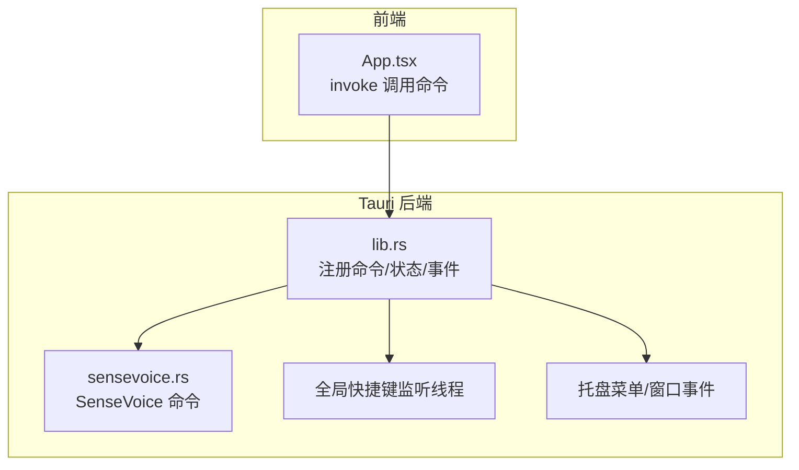
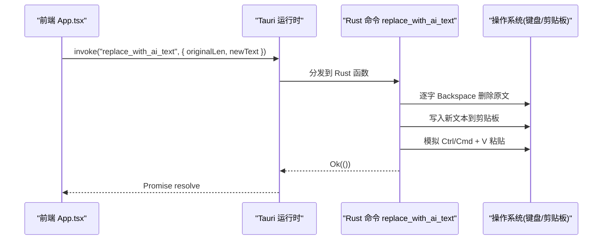
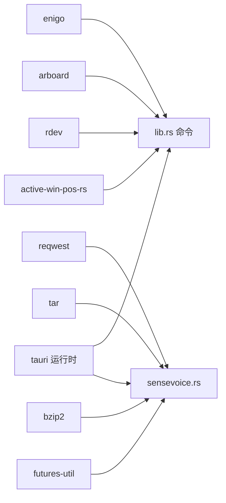

# Tauri Commands 接口

<cite>
**本文引用的文件**   
- [src-tauri/src/lib.rs](file://src-tauri/src/lib.rs)
- [src-tauri/src/sensevoice.rs](file://src-tauri/src/sensevoice.rs)
- [src/App.tsx](file://src/App.tsx)
- [src-tauri/Cargo.toml](file://src-tauri/Cargo.toml)
- [src-tauri/tauri.conf.json](file://src-tauri/tauri.conf.json)
</cite>

## 目录
1. [简介](#简介)
2. [项目结构](#项目结构)
3. [核心组件](#核心组件)
4. [架构总览](#架构总览)
5. [详细命令文档](#详细命令文档)
6. [依赖分析](#依赖分析)
7. [性能考量](#性能考量)
8. [故障排查指南](#故障排查指南)
9. [结论](#结论)
10. [附录：前端调用示例与最佳实践](#附录前端调用示例与最佳实践)

## 简介
本文件为 VoiceFlow_AI_002 的 Tauri Commands 接口提供完整 API 文档，覆盖所有后端 Rust 函数暴露给前端的命令。重点包括系统级功能如 set_listen_key、set_blacklist、simulate_typing、replace_with_ai_text，以及 SenseVoice 相关的 check_sensevoice_ready、download_sensevoice、transcribe_sensevoice。文档包含参数类型、返回值格式、错误处理机制、异步行为说明，并提供 TypeScript 调用示例、安全考虑、性能影响与最佳实践。

## 项目结构
后端命令集中在 src-tauri 目录中：
- lib.rs：注册全局状态、快捷键监听线程、托盘菜单、窗口事件，并通过 tauri::generate_handler! 暴露命令。
- sensevoice.rs：SenseVoice 引擎与模型下载、解压、就绪检查与转写命令。
- Cargo.toml：声明依赖（enigo、arboard、rdev、reqwest、tar、bzip2 等）。
- tauri.conf.json：应用配置、窗口定义与安全策略。

图表来源
- [src-tauri/src/lib.rs:275-283](file://src-tauri/src/lib.rs#L275-L283)
- [src-tauri/src/sensevoice.rs:295-476](file://src-tauri/src/sensevoice.rs#L295-L476)
- [src/App.tsx:195-206](file://src/App.tsx#L195-L206)

章节来源
- [src-tauri/src/lib.rs:1-287](file://src-tauri/src/lib.rs#L1-L287)
- [src-tauri/src/sensevoice.rs:1-476](file://src-tauri/src/sensevoice.rs#L1-L476)
- [src-tauri/Cargo.toml:20-36](file://src-tauri/Cargo.toml#L20-L36)
- [src-tauri/tauri.conf.json:12-46](file://src-tauri/tauri.conf.json#L12-L46)

## 核心组件
- 全局状态 AppState：保存当前监听键与黑名单列表，使用 RwLock 保证并发读写安全。
- 快捷键监听：后台线程通过 rdev 监听目标按键，结合黑名单过滤后向前端发射 shortcut-state 事件。
- 剪贴板与键盘模拟：通过 arboard 与 enigo 实现文本粘贴与按键模拟，用于 simulate_typing 与 replace_with_ai_text。
- SenseVoice 管理：下载引擎与模型、解压校验、就绪检测与转写调用外部 sherpa-onnx 可执行文件。

章节来源
- [src-tauri/src/lib.rs:18-22](file://src-tauri/src/lib.rs#L18-L22)
- [src-tauri/src/lib.rs:140-212](file://src-tauri/src/lib.rs#L140-L212)
- [src-tauri/src/sensevoice.rs:295-476](file://src-tauri/src/sensevoice.rs#L295-L476)

## 架构总览
以下序列图展示前端通过 invoke 调用后端命令的典型流程，以 replace_with_ai_text 为例：

图表来源
- [src-tauri/src/lib.rs:77-118](file://src-tauri/src/lib.rs#L77-L118)
- [src/App.tsx:581-589](file://src/App.tsx#L581-L589)

## 详细命令文档

### 通用约定
- 调用方式：前端通过 @tauri-apps/api/core 的 invoke 调用。
- 返回值：所有命令返回 Result<T, String>，成功时 Promise 解析为 T，失败时抛出字符串错误信息。
- 异步：部分命令为 async（SenseVoice 相关），其余为同步命令但内部可能涉及 I/O 或系统调用。
- 事件：部分命令会触发事件（如 download-progress、shortcut-state），需在前端使用 listen 订阅。

章节来源
- [src-tauri/src/lib.rs:275-283](file://src-tauri/src/lib.rs#L275-L283)
- [src-tauri/src/sensevoice.rs:295-476](file://src-tauri/src/sensevoice.rs#L295-L476)

---

### set_listen_key
- 描述：设置全局快捷键监听的目标键位（例如 RControl）。
- 参数：
  - key: string（目标键名）
- 返回：Result<(), String>
- 错误处理：若状态锁获取失败，返回错误字符串。
- 异步行为：同步命令。
- 副作用：更新全局 AppState.listen_key，影响后续快捷键监听逻辑。
- 安全考虑：仅允许应用内可信代码设置；避免用户输入直接作为键名未经验证。
- 性能影响：极小，仅为内存赋值。

章节来源
- [src-tauri/src/lib.rs:31-36](file://src-tauri/src/lib.rs#L31-L36)
- [src-tauri/src/lib.rs:140-156](file://src-tauri/src/lib.rs#L140-L156)

---

### set_blacklist
- 描述：设置黑名单应用名称列表，匹配时将拦截快捷键触发。
- 参数：
  - blacklist: string[]（应用名片段，大小写不敏感匹配）
- 返回：Result<(), String>
- 错误处理：同 set_listen_key。
- 异步行为：同步命令。
- 副作用：更新全局 AppState.blacklist。
- 安全考虑：建议对输入进行长度与字符集限制，防止异常数据。
- 性能影响：极小，内存赋值。

章节来源
- [src-tauri/src/lib.rs:38-43](file://src-tauri/src/lib.rs#L38-L43)
- [src-tauri/src/lib.rs:163-176](file://src-tauri/src/lib.rs#L163-L176)

---

### simulate_typing
- 描述：将指定文本复制到剪贴板并模拟粘贴，常用于即时上屏占位或最终文本。
- 参数：
  - text: string（要粘贴的文本）
- 返回：Result<(), String>
- 错误处理：剪贴板初始化或写入失败时返回错误字符串。
- 异步行为：同步命令，内部有短暂 sleep 等待系统处理粘贴事件。
- 平台差异：macOS 使用 Cmd+V，其他平台使用 Ctrl+V。
- 副作用：临时替换剪贴板内容，操作完成后尝试恢复原内容。
- 安全考虑：确保文本来源可信，避免注入恶意内容。
- 性能影响：I/O 与系统调用开销较小，sleep 带来轻微延迟。

章节来源
- [src-tauri/src/lib.rs:45-75](file://src-tauri/src/lib.rs#L45-L75)

---

### replace_with_ai_text
- 描述：先按 original_len 逐个 Backspace 删除已上屏文本，再将 new_text 粘贴到光标位置，实现“瞬时替换”。
- 参数：
  - original_len: number（待删除的字符数）
  - new_text: string（替换后的文本）
- 返回：Result<(), String>
- 错误处理：剪贴板操作失败返回错误字符串。
- 异步行为：同步命令，内部循环 Backspace 带微小延时以确保应用响应。
- 平台差异：粘贴快捷键同 simulate_typing。
- 副作用：临时替换剪贴板内容，操作完成后尝试恢复原内容。
- 安全考虑：original_len 应严格等于上次上屏文本长度，避免误删。
- 性能影响：逐字删除与粘贴存在一定系统交互开销，适合短文本快速替换。

章节来源
- [src-tauri/src/lib.rs:77-118](file://src-tauri/src/lib.rs#L77-L118)

---

### check_sensevoice_ready
- 描述：检查 SenseVoice 引擎与模型是否已就绪（存在可执行文件与模型文件）。
- 参数：无
- 返回：Result<bool, String>
- 错误处理：路径解析失败返回错误字符串。
- 异步行为：async 命令。
- 副作用：无。
- 安全考虑：读取应用数据目录，权限由 Tauri 沙箱控制。
- 性能影响：仅文件系统检查，开销很小。

章节来源
- [src-tauri/src/sensevoice.rs:295-307](file://src-tauri/src/sensevoice.rs#L295-L307)

---

### download_sensevoice
- 描述：下载并解压 SenseVoice 引擎与模型，支持多镜像源与断点重试，进度通过事件上报。
- 参数：无
- 返回：Result<(), String>
- 错误处理：网络请求、文件写入、解压失败均返回错误字符串。
- 异步行为：async 命令，内部使用 reqwest 流式下载与 futures-util 迭代。
- 事件：
  - download-progress：payload 为 { step: string, progress: number }，step 表示阶段，progress 为 0~1 进度。
- 副作用：在应用数据目录下创建/更新 sherpa-onnx 目录及模型文件。
- 安全考虑：下载自多个受信任源，校验文件大小；解压过程原子化以避免中间态污染。
- 性能影响：大文件下载与解压耗时较长，建议使用进度条与取消机制。

章节来源
- [src-tauri/src/sensevoice.rs:309-443](file://src-tauri/src/sensevoice.rs#L309-L443)
- [src-tauri/src/sensevoice.rs:83-181](file://src-tauri/src/sensevoice.rs#L83-L181)
- [src-tauri/src/sensevoice.rs:183-214](file://src-tauri/src/sensevoice.rs#L183-L214)

---

### transcribe_sensevoice
- 描述：调用本地 sherpa-onnx 可执行文件对音频进行转写，返回识别结果文本。
- 参数：
  - audio_path: string（WAV 文件绝对路径）
- 返回：Result<string, String>
- 错误处理：进程启动或输出解析失败返回错误字符串。
- 异步行为：async 命令。
- 副作用：读取模型与 tokens 文件，执行外部程序。
- 安全考虑：audio_path 应由应用生成并位于应用数据目录，避免任意路径执行。
- 性能影响：取决于模型大小与音频时长，通常秒级完成。

章节来源
- [src-tauri/src/sensevoice.rs:445-476](file://src-tauri/src/sensevoice.rs#L445-L476)

## 依赖分析
- 系统交互依赖：
  - enigo：跨平台键盘模拟。
  - arboard：剪贴板访问。
  - rdev：全局按键监听。
  - active-win-pos-rs：获取活动窗口信息。
- 网络与文件：
  - reqwest：HTTP 下载。
  - tar、bzip2：压缩归档解压。
  - futures-util：异步流处理。
- Tauri 生态：
  - tauri-plugin-autostart、tauri-plugin-opener：自动启动与打开链接。
  - tauri::Manager、Emitter、State：应用状态管理与事件广播。

图表来源
- [src-tauri/Cargo.toml:20-36](file://src-tauri/Cargo.toml#L20-L36)
- [src-tauri/src/lib.rs:1-16](file://src-tauri/src/lib.rs#L1-L16)
- [src-tauri/src/sensevoice.rs:1-8](file://src-tauri/src/sensevoice.rs#L1-L8)

章节来源
- [src-tauri/Cargo.toml:20-36](file://src-tauri/Cargo.toml#L20-L36)

## 性能考量
- 键盘模拟与剪贴板操作：
  - simulate_typing 与 replace_with_ai_text 涉及系统 I/O 与事件队列，应避免高频调用。
  - replace_with_ai_text 的逐字删除会带来额外时间开销，建议仅在必要场景使用。
- 全局快捷键监听：
  - rdev 监听线程常驻，CPU 占用极低，但需注意黑名单匹配与窗口信息查询的开销。
- SenseVoice 下载与解压：
  - 大文件下载与解压耗时较长，应在 UI 层显示进度与提示，避免阻塞主线程。
- 外部进程调用：
  - transcribe_sensevoice 启动外部可执行文件，注意进程生命周期与资源释放。

[本节为通用指导，无需具体文件引用]

## 故障排查指南
- 快捷键无效：
  - 检查 set_listen_key 是否正确设置，确认黑名单未包含当前应用。
  - 观察前端收到的 shortcut-state 事件，确认 pressed 状态变化。
- 文本未上屏：
  - 检查 simulate_typing/replace_with_ai_text 的错误返回，确认剪贴板权限与目标应用焦点。
- SenseVoice 无法使用：
  - 先调用 check_sensevoice_ready，若未就绪则调用 download_sensevoice 并监听 download-progress。
  - 若下载失败，检查网络与镜像源可用性；查看错误字符串定位问题。
- 转写结果为空：
  - 检查音频文件路径与格式，确认 sherpa-onnx 可执行文件存在且模型文件完整。

章节来源
- [src-tauri/src/lib.rs:140-212](file://src-tauri/src/lib.rs#L140-L212)
- [src-tauri/src/sensevoice.rs:295-476](file://src-tauri/src/sensevoice.rs#L295-L476)

## 结论
本项目的 Tauri Commands 提供了完善的系统级能力，涵盖快捷键监听、剪贴板与键盘模拟、SenseVoice 引擎与模型管理。通过清晰的参数与错误返回、事件驱动与异步设计，前后端协作流畅。建议在集成时遵循安全与性能最佳实践，确保用户体验稳定可靠。

[本节为总结性内容，无需具体文件引用]

## 附录：前端调用示例与最佳实践

### 基本调用模式
- 导入 invoke 与 listen：
  - 使用 @tauri-apps/api/core 的 invoke 调用命令。
  - 使用 @tauri-apps/api/event 的 listen 订阅事件。
- 错误处理：
  - 所有命令返回 Promise，失败时抛出字符串错误，建议统一捕获并提示用户。

章节来源
- [src/App.tsx:195-206](file://src/App.tsx#L195-L206)

### 示例：设置监听键与黑名单
- 设置监听键：
  - 调用 set_listen_key，传入目标键名。
- 设置黑名单：
  - 调用 set_blacklist，传入应用名片段数组。
- 监听快捷键事件：
  - 订阅 shortcut-state，根据 pressed 状态开始/停止录音。

章节来源
- [src/App.tsx:236-240](file://src/App.tsx#L236-L240)
- [src/App.tsx:257-286](file://src/App.tsx#L257-L286)

### 示例：文本上屏与替换
- 上屏占位文本：
  - 调用 simulate_typing，传入占位文本。
- 替换已上屏文本：
  - 调用 replace_with_ai_text，传入 original_len 与 new_text。
- 注意事项：
  - original_len 必须准确，避免误删。
  - 在高频率场景下合并替换以减少系统调用。

章节来源
- [src/App.tsx:391-416](file://src/App.tsx#L391-L416)
- [src/App.tsx:444-450](file://src/App.tsx#L444-L450)
- [src/App.tsx:581-589](file://src/App.tsx#L581-L589)

### 示例：SenseVoice 下载与转写
- 检查就绪：
  - 调用 check_sensevoice_ready，若 false 则开始下载。
- 下载与解压：
  - 调用 download_sensevoice，并监听 download-progress 更新 UI。
- 转写音频：
  - 调用 transcribe_sensevoice，传入 WAV 文件路径，解析返回文本。

章节来源
- [src/App.tsx:195-206](file://src/App.tsx#L195-L206)
- [src/App.tsx:524-544](file://src/App.tsx#L524-L544)

### 安全与权限
- 剪贴板与键盘模拟：
  - 需要系统权限，确保应用在受信任环境中运行。
- 外部进程执行：
  - transcribe_sensevoice 调用外部可执行文件，路径与参数应由应用严格控制。
- CSP 与网络：
  - tauri.conf.json 中的 CSP 允许 https 连接，确保下载源可信。

章节来源
- [src-tauri/tauri.conf.json:44-46](file://src-tauri/tauri.conf.json#L44-L46)

### 最佳实践
- 幂等性与容错：
  - 对重复调用进行去抖与合并，避免频繁系统调用。
- 用户反馈：
  - 在下载与转写过程中提供进度与错误提示。
- 资源清理：
  - 及时释放临时文件与关闭事件监听，避免内存泄漏。

[本节为通用指导，无需具体文件引用]