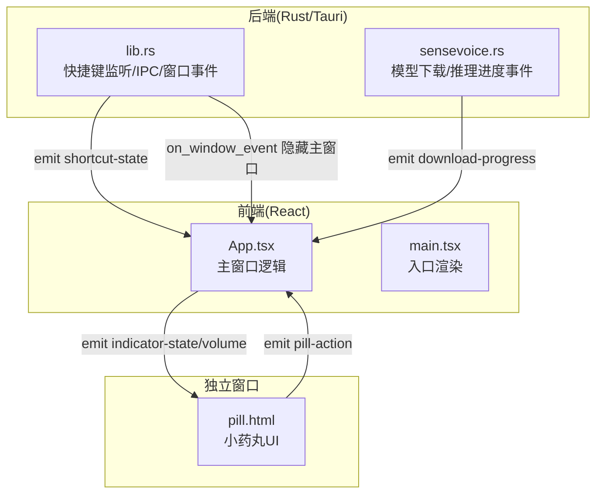
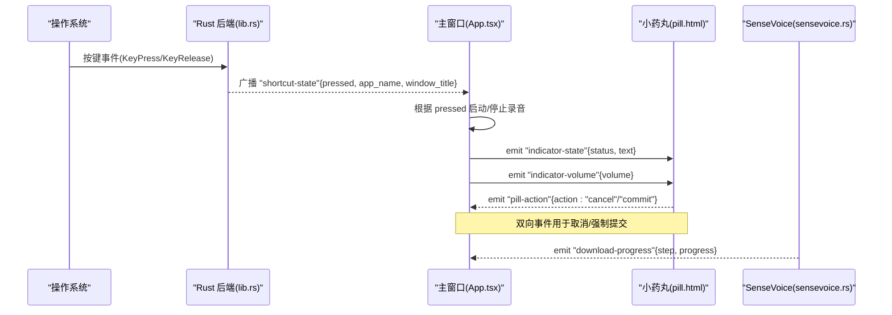
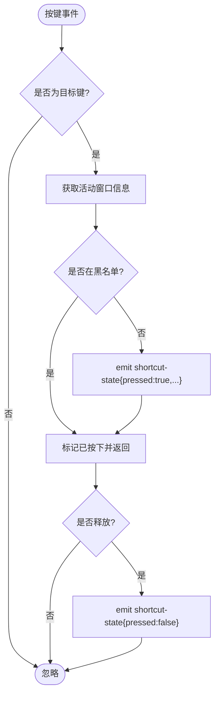
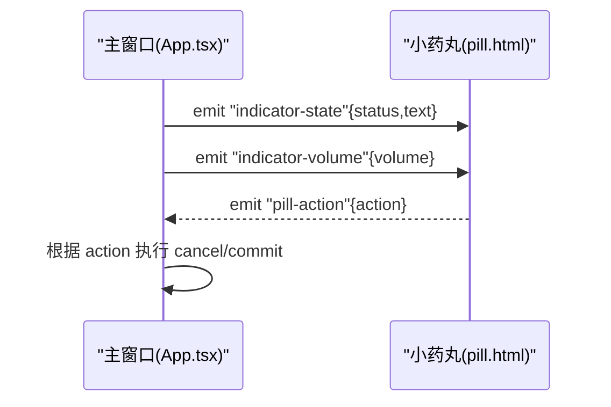
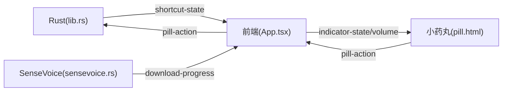

# 事件系统接口

<cite>
**本文引用的文件**
- [src/App.tsx](file://src/App.tsx)
- [src/main.tsx](file://src/main.tsx)
- [public/pill.html](file://public/pill.html)
- [src-tauri/src/lib.rs](file://src-tauri/src/lib.rs)
- [src-tauri/src/sensevoice.rs](file://src-tauri/src/sensevoice.rs)
</cite>

## 目录
1. [简介](#简介)
2. [项目结构](#项目结构)
3. [核心组件](#核心组件)
4. [架构总览](#架构总览)
5. [详细组件分析](#详细组件分析)
6. [依赖关系分析](#依赖关系分析)
7. [性能考虑](#性能考虑)
8. [故障排查指南](#故障排查指南)
9. [结论](#结论)
10. [附录：前端订阅与处理示例（路径指引）](#附录前端订阅与处理示例路径指引)

## 简介
本文件为 VoiceFlow_AI_002 的事件系统接口文档，聚焦以下三类事件：
- 全局快捷键事件：监听系统级按键按下/释放，触发应用录音流程。
- 窗口事件：主窗口关闭拦截、独立指示窗口的显隐与定位控制。
- 应用状态事件：在“主窗口”和“独立小药丸窗口”之间同步状态、音量与用户操作。

文档将详细说明 shortcut-state 事件的数据结构、事件监听方法、传播路径，并提供前端订阅与解绑的最佳实践、内存泄漏防护建议、性能优化与调试技巧。

## 项目结构
本项目采用 Tauri 架构：Rust 后端负责系统级输入监听与剪贴板/键盘模拟；React 前端负责 UI 与业务编排；独立 HTML 页面作为“小药丸”指示窗口，通过 Tauri 事件与主窗口通信。

图表来源
- [src/App.tsx:120-171](file://src/App.tsx#L120-L171)
- [public/pill.html:181-277](file://public/pill.html#L181-L277)
- [src-tauri/src/lib.rs:140-212](file://src-tauri/src/lib.rs#L140-L212)
- [src-tauri/src/lib.rs:265-274](file://src-tauri/src/lib.rs#L265-L274)
- [src-tauri/src/sensevoice.rs:139-146](file://src-tauri/src/sensevoice.rs#L139-L146)

章节来源
- [src/main.tsx:1-10](file://src/main.tsx#L1-L10)
- [src/App.tsx:120-171](file://src/App.tsx#L120-L171)
- [public/pill.html:181-277](file://public/pill.html#L181-L277)
- [src-tauri/src/lib.rs:140-212](file://src-tauri/src/lib.rs#L140-L212)
- [src-tauri/src/lib.rs:265-274](file://src-tauri/src/lib.rs#L265-L274)
- [src-tauri/src/sensevoice.rs:139-146](file://src-tauri/src/sensevoice.rs#L139-L146)

## 核心组件
- 全局快捷键监听器（Rust）：使用 rdev 监听目标键的 KeyPress/KeyRelease，结合黑名单策略，向所有 Webview 广播 shortcut-state 事件。
- 主窗口事件处理器（React）：监听 shortcut-state 并驱动录音流程；同时监听 pill-action 响应小药丸的取消/提交；维护 indicator 窗口状态与位置。
- 小药丸窗口（HTML）：接收 indicator-state 与 indicator-volume，展示波形与按钮；点击按钮后 emit pill-action 回主窗口。
- 下载进度事件（Rust→前端）：SenseVoice 引擎与模型下载过程中，周期性 emit download-progress 以更新 UI。

章节来源
- [src-tauri/src/lib.rs:140-212](file://src-tauri/src/lib.rs#L140-L212)
- [src/App.tsx:256-286](file://src/App.tsx#L256-L286)
- [public/pill.html:181-277](file://public/pill.html#L181-L277)
- [src-tauri/src/sensevoice.rs:139-146](file://src-tauri/src/sensevoice.rs#L139-L146)

## 架构总览
下图展示了关键事件的端到端流转路径，包括快捷键到录音、状态到小药丸、以及下载进度反馈。

图表来源
- [src-tauri/src/lib.rs:140-212](file://src-tauri/src/lib.rs#L140-L212)
- [src/App.tsx:120-171](file://src/App.tsx#L120-L171)
- [public/pill.html:181-277](file://public/pill.html#L181-L277)
- [src-tauri/src/sensevoice.rs:139-146](file://src-tauri/src/sensevoice.rs#L139-L146)

## 详细组件分析

### 全局快捷键事件（shortcut-state）
- 触发机制
  - Rust 侧使用 rdev 监听目标键（默认右 Ctrl），在按下时获取当前活动窗口信息（应用名、标题），并根据黑名单决定是否屏蔽。
  - 按下时 emit "shortcut-state"，payload.pressed=true，携带 app_name/window_title；释放时 emit payload.pressed=false。
- 数据结构
  - 字段说明
    - pressed: boolean，true 表示按下，false 表示释放
    - app_name: string?，当前活动应用名称（仅在按下时提供）
    - window_title: string?，当前活动窗口标题（仅在按下时提供）
- 事件传播路径
  - Rust 后端 → Tauri 事件总线 → 所有 Webview（含主窗口与小药丸）
- 前端处理方式
  - 主窗口在初始化时注册监听，收到 pressed=true 且未录音时开始录音；收到 pressed=false 且正在录音时停止并处理。
  - 若处于初始化阶段，忽略按键事件以避免竞态。
- 解绑与内存泄漏防护
  - 使用 listen 返回的 unlisten 函数在组件卸载时调用，确保移除监听器。
  - 避免重复注册监听，必要时在 useEffect 中清理旧监听。

图表来源
- [src-tauri/src/lib.rs:140-212](file://src-tauri/src/lib.rs#L140-L212)

章节来源
- [src-tauri/src/lib.rs:140-212](file://src-tauri/src/lib.rs#L140-L212)
- [src/App.tsx:256-286](file://src/App.tsx#L256-L286)

### 窗口事件（CloseRequested）
- 行为
  - 当主窗口触发 CloseRequested 时，阻止默认关闭，改为隐藏窗口并保持后台运行。
- 适用场景
  - 应用常驻后台，通过托盘或快捷键唤出主界面。

章节来源
- [src-tauri/src/lib.rs:265-274](file://src-tauri/src/lib.rs#L265-L274)

### 应用状态事件（indicator-state / indicator-volume / pill-action）
- 事件定义与用途
  - indicator-state：主窗口向小药丸广播当前状态（recording/transcribing/rewriting/success/error/idle），并在 success 时附带最终文本。
  - indicator-volume：主窗口每 50ms 计算一次 RMS 音量并推送给小药丸，用于动态波形动画。
  - pill-action：小药丸用户交互（取消/确认）回传至主窗口，触发取消录音或立即提交识别。
- 数据格式
  - indicator-state.payload: { status: string; errorMessage?: string; text?: string }
  - indicator-volume.payload: { volume: number }（0~100）
  - pill-action.payload: { action: "cancel" | "commit" }
- 传播路径
  - 主窗口 ↔ 小药丸：通过 WebviewWindow.emit/listen 进行跨窗口事件通信。
- 前端处理方式
  - 主窗口：在状态变化时 emit indicator-state；录音期间定时 emit indicator-volume；监听 pill-action 执行对应动作。
  - 小药丸：监听 indicator-state 切换 UI 类名与内容；监听 indicator-volume 调整波形条高度；点击按钮 emit pill-action。

图表来源
- [src/App.tsx:120-171](file://src/App.tsx#L120-L171)
- [src/App.tsx:289-354](file://src/App.tsx#L289-L354)
- [public/pill.html:181-277](file://public/pill.html#L181-L277)

章节来源
- [src/App.tsx:120-171](file://src/App.tsx#L120-L171)
- [src/App.tsx:289-354](file://src/App.tsx#L289-L354)
- [public/pill.html:181-277](file://public/pill.html#L181-L277)

### 下载进度事件（download-progress）
- 触发时机
  - 下载 SenseVoice 引擎与模型时，按下载字节数计算进度并 emit。
- 数据格式
  - step: string，当前步骤描述
  - progress: number，0~1 的完成度
- 前端处理方式
  - 主窗口在需要下载时注册监听，更新模型进度与步骤提示，完成后自动解绑。

章节来源
- [src-tauri/src/sensevoice.rs:139-146](file://src-tauri/src/sensevoice.rs#L139-L146)
- [src/App.tsx:196-221](file://src/App.tsx#L196-L221)

## 依赖关系分析
- 模块耦合
  - Rust 后端与前端通过 Tauri 事件总线松耦合；主窗口与小药丸通过 WebviewWindow 事件通信。
- 外部依赖
  - rdev：系统级按键监听
  - enigo + arboard：剪贴板读写与键盘模拟
  - reqwest + tar/bzip2：远程资源下载与解压
- 潜在循环依赖
  - 事件单向广播为主，未见直接循环依赖；注意避免在事件回调中再次触发相同事件导致环路。

图表来源
- [src-tauri/src/lib.rs:140-212](file://src-tauri/src/lib.rs#L140-L212)
- [src/App.tsx:256-286](file://src/App.tsx#L256-L286)
- [public/pill.html:181-277](file://public/pill.html#L181-L277)
- [src-tauri/src/sensevoice.rs:139-146](file://src-tauri/src/sensevoice.rs#L139-L146)

章节来源
- [src-tauri/src/lib.rs:140-212](file://src-tauri/src/lib.rs#L140-L212)
- [src/App.tsx:256-286](file://src/App.tsx#L256-L286)
- [public/pill.html:181-277](file://public/pill.html#L181-L277)
- [src-tauri/src/sensevoice.rs:139-146](file://src-tauri/src/sensevoice.rs#L139-L146)

## 性能考虑
- 事件频率控制
  - indicator-volume 每 50ms 发送一次，属于高频事件。建议在非 recording 状态及时清除定时器，避免无谓开销。
- 批量与节流
  - 对于非实时 UI 更新，可考虑在前端对事件进行节流或合并，减少 DOM 重排。
- 监听器管理
  - 严格在组件卸载时调用 unlisten，防止重复注册导致的内存泄漏与重复回调。
- I/O 与阻塞
  - 避免在事件回调中使用 await 阻塞高频定时器；如 App.tsx 中对 indicator-volume 的 emit 使用 catch 而非 await，值得借鉴。
- 资源占用
  - 音频分析器与定时器应在合适时机销毁；小药丸窗口保持最小化与透明背景以减少渲染压力。

[本节为通用指导，不直接分析具体文件]

## 故障排查指南
- 快捷键无响应
  - 检查目标键配置与黑名单是否包含当前应用名；查看 Rust 日志输出。
  - 确认前端未在初始化阶段忽略事件。
- 小药丸无显示或不更新
  - 确认主窗口能获取到 indicator 窗口实例；检查 indicator-state 与 indicator-volume 是否成功 emit。
  - 检查小药丸是否正确加载 Tauri event API。
- 下载进度不更新
  - 确认前端在下载前注册了 download-progress 监听，并在完成后正确解绑。
- 内存泄漏迹象
  - 检查是否存在多次注册同一事件监听而未清理；确认 useEffect 的清理函数被调用。

章节来源
- [src-tauri/src/lib.rs:140-212](file://src-tauri/src/lib.rs#L140-L212)
- [src/App.tsx:256-286](file://src/App.tsx#L256-L286)
- [public/pill.html:181-277](file://public/pill.html#L181-L277)
- [src-tauri/src/sensevoice.rs:139-146](file://src-tauri/src/sensevoice.rs#L139-L146)

## 结论
本事件系统通过 Rust 后端的全局按键监听与 Tauri 事件总线，实现了跨进程、跨窗口的高效通信。主窗口与小药丸之间的双向事件设计使得用户体验流畅且可控。遵循严格的监听器生命周期管理与性能优化策略，可进一步提升稳定性与效率。

[本节为总结性内容，不直接分析具体文件]

## 附录：前端订阅与处理示例（路径指引）
- 订阅全局快捷键事件（shortcut-state）
  - 参考路径：[src/App.tsx:256-286](file://src/App.tsx#L256-L286)
  - 要点：在 useEffect 内使用 listen 注册监听，返回 unlisten 并在清理时调用；在初始化阶段忽略按键事件。
- 订阅下载进度事件（download-progress）
  - 参考路径：[src/App.tsx:196-221](file://src/App.tsx#L196-L221)
  - 要点：在下载前注册监听，完成后调用 unlisten；更新 UI 进度与步骤。
- 主窗口与小药丸的状态同步（indicator-state / indicator-volume）
  - 参考路径：
    - 主窗口 emit：[src/App.tsx:120-171](file://src/App.tsx#L120-L171)
    - 主窗口音量广播：[src/App.tsx:289-354](file://src/App.tsx#L289-L354)
    - 小药丸监听与交互：[public/pill.html:181-277](file://public/pill.html#L181-L277)
- 小药丸回传操作（pill-action）
  - 参考路径：
    - 主窗口监听：[src/App.tsx:356-371](file://src/App.tsx#L356-L371)
    - 小药丸触发：[public/pill.html:271-277](file://public/pill.html#L271-L277)

章节来源
- [src/App.tsx:120-171](file://src/App.tsx#L120-L171)
- [src/App.tsx:196-221](file://src/App.tsx#L196-L221)
- [src/App.tsx:256-286](file://src/App.tsx#L256-L286)
- [src/App.tsx:289-354](file://src/App.tsx#L289-L354)
- [src/App.tsx:356-371](file://src/App.tsx#L356-L371)
- [public/pill.html:181-277](file://public/pill.html#L181-L277)