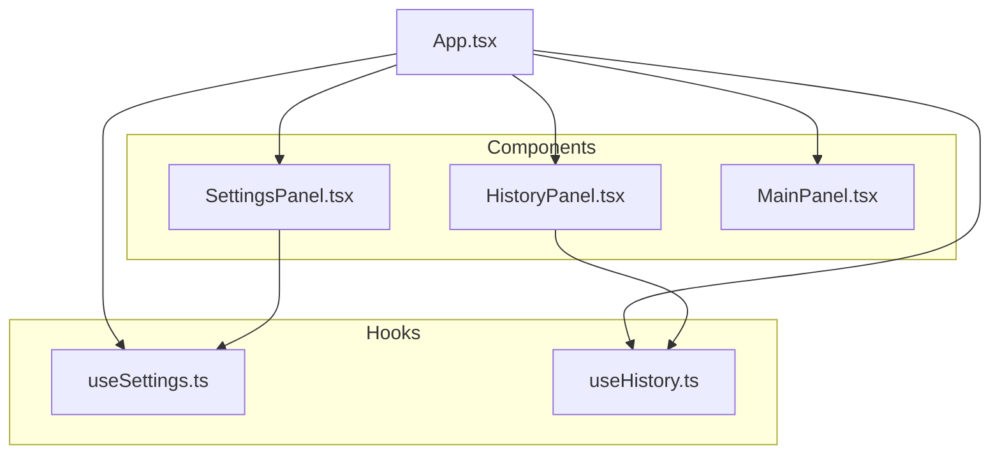
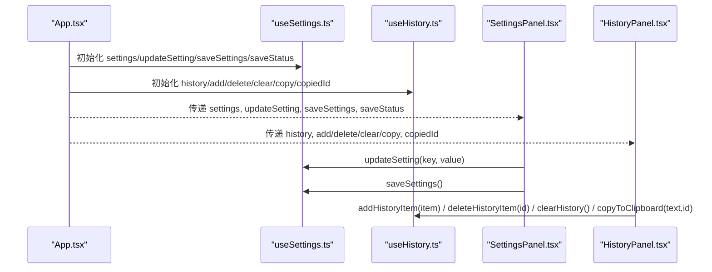
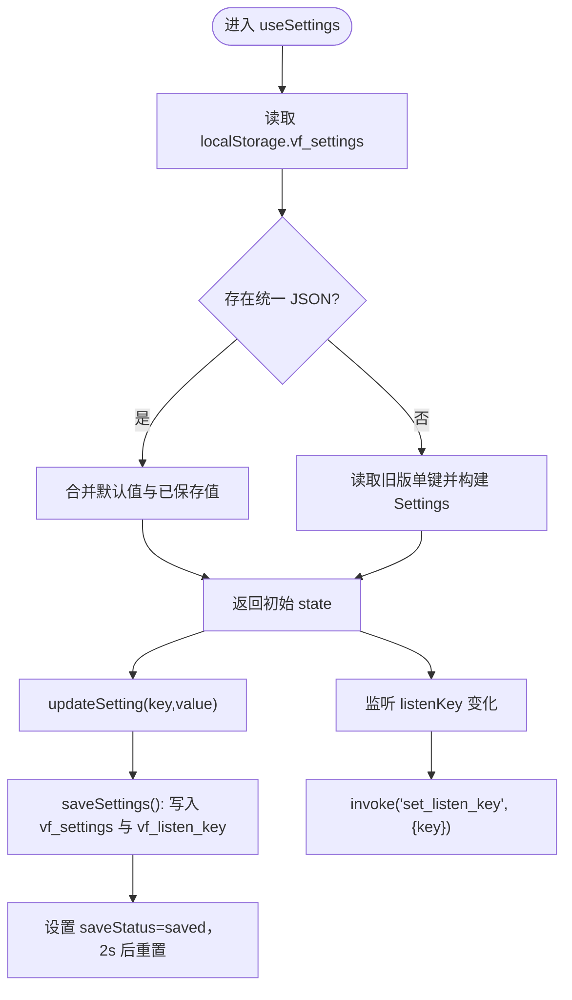
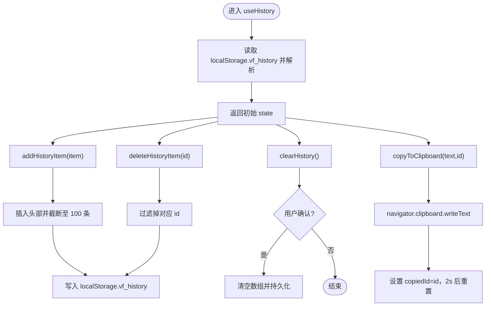
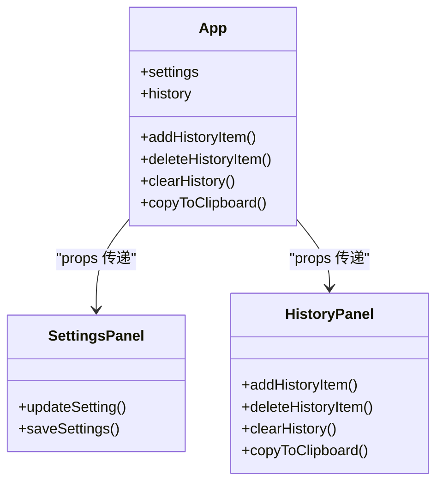
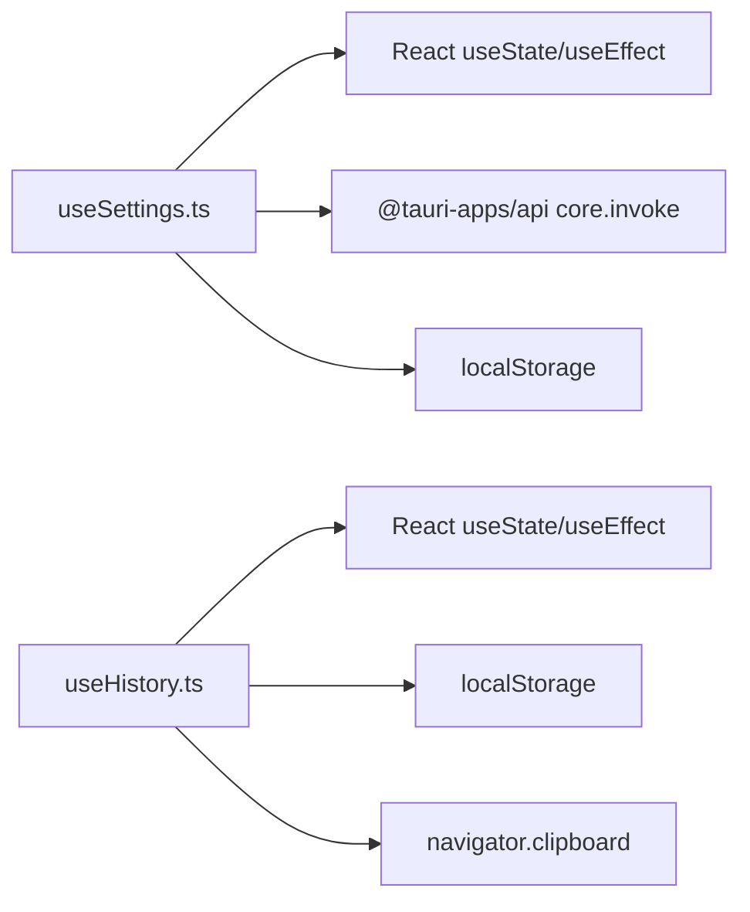

# 前端 Hooks API

<cite>
**本文引用的文件**   
- [useSettings.ts](file://src/hooks/useSettings.ts)
- [useHistory.ts](file://src/hooks/useHistory.ts)
- [App.tsx](file://src/App.tsx)
- [SettingsPanel.tsx](file://src/components/SettingsPanel.tsx)
- [HistoryPanel.tsx](file://src/components/HistoryPanel.tsx)
- [MainPanel.tsx](file://src/components/MainPanel.tsx)
</cite>

## 目录
1. [简介](#简介)
2. [项目结构](#项目结构)
3. [核心组件与 Hook 概览](#核心组件与-hook-概览)
4. [架构总览](#架构总览)
5. [详细组件分析](#详细组件分析)
6. [依赖关系分析](#依赖关系分析)
7. [性能与可用性建议](#性能与可用性建议)
8. [故障排查指南](#故障排查指南)
9. [结论](#结论)
10. [附录：使用示例与最佳实践](#附录使用示例与最佳实践)

## 简介
本文件为 VoiceFlow_AI_002 的前端 Hooks API 提供完整的使用文档，重点覆盖以下自定义 Hook：
- useSettings：集中管理应用设置（包括 ASR、LLM、快捷键、黑名单等），负责本地持久化与后端同步。
- useHistory：维护听写与优化历史记录，支持增删改查、复制与本地持久化。

文档将详细说明每个 Hook 的功能、参数、返回值、状态管理机制、数据持久化策略、生命周期行为，并提供在组件中的正确使用方式、错误处理与协作模式的最佳实践。

## 项目结构
本项目采用 React + Tauri 的桌面应用架构，前端代码位于 src 目录。与 Hooks 相关的核心文件如下：
- hooks：自定义 Hook 实现
- components：页面面板组件，消费上述 Hook
- App.tsx：应用入口，组合并分发 Hook 能力到各面板

图表来源
- [useSettings.ts:1-97](file://src/hooks/useSettings.ts#L1-L97)
- [useHistory.ts:1-70](file://src/hooks/useHistory.ts#L1-L70)
- [App.tsx:24-28](file://src/App.tsx#L24-L28)
- [SettingsPanel.tsx:1-344](file://src/components/SettingsPanel.tsx#L1-L344)
- [HistoryPanel.tsx:1-103](file://src/components/HistoryPanel.tsx#L1-L103)
- [MainPanel.tsx:1-127](file://src/components/MainPanel.tsx#L1-L127)

章节来源
- [App.tsx:24-28](file://src/App.tsx#L24-L28)
- [useSettings.ts:1-97](file://src/hooks/useSettings.ts#L1-L97)
- [useHistory.ts:1-70](file://src/hooks/useHistory.ts#L1-L70)

## 核心组件与 Hook 概览
- useSettings
  - 职责：加载、更新、保存全局设置；向后端同步快捷键；兼容旧版单键存储格式。
  - 持久化：localStorage 中统一 JSON 对象 vf_settings，同时保留部分旧键用于兼容。
  - 副作用：监听 listenKey 变化，调用 Rust 后端 set_listen_key。
- useHistory
  - 职责：维护历史列表、添加/删除/清空记录、复制到剪贴板。
  - 持久化：localStorage 中数组 vf_history，限制最多 100 条。
  - 副作用：初始化时从 localStorage 恢复历史。

章节来源
- [useSettings.ts:36-96](file://src/hooks/useSettings.ts#L36-L96)
- [useHistory.ts:12-69](file://src/hooks/useHistory.ts#L12-L69)

## 架构总览
Hook 在 App 中被实例化，并通过 props 下发至 SettingsPanel 与 HistoryPanel。App 自身也直接消费这些 Hook 提供的能力（如写入历史、读取设置）。

图表来源
- [App.tsx:86-87](file://src/App.tsx#L86-L87)
- [App.tsx:754-765](file://src/App.tsx#L754-L765)
- [App.tsx:744-750](file://src/App.tsx#L744-L750)
- [useSettings.ts:36-96](file://src/hooks/useSettings.ts#L36-L96)
- [useHistory.ts:12-69](file://src/hooks/useHistory.ts#L12-L69)

## 详细组件分析

### useSettings 详解
- 功能要点
  - 默认值：内置一组合理的默认配置，涵盖 LLM、ASR、快捷键、黑名单等。
  - 初始化策略：优先读取统一 JSON 对象 vf_settings；若不存在则回退到旧版单键（vf_api_key、vf_base_url 等）进行合并。
  - 更新机制：updateSetting 通过函数式 setState 增量更新指定字段。
  - 保存机制：saveSettings 将当前 settings 序列化为 JSON 写入 vf_settings，同时将 listenKey 单独写入 vf_listen_key 以兼容后端；保存后短暂显示“已保存”状态。
  - 后端同步：当 listenKey 变化时，自动调用 Rust 命令 set_listen_key 同步快捷键。
  - 错误处理：加载失败时捕获异常并输出日志，最终返回默认配置。

- 状态与返回值
  - settings：当前设置对象（类型见接口定义）
  - updateSetting：泛型方法，按 key 更新单个字段
  - saveSettings：触发保存流程
  - saveStatus：保存状态 idle/saved

- 数据持久化策略
  - 主存储：localStorage.vf_settings（JSON 对象）
  - 兼容存储：多个 vf_* 单键（仅用于迁移/回退）
  - 后端同步：listenKey 变更即同步

- 生命周期
  - 组件挂载时：尝试从 localStorage 恢复设置，失败则使用默认值
  - 每次 listenKey 变更：触发一次后端同步

- 使用场景
  - 设置面板渲染表单并双向绑定
  - 保存按钮触发持久化
  - 快捷键切换时自动通知后端

- 复杂度与性能
  - 更新为 O(1) 字段级替换
  - 保存为 O(n) 序列化（n 为设置项数量，较小）
  - 副作用仅在 listenKey 变化时执行

图表来源
- [useSettings.ts:36-96](file://src/hooks/useSettings.ts#L36-L96)

章节来源
- [useSettings.ts:4-34](file://src/hooks/useSettings.ts#L4-L34)
- [useSettings.ts:36-96](file://src/hooks/useSettings.ts#L36-L96)

### useHistory 详解
- 功能要点
  - 历史记录项结构包含 id、时间戳、原始文本、优化文本、风格、是否成功等。
  - 初始化：从 localStorage.vf_history 恢复历史，解析失败则忽略。
  - 新增：addHistoryItem 将新项插入头部，并截断至最多 100 条，随后持久化。
  - 删除：deleteHistoryItem 按 id 过滤并持久化。
  - 清空：clearHistory 二次确认后清空并持久化。
  - 复制：copyToClipboard 调用浏览器剪贴板 API，成功后短暂标记 copiedId。

- 状态与返回值
  - history：历史数组
  - addHistoryItem：添加一条记录
  - deleteHistoryItem：删除某条记录
  - clearHistory：清空全部
  - copyToClipboard：复制文本并反馈 copiedId
  - copiedId：最近一次复制成功的记录 id

- 数据持久化策略
  - 主存储：localStorage.vf_history（JSON 数组）
  - 容量控制：最多保留 100 条

- 生命周期
  - 组件挂载时：恢复历史
  - 每次增删操作：立即持久化

- 使用场景
  - 历史面板展示与交互
  - 主流程完成后追加记录

- 复杂度与性能
  - 新增/删除为 O(n) 数组操作（n≤100，开销很小）
  - 复制为异步剪贴板操作，非阻塞 UI

图表来源
- [useHistory.ts:12-69](file://src/hooks/useHistory.ts#L12-L69)

章节来源
- [useHistory.ts:3-10](file://src/hooks/useHistory.ts#L3-L10)
- [useHistory.ts:12-69](file://src/hooks/useHistory.ts#L12-L69)

### 组件与 Hook 的协作模式
- App.tsx
  - 同时调用 useSettings 与 useHistory，并将能力分别传递给 SettingsPanel 与 HistoryPanel。
  - 在语音识别流程结束后，根据是否启用 AI 润色决定是否写入历史。
- SettingsPanel.tsx
  - 通过 updateSetting 响应表单输入，通过 saveSettings 触发保存。
- HistoryPanel.tsx
  - 通过 addHistoryItem/deleteHistoryItem/clearHistory/copyToClipboard 与用户交互。

图表来源
- [App.tsx:86-87](file://src/App.tsx#L86-L87)
- [App.tsx:744-765](file://src/App.tsx#L744-L765)
- [SettingsPanel.tsx:17-26](file://src/components/SettingsPanel.tsx#L17-L26)
- [HistoryPanel.tsx:14-20](file://src/components/HistoryPanel.tsx#L14-L20)

章节来源
- [App.tsx:86-87](file://src/App.tsx#L86-L87)
- [App.tsx:744-765](file://src/App.tsx#L744-L765)
- [SettingsPanel.tsx:17-26](file://src/components/SettingsPanel.tsx#L17-L26)
- [HistoryPanel.tsx:14-20](file://src/components/HistoryPanel.tsx#L14-L20)

## 依赖关系分析
- useSettings
  - 依赖 React 的 useState、useEffect
  - 依赖 Tauri invoke 与 Rust 命令 set_listen_key
  - 依赖 localStorage
- useHistory
  - 依赖 React 的 useState、useEffect
  - 依赖 localStorage 与 navigator.clipboard

图表来源
- [useSettings.ts:1-2](file://src/hooks/useSettings.ts#L1-L2)
- [useHistory.ts:1-1](file://src/hooks/useHistory.ts#L1-L1)

章节来源
- [useSettings.ts:1-2](file://src/hooks/useSettings.ts#L1-L2)
- [useHistory.ts:1-1](file://src/hooks/useHistory.ts#L1-L1)

## 性能与可用性建议
- 批量更新设置
  - 当前 updateSetting 为单字段更新，如需批量修改可考虑在组件层合并后再调用，或扩展 Hook 提供 batchUpdate。
- 防抖保存
  - 当前 saveSettings 由用户显式触发，避免频繁 I/O；若改为自动保存，建议加入防抖。
- 历史容量
  - 已限制 100 条，满足日常使用；如需长期归档，可考虑分层存储或导出功能。
- 剪贴板兼容性
  - 复制操作在非安全上下文可能受限，建议在 UI 上给出提示或降级方案。

[本节为通用建议，不直接分析具体文件]

## 故障排查指南
- 设置加载失败
  - 现象：控制台报错“Failed to load settings”，最终使用默认值。
  - 排查：检查 localStorage 中 vf_settings 是否为合法 JSON；清理无效数据后重试。
- 快捷键不同步
  - 现象：修改快捷键后未生效。
  - 排查：确认后端命令 set_listen_key 是否可用；查看控制台是否有 invoke 错误。
- 历史为空或丢失
  - 现象：刷新后无历史。
  - 排查：检查 localStorage.vf_history 是否存在且格式正确；确认 add/delete/clear 是否被调用。
- 复制失败
  - 现象：点击复制无反馈。
  - 排查：确认浏览器环境允许剪贴板访问；检查 copiedId 是否在 2 秒内出现。

章节来源
- [useSettings.ts:63-66](file://src/hooks/useSettings.ts#L63-L66)
- [useHistory.ts:21-24](file://src/hooks/useHistory.ts#L21-L24)
- [useHistory.ts:54-59](file://src/hooks/useHistory.ts#L54-L59)

## 结论
useSettings 与 useHistory 提供了清晰的状态管理与持久化能力，配合 App 的分发逻辑，形成了稳定的前后端协同与 UI 交互闭环。遵循本文档的用法与最佳实践，可在保证一致性与可靠性的前提下高效扩展新功能。

[本节为总结性内容，不直接分析具体文件]

## 附录：使用示例与最佳实践

- 在组件中使用 useSettings
  - 订阅设置：解构 settings 并在表单中双向绑定
  - 更新设置：调用 updateSetting(key, value)
  - 保存设置：调用 saveSettings()，并根据 saveStatus 提供反馈
  - 注意：listenKey 变化会自动同步后端，无需手动处理

- 在组件中使用 useHistory
  - 订阅历史：解构 history 并渲染列表
  - 添加记录：在业务流程结束时调用 addHistoryItem({id, timestamp, rawText, refinedText, style, success})
  - 删除/清空：按需调用 deleteHistoryItem(id) 或 clearHistory()
  - 复制结果：调用 copyToClipboard(text, id)，并根据 copiedId 显示“已复制”

- 与 App 协作
  - App 在识别成功后根据是否启用 AI 润色决定是否写入历史
  - 设置面板与历史面板通过 props 接收 Hook 暴露的方法，保持单向数据流

章节来源
- [App.tsx:86-87](file://src/App.tsx#L86-L87)
- [App.tsx:594-633](file://src/App.tsx#L594-L633)
- [SettingsPanel.tsx:17-26](file://src/components/SettingsPanel.tsx#L17-L26)
- [HistoryPanel.tsx:14-20](file://src/components/HistoryPanel.tsx#L14-L20)