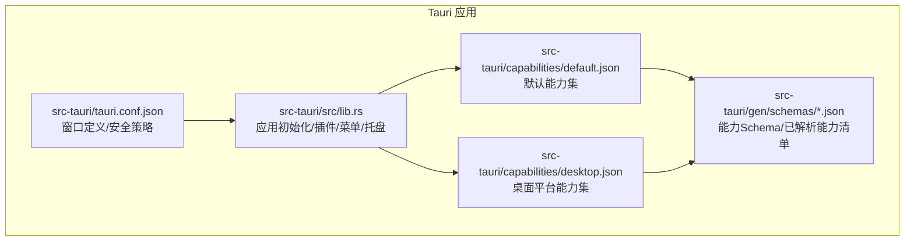
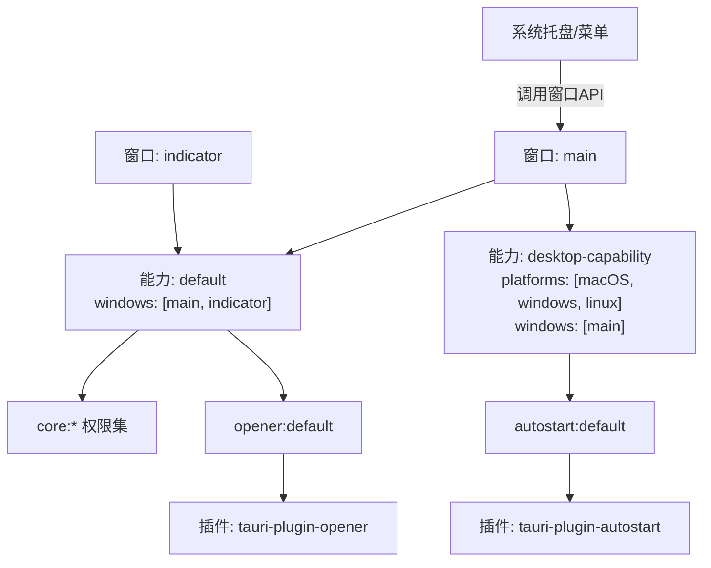
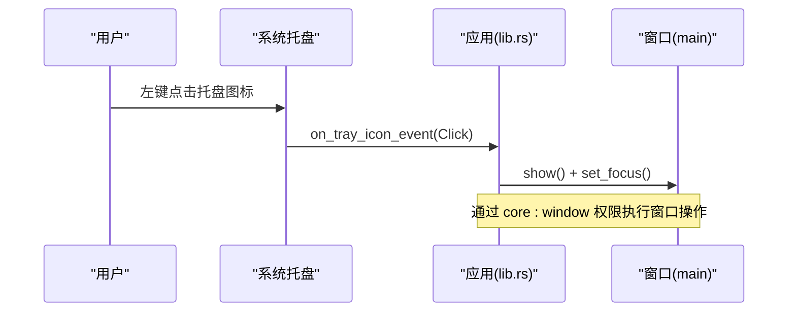
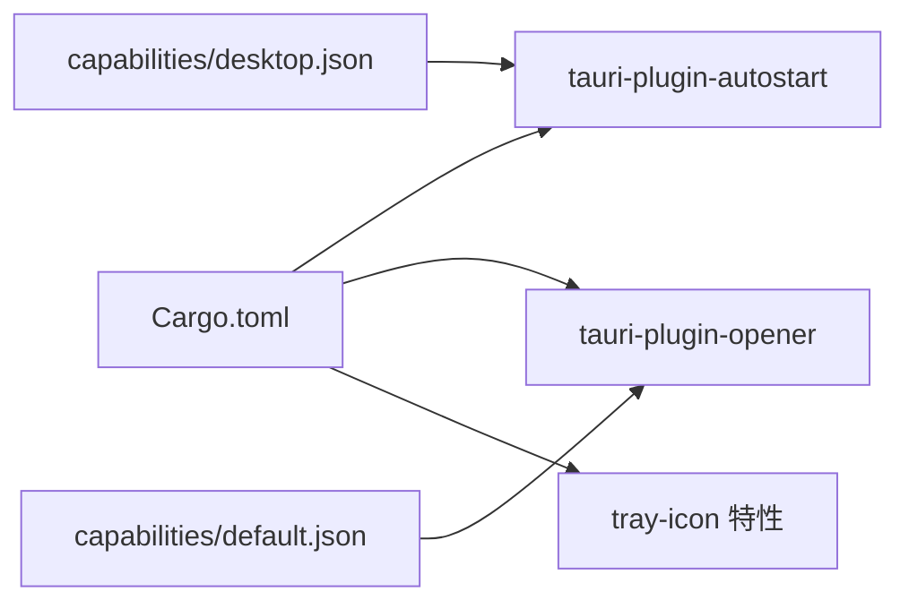

# 能力配置接口

<cite>
**本文引用的文件**
- [src-tauri/capabilities/default.json](file://src-tauri/capabilities/default.json)
- [src-tauri/capabilities/desktop.json](file://src-tauri/capabilities/desktop.json)
- [src-tauri/tauri.conf.json](file://src-tauri/tauri.conf.json)
- [src-tauri/gen/schemas/desktop-schema.json](file://src-tauri/gen/schemas/desktop-schema.json)
- [src-tauri/gen/schemas/capabilities.json](file://src-tauri/gen/schemas/capabilities.json)
- [src-tauri/src/lib.rs](file://src-tauri/src/lib.rs)
- [src-tauri/Cargo.toml](file://src-tauri/Cargo.toml)
</cite>

## 目录
1. [简介](#简介)
2. [项目结构](#项目结构)
3. [核心组件](#核心组件)
4. [架构总览](#架构总览)
5. [详细组件分析](#详细组件分析)
6. [依赖关系分析](#依赖关系分析)
7. [性能与安全性考量](#性能与安全性考量)
8. [故障排除指南](#故障排除指南)
9. [结论](#结论)
10. [附录：版本兼容性与迁移指南](#附录版本兼容性与迁移指南)

## 简介
本文件面向 VoiceFlow_AI_002 的能力配置系统，聚焦 Tauri v2 的“能力（Capability）”机制。能力配置文件用于声明式地控制前端窗口对 Tauri 内核、插件命令的访问权限，实现最小权限原则和细粒度安全隔离。本文重点解释 default.json 与 desktop.json 的作用、字段含义、权限模型，并结合 tauri.conf.json 中的窗口定义说明菜单、系统托盘、自动启动等能力的生效范围与使用方式。同时提供修改指导原则、安全注意事项、常见问题排查以及版本兼容与迁移建议。

## 项目结构
本项目采用 Tauri v2 工程结构，能力相关配置位于 src-tauri/capabilities 目录下，由构建时生成 schema 并校验；应用主入口在 src-tauri/src/lib.rs 中完成插件注册、菜单与托盘初始化、事件处理与 IPC 命令暴露。

图表来源
- [src-tauri/src/lib.rs:215-286](file://src-tauri/src/lib.rs#L215-L286)
- [src-tauri/tauri.conf.json:12-46](file://src-tauri/tauri.conf.json#L12-L46)
- [src-tauri/capabilities/default.json:1-18](file://src-tauri/capabilities/default.json#L1-L18)
- [src-tauri/capabilities/desktop.json:1-14](file://src-tauri/capabilities/desktop.json#L1-L14)
- [src-tauri/gen/schemas/capabilities.json:1-1](file://src-tauri/gen/schemas/capabilities.json#L1-L1)

章节来源
- [src-tauri/capabilities/default.json:1-18](file://src-tauri/capabilities/default.json#L1-L18)
- [src-tauri/capabilities/desktop.json:1-14](file://src-tauri/capabilities/desktop.json#L1-L14)
- [src-tauri/tauri.conf.json:12-46](file://src-tauri/tauri.conf.json#L12-L46)
- [src-tauri/src/lib.rs:215-286](file://src-tauri/src/lib.rs#L215-L286)

## 核心组件
- 能力文件
  - default.json：为 main 与 indicator 两个窗口提供基础能力集合，包含窗口控制、事件、Webview 与打开链接等常用权限。
  - desktop.json：为桌面平台（macOS、Windows、Linux）的 main 窗口额外授予自动启动能力。
- 窗口定义
  - tauri.conf.json 中定义了 label 为 main 与 indicator 的两个窗口，能力通过 windows 列表匹配生效。
- 运行时行为
  - lib.rs 中注册了 autostart 与 opener 插件，并在 setup 阶段创建系统托盘与菜单项，绑定显示/退出逻辑。

章节来源
- [src-tauri/capabilities/default.json:1-18](file://src-tauri/capabilities/default.json#L1-L18)
- [src-tauri/capabilities/desktop.json:1-14](file://src-tauri/capabilities/desktop.json#L1-L14)
- [src-tauri/tauri.conf.json:12-46](file://src-tauri/tauri.conf.json#L12-L46)
- [src-tauri/src/lib.rs:215-286](file://src-tauri/src/lib.rs#L215-L286)

## 架构总览
下图展示了能力系统与窗口、插件之间的关联关系，以及菜单/托盘与能力权限的交互路径。

图表来源
- [src-tauri/capabilities/default.json:1-18](file://src-tauri/capabilities/default.json#L1-L18)
- [src-tauri/capabilities/desktop.json:1-14](file://src-tauri/capabilities/desktop.json#L1-L14)
- [src-tauri/tauri.conf.json:12-46](file://src-tauri/tauri.conf.json#L12-L46)
- [src-tauri/src/lib.rs:215-286](file://src-tauri/src/lib.rs#L215-L286)

## 详细组件分析

### 能力文件：default.json
- identifier：能力标识符，用于唯一标识该能力。
- description：能力描述，便于维护者理解其用途。
- windows：作用窗口列表，当前包含 main 与 indicator。
- permissions：权限条目数组，常见条目包括：
  - core:default：启用核心插件默认权限集（包含 path、event、window、webview、app、image、resources、menu、tray 等子权限）。
  - opener:default：允许使用默认 URL 打开器及资源管理器功能。
  - core:window:*：显式开启窗口展示、隐藏、位置设置、最小化、关闭、焦点设置等细粒度权限。
  - core:event:default：启用事件发布/订阅默认权限。
  - core:webview:default：启用 Webview 默认权限。

注意：
- 若某窗口未匹配任何能力，则无法访问 IPC 层。
- 可通过 webviews 字段进行更细粒度的多 Webview 控制（当前未使用）。

章节来源
- [src-tauri/capabilities/default.json:1-18](file://src-tauri/capabilities/default.json#L1-L18)
- [src-tauri/gen/schemas/desktop-schema.json:39-104](file://src-tauri/gen/schemas/desktop-schema.json#L39-L104)

### 能力文件：desktop.json
- identifier：桌面能力标识符。
- platforms：限定适用平台，当前为 macOS、windows、linux。
- windows：仅作用于 main 窗口。
- permissions：包含 autostart:default，即允许检查、启用与禁用开机自启。

说明：
- 该能力仅在桌面平台生效，移动端不会加载。
- 需要确保 Cargo.toml 中包含对应目标平台的 autostart 依赖（见后文依赖分析）。

章节来源
- [src-tauri/capabilities/desktop.json:1-14](file://src-tauri/capabilities/desktop.json#L1-L14)
- [src-tauri/gen/schemas/desktop-schema.json:39-104](file://src-tauri/gen/schemas/desktop-schema.json#L39-L104)

### 窗口与安全策略：tauri.conf.json
- app.windows：定义了两个窗口 main 与 indicator，分别承载主界面与悬浮指示器。
- app.security.csp：内容安全策略，限制脚本、样式、媒体与连接来源，有助于降低注入风险。
- additionalBrowserArgs：为窗口传入浏览器参数，例如启用媒体流模拟 UI。

窗口与能力映射：
- main 与 indicator 均受 default.json 影响。
- main 额外受 desktop.json 影响（获得 autostart 能力）。

章节来源
- [src-tauri/tauri.conf.json:12-46](file://src-tauri/tauri.conf.json#L12-L46)

### 运行时集成：lib.rs
- 插件注册：
  - 注册 autostart 插件，使前端可调用开机自启相关命令。
  - 注册 opener 插件，使前端可调用打开链接/路径命令。
- 托盘与菜单：
  - 在 setup 阶段创建托盘图标与菜单项（如“完全退出”、“唤出控制面板”），并通过 on_menu_event/on_tray_icon_event 响应点击事件。
  - 菜单项触发窗口 show/focus 或进程退出。
- 窗口关闭拦截：
  - 当 main 窗口请求关闭时，阻止默认关闭行为，改为隐藏窗口以保持后台运行。

图表来源
- [src-tauri/src/lib.rs:225-264](file://src-tauri/src/lib.rs#L225-L264)
- [src-tauri/capabilities/default.json:1-18](file://src-tauri/capabilities/default.json#L1-L18)

章节来源
- [src-tauri/src/lib.rs:215-286](file://src-tauri/src/lib.rs#L215-L286)

## 依赖关系分析
- Cargo.toml 中启用 tray-icon 特性以支持托盘图标。
- 非移动平台下引入 tauri-plugin-autostart，配合 desktop.json 的 autostart:default 权限生效。
- 引入 tauri-plugin-opener，配合 default.json 的 opener:default 权限生效。

图表来源
- [src-tauri/Cargo.toml:20-39](file://src-tauri/Cargo.toml#L20-L39)
- [src-tauri/capabilities/default.json:1-18](file://src-tauri/capabilities/default.json#L1-L18)
- [src-tauri/capabilities/desktop.json:1-14](file://src-tauri/capabilities/desktop.json#L1-L14)

章节来源
- [src-tauri/Cargo.toml:20-39](file://src-tauri/Cargo.toml#L20-L39)

## 性能与安全性考量
- 最小权限原则：
  - 仅为目标窗口赋予必要权限，避免将高权限能力分配给所有窗口。
  - 优先使用具体 allow-* 权限而非宽泛的 :default 集合，必要时再回退到默认集合。
- CSP 策略：
  - 保持严格的 content security policy，限制内联脚本与不受信任的来源。
- 远程内容：
  - 如需为远程 URL 启用能力，务必明确 urls 白名单，并评估安全风险。
- 窗口生命周期：
  - 通过拦截关闭事件实现后台驻留，需确保退出逻辑清晰，避免僵尸进程。

[本节为通用指导，不直接分析具体文件]

## 故障排除指南
- 菜单/托盘不可用
  - 确认已启用 tray-icon 特性并在 Cargo.toml 中正确声明。
  - 检查 default.json 是否包含 core:default 或 core:menu:default、core:tray:default。
  - 验证 tauri.conf.json 中窗口 label 与 capabilities 的 windows 列表匹配。
- 自动启动无效
  - 确认 desktop.json 的 platforms 包含当前平台且 windows 包含目标窗口。
  - 确认 Cargo.toml 在非移动平台引入了 tauri-plugin-autostart。
  - 确认能力中已包含 autostart:default。
- 打开链接失败
  - 确认 default.json 包含 opener:default 或对应的 opener:* 权限。
  - 检查 tauri.conf.json 的 CSP 是否允许相应协议与域名。
- 窗口无法显示/隐藏/聚焦
  - 确认 default.json 包含 core:window:* 相关权限。
  - 检查窗口 label 是否与 tauri.conf.json 一致。
- 构建期 Schema 错误
  - 检查 capabilities 文件的 $schema 指向是否正确，确保 gen/schemas 可用。
  - 参考 capabilities.json 中已解析的能力清单，核对 identifier 与 permissions 拼写。

章节来源
- [src-tauri/Cargo.toml:20-39](file://src-tauri/Cargo.toml#L20-L39)
- [src-tauri/capabilities/default.json:1-18](file://src-tauri/capabilities/default.json#L1-L18)
- [src-tauri/capabilities/desktop.json:1-14](file://src-tauri/capabilities/desktop.json#L1-L14)
- [src-tauri/tauri.conf.json:12-46](file://src-tauri/tauri.conf.json#L12-L46)
- [src-tauri/gen/schemas/capabilities.json:1-1](file://src-tauri/gen/schemas/capabilities.json#L1-L1)

## 结论
VoiceFlow_AI_002 通过 Tauri v2 的能力系统实现了精细化的权限控制：default.json 为主窗口与指示器窗口提供基础能力，desktop.json 为桌面平台的主窗口扩展自动启动能力。结合 tauri.conf.json 的窗口定义与 lib.rs 的运行时集成，菜单、托盘与自动启动等功能得以稳定工作。遵循最小权限原则、严格 CSP 与明确的远程 URL 白名单，可在保障安全的前提下提升用户体验。

[本节为总结性内容，不直接分析具体文件]

## 附录：版本兼容性与迁移指南
- 版本与 Schema
  - tauri.conf.json 使用 Tauri v2 的 schema 地址，表明项目基于 Tauri v2。
  - capabilities 文件引用 gen/schemas/desktop-schema.json，用于校验能力结构。
- 兼容性要点
  - 若升级 Tauri 版本，请重新生成 gen/schemas 并确保 capabilities 文件符合新 schema。
  - 若切换平台，需在 desktop.json 的 platforms 列表中增删目标平台。
- 迁移建议
  - 从旧版权限模型迁移至能力系统时，建议先按功能域拆分能力文件，逐步收敛权限。
  - 将全局默认权限拆分为多个能力，按需挂载到不同窗口，减少攻击面。
  - 对 opener、autostart 等敏感能力，尽量使用 allow/deny 的 scope 细化范围。

章节来源
- [src-tauri/tauri.conf.json:1-10](file://src-tauri/tauri.conf.json#L1-L10)
- [src-tauri/gen/schemas/desktop-schema.json:1-40](file://src-tauri/gen/schemas/desktop-schema.json#L1-L40)
- [src-tauri/gen/schemas/capabilities.json:1-1](file://src-tauri/gen/schemas/capabilities.json#L1-L1)