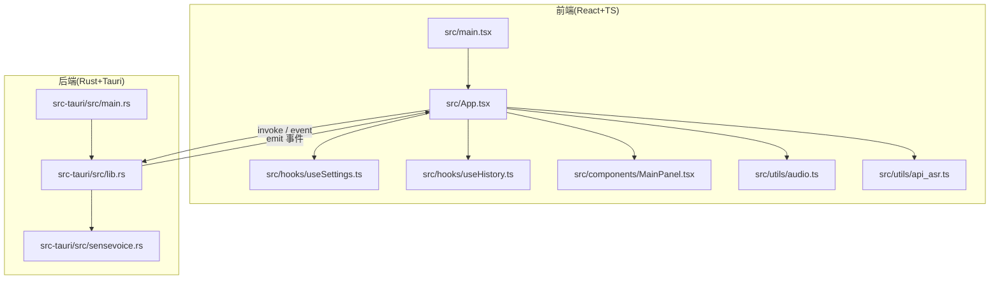
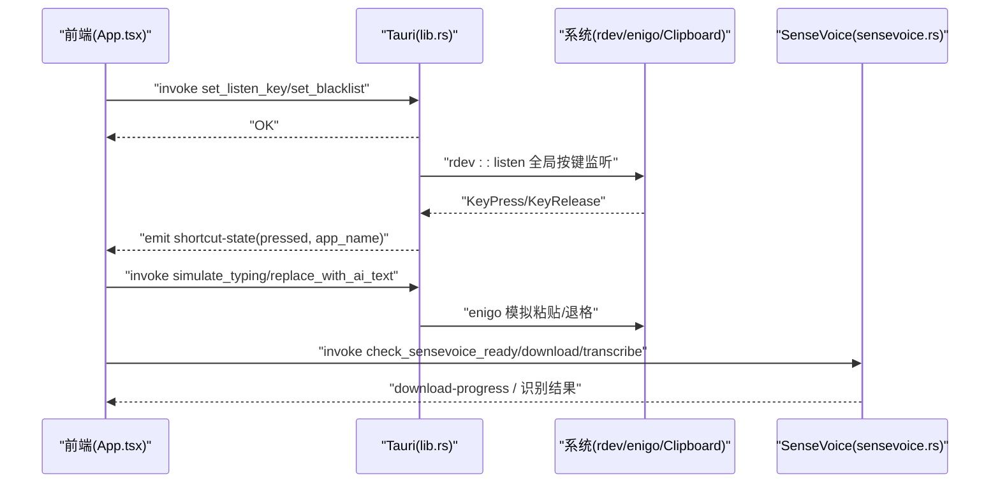
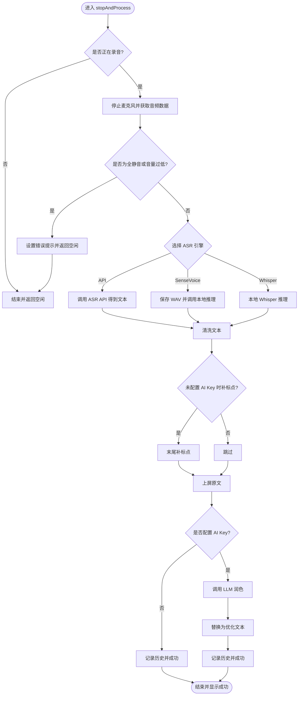
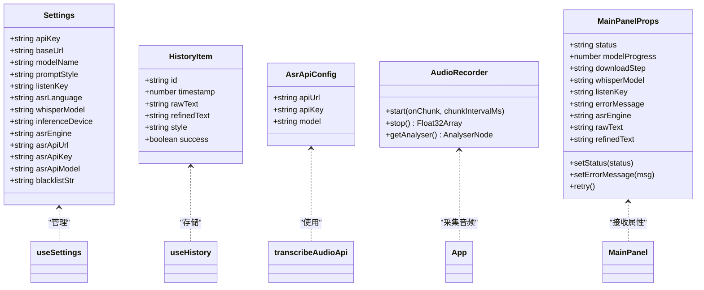
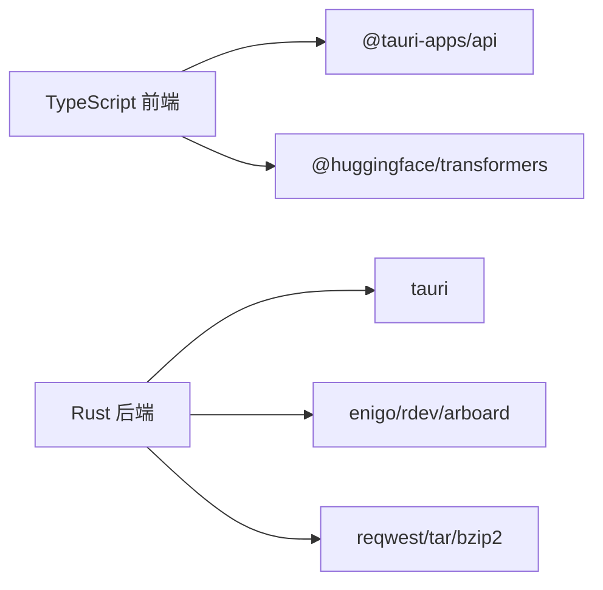

# 代码规范

<cite>
**本文引用的文件**   
- [package.json](file://package.json)
- [tsconfig.json](file://tsconfig.json)
- [vite.config.ts](file://vite.config.ts)
- [src/main.tsx](file://src/main.tsx)
- [src/App.tsx](file://src/App.tsx)
- [src/hooks/useSettings.ts](file://src/hooks/useSettings.ts)
- [src/hooks/useHistory.ts](file://src/hooks/useHistory.ts)
- [src/components/MainPanel.tsx](file://src/components/MainPanel.tsx)
- [src/utils/audio.ts](file://src/utils/audio.ts)
- [src/utils/api_asr.ts](file://src/utils/api_asr.ts)
- [src-tauri/Cargo.toml](file://src-tauri/Cargo.toml)
- [src-tauri/src/main.rs](file://src-tauri/src/main.rs)
- [src-tauri/src/lib.rs](file://src-tauri/src/lib.rs)
- [src-tauri/src/sensevoice.rs](file://src-tauri/src/sensevoice.rs)
</cite>

## 目录
1. [引言](#引言)
2. [项目结构](#项目结构)
3. [核心组件](#核心组件)
4. [架构总览](#架构总览)
5. [详细组件分析](#详细组件分析)
6. [依赖分析](#依赖分析)
7. [性能考虑](#性能考虑)
8. [故障排查指南](#故障排查指南)
9. [结论](#结论)
10. [附录](#附录)

## 引言
本规范面向 VoiceFlow_AI_002 项目的 TypeScript 与 Rust 双端开发，目标是统一编码风格、提升可维护性与稳定性，并给出 Git 协作与质量保障建议。内容覆盖：
- TypeScript 编码标准（命名约定、文件组织、类型定义、错误处理）
- Rust 编码规范（模块设计、异步模式、内存安全实践）
- Git 提交规范与分支管理策略
- 代码审查清单与质量检查工具配置建议

## 项目结构
本项目采用 Tauri + React + Vite 的混合架构：
- 前端：React + TypeScript + Vite，使用 @tauri-apps 与系统交互
- 后端：Rust + Tauri，提供全局快捷键监听、剪贴板/键盘模拟、模型下载与推理等能力
- 资源与脚本：public 静态资源、scripts 构建辅助脚本

图表来源
- [src/main.tsx:1-10](file://src/main.tsx#L1-L10)
- [src/App.tsx:1-774](file://src/App.tsx#L1-L774)
- [src-tauri/src/main.rs:1-9](file://src-tauri/src/main.rs#L1-L9)
- [src-tauri/src/lib.rs:1-287](file://src-tauri/src/lib.rs#L1-L287)

章节来源
- [package.json:1-32](file://package.json#L1-L32)
- [tsconfig.json:1-26](file://tsconfig.json#L1-L26)
- [vite.config.ts:1-44](file://vite.config.ts#L1-L44)

## 核心组件
- 应用入口与状态中枢：App 组件负责初始化引擎、管理录音流程、协调前后端通信、渲染主面板与浮窗指示器
- 设置与历史 Hook：useSettings 管理用户偏好与持久化；useHistory 管理听写历史
- 音频采集与格式转换：AudioRecorder 封装 MediaStream/AudioWorklet 采集、VAD 静音切除、WAV 编码
- ASR API 客户端：api_asr 将 Float32Array 转为 WAV Blob 并调用 OpenAI 兼容接口
- Tauri 命令与系统交互：lib.rs 暴露 simulate_typing、replace_with_ai_text、set_listen_key、set_blacklist 等命令，并启动全局快捷键监听线程
- SenseVoice 本地推理：sensevoice.rs 实现模型/引擎下载、解压、就绪检测与命令行调用

章节来源
- [src/App.tsx:1-774](file://src/App.tsx#L1-L774)
- [src/hooks/useSettings.ts:1-97](file://src/hooks/useSettings.ts#L1-L97)
- [src/hooks/useHistory.ts:1-70](file://src/hooks/useHistory.ts#L1-L70)
- [src/utils/audio.ts:1-221](file://src/utils/audio.ts#L1-L221)
- [src/utils/api_asr.ts:1-73](file://src/utils/api_asr.ts#L1-L73)
- [src-tauri/src/lib.rs:1-287](file://src-tauri/src/lib.rs#L1-L287)
- [src-tauri/src/sensevoice.rs:1-476](file://src-tauri/src/sensevoice.rs#L1-L476)

## 架构总览
前后端通过 Tauri invoke/event 机制通信：前端发起命令或订阅事件，后端在独立线程中执行系统级操作（键鼠模拟、全局监听），并通过 AppHandle 向前端广播事件。

图表来源
- [src/App.tsx:229-286](file://src/App.tsx#L229-L286)
- [src-tauri/src/lib.rs:140-212](file://src-tauri/src/lib.rs#L140-L212)
- [src-tauri/src/sensevoice.rs:295-476](file://src-tauri/src/sensevoice.rs#L295-L476)

## 详细组件分析

### TypeScript 编码规范
- 命名约定
  - 组件与 Hook：PascalCase（如 MainPanel、useSettings）
  - 函数与变量：camelCase
  - 常量与枚举：UPPER_SNAKE_CASE
  - 类型与接口：PascalCase（如 Settings、HistoryItem、AsrApiConfig）
- 文件组织
  - src/components：页面级展示组件
  - src/hooks：业务逻辑 Hook
  - src/utils：通用工具（音频、网络请求）
  - 单文件职责单一，避免跨层耦合
- 类型定义
  - 所有外部输入与回调参数需显式声明类型
  - 使用联合类型表达有限状态（如 status 字面量联合）
  - 对外暴露的接口保持最小必要字段
- 错误处理
  - 统一 try/catch 包裹异步调用，记录错误上下文
  - 对用户可见的错误信息要友好且可操作
  - 对不可恢复错误进行降级与提示
- 异步与并发
  - 优先使用 async/await，避免深层嵌套回调
  - 定时器与轮询注意清理，防止泄漏
- 日志与调试
  - 关键路径打印结构化日志，便于定位问题
  - 生产环境减少冗余日志输出

章节来源
- [src/App.tsx:30-120](file://src/App.tsx#L30-L120)
- [src/hooks/useSettings.ts:1-97](file://src/hooks/useSettings.ts#L1-L97)
- [src/hooks/useHistory.ts:1-70](file://src/hooks/useHistory.ts#L1-L70)
- [src/utils/api_asr.ts:1-73](file://src/utils/api_asr.ts#L1-L73)

### Rust 编码规范
- 模块设计
  - 按功能拆分模块（如 sensevoice.rs 专注模型下载与推理）
  - 公共命令集中注册于 lib.rs，保持边界清晰
- 异步编程模式
  - 使用 Tauri 的 async command 处理 IO 密集型任务（下载、解压）
  - 阻塞型操作通过 spawn_blocking 隔离，避免阻塞事件循环
- 内存安全实践
  - 使用 std::sync::RwLock 保护共享状态（如 AppState）
  - 文件写入先落临时文件，成功后原子重命名，保证一致性
  - 严格校验文件大小与完整性后再启用
- 错误处理
  - 返回 Result<T, String> 明确失败原因
  - 对网络与文件系统错误进行兜底与重试策略
- 平台差异
  - 使用 #[cfg(target_os = "...")] 区分平台行为（如粘贴快捷键）

章节来源
- [src-tauri/src/lib.rs:1-287](file://src-tauri/src/lib.rs#L1-L287)
- [src-tauri/src/sensevoice.rs:1-476](file://src-tauri/src/sensevoice.rs#L1-L476)

### 关键流程图：停止录音与转写

图表来源
- [src/App.tsx:462-640](file://src/App.tsx#L462-L640)

### 类图：前端核心类型与关系

图表来源
- [src/hooks/useSettings.ts:4-34](file://src/hooks/useSettings.ts#L4-L34)
- [src/hooks/useHistory.ts:3-10](file://src/hooks/useHistory.ts#L3-L10)
- [src/utils/api_asr.ts:1-5](file://src/utils/api_asr.ts#L1-L5)
- [src/utils/audio.ts:1-10](file://src/utils/audio.ts#L1-L10)
- [src/components/MainPanel.tsx:4-17](file://src/components/MainPanel.tsx#L4-L17)

## 依赖分析
- 前端依赖
  - React 生态：react、react-dom、@types/react、@vitejs/plugin-react
  - Tauri 前端 API：@tauri-apps/api、@tauri-apps/plugin-*
  - 语音与 AI：@huggingface/transformers（用于本地推理）
- 后端依赖
  - Tauri 生态：tauri、tauri-plugin-opener、tauri-plugin-autostart
  - 系统交互：enigo、rdev、arboard、active-win-pos-rs、device_query
  - 网络与压缩：reqwest、tar、bzip2、zip、futures-util
  - 日志：log、env_logger

图表来源
- [package.json:13-30](file://package.json#L13-L30)
- [src-tauri/Cargo.toml:20-46](file://src-tauri/Cargo.toml#L20-L46)

章节来源
- [package.json:1-32](file://package.json#L1-L32)
- [src-tauri/Cargo.toml:1-47](file://src-tauri/Cargo.toml#L1-L47)

## 性能考虑
- 前端
  - 音频流式处理：分片大小与间隔需平衡延迟与 CPU 占用
  - 避免在主线程做重型计算，必要时使用 Web Worker
  - 合理清理定时器与事件监听，防止内存泄漏
- 后端
  - 下载与解压使用异步与后台线程，避免阻塞 UI
  - 文件操作采用原子替换，确保一致性与回滚能力
  - 模型加载前进行存在性与完整性校验，减少无效 IO

[本节为通用指导，不直接分析具体文件]

## 故障排查指南
- 常见问题
  - 模型下载失败：检查镜像源与网络代理，确认进度事件是否正常上报
  - 全局快捷键无响应：确认黑名单未拦截目标应用，检查 rdev 权限
  - 粘贴/替换异常：确认 enigo 与剪贴板访问权限，观察占位符长度是否正确
  - 麦克风无法启动：检查浏览器权限与 AudioContext 状态
- 定位方法
  - 前端：查看 console 日志与错误堆栈，关注状态机流转
  - 后端：启用 env_logger，查看系统事件与错误码
  - 网络：核对 API URL、鉴权头与响应体结构

章节来源
- [src/App.tsx:34-69](file://src/App.tsx#L34-L69)
- [src-tauri/src/lib.rs:215-286](file://src-tauri/src/lib.rs#L215-L286)
- [src-tauri/src/sensevoice.rs:83-181](file://src-tauri/src/sensevoice.rs#L83-L181)

## 结论
本规范基于现有代码结构与实现模式，明确了 TypeScript 与 Rust 的编码约定、模块划分、错误处理与性能优化要点，并提供了 Git 协作与质量保障建议。遵循这些规范有助于提升团队协作效率与产品稳定性。

[本节为总结性内容，不直接分析具体文件]

## 附录

### Git 提交规范
- 提交消息格式
  - 类型: 描述 (范围)
  - 类型示例：feat、fix、docs、style、refactor、perf、test、chore
  - 范围示例：ui、asr、llm、system、build
  - 示例：feat(ui): 新增浮空指示器状态同步
- 分支管理策略
  - main：稳定发布分支
  - develop：集成开发分支
  - feature/*：新功能分支
  - fix/*：缺陷修复分支
  - release/*：预发布分支
  - hotfix/*：紧急修复分支
- 合并要求
  - 至少一名同行评审
  - CI 全部通过（构建、类型检查、测试）
  - 变更影响评估与更新文档

[本节为通用流程建议，不直接分析具体文件]

### 代码审查清单
- 正确性
  - 边界条件与异常路径是否覆盖
  - 错误信息是否清晰可操作
- 可读性
  - 命名是否准确、一致
  - 函数/模块职责是否单一
- 安全性
  - 敏感信息（API Key）是否妥善管理
  - 外部输入是否做了基本校验
- 性能
  - 是否存在不必要的重复计算或 IO
  - 异步与并发是否合理
- 可维护性
  - 是否有清晰的注释与文档
  - 是否遵循既定规范与约定

[本节为通用流程建议，不直接分析具体文件]

### 质量检查工具配置建议
- TypeScript
  - 启用 tsconfig strict 模式（已开启）
  - 引入 ESLint + @typescript-eslint，规则参考 Airbnb 或 Standard
  - 引入 Prettier 统一格式化
  - 可选：husky + lint-staged 在提交前自动检查
- Rust
  - 启用 clippy 与 rustfmt
  - 在 Cargo.toml 的 profile.release 中保留 strip/lto/opt-level（已配置）
  - 可选：cargo-deny 检查依赖许可证与安全漏洞
- 构建与预览
  - Vite 配置中保持 clearScreen、strictPort、HMR 端口固定（已配置）
  - 代理配置用于模型下载加速（已配置）

章节来源
- [tsconfig.json:17-22](file://tsconfig.json#L17-L22)
- [vite.config.ts:14-41](file://vite.config.ts#L14-L41)
- [src-tauri/Cargo.toml:41-46](file://src-tauri/Cargo.toml#L41-L46)