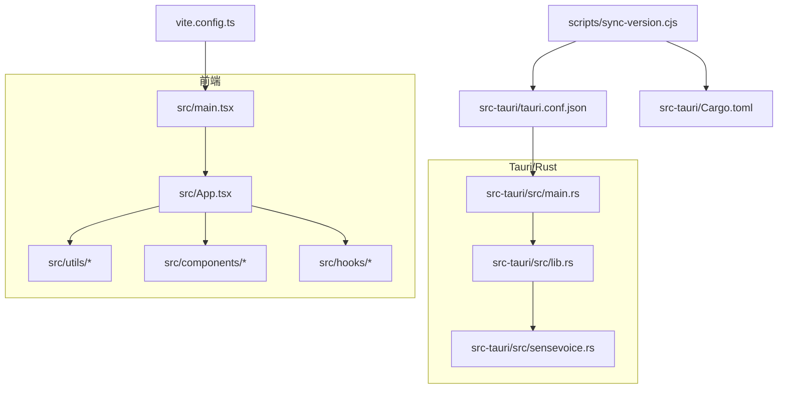
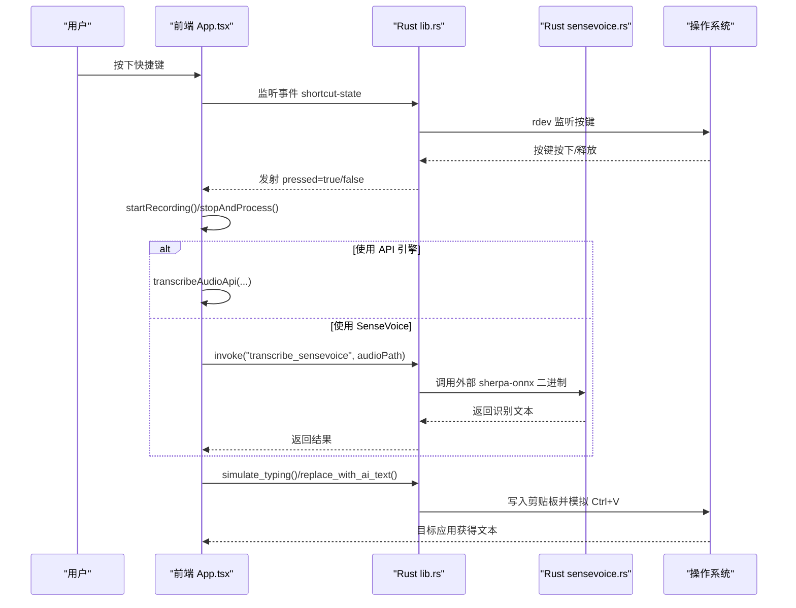
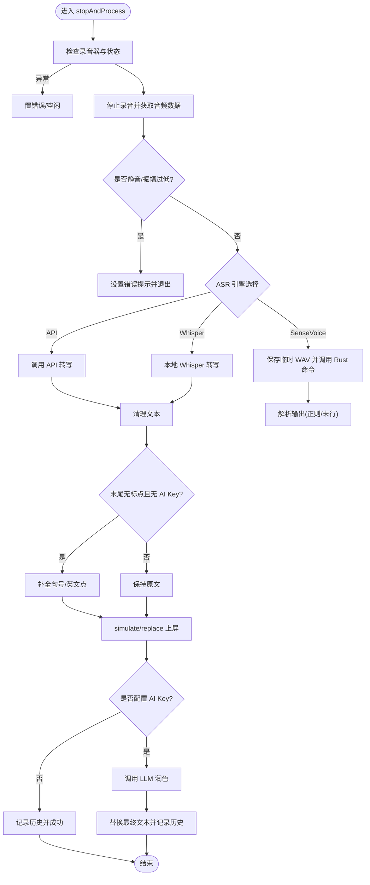
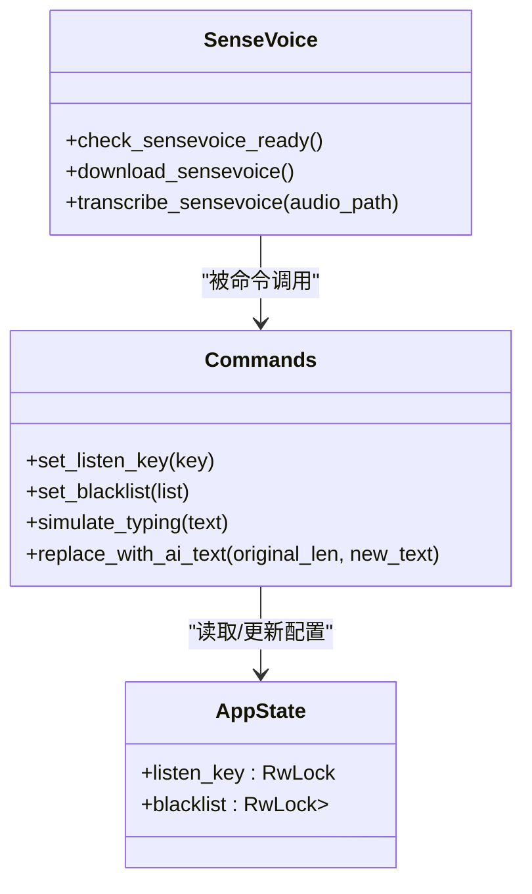
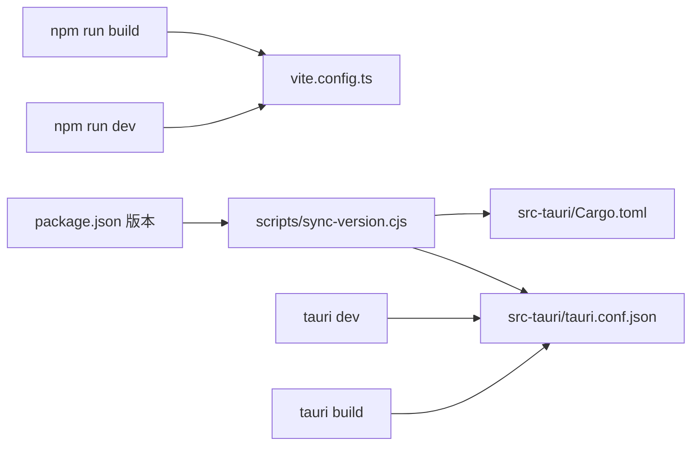
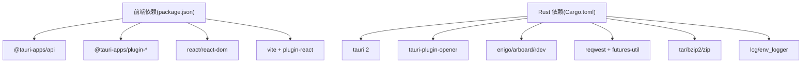

# 开发者指南

<cite>
**本文引用的文件**   
- [README.md](file://README.md)
- [package.json](file://package.json)
- [vite.config.ts](file://vite.config.ts)
- [tsconfig.json](file://tsconfig.json)
- [src-tauri/Cargo.toml](file://src-tauri/Cargo.toml)
- [src-tauri/tauri.conf.json](file://src-tauri/tauri.conf.json)
- [src-tauri/build.rs](file://src-tauri/build.rs)
- [src-tauri/src/main.rs](file://src-tauri/src/main.rs)
- [src-tauri/src/lib.rs](file://src-tauri/src/lib.rs)
- [src-tauri/src/sensevoice.rs](file://src-tauri/src/sensevoice.rs)
- [scripts/sync-version.cjs](file://scripts/sync-version.cjs)
- [src/App.tsx](file://src/App.tsx)
- [src/main.tsx](file://src/main.tsx)
- [src/vite-env.d.ts](file://src/vite-env.d.ts)
</cite>

## 目录
1. [简介](#简介)
2. [项目结构](#项目结构)
3. [核心组件](#核心组件)
4. [架构总览](#架构总览)
5. [详细组件分析](#详细组件分析)
6. [依赖关系分析](#依赖关系分析)
7. [性能与构建优化](#性能与构建优化)
8. [调试与故障排除](#调试与故障排除)
9. [测试策略与持续集成建议](#测试策略与持续集成建议)
10. [结论](#结论)
11. [附录：开发环境与规范](#附录开发环境与规范)

## 简介
本指南面向 VoiceFlow_AI_002 的开发者，覆盖从环境搭建、构建打包、代码规范、调试排障到测试与 CI 的全流程。项目采用 Tauri + React + TypeScript + Vite 的前后端混合架构，前端负责交互与语音采集，Rust 侧提供系统级能力（全局快捷键、剪贴板粘贴、后台托盘、模型下载与推理）。

## 项目结构
- 前端工程位于 src，使用 Vite 构建，React 作为 UI 框架，TypeScript 提供类型约束。
- 桌面应用壳在 src-tauri，基于 Tauri v2，Rust 实现系统能力与本地推理。
- 构建脚本 scripts 用于同步版本至多配置文件。

图表来源
- [src/main.tsx:1-10](file://src/main.tsx#L1-L10)
- [src/App.tsx:1-774](file://src/App.tsx#L1-L774)
- [vite.config.ts:1-44](file://vite.config.ts#L1-L44)
- [src-tauri/src/main.rs:1-9](file://src-tauri/src/main.rs#L1-L9)
- [src-tauri/src/lib.rs:1-287](file://src-tauri/src/lib.rs#L1-L287)
- [src-tauri/src/sensevoice.rs:1-476](file://src-tauri/src/sensevoice.rs#L1-L476)
- [src-tauri/tauri.conf.json:1-68](file://src-tauri/tauri.conf.json#L1-L68)
- [scripts/sync-version.cjs:1-35](file://scripts/sync-version.cjs#L1-L35)
- [src-tauri/Cargo.toml:1-47](file://src-tauri/Cargo.toml#L1-L47)

章节来源
- [README.md:1-8](file://README.md#L1-L8)
- [package.json:1-32](file://package.json#L1-L32)
- [vite.config.ts:1-44](file://vite.config.ts#L1-L44)
- [tsconfig.json:1-26](file://tsconfig.json#L1-L26)
- [src-tauri/Cargo.toml:1-47](file://src-tauri/Cargo.toml#L1-L47)
- [src-tauri/tauri.conf.json:1-68](file://src-tauri/tauri.conf.json#L1-L68)
- [src-tauri/build.rs:1-4](file://src-tauri/build.rs#L1-L4)
- [src-tauri/src/main.rs:1-9](file://src-tauri/src/main.rs#L1-L9)
- [src-tauri/src/lib.rs:1-287](file://src-tauri/src/lib.rs#L1-L287)
- [src-tauri/src/sensevoice.rs:1-476](file://src-tauri/src/sensevoice.rs#L1-L476)
- [scripts/sync-version.cjs:1-35](file://scripts/sync-version.cjs#L1-L35)
- [src/App.tsx:1-774](file://src/App.tsx#L1-L774)
- [src/main.tsx:1-10](file://src/main.tsx#L1-L10)
- [src/vite-env.d.ts:1-2](file://src/vite-env.d.ts#L1-L2)

## 核心组件
- 前端入口与路由
  - 入口渲染：[src/main.tsx:1-10](file://src/main.tsx#L1-L10)
  - 主应用逻辑与状态机：[src/App.tsx:1-774](file://src/App.tsx#L1-L774)
  - Vite 配置（端口、HMR、代理）：[vite.config.ts:1-44](file://vite.config.ts#L1-L44)
  - TypeScript 编译选项：[tsconfig.json:1-26](file://tsconfig.json#L1-L26)
- Tauri 应用
  - 应用清单与窗口配置：[src-tauri/tauri.conf.json:1-68](file://src-tauri/tauri.conf.json#L1-L68)
  - Rust 入口与命令注册：[src-tauri/src/main.rs:1-9](file://src-tauri/src/main.rs#L1-L9)、[src-tauri/src/lib.rs:1-287](file://src-tauri/src/lib.rs#L1-L287)
  - SenseVoice 引擎与模型管理：[src-tauri/src/sensevoice.rs:1-476](file://src-tauri/src/sensevoice.rs#L1-L476)
  - 构建脚本与依赖：[src-tauri/build.rs:1-4](file://src-tauri/build.rs#L1-L4)、[src-tauri/Cargo.toml:1-47](file://src-tauri/Cargo.toml#L1-L47)
- 工具与脚本
  - 版本同步脚本：[scripts/sync-version.cjs:1-35](file://scripts/sync-version.cjs#L1-L35)
  - 包管理与脚本：[package.json:1-32](file://package.json#L1-L32)

章节来源
- [src/main.tsx:1-10](file://src/main.tsx#L1-L10)
- [src/App.tsx:1-774](file://src/App.tsx#L1-L774)
- [vite.config.ts:1-44](file://vite.config.ts#L1-L44)
- [tsconfig.json:1-26](file://tsconfig.json#L1-L26)
- [src-tauri/tauri.conf.json:1-68](file://src-tauri/tauri.conf.json#L1-L68)
- [src-tauri/src/main.rs:1-9](file://src-tauri/src/main.rs#L1-L9)
- [src-tauri/src/lib.rs:1-287](file://src-tauri/src/lib.rs#L1-L287)
- [src-tauri/src/sensevoice.rs:1-476](file://src-tauri/src/sensevoice.rs#L1-L476)
- [src-tauri/build.rs:1-4](file://src-tauri/build.rs#L1-L4)
- [src-tauri/Cargo.toml:1-47](file://src-tauri/Cargo.toml#L1-L47)
- [scripts/sync-version.cjs:1-35](file://scripts/sync-version.cjs#L1-L35)
- [package.json:1-32](file://package.json#L1-L32)

## 架构总览
整体为“前端 UI + Tauri 原生能力”的双进程模式：
- 前端通过 @tauri-apps/api 调用 Rust 暴露的命令，处理录音、转写、AI 润色与系统交互。
- Rust 侧负责全局快捷键监听、剪贴板写入、托盘菜单、SenseVoice 模型下载与执行外部二进制进行推理。

图表来源
- [src/App.tsx:1-774](file://src/App.tsx#L1-L774)
- [src-tauri/src/lib.rs:1-287](file://src-tauri/src/lib.rs#L1-L287)
- [src-tauri/src/sensevoice.rs:1-476](file://src-tauri/src/sensevoice.rs#L1-L476)

## 详细组件分析

### 前端应用层（React + Vite）
- 启动与渲染
  - 入口：[src/main.tsx:1-10](file://src/main.tsx#L1-L10)
  - 根组件：[src/App.tsx:1-774](file://src/App.tsx#L1-L774)
- 关键职责
  - 状态机：initializing → idle → recording → transcribing → rewriting → success/error
  - 设备与窗口：麦克风采集、双窗口（主窗口 + indicator 浮窗）、自动隐藏与定位
  - 与 Rust 通信：invoke/listen 调用系统能力与事件通道
  - ASR 路径：API 流式或本地 SenseVoice/Whisper；未配置 AI Key 时离线兜底标点补偿
  - 历史与设置：持久化记录与偏好项
- 构建与开发
  - Vite 固定端口 1420，严格端口，忽略 src-tauri 变更，HMR 通过 TAURI_DEV_HOST 注入
  - 代理 /hf 指向 hf-mirror.com，便于国内访问资源
  - TypeScript 严格模式开启，模块解析 bundler 模式，JSX react-jsx

图表来源
- [src/App.tsx:1-774](file://src/App.tsx#L1-L774)

章节来源
- [src/main.tsx:1-10](file://src/main.tsx#L1-L10)
- [src/App.tsx:1-774](file://src/App.tsx#L1-L774)
- [vite.config.ts:1-44](file://vite.config.ts#L1-L44)
- [tsconfig.json:1-26](file://tsconfig.json#L1-L26)

### Rust 应用层（Tauri + 系统能力）
- 应用初始化与托盘
  - 入口：[src-tauri/src/main.rs:1-9](file://src-tauri/src/main.rs#L1-L9)
  - 运行与插件：托盘菜单、自动启动、opener 等
- 全局快捷键与黑名单
  - 监听线程：rdev 事件驱动，映射目标键位，检测活动窗口，黑名单过滤
  - 事件发射：shortcut-state 携带 pressed/app_name/window_title
- 剪贴板与输入模拟
  - simulate_typing：复制文本到剪贴板并模拟 Ctrl/Cmd+V
  - replace_with_ai_text：逐字退格删除旧文本后粘贴新文本
- SenseVoice 模型管理
  - 检查就绪：check_sensevoice_ready
  - 下载与解压：download_sensevoice（含镜像回退、原子写入、进度上报）
  - 推理：transcribe_sensevoice（调用外部 sherpa-onnx 二进制）

图表来源
- [src-tauri/src/lib.rs:1-287](file://src-tauri/src/lib.rs#L1-L287)
- [src-tauri/src/sensevoice.rs:1-476](file://src-tauri/src/sensevoice.rs#L1-L476)

章节来源
- [src-tauri/src/main.rs:1-9](file://src-tauri/src/main.rs#L1-L9)
- [src-tauri/src/lib.rs:1-287](file://src-tauri/src/lib.rs#L1-L287)
- [src-tauri/src/sensevoice.rs:1-476](file://src-tauri/src/sensevoice.rs#L1-L476)

### 构建系统与打包流程
- 前端构建
  - 脚本：npm run build 执行 tsc 与 vite build
  - Vite 配置：固定端口、忽略 Rust 源码变更、HMR 主机、代理
- Tauri 构建
  - 清单：productName/version/identifier、窗口定义、安全 CSP、打包图标与 NSIS 语言
  - 构建钩子：beforeDevCommand/beforeBuildCommand、frontendDist
  - Cargo profile：strip/LTO/opt-level=z/codegen-units=1/panic=abort 以减小体积与提升性能
- 版本同步
  - npm version 触发 scripts/sync-version.cjs，将 package.json 的版本同步到 tauri.conf.json 与 Cargo.toml

图表来源
- [package.json:1-32](file://package.json#L1-L32)
- [scripts/sync-version.cjs:1-35](file://scripts/sync-version.cjs#L1-L35)
- [vite.config.ts:1-44](file://vite.config.ts#L1-L44)
- [src-tauri/tauri.conf.json:1-68](file://src-tauri/tauri.conf.json#L1-L68)
- [src-tauri/Cargo.toml:1-47](file://src-tauri/Cargo.toml#L1-L47)

章节来源
- [package.json:1-32](file://package.json#L1-L32)
- [vite.config.ts:1-44](file://vite.config.ts#L1-L44)
- [src-tauri/tauri.conf.json:1-68](file://src-tauri/tauri.conf.json#L1-L68)
- [src-tauri/build.rs:1-4](file://src-tauri/build.rs#L1-L4)
- [src-tauri/Cargo.toml:1-47](file://src-tauri/Cargo.toml#L1-L47)
- [scripts/sync-version.cjs:1-35](file://scripts/sync-version.cjs#L1-L35)

## 依赖关系分析
- 前端依赖
  - React 19、@tauri-apps/api 2、autostart/fs/opener 插件、lucide-react 图标库
  - 开发依赖：@vitejs/plugin-react、typescript、vite
- Rust 依赖
  - tauri 2、tauri-plugin-opener、serde/serde_json、enigo、device_query、arboard、active-win-pos-rs、rdev、log/env_logger、reqwest、tar/bzip2/zip、futures-util
  - 平台条件依赖：tauri-plugin-autostart（非移动端）

图表来源
- [package.json:1-32](file://package.json#L1-L32)
- [src-tauri/Cargo.toml:1-47](file://src-tauri/Cargo.toml#L1-L47)

章节来源
- [package.json:1-32](file://package.json#L1-L32)
- [src-tauri/Cargo.toml:1-47](file://src-tauri/Cargo.toml#L1-L47)

## 性能与构建优化
- 前端
  - 使用 Vite 的 strictPort 与 ignore 减少无关热更开销
  - 合理拆分组件与 hooks，避免重复计算与重渲染
- Rust
  - release profile 已启用 strip、LTO、opt-level=z、codegen-units=1、panic=abort，有助于减小体积与提升运行效率
  - 模型下载采用分片流式写入与镜像回退，降低失败率与阻塞时间
- 网络
  - 前端代理 /hf 指向 hf-mirror.com，加速模型与资源访问
  - 后端下载具备超时与重试机制，提高鲁棒性

章节来源
- [vite.config.ts:1-44](file://vite.config.ts#L1-L44)
- [src-tauri/Cargo.toml:1-47](file://src-tauri/Cargo.toml#L1-L47)
- [src-tauri/src/sensevoice.rs:1-476](file://src-tauri/src/sensevoice.rs#L1-L476)

## 调试与故障排除
- 日志
  - 前端：App 劫持 console.log/warn/error，收集最近 100 条日志供查看
  - Rust：env_logger 初始化，配合 log crate 输出
- 常见问题
  - 麦克风权限：确保浏览器/Webview 允许媒体流；必要时使用 additionalBrowserArgs 参数
  - 快捷键冲突：调整 listen_key 或在黑名单中屏蔽特定应用
  - 模型下载失败：检查网络与镜像可用性，观察 download-progress 事件
  - 粘贴失效：确认目标应用支持剪贴板粘贴；Windows/Linux 使用 Ctrl+V，macOS 使用 Cmd+V
- 调试技巧
  - 前端：打开设置面板查看日志与错误信息
  - Rust：在终端运行 tauri dev，关注控制台输出与日志文件位置

章节来源
- [src/App.tsx:1-774](file://src/App.tsx#L1-L774)
- [src-tauri/src/lib.rs:1-287](file://src-tauri/src/lib.rs#L1-L287)
- [src-tauri/src/sensevoice.rs:1-476](file://src-tauri/src/sensevoice.rs#L1-L476)
- [src-tauri/tauri.conf.json:1-68](file://src-tauri/tauri.conf.json#L1-L68)

## 测试策略与持续集成建议
- 测试策略
  - 前端单元测试：对 utils/audio、utils/whisper、hooks/useSettings、hooks/useHistory 等纯函数与 Hook 进行断言
  - 组件测试：对 MainPanel/HistoryPanel/SettingsPanel 进行快照与交互测试
  - 集成测试：使用 Tauri Test 或 Playwright 验证端到端流程（快捷键→录音→转写→上屏）
  - Rust 测试：对 sensevoice 下载/解压逻辑、lib.rs 中的命令封装编写单测与属性测试
- 持续集成
  - Node.js 安装与缓存 node_modules
  - 安装 Rust 工具链与 Tauri CLI
  - 执行 tsc 与 Vite 构建
  - 执行 cargo test 与 cargo clippy
  - 可选：生成安装包并进行冒烟测试

章节来源
- [package.json:1-32](file://package.json#L1-L32)
- [src-tauri/Cargo.toml:1-47](file://src-tauri/Cargo.toml#L1-L47)

## 结论
本项目通过 Tauri 将现代 Web 技术与系统级能力结合，实现了跨平台的语音听写与 AI 润色体验。合理的构建与打包配置、完善的下载与容错机制、以及清晰的日志与调试手段，为开发与维护提供了良好基础。建议在后续迭代中补充自动化测试与 CI，进一步提升质量与交付效率。

## 附录：开发环境与规范

### 开发环境搭建
- Node.js
  - 建议使用 LTS 版本，安装依赖后通过 npm run dev 启动前端开发服务器
- Rust 工具链
  - 安装 rustup 与 stable 工具链；确保包含 cargo、rustc、rustfmt、clippy
- IDE 配置
  - VS Code 推荐扩展：Tauri 官方扩展、rust-analyzer
  - 启用 TypeScript 严格模式与 ESLint/Prettier（如引入）
  - 在 Tauri 项目中启用 Rust 语法高亮与诊断

章节来源
- [README.md:1-8](file://README.md#L1-L8)
- [tsconfig.json:1-26](file://tsconfig.json#L1-L26)

### 构建与打包
- 开发
  - npm run dev：启动 Vite 开发服务器
  - tauri dev：启动 Tauri 应用，自动调用 beforeDevCommand
- 构建
  - npm run build：TypeScript 编译与 Vite 打包
  - tauri build：根据 tauri.conf.json 打包产物
- 版本同步
  - npm version <semver>：触发 scripts/sync-version.cjs 同步至 tauri.conf.json 与 Cargo.toml

章节来源
- [package.json:1-32](file://package.json#L1-L32)
- [src-tauri/tauri.conf.json:1-68](file://src-tauri/tauri.conf.json#L1-L68)
- [scripts/sync-version.cjs:1-35](file://scripts/sync-version.cjs#L1-L35)

### 代码规范与提交规范
- TypeScript
  - 遵循 tsconfig.json 的严格模式与模块解析策略
  - 统一 JSX 为 react-jsx，避免多余类型断言
- Rust
  - 使用 rustfmt 格式化代码，cargo clippy 检查潜在问题
  - 对外暴露的 Tauri 命令需保证错误可观测与可恢复
- 提交规范
  - 建议采用 Conventional Commits（feat/fix/docs/chore 等），便于自动生成变更日志

章节来源
- [tsconfig.json:1-26](file://tsconfig.json#L1-L26)
- [src-tauri/Cargo.toml:1-47](file://src-tauri/Cargo.toml#L1-L47)