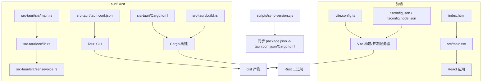
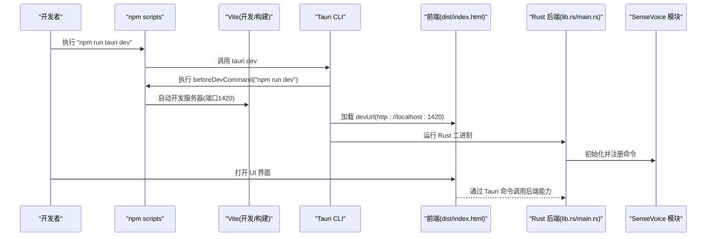
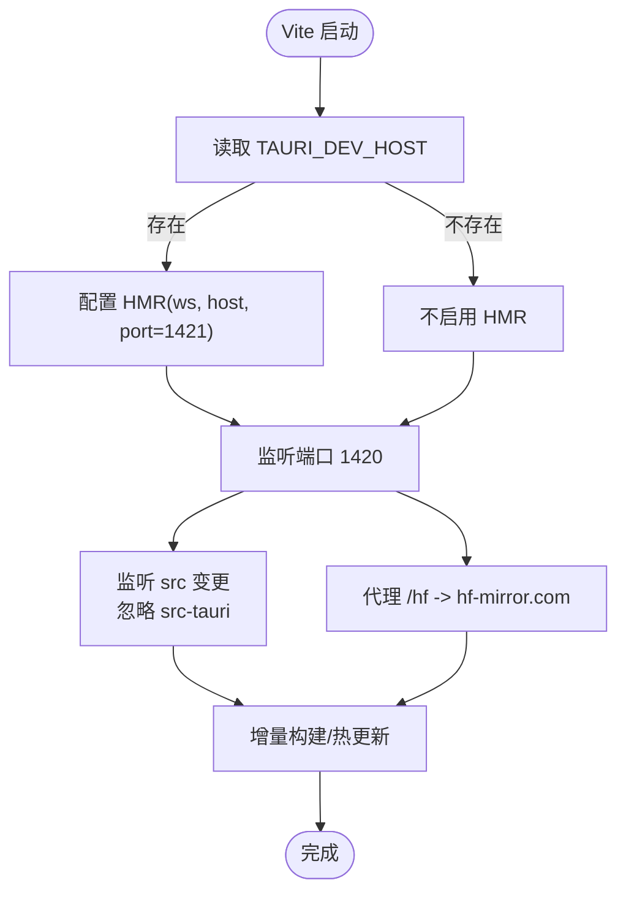
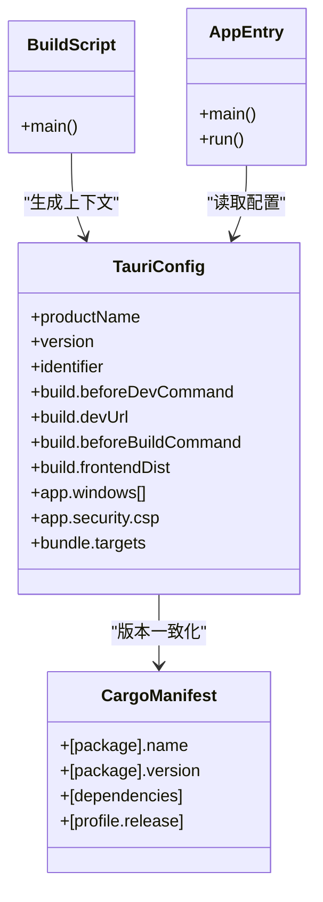
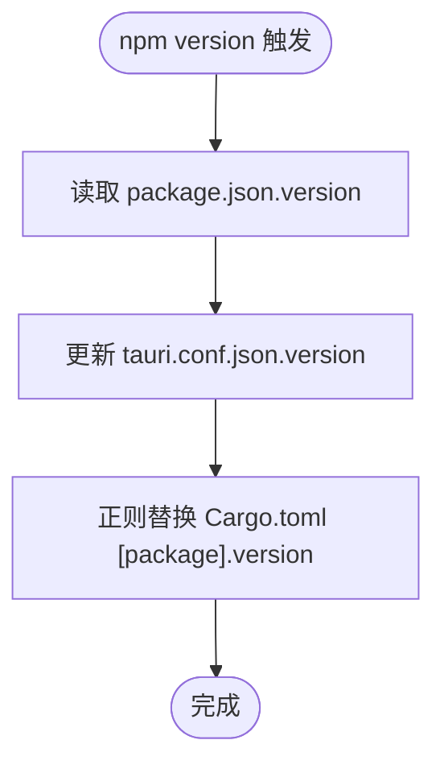
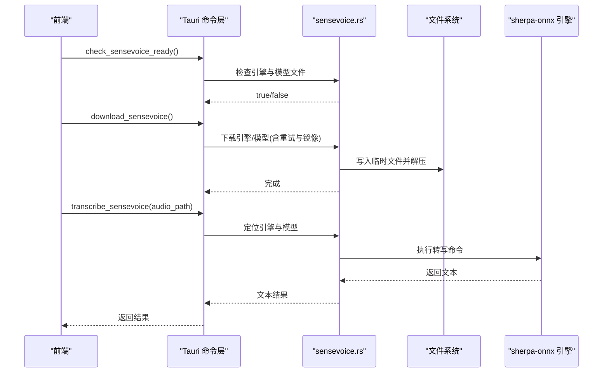
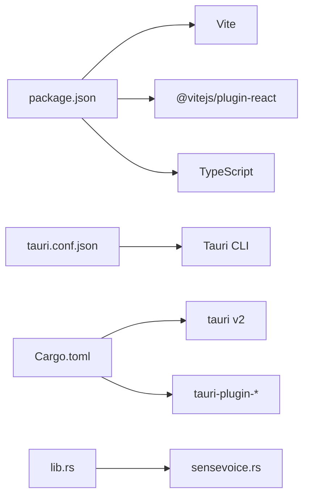

# 构建系统

<cite>
**本文引用的文件**   
- [package.json](file://package.json)
- [vite.config.ts](file://vite.config.ts)
- [tsconfig.json](file://tsconfig.json)
- [tsconfig.node.json](file://tsconfig.node.json)
- [index.html](file://index.html)
- [src/main.tsx](file://src/main.tsx)
- [scripts/sync-version.cjs](file://scripts/sync-version.cjs)
- [src-tauri/tauri.conf.json](file://src-tauri/tauri.conf.json)
- [src-tauri/build.rs](file://src-tauri/build.rs)
- [src-tauri/Cargo.toml](file://src-tauri/Cargo.toml)
- [src-tauri/src/main.rs](file://src-tauri/src/main.rs)
- [src-tauri/src/lib.rs](file://src-tauri/src/lib.rs)
- [src-tauri/src/sensevoice.rs](file://src-tauri/src/sensevoice.rs)
</cite>

## 目录
1. [简介](#简介)
2. [项目结构](#项目结构)
3. [核心组件](#核心组件)
4. [架构总览](#架构总览)
5. [详细组件分析](#详细组件分析)
6. [依赖关系分析](#依赖关系分析)
7. [性能考虑](#性能考虑)
8. [故障排查指南](#故障排查指南)
9. [结论](#结论)
10. [附录](#附录)

## 简介
本文件面向 VoiceFlow_AI_002 的构建系统，覆盖以下方面：
- Vite 配置与自定义插件集成（当前使用官方 React 插件）
- Tauri 构建流程与 Rust 后端编译配置
- 版本同步脚本的工作原理与扩展方法
- 开发模式与生产模式的差异及优化策略
- 构建性能优化技巧与常见问题解决方案

## 项目结构
前端基于 Vite + React + TypeScript，后端基于 Tauri v2 + Rust。构建入口由 npm scripts 驱动，Tauri 在前后端之间进行编排。

图表来源
- [vite.config.ts:1-44](file://vite.config.ts#L1-L44)
- [tsconfig.json:1-26](file://tsconfig.json#L1-L26)
- [tsconfig.node.json:1-11](file://tsconfig.node.json#L1-L11)
- [index.html:1-15](file://index.html#L1-L15)
- [src/main.tsx:1-10](file://src/main.tsx#L1-L10)
- [src-tauri/tauri.conf.json:1-68](file://src-tauri/tauri.conf.json#L1-L68)
- [src-tauri/Cargo.toml:1-47](file://src-tauri/Cargo.toml#L1-L47)
- [src-tauri/build.rs:1-4](file://src-tauri/build.rs#L1-L4)
- [src-tauri/src/main.rs:1-9](file://src-tauri/src/main.rs#L1-L9)
- [src-tauri/src/lib.rs:1-287](file://src-tauri/src/lib.rs#L1-L287)
- [src-tauri/src/sensevoice.rs:1-476](file://src-tauri/src/sensevoice.rs#L1-L476)
- [scripts/sync-version.cjs:1-35](file://scripts/sync-version.cjs#L1-L35)

章节来源
- [package.json:1-32](file://package.json#L1-L32)
- [vite.config.ts:1-44](file://vite.config.ts#L1-L44)
- [tsconfig.json:1-26](file://tsconfig.json#L1-L26)
- [tsconfig.node.json:1-11](file://tsconfig.node.json#L1-L11)
- [index.html:1-15](file://index.html#L1-L15)
- [src/main.tsx:1-10](file://src/main.tsx#L1-L10)
- [src-tauri/tauri.conf.json:1-68](file://src-tauri/tauri.conf.json#L1-L68)
- [src-tauri/Cargo.toml:1-47](file://src-tauri/Cargo.toml#L1-L47)
- [src-tauri/build.rs:1-4](file://src-tauri/build.rs#L1-L4)
- [src-tauri/src/main.rs:1-9](file://src-tauri/src/main.rs#L1-L9)
- [src-tauri/src/lib.rs:1-287](file://src-tauri/src/lib.rs#L1-L287)
- [src-tauri/src/sensevoice.rs:1-476](file://src-tauri/src/sensevoice.rs#L1-L476)
- [scripts/sync-version.cjs:1-35](file://scripts/sync-version.cjs#L1-L35)

## 核心组件
- 前端构建与开发服务器：Vite + @vitejs/plugin-react，TypeScript 通过 tsconfig 管理类型与模块解析。
- Tauri 编排：tauri.conf.json 定义前后端命令、窗口与安全策略；Tauri CLI 负责启动 dev 与打包。
- Rust 后端：Cargo 构建，release profile 启用 strip、LTO、opt-level=z 等优化；build.rs 调用 tauri_build::build()。
- 版本同步：npm version 钩子触发 scripts/sync-version.cjs，将 package.json 的版本同步到 tauri.conf.json 与 Cargo.toml。

章节来源
- [package.json:1-32](file://package.json#L1-L32)
- [vite.config.ts:1-44](file://vite.config.ts#L1-L44)
- [tsconfig.json:1-26](file://tsconfig.json#L1-L26)
- [tsconfig.node.json:1-11](file://tsconfig.node.json#L1-L11)
- [src-tauri/tauri.conf.json:1-68](file://src-tauri/tauri.conf.json#L1-L68)
- [src-tauri/Cargo.toml:1-47](file://src-tauri/Cargo.toml#L1-L47)
- [src-tauri/build.rs:1-4](file://src-tauri/build.rs#L1-L4)
- [scripts/sync-version.cjs:1-35](file://scripts/sync-version.cjs#L1-L35)

## 架构总览
下图展示了从 npm 脚本到 Vite/Tauri/Cargo 的完整构建链路，以及运行时前后端交互的关键点。

图表来源
- [package.json:6-12](file://package.json#L6-L12)
- [vite.config.ts:16-30](file://vite.config.ts#L16-L30)
- [src-tauri/tauri.conf.json:6-11](file://src-tauri/tauri.conf.json#L6-L11)
- [src-tauri/src/main.rs:4-6](file://src-tauri/src/main.rs#L4-L6)
- [src-tauri/src/lib.rs:215-286](file://src-tauri/src/lib.rs#L215-L286)
- [src-tauri/src/sensevoice.rs:295-476](file://src-tauri/src/sensevoice.rs#L295-L476)

## 详细组件分析

### Vite 配置与插件集成
- 插件：仅启用官方 React 插件，未引入额外自定义插件。
- 开发服务器：
  - 固定端口 1420，严格端口模式，避免冲突。
  - 当存在 TAURI_DEV_HOST 环境变量时，开启 HMR 并指定 ws 协议与端口 1421。
  - 忽略 src-tauri 目录变更，避免不必要的重新构建。
- 代理：为 /hf 路径代理至 hf-mirror.com，用于加速模型资源访问。
- 输出：构建产物位于 dist 目录，供 Tauri 打包使用。

图表来源
- [vite.config.ts:1-44](file://vite.config.ts#L1-L44)

章节来源
- [vite.config.ts:1-44](file://vite.config.ts#L1-L44)

### Tauri 构建流程与 Rust 后端编译
- 生命周期：
  - 开发：beforeDevCommand 执行 npm run dev，devUrl 指向本地 Vite 服务。
  - 构建：beforeBuildCommand 执行 npm run build，frontendDist 指向 ../dist。
- 窗口与安全：
  - 主窗口与指示器窗口均禁用装饰，主窗口置顶且默认隐藏。
  - CSP 允许连接 self、https、http://localhost:*、ws://localhost:*，并允许 unsafe-inline 与 wasm-unsafe-eval。
- Rust 构建：
  - build.rs 调用 tauri_build::build()，生成上下文与能力 schema。
  - release profile 启用 strip、LTO、opt-level=z、codegen-units=1、panic=abort，以减小体积并提升性能。
  - main.rs 在 release 下隐藏控制台窗口，lib.rs 中注册菜单、托盘、全局快捷键监听与 Tauri 命令。

图表来源
- [src-tauri/tauri.conf.json:1-68](file://src-tauri/tauri.conf.json#L1-L68)
- [src-tauri/Cargo.toml:1-47](file://src-tauri/Cargo.toml#L1-L47)
- [src-tauri/build.rs:1-4](file://src-tauri/build.rs#L1-L4)
- [src-tauri/src/main.rs:1-9](file://src-tauri/src/main.rs#L1-L9)
- [src-tauri/src/lib.rs:215-286](file://src-tauri/src/lib.rs#L215-L286)

章节来源
- [src-tauri/tauri.conf.json:1-68](file://src-tauri/tauri.conf.json#L1-L68)
- [src-tauri/Cargo.toml:1-47](file://src-tauri/Cargo.toml#L1-L47)
- [src-tauri/build.rs:1-4](file://src-tauri/build.rs#L1-L4)
- [src-tauri/src/main.rs:1-9](file://src-tauri/src/main.rs#L1-L9)
- [src-tauri/src/lib.rs:1-287](file://src-tauri/src/lib.rs#L1-L287)

### 版本同步脚本工作原理与自定义方法
- 触发时机：npm version 钩子自动执行 scripts/sync-version.cjs。
- 行为：
  - 读取 package.json 的 version。
  - 写入 tauri.conf.json 的 version。
  - 正则替换 Cargo.toml 中 [package] 段的 version。
- 扩展建议：
  - 增加校验逻辑（如语义化版本检查）。
  - 支持多环境版本前缀或分支策略。
  - 失败回滚与日志记录。

图表来源
- [scripts/sync-version.cjs:1-35](file://scripts/sync-version.cjs#L1-L35)
- [package.json:1-32](file://package.json#L1-L32)
- [src-tauri/tauri.conf.json:1-68](file://src-tauri/tauri.conf.json#L1-L68)
- [src-tauri/Cargo.toml:1-47](file://src-tauri/Cargo.toml#L1-L47)

章节来源
- [scripts/sync-version.cjs:1-35](file://scripts/sync-version.cjs#L1-L35)
- [package.json:1-32](file://package.json#L1-L32)
- [src-tauri/tauri.conf.json:1-68](file://src-tauri/tauri.conf.json#L1-L68)
- [src-tauri/Cargo.toml:1-47](file://src-tauri/Cargo.toml#L1-L47)

### 开发模式与生产模式的区别及优化策略
- 开发模式
  - Vite 提供热更新，固定端口 1420，HMR 可配置。
  - Tauri 直接加载 devUrl，无需打包前端。
  - 适合快速迭代，但包含调试信息，体积较大。
- 生产模式
  - 先执行 npm run build 产出静态资源，再交由 Tauri 打包。
  - Rust release profile 启用 strip、LTO、opt-level=z，显著减小体积并提升性能。
  - 安全策略更严格（CSP），窗口默认不可见，托盘常驻后台。
- 优化建议
  - 按需启用 Vite 压缩与代码分割（可通过插件或配置扩展）。
  - 对大模型/引擎采用运行时下载与缓存策略（已在 sensevoice 模块实现）。
  - 合理设置代理与镜像源，提高首次下载成功率。

章节来源
- [vite.config.ts:16-41](file://vite.config.ts#L16-L41)
- [src-tauri/tauri.conf.json:6-11](file://src-tauri/tauri.conf.json#L6-L11)
- [src-tauri/Cargo.toml:41-47](file://src-tauri/Cargo.toml#L41-L47)
- [src-tauri/src/lib.rs:215-286](file://src-tauri/src/lib.rs#L215-L286)

### SenseVoice 运行时下载与转写流程
- 检查就绪：判断 sherpa-onnx 引擎与模型是否存在。
- 下载引擎与模型：
  - 优先尝试国内镜像，失败后回退到 tarball。
  - 使用临时文件与原子重命名保证完整性。
  - 解压完成后清理临时文件。
- 转写：调用外部 exe 执行语音识别，返回文本结果。

图表来源
- [src-tauri/src/sensevoice.rs:295-476](file://src-tauri/src/sensevoice.rs#L295-L476)
- [src-tauri/src/lib.rs:275-283](file://src-tauri/src/lib.rs#L275-L283)

章节来源
- [src-tauri/src/sensevoice.rs:1-476](file://src-tauri/src/sensevoice.rs#L1-L476)
- [src-tauri/src/lib.rs:275-283](file://src-tauri/src/lib.rs#L275-L283)

## 依赖关系分析
- 前端依赖：React、@vitejs/plugin-react、Vite、TypeScript。
- Tauri 依赖：tauri v2、tauri-plugin-opener、tauri-plugin-autostart（非移动平台）。
- Rust 运行时依赖：键盘/鼠标模拟、剪贴板、网络请求、归档解压等。

图表来源
- [package.json:13-30](file://package.json#L13-L30)
- [src-tauri/tauri.conf.json:1-68](file://src-tauri/tauri.conf.json#L1-L68)
- [src-tauri/Cargo.toml:20-40](file://src-tauri/Cargo.toml#L20-L40)
- [src-tauri/src/lib.rs:1-287](file://src-tauri/src/lib.rs#L1-L287)
- [src-tauri/src/sensevoice.rs:1-476](file://src-tauri/src/sensevoice.rs#L1-L476)

章节来源
- [package.json:13-30](file://package.json#L13-L30)
- [src-tauri/Cargo.toml:20-40](file://src-tauri/Cargo.toml#L20-L40)
- [src-tauri/src/lib.rs:1-287](file://src-tauri/src/lib.rs#L1-L287)
- [src-tauri/src/sensevoice.rs:1-476](file://src-tauri/src/sensevoice.rs#L1-L476)

## 性能考虑
- 前端构建
  - 保持最小插件集，按需引入第三方库。
  - 利用 Vite 的增量构建与 HMR，减少冷启动时间。
  - 对大型静态资源（如图标、字体）进行懒加载或分包。
- Rust 构建
  - release profile 已启用 strip、LTO、opt-level=z，进一步减小体积。
  - 控制 crate 数量与特性开关，避免不必要的依赖。
- 运行时
  - 模型与引擎采用异步下载与原子替换，避免阻塞 UI。
  - 代理与镜像源提升下载稳定性与速度。

## 故障排查指南
- 端口占用
  - 现象：开发服务器无法启动或端口冲突。
  - 处理：确认 1420/1421 未被占用，或调整 vite.config.ts 中的端口配置。
- HMR 不生效
  - 现象：修改前端代码无热更新。
  - 处理：检查是否设置了 TAURI_DEV_HOST；确保 HMR 端口可达。
- 代理无效
  - 现象：/hf 请求未命中镜像站。
  - 处理：确认代理路径重写规则与目标地址正确，必要时添加必要请求头。
- 模型下载失败
  - 现象：SenseVoice 模型/引擎下载中断或校验失败。
  - 处理：检查网络与镜像源；查看下载进度事件；确认磁盘空间与权限。
- 打包体积过大
  - 现象：最终安装包体积偏大。
  - 处理：确认 release profile 已启用；移除未使用的依赖；对图标等资源进行裁剪。
- 窗口行为异常
  - 现象：窗口可见性、置顶或任务栏显示不符合预期。
  - 处理：核对 tauri.conf.json 中 windows 配置项与 additionalBrowserArgs。

章节来源
- [vite.config.ts:16-41](file://vite.config.ts#L16-L41)
- [src-tauri/tauri.conf.json:14-46](file://src-tauri/tauri.conf.json#L14-L46)
- [src-tauri/src/sensevoice.rs:83-181](file://src-tauri/src/sensevoice.rs#L83-L181)
- [src-tauri/Cargo.toml:41-47](file://src-tauri/Cargo.toml#L41-L47)

## 结论
本项目采用“Vite + Tauri + Rust”的现代桌面应用构建方案。通过清晰的脚本编排、严格的版本同步与高效的 release 优化，兼顾了开发体验与发布质量。SenseVoice 模块的运行时下载与原子替换机制，有效提升了部署与升级的鲁棒性。建议在后续迭代中继续精简依赖、完善错误上报与监控，并持续优化首包体积与启动性能。

## 附录
- 常用命令
  - 开发：npm run tauri dev
  - 构建：npm run build
  - 预览：npm run preview
  - 版本同步：npm version <semver>（自动触发脚本）
- 关键路径
  - 前端入口：index.html -> src/main.tsx
  - Tauri 配置：src-tauri/tauri.conf.json
  - Rust 入口：src-tauri/src/main.rs -> lib.rs
  - 版本同步：scripts/sync-version.cjs