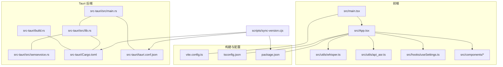
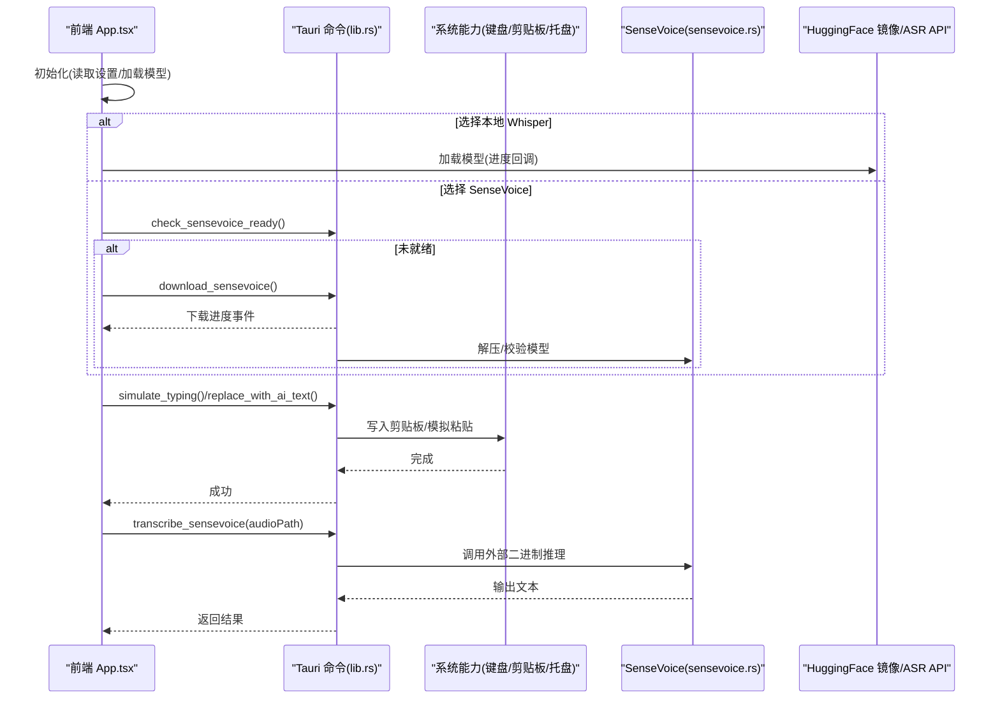
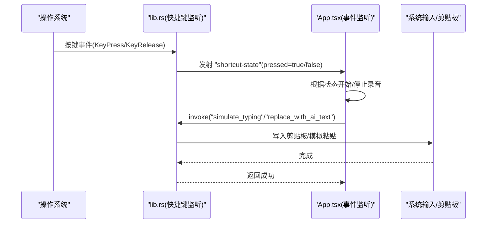
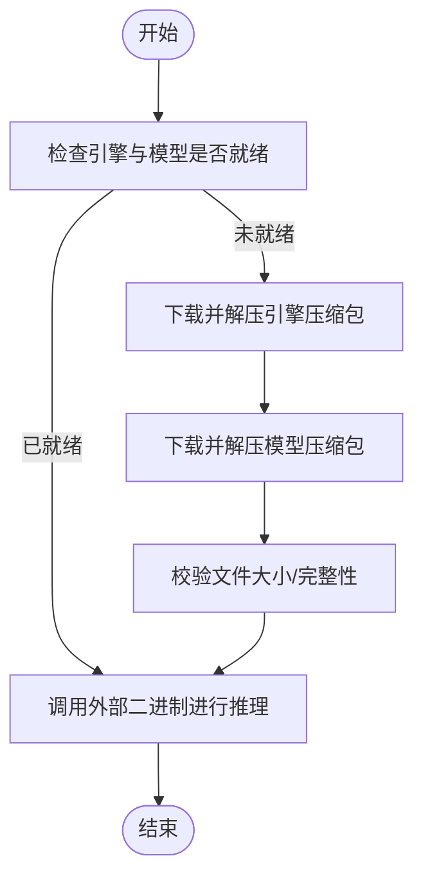
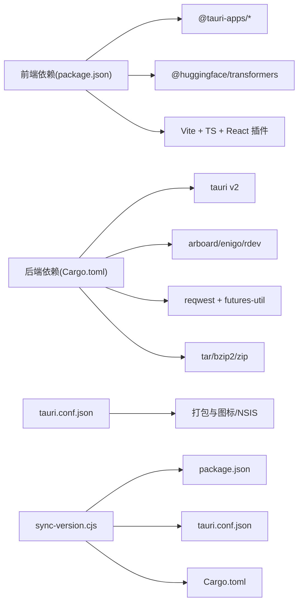

# 环境搭建

<cite>
**本文引用的文件**   
- [package.json](file://package.json)
- [vite.config.ts](file://vite.config.ts)
- [tsconfig.json](file://tsconfig.json)
- [README.md](file://README.md)
- [src-tauri/Cargo.toml](file://src-tauri/Cargo.toml)
- [src-tauri/tauri.conf.json](file://src-tauri/tauri.conf.json)
- [src-tauri/build.rs](file://src-tauri/build.rs)
- [scripts/sync-version.cjs](file://scripts/sync-version.cjs)
- [src/main.tsx](file://src/main.tsx)
- [src/App.tsx](file://src/App.tsx)
- [src/utils/whisper.ts](file://src/utils/whisper.ts)
- [src/utils/api_asr.ts](file://src/utils/api_asr.ts)
- [src/hooks/useSettings.ts](file://src/hooks/useSettings.ts)
- [src/components/SettingsPanel.tsx](file://src/components/SettingsPanel.tsx)
- [src-tauri/src/main.rs](file://src-tauri/src/main.rs)
- [src-tauri/src/lib.rs](file://src-tauri/src/lib.rs)
- [src-tauri/src/sensevoice.rs](file://src-tauri/src/sensevoice.rs)
</cite>

## 目录
1. [简介](#简介)
2. [项目结构](#项目结构)
3. [核心组件](#核心组件)
4. [架构总览](#架构总览)
5. [详细组件分析](#详细组件分析)
6. [依赖关系分析](#依赖关系分析)
7. [性能与兼容性](#性能与兼容性)
8. [故障排除指南](#故障排除指南)
9. [结论](#结论)
10. [附录](#附录)

## 简介
本指南面向首次接触 VoiceFlow_AI_002 的开发者，提供从零开始的环境搭建说明。项目采用 Tauri + React + TypeScript 技术栈，前端通过 Vite 构建，后端使用 Rust（Tauri v2）实现系统级能力（全局快捷键、剪贴板粘贴、托盘等），并支持本地语音识别（Whisper/WASM/WebGPU 或 SenseVoice 离线推理）与云端 ASR API 两种模式。文档涵盖 Node.js 与 Rust 工具链安装要求、版本兼容、开发环境初始化、环境变量配置、IDE 插件推荐、项目结构与配置文件作用说明、常见问题排查以及跨平台注意事项。

## 项目结构
- 前端工程位于根目录与 src 下，基于 React + TypeScript + Vite；Vite 端口与代理在 vite.config.ts 中配置。
- 桌面端宿主由 src-tauri 下的 Rust 代码提供，包含 Tauri 应用入口、命令暴露、系统交互与 SenseVoice 模型下载/推理逻辑。
- 脚本 scripts/sync-version.cjs 用于同步 package.json 与 Tauri/Cargo 的版本号。

图表来源
- [vite.config.ts:1-44](file://vite.config.ts#L1-L44)
- [tsconfig.json:1-26](file://tsconfig.json#L1-L26)
- [package.json:1-32](file://package.json#L1-L32)
- [src/main.tsx:1-10](file://src/main.tsx#L1-L10)
- [src/App.tsx:1-774](file://src/App.tsx#L1-L774)
- [src/utils/whisper.ts:1-174](file://src/utils/whisper.ts#L1-L174)
- [src/utils/api_asr.ts:1-73](file://src/utils/api_asr.ts#L1-L73)
- [src/hooks/useSettings.ts:1-96](file://src/hooks/useSettings.ts#L1-L96)
- [src-tauri/src/main.rs:1-9](file://src-tauri/src/main.rs#L1-L9)
- [src-tauri/src/lib.rs:1-287](file://src-tauri/src/lib.rs#L1-L287)
- [src-tauri/src/sensevoice.rs:1-476](file://src-tauri/src/sensevoice.rs#L1-L476)
- [src-tauri/Cargo.toml:1-47](file://src-tauri/Cargo.toml#L1-L47)
- [src-tauri/tauri.conf.json:1-68](file://src-tauri/tauri.conf.json#L1-L68)
- [src-tauri/build.rs:1-4](file://src-tauri/build.rs#L1-L4)
- [scripts/sync-version.cjs:1-35](file://scripts/sync-version.cjs#L1-L35)

章节来源
- [README.md:1-8](file://README.md#L1-L8)
- [package.json:1-32](file://package.json#L1-L32)
- [vite.config.ts:1-44](file://vite.config.ts#L1-L44)
- [tsconfig.json:1-26](file://tsconfig.json#L1-L26)
- [src-tauri/Cargo.toml:1-47](file://src-tauri/Cargo.toml#L1-L47)
- [src-tauri/tauri.conf.json:1-68](file://src-tauri/tauri.conf.json#L1-L68)
- [scripts/sync-version.cjs:1-35](file://scripts/sync-version.cjs#L1-L35)

## 核心组件
- 前端入口与路由：React 应用从 main.tsx 启动，App.tsx 承载主界面、状态机、窗口控制、事件监听与业务编排。
- 语音识别：
  - 本地 Whisper：通过 @huggingface/transformers 加载模型，优先 WebGPU，失败回退到 WASM，支持进度回调与自动释放。
  - 云端 ASR：将音频编码为 WAV 后调用 OpenAI 兼容接口进行转写。
- 系统能力（Rust/Tauri）：
  - 全局快捷键监听、活动窗口信息获取、剪贴板读写、模拟粘贴、托盘菜单、窗口显隐控制。
  - SenseVoice 离线推理：检查/下载引擎与模型，调用外部二进制执行转写。
- 配置与持久化：
  - 设置项集中管理，默认值与迁移兼容处理，保存至 localStorage，部分设置同步到 Rust 进程。
  - Tauri 配置定义窗口、安全策略、打包图标与 NSIS 语言等。

章节来源
- [src/main.tsx:1-10](file://src/main.tsx#L1-L10)
- [src/App.tsx:1-774](file://src/App.tsx#L1-L774)
- [src/utils/whisper.ts:1-174](file://src/utils/whisper.ts#L1-L174)
- [src/utils/api_asr.ts:1-73](file://src/utils/api_asr.ts#L1-L73)
- [src/hooks/useSettings.ts:1-96](file://src/hooks/useSettings.ts#L1-L96)
- [src-tauri/src/lib.rs:1-287](file://src-tauri/src/lib.rs#L1-L287)
- [src-tauri/src/sensevoice.rs:1-476](file://src-tauri/src/sensevoice.rs#L1-L476)
- [src-tauri/tauri.conf.json:1-68](file://src-tauri/tauri.conf.json#L1-L68)

## 架构总览
下图展示前后端交互与关键流程：前端通过 Tauri invoke 调用 Rust 命令，Rust 负责系统输入、剪贴板、托盘与 SenseVoice 推理；前端同时可直接调用浏览器 API 与远程服务（ASR API、HuggingFace 镜像）。

图表来源
- [src/App.tsx:1-774](file://src/App.tsx#L1-L774)
- [src-tauri/src/lib.rs:1-287](file://src-tauri/src/lib.rs#L1-L287)
- [src-tauri/src/sensevoice.rs:1-476](file://src-tauri/src/sensevoice.rs#L1-L476)
- [src/utils/whisper.ts:1-174](file://src/utils/whisper.ts#L1-L174)
- [src/utils/api_asr.ts:1-73](file://src/utils/api_asr.ts#L1-L73)

## 详细组件分析

### 环境与工具链要求
- Node.js
  - 项目使用 ES Module 与较新的 Vite 版本，建议使用 Node.js 18+（官方推荐 LTS）。
  - 包管理器：npm 或 pnpm/yarn 均可，确保能解析 package.json 中的 type: module。
- Rust 工具链
  - 需要稳定版 Rust 编译器与 Cargo。Windows 上需安装 Visual Studio Build Tools（MSVC 工具链）以编译原生依赖。
  - Tauri v2 生态对 Rust 版本有最低要求，建议保持最新稳定版以获得最佳兼容性。
- 其他
  - Windows 用户建议安装 WebView2 运行时（Tauri 依赖）。
  - 若启用 WebGPU 加速，请确保操作系统与显卡驱动支持 WebGPU。

章节来源
- [package.json:1-32](file://package.json#L1-L32)
- [vite.config.ts:1-44](file://vite.config.ts#L1-L44)
- [src-tauri/Cargo.toml:1-47](file://src-tauri/Cargo.toml#L1-L47)
- [README.md:1-8](file://README.md#L1-L8)

### 开发环境初始化步骤
- 克隆仓库并进入项目根目录。
- 安装前端依赖：
  - npm install
- 安装 Tauri CLI（可选，也可通过 npx tauri 运行）：
  - npm install -D @tauri-apps/cli
- 验证前端开发服务器：
  - npm run dev
  - 确认 Vite 在 1420 端口启动（见 vite.config.ts 配置）。
- 启动 Tauri 开发模式：
  - npm run tauri dev
  - 该命令会先执行 beforeDevCommand（npm run dev），再启动 Tauri 宿主。
- 构建产物：
  - npm run build
  - 构建完成后，Tauri 会将 dist 目录作为前端资源。

章节来源
- [package.json:1-32](file://package.json#L1-L32)
- [vite.config.ts:1-44](file://vite.config.ts#L1-L44)
- [src-tauri/tauri.conf.json:1-68](file://src-tauri/tauri.conf.json#L1-L68)

### 环境变量与代理配置
- 开发时 HMR 主机
  - 可通过 TAURI_DEV_HOST 指定 Vite HMR 主机，便于远程调试或容器化场景。
- 前端代理
  - 开发模式下，/hf 路径被代理到 hf-mirror.com，用于加速 HuggingFace 模型下载。
- 生产环境
  - 前端直接访问 hf-mirror.com 镜像站，避免跨域问题。

章节来源
- [vite.config.ts:1-44](file://vite.config.ts#L1-L44)
- [src/utils/whisper.ts:1-174](file://src/utils/whisper.ts#L1-L174)

### IDE 与插件推荐
- VS Code
  - 安装 Tauri 扩展与 rust-analyzer，获得 Tauri 命令提示与 Rust 类型补全。
- 其他建议
  - 启用 ESLint/Prettier（如项目后续引入）
  - 启用 TypeScript 严格模式（已在 tsconfig.json 开启）

章节来源
- [README.md:1-8](file://README.md#L1-L8)
- [tsconfig.json:1-26](file://tsconfig.json#L1-L26)

### 项目结构与配置文件说明
- 前端
  - src/main.tsx：React 根节点挂载。
  - src/App.tsx：主业务逻辑、窗口控制、事件监听、录音与转写流程。
  - src/utils/whisper.ts：本地 Whisper 模型加载与推理封装。
  - src/utils/api_asr.ts：云端 ASR 客户端封装。
  - src/hooks/useSettings.ts：设置项管理与持久化。
  - src/components/*：面板组件。
- 构建与配置
  - vite.config.ts：Vite 插件、端口、HMR、代理与忽略监听规则。
  - tsconfig.json：TypeScript 编译选项与模块解析。
  - package.json：脚本、依赖与开发依赖。
- Tauri 后端
  - src-tauri/src/main.rs：应用入口，调用 lib 的 run。
  - src-tauri/src/lib.rs：注册 Tauri 命令、托盘、全局快捷键、剪贴板与窗口事件。
  - src-tauri/src/sensevoice.rs：SenseVoice 引擎与模型下载、解压、校验与推理。
  - src-tauri/Cargo.toml：Rust 依赖与特性开关。
  - src-tauri/tauri.conf.json：应用元数据、窗口与安全策略、打包配置。
  - src-tauri/build.rs：Tauri 构建钩子。
- 脚本
  - scripts/sync-version.cjs：同步 package.json 版本号到 tauri.conf.json 与 Cargo.toml。

章节来源
- [src/main.tsx:1-10](file://src/main.tsx#L1-L10)
- [src/App.tsx:1-774](file://src/App.tsx#L1-L774)
- [src/utils/whisper.ts:1-174](file://src/utils/whisper.ts#L1-L174)
- [src/utils/api_asr.ts:1-73](file://src/utils/api_asr.ts#L1-L73)
- [src/hooks/useSettings.ts:1-96](file://src/hooks/useSettings.ts#L1-L96)
- [vite.config.ts:1-44](file://vite.config.ts#L1-L44)
- [tsconfig.json:1-26](file://tsconfig.json#L1-L26)
- [package.json:1-32](file://package.json#L1-L32)
- [src-tauri/src/main.rs:1-9](file://src-tauri/src/main.rs#L1-L9)
- [src-tauri/src/lib.rs:1-287](file://src-tauri/src/lib.rs#L1-L287)
- [src-tauri/src/sensevoice.rs:1-476](file://src-tauri/src/sensevoice.rs#L1-L476)
- [src-tauri/Cargo.toml:1-47](file://src-tauri/Cargo.toml#L1-L47)
- [src-tauri/tauri.conf.json:1-68](file://src-tauri/tauri.conf.json#L1-L68)
- [src-tauri/build.rs:1-4](file://src-tauri/build.rs#L1-L4)
- [scripts/sync-version.cjs:1-35](file://scripts/sync-version.cjs#L1-L35)

### 关键流程时序图

#### 全局快捷键触发与文本替换

图表来源
- [src-tauri/src/lib.rs:1-287](file://src-tauri/src/lib.rs#L1-L287)
- [src/App.tsx:1-774](file://src/App.tsx#L1-L774)

#### SenseVoice 模型下载与推理

图表来源
- [src-tauri/src/sensevoice.rs:1-476](file://src-tauri/src/sensevoice.rs#L1-L476)

## 依赖关系分析
- 前端依赖
  - React 19、@vitejs/plugin-react、Vite 7、TypeScript 5.8、@huggingface/transformers 4.x、Tauri 前端 API 与插件。
- 后端依赖
  - Tauri v2、serde/serde_json、enigo、arboard、rdev、reqwest、tar/bzip2/zip、futures-util 等。
- 构建与打包
  - Tauri 构建脚本、NSIS 安装包语言配置、多尺寸图标。

图表来源
- [package.json:1-32](file://package.json#L1-L32)
- [src-tauri/Cargo.toml:1-47](file://src-tauri/Cargo.toml#L1-L47)
- [src-tauri/tauri.conf.json:1-68](file://src-tauri/tauri.conf.json#L1-L68)
- [scripts/sync-version.cjs:1-35](file://scripts/sync-version.cjs#L1-L35)

章节来源
- [package.json:1-32](file://package.json#L1-L32)
- [src-tauri/Cargo.toml:1-47](file://src-tauri/Cargo.toml#L1-L47)
- [src-tauri/tauri.conf.json:1-68](file://src-tauri/tauri.conf.json#L1-L68)
- [scripts/sync-version.cjs:1-35](file://scripts/sync-version.cjs#L1-L35)

## 性能与兼容性
- 本地语音识别
  - Whisper 优先使用 WebGPU，失败自动回退到 WASM；长时间无操作会自动释放上下文以节省内存。
  - 建议在具备 WebGPU 支持的平台上启用 GPU 加速以提升性能。
- 网络与镜像
  - 开发模式通过 Vite 代理 /hf 到 hf-mirror.com，提升国内下载速度；生产模式直连镜像站。
- 构建优化
  - Rust release 配置启用 strip、LTO、opt-level=z，减小体积并提升运行效率。

章节来源
- [src/utils/whisper.ts:1-174](file://src/utils/whisper.ts#L1-L174)
- [vite.config.ts:1-44](file://vite.config.ts#L1-L44)
- [src-tauri/Cargo.toml:1-47](file://src-tauri/Cargo.toml#L1-L47)

## 故障排除指南
- 无法启动 Tauri 开发模式
  - 确认已安装 Rust 稳定版与 MSVC 工具链（Windows），WebView2 已安装。
  - 检查端口 1420 是否被占用（Vite 固定端口）。
- 模型下载失败或超时
  - 检查网络连通性与代理设置；可尝试切换镜像源或手动下载后放置到应用数据目录。
  - 观察“下载进度”事件，定位具体步骤失败原因。
- WebGPU 不可用或推理崩溃
  - 系统将自动回退到 WASM；如仍失败，检查浏览器/WebView2 版本与显卡驱动。
- 快捷键无效或被拦截
  - 检查黑名单配置（useSettings.ts 默认包含常见游戏进程名），必要时调整 listen_key 与黑名单。
- 剪贴板/粘贴异常
  - 某些应用可能屏蔽粘贴；可在目标应用中尝试手动粘贴或使用不同输入法。
- 设置未生效
  - 确认点击“保存配置”，并在设置面板查看日志；必要时重启应用。

章节来源
- [src-tauri/tauri.conf.json:1-68](file://src-tauri/tauri.conf.json#L1-L68)
- [src/utils/whisper.ts:1-174](file://src/utils/whisper.ts#L1-L174)
- [src-tauri/src/sensevoice.rs:1-476](file://src-tauri/src/sensevoice.rs#L1-L476)
- [src/hooks/useSettings.ts:1-96](file://src/hooks/useSettings.ts#L1-L96)
- [src-tauri/src/lib.rs:1-287](file://src-tauri/src/lib.rs#L1-L287)

## 结论
本项目通过 Tauri 将现代 Web 技术与系统能力结合，提供了高效的语音听写与 AI 润色体验。遵循本指南完成环境搭建与基础配置后，即可在本地快速开发与调试。遇到网络或硬件兼容性问题时，可参考故障排除章节逐步定位与解决。

## 附录
- 常用命令
  - 开发：npm run dev / npm run tauri dev
  - 构建：npm run build
  - 预览：npm run preview
- 版本同步
  - 修改 package.json 版本后，运行 npm run version 以同步到 tauri.conf.json 与 Cargo.toml。

章节来源
- [package.json:1-32](file://package.json#L1-L32)
- [scripts/sync-version.cjs:1-35](file://scripts/sync-version.cjs#L1-L35)