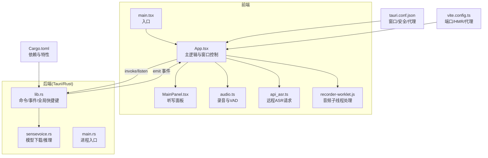
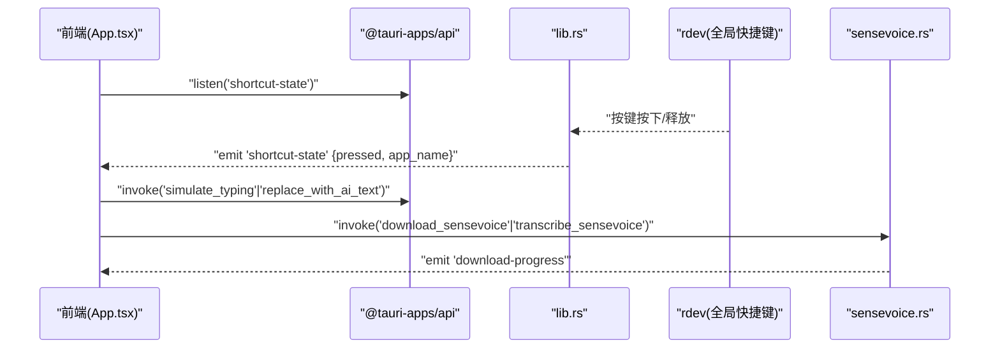
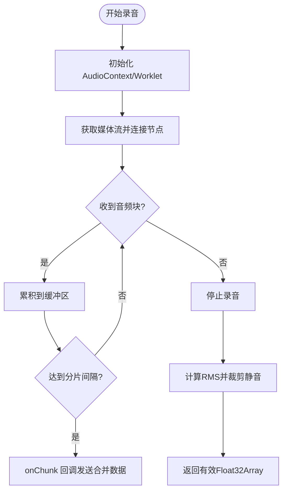
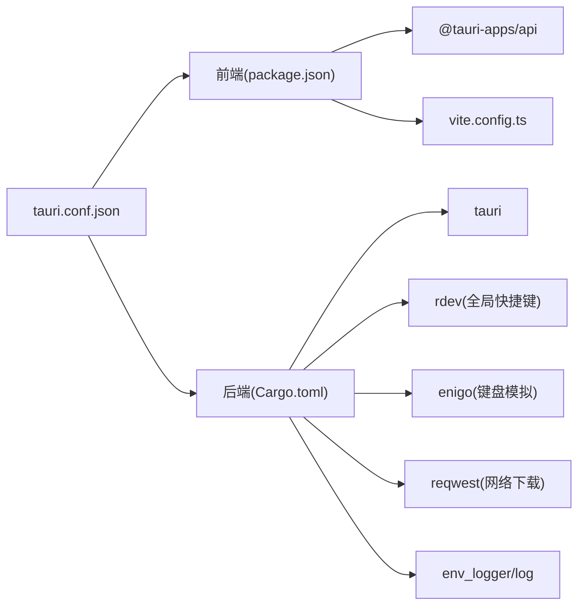

# 调试技巧

<cite>
**本文引用的文件**
- [README.md](file://README.md)
- [package.json](file://package.json)
- [vite.config.ts](file://vite.config.ts)
- [src/main.tsx](file://src/main.tsx)
- [src/App.tsx](file://src/App.tsx)
- [src/components/MainPanel.tsx](file://src/components/MainPanel.tsx)
- [src/utils/api_asr.ts](file://src/utils/api_asr.ts)
- [src/utils/audio.ts](file://src/utils/audio.ts)
- [public/recorder-worklet.js](file://public/recorder-worklet.js)
- [src-tauri/Cargo.toml](file://src-tauri/Cargo.toml)
- [src-tauri/tauri.conf.json](file://src-tauri/tauri.conf.json)
- [src-tauri/src/main.rs](file://src-tauri/src/main.rs)
- [src-tauri/src/lib.rs](file://src-tauri/src/lib.rs)
- [src-tauri/src/sensevoice.rs](file://src-tauri/src/sensevoice.rs)
</cite>

## 目录
1. [简介](#简介)
2. [项目结构](#项目结构)
3. [核心组件](#核心组件)
4. [架构总览](#架构总览)
5. [详细组件分析](#详细组件分析)
6. [依赖关系分析](#依赖关系分析)
7. [性能考虑](#性能考虑)
8. [故障排查指南](#故障排查指南)
9. [结论](#结论)

## 简介
本调试指南面向 VoiceFlow_AI_002（Tauri + React + TypeScript）应用，覆盖前端与 Rust 后端的调试方法、前后端通信问题定位、常见问题诊断步骤与解决方案，以及性能瓶颈分析与优化建议。读者无需深入源码即可按步骤完成常见问题的定位与修复。

## 项目结构
- 前端：React + Vite，提供语音采集、ASR 调用（本地或 API）、AI 润色、UI 面板与状态管理。
- 后端：Tauri + Rust，提供系统快捷键监听、剪贴板输入模拟、SenseVoice 模型下载与推理、托盘菜单等能力。
- 构建与开发：Vite 作为前端开发服务器，Tauri CLI 驱动打包与运行；CSP 与安全策略由 tauri.conf.json 配置。

图表来源
- [src/main.tsx:1-10](file://src/main.tsx#L1-L10)
- [src/App.tsx:1-774](file://src/App.tsx#L1-L774)
- [src/components/MainPanel.tsx:1-127](file://src/components/MainPanel.tsx#L1-L127)
- [src/utils/audio.ts:1-221](file://src/utils/audio.ts#L1-L221)
- [src/utils/api_asr.ts:1-73](file://src/utils/api_asr.ts#L1-L73)
- [public/recorder-worklet.js:1-39](file://public/recorder-worklet.js#L1-L39)
- [src-tauri/src/lib.rs:1-287](file://src-tauri/src/lib.rs#L1-L287)
- [src-tauri/src/sensevoice.rs:1-476](file://src-tauri/src/sensevoice.rs#L1-L476)
- [src-tauri/src/main.rs:1-9](file://src-tauri/src/main.rs#L1-L9)
- [src-tauri/tauri.conf.json:1-68](file://src-tauri/tauri.conf.json#L1-L68)
- [vite.config.ts:1-44](file://vite.config.ts#L1-L44)
- [src-tauri/Cargo.toml:1-47](file://src-tauri/Cargo.toml#L1-L47)

章节来源
- [README.md:1-8](file://README.md#L1-L8)
- [package.json:1-32](file://package.json#L1-L32)
- [vite.config.ts:1-44](file://vite.config.ts#L1-L44)
- [src-tauri/tauri.conf.json:1-68](file://src-tauri/tauri.conf.json#L1-L68)

## 核心组件
- 前端入口与根组件：负责挂载 React 应用、初始化 App 根组件。
- App 主逻辑：集中管理录音流程、状态机、Rust IPC 调用、事件监听、浮窗指示器同步、自动启动设置、历史记录与设置持久化。
- 录音模块：基于 Web Audio API 与 AudioWorklet 实现低延迟采样、分片回调、静音检测（VAD）。
- ASR 客户端：支持本地 Whisper/SenseVoice 与远程 OpenAI 兼容接口。
- Tauri 后端：暴露 invoke 命令（如打字模拟、替换文本、SenseVoice 下载/推理），注册全局快捷键监听并广播事件。

章节来源
- [src/main.tsx:1-10](file://src/main.tsx#L1-L10)
- [src/App.tsx:1-774](file://src/App.tsx#L1-L774)
- [src/utils/audio.ts:1-221](file://src/utils/audio.ts#L1-L221)
- [src/utils/api_asr.ts:1-73](file://src/utils/api_asr.ts#L1-L73)
- [src-tauri/src/lib.rs:1-287](file://src-tauri/src/lib.rs#L1-L287)
- [src-tauri/src/sensevoice.rs:1-476](file://src-tauri/src/sensevoice.rs#L1-L476)

## 架构总览
下图展示了关键交互路径：前端通过 @tauri-apps/api 的 invoke 调用 Rust 命令，使用 listen 订阅后端事件；Rust 侧通过 rdev 监听系统按键，结合 enigo 模拟粘贴，并通过 Tauri 事件向前端推送状态。

图表来源
- [src/App.tsx:256-286](file://src/App.tsx#L256-L286)
- [src-tauri/src/lib.rs:140-212](file://src-tauri/src/lib.rs#L140-L212)
- [src-tauri/src/sensevoice.rs:295-443](file://src-tauri/src/sensevoice.rs#L295-L443)

## 详细组件分析

### 前端调试要点
- 浏览器开发者工具
  - 控制台日志：应用内已劫持 console.log/warn/error，可在“偏好设置”面板查看带时间戳的日志列表，便于快速定位错误上下文。
  - 网络面板：用于监控 ASR API 请求（POST /v1/audio/transcriptions），检查请求头 Authorization、表单字段 file/model、响应体 text 字段。
  - 性能面板：录制一次完整录音到 AI 润色的过程，关注 MediaRecorder/AudioWorklet 数据流耗时、fetch 耗时、渲染重排。
  - 断点调试：在 App 的关键函数处设置断点（开始录音、停止并处理、ASR 调用、AI 润色、IPC 调用），逐步观察状态变化。
- React DevTools
  - 安装 Chrome 扩展，启用“组件树”和“Profiler”，记录一次完整流程，识别重渲染热点。
  - 在“Hooks”中查看 useState/useEffect 的状态变更，确认状态机流转是否符合预期。
- 多窗口与事件
  - 主窗口与“小药丸”指示窗口通过 label 区分，使用 emit/listen 进行跨窗口通信。调试时可在两个窗口分别打开控制台，观察事件收发。
- 音频工作线程
  - recorder-worklet.js 在主线程与音频子线程之间传递 Float32Array 块。若出现无声或卡顿，检查 Worklet 加载、AudioContext 状态、AnalyserNode 是否就绪。

章节来源
- [src/App.tsx:30-69](file://src/App.tsx#L30-L69)
- [src/App.tsx:120-171](file://src/App.tsx#L120-L171)
- [src/App.tsx:288-354](file://src/App.tsx#L288-L354)
- [src/utils/audio.ts:1-221](file://src/utils/audio.ts#L1-L221)
- [public/recorder-worklet.js:1-39](file://public/recorder-worklet.js#L1-L39)

### Rust 后端调试要点
- 日志输出
  - 使用 env_logger 初始化日志，配合 log crate 的 info!/error! 宏输出关键路径信息（如快捷键事件、黑名单拦截、下载进度、错误堆栈）。
  - 在 Windows 下 release 模式隐藏控制台窗口，debug 模式可看到标准输出。
- 断点调试
  - 使用 VS Code + rust-analyzer，在 lib.rs 的命令入口、事件回调、sensevoice.rs 的下载/解压/推理处设置断点。
  - 使用 Cargo 的 run/debug 配置，附加到 Tauri 进程进行调试。
- 性能分析
  - 对下载与解压流程使用 spawn_blocking 避免阻塞异步运行时；必要时使用 profiling 工具（如 perf、Visual Studio Profiler）定位热点。
- 外部进程调用
  - SenseVoice 推理通过 std::process::Command 调用 sherpa-onnx 二进制，注意参数拼接与 stdout 解析。

章节来源
- [src-tauri/src/lib.rs:1-287](file://src-tauri/src/lib.rs#L1-L287)
- [src-tauri/src/sensevoice.rs:1-476](file://src-tauri/src/sensevoice.rs#L1-L476)
- [src-tauri/Cargo.toml:20-47](file://src-tauri/Cargo.toml#L20-L47)

### 前后端通信（Tauri IPC）调试
- 事件通道
  - 快捷键事件：Rust 侧监听 rdev 事件，匹配目标键与黑名单后，通过 app_handle.emit("shortcut-state", payload) 推送至前端。
  - 下载进度：Rust 侧在流式下载过程中 emit("download-progress", {step, progress})，前端监听更新进度条。
- 命令调用
  - simulate_typing/replace_with_ai_text：将文本写入剪贴板并模拟 Ctrl/Cmd+V 粘贴，适用于任意焦点应用。
  - set_listen_key/set_blacklist：前端同步快捷键与黑名单到 Rust 状态。
  - SenseVoice 相关：check/download/transcribe。
- 调试建议
  - 在前端 listen 回调中打印 payload，确认事件到达与字段正确性。
  - 在 Rust 命令入口处打印入参与返回值，确保序列化/反序列化正常。
  - 检查 CSP 与 connect-src 白名单，确保 fetch 与 WebSocket 不被拦截。

章节来源
- [src-tauri/src/lib.rs:140-212](file://src-tauri/src/lib.rs#L140-L212)
- [src-tauri/src/lib.rs:275-283](file://src-tauri/src/lib.rs#L275-L283)
- [src-tauri/src/sensevoice.rs:295-443](file://src-tauri/src/sensevoice.rs#L295-L443)
- [src/App.tsx:256-286](file://src/App.tsx#L256-L286)
- [src-tauri/tauri.conf.json:44-46](file://src-tauri/tauri.conf.json#L44-L46)

### 音频采集与 VAD 调试
- 流程概览
  - 获取麦克风权限，创建 16kHz AudioContext，连接 AnalyserNode 与 RecorderWorkletProcessor。
  - 子线程每 4096 样本推送一次 Float32Array，主线程累积并在间隔触发分片回调（伪流式）。
  - stop() 时执行 VAD：计算每个 chunk 的 RMS，去除首尾静音段，返回有效音频。
- 常见问题
  - 无声：检查 getUserMedia 权限、浏览器策略（需用户手势唤醒 AudioContext）、设备选择。
  - 卡顿：降低分片大小或减少主线程处理开销；确保 onChunk 回调非阻塞。
  - 音量过低：调整阈值或提示用户靠近麦克风。

图表来源
- [src/utils/audio.ts:12-73](file://src/utils/audio.ts#L12-L73)
- [src/utils/audio.ts:109-173](file://src/utils/audio.ts#L109-L173)
- [public/recorder-worklet.js:1-39](file://public/recorder-worklet.js#L1-L39)

章节来源
- [src/utils/audio.ts:1-221](file://src/utils/audio.ts#L1-L221)
- [public/recorder-worklet.js:1-39](file://public/recorder-worklet.js#L1-L39)

### ASR 与 AI 润色调试
- 本地模型（Whisper/SenseVoice）
  - 首次启动会下载模型与 tokens，前端监听 download-progress 事件更新进度。
  - SenseVoice 推理通过命令行调用 sherpa-onnx 二进制，stdout 可能包含日志，需提取 JSON 或最后一行文本。
- 远程 API
  - 将 Float32Array 编码为 WAV Blob，POST 到 /v1/audio/transcriptions，携带 Authorization 头与 model 字段。
- 调试建议
  - 本地模型：检查 app_data_dir/sherpa-onnx 目录结构与文件大小校验；确认 exe 存在且可执行。
  - 远程 API：在网络面板检查请求 URL、头部、表单字段与响应体；捕获异常消息并显示给用户。

章节来源
- [src/App.tsx:186-221](file://src/App.tsx#L186-L221)
- [src/App.tsx:516-552](file://src/App.tsx#L516-L552)
- [src/utils/api_asr.ts:41-73](file://src/utils/api_asr.ts#L41-L73)
- [src-tauri/src/sensevoice.rs:445-476](file://src-tauri/src/sensevoice.rs#L445-L476)

### 剪贴板与输入法兼容性
- simulate_typing/replace_with_ai_text 使用 enigo 模拟 Ctrl/Cmd+V 粘贴，逐字删除临时占位符以避免输入法干扰。
- 调试建议
  - 在目标应用前手动清空剪贴板，验证粘贴行为。
  - 在不同输入法环境下测试，必要时增加短暂延时以确保应用处理完成。

章节来源
- [src-tauri/src/lib.rs:45-118](file://src-tauri/src/lib.rs#L45-L118)

## 依赖关系分析
- 前端依赖
  - React、@tauri-apps/api、插件（autostart、fs、opener）、lucide-react 图标库。
  - Vite 开发服务器固定端口 1420，HMR 端口 1421，忽略 src-tauri 变更。
- 后端依赖
  - tauri、tauri-plugin-opener、serde/serde_json、enigo、device_query、arboard、active-win-pos-rs、rdev、log/env_logger、reqwest、tar/bzip2/zip、futures-util。
- 安全与网络
  - tauri.conf.json 的 CSP 允许 https/http localhost 连接，脚本与 worker 源限制严格。
  - vite.config.ts 提供 hf-mirror 代理，便于国内访问 HuggingFace 资源。

图表来源
- [package.json:13-30](file://package.json#L13-L30)
- [vite.config.ts:16-41](file://vite.config.ts#L16-L41)
- [src-tauri/Cargo.toml:20-47](file://src-tauri/Cargo.toml#L20-L47)
- [src-tauri/tauri.conf.json:44-46](file://src-tauri/tauri.conf.json#L44-L46)

章节来源
- [package.json:1-32](file://package.json#L1-L32)
- [vite.config.ts:1-44](file://vite.config.ts#L1-L44)
- [src-tauri/Cargo.toml:1-47](file://src-tauri/Cargo.toml#L1-L47)
- [src-tauri/tauri.conf.json:1-68](file://src-tauri/tauri.conf.json#L1-L68)

## 性能考虑
- 前端
  - 音频处理：保持 onChunk 回调轻量，避免阻塞定时器；合理设置分片间隔（默认 2000ms）以平衡实时性与网络负载。
  - 渲染优化：使用 React Profiler 识别重渲染热点，减少不必要 state 更新；对长列表（历史）使用虚拟滚动。
  - 网络：缓存模型与 tokens，避免重复下载；失败重试与镜像切换已在后端实现。
- 后端
  - 下载与解压：使用 spawn_blocking 避免阻塞异步运行时；流式下载并上报进度，提升用户体验。
  - 进程调用：SenseVoice 推理为 CPU 密集型，建议在空闲时段或后台任务中执行；必要时限制并发。
  - 日志级别：生产环境降低日志级别以减少 IO 开销。

[本节为通用指导，不直接分析具体文件]

## 故障排查指南

### 前端常见问题
- 无法启动麦克风
  - 现象：startRecording 抛出异常，状态进入 error。
  - 排查：检查浏览器权限、HTTPS 环境、getUserMedia 返回；在 audio.ts 的 start 处设置断点。
  - 参考路径
    - [src/App.tsx:374-435](file://src/App.tsx#L374-L435)
    - [src/utils/audio.ts:12-73](file://src/utils/audio.ts#L12-L73)
- 全静音被 VAD 拦截
  - 现象：stopAndProcess 检测到空音频或最大振幅过低，提示“收音音量过低”。
  - 排查：调整阈值或靠近麦克风；在 getAccumulatedAudio/stop 处打印 RMS 值。
  - 参考路径
    - [src/App.tsx:493-505](file://src/App.tsx#L493-L505)
    - [src/utils/audio.ts:132-173](file://src/utils/audio.ts#L132-L173)
- 模型初始化失败
  - 现象：initializing 阶段报错，提示需要检查网络或重新运行。
  - 排查：检查 download-progress 事件与进度；确认 app_data_dir/sherpa-onnx 目录完整性；尝试重试。
  - 参考路径
    - [src/App.tsx:186-221](file://src/App.tsx#L186-L221)
    - [src-tauri/src/sensevoice.rs:309-443](file://src-tauri/src/sensevoice.rs#L309-L443)
- 远程 ASR 请求失败
  - 现象：网络面板显示 4xx/5xx，或响应体无 text 字段。
  - 排查：检查 apiUrl、apiKey、model；确认 CSP 允许连接；在 api_asr.ts 中捕获并打印错误。
  - 参考路径
    - [src/utils/api_asr.ts:41-73](file://src/utils/api_asr.ts#L41-L73)

### 后端常见问题
- 快捷键未触发
  - 现象：前端未收到 shortcut-state 事件。
  - 排查：检查 listen_key 映射是否正确；确认黑名单未拦截；在 rdev 回调处打印事件。
  - 参考路径
    - [src-tauri/src/lib.rs:140-212](file://src-tauri/src/lib.rs#L140-L212)
- 剪贴板粘贴无效
  - 现象：simulate_typing/replace_with_ai_text 未生效。
  - 排查：确认目标应用支持 Ctrl/Cmd+V；适当增加延时；检查 enigo 平台差异。
  - 参考路径
    - [src-tauri/src/lib.rs:45-118](file://src-tauri/src/lib.rs#L45-L118)
- SenseVoice 推理失败
  - 现象：transcribe_sensevoice 返回错误或 stdout 为空。
  - 排查：检查 exe 与模型文件是否存在；确认参数拼接；查看 stdout 内容并解析。
  - 参考路径
    - [src-tauri/src/sensevoice.rs:445-476](file://src-tauri/src/sensevoice.rs#L445-L476)

### 前后端通信问题
- 事件未到达
  - 现象：前端 listen 未触发。
  - 排查：确认事件名一致；检查 windowLabel 是否为 main；在后端 emit 处打印 payload。
  - 参考路径
    - [src/App.tsx:256-286](file://src/App.tsx#L256-L286)
    - [src-tauri/src/lib.rs:178-202](file://src-tauri/src/lib.rs#L178-L202)
- 下载进度不更新
  - 现象：前端未收到 download-progress。
  - 排查：检查 emit 频率与 expected_size > 0 条件；确认前端 unlisten 时机。
  - 参考路径
    - [src-tauri/src/sensevoice.rs:138-146](file://src-tauri/src/sensevoice.rs#L138-L146)
    - [src/App.tsx:199-206](file://src/App.tsx#L199-L206)

章节来源
- [src/App.tsx:374-435](file://src/App.tsx#L374-L435)
- [src/App.tsx:493-505](file://src/App.tsx#L493-L505)
- [src/App.tsx:186-221](file://src/App.tsx#L186-L221)
- [src/utils/api_asr.ts:41-73](file://src/utils/api_asr.ts#L41-L73)
- [src-tauri/src/lib.rs:140-212](file://src-tauri/src/lib.rs#L140-L212)
- [src-tauri/src/lib.rs:45-118](file://src-tauri/src/lib.rs#L45-L118)
- [src-tauri/src/sensevoice.rs:445-476](file://src-tauri/src/sensevoice.rs#L445-L476)
- [src-tauri/src/sensevoice.rs:138-146](file://src-tauri/src/sensevoice.rs#L138-L146)

## 结论
通过合理的浏览器与 Rust 调试手段、清晰的 IPC 事件与命令链路、完善的日志与错误提示，可以快速定位并解决语音随写应用的常见问题。在生产环境中，建议关闭冗余日志、优化音频分片与渲染路径，并结合性能分析工具持续改进体验。