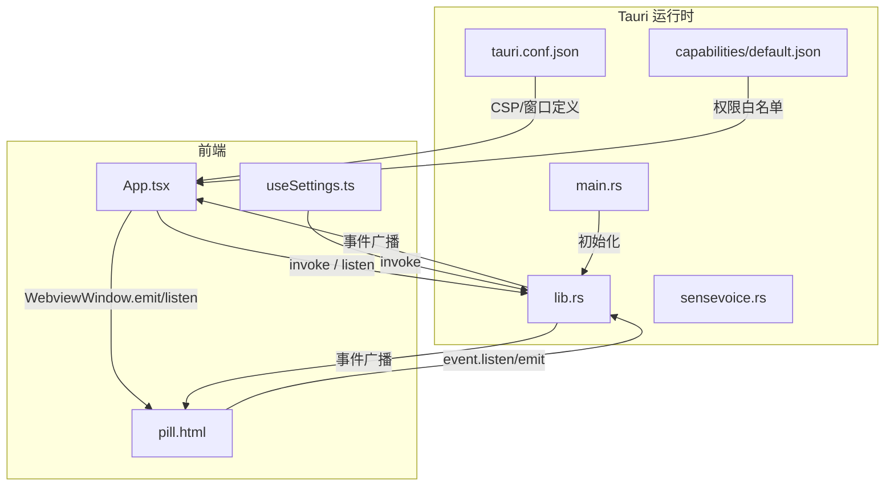
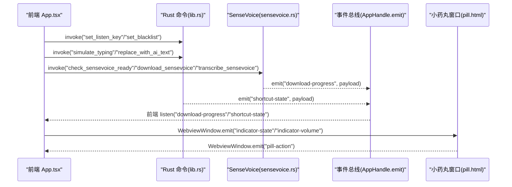
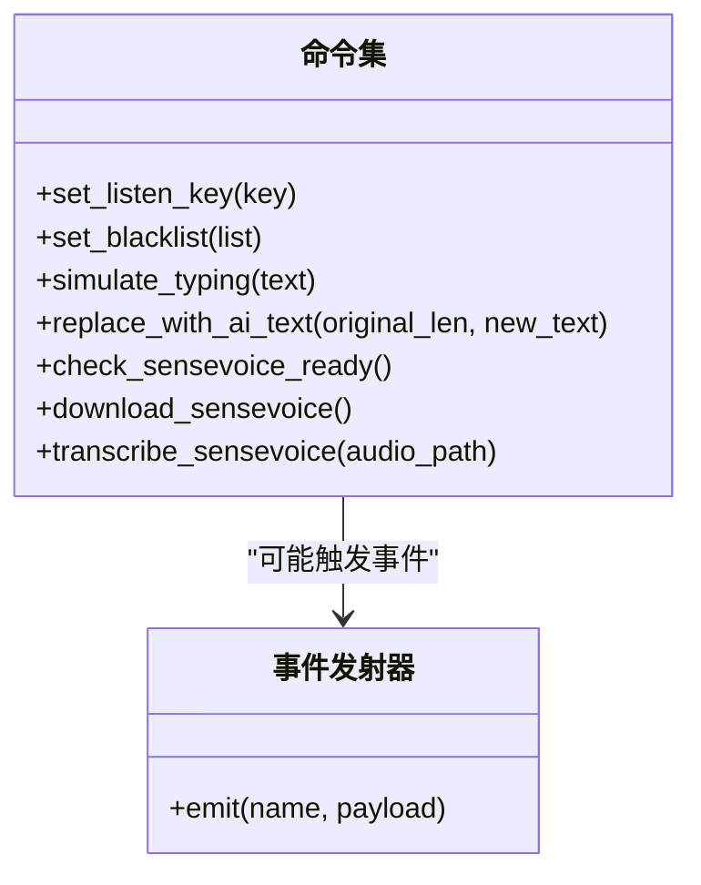
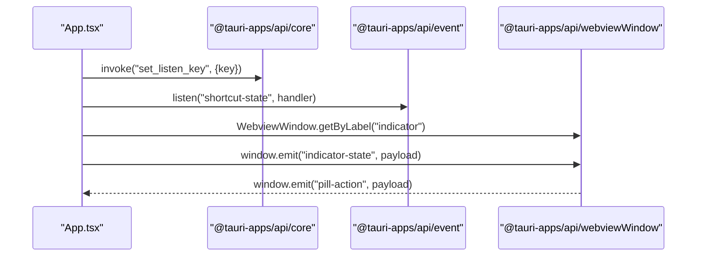
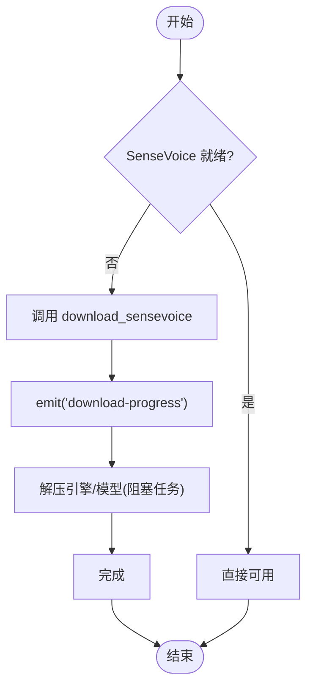
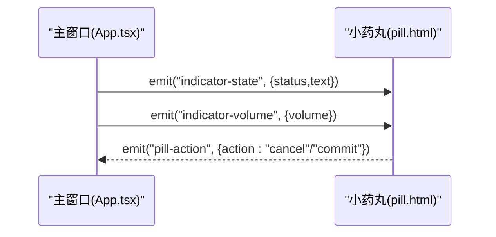
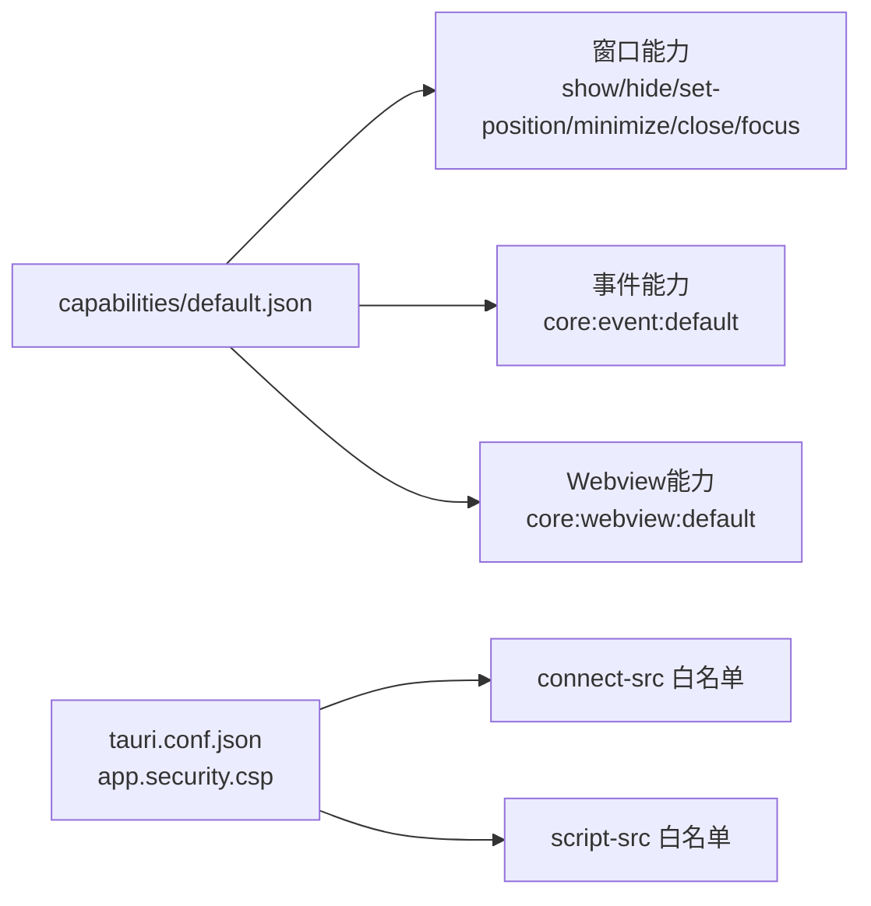
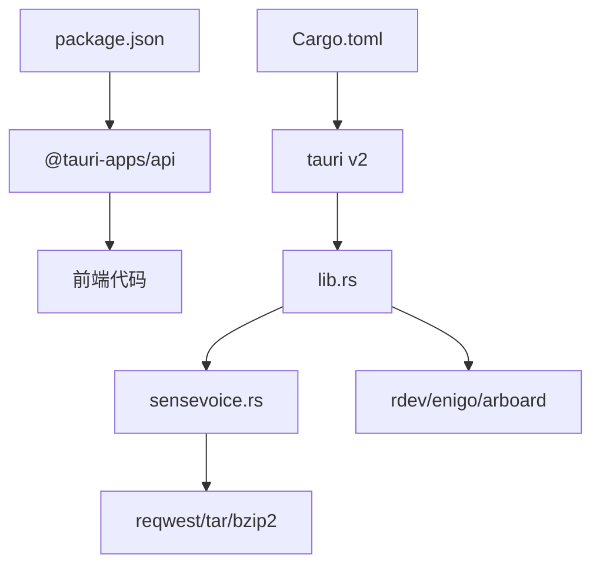

# 前后端通信机制

<cite>
**本文引用的文件**   
- [src-tauri/src/main.rs](file://src-tauri/src/main.rs)
- [src-tauri/src/lib.rs](file://src-tauri/src/lib.rs)
- [src-tauri/src/sensevoice.rs](file://src-tauri/src/sensevoice.rs)
- [src-tauri/tauri.conf.json](file://src-tauri/tauri.conf.json)
- [src-tauri/capabilities/default.json](file://src-tauri/capabilities/default.json)
- [src/App.tsx](file://src/App.tsx)
- [public/pill.html](file://public/pill.html)
- [src/hooks/useSettings.ts](file://src/hooks/useSettings.ts)
- [package.json](file://package.json)
</cite>

## 目录
1. [简介](#简介)
2. [项目结构](#项目结构)
3. [核心组件](#核心组件)
4. [架构总览](#架构总览)
5. [详细组件分析](#详细组件分析)
6. [依赖关系分析](#依赖关系分析)
7. [性能考量](#性能考量)
8. [故障排查指南](#故障排查指南)
9. [结论](#结论)

## 简介
本文件面向 VoiceFlow_AI_002 的前后端通信机制，聚焦基于 Tauri v2 的 IPC 架构：前端 TypeScript 与 Rust 后端之间的命令调用、事件监听与状态同步。文档涵盖以下要点：
- Tauri Commands 的定义与使用模式（Rust 侧）
- 前端通过 @tauri-apps/api 调用后端功能（TypeScript 侧）
- 异步通信处理、错误传播与数据序列化
- 跨进程数据传输与多窗口广播
- 安全模型与权限验证

## 项目结构
本项目采用典型的前后端分离结构：
- 前端：React + TypeScript，构建产物位于 dist，由 Vite 提供开发服务
- 后端：Tauri v2 + Rust，入口在 src-tauri/src/main.rs，业务逻辑集中在 lib.rs 与 sensevoice.rs
- 配置：应用配置与安全策略在 tauri.conf.json；能力与权限在 capabilities/default.json

图表来源
- [src-tauri/src/main.rs:1-9](file://src-tauri/src/main.rs#L1-L9)
- [src-tauri/src/lib.rs:214-286](file://src-tauri/src/lib.rs#L214-L286)
- [src/App.tsx:1-30](file://src/App.tsx#L1-L30)
- [public/pill.html:152-173](file://public/pill.html#L152-L173)
- [src-tauri/tauri.conf.json:12-46](file://src-tauri/tauri.conf.json#L12-L46)
- [src-tauri/capabilities/default.json:1-19](file://src-tauri/capabilities/default.json#L1-L19)

章节来源
- [src-tauri/src/main.rs:1-9](file://src-tauri/src/main.rs#L1-L9)
- [src-tauri/src/lib.rs:214-286](file://src-tauri/src/lib.rs#L214-L286)
- [src-tauri/tauri.conf.json:12-46](file://src-tauri/tauri.conf.json#L12-L46)
- [src-tauri/capabilities/default.json:1-19](file://src-tauri/capabilities/default.json#L1-L19)

## 核心组件
- 后端命令（Tauri Commands）
  - 设置全局监听键：set_listen_key
  - 设置黑名单：set_blacklist
  - 模拟粘贴输入：simulate_typing
  - 替换已上屏文本：replace_with_ai_text
  - SenseVoice 模型检查/下载/转写：check_sensevoice_ready、download_sensevoice、transcribe_sensevoice
- 事件通道
  - shortcut-state：后端按键监听线程向所有 Webview 广播快捷键按下/释放
  - download-progress：SenseVoice 下载进度推送
  - indicator-state / indicator-volume：主窗口向“小药丸”窗口广播状态与音量
  - pill-action：小药丸窗口向主窗口发送取消/提交动作
- 前端调用点
  - invoke：调用后端命令
  - listen：订阅事件
  - WebviewWindow.emit/listen：跨窗口事件

章节来源
- [src-tauri/src/lib.rs:31-118](file://src-tauri/src/lib.rs#L31-L118)
- [src-tauri/src/sensevoice.rs:295-476](file://src-tauri/src/sensevoice.rs#L295-L476)
- [src/App.tsx:256-286](file://src/App.tsx#L256-L286)
- [src/App.tsx:120-171](file://src/App.tsx#L120-L171)
- [public/pill.html:181-277](file://public/pill.html#L181-L277)
- [src/hooks/useSettings.ts:85-88](file://src/hooks/useSettings.ts#L85-L88)

## 架构总览
下图展示了端到端的通信路径：前端通过 invoke 调用后端命令，后端通过 AppHandle.emit 广播事件，前端通过 listen 接收；同时两个 Webview 之间通过 WebviewWindow 进行点对点事件通信。

图表来源
- [src-tauri/src/lib.rs:275-283](file://src-tauri/src/lib.rs#L275-L283)
- [src-tauri/src/sensevoice.rs:139-146](file://src-tauri/src/sensevoice.rs#L139-L146)
- [src/App.tsx:196-206](file://src/App.tsx#L196-L206)
- [src/App.tsx:256-286](file://src/App.tsx#L256-L286)
- [src/App.tsx:120-171](file://src/App.tsx#L120-L171)
- [public/pill.html:181-277](file://public/pill.html#L181-L277)

## 详细组件分析

### 后端命令定义与注册
- 命令声明
  - 使用 #[tauri::command] 宏将函数暴露为前端可调用命令
  - 支持同步与异步命令（async fn），返回 Result<T, String> 以统一错误传播
- 命令注册
  - 在 Builder 中通过 generate_handler! 集中注册命令列表
- 关键命令
  - set_listen_key：更新全局监听键
  - set_blacklist：更新黑名单
  - simulate_typing：将文本写入剪贴板并模拟粘贴
  - replace_with_ai_text：删除原文本后粘贴新文本
  - check_sensevoice_ready / download_sensevoice / transcribe_sensevoice：SenseVoice 引擎与模型管理

图表来源
- [src-tauri/src/lib.rs:31-118](file://src-tauri/src/lib.rs#L31-L118)
- [src-tauri/src/lib.rs:275-283](file://src-tauri/src/lib.rs#L275-L283)
- [src-tauri/src/sensevoice.rs:295-476](file://src-tauri/src/sensevoice.rs#L295-L476)

章节来源
- [src-tauri/src/lib.rs:31-118](file://src-tauri/src/lib.rs#L31-L118)
- [src-tauri/src/lib.rs:275-283](file://src-tauri/src/lib.rs#L275-L283)
- [src-tauri/src/sensevoice.rs:295-476](file://src-tauri/src/sensevoice.rs#L295-L476)

### 前端命令调用与事件监听
- 命令调用
  - 使用 @tauri-apps/api/core 的 invoke 调用后端命令，参数与返回值遵循 JSON 序列化
  - 示例路径：设置监听键、设置黑名单、模拟粘贴、替换文本、SenseVoice 相关命令
- 事件监听
  - 使用 @tauri-apps/api/event 的 listen 订阅事件
  - 示例路径：监听快捷键状态、下载进度
- 跨窗口通信
  - 使用 @tauri-apps/api/webviewWindow 获取目标窗口并调用 emit/listen
  - 示例路径：主窗口向小药丸窗口广播状态与音量；小药丸窗口回发操作

图表来源
- [src/App.tsx:1-30](file://src/App.tsx#L1-L30)
- [src/App.tsx:256-286](file://src/App.tsx#L256-L286)
- [src/App.tsx:120-171](file://src/App.tsx#L120-L171)
- [src/hooks/useSettings.ts:85-88](file://src/hooks/useSettings.ts#L85-L88)
- [public/pill.html:181-277](file://public/pill.html#L181-L277)

章节来源
- [src/App.tsx:196-206](file://src/App.tsx#L196-L206)
- [src/App.tsx:256-286](file://src/App.tsx#L256-L286)
- [src/App.tsx:120-171](file://src/App.tsx#L120-L171)
- [src/hooks/useSettings.ts:85-88](file://src/hooks/useSettings.ts#L85-L88)
- [public/pill.html:181-277](file://public/pill.html#L181-L277)

### 异步通信与错误传播
- 后端异步命令
  - SenseVoice 下载与解压流程使用 async 函数，并通过 AppHandle.emit 持续推送进度
  - 错误通过 Result 类型向上抛出，前端 receive Promise rejection
- 前端错误处理
  - 对 invoke 调用使用 try/catch 捕获异常，展示用户友好提示
  - 对事件监听进行清理，避免内存泄漏
- 数据序列化
  - 所有跨进程数据均通过 JSON 序列化传输，复杂对象需实现 Serialize/Deserialize

图表来源
- [src-tauri/src/sensevoice.rs:309-443](file://src-tauri/src/sensevoice.rs#L309-L443)
- [src/App.tsx:196-206](file://src/App.tsx#L196-L206)

章节来源
- [src-tauri/src/sensevoice.rs:309-443](file://src-tauri/src/sensevoice.rs#L309-L443)
- [src/App.tsx:196-206](file://src/App.tsx#L196-L206)

### 跨窗口状态同步
- 主窗口负责状态机与业务流程，小药丸窗口仅做轻量展示与交互
- 主窗口通过 WebviewWindow.emit 广播状态与实时音量；小药丸窗口通过 emit 回传用户动作
- 该模式避免了在主窗口隐藏时丢失反馈，提升用户体验

图表来源
- [src/App.tsx:120-171](file://src/App.tsx#L120-L171)
- [public/pill.html:181-277](file://public/pill.html#L181-L277)

章节来源
- [src/App.tsx:120-171](file://src/App.tsx#L120-L171)
- [public/pill.html:181-277](file://public/pill.html#L181-L277)

### 安全模型与权限验证
- 能力与权限
  - capabilities/default.json 明确允许 main 与 indicator 窗口使用的核心能力（窗口控制、事件、webview）
- CSP 策略
  - tauri.conf.json 中 app.security.csp 限制资源加载与连接源，确保脚本、样式、媒体等来源可控
- 最小权限原则
  - 仅启用必要的能力项，避免过度授权

图表来源
- [src-tauri/capabilities/default.json:1-19](file://src-tauri/capabilities/default.json#L1-L19)
- [src-tauri/tauri.conf.json:44-46](file://src-tauri/tauri.conf.json#L44-L46)

章节来源
- [src-tauri/capabilities/default.json:1-19](file://src-tauri/capabilities/default.json#L1-L19)
- [src-tauri/tauri.conf.json:44-46](file://src-tauri/tauri.conf.json#L44-L46)

## 依赖关系分析
- 前端依赖
  - @tauri-apps/api：IPC、事件、窗口、插件封装
  - React 生态：组件化 UI 与状态管理
- 后端依赖
  - tauri v2：运行时、命令系统、事件总线、托盘、自动启动
  - rdev/enigo/arboard：系统级键盘监听与剪贴板/粘贴模拟
  - reqwest/tar/bzip2：网络下载与归档解压
  - serde：JSON 序列化/反序列化

图表来源
- [package.json:13-22](file://package.json#L13-L22)
- [src-tauri/Cargo.toml:20-36](file://src-tauri/Cargo.toml#L20-L36)
- [src-tauri/src/lib.rs:1-16](file://src-tauri/src/lib.rs#L1-L16)
- [src-tauri/src/sensevoice.rs:1-8](file://src-tauri/src/sensevoice.rs#L1-L8)

章节来源
- [package.json:13-22](file://package.json#L13-L22)
- [src-tauri/Cargo.toml:20-36](file://src-tauri/Cargo.toml#L20-L36)

## 性能考量
- 事件频率控制
  - 音量广播每 50ms 一次，避免高频事件导致 UI 卡顿
- 异步与阻塞分离
  - 大体积解压使用 spawn_blocking 避免阻塞异步运行时
- 资源生命周期
  - 本地推理引擎空闲超时后释放，降低常驻内存占用
- 网络重试与镜像
  - 下载失败自动切换镜像源，提高稳定性

[本节为通用指导，不直接分析具体文件]

## 故障排查指南
- 常见问题定位
  - 命令未生效：确认命令已在 generate_handler! 中注册
  - 事件未收到：检查 listen 是否被正确注册且未提前销毁
  - 跨窗口无响应：确认目标窗口 label 一致且已创建
  - 下载失败：查看 download-progress 事件中的 step 与 progress，检查网络与镜像可用性
- 日志与调试
  - 前端 console 输出已被劫持到界面日志面板，便于观察错误堆栈
  - 后端使用 env_logger 输出运行日志

章节来源
- [src-tauri/src/lib.rs:275-283](file://src-tauri/src/lib.rs#L275-L283)
- [src/App.tsx:34-69](file://src/App.tsx#L34-L69)
- [src-tauri/src/sensevoice.rs:139-146](file://src-tauri/src/sensevoice.rs#L139-L146)

## 结论
本项目基于 Tauri v2 实现了稳定高效的前后端通信机制：
- 命令层：通过 #[tauri::command] 暴露稳定的 API，统一错误语义
- 事件层：利用 AppHandle.emit 与前端 listen 实现解耦的状态同步
- 跨窗口：通过 WebviewWindow 实现主窗口与小药丸窗口的双向通信
- 安全层：通过 capabilities 与 CSP 实施最小权限与资源白名单
- 工程化：结合异步、阻塞任务分离与资源生命周期管理，兼顾性能与稳定性