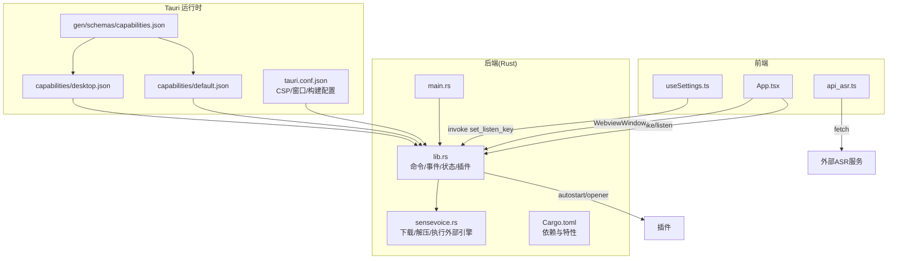
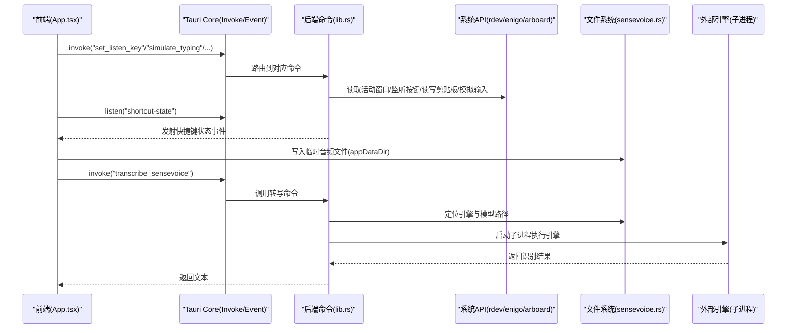
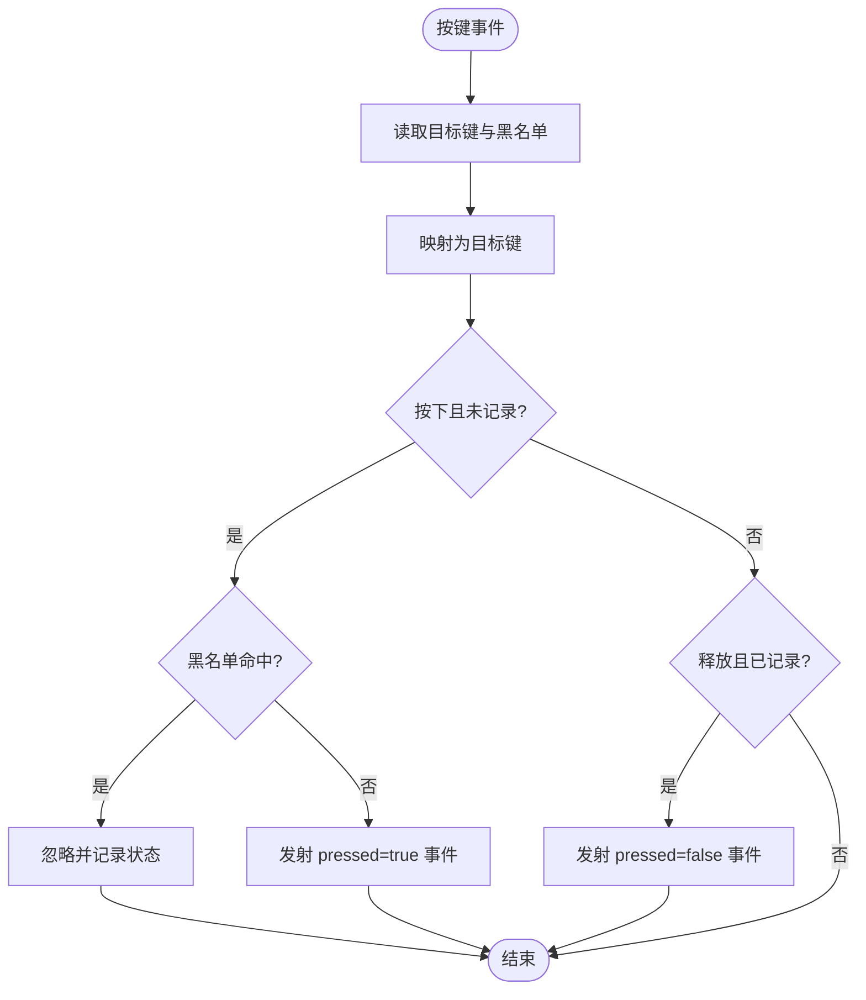
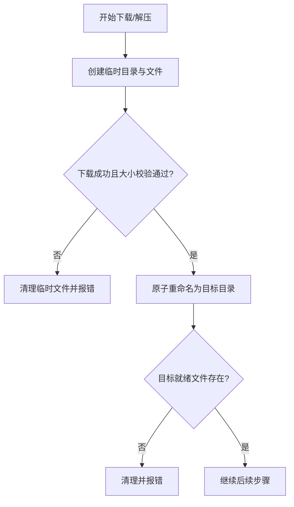
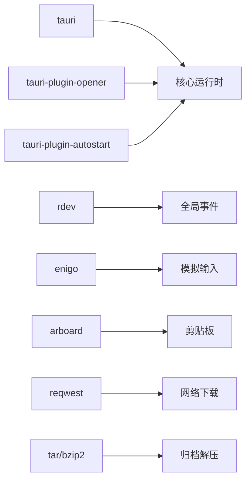

# 安全模型和权限控制

<cite>
**本文引用的文件**   
- [tauri.conf.json](file://src-tauri/tauri.conf.json)
- [default.json](file://src-tauri/capabilities/default.json)
- [desktop.json](file://src-tauri/capabilities/desktop.json)
- [capabilities.json](file://src-tauri/gen/schemas/capabilities.json)
- [main.rs](file://src-tauri/src/main.rs)
- [lib.rs](file://src-tauri/src/lib.rs)
- [sensevoice.rs](file://src-tauri/src/sensevoice.rs)
- [Cargo.toml](file://src-tauri/Cargo.toml)
- [App.tsx](file://src/App.tsx)
- [api_asr.ts](file://src/utils/api_asr.ts)
- [useSettings.ts](file://src/hooks/useSettings.ts)
</cite>

## 目录
1. [引言](#引言)
2. [项目结构](#项目结构)
3. [核心组件](#核心组件)
4. [架构总览](#架构总览)
5. [详细组件分析](#详细组件分析)
6. [依赖分析](#依赖分析)
7. [性能考虑](#性能考虑)
8. [故障排查指南](#故障排查指南)
9. [结论](#结论)
10. [附录](#附录)

## 引言
本文件面向 VoiceFlow_AI_002 的安全模型与权限控制，聚焦 Tauri v2 的能力系统（Capabilities）、CSP、跨平台权限差异、全局快捷键、剪贴板操作、文件系统访问等敏感能力的配置与实践。文档同时给出白名单机制与安全边界定义、权限最小化原则的应用案例，以及为不同用户角色分配适当权限的建议与常见漏洞防护措施。

## 项目结构
本项目采用 Tauri v2 + React 的前后端分离架构：
- 前端（React）通过 @tauri-apps API 调用 Rust 侧命令与事件通道，实现录音、转写、AI 润色、窗口管理等功能。
- 后端（Rust）暴露 tauri::command，处理系统级能力（全局快捷键监听、剪贴板读写、模拟输入、进程外执行本地引擎），并通过能力系统与 CSP 进行安全约束。

图示来源
- [tauri.conf.json:44-46](file://src-tauri/tauri.conf.json#L44-L46)
- [default.json:1-18](file://src-tauri/capabilities/default.json#L1-L18)
- [desktop.json:1-14](file://src-tauri/capabilities/desktop.json#L1-L14)
- [capabilities.json:1-1](file://src-tauri/gen/schemas/capabilities.json#L1-L1)
- [main.rs:1-9](file://src-tauri/src/main.rs#L1-L9)
- [lib.rs:215-286](file://src-tauri/src/lib.rs#L215-L286)
- [sensevoice.rs:295-476](file://src-tauri/src/sensevoice.rs#L295-L476)
- [Cargo.toml:20-39](file://src-tauri/Cargo.toml#L20-L39)

章节来源
- [tauri.conf.json:1-68](file://src-tauri/tauri.conf.json#L1-L68)
- [default.json:1-18](file://src-tauri/capabilities/default.json#L1-L18)
- [desktop.json:1-14](file://src-tauri/capabilities/desktop.json#L1-L14)
- [capabilities.json:1-1](file://src-tauri/gen/schemas/capabilities.json#L1-L1)
- [main.rs:1-9](file://src-tauri/src/main.rs#L1-L9)
- [lib.rs:1-287](file://src-tauri/src/lib.rs#L1-L287)
- [sensevoice.rs:1-476](file://src-tauri/src/sensevoice.rs#L1-L476)
- [Cargo.toml:1-47](file://src-tauri/Cargo.toml#L1-L47)
- [App.tsx:1-774](file://src/App.tsx#L1-L774)
- [api_asr.ts:1-73](file://src/utils/api_asr.ts#L1-L73)
- [useSettings.ts:1-97](file://src/hooks/useSettings.ts#L1-L97)

## 核心组件
- 能力系统（Capabilities）
  - default.json：为 main 与 indicator 窗口授予基础窗口、事件、webview 与 opener 能力。
  - desktop.json：在 macOS、Windows、Linux 上为主窗口启用 autostart 能力。
  - capabilities.json：编译期生成的能力清单，用于校验与分发。
- 内容安全策略（CSP）
  - tauri.conf.json 中定义了 CSP，允许自资源、部分远程连接、内联脚本与 wasm 评估等。
- 后端命令与系统交互
  - lib.rs：注册命令（设置监听键、黑名单、模拟粘贴、替换文本、SenseVoice 检查/下载/转写），启动托盘菜单、后台全局快捷键监听线程，并处理窗口关闭行为。
  - sensevoice.rs：从多个镜像下载并原子解压引擎与模型，校验大小，最终通过子进程调用本地可执行文件完成转写。
- 前端集成
  - App.tsx：初始化模型、监听快捷键事件、控制指示器窗口、调用后端命令、写入临时音频文件、触发 AI 润色与历史保存。
  - api_asr.ts：将音频编码为 WAV 并通过 fetch 调用外部 ASR API。
  - useSettings.ts：持久化设置，并将监听键同步到后端。

章节来源
- [default.json:1-18](file://src-tauri/capabilities/default.json#L1-L18)
- [desktop.json:1-14](file://src-tauri/capabilities/desktop.json#L1-L14)
- [capabilities.json:1-1](file://src-tauri/gen/schemas/capabilities.json#L1-L1)
- [tauri.conf.json:44-46](file://src-tauri/tauri.conf.json#L44-L46)
- [lib.rs:31-118](file://src-tauri/src/lib.rs#L31-L118)
- [lib.rs:140-212](file://src-tauri/src/lib.rs#L140-L212)
- [lib.rs:215-286](file://src-tauri/src/lib.rs#L215-L286)
- [sensevoice.rs:295-476](file://src-tauri/src/sensevoice.rs#L295-L476)
- [App.tsx:186-221](file://src/App.tsx#L186-L221)
- [App.tsx:256-286](file://src/App.tsx#L256-L286)
- [App.tsx:516-544](file://src/App.tsx#L516-L544)
- [api_asr.ts:41-73](file://src/utils/api_asr.ts#L41-L73)
- [useSettings.ts:85-88](file://src/hooks/useSettings.ts#L85-L88)

## 架构总览
下图展示了关键安全边界的划分与数据流：前端仅通过受控的 invoke 与事件通道与后端通信；后端通过能力系统与 CSP 限制 Webview 能力；系统级操作（全局快捷键、剪贴板、模拟输入、子进程执行）集中在 Rust 层，并由能力与白名单机制进行约束。

图示来源
- [App.tsx:256-286](file://src/App.tsx#L256-L286)
- [App.tsx:516-544](file://src/App.tsx#L516-L544)
- [lib.rs:275-283](file://src-tauri/src/lib.rs#L275-L283)
- [lib.rs:140-212](file://src-tauri/src/lib.rs#L140-L212)
- [sensevoice.rs:445-476](file://src-tauri/src/sensevoice.rs#L445-L476)

## 详细组件分析

### 能力系统与 CSP 配置
- 能力范围
  - default.json 对 main 与 indicator 窗口开放窗口控制、事件与 webview 默认能力，未显式授予文件系统或剪贴板能力，遵循最小授权。
  - desktop.json 仅在桌面平台为主窗口开启 autostart 能力。
- CSP 策略
  - tauri.conf.json 中的 CSP 允许自资源、部分远程连接、内联脚本与 wasm 评估，需关注 'unsafe-inline' 与 'wasm-unsafe-eval' 的使用风险。
- 生成清单
  - capabilities.json 由构建流程生成，确保能力声明与实际可用权限一致。

建议
- 若无需内联脚本与 wasm 评估，应收紧 script-src 与 worker-src，移除 'unsafe-inline' 与 'wasm-unsafe-eval'。
- 将 connect-src 精确限定到必要域名与端口，避免通配符过宽。

章节来源
- [default.json:1-18](file://src-tauri/capabilities/default.json#L1-L18)
- [desktop.json:1-14](file://src-tauri/capabilities/desktop.json#L1-L14)
- [capabilities.json:1-1](file://src-tauri/gen/schemas/capabilities.json#L1-L1)
- [tauri.conf.json:44-46](file://src-tauri/tauri.conf.json#L44-L46)

### 全局快捷键与黑名单机制
- 实现要点
  - 后端使用 rdev 在独立线程中监听全局按键事件，根据 AppState 中的目标键与黑名单判断是否拦截。
  - 当命中目标键时，向所有窗口广播 shortcut-state 事件，包含 pressed 状态与当前活动应用信息。
  - 前端监听该事件，结合录音状态决定是否开始/停止录音。
- 安全边界
  - 黑名单以应用名模糊匹配方式过滤，避免在特定应用（如游戏）中误触发。
  - 快捷键监听运行于后台线程，不阻塞主循环。

图示来源
- [lib.rs:140-212](file://src-tauri/src/lib.rs#L140-L212)
- [App.tsx:256-286](file://src/App.tsx#L256-L286)

章节来源
- [lib.rs:18-43](file://src-tauri/src/lib.rs#L18-L43)
- [lib.rs:140-212](file://src-tauri/src/lib.rs#L140-L212)
- [App.tsx:256-286](file://src/App.tsx#L256-L286)
- [useSettings.ts:85-88](file://src/hooks/useSettings.ts#L85-L88)

### 剪贴板与模拟输入
- 功能说明
  - simulate_typing：将文本写入剪贴板，然后模拟 Ctrl/Cmd+V 粘贴，最后恢复原剪贴板内容。
  - replace_with_ai_text：先逐字删除原文，再将优化后的文本粘贴入焦点位置。
- 平台差异
  - macOS 使用 Meta+V，其他平台使用 Control+V。
- 安全风险与建议
  - 剪贴板读写影响系统全局，应避免长时间持有敏感数据；当前实现会短暂覆盖并立即恢复，但仍需注意竞态与异常路径下的恢复逻辑。
  - 建议在错误分支增加更健壮的恢复与日志记录。

章节来源
- [lib.rs:45-75](file://src-tauri/src/lib.rs#L45-L75)
- [lib.rs:77-118](file://src-tauri/src/lib.rs#L77-L118)

### 文件系统访问与外部引擎执行
- 下载与解压
  - 从多个镜像源下载引擎与模型压缩包，使用临时文件与原子重命名保证一致性，校验文件大小，失败则清理中间产物。
- 模型选择
  - 优先检测本地候选模型，不存在则回退到 tarball 包，确保可用性。
- 转写执行
  - 通过 std::process::Command 启动外部可执行文件，传入模型与 tokens 路径及音频路径，解析输出文本。
- 安全边界
  - 所有下载与解压均在应用数据目录下进行，避免任意路径写入。
  - 子进程参数来自内部计算的路径，不直接接受不可信用户输入作为命令行参数。

图示来源
- [sensevoice.rs:83-181](file://src-tauri/src/sensevoice.rs#L83-L181)
- [sensevoice.rs:183-214](file://src-tauri/src/sensevoice.rs#L183-L214)
- [sensevoice.rs:234-293](file://src-tauri/src/sensevoice.rs#L234-L293)
- [sensevoice.rs:309-443](file://src-tauri/src/sensevoice.rs#L309-L443)
- [sensevoice.rs:445-476](file://src-tauri/src/sensevoice.rs#L445-L476)

章节来源
- [sensevoice.rs:83-181](file://src-tauri/src/sensevoice.rs#L83-L181)
- [sensevoice.rs:183-214](file://src-tauri/src/sensevoice.rs#L183-L214)
- [sensevoice.rs:234-293](file://src-tauri/src/sensevoice.rs#L234-L293)
- [sensevoice.rs:309-443](file://src-tauri/src/sensevoice.rs#L309-L443)
- [sensevoice.rs:445-476](file://src-tauri/src/sensevoice.rs#L445-L476)

### 前端安全与网络请求
- 外部 ASR API
  - 使用 fetch 发送 POST 请求，携带 Authorization 头与音频数据，URL 拼接规则确保指向标准转录端点。
- 安全建议
  - 严格校验 baseUrl 与 apiKey 的来源与长度，避免注入。
  - 对响应体进行最小化处理，仅提取必要字段。

章节来源
- [api_asr.ts:41-73](file://src/utils/api_asr.ts#L41-L73)

### 权限最小化与角色分配实践
- 默认能力
  - 仅对 main 与 indicator 窗口授予必要的窗口与事件能力，未授予文件系统与剪贴板能力，符合最小授权原则。
- 平台差异化
  - autostart 能力仅在桌面平台启用，且仅作用于主窗口。
- 角色建议
  - 普通用户：保持默认能力，按需开启 autostart。
  - 高级用户：如需扩展能力，应在新增 capability 文件中明确 windows/webviews 与 permissions，避免在主配置中放宽。

章节来源
- [default.json:1-18](file://src-tauri/capabilities/default.json#L1-L18)
- [desktop.json:1-14](file://src-tauri/capabilities/desktop.json#L1-L14)

## 依赖分析
- 后端依赖
  - tauri、opener、autostart 插件提供窗口、打开链接与开机自启能力。
  - rdev 提供全局键盘事件监听，enigo 提供模拟输入，arboard 提供剪贴板访问。
  - reqwest、tar、bzip2、futures-util 用于网络下载与压缩归档处理。
- 前端依赖
  - @tauri-apps/core、event、window、webviewWindow、plugin-autostart、path、plugin-fs 等用于与后端交互与本地文件操作。

图示来源
- [Cargo.toml:20-39](file://src-tauri/Cargo.toml#L20-L39)

章节来源
- [Cargo.toml:20-39](file://src-tauri/Cargo.toml#L20-L39)

## 性能考虑
- 下载与解压
  - 使用分块流式下载与进度上报，减少内存占用；原子重命名提升可靠性。
- 转写执行
  - 子进程执行外部引擎，注意 I/O 与 CPU 开销；可在 UI 层显示进度与错误提示。
- 剪贴板与输入
  - 尽量减少剪贴板覆盖时间，避免长延迟；批量输入时加入微小延时提高稳定性。

[本节为通用指导，不涉及具体文件分析]

## 故障排查指南
- 快捷键无响应
  - 检查 AppState 中的目标键与黑名单配置是否正确同步至后端。
  - 确认前端是否正确监听 shortcut-state 事件。
- 剪贴板恢复失败
  - 检查异常分支是否执行了恢复逻辑；必要时增加重试与日志。
- 模型下载失败
  - 检查镜像源可达性与网络代理；查看 download-progress 事件与错误消息。
- 转写输出为空
  - 检查外部引擎可执行文件是否存在、模型与 tokens 是否齐全；核对命令行参数。

章节来源
- [lib.rs:140-212](file://src-tauri/src/lib.rs#L140-L212)
- [lib.rs:45-75](file://src-tauri/src/lib.rs#L45-L75)
- [sensevoice.rs:83-181](file://src-tauri/src/sensevoice.rs#L83-L181)
- [sensevoice.rs:445-476](file://src-tauri/src/sensevoice.rs#L445-L476)

## 结论
本项目基于 Tauri v2 的能力系统与 CSP 构建了清晰的安全边界：前端通过受限的 invoke/event 通道与后端交互，后端集中处理系统级能力，并通过能力文件与 CSP 进行最小授权与策略约束。全局快捷键、剪贴板与模拟输入等敏感功能均在后端实现，配合黑名单与原子化文件操作降低风险。建议进一步收紧 CSP、细化能力范围、增强错误恢复与日志审计，以提升整体安全性与可维护性。

[本节为总结性内容，不涉及具体文件分析]

## 附录
- 安全最佳实践清单
  - 最小授权：仅授予必要能力，按窗口粒度拆分。
  - 白名单机制：黑名单用于快捷键拦截，白名单用于网络与能力范围。
  - CSP 收紧：移除不必要的 'unsafe-inline' 与 'wasm-unsafe-eval'，限定 connect-src。
  - 输入校验：对用户输入与外部数据进行严格校验与白名单过滤。
  - 原子操作：下载与解压使用临时目录与原子重命名，失败即清理。
  - 错误恢复：剪贴板与输入操作确保异常路径下恢复原状。
  - 日志与审计：关键操作记录日志，便于问题追踪与合规审计。
  - 角色权限：为不同用户角色定义差异化能力集，避免统一放开。

[本节为通用指导，不涉及具体文件分析]