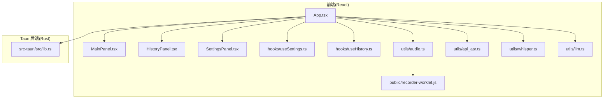
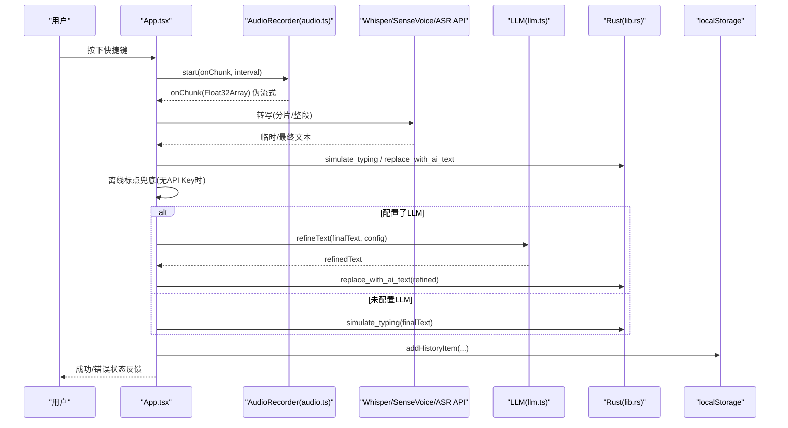
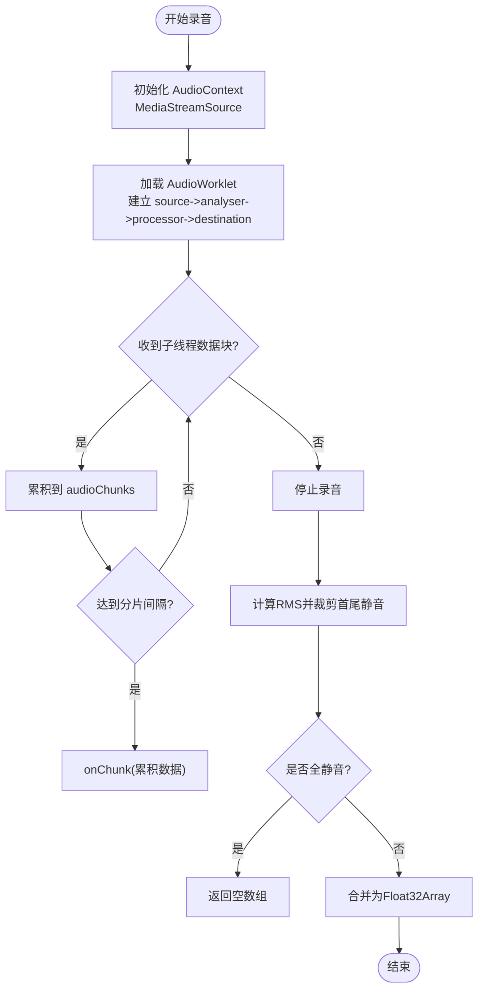
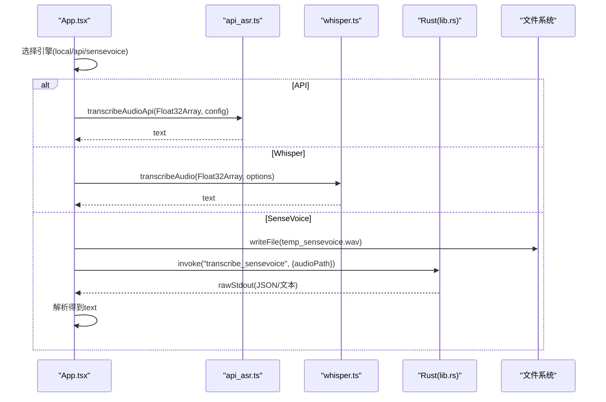
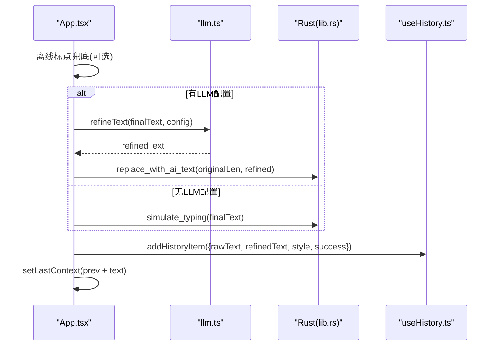
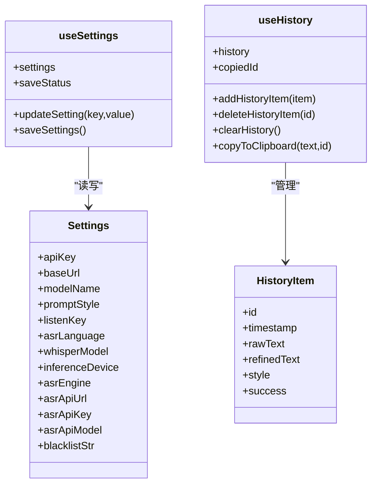
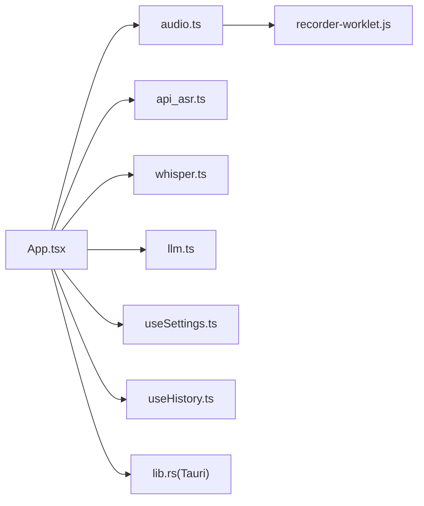

# 数据流设计

<cite>
**本文引用的文件**   
- [App.tsx](file://src/App.tsx)
- [useSettings.ts](file://src/hooks/useSettings.ts)
- [useHistory.ts](file://src/hooks/useHistory.ts)
- [audio.ts](file://src/utils/audio.ts)
- [api_asr.ts](file://src/utils/api_asr.ts)
- [whisper.ts](file://src/utils/whisper.ts)
- [llm.ts](file://src/utils/llm.ts)
- [MainPanel.tsx](file://src/components/MainPanel.tsx)
- [HistoryPanel.tsx](file://src/components/HistoryPanel.tsx)
- [SettingsPanel.tsx](file://src/components/SettingsPanel.tsx)
- [lib.rs](file://src-tauri/src/lib.rs)
- [recorder-worklet.js](file://public/recorder-worklet.js)
</cite>

## 目录
1. [引言](#引言)
2. [项目结构](#项目结构)
3. [核心组件](#核心组件)
4. [架构总览](#架构总览)
5. [详细组件分析](#详细组件分析)
6. [依赖关系分析](#依赖关系分析)
7. [性能与内存管理](#性能与内存管理)
8. [故障排查指南](#故障排查指南)
9. [结论](#结论)

## 引言
本文件面向 VoiceFlow_AI_002 的数据流设计，聚焦以下目标：
- 音频从采集到识别的完整流程（本地 Whisper/SenseVoice 或云端 API）
- 文本在 AI 润色过程中的流转机制
- 状态管理模式（useSettings、useHistory）的状态持久化与同步策略
- 异步数据处理与错误恢复机制
- 缓存策略与数据版本管理
- 关键业务场景的数据流图与时序图
- 内存管理与性能优化考虑

## 项目结构
前端采用 React + Tauri 架构。主窗口负责 UI 与业务流程编排；独立“小药丸”窗口用于轻量状态指示；Rust 后端提供全局快捷键监听、剪贴板粘贴与系统交互能力；浏览器侧通过 Web Audio 采集音频并可选进行分片流式处理。



图表来源
- [App.tsx:1-774](file://src/App.tsx#L1-L774)
- [MainPanel.tsx:1-127](file://src/components/MainPanel.tsx#L1-L127)
- [HistoryPanel.tsx:1-103](file://src/components/HistoryPanel.tsx#L1-L103)
- [SettingsPanel.tsx:1-344](file://src/components/SettingsPanel.tsx#L1-L344)
- [useSettings.ts:1-97](file://src/hooks/useSettings.ts#L1-L97)
- [useHistory.ts:1-70](file://src/hooks/useHistory.ts#L1-L70)
- [audio.ts:1-221](file://src/utils/audio.ts#L1-L221)
- [api_asr.ts:1-73](file://src/utils/api_asr.ts#L1-L73)
- [whisper.ts:1-174](file://src/utils/whisper.ts#L1-L174)
- [llm.ts:1-65](file://src/utils/llm.ts#L1-L65)
- [lib.rs:1-287](file://src-tauri/src/lib.rs#L1-L287)
- [recorder-worklet.js:1-39](file://public/recorder-worklet.js#L1-L39)

章节来源
- [App.tsx:1-774](file://src/App.tsx#L1-L774)
- [lib.rs:1-287](file://src-tauri/src/lib.rs#L1-L287)

## 核心组件
- 应用控制器（App.tsx）
  - 统一状态机：initializing/idle/recording/transcribing/rewriting/success/error
  - 协调录音、ASR、AI 润色、上屏、历史与设置
  - 与 Rust 后端通信：模拟输入、替换文本、黑名单、SenseVoice 下载/推理
- 音频采集（audio.ts + recorder-worklet.js）
  - 使用 MediaDevices 获取麦克风，AudioContext 重采样至 16kHz
  - AudioWorklet 子线程收集 PCM 帧，主线程合并与 VAD 静音切除
  - 支持伪流式分片回调（按时间间隔聚合）
- ASR 引擎
  - 本地：Whisper（WebGPU/WASM 自动降级）、SenseVoice（Rust 后端）
  - 云端：OpenAI 兼容转录接口（可流式）
- LLM 润色（llm.ts）
  - 根据风格与上下文注入 system prompt，调用 chat/completions 接口
- 状态与历史
  - useSettings：配置持久化到 localStorage，监听键同步至 Rust
  - useHistory：历史记录持久化，最多保留 100 条
- UI 面板
  - MainPanel：展示状态、进度、原文与优化结果
  - HistoryPanel：历史列表、复制、清空
  - SettingsPanel：LLM/ASR/快捷键/黑名单等配置

章节来源
- [App.tsx:71-120](file://src/App.tsx#L71-L120)
- [audio.ts:12-73](file://src/utils/audio.ts#L12-L73)
- [api_asr.ts:41-73](file://src/utils/api_asr.ts#L41-L73)
- [whisper.ts:35-112](file://src/utils/whisper.ts#L35-L112)
- [llm.ts:16-65](file://src/utils/llm.ts#L16-L65)
- [useSettings.ts:36-96](file://src/hooks/useSettings.ts#L36-L96)
- [useHistory.ts:12-69](file://src/hooks/useHistory.ts#L12-L69)
- [MainPanel.tsx:19-127](file://src/components/MainPanel.tsx#L19-L127)
- [HistoryPanel.tsx:14-103](file://src/components/HistoryPanel.tsx#L14-L103)
- [SettingsPanel.tsx:17-344](file://src/components/SettingsPanel.tsx#L17-L344)

## 架构总览
整体数据流分为两条主线：
- 音频线：麦克风 -> AudioWorklet -> 主线程合并/VAD -> ASR（本地/云端）-> 文本
- 文本线：ASR 文本 -> 离线标点兜底 -> LLM 润色（可选）-> 上屏/历史



图表来源
- [App.tsx:256-286](file://src/App.tsx#L256-L286)
- [App.tsx:374-435](file://src/App.tsx#L374-L435)
- [App.tsx:462-640](file://src/App.tsx#L462-L640)
- [audio.ts:12-73](file://src/utils/audio.ts#L12-L73)
- [api_asr.ts:41-73](file://src/utils/api_asr.ts#L41-L73)
- [whisper.ts:121-174](file://src/utils/whisper.ts#L121-L174)
- [llm.ts:16-65](file://src/utils/llm.ts#L16-L65)
- [lib.rs:46-118](file://src-tauri/src/lib.rs#L46-L118)

## 详细组件分析

### 音频采集与处理管道
- 设备与上下文
  - 使用 navigator.mediaDevices.getUserMedia 获取单声道音频，开启回声消除与降噪
  - 创建 16kHz 的 AudioContext，必要时唤醒 suspended 状态
- 工作线程与分片
  - 加载 recorder-worklet.js，以 4096 样本为块向主线程发送 Float32Array
  - 主线程按 chunkIntervalMs 聚合累积数据，触发 onChunk 回调（伪流式）
- 静音切除（VAD）
  - stop() 中计算每块 RMS，去除首尾长静音，保留前后各约 0.5s 余量
  - 若全静音则返回空数组，上层直接报错提示音量过低
- 格式转换
  - float32ToWav 将 Float32Array 转为 16-bit PCM WAV 字节数组，供 SenseVoice 使用



图表来源
- [audio.ts:12-73](file://src/utils/audio.ts#L12-L73)
- [audio.ts:109-173](file://src/utils/audio.ts#L109-L173)
- [recorder-worklet.js:1-39](file://public/recorder-worklet.js#L1-L39)

章节来源
- [audio.ts:12-73](file://src/utils/audio.ts#L12-L73)
- [audio.ts:109-173](file://src/utils/audio.ts#L109-L173)
- [recorder-worklet.js:1-39](file://public/recorder-worklet.js#L1-L39)

### ASR 识别路径
- 云端 API（OpenAI 兼容）
  - encodeWAV 生成 wav Blob，POST 到 /v1/audio/transcriptions
  - 支持分片实时上屏（onChunk），最终再替换为完整结果
- 本地 Whisper（Transformers.js）
  - initWhisper 优先尝试 WebGPU，失败回退 WASM；支持进度回调
  - transcribeAudio 执行推理，异常时自动释放并回退重试
- 本地 SenseVoice（Rust 后端）
  - 前端写入 temp_sensevoice.wav，invoke("transcribe_sensevoice") 调用 Rust 推理
  - 解析 stdout 中的 JSON 或末行文本作为结果



图表来源
- [App.tsx:509-552](file://src/App.tsx#L509-L552)
- [api_asr.ts:41-73](file://src/utils/api_asr.ts#L41-L73)
- [whisper.ts:121-174](file://src/utils/whisper.ts#L121-L174)
- [lib.rs:275-283](file://src-tauri/src/lib.rs#L275-L283)

章节来源
- [api_asr.ts:41-73](file://src/utils/api_asr.ts#L41-L73)
- [whisper.ts:35-112](file://src/utils/whisper.ts#L35-L112)
- [whisper.ts:121-174](file://src/utils/whisper.ts#L121-L174)
- [App.tsx:509-552](file://src/App.tsx#L509-L552)

### AI 润色与上屏
- 离线兜底标点
  - 未配置 LLM API Key 时，检测末尾是否缺标点，自动补全中文/英文句号
- LLM 润色
  - 根据 promptStyle 与当前应用上下文动态注入 systemPrompt
  - 调用 chat/completions 接口，返回 refinedText
- 上屏策略
  - 若曾上屏过占位/临时文本，使用 replace_with_ai_text 删除旧文并粘贴新文
  - 否则使用 simulate_typing 直接粘贴
- 历史与上下文
  - 记录原始与优化文本、样式、成功标志
  - 维护 lastContext（最近 ~100 字符）作为 Whisper prompt 上下文



图表来源
- [App.tsx:562-640](file://src/App.tsx#L562-L640)
- [llm.ts:16-65](file://src/utils/llm.ts#L16-L65)
- [useHistory.ts:31-37](file://src/hooks/useHistory.ts#L31-L37)
- [lib.rs:78-118](file://src-tauri/src/lib.rs#L78-L118)

章节来源
- [App.tsx:562-640](file://src/App.tsx#L562-L640)
- [llm.ts:16-65](file://src/utils/llm.ts#L16-L65)
- [useHistory.ts:31-37](file://src/hooks/useHistory.ts#L31-L37)
- [lib.rs:78-118](file://src-tauri/src/lib.rs#L78-L118)

### 状态管理与持久化
- useSettings
  - 首次加载：优先读取 vf_settings 统一 JSON，兼容旧版分散 key
  - 更新：updateSetting 局部更新；saveSettings 持久化到 localStorage
  - 同步：listenKey 变更时 invoke("set_listen_key") 同步至 Rust
  - 黑名单：blacklistStr 变更时 split 后 invoke("set_blacklist") 同步
- useHistory
  - 首次加载：读取 vf_history，JSON 解析失败则忽略
  - 增删改：add/delete/clear 均同步持久化，限制最大 100 条
  - 复制：navigator.clipboard.writeText 并短暂显示“已复制”



图表来源
- [useSettings.ts:4-34](file://src/hooks/useSettings.ts#L4-L34)
- [useSettings.ts:36-96](file://src/hooks/useSettings.ts#L36-L96)
- [useHistory.ts:3-10](file://src/hooks/useHistory.ts#L3-L10)
- [useHistory.ts:12-69](file://src/hooks/useHistory.ts#L12-L69)

章节来源
- [useSettings.ts:36-96](file://src/hooks/useSettings.ts#L36-L96)
- [useHistory.ts:12-69](file://src/hooks/useHistory.ts#L12-L69)

### 全局快捷键与系统交互
- Rust 端
  - 后台线程监听 rdev 事件，匹配 listenKey
  - 黑名单拦截：当活动应用名包含黑名单项时忽略按键
  - 事件发射：shortcut-state(pressed/app_name/window_title)
  - 输入控制：simulate_typing、replace_with_ai_text（跨平台 Ctrl/Cmd+V）
- 前端
  - 监听 shortcut-state，按下时 startRecording，松开时 stopAndProcess
  - 小药丸窗口：indicator-window 接收 indicator-state、indicator-volume 广播

```mermaid
sequenceDiagram
participant OS as "操作系统"
participant RS as "Rust(lib.rs)"
participant FE as "App.tsx"
participant IND as "Indicator窗口"
OS->>RS : 键盘事件(KeyPress/Release)
RS->>RS : 黑名单检查 & 映射目标键
RS-->>FE : emit("shortcut-state",{pressed,...})
FE->>FE : 按下->startRecording(); 松开->stopAndProcess()
FE->>IND : emit("indicator-state"/"indicator-volume")
```

图表来源
- [lib.rs:140-212](file://src-tauri/src/lib.rs#L140-L212)
- [lib.rs:46-118](file://src-tauri/src/lib.rs#L46-L118)
- [App.tsx:256-286](file://src/App.tsx#L256-L286)
- [App.tsx:121-171](file://src/App.tsx#L121-L171)

章节来源
- [lib.rs:140-212](file://src-tauri/src/lib.rs#L140-L212)
- [lib.rs:46-118](file://src-tauri/src/lib.rs#L46-L118)
- [App.tsx:256-286](file://src/App.tsx#L256-L286)
- [App.tsx:121-171](file://src/App.tsx#L121-L171)

## 依赖关系分析
- 模块耦合
  - App.tsx 为核心编排者，依赖 audio、api_asr、whisper、llm、useSettings、useHistory、Rust invoke
  - audio.ts 依赖 recorder-worklet.js 完成低延迟采集
  - whisper.ts 依赖 @huggingface/transformers，具备 WebGPU/WASM 双路径与自动降级
  - api_asr.ts 与 llm.ts 均为 HTTP 客户端封装
- 外部集成点
  - Tauri 命令：set_listen_key、set_blacklist、simulate_typing、replace_with_ai_text、SenseVoice 相关
  - 浏览器 API：MediaDevices、AudioContext、WebviewWindow、localStorage、clipboard
- 潜在循环依赖
  - 未见明显循环引用；App 作为顶层编排，其余工具函数单向依赖



图表来源
- [App.tsx:1-774](file://src/App.tsx#L1-L774)
- [audio.ts:1-221](file://src/utils/audio.ts#L1-L221)
- [api_asr.ts:1-73](file://src/utils/api_asr.ts#L1-L73)
- [whisper.ts:1-174](file://src/utils/whisper.ts#L1-L174)
- [llm.ts:1-65](file://src/utils/llm.ts#L1-L65)
- [useSettings.ts:1-97](file://src/hooks/useSettings.ts#L1-L97)
- [useHistory.ts:1-70](file://src/hooks/useHistory.ts#L1-L70)
- [lib.rs:1-287](file://src-tauri/src/lib.rs#L1-L287)
- [recorder-worklet.js:1-39](file://public/recorder-worklet.js#L1-L39)

章节来源
- [App.tsx:1-774](file://src/App.tsx#L1-L774)
- [lib.rs:1-287](file://src-tauri/src/lib.rs#L1-L287)

## 性能与内存管理
- 模型加载与内存回收
  - Whisper 管线在 10 分钟无使用后自动 dispose，避免常驻占用
  - WebGPU 执行阶段崩溃时主动释放并回退 WASM，提升稳定性
- 音频处理
  - 子线程采集，主线程仅做简单聚合与 VAD，降低主线程阻塞风险
  - 分片上传（API 模式）减少单次网络负载，提升首字速度
- 渲染与交互
  - 小药丸窗口仅承载轻量状态与波形体积，避免主窗口频繁重排
  - 上屏操作批量 Backspace 逐字删除，配合短延时确保目标应用稳定处理
- 建议
  - 合理选择模型大小与设备模式（auto/webgpu/wasm）
  - 对长语音建议使用分段策略或云端 API 以获得更低延迟
  - 关注 localStorage 容量，定期清理历史

[本节为通用指导，不直接分析具体文件]

## 故障排查指南
- 无法启动麦克风
  - 检查权限与浏览器策略；确认 AudioContext 未被挂起
  - 参考路径：[App.tsx:429-434](file://src/App.tsx#L429-L434)、[audio.ts:17-31](file://src/utils/audio.ts#L17-L31)
- 全静音/音量过低
  - VAD 判定为空或 maxVal 过小，会返回错误提示
  - 参考路径：[App.tsx:493-505](file://src/App.tsx#L493-L505)、[audio.ts:132-173](file://src/utils/audio.ts#L132-L173)
- 识别引擎初始化失败
  - 检查网络/镜像源/WebGPU 兼容性；可切换强制 WASM
  - 参考路径：[App.tsx:214-218](file://src/App.tsx#L214-L218)、[whisper.ts:86-108](file://src/utils/whisper.ts#L86-L108)
- LLM 请求失败
  - 校验 apiKey/baseUrl/modelName；查看响应状态码与返回体
  - 参考路径：[llm.ts:52-61](file://src/utils/llm.ts#L52-L61)
- 上屏异常
  - 目标应用可能拦截快捷键；检查黑名单与输入法兼容性
  - 参考路径：[lib.rs:78-118](file://src-tauri/src/lib.rs#L78-L118)

章节来源
- [App.tsx:429-434](file://src/App.tsx#L429-L434)
- [audio.ts:17-31](file://src/utils/audio.ts#L17-L31)
- [App.tsx:493-505](file://src/App.tsx#L493-L505)
- [audio.ts:132-173](file://src/utils/audio.ts#L132-L173)
- [App.tsx:214-218](file://src/App.tsx#L214-L218)
- [whisper.ts:86-108](file://src/utils/whisper.ts#L86-L108)
- [llm.ts:52-61](file://src/utils/llm.ts#L52-L61)
- [lib.rs:78-118](file://src-tauri/src/lib.rs#L78-L118)

## 结论
本设计围绕“低延迟采集 + 多引擎 ASR + 可选 LLM 润色 + 可靠上屏”构建端到端数据流。通过分层职责划分与健壮的错误恢复（WebGPU 回退、离线标点兜底、黑名单保护），在保证体验的同时兼顾隐私与可用性。状态与历史通过 hooks 实现持久化与双向同步，满足桌面级听写助手的核心需求。后续可在分片策略、上下文长度控制与模型热切换方面进一步优化。