# 架构设计

<cite>
**本文引用的文件**   
- [README.md](file://README.md)
- [package.json](file://package.json)
- [vite.config.ts](file://vite.config.ts)
- [src/main.tsx](file://src/main.tsx)
- [src/App.tsx](file://src/App.tsx)
- [src/components/MainPanel.tsx](file://src/components/MainPanel.tsx)
- [src/hooks/useSettings.ts](file://src/hooks/useSettings.ts)
- [src/utils/audio.ts](file://src/utils/audio.ts)
- [src/utils/whisper.ts](file://src/utils/whisper.ts)
- [public/recorder-worklet.js](file://public/recorder-worklet.js)
- [src-tauri/Cargo.toml](file://src-tauri/Cargo.toml)
- [src-tauri/tauri.conf.json](file://src-tauri/tauri.conf.json)
- [src-tauri/capabilities/default.json](file://src-tauri/capabilities/default.json)
- [src-tauri/src/main.rs](file://src-tauri/src/main.rs)
- [src-tauri/src/lib.rs](file://src-tauri/src/lib.rs)
- [src-tauri/src/sensevoice.rs](file://src-tauri/src/sensevoice.rs)
</cite>

## 目录
1. [简介](#简介)
2. [项目结构](#项目结构)
3. [核心组件](#核心组件)
4. [架构总览](#架构总览)
5. [详细组件分析](#详细组件分析)
6. [依赖关系分析](#依赖关系分析)
7. [性能考量](#性能考量)
8. [故障排查指南](#故障排查指南)
9. [结论](#结论)
10. [附录](#附录)

## 简介
本架构设计文档面向 VoiceFlow_AI_002，描述基于 Tauri 的前后端分离架构：React 前端与 Rust 后端通过 IPC 通信，结合事件驱动机制实现全局快捷键监听、音频采集、本地/云端语音识别与 AI 润色。文档涵盖系统边界、组件交互模式、数据流设计、技术决策（Tauri vs Electron）、安全模型与权限控制，并提供系统上下文图与组件分解图，帮助读者快速理解整体设计与关键实现路径。

## 项目结构
仓库采用典型的前后端分离组织方式：
- 前端（React + Vite + TypeScript）：负责 UI、录音、本地推理（Whisper/SenseVoice）、与后端 IPC 通信、窗口管理、事件订阅等。
- 后端（Rust + Tauri）：提供系统级能力（全局键盘监听、剪贴板/粘贴模拟、托盘菜单、进程外引擎调用），并通过命令与事件桥接前端。

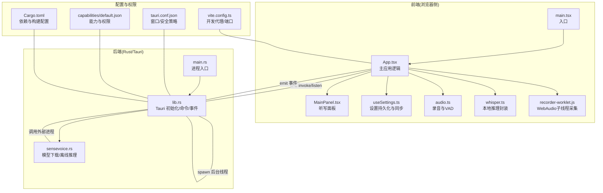

图表来源
- [src/main.tsx:1-10](file://src/main.tsx#L1-L10)
- [src/App.tsx:1-774](file://src/App.tsx#L1-L774)
- [src/components/MainPanel.tsx:1-127](file://src/components/MainPanel.tsx#L1-L127)
- [src/hooks/useSettings.ts:1-97](file://src/hooks/useSettings.ts#L1-L97)
- [src/utils/audio.ts:1-221](file://src/utils/audio.ts#L1-L221)
- [src/utils/whisper.ts:1-174](file://src/utils/whisper.ts#L1-L174)
- [public/recorder-worklet.js:1-39](file://public/recorder-worklet.js#L1-L39)
- [src-tauri/src/main.rs:1-9](file://src-tauri/src/main.rs#L1-L9)
- [src-tauri/src/lib.rs:1-287](file://src-tauri/src/lib.rs#L1-L287)
- [src-tauri/src/sensevoice.rs:1-476](file://src-tauri/src/sensevoice.rs#L1-L476)
- [src-tauri/tauri.conf.json:1-68](file://src-tauri/tauri.conf.json#L1-L68)
- [src-tauri/capabilities/default.json:1-19](file://src-tauri/capabilities/default.json#L1-L19)
- [src-tauri/Cargo.toml:1-47](file://src-tauri/Cargo.toml#L1-L47)
- [vite.config.ts:1-44](file://vite.config.ts#L1-L44)

章节来源
- [README.md:1-8](file://README.md#L1-L8)
- [package.json:1-32](file://package.json#L1-L32)
- [vite.config.ts:1-44](file://vite.config.ts#L1-L44)

## 核心组件
- 前端
  - App.tsx：应用状态机、窗口与胶囊指示器联动、快捷键事件处理、录音流程编排、ASR/AI 润色管线、历史记录与设置集成。
  - audio.ts：基于 WebAudio 的录音类，支持分片回调、静音切除（VAD）、WAV 编码。
  - whisper.ts：本地 Whisper 推理封装，自动选择 WebGPU/WASM，带进度与降级重试。
  - useSettings.ts：设置持久化、默认值、与后端快捷键同步。
  - recorder-worklet.js：WebAudio Worklet 子线程音频采集，降低主线程压力。
- 后端
  - lib.rs：Tauri 应用初始化、托盘菜单、全局快捷键监听线程、剪贴板/粘贴模拟、命令注册、事件发射。
  - sensevoice.rs：SenseVoice 引擎与模型下载、解压、就绪检查、进程外推理。
  - main.rs：进程入口，启动 Tauri 运行时。
- 配置与权限
  - tauri.conf.json：窗口定义、CSP、打包图标等。
  - capabilities/default.json：前后端窗口能力与权限白名单。
  - Cargo.toml：Rust 依赖（系统输入、剪贴板、网络、压缩、日志等）。
  - vite.config.ts：开发服务器端口、HMR、HF 镜像代理。

章节来源
- [src/App.tsx:1-774](file://src/App.tsx#L1-L774)
- [src/utils/audio.ts:1-221](file://src/utils/audio.ts#L1-L221)
- [src/utils/whisper.ts:1-174](file://src/utils/whisper.ts#L1-L174)
- [src/hooks/useSettings.ts:1-97](file://src/hooks/useSettings.ts#L1-L97)
- [public/recorder-worklet.js:1-39](file://public/recorder-worklet.js#L1-L39)
- [src-tauri/src/lib.rs:1-287](file://src-tauri/src/lib.rs#L1-L287)
- [src-tauri/src/sensevoice.rs:1-476](file://src-tauri/src/sensevoice.rs#L1-L476)
- [src-tauri/src/main.rs:1-9](file://src-tauri/src/main.rs#L1-L9)
- [src-tauri/tauri.conf.json:1-68](file://src-tauri/tauri.conf.json#L1-L68)
- [src-tauri/capabilities/default.json:1-19](file://src-tauri/capabilities/default.json#L1-L19)
- [src-tauri/Cargo.toml:1-47](file://src-tauri/Cargo.toml#L1-L47)
- [vite.config.ts:1-44](file://vite.config.ts#L1-L44)

## 架构总览
系统采用“前端轻量渲染 + 后端系统能力”的分层架构。前端专注用户体验与业务编排，后端提供系统级功能（全局热键、剪贴板、托盘、进程外推理）。两者通过 Tauri 的 invoke（命令）与 event（事件）进行双向通信。

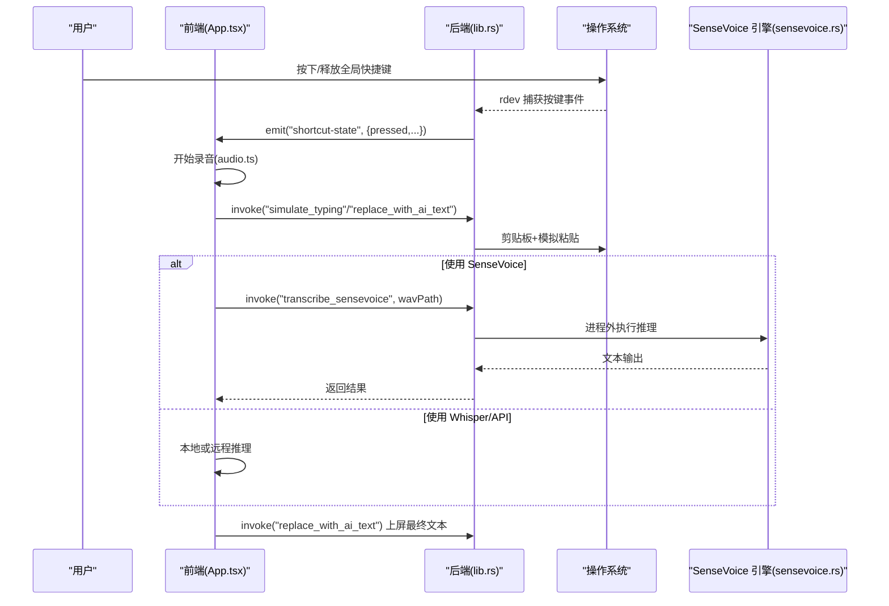

图表来源
- [src-tauri/src/lib.rs:140-212](file://src-tauri/src/lib.rs#L140-L212)
- [src-tauri/src/lib.rs:275-283](file://src-tauri/src/lib.rs#L275-L283)
- [src/App.tsx:256-286](file://src/App.tsx#L256-L286)
- [src/App.tsx:374-435](file://src/App.tsx#L374-L435)
- [src/App.tsx:462-640](file://src/App.tsx#L462-L640)
- [src-tauri/src/sensevoice.rs:445-476](file://src-tauri/src/sensevoice.rs#L445-L476)

## 详细组件分析

### 全局快捷键与事件驱动
- 后端在独立线程中通过 rdev 监听全局按键，读取 AppState 中的目标键与黑名单，匹配后通过 Tauri 事件向所有窗口广播 pressed/released 状态。
- 前端监听该事件，根据当前状态决定是否开始/停止录音，并更新胶囊指示器窗口状态与位置。

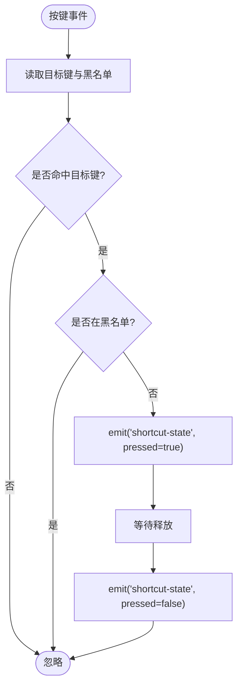

图表来源
- [src-tauri/src/lib.rs:140-212](file://src-tauri/src/lib.rs#L140-L212)
- [src/App.tsx:256-286](file://src/App.tsx#L256-L286)

章节来源
- [src-tauri/src/lib.rs:18-43](file://src-tauri/src/lib.rs#L18-L43)
- [src-tauri/src/lib.rs:140-212](file://src-tauri/src/lib.rs#L140-L212)
- [src/App.tsx:256-286](file://src/App.tsx#L256-L286)

### 录音与音频处理
- 前端使用 AudioContext + AudioWorkletNode 采集 16kHz 单声道 PCM，按固定间隔聚合为分片，支持伪流式回调；stop() 时执行 VAD 静音切除，合并为完整 Float32Array。
- 可选将 Float32Array 编码为 WAV 字节数组供后端进程外推理使用。

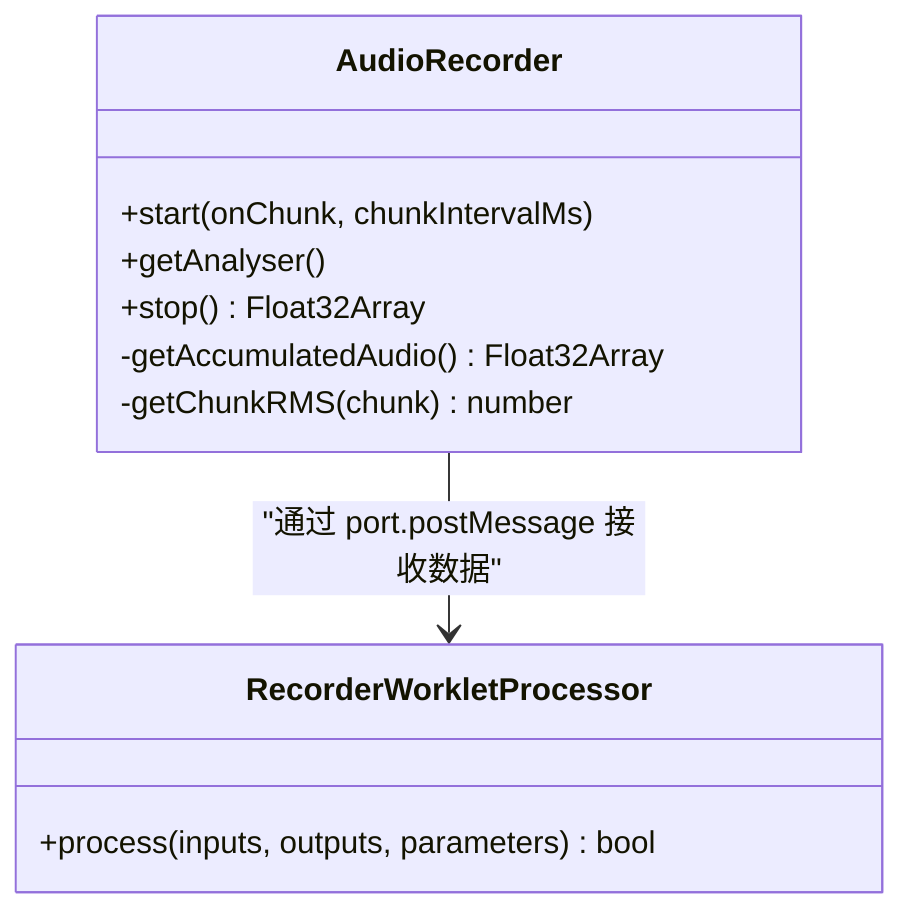

图表来源
- [src/utils/audio.ts:1-221](file://src/utils/audio.ts#L1-L221)
- [public/recorder-worklet.js:1-39](file://public/recorder-worklet.js#L1-L39)

章节来源
- [src/utils/audio.ts:1-221](file://src/utils/audio.ts#L1-L221)
- [public/recorder-worklet.js:1-39](file://public/recorder-worklet.js#L1-L39)

### 本地推理（Whisper）
- 优先尝试 WebGPU，失败则回退到 WASM；支持进度回调与空闲内存回收策略。
- 开发环境通过 Vite 代理访问 HF 镜像站，生产环境直连 hf-mirror.com。

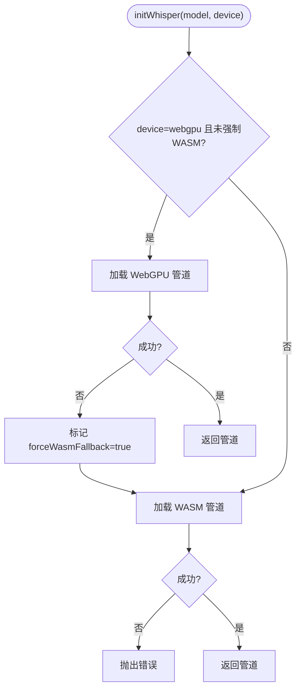

图表来源
- [src/utils/whisper.ts:35-112](file://src/utils/whisper.ts#L35-L112)
- [vite.config.ts:31-41](file://vite.config.ts#L31-L41)

章节来源
- [src/utils/whisper.ts:1-174](file://src/utils/whisper.ts#L1-L174)
- [vite.config.ts:1-44](file://vite.config.ts#L1-L44)

### 离线推理（SenseVoice）
- 后端负责下载并解压引擎与模型，校验大小与存在性，完成后暴露 transcribe_sensevoice 命令供前端调用。
- 前端将录音转为 WAV 写入应用数据目录，调用后端进程外执行推理，解析输出文本。

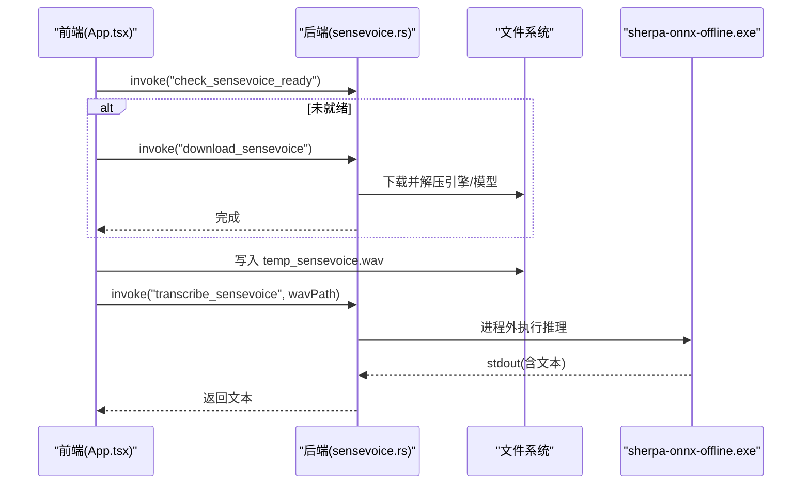

图表来源
- [src-tauri/src/sensevoice.rs:295-443](file://src-tauri/src/sensevoice.rs#L295-L443)
- [src-tauri/src/sensevoice.rs:445-476](file://src-tauri/src/sensevoice.rs#L445-L476)
- [src/App.tsx:186-221](file://src/App.tsx#L186-L221)
- [src/App.tsx:516-544](file://src/App.tsx#L516-L544)

章节来源
- [src-tauri/src/sensevoice.rs:1-476](file://src-tauri/src/sensevoice.rs#L1-L476)
- [src/App.tsx:186-221](file://src/App.tsx#L186-L221)
- [src/App.tsx:516-544](file://src/App.tsx#L516-L544)

### 上屏与替换
- 后端提供 simulate_typing 与 replace_with_ai_text 两个命令，前者直接粘贴文本，后者先删除已上屏占位再粘贴新文本，保证无缝替换。
- 前端在录音阶段插入占位文本，识别完成后替换为最终结果。

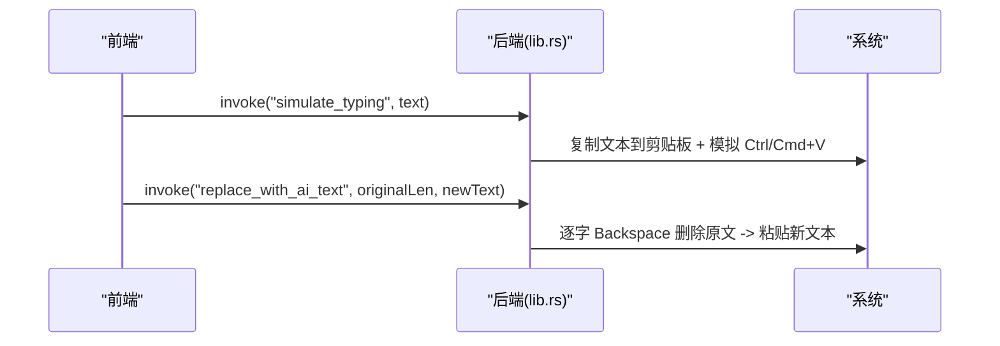

图表来源
- [src-tauri/src/lib.rs:45-118](file://src-tauri/src/lib.rs#L45-L118)
- [src/App.tsx:374-435](file://src/App.tsx#L374-L435)
- [src/App.tsx:462-640](file://src/App.tsx#L462-L640)

章节来源
- [src-tauri/src/lib.rs:45-118](file://src-tauri/src/lib.rs#L45-L118)
- [src/App.tsx:374-435](file://src/App.tsx#L374-L435)
- [src/App.tsx:462-640](file://src/App.tsx#L462-L640)

### 窗口与指示器联动
- 主窗口与“胶囊”指示器窗口通过 label 区分，主窗口统一控制其显隐、定位与状态广播；录制期间轮询音量并推送至指示器。

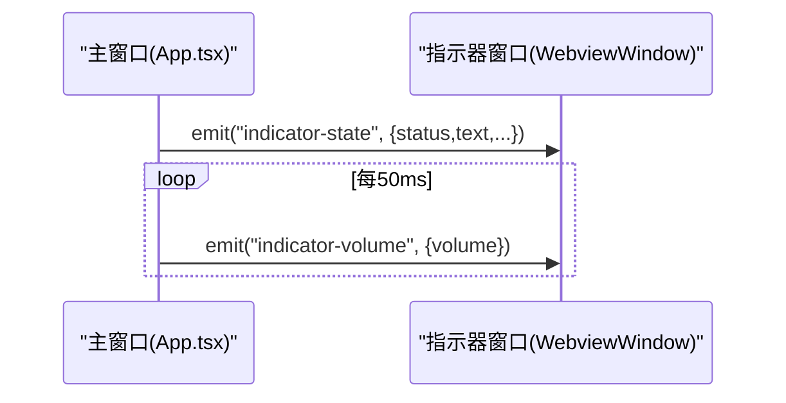

图表来源
- [src/App.tsx:120-171](file://src/App.tsx#L120-L171)
- [src/App.tsx:288-354](file://src/App.tsx#L288-L354)

章节来源
- [src/App.tsx:120-171](file://src/App.tsx#L120-L171)
- [src/App.tsx:288-354](file://src/App.tsx#L288-L354)

## 依赖关系分析
- 前端依赖
  - React、@tauri-apps/api、插件（autostart、fs、opener）、@huggingface/transformers、lucide-react。
  - Vite 用于开发与构建，配置了固定端口与 HF 镜像代理。
- 后端依赖
  - tauri、tauri-plugin-opener、tauri-plugin-autostart（桌面平台）、rdev（全局输入）、arboard（剪贴板）、enigo（模拟按键）、reqwest（HTTP）、tar/bzip2/zip（解压）、log/env_logger（日志）。
- 构建与打包
  - Cargo profile 启用 strip/LTO/opt-level=z/codegen-units=1/panic=abort 以优化体积与性能。
  - tauri.conf.json 定义双窗口、CSP、NSIS 语言包与图标资源。

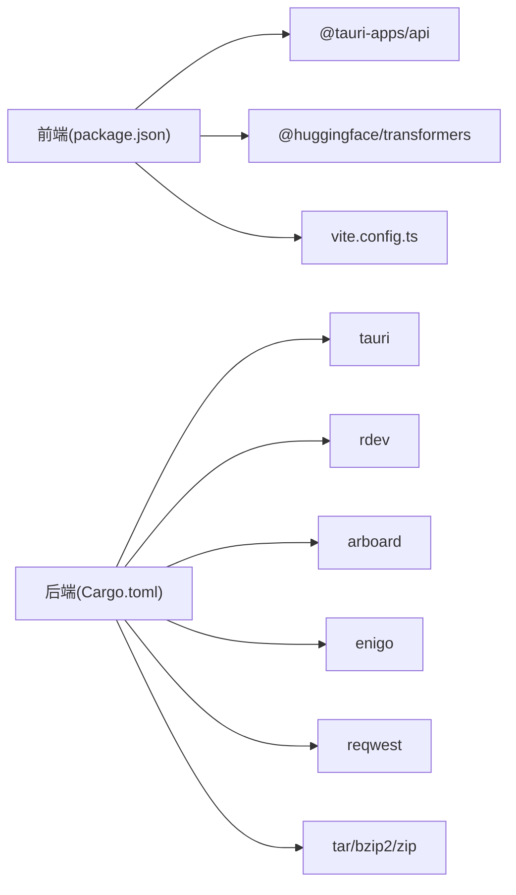

图表来源
- [package.json:1-32](file://package.json#L1-L32)
- [vite.config.ts:1-44](file://vite.config.ts#L1-L44)
- [src-tauri/Cargo.toml:1-47](file://src-tauri/Cargo.toml#L1-L47)

章节来源
- [package.json:1-32](file://package.json#L1-L32)
- [src-tauri/Cargo.toml:1-47](file://src-tauri/Cargo.toml#L1-L47)
- [vite.config.ts:1-44](file://vite.config.ts#L1-L44)

## 性能考量
- 音频采集
  - 使用 AudioWorklet 在子线程处理音频，避免主线程阻塞；固定 16kHz 采样率减少带宽与计算量。
  - VAD 静音切除去除首尾无效片段，提升识别质量与速度。
- 本地推理
  - Whisper 优先 WebGPU，失败自动回退 WASM；空闲 10 分钟自动释放模型以降低常驻内存占用。
  - SenseVoice 通过进程外可执行文件运行，避免在主进程长时间阻塞。
- 构建优化
  - Rust release profile 开启 strip、LTO、opt-level=z、codegen-units=1，显著减小二进制体积并提升运行效率。
- 网络与缓存
  - 模型下载支持多镜像源与断点续传式分块写入，提高成功率与稳定性。

[本节为通用指导，不直接分析具体文件]

## 故障排查指南
- 无法启动麦克风
  - 现象：提示无法启动麦克风。
  - 排查：确认浏览器/WebView2 媒体权限；检查设备是否被占用；查看前端错误日志。
- 识别引擎初始化失败
  - 现象：SenseVoice/Whisper 初始化报错。
  - 排查：检查网络连通性与镜像源；重新触发下载；查看后端日志与下载进度事件。
- 上屏异常
  - 现象：文本未正确粘贴或被输入法拦截。
  - 排查：确认目标应用不在黑名单；检查 replace_with_ai_text 占位长度是否正确；必要时手动重试。
- 全局快捷键无响应
  - 现象：按下快捷键无反应。
  - 排查：确认 listenKey 设置已同步至后端；检查黑名单；查看 shortcut-state 事件是否到达前端。

章节来源
- [src/App.tsx:429-434](file://src/App.tsx#L429-L434)
- [src/App.tsx:214-218](file://src/App.tsx#L214-L218)
- [src-tauri/src/lib.rs:163-176](file://src-tauri/src/lib.rs#L163-L176)
- [src-tauri/src/lib.rs:275-283](file://src-tauri/src/lib.rs#L275-L283)

## 结论
VoiceFlow_AI_002 采用 Tauri 作为宿主框架，将系统级能力下沉至 Rust 后端，前端专注于交互与业务流程编排。通过 IPC 命令与事件驱动，实现了跨窗口的状态同步、全局快捷键监听、音频采集与本地/云端识别一体化体验。技术选型上，Tauri 相比 Electron 具备更小的体积与更高的安全性；Rust 在系统输入、剪贴板、进程外调用等方面提供了稳定高效的支撑。配合 CSP 与最小权限原则，系统在可用性与安全性之间取得良好平衡。

[本节为总结性内容，不直接分析具体文件]

## 附录

### 系统上下文图
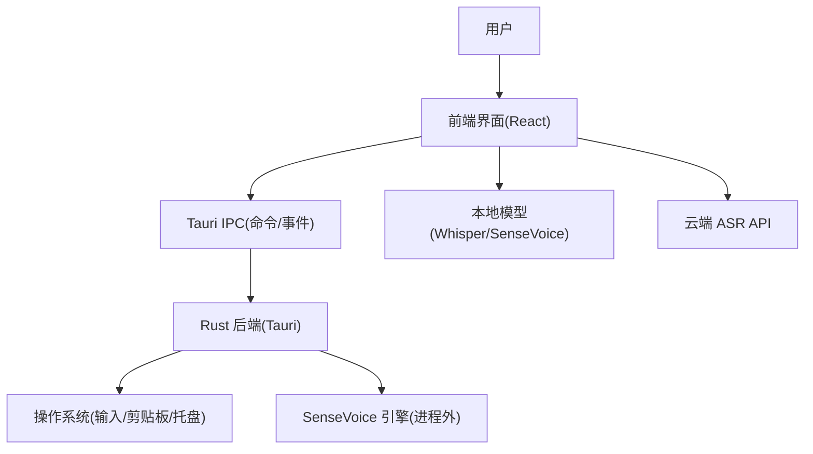

[此图为概念性示意，无需图表来源]

### 组件分解图
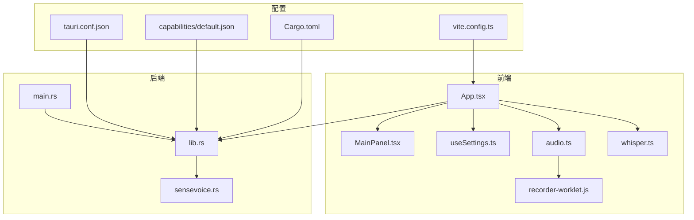

图表来源
- [src/App.tsx:1-774](file://src/App.tsx#L1-L774)
- [src/components/MainPanel.tsx:1-127](file://src/components/MainPanel.tsx#L1-L127)
- [src/hooks/useSettings.ts:1-97](file://src/hooks/useSettings.ts#L1-L97)
- [src/utils/audio.ts:1-221](file://src/utils/audio.ts#L1-L221)
- [src/utils/whisper.ts:1-174](file://src/utils/whisper.ts#L1-L174)
- [public/recorder-worklet.js:1-39](file://public/recorder-worklet.js#L1-L39)
- [src-tauri/src/lib.rs:1-287](file://src-tauri/src/lib.rs#L1-L287)
- [src-tauri/src/sensevoice.rs:1-476](file://src-tauri/src/sensevoice.rs#L1-L476)
- [src-tauri/src/main.rs:1-9](file://src-tauri/src/main.rs#L1-L9)
- [src-tauri/tauri.conf.json:1-68](file://src-tauri/tauri.conf.json#L1-L68)
- [src-tauri/capabilities/default.json:1-19](file://src-tauri/capabilities/default.json#L1-L19)
- [src-tauri/Cargo.toml:1-47](file://src-tauri/Cargo.toml#L1-L47)
- [vite.config.ts:1-44](file://vite.config.ts#L1-L44)

### 安全模型与权限控制
- 窗口与 CSP
  - tauri.conf.json 定义了双窗口与严格 CSP，限制脚本、样式、连接来源，仅允许必要的 self/localhost/ws 等来源。
- 能力与权限
  - capabilities/default.json 对 main 与 indicator 窗口授予最小必要权限（core/window/event/webview/opener）。
- 前端安全
  - 禁止本地模型加载（env.allowLocalModels = false），仅从受控镜像源拉取。
  - 开发环境通过 Vite 代理转发请求，避免跨域问题。
- 后端安全
  - 通过 State 集中管理敏感配置（如快捷键、黑名单），避免全局变量泄露。
  - 进程外调用 SenseVoice 引擎，隔离重型任务与潜在崩溃风险。

章节来源
- [src-tauri/tauri.conf.json:44-46](file://src-tauri/tauri.conf.json#L44-L46)
- [src-tauri/capabilities/default.json:1-19](file://src-tauri/capabilities/default.json#L1-L19)
- [src/utils/whisper.ts:4-13](file://src/utils/whisper.ts#L4-L13)
- [vite.config.ts:31-41](file://vite.config.ts#L31-L41)
- [src-tauri/src/lib.rs:18-43](file://src-tauri/src/lib.rs#L18-L43)

### 技术决策与权衡
- 为什么选择 Tauri 而非 Electron
  - 更小体积与更低内存占用；原生 WebView2 渲染；更强的安全模型（CSP、最小权限）；Rust 生态便于系统级能力集成。
- Rust 在系统级功能中的优势
  - 高性能与内存安全；稳定的系统输入/剪贴板/托盘能力；进程外调用与并发模型成熟；编译期优化选项丰富。
- 前端推理与后端推理的取舍
  - Whisper 在前端利用 WebGPU/WASM 降低延迟与隐私风险；SenseVoice 通过进程外引擎避免主进程阻塞，兼顾性能与稳定性。

[本节为概念性讨论，不直接分析具体文件]