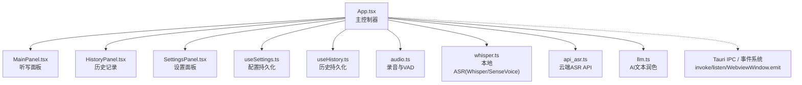
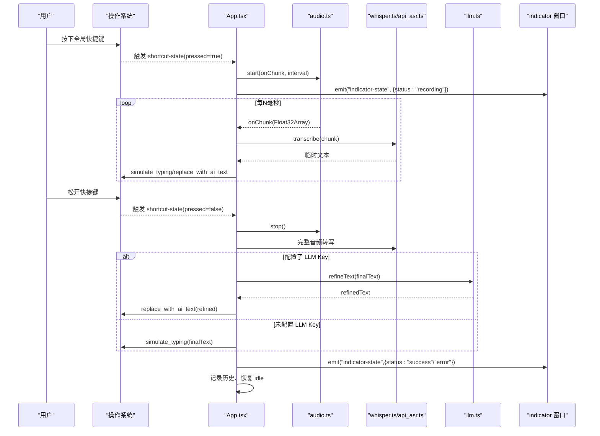
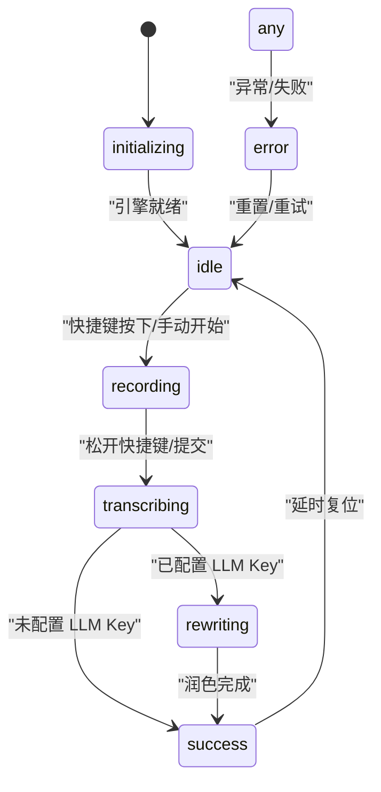
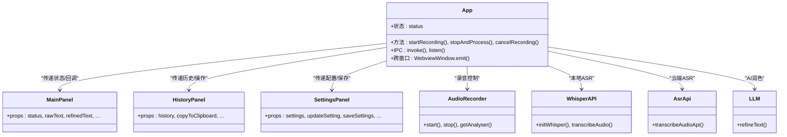
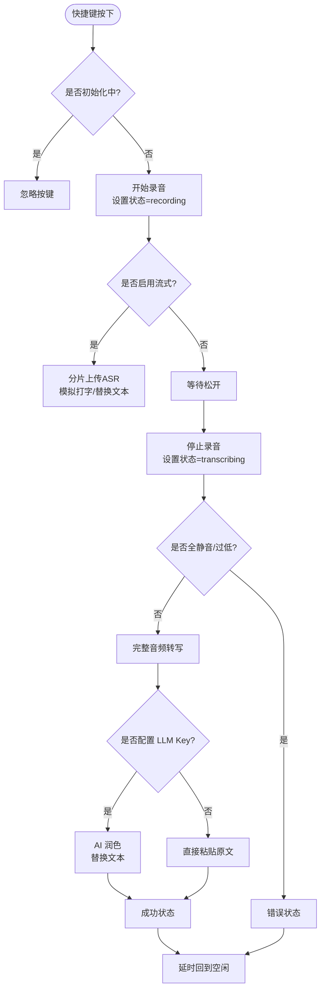
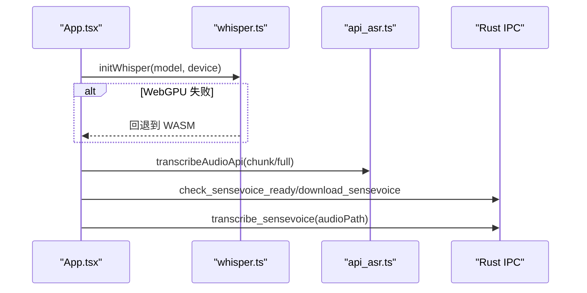
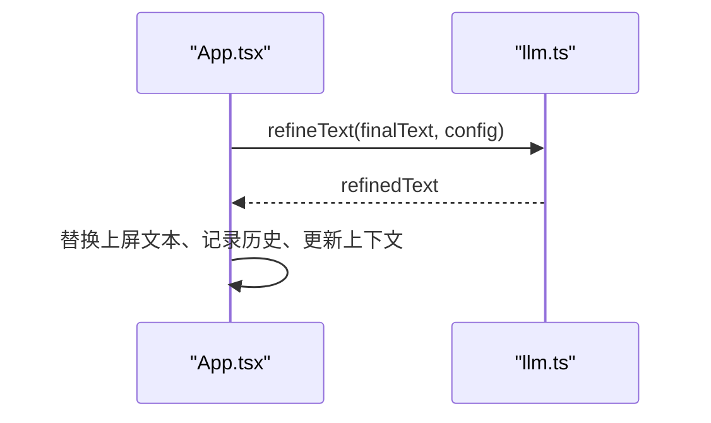
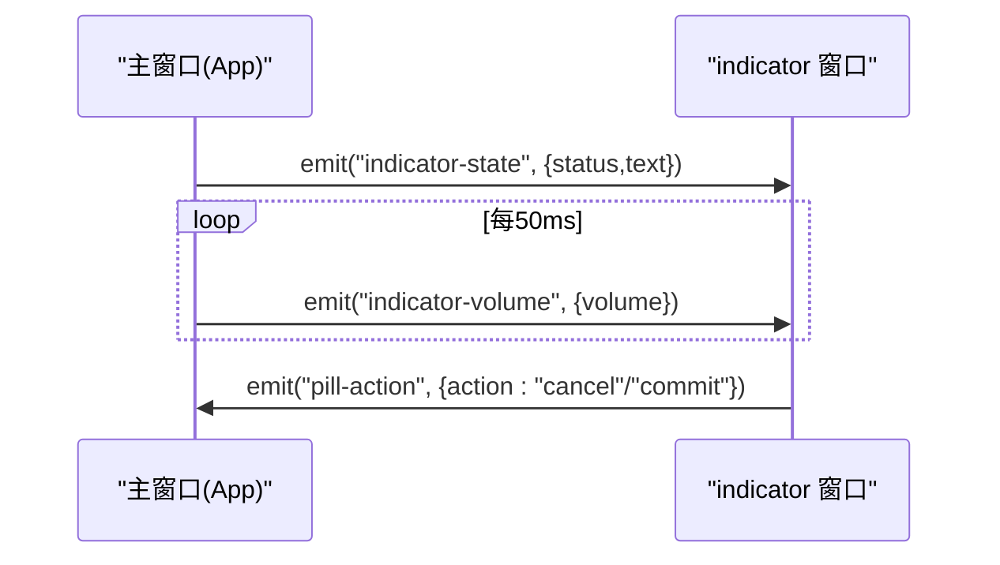
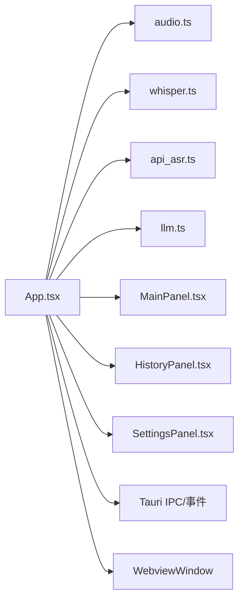

# App 主控制器

<cite>
**本文引用的文件列表**
- [App.tsx](file://src/App.tsx)
- [main.tsx](file://src/main.tsx)
- [MainPanel.tsx](file://src/components/MainPanel.tsx)
- [HistoryPanel.tsx](file://src/components/HistoryPanel.tsx)
- [SettingsPanel.tsx](file://src/components/SettingsPanel.tsx)
- [useSettings.ts](file://src/hooks/useSettings.ts)
- [useHistory.ts](file://src/hooks/useHistory.ts)
- [audio.ts](file://src/utils/audio.ts)
- [whisper.ts](file://src/utils/whisper.ts)
- [api_asr.ts](file://src/utils/api_asr.ts)
- [llm.ts](file://src/utils/llm.ts)
</cite>

## 目录
1. [简介](#简介)
2. [项目结构](#项目结构)
3. [核心组件](#核心组件)
4. [架构总览](#架构总览)
5. [详细组件分析](#详细组件分析)
6. [依赖关系分析](#依赖关系分析)
7. [性能考量](#性能考量)
8. [故障排查指南](#故障排查指南)
9. [结论](#结论)
10. [附录](#附录)

## 简介
本文件围绕 VoiceFlow_AI_002 的 App 主控制器（src/App.tsx）进行系统化文档化，聚焦其作为应用“状态中枢、事件总线与业务编排器”的角色。内容涵盖：
- 七种核心状态及其转换机制（初始化、空闲、录音、转写、重写、成功、错误）
- 组件间数据流与事件通信（Tauri IPC、跨窗口消息、全局快捷键监听）
- 音频录制控制、ASR 本地/云端切换、AI 文本润色等关键流程
- 状态机图与时序图，帮助理解复杂业务流程的执行顺序与状态变化

## 项目结构
前端采用 React + Tauri 架构，App 主控制器位于 src/App.tsx，负责：
- 全局状态管理（状态、模型进度、下载步骤、错误信息、日志等）
- 生命周期与副作用（初始化 ASR/LLM、监听快捷键、同步浮窗状态、音量追踪）
- 业务编排（开始录音、停止并处理、取消录音、提交识别、AI 润色）
- 子面板协调（MainPanel、HistoryPanel、SettingsPanel）

图表来源
- [App.tsx:1-774](file://src/App.tsx#L1-L774)
- [MainPanel.tsx:1-127](file://src/components/MainPanel.tsx#L1-L127)
- [HistoryPanel.tsx:1-103](file://src/components/HistoryPanel.tsx#L1-L103)
- [SettingsPanel.tsx:1-344](file://src/components/SettingsPanel.tsx#L1-L344)
- [useSettings.ts:1-97](file://src/hooks/useSettings.ts#L1-L97)
- [useHistory.ts:1-70](file://src/hooks/useHistory.ts#L1-L70)
- [audio.ts:1-221](file://src/utils/audio.ts#L1-L221)
- [whisper.ts:1-174](file://src/utils/whisper.ts#L1-L174)
- [api_asr.ts:1-73](file://src/utils/api_asr.ts#L1-L73)
- [llm.ts:1-65](file://src/utils/llm.ts#L1-L65)

章节来源
- [App.tsx:1-774](file://src/App.tsx#L1-L774)
- [main.tsx:1-10](file://src/main.tsx#L1-L10)

## 核心组件
- App.tsx：全局状态与业务编排中心，统一调度录音、ASR、AI 润色、UI 更新与外部交互。
- MainPanel.tsx：展示当前状态、错误提示、原文与优化结果预览。
- HistoryPanel.tsx：展示历史条目、复制、删除、清空统计。
- SettingsPanel.tsx：集中配置 LLM、ASR、快捷键、黑名单、自启动等。
- useSettings.ts：加载/保存用户配置，同步快捷键到后端。
- useHistory.ts：加载/保存历史，提供增删改查与剪贴板操作。
- audio.ts：封装浏览器录音、分片回调、静音切除（VAD）、WAV 编码。
- whisper.ts：本地 Whisper/SenseVoice 推理，WebGPU/WASM 自动降级与内存回收策略。
- api_asr.ts：兼容 OpenAI 格式的云端 ASR 调用。
- llm.ts：基于配置的 LLM 文本润色接口。

章节来源
- [App.tsx:1-774](file://src/App.tsx#L1-L774)
- [MainPanel.tsx:1-127](file://src/components/MainPanel.tsx#L1-L127)
- [HistoryPanel.tsx:1-103](file://src/components/HistoryPanel.tsx#L1-L103)
- [SettingsPanel.tsx:1-344](file://src/components/SettingsPanel.tsx#L1-L344)
- [useSettings.ts:1-97](file://src/hooks/useSettings.ts#L1-L97)
- [useHistory.ts:1-70](file://src/hooks/useHistory.ts#L1-L70)
- [audio.ts:1-221](file://src/utils/audio.ts#L1-L221)
- [whisper.ts:1-174](file://src/utils/whisper.ts#L1-L174)
- [api_asr.ts:1-73](file://src/utils/api_asr.ts#L1-L73)
- [llm.ts:1-65](file://src/utils/llm.ts#L1-L65)

## 架构总览
App 主控制器通过以下机制协同工作：
- 状态机驱动 UI 与行为：七种状态决定渲染与流程分支。
- 事件总线：Tauri listen/invoke 用于全局快捷键、后台任务进度、跨窗口通信。
- 多引擎路由：根据配置选择本地 Whisper/SenseVoice 或云端 API。
- 可选 AI 润色：若未配置 LLM Key，则直接以离线模式完成录入。
- 双窗口协作：主窗口负责逻辑，indicator 小药丸窗口负责轻量反馈与实时音量可视化。

图表来源
- [App.tsx:256-286](file://src/App.tsx#L256-L286)
- [App.tsx:373-435](file://src/App.tsx#L373-L435)
- [App.tsx:461-640](file://src/App.tsx#L461-L640)
- [audio.ts:12-73](file://src/utils/audio.ts#L12-L73)
- [whisper.ts:121-174](file://src/utils/whisper.ts#L121-L174)
- [api_asr.ts:41-73](file://src/utils/api_asr.ts#L41-L73)
- [llm.ts:16-65](file://src/utils/llm.ts#L16-L65)

## 详细组件分析

### 状态机与转换机制
App.tsx 维护一个七态状态机：initializing、idle、recording、transcribing、rewriting、success、error。典型流转如下：
- initializing -> idle：模型/引擎就绪后进入空闲
- idle -> recording：收到快捷键按下或手动开始
- recording -> transcribing：松开快捷键或强制提交
- transcribing -> rewriting：有 LLM Key 时进入润色；否则直接进入 success
- rewriting -> success：润色完成
- 任意状态 -> error：异常捕获后进入错误，可重试或忽略
- success -> idle：延时复位

图表来源
- [App.tsx:72](file://src/App.tsx#L72)
- [App.tsx:186-221](file://src/App.tsx#L186-L221)
- [App.tsx:373-435](file://src/App.tsx#L373-L435)
- [App.tsx:461-640](file://src/App.tsx#L461-L640)

章节来源
- [App.tsx:72](file://src/App.tsx#L72)
- [App.tsx:186-221](file://src/App.tsx#L186-L221)
- [App.tsx:373-435](file://src/App.tsx#L373-L435)
- [App.tsx:461-640](file://src/App.tsx#L461-L640)

### 组件间数据流与事件通信
- Tauri IPC：
  - invoke：调用 Rust 能力（如 set_blacklist、simulate_typing、replace_with_ai_text、download_sensevoice、check_sensevoice_ready、transcribe_sensevoice）。
  - listen：监听全局快捷键状态、下载进度等事件。
- 跨窗口消息：
  - WebviewWindow.getByLabel("indicator") 获取小药丸窗口，使用 emit 发送 indicator-state、indicator-volume 等事件。
- 组件通信：
  - App 将状态与回调函数以 props 形式传递给 MainPanel、HistoryPanel、SettingsPanel。
  - Hooks（useSettings、useHistory）提供持久化读写与共享状态。

图表来源
- [App.tsx:1-774](file://src/App.tsx#L1-L774)
- [MainPanel.tsx:1-127](file://src/components/MainPanel.tsx#L1-L127)
- [HistoryPanel.tsx:1-103](file://src/components/HistoryPanel.tsx#L1-L103)
- [SettingsPanel.tsx:1-344](file://src/components/SettingsPanel.tsx#L1-L344)
- [audio.ts:1-221](file://src/utils/audio.ts#L1-L221)
- [whisper.ts:1-174](file://src/utils/whisper.ts#L1-L174)
- [api_asr.ts:1-73](file://src/utils/api_asr.ts#L1-L73)
- [llm.ts:1-65](file://src/utils/llm.ts#L1-L65)

章节来源
- [App.tsx:120-171](file://src/App.tsx#L120-L171)
- [App.tsx:256-286](file://src/App.tsx#L256-L286)
- [App.tsx:289-354](file://src/App.tsx#L289-L354)
- [useSettings.ts:85-88](file://src/hooks/useSettings.ts#L85-L88)
- [useHistory.ts:31-59](file://src/hooks/useHistory.ts#L31-L59)

### 全局快捷键监听与录音控制
- 快捷键监听：
  - 监听 shortcut-state 事件，pressed=true 时开始录音，pressed=false 时停止并处理。
  - 在初始化阶段忽略按键，避免误触。
- 录音控制：
  - 使用 AudioRecorder.start 开启麦克风，支持分片回调（伪流式），按间隔合并上传。
  - 停止时执行 VAD 静音切除，过滤首尾静音片段。
  - 非 API 引擎会在上屏占位符，最终替换为完整识别文本。

图表来源
- [App.tsx:256-286](file://src/App.tsx#L256-L286)
- [App.tsx:373-435](file://src/App.tsx#L373-L435)
- [App.tsx:461-640](file://src/App.tsx#L461-L640)
- [audio.ts:109-173](file://src/utils/audio.ts#L109-L173)

章节来源
- [App.tsx:256-286](file://src/App.tsx#L256-L286)
- [App.tsx:373-435](file://src/App.tsx#L373-L435)
- [App.tsx:461-640](file://src/App.tsx#L461-L640)
- [audio.ts:109-173](file://src/utils/audio.ts#L109-L173)

### 语音识别引擎路由与实现细节
- 本地引擎（Whisper/SenseVoice）：
  - 首次运行自动下载模型权重，显示进度与步骤。
  - 优先尝试 WebGPU，失败回退至 WASM；运行时崩溃也触发回退。
  - SenseVoice 路径：写入临时 WAV 文件，调用 Rust 能力进行推理，解析输出文本。
- 云端引擎（OpenAI 兼容 API）：
  - 支持流式分片上传，边说话边上屏，提升体验。
  - 自动补齐 URL 后缀，构造 FormData 上传 WAV。

图表来源
- [whisper.ts:35-112](file://src/utils/whisper.ts#L35-L112)
- [whisper.ts:121-174](file://src/utils/whisper.ts#L121-L174)
- [api_asr.ts:41-73](file://src/utils/api_asr.ts#L41-L73)
- [App.tsx:186-221](file://src/App.tsx#L186-L221)
- [App.tsx:516-544](file://src/App.tsx#L516-L544)

章节来源
- [whisper.ts:35-112](file://src/utils/whisper.ts#L35-L112)
- [whisper.ts:121-174](file://src/utils/whisper.ts#L121-L174)
- [api_asr.ts:41-73](file://src/utils/api_asr.ts#L41-L73)
- [App.tsx:186-221](file://src/App.tsx#L186-L221)
- [App.tsx:516-544](file://src/App.tsx#L516-L544)

### AI 文本润色与上下文记忆
- 当检测到 LLM Key 存在时，对最终文本进行风格化润色（自然/正式/精简/学术）。
- 根据活跃应用名称注入场景提示（聊天/办公/编程），提升适配性。
- 保留最近上下文（lastContext），辅助后续识别与润色连贯性。

图表来源
- [llm.ts:16-65](file://src/utils/llm.ts#L16-L65)
- [App.tsx:603-633](file://src/App.tsx#L603-L633)

章节来源
- [llm.ts:16-65](file://src/utils/llm.ts#L16-L65)
- [App.tsx:603-633](file://src/App.tsx#L603-L633)

### 浮空小药丸窗口与实时音量可视化
- 主窗口根据状态向 indicator 窗口广播状态与文本。
- 录音期间轮询 AnalyserNode 计算 RMS 音量，定时发射 indicator-volume 事件，配合 CSS 动画呈现波形效果。
- 小药丸窗口支持取消/强制提交动作，反向通知主窗口。

图表来源
- [App.tsx:120-171](file://src/App.tsx#L120-L171)
- [App.tsx:289-354](file://src/App.tsx#L289-L354)
- [App.tsx:356-371](file://src/App.tsx#L356-L371)

章节来源
- [App.tsx:120-171](file://src/App.tsx#L120-L171)
- [App.tsx:289-354](file://src/App.tsx#L289-L354)
- [App.tsx:356-371](file://src/App.tsx#L356-L371)

### 配置与历史持久化
- 配置：
  - 从 localStorage 读取默认/旧版键值，合并为统一 JSON 对象。
  - 修改快捷键时同步到 Rust 后端，确保全局监听生效。
- 历史：
  - 新增/删除/清空历史记录，限制最多 100 条，支持复制到剪贴板。

章节来源
- [useSettings.ts:36-97](file://src/hooks/useSettings.ts#L36-L97)
- [useHistory.ts:12-70](file://src/hooks/useHistory.ts#L12-L70)

## 依赖关系分析
- 模块耦合：
  - App.tsx 强依赖各工具模块与子面板，承担编排职责。
  - audio.ts 与 whisper.ts/api_asr.ts 解耦，便于替换引擎。
  - llm.ts 独立于 ASR 层，仅消费最终文本。
- 外部集成点：
  - Tauri IPC：invoke/listen 与 Rust 后端交互。
  - WebviewWindow：跨窗口通信。
  - 浏览器 API：MediaDevices、AudioContext、AnalyserNode、Clipboard。

图表来源
- [App.tsx:1-774](file://src/App.tsx#L1-L774)
- [audio.ts:1-221](file://src/utils/audio.ts#L1-L221)
- [whisper.ts:1-174](file://src/utils/whisper.ts#L1-L174)
- [api_asr.ts:1-73](file://src/utils/api_asr.ts#L1-L73)
- [llm.ts:1-65](file://src/utils/llm.ts#L1-L65)
- [MainPanel.tsx:1-127](file://src/components/MainPanel.tsx#L1-L127)
- [HistoryPanel.tsx:1-103](file://src/components/HistoryPanel.tsx#L1-L103)
- [SettingsPanel.tsx:1-344](file://src/components/SettingsPanel.tsx#L1-L344)

章节来源
- [App.tsx:1-774](file://src/App.tsx#L1-L774)

## 性能考量
- 模型加载与回退：
  - 优先 WebGPU，失败自动回退 WASM；运行时崩溃亦触发回退，提高稳定性。
  - 10 分钟无活动自动释放管道，降低内存占用。
- 音频采集与传输：
  - 分片上传（伪流式）减少延迟，但需平衡网络开销与丢包风险。
  - VAD 静音切除去除无效片段，降低带宽与推理成本。
- 渲染与交互：
  - indicator 窗口仅承载轻量 UI，主窗口隐藏以减少资源消耗。
  - 定时器与异步 emit 避免阻塞主线程。

[本节为通用指导，不直接分析具体文件]

## 故障排查指南
- 无法启动麦克风：
  - 检查权限与设备可用性，查看错误信息并重置状态。
- 全静音/音量过低：
  - 靠近麦克风或提高音量，确认环境噪音与回声消除设置。
- 模型下载失败：
  - 检查网络连接与镜像源，必要时重试下载。
- WebGPU 推理崩溃：
  - 自动回退 WASM；若仍失败，强制切换设备为 WASM 模式。
- LLM 请求失败：
  - 校验 API Key、Base URL 与 Model Name，确认服务可用。
- 快捷键无效：
  - 检查黑名单配置与焦点应用，确认快捷键已同步到后端。

章节来源
- [App.tsx:429-435](file://src/App.tsx#L429-L435)
- [App.tsx:493-505](file://src/App.tsx#L493-L505)
- [App.tsx:186-221](file://src/App.tsx#L186-L221)
- [whisper.ts:147-174](file://src/utils/whisper.ts#L147-L174)
- [llm.ts:52-65](file://src/utils/llm.ts#L52-L65)
- [useSettings.ts:85-88](file://src/hooks/useSettings.ts#L85-L88)

## 结论
App.tsx 作为整个应用的“大脑”，通过清晰的状态机与事件总线，将录音、ASR、AI 润色与 UI 表现有机串联。其设计兼顾性能与用户体验：本地/云端双引擎、WebGPU/WASM 自动回退、分片流式上屏、浮窗轻量反馈。结合 hooks 的持久化与 Tauri 的跨进程能力，形成稳定、可扩展的桌面端智能听写方案。

[本节为总结，不直接分析具体文件]

## 附录
- 入口文件：
  - main.tsx 挂载 React 根节点并渲染 App。
- 样式与图标：
  - 使用 Tailwind 类名与 lucide-react 图标库，保持界面一致性与可读性。

章节来源
- [main.tsx:1-10](file://src/main.tsx#L1-L10)