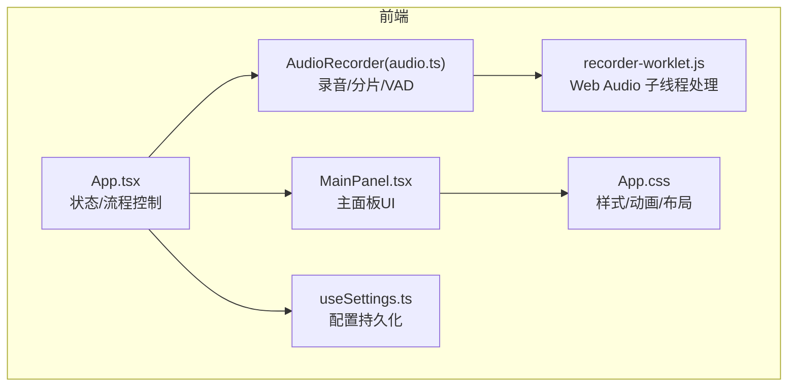
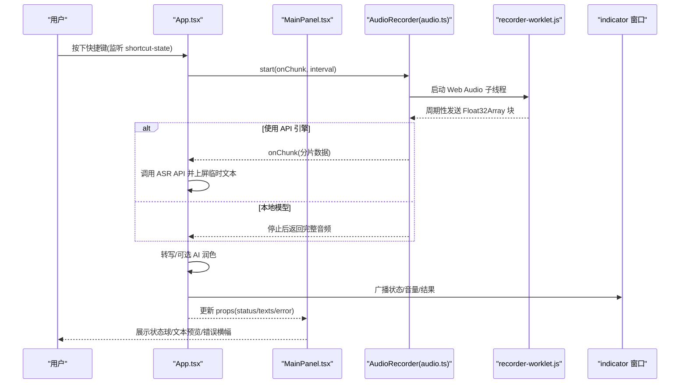
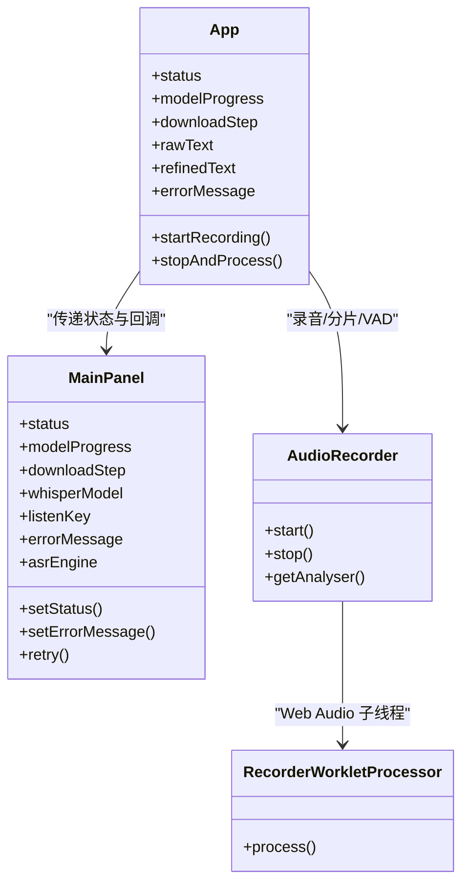

# 主面板组件

<cite>
**本文引用的文件**
- [MainPanel.tsx](file://src/components/MainPanel.tsx)
- [App.tsx](file://src/App.tsx)
- [audio.ts](file://src/utils/audio.ts)
- [recorder-worklet.js](file://public/recorder-worklet.js)
- [useSettings.ts](file://src/hooks/useSettings.ts)
- [App.css](file://src/App.css)
</cite>

## 目录
1. [简介](#简介)
2. [项目结构](#项目结构)
3. [核心组件](#核心组件)
4. [架构总览](#架构总览)
5. [详细组件分析](#详细组件分析)
6. [依赖关系分析](#依赖关系分析)
7. [性能考量](#性能考量)
8. [故障排查指南](#故障排查指南)
9. [结论](#结论)
10. [附录：Props 接口与使用示例](#附录props-接口与使用示例)

## 简介
本文件为 VoiceFlow_AI_002 的主面板组件 MainPanel.tsx 的详细文档。该组件是用户的主要交互界面，负责展示录音控制区域、状态指示器、文本预览区以及错误提示等关键 UI。它与 App.tsx 中的业务逻辑（录音、转写、AI 润色、窗口联动）紧密协作，并通过 CSS 提供深色主题、动画与响应式布局体验。

## 项目结构
主面板位于 src/components/MainPanel.tsx，由 App.tsx 作为容器进行状态管理与事件编排；音频采集与可视化能力来自 src/utils/audio.ts 与 public/recorder-worklet.js；样式集中在 src/App.css；设置项通过 src/hooks/useSettings.ts 管理并注入到主面板。

图表来源
- [App.tsx:1-774](file://src/App.tsx#L1-L774)
- [MainPanel.tsx:1-127](file://src/components/MainPanel.tsx#L1-L127)
- [audio.ts:1-221](file://src/utils/audio.ts#L1-L221)
- [recorder-worklet.js:1-39](file://public/recorder-worklet.js#L1-L39)
- [useSettings.ts:1-97](file://src/hooks/useSettings.ts#L1-L97)
- [App.css:1-853](file://src/App.css#L1-L853)

章节来源
- [App.tsx:1-774](file://src/App.tsx#L1-L774)
- [MainPanel.tsx:1-127](file://src/components/MainPanel.tsx#L1-L127)
- [audio.ts:1-221](file://src/utils/audio.ts#L1-L221)
- [recorder-worklet.js:1-39](file://public/recorder-worklet.js#L1-L39)
- [useSettings.ts:1-97](file://src/hooks/useSettings.ts#L1-L97)
- [App.css:1-853](file://src/App.css#L1-L853)

## 核心组件
- 主面板 MainPanel.tsx
  - 职责：渲染初始化加载态、工作区状态球、就绪提示、错误横幅、文本预览卡片等。
  - 输入：从父组件传入的状态、进度、模型信息、快捷键提示、错误消息、ASR 引擎类型、回调函数等。
  - 输出：无副作用的纯展示，通过回调将操作反馈给父组件。

章节来源
- [MainPanel.tsx:1-127](file://src/components/MainPanel.tsx#L1-L127)

## 架构总览
主面板由 App.tsx 驱动，App.tsx 维护全局状态（如 status、modelProgress、rawText、refinedText、errorMessage），并根据状态变化更新独立浮窗“小药丸”的显示位置与内容。录音流程涉及浏览器麦克风权限、AudioWorklet 子线程采样、VAD 静音切除、可选 API 流式识别、本地 Whisper/SenseVoice 推理、以及可选 LLM 润色。

图表来源
- [App.tsx:256-354](file://src/App.tsx#L256-L354)
- [App.tsx:373-640](file://src/App.tsx#L373-L640)
- [audio.ts:12-73](file://src/utils/audio.ts#L12-L73)
- [recorder-worklet.js:9-35](file://public/recorder-worklet.js#L9-L35)

## 详细组件分析

### 主面板布局与视觉结构
- 初始化加载区
  - 当状态为“initializing”时，显示旋转图标、说明文字、下载步骤与进度条。
  - 进度条宽度随 modelProgress 百分比动态更新。
- 工作区
  - 状态球：根据当前状态切换图标与发光颜色，包含 idle、recording、transcribing、rewriting、success、error 六种状态。
  - 就绪提示：在 idle 状态下显示快捷键提示，引导用户使用右侧指定键位开始听写。
  - 错误横幅：在 error 状态下显示错误信息与可操作按钮（忽略并使用 API、重试下载）。
  - 文本预览卡片：同时展示 ASR 原文与 AI 优化文本（若存在），以分区标题区分。

章节来源
- [MainPanel.tsx:33-126](file://src/components/MainPanel.tsx#L33-L126)
- [App.css:183-412](file://src/App.css#L183-L412)
- [App.css:785-853](file://src/App.css#L785-L853)

### 状态管理与数据流
- 状态来源
  - status：由 App.tsx 维护，涵盖 initializing、idle、recording、transcribing、rewriting、success、error。
  - modelProgress/downloadStep：用于模型下载进度与步骤提示。
  - rawText/refinedText：分别表示原始识别文本与 AI 优化后的文本。
  - errorMessage/asrEngine/listenKey/whisperModel：辅助展示与交互分支。
- 状态驱动的 UI 分支
  - 初始化阶段：显示进度条与下载步骤。
  - 空闲阶段：显示就绪提示与快捷键。
  - 错误阶段：显示错误横幅与操作按钮。
  - 成功/转写/润色阶段：通过状态球与图标动画传达系统行为。
- 与父组件的通信
  - 通过 setStatus/setErrorMessage/retry 回调与 App.tsx 同步状态或触发重试。

章节来源
- [MainPanel.tsx:4-32](file://src/components/MainPanel.tsx#L4-L32)
- [MainPanel.tsx:33-126](file://src/components/MainPanel.tsx#L33-L126)
- [App.tsx:72-88](file://src/App.tsx#L72-L88)

### 用户交互逻辑
- 快捷键触发
  - App.tsx 监听 Rust 层发出的 shortcut-state 事件，按下时进入 recording，松开时停止并处理。
  - MainPanel 仅展示 listenKey 提示，不直接绑定键盘事件。
- 点击录音
  - 主面板未暴露点击录音入口，实际录音由快捷键驱动；如需扩展，可在 MainPanel 中增加按钮并调用父组件提供的回调。
- 实时音量显示
  - App.tsx 在 recording 状态下轮询 AnalyserNode 计算 RMS 音量，并广播至 indicator 窗口；MainPanel 不直接参与音量计算。
- 错误处理与重试
  - 错误横幅根据错误信息上下文显示不同操作按钮，支持忽略并使用 API 或重试下载。

章节来源
- [App.tsx:256-286](file://src/App.tsx#L256-L286)
- [App.tsx:288-354](file://src/App.tsx#L288-L354)
- [MainPanel.tsx:76-100](file://src/components/MainPanel.tsx#L76-L100)

### 样式设计与响应式布局
- 主题与配色
  - 深色主题变量定义于 :root，包括背景、面板、边框、文本、强调色与霓虹色系。
- 布局结构
  - 主容器采用 flex 纵向布局，头部可拖拽，导航栏居中，主体区域三栏滑动切换。
  - 主面板区域 main-pane 垂直居中，workspace 限制最大宽度并纵向排列各区块。
- 动效与反馈
  - 状态球在不同状态下改变边框与发光颜色，配合缩放与阴影增强反馈。
  - 进度条渐变填充，平滑过渡。
  - 错误横幅淡入动画与悬停按钮微动效果。
- 响应式适配
  - 通过 max-width、flex 居中与相对单位实现多尺寸屏幕下的良好呈现。

章节来源
- [App.css:1-24](file://src/App.css#L1-L24)
- [App.css:43-180](file://src/App.css#L43-L180)
- [App.css:183-412](file://src/App.css#L183-L412)
- [App.css:785-853](file://src/App.css#L785-L853)

### 音频采集与可视化支撑
- 录音类 AudioRecorder
  - 使用 navigator.mediaDevices.getUserMedia 获取麦克风流，创建 AudioContext 与分析器节点。
  - 通过 AudioWorkletNode 在子线程收集音频块，主线程按间隔合并并回调。
  - stop() 执行 VAD 静音切除，去除首尾长静音片段，返回有效音频 Float32Array。
- Worklet 处理器
  - recorder-worklet.js 在子线程累积样本，达到缓冲区大小后发送到主线程。
- 与主面板的关系
  - MainPanel 不直接访问音频对象，但通过 App.tsx 的状态与文本预览间接反映录音与识别结果。

章节来源
- [audio.ts:1-174](file://src/utils/audio.ts#L1-174)
- [recorder-worklet.js:1-39](file://public/recorder-worklet.js#L1-L39)

## 依赖关系分析
- 组件耦合
  - MainPanel 对 App.tsx 强依赖（状态与回调），自身保持无副作用展示。
  - App.tsx 聚合 AudioRecorder、Tauri 事件、API/本地模型调用，承担复杂流程编排。
- 外部依赖
  - Tauri API：窗口控制、事件监听、文件系统、路径、自动启动等。
  - Web Audio API：麦克风、AnalyserNode、AudioWorklet。
  - 第三方库：lucide-react 图标。
- 潜在循环依赖
  - 当前结构清晰，MainPanel 单向依赖 App.tsx，未见循环引用。

图表来源
- [MainPanel.tsx:4-32](file://src/components/MainPanel.tsx#L4-L32)
- [App.tsx:373-640](file://src/App.tsx#L373-L640)
- [audio.ts:1-174](file://src/utils/audio.ts#L1-L174)
- [recorder-worklet.js:1-39](file://public/recorder-worklet.js#L1-L39)

章节来源
- [MainPanel.tsx:1-127](file://src/components/MainPanel.tsx#L1-L127)
- [App.tsx:1-774](file://src/App.tsx#L1-L774)
- [audio.ts:1-221](file://src/utils/audio.ts#L1-L221)
- [recorder-worklet.js:1-39](file://public/recorder-worklet.js#L1-L39)

## 性能考量
- 音频分片与流式识别
  - 使用 AudioWorklet 降低主线程压力；分片间隔可调，避免频繁 I/O。
- VAD 静音切除
  - 基于 RMS 阈值裁剪首尾静音，减少无效音频上传与推理开销。
- 实时音量计算
  - 每 50ms 采样一次，计算 RMS 并映射到 0-100，配合 CSS transition 实现平滑波形。
- 渲染优化
  - MainPanel 为纯展示组件，仅在 props 变化时重渲染；状态球与进度条使用 CSS 过渡而非 JS 动画，提升流畅度。

[本节为通用性能建议，无需特定文件分析]

## 故障排查指南
- 初始化失败
  - 现象：显示错误横幅，提示“识别引擎初始化失败”。
  - 处理：检查网络与模型下载；可使用“重试下载”或“忽略并使用 API”选项。
- 无法启动麦克风
  - 现象：错误信息包含“无法启动麦克风”。
  - 处理：确认浏览器权限、设备可用性与冲突应用。
- 音量过低或未检测到声音
  - 现象：错误提示“麦克风收音音量过低”。
  - 处理：靠近麦克风、提高音量或调整系统输入增益。
- 识别为空
  - 现象：结束录音后提示“没有检测到有效说话声”。
  - 处理：重新尝试，确保环境噪音较低且语句完整。

章节来源
- [App.tsx:214-221](file://src/App.tsx#L214-L221)
- [App.tsx:429-434](file://src/App.tsx#L429-L434)
- [App.tsx:493-505](file://src/App.tsx#L493-L505)
- [App.tsx:556-560](file://src/App.tsx#L556-L560)
- [MainPanel.tsx:76-100](file://src/components/MainPanel.tsx#L76-L100)

## 结论
MainPanel.tsx 作为主面板组件，专注于状态驱动的 UI 展示与用户可读性反馈，其设计简洁、层次清晰，并与 App.tsx 的流程控制形成良好的解耦。结合 AudioRecorder 与 Web Audio 子线程，系统在录音、分片、VAD、转写与润色方面具备较好的性能与用户体验。通过 CSS 的深色主题与动效，整体界面具有现代感与高辨识度。

[本节为总结性内容，无需特定文件分析]

## 附录：Props 接口与使用示例

### Props 接口定义
- 字段与用途
  - status: string — 当前系统状态，用于条件渲染与状态球展示。
  - modelProgress: number — 模型下载进度百分比。
  - downloadStep?: string — 下载步骤描述，用于细化提示。
  - whisperModel: string — 当前选择的模型标识，用于估算内存占用提示。
  - listenKey: string — 快捷键提示，用于就绪 banner 展示。
  - errorMessage: string — 错误信息，用于错误横幅展示。
  - asrEngine: string — ASR 引擎类型，影响错误横幅的操作按钮显示。
  - setStatus: (status: any) => void — 更新状态的回调。
  - setErrorMessage: (msg: string) => void — 更新错误信息的回调。
  - rawText: string — ASR 原始识别文本。
  - refinedText: string — AI 优化后的文本。
  - retry?: () => void — 重试下载的回调。

章节来源
- [MainPanel.tsx:4-32](file://src/components/MainPanel.tsx#L4-L32)

### 使用示例（来自 App.tsx 的集成方式）
- 父组件将状态与回调传递给 MainPanel，并在不同标签页中切换显示。
- 示例路径参考：
  - [App.tsx:726-739](file://src/App.tsx#L726-L739)

章节来源
- [App.tsx:726-739](file://src/App.tsx#L726-L739)