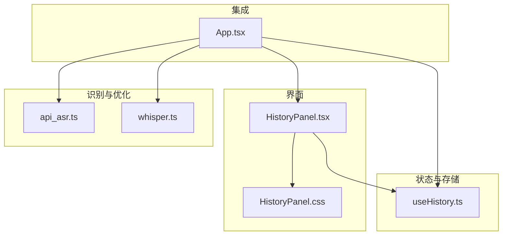
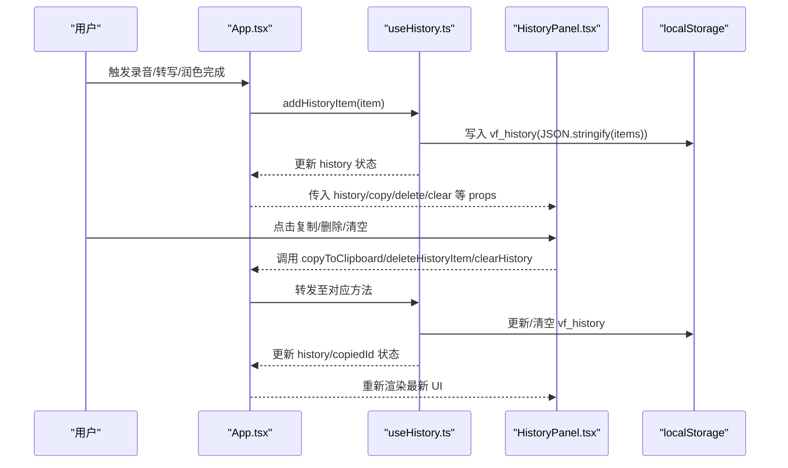
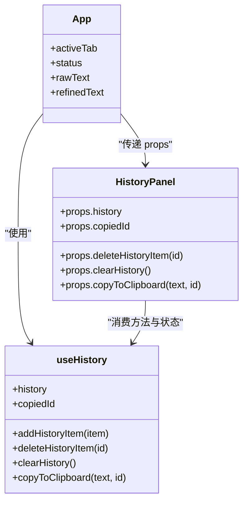

# 历史记录面板

<cite>
**本文引用的文件**
- [HistoryPanel.tsx](file://src/components/HistoryPanel.tsx)
- [useHistory.ts](file://src/hooks/useHistory.ts)
- [HistoryPanel.css](file://src/components/HistoryPanel.css)
- [App.tsx](file://src/App.tsx)
- [api_asr.ts](file://src/utils/api_asr.ts)
- [whisper.ts](file://src/utils/whisper.ts)
- [package.json](file://package.json)
</cite>

## 目录
1. [简介](#简介)
2. [项目结构](#项目结构)
3. [核心组件](#核心组件)
4. [架构总览](#架构总览)
5. [详细组件分析](#详细组件分析)
6. [依赖分析](#依赖分析)
7. [性能考虑](#性能考虑)
8. [故障排查指南](#故障排查指南)
9. [结论](#结论)
10. [附录：数据模型与接口说明](#附录数据模型与接口说明)

## 简介
本文件为 VoiceFlow_AI_002 的“历史记录面板”提供系统化文档，聚焦 HistoryPanel.tsx 的设计与实现。内容涵盖：
- 数据结构与本地持久化机制（localStorage）
- 列表展示、复制粘贴、删除确认、清空历史等交互流程
- 状态管理（加载、错误处理、容量限制）
- 与主应用的数据流与集成点
- 相关 API 与数据模型说明（ASR 与 LLM 侧）

## 项目结构
与历史记录面板直接相关的代码位于以下位置：
- 视图层：src/components/HistoryPanel.tsx 与 src/components/HistoryPanel.css
- 状态与存储：src/hooks/useHistory.ts
- 集成入口：src/App.tsx（将历史记录 Hook 注入到面板）
- 语音识别与优化：src/utils/api_asr.ts、src/utils/whisper.ts（用于生成历史记录条目）
- 工程配置：package.json（依赖与脚本）

图表来源
- [HistoryPanel.tsx:1-103](file://src/components/HistoryPanel.tsx#L1-L103)
- [useHistory.ts:1-70](file://src/hooks/useHistory.ts#L1-L70)
- [App.tsx:740-751](file://src/App.tsx#L740-L751)
- [api_asr.ts:1-73](file://src/utils/api_asr.ts#L1-L73)
- [whisper.ts:1-174](file://src/utils/whisper.ts#L1-L174)

章节来源
- [HistoryPanel.tsx:1-103](file://src/components/HistoryPanel.tsx#L1-L103)
- [useHistory.ts:1-70](file://src/hooks/useHistory.ts#L1-L70)
- [App.tsx:740-751](file://src/App.tsx#L740-L751)

## 核心组件
- HistoryPanel 组件负责渲染历史记录列表、统计概览、操作按钮（复制、删除、清空），并接收来自父组件的状态与方法。
- useHistory Hook 负责：
  - 从 localStorage 初始化历史数据
  - 新增、删除、清空记录
  - 剪贴板复制反馈
  - 返回供 UI 消费的状态与方法

章节来源
- [HistoryPanel.tsx:1-103](file://src/components/HistoryPanel.tsx#L1-L103)
- [useHistory.ts:1-70](file://src/hooks/useHistory.ts#L1-L70)

## 架构总览
历史记录面板采用“受控组件 + Hook 状态”的模式：
- App 通过 useHistory 获取 history、addHistoryItem、deleteHistoryItem、clearHistory、copyToClipboard、copiedId
- App 将这些属性与方法以 props 形式传递给 HistoryPanel
- HistoryPanel 仅做展示与事件派发，不直接读写存储
- 所有持久化逻辑集中在 useHistory 中，统一使用 localStorage 键名 vf_history

图表来源
- [App.tsx:594-633](file://src/App.tsx#L594-L633)
- [useHistory.ts:31-52](file://src/hooks/useHistory.ts#L31-L52)
- [HistoryPanel.tsx:87-95](file://src/components/HistoryPanel.tsx#L87-L95)

## 详细组件分析

### 数据结构与存储机制
- 数据模型
  - id: string，唯一标识
  - timestamp: number，时间戳
  - rawText: string，原始识别文本
  - refinedText: string，AI 优化后的文本（可为空或等于 rawText）
  - style: string，提示词风格（由设置决定）
  - success: boolean，是否成功润色
- 存储键名
  - vf_history，JSON 数组格式
- 访问模式
  - 初始化时读取一次，后续每次增删改后同步写入
  - 新增时插入头部并截断至固定上限，避免无限增长
- 复杂度
  - 新增：O(1) 插入 + O(n) slice 截断（n ≤ 100）
  - 删除：O(n) 过滤
  - 清空：O(1) 重置
  - 复制：O(1) 剪贴板写入
  - 存储：O(n) JSON 序列化

章节来源
- [useHistory.ts:3-10](file://src/hooks/useHistory.ts#L3-L10)
- [useHistory.ts:16-29](file://src/hooks/useHistory.ts#L16-L29)
- [useHistory.ts:31-45](file://src/hooks/useHistory.ts#L31-L45)

### 组件功能特性
- 列表展示
  - 按时间倒序显示最近记录
  - 每条记录包含时间、标签（已润色/未润色）、原始文本、可选 AI 优化文本
- 统计概览
  - 累计生成字数：对每条记录的 refinedText 或 rawText 长度求和
  - 预估节省时间：基于累计字数除以 80 字/分钟估算
- 复制粘贴
  - 优先复制 refinedText，否则回退到 rawText
  - 复制成功后短暂标记“已复制”，2 秒后恢复
- 删除与清空
  - 单条删除：根据 id 过滤
  - 清空全部：二次确认后清空数组并持久化
- 搜索过滤
  - 当前版本未实现搜索过滤功能
- 批量操作
  - 当前版本未实现批量选择与批量删除

章节来源
- [HistoryPanel.tsx:22-48](file://src/components/HistoryPanel.tsx#L22-L48)
- [HistoryPanel.tsx:56-98](file://src/components/HistoryPanel.tsx#L56-L98)
- [useHistory.ts:54-59](file://src/hooks/useHistory.ts#L54-L59)
- [useHistory.ts:47-52](file://src/hooks/useHistory.ts#L47-L52)

### 用户交互设计
- 记录详情查看
  - 卡片内同时展示 ASR 原文与 AI 优化结果（若存在且不同）
  - 无优化文本时显示“本地纯离线保护模式”提示
- 删除确认
  - 单条删除无需二次确认
  - 清空全部使用浏览器 confirm 弹窗进行二次确认
- 复制反馈
  - 使用 copiedId 状态在 2 秒内显示“已复制”

章节来源
- [HistoryPanel.tsx:66-85](file://src/components/HistoryPanel.tsx#L66-L85)
- [HistoryPanel.tsx:87-95](file://src/components/HistoryPanel.tsx#L87-L95)
- [useHistory.ts:47-52](file://src/hooks/useHistory.ts#L47-L52)
- [useHistory.ts:54-59](file://src/hooks/useHistory.ts#L54-L59)

### 状态管理与错误处理
- 加载状态
  - 组件自身不维护加载态；useHistory 在首次挂载时异步解析 localStorage，失败则打印错误日志
- 错误处理
  - 解析失败捕获异常并输出错误信息
  - 剪贴板写入失败不会中断流程（Promise 链未显式 catch）
- 分页显示
  - 当前未实现分页，采用前端内存数组 + 最大条目数限制

章节来源
- [useHistory.ts:16-25](file://src/hooks/useHistory.ts#L16-L25)
- [useHistory.ts:54-59](file://src/hooks/useHistory.ts#L54-L59)

### 与主应用的集成
- App 在识别完成后调用 addHistoryItem 写入历史
- App 将 useHistory 暴露的方法与状态作为 props 传给 HistoryPanel
- 切换 Tab 时 HistoryPanel 随 activeTab 控制显示

章节来源
- [App.tsx:594-633](file://src/App.tsx#L594-L633)
- [App.tsx:740-751](file://src/App.tsx#L740-L751)

## 依赖分析
- 外部依赖
  - lucide-react：图标库（History、Trash2、Copy、ShieldCheck、Trash）
  - React：UI 框架
- 内部依赖
  - useHistory Hook：数据与持久化
  - App.tsx：业务编排与数据源
  - api_asr.ts / whisper.ts：生成历史记录条目的上游模块

图表来源
- [HistoryPanel.tsx:6-20](file://src/components/HistoryPanel.tsx#L6-L20)
- [useHistory.ts:12-69](file://src/hooks/useHistory.ts#L12-L69)
- [App.tsx:740-751](file://src/App.tsx#L740-L751)

章节来源
- [package.json:13-21](file://package.json#L13-L21)
- [HistoryPanel.tsx:1-5](file://src/components/HistoryPanel.tsx#L1-L5)

## 性能考虑
- 存储大小限制
  - 使用 localStorage 存储 JSON 字符串，建议保持条目数量与文本长度可控
  - 当前实现限制最多 100 条，避免过大体积
- 渲染性能
  - 列表项数量上限较小，直接渲染即可
  - 可考虑虚拟滚动或分页以应对未来扩展
- I/O 频率
  - 每次增删改均写入 localStorage，属于轻量级同步操作
  - 如需更高吞吐，可引入节流或批处理策略

[本节为通用指导，不直接分析具体文件]

## 故障排查指南
- 无法加载历史记录
  - 检查浏览器控制台是否有解析失败的错误日志
  - 确认 vf_history 键是否存在且为合法 JSON
- 复制失败
  - 某些环境可能禁用剪贴板权限，需确保页面处于安全上下文（HTTPS 或 localhost）
- 清空未生效
  - 确认 confirm 弹窗被用户允许
  - 检查 localStorage 是否被浏览器策略限制

章节来源
- [useHistory.ts:16-25](file://src/hooks/useHistory.ts#L16-L25)
- [useHistory.ts:47-52](file://src/hooks/useHistory.ts#L47-L52)
- [useHistory.ts:54-59](file://src/hooks/useHistory.ts#L54-L59)

## 结论
历史记录面板以简洁的受控组件形态呈现，配合 useHistory Hook 统一管理数据与持久化。当前版本实现了核心的展示、复制、删除与清空能力，并在统计概览上提供了直观的使用价值。后续可在搜索过滤、批量操作、分页与更完善的错误提示方面进一步增强用户体验。

[本节为总结性内容，不直接分析具体文件]

## 附录：数据模型与接口说明

### 数据模型：HistoryItem
- id: string
- timestamp: number
- rawText: string
- refinedText: string
- style: string
- success: boolean

章节来源
- [useHistory.ts:3-10](file://src/hooks/useHistory.ts#L3-L10)

### 本地存储
- 键名：vf_history
- 格式：JSON 数组，元素为 HistoryItem
- 生命周期：应用启动时读取，增删改后同步写入

章节来源
- [useHistory.ts:16-29](file://src/hooks/useHistory.ts#L16-L29)

### 历史记录 API 与数据模型（上游）
- ASR API（远程）
  - 输入：Float32Array 音频数据
  - 配置：AsrApiConfig（apiUrl、apiKey、model）
  - 行为：将音频编码为 WAV Blob，POST 到 /v1/audio/transcriptions，返回 text
  - 错误：非 2xx 响应抛出错误
- Whisper 本地推理
  - 初始化：initWhisper(modelName, deviceSetting, onProgress)
  - 推理：transcribeAudio(audioData, options)
  - 设备：支持 WebGPU 与 WASM 自动降级
  - 上下文：支持 prompt 参数

章节来源
- [api_asr.ts:1-73](file://src/utils/api_asr.ts#L1-L73)
- [whisper.ts:35-112](file://src/utils/whisper.ts#L35-L112)
- [whisper.ts:121-174](file://src/utils/whisper.ts#L121-L174)

### 历史记录写入时机（示例路径）
- 未配置 AI 密钥：直接以原文写入历史，success=false
- 配置 AI 密钥且润色成功：以优化文本写入历史，success=true
- 润色失败：保留原文写入历史，success=false

章节来源
- [App.tsx:594-633](file://src/App.tsx#L594-L633)