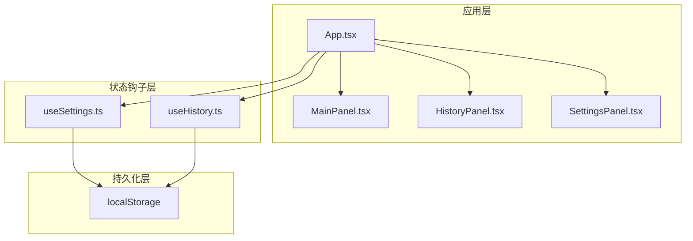
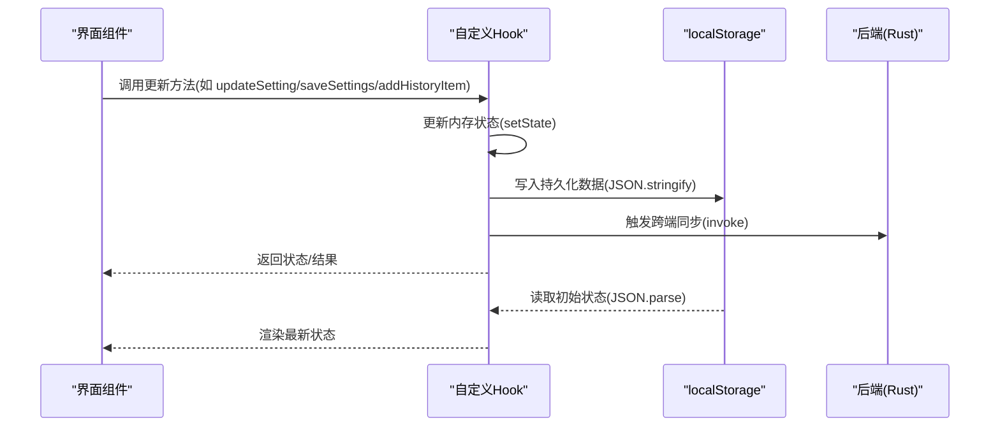
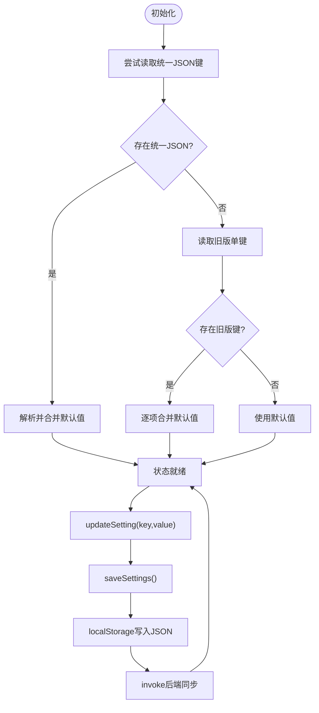
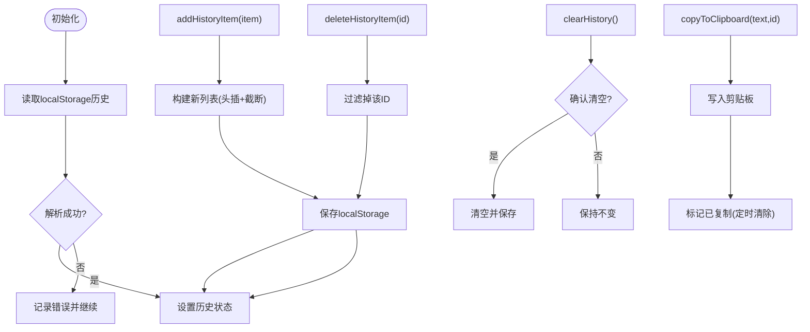
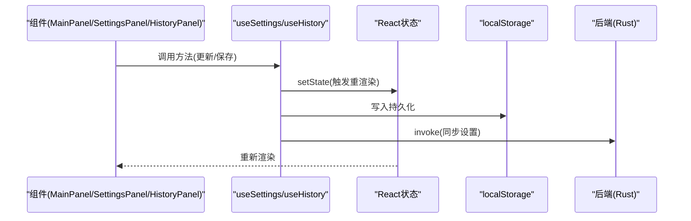
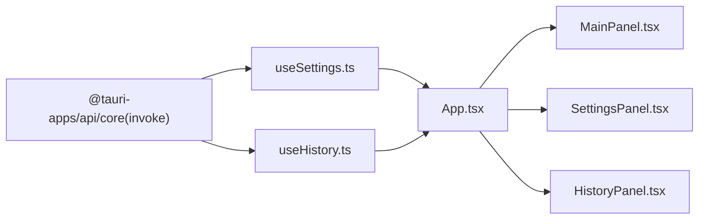

# 状态管理架构

<cite>
**本文引用的文件**
- [useSettings.ts](file://src/hooks/useSettings.ts)
- [useHistory.ts](file://src/hooks/useHistory.ts)
- [App.tsx](file://src/App.tsx)
- [MainPanel.tsx](file://src/components/MainPanel.tsx)
- [HistoryPanel.tsx](file://src/components/HistoryPanel.tsx)
- [SettingsPanel.tsx](file://src/components/SettingsPanel.tsx)
- [README.md](file://README.md)
</cite>

## 目录
1. [简介](#简介)
2. [项目结构](#项目结构)
3. [核心组件](#核心组件)
4. [架构总览](#架构总览)
5. [详细组件分析](#详细组件分析)
6. [依赖关系分析](#依赖关系分析)
7. [性能考量](#性能考量)
8. [故障排查指南](#故障排查指南)
9. [结论](#结论)
10. [附录](#附录)

## 简介
本文件面向 VoiceFlow_AI_002 的状态管理架构，重点解析以下方面：
- 应用的状态管理策略与自定义 Hook 设计模式
- useSettings Hook 的实现：设置数据的获取、更新、保存与同步机制
- useHistory Hook 的设计：历史记录的增删改查、本地存储与状态同步
- 状态持久化策略：localStorage 使用、数据序列化与版本兼容性
- 状态订阅与通知机制：状态变更监听与组件自动更新
- 最佳实践：性能优化、内存管理与错误处理
- 状态架构图与数据流向示意图

## 项目结构
项目采用基于功能模块的组织方式，状态管理集中在 hooks 目录，UI 组件位于 components 目录，入口应用位于 src 目录。整体结构清晰，职责分离明确。

图表来源
- [App.tsx:86-87](file://src/App.tsx#L86-L87)
- [useSettings.ts:36-96](file://src/hooks/useSettings.ts#L36-L96)
- [useHistory.ts:12-69](file://src/hooks/useHistory.ts#L12-L69)

章节来源
- [README.md:1-8](file://README.md#L1-L8)
- [App.tsx:24-28](file://src/App.tsx#L24-L28)

## 核心组件
本项目的核心状态管理由两个自定义 Hook 构成：
- useSettings：负责应用设置的读取、更新、保存与与后端同步
- useHistory：负责历史记录的读取、新增、删除、清空与复制操作

这两个 Hook 均通过 React 的 useState 和 useEffect 实现状态管理，并结合 localStorage 进行持久化。

章节来源
- [useSettings.ts:36-96](file://src/hooks/useSettings.ts#L36-L96)
- [useHistory.ts:12-69](file://src/hooks/useHistory.ts#L12-L69)

## 架构总览
应用状态管理采用“Hook + 本地存储”的轻量级架构。App.tsx 作为顶层容器，聚合 useSettings 与 useHistory 的状态与方法，向下传递给各个面板组件。组件内部通过 props 接收状态并在 UI 层呈现，同时通过 Hook 提供的方法对状态进行修改与持久化。

图表来源
- [useSettings.ts:75-88](file://src/hooks/useSettings.ts#L75-L88)
- [useHistory.ts:27-59](file://src/hooks/useHistory.ts#L27-L59)
- [App.tsx:86-87](file://src/App.tsx#L86-L87)

## 详细组件分析

### useSettings Hook 设计与实现
useSettings Hook 提供了完整的设置状态生命周期管理，包括：
- 初始化：优先从统一 JSON 键加载设置；若不存在则回退到旧版单键兼容
- 更新：类型安全的键值更新(updateSetting)
- 保存：统一保存到单一 JSON 键，并同步部分关键键到后端
- 同步：当触发键变化时，通过 invoke 与后端同步

图表来源
- [useSettings.ts:37-67](file://src/hooks/useSettings.ts#L37-L67)
- [useSettings.ts:71-83](file://src/hooks/useSettings.ts#L71-L83)
- [useSettings.ts:85-88](file://src/hooks/useSettings.ts#L85-L88)

章节来源
- [useSettings.ts:4-18](file://src/hooks/useSettings.ts#L4-L18)
- [useSettings.ts:20-34](file://src/hooks/useSettings.ts#L20-L34)
- [useSettings.ts:36-96](file://src/hooks/useSettings.ts#L36-L96)

### useHistory Hook 设计与实现
useHistory Hook 提供历史记录的完整 CRUD 操作，包括：
- 初始化：从 localStorage 加载历史记录
- 新增：限制列表长度为固定上限，自动截断
- 删除：按 ID 过滤
- 清空：确认对话框后清空
- 复制：复制文本到剪贴板并短暂标记已复制

图表来源
- [useHistory.ts:16-25](file://src/hooks/useHistory.ts#L16-L25)
- [useHistory.ts:31-37](file://src/hooks/useHistory.ts#L31-L37)
- [useHistory.ts:39-45](file://src/hooks/useHistory.ts#L39-L45)
- [useHistory.ts:47-52](file://src/hooks/useHistory.ts#L47-L52)
- [useHistory.ts:54-59](file://src/hooks/useHistory.ts#L54-L59)

章节来源
- [useHistory.ts:3-10](file://src/hooks/useHistory.ts#L3-L10)
- [useHistory.ts:12-69](file://src/hooks/useHistory.ts#L12-L69)

### 状态订阅与通知机制
- 组件自动更新：useSettings 与 useHistory 内部通过 useState 管理状态，任何状态变更都会触发组件重新渲染
- 跨端同步：useSettings 在设置变更时通过 invoke 与后端同步关键设置（如触发键）
- 事件监听：App.tsx 通过 listen 订阅后端事件，实现全局快捷键状态与指示窗口联动

图表来源
- [useSettings.ts:85-88](file://src/hooks/useSettings.ts#L85-L88)
- [App.tsx:257-286](file://src/App.tsx#L257-L286)

章节来源
- [App.tsx:86-87](file://src/App.tsx#L86-L87)
- [App.tsx:257-286](file://src/App.tsx#L257-L286)

### 数据持久化策略
- 存储介质：localStorage
- 序列化：统一使用 JSON.stringify/JSON.parse
- 版本兼容：优先读取统一 JSON 键，若不存在则回退到旧版单键集合，确保升级后的向后兼容
- 关键键同步：除统一 JSON 外，仍单独保存部分键以便后端兼容

章节来源
- [useSettings.ts:39-62](file://src/hooks/useSettings.ts#L39-L62)
- [useSettings.ts:75-83](file://src/hooks/useSettings.ts#L75-L83)
- [useHistory.ts:17-24](file://src/hooks/useHistory.ts#L17-L24)
- [useHistory.ts:27-29](file://src/hooks/useHistory.ts#L27-L29)

### 状态在应用中的使用
- App.tsx 通过 useSettings 与 useHistory 获取状态与方法，并将其注入到各面板组件
- MainPanel/SettingsPanel/HistoryPanel 分别消费对应的状态与动作，实现 UI 与逻辑解耦

章节来源
- [App.tsx:86-87](file://src/App.tsx#L86-L87)
- [MainPanel.tsx:19-32](file://src/components/MainPanel.tsx#L19-L32)
- [SettingsPanel.tsx:17-26](file://src/components/SettingsPanel.tsx#L17-L26)
- [HistoryPanel.tsx:14-20](file://src/components/HistoryPanel.tsx#L14-L20)

## 依赖关系分析
- useSettings 依赖 React 的 useState/ useEffect 与 @tauri-apps/api 的 invoke
- useHistory 依赖 React 的 useState/ useEffect
- App.tsx 依赖两个 Hook 并将状态与方法注入到面板组件
- 各面板组件依赖对应的 Hook 类型定义与方法签名

图表来源
- [useSettings.ts:1-2](file://src/hooks/useSettings.ts#L1-L2)
- [useHistory.ts:1](file://src/hooks/useHistory.ts#L1)
- [App.tsx:24-28](file://src/App.tsx#L24-L28)

章节来源
- [useSettings.ts:1-2](file://src/hooks/useSettings.ts#L1-L2)
- [useHistory.ts:1](file://src/hooks/useHistory.ts#L1)
- [App.tsx:24-28](file://src/App.tsx#L24-L28)

## 性能考量
- 状态粒度：将设置与历史记录拆分为独立 Hook，避免无关状态导致的重复渲染
- 本地存储写入：批量写入与节流（如保存状态的短暂提示）减少频繁 IO
- 列表截断：历史记录新增时限制长度，控制内存占用
- 异步操作：与后端同步使用异步调用，避免阻塞 UI
- 事件监听清理：组件卸载时及时移除监听，防止内存泄漏

章节来源
- [useHistory.ts:33-36](file://src/hooks/useHistory.ts#L33-L36)
- [useSettings.ts:85-88](file://src/hooks/useSettings.ts#L85-L88)
- [App.tsx:283-285](file://src/App.tsx#L283-L285)

## 故障排查指南
- 设置加载失败：检查统一 JSON 键是否存在；若不存在，确认旧版单键是否齐全
- 保存无效：确认 localStorage 是否可用；检查 saveSettings 是否被调用
- 后端不同步：检查 invoke 调用是否抛错；确认后端监听与处理逻辑
- 历史记录丢失：确认 localStorage 中的历史键是否存在；检查新增/删除逻辑
- 组件不更新：确认状态是否通过 setState 正确更新；检查父组件是否传入最新 props

章节来源
- [useSettings.ts:39-67](file://src/hooks/useSettings.ts#L39-L67)
- [useSettings.ts:75-83](file://src/hooks/useSettings.ts#L75-L83)
- [useHistory.ts:17-24](file://src/hooks/useHistory.ts#L17-L24)
- [useHistory.ts:27-59](file://src/hooks/useHistory.ts#L27-L59)

## 结论
VoiceFlow_AI_002 的状态管理采用简洁高效的 Hook + localStorage 架构，实现了设置与历史记录的完整生命周期管理。通过合理的数据持久化策略与跨端同步机制，保证了用户体验与数据一致性。建议在后续迭代中引入更细粒度的状态切分与缓存策略，进一步提升性能与可维护性。

## 附录
- 状态架构图与数据流向示意图见前文各图
- 代码片段路径参考各章节来源