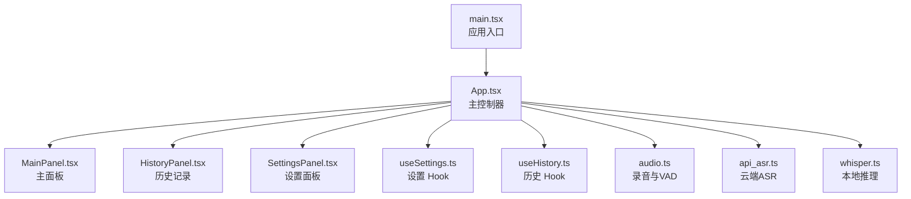
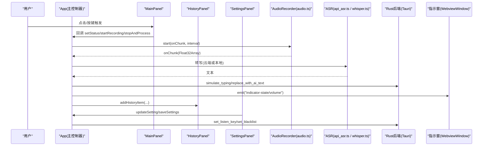
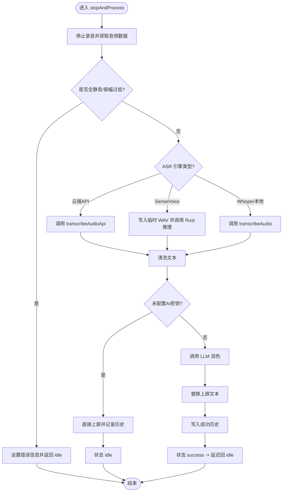
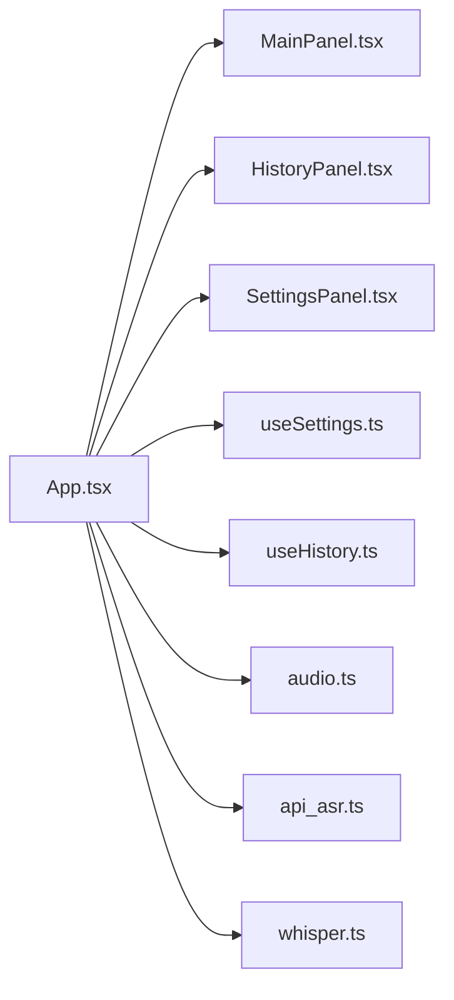

# 组件架构设计

<cite>
**本文引用的文件**
- [src/main.tsx](file://src/main.tsx)
- [src/App.tsx](file://src/App.tsx)
- [src/components/MainPanel.tsx](file://src/components/MainPanel.tsx)
- [src/components/HistoryPanel.tsx](file://src/components/HistoryPanel.tsx)
- [src/components/SettingsPanel.tsx](file://src/components/SettingsPanel.tsx)
- [src/hooks/useSettings.ts](file://src/hooks/useSettings.ts)
- [src/hooks/useHistory.ts](file://src/hooks/useHistory.ts)
- [src/utils/audio.ts](file://src/utils/audio.ts)
- [src/utils/api_asr.ts](file://src/utils/api_asr.ts)
- [src/utils/whisper.ts](file://src/utils/whisper.ts)
</cite>

## 目录
1. [简介](#简介)
2. [项目结构](#项目结构)
3. [核心组件](#核心组件)
4. [架构总览](#架构总览)
5. [详细组件分析](#详细组件分析)
6. [依赖关系分析](#依赖关系分析)
7. [性能与生命周期优化](#性能与生命周期优化)
8. [可复用性与扩展机制](#可复用性与扩展机制)
9. [故障排查指南](#故障排查指南)
10. [结论](#结论)

## 简介
本文件为 VoiceFlow_AI_002 的 React 前端组件架构设计文档。重点阐述主控制器 App、主面板 MainPanel、历史记录 HistoryPanel、设置面板 SettingsPanel 的职责划分与设计模式；说明组件间数据流与状态管理策略（Props 传递、自定义 Hooks）；解释组件生命周期管理与性能优化；并给出架构图与依赖图，展示交互模式与消息传递机制。

## 项目结构
前端采用“单入口 + 顶层状态集中 + 子面板受控渲染”的结构：
- main.tsx 作为应用入口，挂载根节点并渲染 App。
- App 作为主控制器，集中管理全局状态、设备初始化、快捷键监听、窗口联动、录音流程编排，并通过 Props 将状态与方法下传给三个子面板。
- 子面板 MainPanel、HistoryPanel、SettingsPanel 为无状态或弱状态展示层，通过 Props 接收数据与回调，保持高内聚低耦合。
- 业务逻辑下沉至自定义 Hooks：useSettings 负责配置持久化与后端同步；useHistory 负责历史记录的增删改查与剪贴板操作。
- 工具模块 audio.ts、api_asr.ts、whisper.ts 分别封装音频采集与处理、云端 ASR API 调用、本地 Whisper/SenseVoice 推理。

图表来源
- [src/main.tsx:1-10](file://src/main.tsx#L1-L10)
- [src/App.tsx:1-774](file://src/App.tsx#L1-L774)
- [src/components/MainPanel.tsx:1-127](file://src/components/MainPanel.tsx#L1-L127)
- [src/components/HistoryPanel.tsx:1-103](file://src/components/HistoryPanel.tsx#L1-L103)
- [src/components/SettingsPanel.tsx:1-344](file://src/components/SettingsPanel.tsx#L1-L344)
- [src/hooks/useSettings.ts:1-97](file://src/hooks/useSettings.ts#L1-L97)
- [src/hooks/useHistory.ts:1-70](file://src/hooks/useHistory.ts#L1-L70)
- [src/utils/audio.ts:1-221](file://src/utils/audio.ts#L1-L221)
- [src/utils/api_asr.ts:1-73](file://src/utils/api_asr.ts#L1-L73)
- [src/utils/whisper.ts:1-174](file://src/utils/whisper.ts#L1-L174)

章节来源
- [src/main.tsx:1-10](file://src/main.tsx#L1-L10)
- [src/App.tsx:1-774](file://src/App.tsx#L1-L774)

## 核心组件
- App（主控制器）
  - 职责：全局状态机（initializing/idle/recording/transcribing/rewriting/success/error）、模型初始化与下载进度、快捷键监听、浮空指示窗体显隐与定位、音量波形广播、录音流程编排（开始/取消/提交）、文本上屏与 AI 润色、日志劫持、自动启动开关等。
  - 数据流：集中持有状态，通过 Props 下发给子面板；通过 Tauri invoke/listen 与 Rust 后端通信；通过 WebviewWindow.emit 与独立小药丸窗口通信。
  - 生命周期：在 useEffect 中完成设备初始化、事件订阅、定时器清理；在卸载时恢复 console 钩子、释放资源。
- MainPanel（主面板）
  - 职责：根据 status 渲染加载态、就绪提示、错误提示、实时文本预览（原文与优化后文本）。
  - 交互：仅通过回调 setStatus/setErrorMessage/retry 触发父级行为，不持有业务状态。
- HistoryPanel（历史记录）
  - 职责：展示历史列表、统计累计字数与预估节省时间、复制结果、删除条目、清空全部。
  - 数据来源：由 App 注入 history 及操作方法。
- SettingsPanel（设置面板）
  - 职责：LLM 接口配置、ASR 引擎与语言选择、本地模型与硬件调度、快捷键与黑名单、开机自启、调试日志查看与保存。
  - 交互：updateSetting 即时更新本地状态，saveSettings 持久化到 localStorage，并触发后端同步（如 listenKey）。

章节来源
- [src/App.tsx:30-774](file://src/App.tsx#L30-L774)
- [src/components/MainPanel.tsx:1-127](file://src/components/MainPanel.tsx#L1-L127)
- [src/components/HistoryPanel.tsx:1-103](file://src/components/HistoryPanel.tsx#L1-L103)
- [src/components/SettingsPanel.tsx:1-344](file://src/components/SettingsPanel.tsx#L1-L344)

## 架构总览
整体采用“受控组件 + 集中式状态 + 自定义 Hook 抽象”的模式。App 作为唯一真相源，子面板只负责展示与用户交互，业务逻辑集中在 App 与 Hooks 中。跨进程通信通过 Tauri API 实现，跨窗口通信通过 WebviewWindow 的事件系统。

图表来源
- [src/App.tsx:373-640](file://src/App.tsx#L373-L640)
- [src/utils/audio.ts:12-73](file://src/utils/audio.ts#L12-L73)
- [src/utils/api_asr.ts:41-73](file://src/utils/api_asr.ts#L41-L73)
- [src/utils/whisper.ts:35-112](file://src/utils/whisper.ts#L35-L112)

## 详细组件分析

### App 主控制器
- 状态机与流程控制
  - 状态包括 initializing、idle、recording、transcribing、rewriting、success、error。
  - 关键方法：startRecording、cancelRecording、commitRecording、stopAndProcess。
  - stopAndProcess 内部顺序：停止录音 -> VAD 静音检测 -> 选择 ASR 路径（云端 API 或本地 Whisper/SenseVoice）-> 可选离线标点兜底 -> 上屏 -> 可选 AI 润色 -> 写入历史 -> 状态回 idle。
- 外部集成
  - Tauri：invoke("check_sensevoice_ready"/"download_sensevoice"/"transcribe_sensevoice"/"set_blacklist"/"simulate_typing"/"replace_with_ai_text"/"set_listen_key")，listen("download-progress"/"shortcut-state"/"pill-action")。
  - WebviewWindow：获取 indicator 窗口，emit("indicator-state"/"indicator-volume")，控制 show/hide 与物理位置。
  - 自动启动：@tauri-apps/plugin-autostart enable/disable/isEnabled。
- 生命周期与副作用
  - 初始化：创建 AudioRecorder、显示主窗口、动态加载本地模型或 SenseVoice。
  - 监听：快捷键状态、音量采样、取消/提交事件。
  - 清理：恢复 console 钩子、清除定时器、断开事件监听。
- 日志与调试
  - 劫持 console.log/warn/error，收集最近 100 条日志供设置页展示。

图表来源
- [src/App.tsx:462-640](file://src/App.tsx#L462-L640)
- [src/utils/api_asr.ts:41-73](file://src/utils/api_asr.ts#L41-L73)
- [src/utils/whisper.ts:121-174](file://src/utils/whisper.ts#L121-L174)

章节来源
- [src/App.tsx:30-774](file://src/App.tsx#L30-L774)

### MainPanel 主面板
- 输入属性
  - 状态与进度：status、modelProgress、downloadStep、whisperModel、asrEngine。
  - 交互回调：setStatus、setErrorMessage、retry。
  - 文本展示：rawText、refinedText。
- 渲染分支
  - 初始化阶段：显示进度条与下载步骤。
  - 空闲阶段：显示就绪提示与快捷键。
  - 错误阶段：显示错误信息与操作按钮（忽略并使用 API、重试下载）。
  - 文本预览：分块展示 ASR 原文与 AI 优化文本。
- 设计要点
  - 纯展示组件，所有状态与动作均由父级提供，便于测试与复用。

章节来源
- [src/components/MainPanel.tsx:1-127](file://src/components/MainPanel.tsx#L1-L127)

### HistoryPanel 历史记录
- 输入属性
  - 数据：history 数组。
  - 操作：deleteHistoryItem、clearHistory、copyToClipboard、copiedId。
- 功能特性
  - 统计卡片：累计生成字数、预估节省时间。
  - 列表项：时间戳、标签（已润色/未润色）、原始与优化文本对比、复制与删除操作。
  - 空状态：引导用户开始使用。
- 设计要点
  - 无副作用，完全受控于父级状态与回调。

章节来源
- [src/components/HistoryPanel.tsx:1-103](file://src/components/HistoryPanel.tsx#L1-L103)

### SettingsPanel 设置面板
- 输入属性
  - settings、updateSetting、saveSettings、saveStatus、logs、setLogs、autostartEnabled、toggleAutostart。
- 功能特性
  - 搜索与导航：支持关键字高亮与上下切换匹配项。
  - 分组配置：LLM 接口、听写与优化偏好、ASR 引擎与语言、本地模型与硬件调度、快捷键与黑名单、开机自启。
  - 开发调试：只读日志区与清空按钮。
- 设计要点
  - 表单驱动的状态更新，保存时落盘并反馈 saveStatus。

章节来源
- [src/components/SettingsPanel.tsx:1-344](file://src/components/SettingsPanel.tsx#L1-L344)

### 自定义 Hooks
- useSettings
  - 职责：读取/合并默认值与本地存储、增量更新、持久化、向后兼容旧键名、同步 listenKey 到后端。
  - 对外暴露：settings、updateSetting、saveSettings、saveStatus。
- useHistory
  - 职责：从 localStorage 加载历史、添加/删除/清空、复制到剪贴板并反馈 copiedId。
  - 对外暴露：history、addHistoryItem、deleteHistoryItem、clearHistory、copyToClipboard、copiedId。

章节来源
- [src/hooks/useSettings.ts:1-97](file://src/hooks/useSettings.ts#L1-L97)
- [src/hooks/useHistory.ts:1-70](file://src/hooks/useHistory.ts#L1-L70)

### 工具模块
- audio.ts
  - AudioRecorder：基于 MediaDevices + AudioWorklet 采集音频，支持分片回调（伪流式），内置 VAD 静音切除与 RMS 计算，导出 AnalyserNode 用于可视化。
  - float32ToWav：将 Float32Array 转换为 16-bit PCM WAV 字节数组。
- api_asr.ts
  - transcribeAudioApi：将 Float32Array 编码为 WAV Blob，按 OpenAI 兼容格式 POST 到指定 URL，返回 text。
- whisper.ts
  - initWhisper：优先尝试 WebGPU，失败自动降级 WASM；支持进度回调与闲置内存回收。
  - transcribeAudio：封装推理参数与上下文 prompt，捕获 WebGPU 执行期崩溃并自动重试 WASM。

章节来源
- [src/utils/audio.ts:1-221](file://src/utils/audio.ts#L1-L221)
- [src/utils/api_asr.ts:1-73](file://src/utils/api_asr.ts#L1-L73)
- [src/utils/whisper.ts:1-174](file://src/utils/whisper.ts#L1-L174)

## 依赖关系分析
- 组件依赖
  - App 依赖三个子面板与两个自定义 Hooks，以及音频、ASR、本地推理工具模块。
  - 子面板之间无直接依赖，均通过 App 进行松耦合通信。
- 外部依赖
  - Tauri：窗口管理、事件总线、文件系统、自动启动插件。
  - Transformers.js：本地语音识别模型加载与推理。
  - 浏览器 API：MediaDevices、AudioContext、WebviewWindow（Tauri WebView）。

图表来源
- [src/App.tsx:1-774](file://src/App.tsx#L1-L774)
- [src/components/MainPanel.tsx:1-127](file://src/components/MainPanel.tsx#L1-L127)
- [src/components/HistoryPanel.tsx:1-103](file://src/components/HistoryPanel.tsx#L1-L103)
- [src/components/SettingsPanel.tsx:1-344](file://src/components/SettingsPanel.tsx#L1-L344)
- [src/hooks/useSettings.ts:1-97](file://src/hooks/useSettings.ts#L1-L97)
- [src/hooks/useHistory.ts:1-70](file://src/hooks/useHistory.ts#L1-L70)
- [src/utils/audio.ts:1-221](file://src/utils/audio.ts#L1-L221)
- [src/utils/api_asr.ts:1-73](file://src/utils/api_asr.ts#L1-L73)
- [src/utils/whisper.ts:1-174](file://src/utils/whisper.ts#L1-L174)

## 性能与生命周期优化
- 组件粒度与渲染
  - 子面板为纯展示组件，避免不必要的重渲染；App 通过精确的 state 拆分减少无关更新。
- 音频与推理
  - AudioRecorder 使用分片回调与 VAD 静音切除，降低无效数据处理与网络请求。
  - Whisper 初始化缓存与闲置自动释放，避免长时间占用 GPU/CPU 资源；WebGPU 失败自动降级 WASM，提升稳定性。
- 事件与定时器
  - 音量采样每 50ms 轮询，仅在 recording 状态下运行，并在退出时清理。
  - 模型下载进度监听在完成后立即解绑，防止内存泄漏。
- 生命周期管理
  - 所有副作用均在 useEffect 中注册，并在清理函数中恢复 console 钩子、断开事件监听、关闭音频上下文与媒体流。

[本节为通用性能建议，不直接分析具体代码文件]

## 可复用性与扩展机制
- 组件复用
  - MainPanel/HistoryPanel/SettingsPanel 均为受控组件，可通过 props 组合复用，适合嵌入到其他页面或弹窗。
- 扩展点
  - ASR 引擎：当前支持云端 API 与本地 Whisper/SenseVoice，新增引擎可在 App 的 stopAndProcess 分支中添加新路径，并在设置页增加对应 UI。
  - LLM 润色：通过 refineText 接口接入不同厂商或模型，只需调整 SettingsPanel 中的接口配置。
  - 快捷键与黑名单：通过 Tauri 后端同步，前端仅需维护 listenKey 与 blacklistStr 字段。
- 状态管理策略
  - 未使用 Context API，采用 Props 向下传递与回调向上冒泡，保证数据流向清晰、易于追踪。
  - 自定义 Hooks 封装持久化与后端同步细节，提高复用性。

[本节为概念性内容，不直接分析具体代码文件]

## 故障排查指南
- 常见问题定位
  - 麦克风无法启动：检查权限与浏览器策略，确认 AudioContext 未被挂起。
  - 识别结果为空：VAD 判定全静音或最大振幅过低，需靠近麦克风或提高音量。
  - 本地模型加载失败：优先 WebGPU，失败自动降级 WASM；若仍失败，检查驱动与兼容性。
  - 云端 API 失败：校验 baseUrl、apiKey、model 是否正确，注意 URL 末尾路径拼接。
  - 快捷键无响应：确认黑名单未包含当前焦点程序，且快捷键已同步到后端。
- 调试手段
  - 使用设置页的调试日志区查看最近 100 条日志。
  - 观察指示窗体的状态与音量波形，辅助判断录音与传输链路是否正常。

章节来源
- [src/components/SettingsPanel.tsx:293-326](file://src/components/SettingsPanel.tsx#L293-L326)
- [src/App.tsx:34-69](file://src/App.tsx#L34-L69)

## 结论
本项目以 App 为核心控制器，结合受控子面板与自定义 Hooks，实现了清晰的单向数据流与稳定的跨进程通信。通过模块化音频采集、云端与本地双通道 ASR、以及灵活的 LLM 润色能力，提供了高性能与可扩展的桌面端智能听写体验。建议在后续迭代中继续遵循“状态集中、展示分离、Hook 抽象”的原则，逐步引入更细粒度的组件拆分与单元测试，以提升可维护性与健壮性。