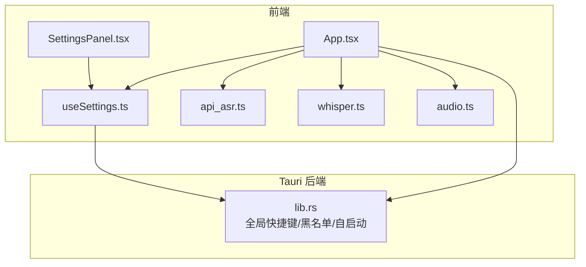
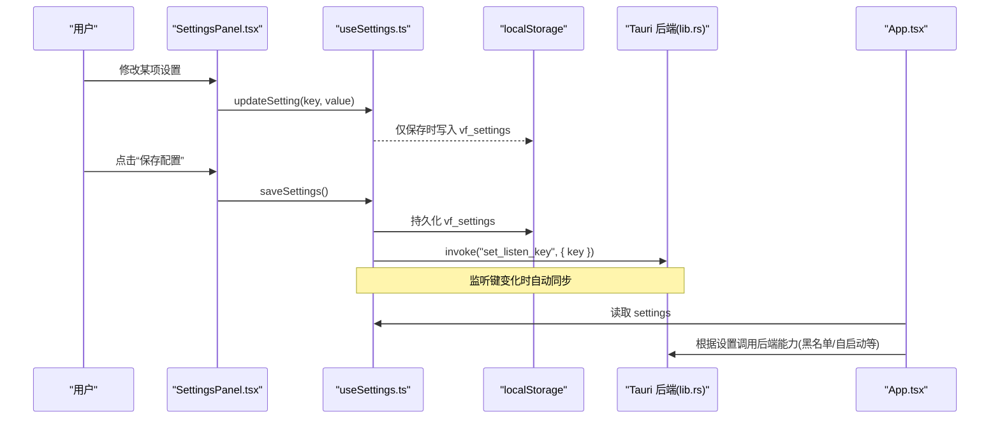
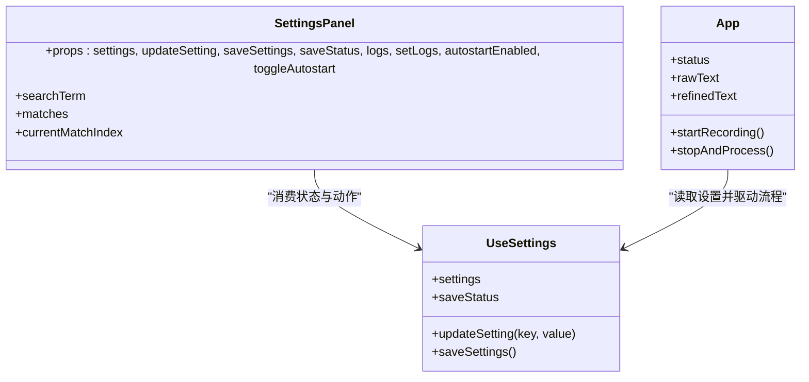
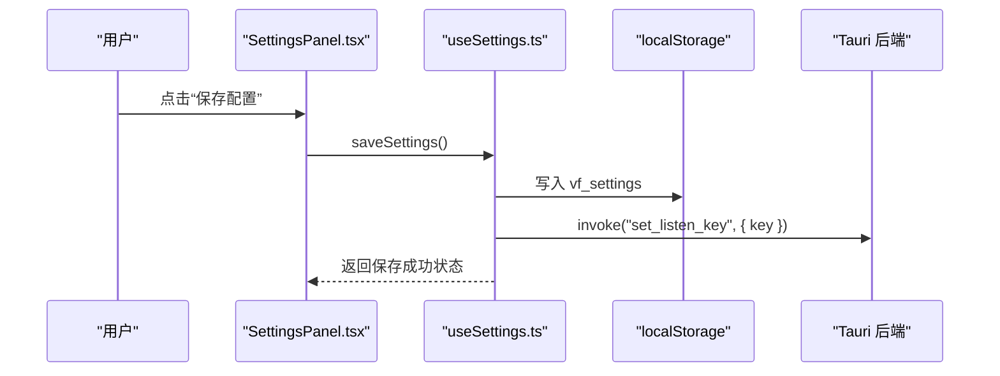
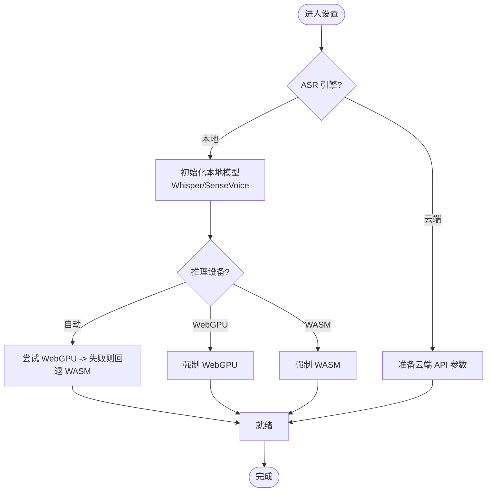
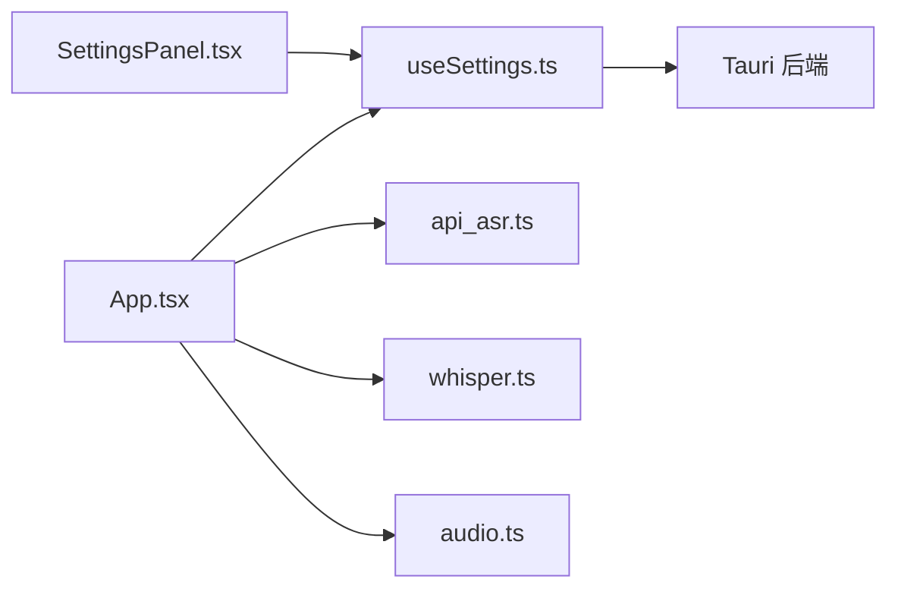

# 设置面板组件

<cite>
**本文引用的文件**
- [SettingsPanel.tsx](file://src/components/SettingsPanel.tsx)
- [SettingsPanel.css](file://src/components/SettingsPanel.css)
- [useSettings.ts](file://src/hooks/useSettings.ts)
- [App.tsx](file://src/App.tsx)
- [api_asr.ts](file://src/utils/api_asr.ts)
- [whisper.ts](file://src/utils/whisper.ts)
- [audio.ts](file://src/utils/audio.ts)
</cite>

## 目录
1. [简介](#简介)
2. [项目结构](#项目结构)
3. [核心组件](#核心组件)
4. [架构总览](#架构总览)
5. [详细组件分析](#详细组件分析)
6. [依赖关系分析](#依赖关系分析)
7. [性能与体验优化](#性能与体验优化)
8. [故障排查指南](#故障排查指南)
9. [结论](#结论)
10. [附录：配置项数据模型与默认值](#附录配置项数据模型与默认值)

## 简介
本文件为 VoiceFlow_AI_002 的设置面板组件提供系统化文档，聚焦于 SettingsPanel.tsx 作为应用配置管理界面的设计与实现。内容涵盖：
- 设置项分类与组织（LLM 接口、ASR 引擎、AI 参数、系统集成等）
- 配置验证与保存机制（表单交互、持久化、后端同步）
- 动态配置更新（热重载、实时预览、回滚策略）
- 用户界面设计（搜索导航、分组布局、帮助信息、快捷操作）
- 配置项的数据模型与默认值说明

## 项目结构
设置面板位于前端 React 层，通过 hooks 管理状态并与 Tauri 后端进行系统级集成。关键文件职责如下：
- SettingsPanel.tsx：设置面板 UI 与搜索高亮、导航逻辑
- useSettings.ts：统一配置状态、默认值、持久化与后端同步
- App.tsx：将设置注入到主流程，监听快捷键并驱动 ASR/LLM 工作流
- api_asr.ts / whisper.ts / audio.ts：ASR 本地与云端实现、音频采集与处理

图表来源
- [SettingsPanel.tsx:1-344](file://src/components/SettingsPanel.tsx#L1-L344)
- [useSettings.ts:1-97](file://src/hooks/useSettings.ts#L1-L97)
- [App.tsx:1-774](file://src/App.tsx#L1-L774)
- [api_asr.ts:1-73](file://src/utils/api_asr.ts#L1-L73)
- [whisper.ts:1-174](file://src/utils/whisper.ts#L1-L174)
- [audio.ts:1-221](file://src/utils/audio.ts#L1-L221)

章节来源
- [SettingsPanel.tsx:1-344](file://src/components/SettingsPanel.tsx#L1-L344)
- [useSettings.ts:1-97](file://src/hooks/useSettings.ts#L1-L97)
- [App.tsx:1-774](file://src/App.tsx#L1-L774)

## 核心组件
- SettingsPanel：负责展示所有设置项、支持搜索定位与高亮、提供保存按钮与日志查看区。
- useSettings：集中管理配置状态、合并默认值、持久化到 localStorage、监听变化并同步至 Rust 后端。
- App：消费设置，驱动录音、转写、AI 润色流程；在设置变更时触发相应初始化或行为切换。

章节来源
- [SettingsPanel.tsx:1-344](file://src/components/SettingsPanel.tsx#L1-L344)
- [useSettings.ts:1-97](file://src/hooks/useSettings.ts#L1-L97)
- [App.tsx:1-774](file://src/App.tsx#L1-L774)

## 架构总览
设置面板通过受控表单驱动 useSettings 的状态更新，保存时将配置写入浏览器存储，同时部分设置会即时同步到 Tauri 后端以生效系统级能力（如全局快捷键、黑名单）。ASR 与 LLM 的运行时行为由 App 根据当前设置动态选择。

图表来源
- [SettingsPanel.tsx:1-344](file://src/components/SettingsPanel.tsx#L1-L344)
- [useSettings.ts:1-97](file://src/hooks/useSettings.ts#L1-L97)
- [App.tsx:1-774](file://src/App.tsx#L1-L774)

## 详细组件分析

### 设置项分类与组织
- 大语言模型接口（LLM Config）
  - API Key、Base URL、Model Name
  - 用途：控制 AI 润色阶段的后端请求目标与鉴权
- 听写与优化偏好
  - AI 优化风格（自然/商务/精简/学术）
  - 语音识别语言（多语言/自动检测）
  - 语音识别引擎（本地离线 vs 云端 API）
  - 本地模型选择（SenseVoice Small、Whisper tiny/base/small/medium）
  - 推理设备调度（自动/WebGPU/WASM）
  - 触发快捷键（左/右 Ctrl、Alt、CapsLock）
  - 全局防误触黑名单（按进程名过滤）
  - 开机自启开关（Tauri Autostart）
- 开发调试日志
  - 只读日志区，支持清空

章节来源
- [SettingsPanel.tsx:115-344](file://src/components/SettingsPanel.tsx#L115-L344)
- [useSettings.ts:20-34](file://src/hooks/useSettings.ts#L20-L34)

### 配置验证与保存机制
- 表单验证规则
  - 无显式正则校验，采用占位符提示与下拉选项约束输入范围
  - 对敏感字段使用密码输入框（API Key）
- 配置同步与持久化
  - 保存时写入 localStorage 的 vf_settings 键
  - 兼容旧版单键存储（vf_api_key、vf_base_url 等），首次加载自动迁移合并
  - 监听 listenKey 变化，自动调用后端 set_listen_key 同步全局快捷键
- 保存反馈
  - 保存后显示“已保存”状态，2 秒后恢复空闲态

章节来源
- [useSettings.ts:36-97](file://src/hooks/useSettings.ts#L36-L97)
- [SettingsPanel.tsx:328-344](file://src/components/SettingsPanel.tsx#L328-L344)

### 动态配置更新（热重载、实时预览、回滚）
- 热重载
  - 当 ASR 引擎或模型/设备发生变化时，App 侧 useEffect 会重新初始化对应引擎（本地 Whisper/SenseVoice 或云端 API）
  - 重启流程包含进度回调与错误兜底
- 实时预览
  - 设置项即时反映到 UI（受控组件）
  - 黑名单与快捷键变更即时同步至后端，无需保存即可生效
- 配置回滚
  - 未保存前可通过撤销输入恢复
  - 保存后如需回滚，需手动改回并再次保存

章节来源
- [App.tsx:185-221](file://src/App.tsx#L185-L221)
- [useSettings.ts:85-88](file://src/hooks/useSettings.ts#L85-L88)

### 用户界面设计
- 搜索与导航
  - 顶部搜索栏支持关键词匹配，高亮匹配项并支持上下翻页定位
  - 匹配范围包括输入项与分组标题
- 分组布局
  - 使用卡片式分组，标题分隔，辅助说明文本提升可理解性
- 帮助信息与快捷操作
  - 每个重要选项配有 tip 说明
  - 日志区一键清空，便于问题定位

章节来源
- [SettingsPanel.tsx:27-112](file://src/components/SettingsPanel.tsx#L27-L112)
- [SettingsPanel.css:96-170](file://src/components/SettingsPanel.css#L96-L170)

### 类图（组件与 Hook 关系）

图表来源
- [SettingsPanel.tsx:1-344](file://src/components/SettingsPanel.tsx#L1-L344)
- [useSettings.ts:1-97](file://src/hooks/useSettings.ts#L1-L97)
- [App.tsx:1-774](file://src/App.tsx#L1-L774)

### 序列图（保存配置与后端同步）

图表来源
- [SettingsPanel.tsx:328-344](file://src/components/SettingsPanel.tsx#L328-L344)
- [useSettings.ts:75-88](file://src/hooks/useSettings.ts#L75-L88)

### 流程图（ASR 引擎选择与初始化）

图表来源
- [App.tsx:185-221](file://src/App.tsx#L185-L221)
- [whisper.ts:35-112](file://src/utils/whisper.ts#L35-L112)

## 依赖关系分析
- 组件耦合
  - SettingsPanel 仅依赖 useSettings 提供的状态与函数，保持低耦合
  - App 聚合 useSettings 并协调 ASR/LLM 工具模块
- 外部依赖
  - Tauri 插件：autostart、fs、opener
  - HuggingFace Transformers.js：本地 Whisper 推理
  - 浏览器媒体 API：麦克风采集与分片
- 潜在循环依赖
  - 未发现直接循环引用；useSettings 不反向依赖 UI 组件

图表来源
- [SettingsPanel.tsx:1-344](file://src/components/SettingsPanel.tsx#L1-L344)
- [useSettings.ts:1-97](file://src/hooks/useSettings.ts#L1-L97)
- [App.tsx:1-774](file://src/App.tsx#L1-L774)
- [api_asr.ts:1-73](file://src/utils/api_asr.ts#L1-L73)
- [whisper.ts:1-174](file://src/utils/whisper.ts#L1-L174)
- [audio.ts:1-221](file://src/utils/audio.ts#L1-L221)

章节来源
- [App.tsx:1-774](file://src/App.tsx#L1-L774)
- [useSettings.ts:1-97](file://src/hooks/useSettings.ts#L1-L97)

## 性能与体验优化
- 本地模型内存回收
  - 长时间闲置后自动释放 Whisper 管道，降低内存占用
- 设备自适应
  - 自动优先 WebGPU，失败回退 WASM，提高兼容性
- 流式上屏
  - 云端 API 模式下按固定间隔发送音频片段，边说边出字
- 静音切除
  - 录音结束后基于 RMS 阈值裁剪首尾静音，减少无效推理

章节来源
- [whisper.ts:23-33](file://src/utils/whisper.ts#L23-L33)
- [whisper.ts:71-109](file://src/utils/whisper.ts#L71-L109)
- [audio.ts:87-107](file://src/utils/audio.ts#L87-L107)
- [audio.ts:132-173](file://src/utils/audio.ts#L132-L173)

## 故障排查指南
- 无法启动麦克风
  - 检查浏览器权限与设备可用性
  - 确认 AudioContext 未被挂起
- 本地模型加载失败
  - 观察下载进度与步骤提示
  - 若 WebGPU 崩溃，自动回退 WASM；必要时手动选择强制 WASM
- 云端 API 报错
  - 校验 Base URL、API Key、Model 名称
  - 检查网络连通性与服务端响应码
- 快捷键不生效
  - 确认黑名单中不包含当前前台进程
  - 检查是否已在后端成功同步 listenKey

章节来源
- [App.tsx:374-435](file://src/App.tsx#L374-L435)
- [App.tsx:185-221](file://src/App.tsx#L185-L221)
- [api_asr.ts:41-72](file://src/utils/api_asr.ts#L41-L72)
- [useSettings.ts:85-88](file://src/hooks/useSettings.ts#L85-L88)

## 结论
设置面板以清晰的分组与搜索导航提升了配置效率；useSettings 提供了统一的配置生命周期管理与后端同步；App 根据设置动态调整 ASR/LLM 运行路径，兼顾性能与兼容性。整体设计实现了“即改即用、按需持久化、可观测可回滚”的配置体验。

## 附录：配置项数据模型与默认值
- 数据模型（关键字段）
  - apiKey、baseUrl、modelName：LLM 接口凭据与路由
  - promptStyle：AI 润色风格
  - listenKey：全局快捷键
  - asrLanguage：识别语言
  - whisperModel：本地模型标识
  - inferenceDevice：推理设备策略
  - asrEngine：local | api
  - asrApiUrl、asrApiKey、asrApiModel：云端 ASR 参数
  - blacklistStr：黑名单进程列表（逗号/换行分隔）
- 默认值要点
  - baseUrl 指向 DeepSeek 官方 v1 接口
  - modelName 默认 deepseek-chat
  - promptStyle 默认 natural
  - listenKey 默认 RControl
  - asrLanguage 默认 chinese
  - whisperModel 默认 Xenova/whisper-tiny
  - inferenceDevice 默认 auto
  - asrEngine 默认 local
  - asrApiUrl 默认 Groq 的 OpenAI 兼容转录端点
  - asrApiModel 默认 whisper-large-v3
  - blacklistStr 预置若干常见游戏进程名

章节来源
- [useSettings.ts:4-34](file://src/hooks/useSettings.ts#L4-L34)