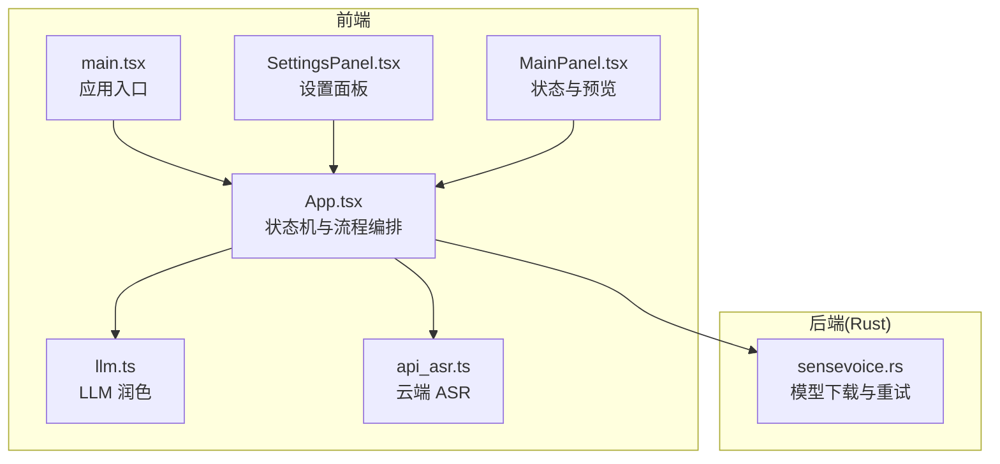
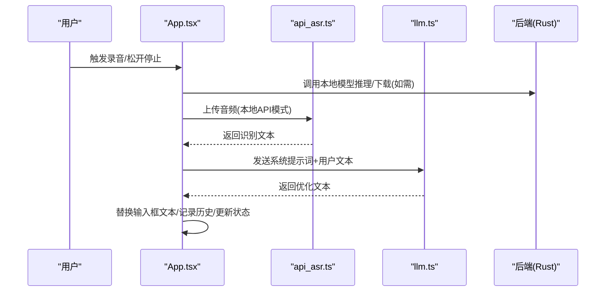
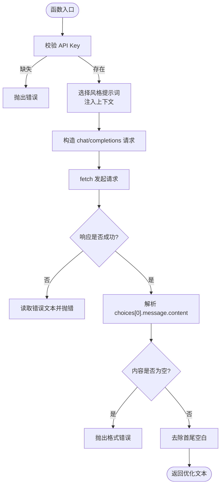
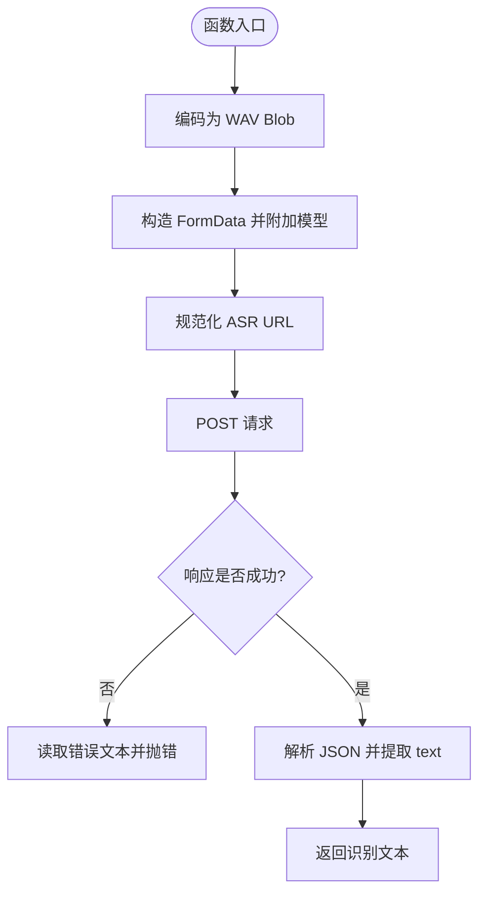
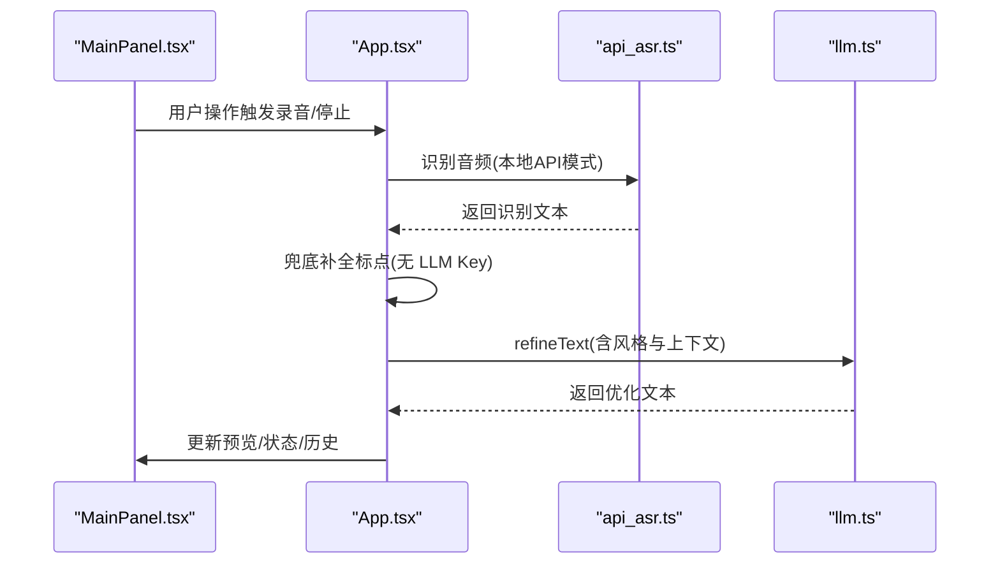
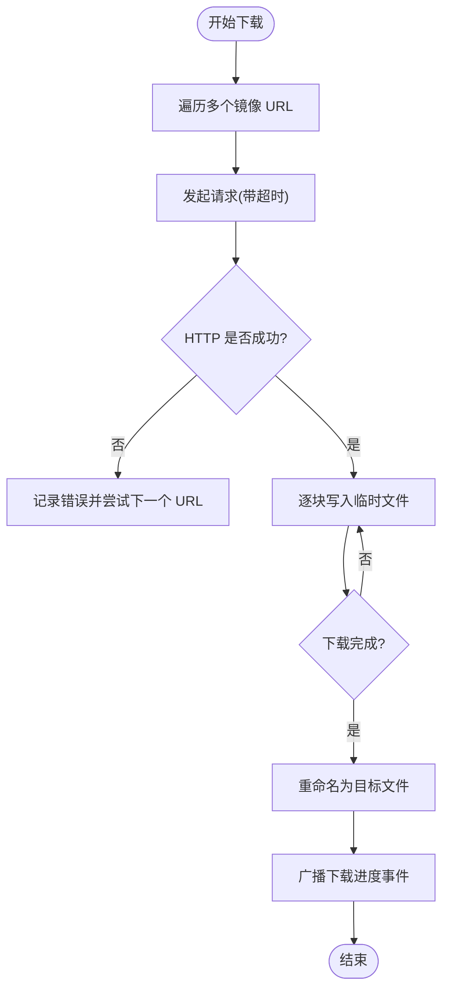
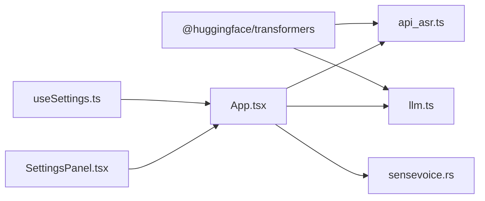

# AI 文本润色

<cite>
**本文引用的文件**
- [README.md](file://README.md)
- [package.json](file://package.json)
- [src/main.tsx](file://src/main.tsx)
- [src/App.tsx](file://src/App.tsx)
- [src/utils/llm.ts](file://src/utils/llm.ts)
- [src/utils/api_asr.ts](file://src/utils/api_asr.ts)
- [src/components/SettingsPanel.tsx](file://src/components/SettingsPanel.tsx)
- [src/hooks/useSettings.ts](file://src/hooks/useSettings.ts)
- [src/components/MainPanel.tsx](file://src/components/MainPanel.tsx)
- [src-tauri/src/sensevoice.rs](file://src-tauri/src/sensevoice.rs)
</cite>

## 目录
1. [简介](#简介)
2. [项目结构](#项目结构)
3. [核心组件](#核心组件)
4. [架构总览](#架构总览)
5. [详细组件分析](#详细组件分析)
6. [依赖关系分析](#依赖关系分析)
7. [性能考量](#性能考量)
8. [故障排查指南](#故障排查指南)
9. [结论](#结论)
10. [附录](#附录)

## 简介
本文件面向 VoiceFlow_AI_002 的 AI 文本润色能力，系统性阐述大语言模型（LLM）集成架构、API 调用封装、错误处理策略与重试机制，以及从原始语音到优化文本的完整处理链路。文档同时覆盖润色风格、提示词模板、上下文感知与格式保持等特性，并提供针对初学者的 LLM API 使用指南与面向高级开发者的插件化扩展与性能优化建议。

## 项目结构
项目采用前端 React + Tauri 的桌面应用架构，核心润色逻辑位于前端 TypeScript 模块，ASR 与模型下载由 Rust 后端协同支撑。关键模块分布如下：
- 前端入口与应用控制流：src/main.tsx、src/App.tsx
- LLM 润色与提示词：src/utils/llm.ts
- 云端 ASR API 封装：src/utils/api_asr.ts
- 设置与偏好：src/components/SettingsPanel.tsx、src/hooks/useSettings.ts
- 运行时状态与 UI 展示：src/components/MainPanel.tsx
- 本地模型下载与重试：src-tauri/src/sensevoice.rs

**图表来源**
- [src/main.tsx:1-10](file://src/main.tsx#L1-L10)
- [src/App.tsx:1-774](file://src/App.tsx#L1-L774)
- [src/utils/llm.ts:1-65](file://src/utils/llm.ts#L1-L65)
- [src/utils/api_asr.ts:1-73](file://src/utils/api_asr.ts#L1-L73)
- [src/components/SettingsPanel.tsx:1-344](file://src/components/SettingsPanel.tsx#L1-L344)
- [src/components/MainPanel.tsx:1-127](file://src/components/MainPanel.tsx#L1-L127)
- [src-tauri/src/sensevoice.rs:65-136](file://src-tauri/src/sensevoice.rs#L65-L136)

**章节来源**
- [README.md:1-8](file://README.md#L1-L8)
- [package.json:1-32](file://package.json#L1-L32)

## 核心组件
- LLM 润色模块（llm.ts）
  - 定义 LLMConfig 接口，封装系统提示词与风格模板，支持上下文注入（聊天/办公/编程场景）。
  - 通过统一 Base URL 构造 chat/completions 请求，设置温度与最大 token，解析 choices[0].message.content 返回优化文本。
- 云端 ASR API 封装（api_asr.ts）
  - 将 Float32Array 音频编码为 WAV，构造 multipart/form-data，向兼容 OpenAI 格式的 ASR 接口发起 POST 请求。
  - 自动补齐 URL 路径，标准化错误消息。
- 设置与偏好（SettingsPanel.tsx、useSettings.ts）
  - 提供 LLM API Key、Base URL、模型名、润色风格、ASR 引擎选择、API 参数、本地模型与设备选择、全局黑名单等配置。
  - 默认值与本地持久化，支持一键保存与状态反馈。
- 应用主流程（App.tsx）
  - 管理录音、ASR、LLM 润色、历史记录与 UI 状态机，支持离线兜底（无 LLM Key 时自动补全句末标点）。
- 本地模型下载与重试（sensevoice.rs）
  - 基于 reqwest 的多 URL 尝试下载，带超时与断点续传式临时文件，逐块写入并广播进度事件。

**章节来源**
- [src/utils/llm.ts:1-65](file://src/utils/llm.ts#L1-L65)
- [src/utils/api_asr.ts:1-73](file://src/utils/api_asr.ts#L1-L73)
- [src/components/SettingsPanel.tsx:115-160](file://src/components/SettingsPanel.tsx#L115-L160)
- [src/hooks/useSettings.ts:1-97](file://src/hooks/useSettings.ts#L1-L97)
- [src/App.tsx:562-640](file://src/App.tsx#L562-L640)
- [src-tauri/src/sensevoice.rs:65-136](file://src-tauri/src/sensevoice.rs#L65-L136)

## 架构总览
AI 文本润色的整体架构分为三层：
- 输入层：麦克风采集 → 录音数据 → 本地/云端 ASR → 识别文本
- 处理层：上下文感知与风格注入 → LLM chat/completions → 优化文本
- 输出层：替换原输入框文本 → 历史记录 → UI 状态反馈

**图表来源**
- [src/App.tsx:374-640](file://src/App.tsx#L374-L640)
- [src/utils/api_asr.ts:41-72](file://src/utils/api_asr.ts#L41-L72)
- [src/utils/llm.ts:16-64](file://src/utils/llm.ts#L16-L64)
- [src-tauri/src/sensevoice.rs:65-136](file://src-tauri/src/sensevoice.rs#L65-L136)

## 详细组件分析

### LLM 润色组件分析（llm.ts）
- 数据结构与复杂度
  - LLMConfig：包含 apiKey、baseUrl、model、promptStyle、appName，时间复杂度 O(1)。
  - STYLE_PROMPTS：固定映射表，查找 O(1)。
- 处理逻辑与错误处理
  - 校验 apiKey 存在性，否则抛出明确错误。
  - 根据 promptStyle 选择系统提示词，必要时注入上下文（聊天/办公/编程）。
  - 构造 chat/completions 请求，设置 temperature 与 max_tokens，解析返回内容，校验非空。
  - 对非 2xx 响应读取文本并抛出错误，便于上层捕获与提示。
- 性能与可扩展性
  - 温度与 token 限制有助于稳定输出与控制成本。
  - 可通过新增 STYLE_PROMPTS 键值扩展风格；上下文注入可按 appName 增加规则。

**图表来源**
- [src/utils/llm.ts:16-64](file://src/utils/llm.ts#L16-L64)

**章节来源**
- [src/utils/llm.ts:1-65](file://src/utils/llm.ts#L1-L65)

### 云端 ASR 组件分析（api_asr.ts）
- 数据结构与复杂度
  - AsrApiConfig：包含 apiUrl、apiKey、model，O(1)。
- 处理逻辑与错误处理
  - 将 Float32Array 编码为 WAV Blob，构造 FormData 并追加 model 字段。
  - 规范化 URL，确保路径以 /v1/audio/transcriptions 结尾（兼容不同提供商）。
  - 对非 2xx 响应读取文本并抛出错误，便于上层统一处理。
- 性能与可扩展性
  - 支持任意兼容 OpenAI 格式的 ASR 接口，便于切换提供商。
  - 可扩展为流式上传或分片传输以适配更大音频。

**图表来源**
- [src/utils/api_asr.ts:41-72](file://src/utils/api_asr.ts#L41-L72)

**章节来源**
- [src/utils/api_asr.ts:1-73](file://src/utils/api_asr.ts#L1-L73)

### 设置与偏好组件分析（SettingsPanel.tsx、useSettings.ts）
- 配置项与默认值
  - LLM：apiKey、baseUrl、modelName
  - 润色风格：natural、formal、concise、academic
  - ASR：asrEngine（local/api）、whisperModel、inferenceDevice、language
  - API 模式参数：asrApiUrl、asrApiKey、asrApiModel
  - 黑名单：blacklistStr
- 生命周期与持久化
  - 首次加载合并默认值与旧版键值，支持一键保存到 localStorage。
  - 监听 listenKey 变化同步至后端（兼容遗留需求）。
- UI 行为
  - API 模式下显示 ASR 专用配置组；本地模式显示模型与设备选择及硬件推荐说明。

**章节来源**
- [src/components/SettingsPanel.tsx:115-245](file://src/components/SettingsPanel.tsx#L115-L245)
- [src/hooks/useSettings.ts:20-97](file://src/hooks/useSettings.ts#L20-L97)

### 应用主流程与状态机（App.tsx）
- 状态机
  - initializing/idle/recording/transcribing/rewriting/success/error
- 关键流程
  - 录音 → 本地/云端 ASR → 识别文本 → 无 LLM Key 时兜底补全标点 → 有 LLM Key 时调用 refineText → 替换输入框文本 → 记录历史 → 更新状态
- 上下文感知
  - 通过 appName 注入系统提示词，区分聊天/办公/编程场景，增强润色针对性。
- 错误处理
  - 识别与润色分别捕获异常，保留原文并提示“网络异常，AI 润色未成功，已为您保留识别原文”。

**图表来源**
- [src/App.tsx:374-640](file://src/App.tsx#L374-L640)
- [src/utils/api_asr.ts:41-72](file://src/utils/api_asr.ts#L41-L72)
- [src/utils/llm.ts:16-64](file://src/utils/llm.ts#L16-L64)
- [src/components/MainPanel.tsx:103-121](file://src/components/MainPanel.tsx#L103-L121)

**章节来源**
- [src/App.tsx:562-640](file://src/App.tsx#L562-L640)
- [src/components/MainPanel.tsx:1-127](file://src/components/MainPanel.tsx#L1-L127)

### 本地模型下载与重试（sensevoice.rs）
- 重试机制
  - 多 URL 循环尝试，最多 12 次重试；每次失败记录最后错误原因。
  - 断点续传式临时文件写入，逐块消费流式响应，实时计算下载进度。
- 超时与稳定性
  - 客户端超时设为 120 秒，避免长时间阻塞。
- 事件广播
  - 下载进度通过事件通道广播，前端可显示下载步骤与百分比。

**图表来源**
- [src-tauri/src/sensevoice.rs:65-136](file://src-tauri/src/sensevoice.rs#L65-L136)

**章节来源**
- [src-tauri/src/sensevoice.rs:65-136](file://src-tauri/src/sensevoice.rs#L65-L136)

## 依赖关系分析
- 前端依赖
  - @huggingface/transformers：用于本地 Whisper 推理（在 Rust 后端中实际使用 SenseVoice）。
  - @tauri-apps/*：系统集成、文件系统、自动启动、Webview 窗口等。
- 模块耦合
  - App.tsx 依赖 llm.ts 与 api_asr.ts，负责编排与错误处理。
  - SettingsPanel.tsx 与 useSettings.ts 提供配置输入与持久化，影响 LLM 与 ASR 的行为。
  - sensevoice.rs 与 App.tsx 通过 Tauri 桥接通信，实现模型下载与进度反馈。

**图表来源**
- [package.json:13-22](file://package.json#L13-L22)
- [src/utils/api_asr.ts:1-73](file://src/utils/api_asr.ts#L1-L73)
- [src/utils/llm.ts:1-65](file://src/utils/llm.ts#L1-L65)
- [src/hooks/useSettings.ts:1-97](file://src/hooks/useSettings.ts#L1-L97)
- [src/components/SettingsPanel.tsx:1-344](file://src/components/SettingsPanel.tsx#L1-L344)
- [src/App.tsx:1-774](file://src/App.tsx#L1-L774)
- [src-tauri/src/sensevoice.rs:65-136](file://src-tauri/src/sensevoice.rs#L65-L136)

**章节来源**
- [package.json:1-32](file://package.json#L1-L32)

## 性能考量
- 本地模型推理
  - 首次下载后缓存至本地，后续启动直接加载；根据硬件配置选择合适模型（tiny/base/small/medium）。
  - 推荐优先使用 SenseVoice Small，兼顾速度与多语言能力。
- 云端 API 模式
  - 使用兼容 OpenAI 格式的 ASR 接口，可实现边说边出字的流式体验；需合理设置模型与带宽。
- LLM 调用
  - 控制 temperature 与 max_tokens，平衡质量与成本；对长文本可分段处理。
- 并发与异步
  - 录音分片处理避免阻塞主线程；ASR 与 LLM 请求均为异步，注意 UI 状态与错误恢复。
- 网络稳定性
  - 云端接口失败时保留原文并提示；本地模型下载具备多 URL 与重试策略。

[本节为通用指导，无需特定文件引用]

## 故障排查指南
- 识别引擎初始化失败
  - 检查网络连通性与代理设置；可切换为 API 模式或强制 WASM 推理以规避显卡驱动问题。
  - 在设置中重试下载或更换模型。
- 云端 ASR 请求失败
  - 核对 API Key、Base URL 与模型名；查看错误文本中的具体原因。
- LLM 润色失败
  - 确认 API Key 与 Base URL 正确；检查网络连接；查看错误提示并重试。
- 本地模型下载中断
  - 查看下载进度事件与日志；确认磁盘空间与权限；等待重试完成后重试。
- UI 状态异常
  - 使用“重试下载”按钮刷新状态；检查设置保存状态与日志输出。

**章节来源**
- [src/App.tsx:562-640](file://src/App.tsx#L562-L640)
- [src/utils/api_asr.ts:41-72](file://src/utils/api_asr.ts#L41-L72)
- [src/utils/llm.ts:16-64](file://src/utils/llm.ts#L16-L64)
- [src-tauri/src/sensevoice.rs:65-136](file://src-tauri/src/sensevoice.rs#L65-L136)

## 结论
VoiceFlow_AI_002 的 AI 文本润色以清晰的状态机与模块化设计为核心，结合云端 ASR 与 LLM 润色，实现了从语音到优化文本的高效闭环。通过上下文感知与多风格提示词模板，系统在不同场景下提供更贴切的润色效果。本地模型下载与重试机制提升了稳定性，而完善的错误处理与 UI 反馈保障了用户体验。对于进阶用户，可通过扩展 STYLE_PROMPTS 与注入规则进一步定制润色策略。

[本节为总结性内容，无需特定文件引用]

## 附录

### 支持的润色风格与提示词模板
- natural：去口语化、理顺句式、补全标点
- formal：商务正式书面语（邮件、汇报）
- concise：精简要点，去除冗余
- academic：学术与技术文档强化

**章节来源**
- [src/utils/llm.ts:9-14](file://src/utils/llm.ts#L9-L14)

### 自定义配置选项速览
- LLM 接口：apiKey、baseUrl、modelName
- 润色风格：promptStyle
- ASR 引擎：asrEngine（local/api）
- 本地模型：whisperModel、inferenceDevice
- 云端 ASR：asrApiUrl、asrApiKey、asrApiModel
- 语言与黑名单：asrLanguage、blacklistStr

**章节来源**
- [src/components/SettingsPanel.tsx:115-245](file://src/components/SettingsPanel.tsx#L115-L245)
- [src/hooks/useSettings.ts:4-18](file://src/hooks/useSettings.ts#L4-L18)

### 代码示例（路径指引）
- 集成不同 LLM 提供商
  - 修改 baseUrl 与 model 名称，保持 chat/completions 协议一致
  - 示例路径：[src/utils/llm.ts:33-50](file://src/utils/llm.ts#L33-L50)
- 处理异步响应与 UI 状态
  - 在 App.tsx 中监听状态变化并更新 UI
  - 示例路径：[src/App.tsx:562-640](file://src/App.tsx#L562-L640)
- 管理并发请求
  - 使用状态标志避免重复处理（如 isChunkProcessingRef）
  - 示例路径：[src/App.tsx:397-425](file://src/App.tsx#L397-L425)
- 上下文感知处理
  - 根据 appName 注入提示词
  - 示例路径：[src/utils/llm.ts:23-32](file://src/utils/llm.ts#L23-L32)
- 智能纠错与格式保持
  - 无 LLM Key 时自动补全句末标点
  - 示例路径：[src/App.tsx:562-575](file://src/App.tsx#L562-L575)
- 云端 ASR 集成
  - 兼容 OpenAI 格式接口，自动补齐路径
  - 示例路径：[src/utils/api_asr.ts:51-55](file://src/utils/api_asr.ts#L51-L55)