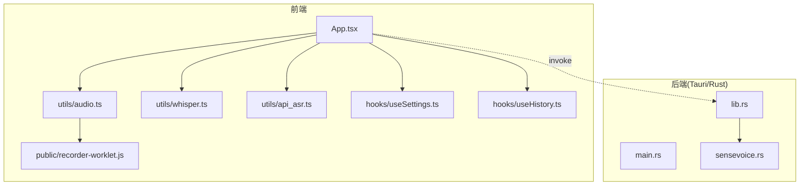
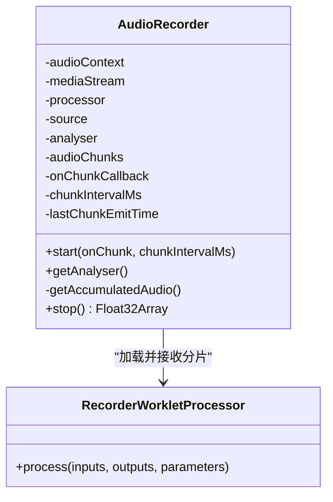
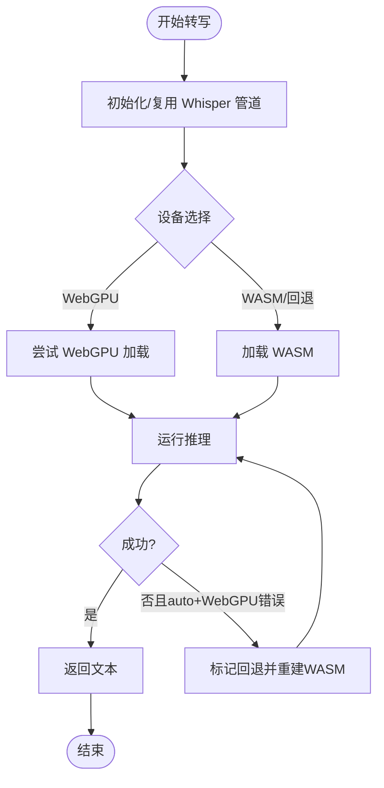
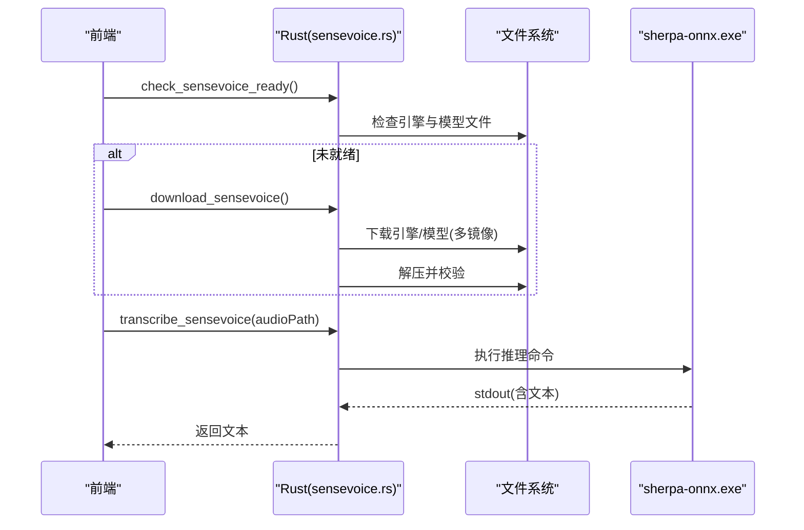
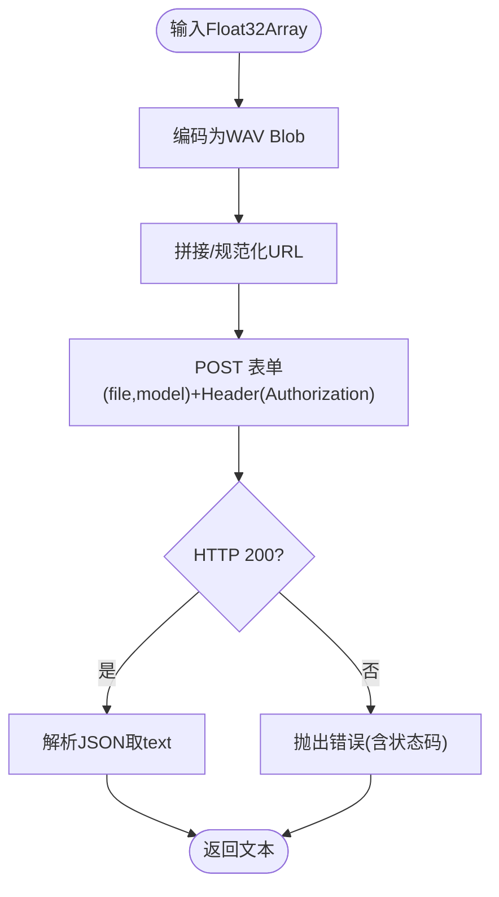
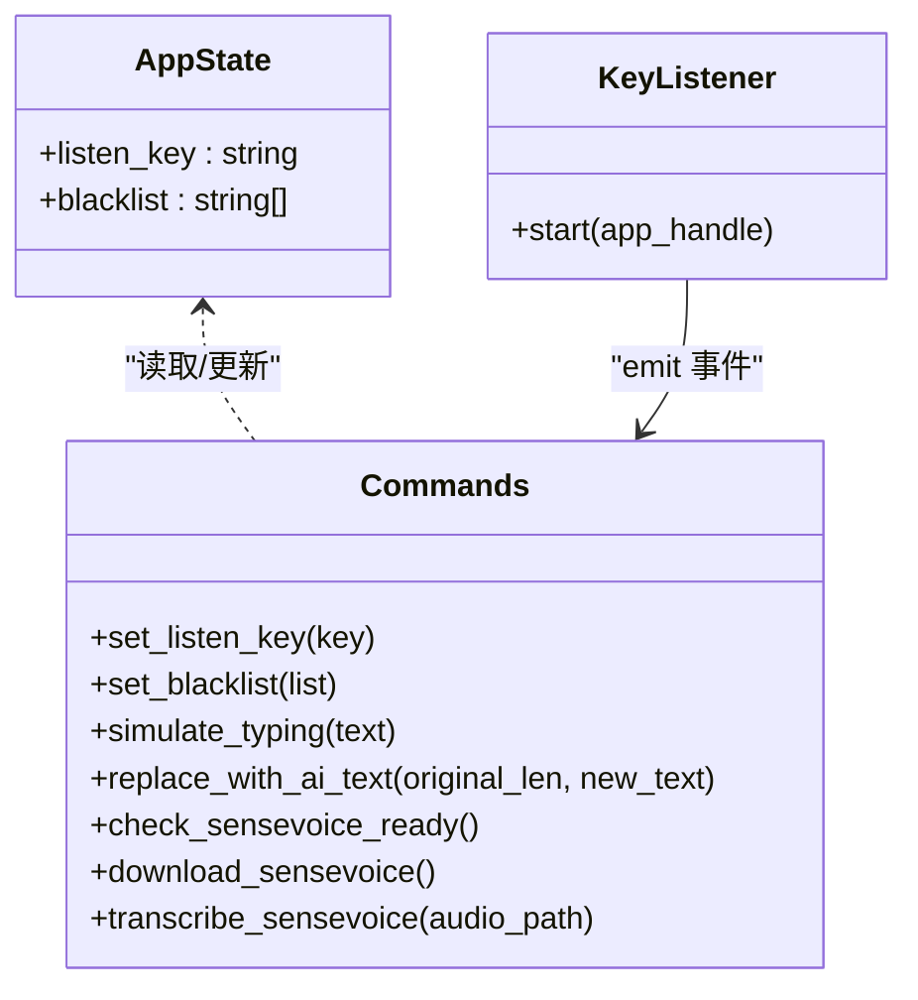
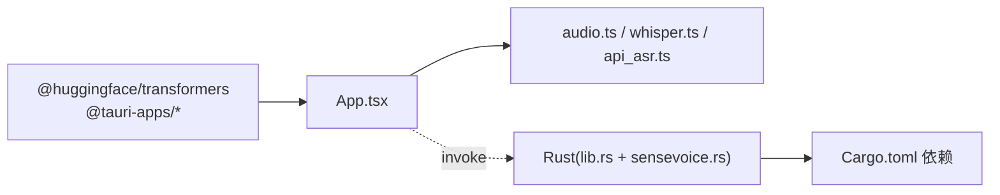

# 核心功能模块

<cite>
**本文引用的文件**
- [README.md](file://README.md)
- [package.json](file://package.json)
- [src/main.tsx](file://src/main.tsx)
- [src/App.tsx](file://src/App.tsx)
- [src/utils/audio.ts](file://src/utils/audio.ts)
- [src/utils/whisper.ts](file://src/utils/whisper.ts)
- [src/utils/api_asr.ts](file://src/utils/api_asr.ts)
- [public/recorder-worklet.js](file://public/recorder-worklet.js)
- [src/hooks/useSettings.ts](file://src/hooks/useSettings.ts)
- [src/hooks/useHistory.ts](file://src/hooks/useHistory.ts)
- [src-tauri/Cargo.toml](file://src-tauri/Cargo.toml)
- [src-tauri/src/main.rs](file://src-tauri/src/main.rs)
- [src-tauri/src/lib.rs](file://src-tauri/src/lib.rs)
- [src-tauri/src/sensevoice.rs](file://src-tauri/src/sensevoice.rs)
</cite>

## 目录
1. [简介](#简介)
2. [项目结构](#项目结构)
3. [核心组件](#核心组件)
4. [架构总览](#架构总览)
5. [详细组件分析](#详细组件分析)
6. [依赖分析](#依赖分析)
7. [性能考虑](#性能考虑)
8. [故障排查指南](#故障排查指南)
9. [结论](#结论)
10. [附录](#附录)

## 简介
VoiceFlow_AI_002 是一个基于 Tauri + React + TypeScript 的桌面应用，提供“语音听写 + AI 文本润色”的一体化工作流。其核心能力包括：
- 音频采集与处理：浏览器侧通过 Web Audio API 与 AudioWorklet 实现低延迟采集、静音切除与分片输出。
- 语音识别引擎：支持本地 Whisper（Transformers.js，WebGPU/WASM）与 SenseVoice（Rust 调用 sherpa-onnx），以及可选的云端 ASR API。
- AI 文本润色：在配置 LLM 接口后，对识别结果进行风格化优化并自动替换到当前输入焦点。
- 系统集成：全局快捷键监听、剪贴板与模拟粘贴、黑名单过滤、托盘菜单、独立浮窗状态指示等。

本文件面向初学者与高级开发者，既提供概念性说明，也给出代码级细节、流程图与最佳实践建议。

## 项目结构
前端采用 React + Vite，后端使用 Tauri（Rust）。关键组织方式如下：
- src：React 应用源码，包含页面、组件、工具函数与 hooks。
- public：静态资源，如 AudioWorklet 脚本。
- src-tauri：Tauri 后端，包含 Rust 逻辑、插件与打包配置。



图表来源
- [src/App.tsx:1-774](file://src/App.tsx#L1-L774)
- [src/utils/audio.ts:1-221](file://src/utils/audio.ts#L1-L221)
- [src/utils/whisper.ts:1-174](file://src/utils/whisper.ts#L1-L174)
- [src/utils/api_asr.ts:1-73](file://src/utils/api_asr.ts#L1-L73)
- [public/recorder-worklet.js:1-39](file://public/recorder-worklet.js#L1-L39)
- [src-tauri/src/main.rs:1-9](file://src-tauri/src/main.rs#L1-L9)
- [src-tauri/src/lib.rs:1-287](file://src-tauri/src/lib.rs#L1-L287)
- [src-tauri/src/sensevoice.rs:1-476](file://src-tauri/src/sensevoice.rs#L1-L476)

章节来源
- [README.md:1-8](file://README.md#L1-L8)
- [package.json:1-32](file://package.json#L1-L32)
- [src/main.tsx:1-10](file://src/main.tsx#L1-L10)

## 核心组件
- 音频采集器（AudioRecorder）：封装 MediaStream、AudioContext、AnalyserNode 与 AudioWorklet，提供 start/stop、分片回调、音量分析与静音切除。
- 本地语音识别（Whisper via Transformers.js）：支持 WebGPU 优先、WASM 回退；具备模型下载进度、内存休眠释放策略。
- 云端 ASR API：将 Float32Array 编码为 WAV Blob，POST 至兼容 OpenAI 格式的转录接口。
- SenseVoice 集成（Rust）：检查/下载引擎与模型、调用 sherpa-onnx 离线推理。
- 系统集成（Rust）：全局快捷键监听、剪贴板读写、模拟粘贴、黑名单过滤、托盘菜单、窗口事件管理。
- 配置与历史（Hooks）：持久化设置、快捷键同步、历史记录增删改查与复制。

章节来源
- [src/utils/audio.ts:1-221](file://src/utils/audio.ts#L1-L221)
- [src/utils/whisper.ts:1-174](file://src/utils/whisper.ts#L1-L174)
- [src/utils/api_asr.ts:1-73](file://src/utils/api_asr.ts#L1-L73)
- [src-tauri/src/sensevoice.rs:1-476](file://src-tauri/src/sensevoice.rs#L1-L476)
- [src-tauri/src/lib.rs:1-287](file://src-tauri/src/lib.rs#L1-L287)
- [src/hooks/useSettings.ts:1-97](file://src/hooks/useSettings.ts#L1-L97)
- [src/hooks/useHistory.ts:1-70](file://src/hooks/useHistory.ts#L1-L70)

## 架构总览
整体流程：用户按下全局快捷键 -> Rust 监听并广播事件 -> 前端启动录音 -> 按引擎分流（本地 Whisper/SenseVoice/云端 API）-> 得到文本 -> 可选 AI 润色 -> 通过系统粘贴替换到目标应用。

```mermaid
sequenceDiagram
participant User as "用户"
participant OS as "操作系统"
participant Rust as "Tauri(Rust)"
participant FE as "前端(App.tsx)"
participant Mic as "音频采集(AudioRecorder)"
participant ASR as "ASR引擎(Whisper/SenseVoice/API)"
participant LLM as "LLM(可选)"
participant Target as "目标应用"
User->>OS : 按下快捷键
OS-->>Rust : 按键事件(KeyPress/Release)
Rust-->>FE : 事件(shortcut-state)
FE->>Mic : start(onChunk, interval)
alt 云端API模式
loop 每N毫秒
Mic-->>FE : 分片Float32Array
FE->>ASR : transcribeAudioApi(chunk)
ASR-->>FE : 临时文本
FE->>Target : simulate_typing/replace_with_ai_text
end
else 本地模型
User->>OS : 松开快捷键
OS-->>Rust : KeyRelease
Rust-->>FE : shortcut-state(pressed=false)
FE->>Mic : stop()
FE->>ASR : 完整音频转写
ASR-->>FE : 最终文本
opt 配置了LLM
FE->>LLM : refineText(finalText)
LLM-->>FE : 润色文本
FE->>Target : replace_with_ai_text
else 未配置LLM
FE->>Target : simulate_typing
end
end
```

图表来源
- [src-tauri/src/lib.rs:140-212](file://src-tauri/src/lib.rs#L140-L212)
- [src/App.tsx:256-286](file://src/App.tsx#L256-L286)
- [src/App.tsx:373-435](file://src/App.tsx#L373-L435)
- [src/App.tsx:462-640](file://src/App.tsx#L462-L640)
- [src/utils/api_asr.ts:41-73](file://src/utils/api_asr.ts#L41-L73)
- [src/utils/whisper.ts:121-174](file://src/utils/whisper.ts#L121-L174)
- [src-tauri/src/sensevoice.rs:445-476](file://src-tauri/src/sensevoice.rs#L445-L476)

## 详细组件分析

### 音频处理系统（AudioRecorder）
- 技术选型：Web Audio API + AudioWorklet，采样率 16000Hz，单声道，开启回声消除与降噪。
- 关键特性：
  - 分片回调：可配置间隔（默认 2000ms）合并已积累数据，用于云端 API 伪流式识别。
  - 音量分析：暴露 AnalyserNode，主线程计算 RMS 驱动小药丸窗口波形动画。
  - 静音切除（VAD）：基于 RMS 阈值裁剪首尾静音，减少无效音频长度。
  - WAV 编码：float32ToWav 将 Float32Array 转为 16-bit PCM WAV，供 SenseVoice 使用。
- 复杂度与性能：
  - 分片合并 O(n)，VAD 扫描 O(n)，n 为 chunk 数量；内存峰值受 buffer 大小与合并数组影响。
  - 建议保持合理 chunkIntervalMs，避免频繁网络请求或过大内存占用。



图表来源
- [src/utils/audio.ts:1-221](file://src/utils/audio.ts#L1-L221)
- [public/recorder-worklet.js:1-39](file://public/recorder-worklet.js#L1-L39)

章节来源
- [src/utils/audio.ts:1-221](file://src/utils/audio.ts#L1-L221)
- [public/recorder-worklet.js:1-39](file://public/recorder-worklet.js#L1-L39)

### 语音识别引擎（Whisper 本地）
- 技术选型：@huggingface/transformers.js pipeline('automatic-speech-recognition')，设备优先级 WebGPU > WASM。
- 关键特性：
  - 模型缓存与复用：相同模型名直接返回已有实例，降低重复初始化开销。
  - 下载进度聚合：多文件下载累计进度，UI 实时反馈。
  - 内存休眠策略：空闲 10 分钟后释放 pipeline，避免长期驻留占用显存/内存。
  - 错误回退：WebGPU 执行期崩溃时自动降级到 WASM 并重试。
- 参数与选项：
  - language：null 表示自动检测；也可指定具体语言。
  - chunk_length_s / stride_length_s：控制分段与重叠，平衡精度与速度。
  - prompt：上下文提示，部分模型版本可能生效。



图表来源
- [src/utils/whisper.ts:35-112](file://src/utils/whisper.ts#L35-L112)
- [src/utils/whisper.ts:121-174](file://src/utils/whisper.ts#L121-L174)

章节来源
- [src/utils/whisper.ts:1-174](file://src/utils/whisper.ts#L1-L174)

### 语音识别引擎（SenseVoice 本地）
- 技术选型：Rust 端下载并解压 sherpa-onnx 引擎与 SenseVoice 模型，调用外部 exe 完成离线推理。
- 关键特性：
  - 多镜像源与断点重试：提高下载成功率与稳定性。
  - 原子解压与校验：先解压到暂存目录，校验 ready 文件后再重命名，保证一致性。
  - 模型候选集：优先国内源，失败则回退 tarball 包。
  - 进程外推理：通过命令行参数传入模型与 tokens，解析 stdout 提取文本。
- 交互流程：
  - 前端 invoke check_sensevoice_ready -> 若未就绪则 download_sensevoice -> 完成后 transcribe_sensevoice。



图表来源
- [src-tauri/src/sensevoice.rs:295-443](file://src-tauri/src/sensevoice.rs#L295-L443)
- [src-tauri/src/sensevoice.rs:445-476](file://src-tauri/src/sensevoice.rs#L445-L476)

章节来源
- [src-tauri/src/sensevoice.rs:1-476](file://src-tauri/src/sensevoice.rs#L1-L476)

### 云端 ASR API
- 技术选型：将 Float32Array 编码为 WAV Blob，POST 到兼容 OpenAI 的 /v1/audio/transcriptions 接口。
- 关键点：
  - 自动补全路径：若 URL 不含标准路径，自动追加。
  - 鉴权：Bearer Token。
  - 错误处理：非 2xx 响应抛出带状态的错误信息。



图表来源
- [src/utils/api_asr.ts:1-73](file://src/utils/api_asr.ts#L1-L73)

章节来源
- [src/utils/api_asr.ts:1-73](file://src/utils/api_asr.ts#L1-L73)

### AI 文本润色（LLM）
- 触发条件：当配置了 LLM API Key 时，在识别完成后调用 refineText 进行风格化优化。
- 行为：
  - 构造 LLMConfig（apiKey、baseUrl、modelName、promptStyle、appName）。
  - 成功后用 replace_with_ai_text 瞬时替换上屏内容，并记录历史。
  - 失败时保留原文并记录错误历史项。
- 注意：该模块的具体实现位于 utils/llm（未在仓库中列出），但被 App.tsx 引用与使用。

章节来源
- [src/App.tsx:603-633](file://src/App.tsx#L603-L633)

### 系统集成（Tauri + Rust）
- 全局快捷键监听：rdev 事件驱动，映射目标键位，结合黑名单过滤，向 UI 广播 pressed/released 状态。
- 剪贴板与模拟粘贴：enigo + arboard，跨平台组合键（Ctrl/Cmd + V），并在操作前后恢复原剪贴板内容。
- 窗口与托盘：托盘菜单显示/退出，关闭 main 窗口时隐藏而非退出进程。
- 状态同步：indicator 浮窗与主窗口通过 WebviewWindow.emit/listen 通信，展示状态与音量。



图表来源
- [src-tauri/src/lib.rs:18-43](file://src-tauri/src/lib.rs#L18-L43)
- [src-tauri/src/lib.rs:45-118](file://src-tauri/src/lib.rs#L45-L118)
- [src-tauri/src/lib.rs:140-212](file://src-tauri/src/lib.rs#L140-L212)
- [src-tauri/src/lib.rs:214-286](file://src-tauri/src/lib.rs#L214-L286)

章节来源
- [src-tauri/src/lib.rs:1-287](file://src-tauri/src/lib.rs#L1-L287)
- [src-tauri/src/main.rs:1-9](file://src-tauri/src/main.rs#L1-L9)

### 配置与历史（Hooks）
- useSettings：
  - 统一 Settings 对象，支持旧版 key 迁移。
  - 变更 listenKey 时自动 invoke set_listen_key 同步到后端。
  - 保存至 localStorage，并提供 saveStatus 反馈。
- useHistory：
  - 维护最近 100 条记录，支持删除、清空、复制到剪贴板。

章节来源
- [src/hooks/useSettings.ts:1-97](file://src/hooks/useSettings.ts#L1-L97)
- [src/hooks/useHistory.ts:1-70](file://src/hooks/useHistory.ts#L1-L70)

## 依赖分析
- 前端依赖：
  - @huggingface/transformers：本地 Whisper 推理。
  - @tauri-apps/*：窗口、事件、文件系统、自动启动等能力。
  - lucide-react：图标库。
- 后端依赖（Cargo.toml）：
  - tauri + 插件：tray-icon、opener、autostart。
  - enigo/rdev/arboard：键盘/鼠标模拟、全局监听、剪贴板。
  - reqwest/tar/bzip2/zip：网络下载与归档解压。
  - futures-util：异步流处理。



图表来源
- [package.json:13-22](file://package.json#L13-L22)
- [src-tauri/Cargo.toml:20-36](file://src-tauri/Cargo.toml#L20-L36)
- [src/App.tsx:1-29](file://src/App.tsx#L1-L29)

章节来源
- [package.json:1-32](file://package.json#L1-L32)
- [src-tauri/Cargo.toml:1-47](file://src-tauri/Cargo.toml#L1-L47)

## 性能考虑
- 音频采集
  - 合理设置 chunkIntervalMs，避免过于频繁的上传或处理。
  - 使用 AnalyserNode 计算音量时，尽量降低轮询频率（当前 50ms 已较平滑）。
- Whisper 推理
  - 优先 WebGPU，必要时回退 WASM；利用模型缓存与内存休眠策略降低资源占用。
  - 调整 chunk_length_s 与 stride_length_s 以平衡速度与精度。
- SenseVoice
  - 首次下载体积较大，建议后台静默下载并显示进度；后续推理为进程外调用，注意 IO 与进程启动开销。
- 云端 API
  - 伪流式上传需权衡网络带宽与延迟；确保服务端限流与鉴权稳定。
- 系统集成
  - 模拟粘贴逐字 Backspace 删除存在微小延迟，批量替换场景下注意用户体验。

[本节为通用指导，不直接分析具体文件]

## 故障排查指南
- 无法启动麦克风
  - 现象：start 抛错或获取不到媒体流。
  - 排查：确认权限、浏览器策略（需用户手势唤醒 AudioContext）、是否处于 suspended 状态。
- 无声音/全静音
  - 现象：停止后检测到最大振幅过低或全静音。
  - 排查：靠近麦克风、调大音量、检查系统输入设备。
- Whisper 初始化失败
  - 现象：WebGPU 加载失败或执行期崩溃。
  - 排查：查看日志中的回退信息；确认显卡/WebView2 驱动兼容性；必要时强制 WASM。
- SenseVoice 模型未就绪
  - 现象：check_sensevoice_ready 返回 false。
  - 排查：执行 download_sensevoice，观察 download-progress 事件；检查网络与镜像可用性。
- 云端 API 报错
  - 现象：非 2xx 响应或鉴权失败。
  - 排查：核对 apiUrl、apiKey、model；确认路径规范与 CORS。
- 快捷键无响应或被拦截
  - 现象：按下快捷键无效果。
  - 排查：检查 listenKey 配置、黑名单匹配规则、目标应用前台状态。

章节来源
- [src/App.tsx:373-435](file://src/App.tsx#L373-L435)
- [src/App.tsx:462-506](file://src/App.tsx#L462-L506)
- [src/utils/whisper.ts:71-108](file://src/utils/whisper.ts#L71-L108)
- [src-tauri/src/sensevoice.rs:295-343](file://src-tauri/src/sensevoice.rs#L295-L343)
- [src/utils/api_asr.ts:41-73](file://src/utils/api_asr.ts#L41-L73)
- [src-tauri/src/lib.rs:140-212](file://src-tauri/src/lib.rs#L140-L212)

## 结论
VoiceFlow_AI_002 将浏览器侧高性能音频采集、多种语音识别方案与 LLM 文本润色无缝整合，并通过 Tauri 打通系统级能力（快捷键、剪贴板、托盘、浮窗）。对于初学者，可按默认配置快速体验；对于高级开发者，可通过设备选择、模型切换、引擎回退与参数调优获得更稳定的性能与更好的用户体验。

[本节为总结，不直接分析具体文件]

## 附录

### 配置选项与参数设置
- 通用设置（useSettings）
  - apiKey/baseUrl/modelName/promptStyle：LLM 接口与风格。
  - listenKey：全局快捷键键位。
  - asrLanguage：识别语言（auto/chinese 等）。
  - whisperModel/inferenceDevice：本地 Whisper 模型与设备（auto/webgpu/wasm）。
  - asrEngine：local/api 切换。
  - asrApiUrl/asrApiKey/asrApiModel：云端 ASR 配置。
  - blacklistStr：黑名单应用名列表（逗号或换行分隔）。
- Whisper 推理参数（transcribeAudio）
  - language：null 自动检测，或指定语言。
  - chunk_length_s/stride_length_s：分段与重叠时长。
  - prompt：上下文提示（视模型支持情况）。
- SenseVoice 推理（Rust）
  - 引擎与模型文件由 download_sensevoice 管理，无需手动配置。
- 音频采集（AudioRecorder）
  - chunkIntervalMs：分片间隔（毫秒），用于伪流式上传。
  - sampleRate：固定 16000Hz。

章节来源
- [src/hooks/useSettings.ts:20-34](file://src/hooks/useSettings.ts#L20-L34)
- [src/utils/whisper.ts:121-146](file://src/utils/whisper.ts#L121-L146)
- [src-tauri/src/sensevoice.rs:309-443](file://src-tauri/src/sensevoice.rs#L309-L443)
- [src/utils/audio.ts:12-17](file://src/utils/audio.ts#L12-L17)