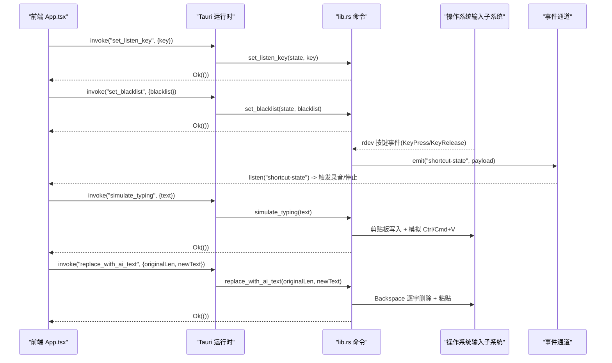
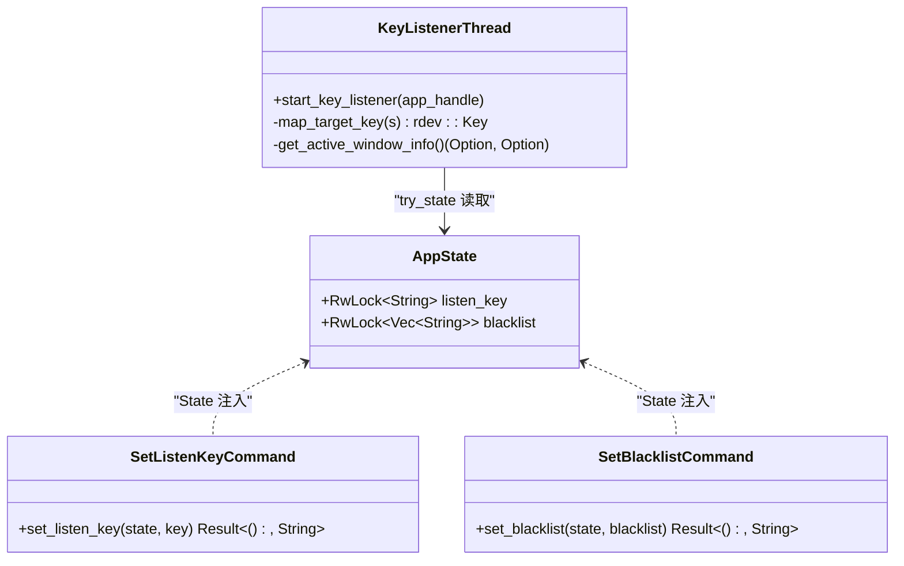
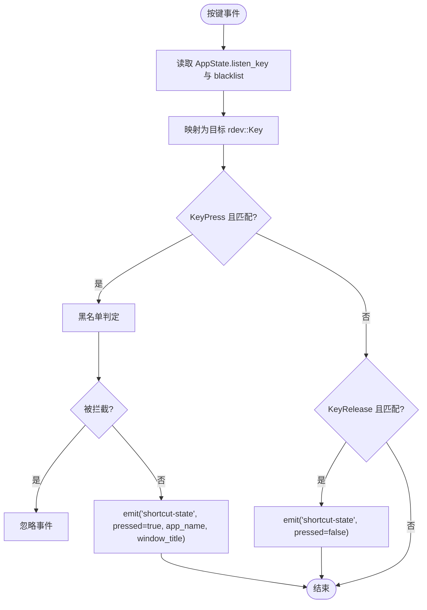
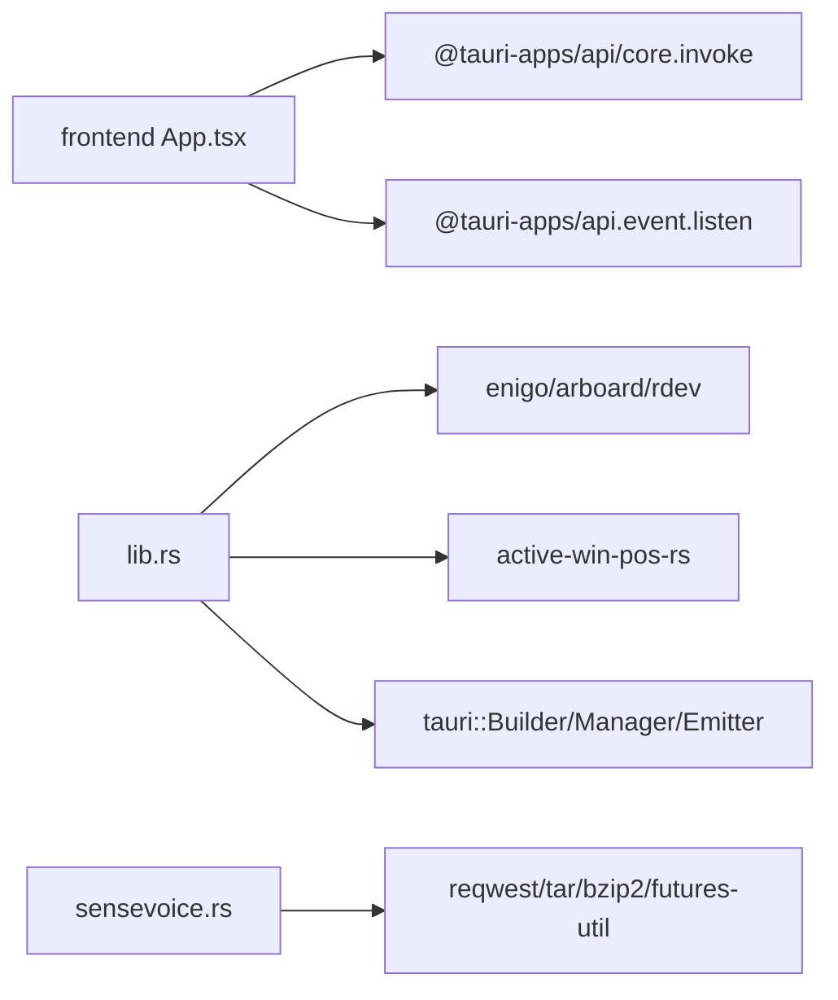

# Tauri 命令接口

<cite>
**本文引用的文件**
- [src-tauri/src/main.rs](file://src-tauri/src/main.rs)
- [src-tauri/src/lib.rs](file://src-tauri/src/lib.rs)
- [src-tauri/src/sensevoice.rs](file://src-tauri/src/sensevoice.rs)
- [src-tauri/Cargo.toml](file://src-tauri/Cargo.toml)
- [src-tauri/tauri.conf.json](file://src-tauri/tauri.conf.json)
- [src/App.tsx](file://src/App.tsx)
- [src/hooks/useSettings.ts](file://src/hooks/useSettings.ts)
</cite>

## 目录
1. [简介](#简介)
2. [项目结构](#项目结构)
3. [核心组件](#核心组件)
4. [架构总览](#架构总览)
5. [详细组件分析](#详细组件分析)
6. [依赖关系分析](#依赖关系分析)
7. [性能考量](#性能考量)
8. [故障排查指南](#故障排查指南)
9. [结论](#结论)
10. [附录：前端调用示例与后端实现对照](#附录前端调用示例与后端实现对照)

## 简介
本文件为 VoiceFlow_AI_002 的 Tauri 命令接口文档，重点说明前后端通信机制、#[tauri::command] 宏的使用、参数传递与返回值处理；详解 AppState 状态管理模式（RwLock 并发访问、初始化与数据持久化）；文档化所有暴露的 Tauri Commands（set_listen_key、set_blacklist、simulate_typing、replace_with_ai_text、check_sensevoice_ready、download_sensevoice、transcribe_sensevoice），包括参数规范、错误处理与调用示例；说明命令调用的异步处理模式与错误传播机制；并提供 TypeScript 前端调用示例与 Rust 后端实现的对照。面向初学者提供 Tauri IPC 基础概念，面向高级开发者提供自定义命令开发与安全考虑指南。

## 项目结构
本项目采用 Tauri v2 + React 的前后端分离架构：
- 后端（Rust）：通过 tauri::Builder 注册应用、托盘菜单、窗口事件与 invoke_handler，将 #[tauri::command] 标记的命令暴露给前端。
- 前端（TypeScript/React）：使用 @tauri-apps/api/core 的 invoke 调用后端命令，使用 event API 监听后端广播的事件。

```mermaid
graph TB
subgraph "前端"
FE_App["App.tsx"]
FE_Settings["useSettings.ts"]
end
subgraph "Tauri 运行时"
Main["main.rs<br/>入口"]
Lib["lib.rs<br/>命令与状态"]
SenseVoice["sensevoice.rs<br/>模型下载/推理"]
end
FE_App --> |invoke("...")| Lib
FE_Settings --> |invoke("set_listen_key")| Lib
FE_App --> |listen("shortcut-state")| Lib
FE_App --> |listen("download-progress")| SenseVoice
Lib --> SenseVoice
```

图表来源
- [src-tauri/src/main.rs:215-286](file://src-tauri/src/main.rs#L215-L286)
- [src-tauri/src/lib.rs:275-283](file://src-tauri/src/lib.rs#L275-L283)
- [src/App.tsx:196-206](file://src/App.tsx#L196-L206)
- [src/hooks/useSettings.ts:86-88](file://src/hooks/useSettings.ts#L86-L88)

章节来源
- [src-tauri/src/main.rs:1-9](file://src-tauri/src/main.rs#L1-L9)
- [src-tauri/src/lib.rs:1-287](file://src-tauri/src/lib.rs#L1-L287)
- [src-tauri/src/sensevoice.rs:1-476](file://src-tauri/src/sensevoice.rs#L1-L476)
- [src/App.tsx:1-774](file://src/App.tsx#L1-L774)
- [src/hooks/useSettings.ts:1-97](file://src/hooks/useSettings.ts#L1-L97)

## 核心组件
- 全局状态 AppState：包含 listen_key 与 blacklist，使用 RwLock 保护并发读写，由 Tauri State 注入到命令中。
- 命令层：
  - set_listen_key：设置全局快捷键键位。
  - set_blacklist：设置黑名单应用名列表。
  - simulate_typing：模拟粘贴文本到当前焦点应用。
  - replace_with_ai_text：删除原文并粘贴新文本。
  - check_sensevoice_ready / download_sensevoice / transcribe_sensevoice：SenseVoice 引擎与模型管理。
- 事件通道：
  - shortcut-state：按键按下/释放时从后端广播到前端。
  - download-progress：模型下载进度事件。

章节来源
- [src-tauri/src/lib.rs:19-43](file://src-tauri/src/lib.rs#L19-L43)
- [src-tauri/src/lib.rs:45-118](file://src-tauri/src/lib.rs#L45-L118)
- [src-tauri/src/lib.rs:140-212](file://src-tauri/src/lib.rs#L140-L212)
- [src-tauri/src/sensevoice.rs:295-476](file://src-tauri/src/sensevoice.rs#L295-L476)

## 架构总览
下图展示了前端通过 Tauri IPC 调用后端命令、后端在后台线程监听系统按键并通过事件回调前端的整体流程。



图表来源
- [src-tauri/src/lib.rs:31-43](file://src-tauri/src/lib.rs#L31-L43)
- [src-tauri/src/lib.rs:45-118](file://src-tauri/src/lib.rs#L45-L118)
- [src-tauri/src/lib.rs:140-212](file://src-tauri/src/lib.rs#L140-L212)
- [src/App.tsx:257-286](file://src/App.tsx#L257-L286)

## 详细组件分析

### 全局状态 AppState 与并发访问
AppState 使用 RwLock 保护两个字段：
- listen_key：字符串，保存目标快捷键键名。
- blacklist：字符串向量，保存黑名单应用名片段。

命令通过 State<'_, AppState> 获取读写锁，进行安全更新或读取。后台监听线程通过 try_state 获取只读副本，避免阻塞主循环。



图表来源
- [src-tauri/src/lib.rs:19-22](file://src-tauri/src/lib.rs#L19-L22)
- [src-tauri/src/lib.rs:31-43](file://src-tauri/src/lib.rs#L31-L43)
- [src-tauri/src/lib.rs:140-212](file://src-tauri/src/lib.rs#L140-L212)

章节来源
- [src-tauri/src/lib.rs:19-22](file://src-tauri/src/lib.rs#L19-L22)
- [src-tauri/src/lib.rs:31-43](file://src-tauri/src/lib.rs#L31-L43)
- [src-tauri/src/lib.rs:140-212](file://src-tauri/src/lib.rs#L140-L212)

### 命令：set_listen_key
- 功能：设置全局快捷键键位（如 RControl、LControl、LAlt、RAlt、CapsLock）。
- 参数：
  - key: string（必填）
- 返回：Result<(), String>
- 错误处理：
  - 写锁失败时返回错误信息。
- 前端调用示例路径：
  - [src/hooks/useSettings.ts:86-88](file://src/hooks/useSettings.ts#L86-L88)
- 后端实现路径：
  - [src-tauri/src/lib.rs:31-36](file://src-tauri/src/lib.rs#L31-L36)

章节来源
- [src-tauri/src/lib.rs:31-36](file://src-tauri/src/lib.rs#L31-L36)
- [src/hooks/useSettings.ts:86-88](file://src/hooks/useSettings.ts#L86-L88)

### 命令：set_blacklist
- 功能：设置黑名单应用名列表，用于拦截快捷键。
- 参数：
  - blacklist: Vec<string>（必填）
- 返回：Result<(), String>
- 错误处理：
  - 写锁失败时返回错误信息。
- 前端调用示例路径：
  - [src/App.tsx:236-240](file://src/App.tsx#L236-L240)
- 后端实现路径：
  - [src-tauri/src/lib.rs:38-43](file://src-tauri/src/lib.rs#L38-L43)

章节来源
- [src-tauri/src/lib.rs:38-43](file://src-tauri/src/lib.rs#L38-L43)
- [src/App.tsx:236-240](file://src/App.tsx#L236-L240)

### 命令：simulate_typing
- 功能：将指定文本复制到剪贴板并模拟粘贴（Windows/Linux 使用 Ctrl+V，macOS 使用 Cmd+V）。
- 参数：
  - text: string（必填）
- 返回：Result<(), String>
- 错误处理：
  - 剪贴板操作失败时返回错误信息。
- 前端调用示例路径：
  - [src/App.tsx:392-395](file://src/App.tsx#L392-L395)
  - [src/App.tsx:588-589](file://src/App.tsx#L588-L589)
- 后端实现路径：
  - [src-tauri/src/lib.rs:45-75](file://src-tauri/src/lib.rs#L45-L75)

章节来源
- [src-tauri/src/lib.rs:45-75](file://src-tauri/src/lib.rs#L45-L75)
- [src/App.tsx:392-395](file://src/App.tsx#L392-L395)
- [src/App.tsx:588-589](file://src/App.tsx#L588-L589)

### 命令：replace_with_ai_text
- 功能：先按 original_len 次数发送 Backspace 删除已上屏文本，再将 new_text 粘贴到当前焦点应用。
- 参数：
  - original_len: number（必填，整数）
  - newText: string（必填）
- 返回：Result<(), String>
- 错误处理：
  - 剪贴板操作失败时返回错误信息。
- 前端调用示例路径：
  - [src/App.tsx:412-416](file://src/App.tsx#L412-L416)
  - [src/App.tsx:445-450](file://src/App.tsx#L445-L450)
  - [src/App.tsx:582-586](file://src/App.tsx#L582-L586)
  - [src/App.tsx:613-616](file://src/App.tsx#L613-616)
- 后端实现路径：
  - [src-tauri/src/lib.rs:77-118](file://src-tauri/src/lib.rs#L77-L118)

章节来源
- [src-tauri/src/lib.rs:77-118](file://src-tauri/src/lib.rs#L77-L118)
- [src/App.tsx:412-416](file://src/App.tsx#L412-L416)
- [src/App.tsx:445-450](file://src/App.tsx#L445-L450)
- [src/App.tsx:582-586](file://src/App.tsx#L582-L586)
- [src/App.tsx:613-616](file://src/App.tsx#L613-616)

### 命令：check_sensevoice_ready
- 功能：检查 SenseVoice 引擎与模型是否就绪。
- 参数：无
- 返回：Result<bool, String>
- 错误处理：
  - 路径解析失败时返回错误信息。
- 前端调用示例路径：
  - [src/App.tsx:196-206](file://src/App.tsx#L196-L206)
- 后端实现路径：
  - [src-tauri/src/sensevoice.rs:295-307](file://src-tauri/src/sensevoice.rs#L295-L307)

章节来源
- [src-tauri/src/sensevoice.rs:295-307](file://src-tauri/src/sensevoice.rs#L295-L307)
- [src/App.tsx:196-206](file://src/App.tsx#L196-L206)

### 命令：download_sensevoice
- 功能：下载 SenseVoice 引擎与模型，支持多镜像源与断点重试，解压后原子替换，期间通过事件推送进度。
- 参数：无
- 返回：Result<(), String>
- 错误处理：
  - 网络请求失败、文件大小校验失败、解压失败等都会返回错误信息。
- 事件：
  - download-progress：step 与 progress 字段，用于前端展示进度条。
- 前端调用示例路径：
  - [src/App.tsx:199-206](file://src/App.tsx#L199-L206)
- 后端实现路径：
  - [src-tauri/src/sensevoice.rs:309-443](file://src-tauri/src/sensevoice.rs#L309-L443)

章节来源
- [src-tauri/src/sensevoice.rs:309-443](file://src-tauri/src/sensevoice.rs#L309-L443)
- [src/App.tsx:199-206](file://src/App.tsx#L199-L206)

### 命令：transcribe_sensevoice
- 功能：调用本地 SenseVoice 引擎对音频文件进行转写，返回识别文本。
- 参数：
  - audio_path: string（必填，WAV 文件路径）
- 返回：Result<string, String>
- 错误处理：
  - 找不到引擎或模型、进程执行失败等会返回错误信息。
- 前端调用示例路径：
  - [src/App.tsx:524-544](file://src/App.tsx#L524-L544)
- 后端实现路径：
  - [src-tauri/src/sensevoice.rs:445-476](file://src-tauri/src/sensevoice.rs#L445-L476)

章节来源
- [src-tauri/src/sensevoice.rs:445-476](file://src-tauri/src/sensevoice.rs#L445-L476)
- [src/App.tsx:524-544](file://src/App.tsx#L524-L544)

### 全局快捷键监听与事件广播
- 后台线程使用 rdev 监听系统按键事件，根据 AppState.listen_key 判断目标键，结合黑名单过滤，按下时 emit("shortcut-state", {pressed: true, app_name, window_title})，松开时 emit({pressed: false})。
- 前端监听该事件，按下开始录音，松开停止录音并进行识别与上屏。



图表来源
- [src-tauri/src/lib.rs:140-212](file://src-tauri/src/lib.rs#L140-L212)

章节来源
- [src-tauri/src/lib.rs:140-212](file://src-tauri/src/lib.rs#L140-L212)
- [src/App.tsx:257-286](file://src/App.tsx#L257-L286)

## 依赖关系分析
- 后端依赖：
  - tauri v2：构建应用、注册命令、事件、托盘、窗口。
  - enigo、arboard：模拟键盘与剪贴板操作。
  - rdev：全局按键监听。
  - active-win-pos-rs：获取活动窗口信息。
  - reqwest、tar、bzip2、futures-util：下载与解压模型。
- 前端依赖：
  - @tauri-apps/api/core：invoke 调用命令。
  - @tauri-apps/api/event：监听事件。
  - @tauri-apps/api/window、webviewWindow：窗口控制与跨窗口通信。
  - @tauri-apps/plugin-autostart：开机自启。
  - @tauri-apps/api/path、plugin-fs：路径与文件系统。



图表来源
- [src-tauri/Cargo.toml:20-36](file://src-tauri/Cargo.toml#L20-L36)
- [src/App.tsx:1-6](file://src/App.tsx#L1-L6)

章节来源
- [src-tauri/Cargo.toml:20-36](file://src-tauri/Cargo.toml#L20-L36)
- [src/App.tsx:1-6](file://src/App.tsx#L1-L6)

## 性能考量
- 剪贴板与键盘模拟：
  - simulate_typing 与 replace_with_ai_text 涉及剪贴板读写与按键模拟，建议批量操作减少频繁切换焦点带来的抖动。
  - replace_with_ai_text 使用逐字 Backspace 删除，确保稳定性但存在微小延迟，适合短文本替换。
- 全局监听：
  - rdev 监听在独立线程运行，避免阻塞 UI；黑名单判定在内存中进行，复杂度 O(n)，n 为黑名单条目数。
- 模型下载：
  - download_sensevoice 支持多镜像源与重试，使用临时文件与原子替换保证一致性；大文件下载建议使用稳定网络环境。
- 推理调用：
  - transcribe_sensevoice 通过子进程调用外部可执行程序，注意进程启动开销与输出解析。

[本节为通用指导，不直接分析具体文件]

## 故障排查指南
- 快捷键无效：
  - 确认 set_listen_key 已成功调用；检查黑名单是否包含当前活动应用名。
  - 参考路径：
    - [src-tauri/src/lib.rs:31-43](file://src-tauri/src/lib.rs#L31-L43)
    - [src-tauri/src/lib.rs:140-212](file://src-tauri/src/lib.rs#L140-L212)
- 粘贴失败：
  - 检查剪贴板权限与目标应用是否允许粘贴；查看错误消息。
  - 参考路径：
    - [src-tauri/src/lib.rs:45-75](file://src-tauri/src/lib.rs#L45-L75)
    - [src-tauri/src/lib.rs:77-118](file://src-tauri/src/lib.rs#L77-L118)
- 模型未就绪或下载失败：
  - 检查网络与镜像源；观察 download-progress 事件；必要时重新下载。
  - 参考路径：
    - [src-tauri/src/sensevoice.rs:295-443](file://src-tauri/src/sensevoice.rs#L295-L443)
- 转写结果为空或异常：
  - 检查音频文件路径与格式；查看进程输出与错误信息。
  - 参考路径：
    - [src-tauri/src/sensevoice.rs:445-476](file://src-tauri/src/sensevoice.rs#L445-L476)
    - [src/App.tsx:524-544](file://src/App.tsx#L524-L544)

章节来源
- [src-tauri/src/lib.rs:31-43](file://src-tauri/src/lib.rs#L31-L43)
- [src-tauri/src/lib.rs:45-75](file://src-tauri/src/lib.rs#L45-L75)
- [src-tauri/src/lib.rs:77-118](file://src-tauri/src/lib.rs#L77-L118)
- [src-tauri/src/sensevoice.rs:295-443](file://src-tauri/src/sensevoice.rs#L295-L443)
- [src-tauri/src/sensevoice.rs:445-476](file://src-tauri/src/sensevoice.rs#L445-L476)
- [src/App.tsx:524-544](file://src/App.tsx#L524-L544)

## 结论
本项目通过 Tauri 命令与事件机制实现了稳定的前后端通信：前端负责用户交互与状态管理，后端负责系统级能力（全局监听、剪贴板与键盘模拟、模型下载与推理）。AppState 使用 RwLock 保障并发安全，命令层统一封装错误返回，便于前端捕获与提示。SenseVoice 模块提供了离线语音识别能力，具备完善的下载与回退策略。整体架构清晰、扩展性强，适合继续添加更多系统级命令与功能。

[本节为总结性内容，不直接分析具体文件]

## 附录：前端调用示例与后端实现对照

- set_listen_key
  - 前端调用示例路径：[src/hooks/useSettings.ts:86-88](file://src/hooks/useSettings.ts#L86-L88)
  - 后端实现路径：[src-tauri/src/lib.rs:31-36](file://src-tauri/src/lib.rs#L31-L36)
  - 参数：{ key: string }
  - 返回：Ok(()) 或错误字符串

- set_blacklist
  - 前端调用示例路径：[src/App.tsx:236-240](file://src/App.tsx#L236-L240)
  - 后端实现路径：[src-tauri/src/lib.rs:38-43](file://src-tauri/src/lib.rs#L38-L43)
  - 参数：{ blacklist: string[] }
  - 返回：Ok(()) 或错误字符串

- simulate_typing
  - 前端调用示例路径：[src/App.tsx:392-395](file://src/App.tsx#L392-L395), [src/App.tsx:588-589](file://src/App.tsx#L588-L589)
  - 后端实现路径：[src-tauri/src/lib.rs:45-75](file://src-tauri/src/lib.rs#L45-L75)
  - 参数：{ text: string }
  - 返回：Ok(()) 或错误字符串

- replace_with_ai_text
  - 前端调用示例路径：[src/App.tsx:412-416](file://src/App.tsx#L412-L416), [src/App.tsx:445-450](file://src/App.tsx#L445-L450), [src/App.tsx:582-586](file://src/App.tsx#L582-L586), [src/App.tsx:613-616](file://src/App.tsx#L613-616)
  - 后端实现路径：[src-tauri/src/lib.rs:77-118](file://src-tauri/src/lib.rs#L77-L118)
  - 参数：{ originalLen: number, newText: string }
  - 返回：Ok(()) 或错误字符串

- check_sensevoice_ready
  - 前端调用示例路径：[src/App.tsx:196-206](file://src/App.tsx#L196-L206)
  - 后端实现路径：[src-tauri/src/sensevoice.rs:295-307](file://src-tauri/src/sensevoice.rs#L295-L307)
  - 参数：无
  - 返回：true/false 或错误字符串

- download_sensevoice
  - 前端调用示例路径：[src/App.tsx:199-206](file://src/App.tsx#L199-L206)
  - 后端实现路径：[src-tauri/src/sensevoice.rs:309-443](file://src-tauri/src/sensevoice.rs#L309-L443)
  - 参数：无
  - 返回：Ok(()) 或错误字符串
  - 事件：download-progress（step, progress）

- transcribe_sensevoice
  - 前端调用示例路径：[src/App.tsx:524-544](file://src/App.tsx#L524-L544)
  - 后端实现路径：[src-tauri/src/sensevoice.rs:445-476](file://src-tauri/src/sensevoice.rs#L445-L476)
  - 参数：{ audioPath: string }
  - 返回：识别文本或错误字符串

章节来源
- [src/hooks/useSettings.ts:86-88](file://src/hooks/useSettings.ts#L86-L88)
- [src/App.tsx:196-206](file://src/App.tsx#L196-L206)
- [src/App.tsx:236-240](file://src/App.tsx#L236-L240)
- [src/App.tsx:392-395](file://src/App.tsx#L392-L395)
- [src/App.tsx:412-416](file://src/App.tsx#L412-L416)
- [src/App.tsx:445-450](file://src/App.tsx#L445-L450)
- [src/App.tsx:524-544](file://src/App.tsx#L524-L544)
- [src/App.tsx:582-586](file://src/App.tsx#L582-L586)
- [src/App.tsx:588-589](file://src/App.tsx#L588-L589)
- [src/App.tsx:613-616](file://src/App.tsx#L613-616)
- [src-tauri/src/lib.rs:31-43](file://src-tauri/src/lib.rs#L31-L43)
- [src-tauri/src/lib.rs:45-75](file://src-tauri/src/lib.rs#L45-L75)
- [src-tauri/src/lib.rs:77-118](file://src-tauri/src/lib.rs#L77-L118)
- [src-tauri/src/sensevoice.rs:295-476](file://src-tauri/src/sensevoice.rs#L295-L476)