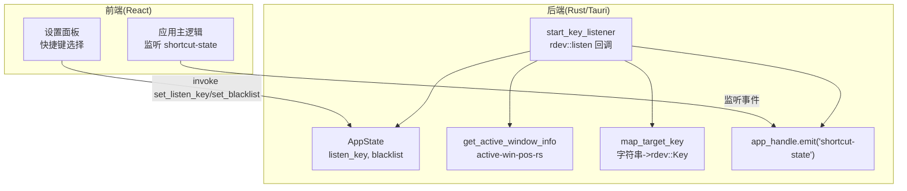
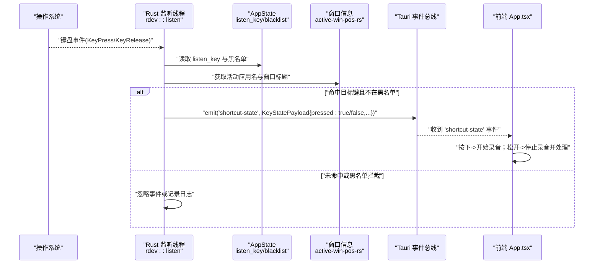
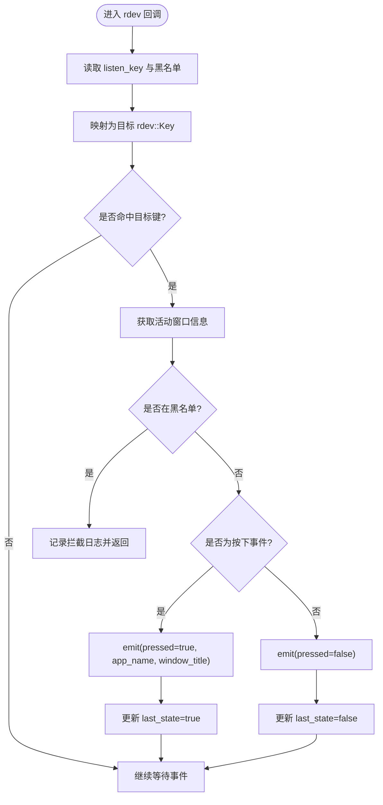
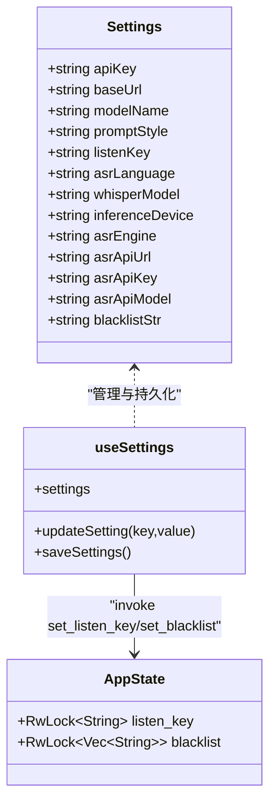
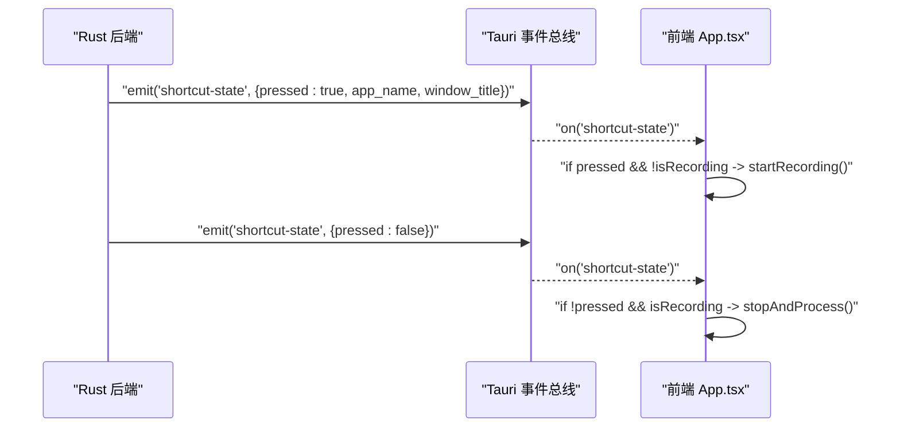
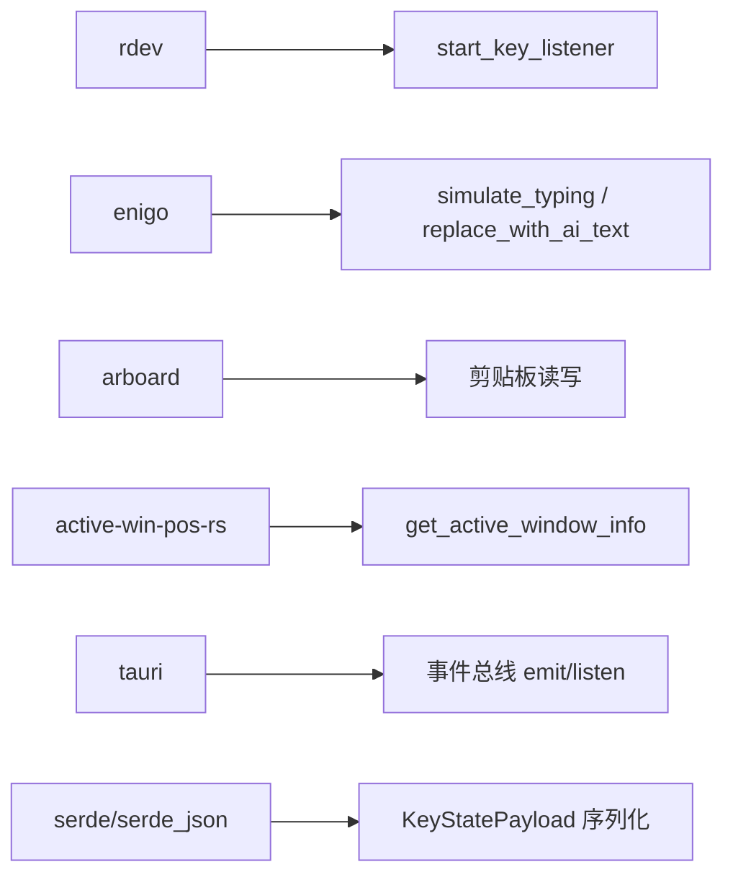

# 全局快捷键监听

<cite>
**本文引用的文件**
- [src-tauri/src/lib.rs](file://src-tauri/src/lib.rs)
- [src-tauri/src/main.rs](file://src-tauri/src/main.rs)
- [src-tauri/Cargo.toml](file://src-tauri/Cargo.toml)
- [src/App.tsx](file://src/App.tsx)
- [src/hooks/useSettings.ts](file://src/hooks/useSettings.ts)
- [src/components/SettingsPanel.tsx](file://src/components/SettingsPanel.tsx)
</cite>

## 目录
1. [简介](#简介)
2. [项目结构](#项目结构)
3. [核心组件](#核心组件)
4. [架构总览](#架构总览)
5. [详细组件分析](#详细组件分析)
6. [依赖关系分析](#依赖关系分析)
7. [性能与平台兼容性](#性能与平台兼容性)
8. [故障排查指南](#故障排查指南)
9. [结论](#结论)
10. [附录：rdev 使用与扩展开发指南](#附录rdev-使用与扩展开发指南)

## 简介
本文件围绕 VoiceFlow_AI_002 的全局快捷键监听功能进行系统化文档化，重点解释基于 rdev 的跨平台键盘事件捕获机制、热键注册与状态同步、黑名单过滤逻辑、窗口信息获取、KeyStatePayload 数据结构及事件发射流程。同时提供前端交互、错误处理策略、性能优化技巧，以及面向初学者的 rdev 使用指南和面向高级开发者的自定义快捷键扩展方案。

## 项目结构
本项目采用 Tauri 架构：Rust 后端负责系统级能力（全局键盘监听、剪贴板操作、模拟输入），React 前端负责用户界面与业务编排。全局快捷键监听的核心实现位于 Rust 后端，通过 Tauri 事件通道将按键状态推送至前端。

图表来源
- [src-tauri/src/lib.rs:140-212](file://src-tauri/src/lib.rs#L140-L212)
- [src-tauri/src/lib.rs:120-138](file://src-tauri/src/lib.rs#L120-L138)
- [src/App.tsx:256-286](file://src/App.tsx#L256-L286)
- [src/hooks/useSettings.ts:85-88](file://src/hooks/useSettings.ts#L85-L88)

章节来源
- [src-tauri/src/lib.rs:1-287](file://src-tauri/src/lib.rs#L1-L287)
- [src-tauri/src/main.rs:1-9](file://src-tauri/src/main.rs#L1-L9)
- [src/App.tsx:256-286](file://src/App.tsx#L256-L286)
- [src/hooks/useSettings.ts:1-97](file://src/hooks/useSettings.ts#L1-L97)

## 核心组件
- AppState：保存 listen_key 与黑名单列表，使用 RwLock 保证线程安全读写。
- KeyStatePayload：定义快捷键事件载荷，包含 pressed 布尔值、当前活动应用名与窗口标题。
- start_key_listener：后台线程中启动 rdev::listen，阻塞式接收系统级键盘事件，按目标键匹配并过滤黑名单后发射事件。
- map_target_key：将前端配置中的键名映射为 rdev::Key。
- get_active_window_info：调用 active-win-pos-rs 获取当前活动窗口信息。
- 前端监听：App.tsx 监听 "shortcut-state" 事件，根据 pressed 控制录音流程。

章节来源
- [src-tauri/src/lib.rs:18-29](file://src-tauri/src/lib.rs#L18-L29)
- [src-tauri/src/lib.rs:120-138](file://src-tauri/src/lib.rs#L120-L138)
- [src-tauri/src/lib.rs:140-212](file://src-tauri/src/lib.rs#L140-L212)
- [src/App.tsx:256-286](file://src/App.tsx#L256-L286)

## 架构总览
下图展示了从系统键盘事件到前端处理的完整链路：

图表来源
- [src-tauri/src/lib.rs:140-212](file://src-tauri/src/lib.rs#L140-L212)
- [src/App.tsx:256-286](file://src/App.tsx#L256-L286)

## 详细组件分析

### 全局快捷键监听线程与事件处理
- 线程模型：在应用启动时，通过 thread::spawn 启动独立线程运行 rdev::listen，该函数会阻塞当前线程以持续接收系统级键盘事件。
- 状态读取：每次回调中从 AppState 读取 listen_key 与黑名单，避免频繁锁竞争。
- 键映射：map_target_key 将字符串键名转换为 rdev::Key，支持左右 Ctrl、Alt、CapsLock 等。
- 事件匹配：仅对 EventType::KeyPress 与 EventType::KeyRelease 中与目标键匹配的进行处理，并通过 last_state 去抖，确保按下与释放各触发一次。
- 黑名单过滤：若当前活动应用名包含黑名单项（大小写不敏感），则直接忽略事件并记录日志。
- 事件发射：通过 app_handle.emit("shortcut-state", KeyStatePayload{...}) 向前端广播。

图表来源
- [src-tauri/src/lib.rs:140-212](file://src-tauri/src/lib.rs#L140-L212)
- [src-tauri/src/lib.rs:120-138](file://src-tauri/src/lib.rs#L120-L138)

章节来源
- [src-tauri/src/lib.rs:140-212](file://src-tauri/src/lib.rs#L140-L212)
- [src-tauri/src/lib.rs:120-138](file://src-tauri/src/lib.rs#L120-L138)

### 快捷键配置系统与状态管理
- 前端设置：SettingsPanel 提供下拉选择 listen_key 与文本框编辑黑名单。
- 状态持久化：useSettings 从 localStorage 加载默认与历史配置，并在 listenKey 变化时通过 invoke("set_listen_key") 同步到后端。
- 黑名单同步：当 blacklistStr 变化时，App.tsx 解析逗号或换行分隔的条目，调用 invoke("set_blacklist") 同步到后端。
- 后端存储：AppState 使用 RwLock<String> 与 RwLock<Vec<String>> 保存配置，命令函数 set_listen_key 与 set_blacklist 提供线程安全的写入接口。

图表来源
- [src/hooks/useSettings.ts:1-97](file://src/hooks/useSettings.ts#L1-L97)
- [src-tauri/src/lib.rs:18-43](file://src-tauri/src/lib.rs#L18-L43)
- [src/components/SettingsPanel.tsx:247-268](file://src/components/SettingsPanel.tsx#L247-L268)

章节来源
- [src/hooks/useSettings.ts:1-97](file://src/hooks/useSettings.ts#L1-L97)
- [src/components/SettingsPanel.tsx:247-268](file://src/components/SettingsPanel.tsx#L247-L268)
- [src-tauri/src/lib.rs:18-43](file://src-tauri/src/lib.rs#L18-L43)

### KeyStatePayload 数据结构与事件发射机制
- 数据结构：KeyStatePayload 包含 pressed 布尔值、可选的 app_name 与 window_title，用于描述快捷键按下/释放时的上下文。
- 事件名称："shortcut-state"。
- 发射时机：
  - 按下：emit(pressed=true, app_name, window_title)。
  - 释放：emit(pressed=false)，不携带窗口信息以减少负载。
- 前端消费：App.tsx 监听 "shortcut-state"，根据 pressed 与 isRecordingRef 控制录音生命周期。

图表来源
- [src-tauri/src/lib.rs:178-202](file://src-tauri/src/lib.rs#L178-L202)
- [src/App.tsx:256-286](file://src/App.tsx#L256-L286)

章节来源
- [src-tauri/src/lib.rs:178-202](file://src-tauri/src/lib.rs#L178-L202)
- [src/App.tsx:256-286](file://src/App.tsx#L256-L286)

### 窗口信息获取与黑名单过滤逻辑
- 窗口信息：get_active_window_info 调用 active-win-pos-rs 的 get_active_window，返回应用名与窗口标题。
- 黑名单过滤：对 app_name 进行大小写不敏感的包含匹配，任一黑名单项命中即拦截事件。
- 日志输出：拦截与命中均记录 info 日志，便于调试与审计。

章节来源
- [src-tauri/src/lib.rs:132-138](file://src-tauri/src/lib.rs#L132-L138)
- [src-tauri/src/lib.rs:163-176](file://src-tauri/src/lib.rs#L163-L176)

## 依赖关系分析
- 外部库：
  - rdev：跨平台键盘事件监听。
  - enigo：模拟键盘输入（粘贴、退格）。
  - arboard：剪贴板读写。
  - active-win-pos-rs：获取活动窗口信息。
  - tauri：应用框架、托盘菜单、事件总线。
  - serde/serde_json：序列化/反序列化。
  - log/env_logger：日志。
- 构建配置：Cargo.toml 声明了上述依赖与 release 优化选项。

图表来源
- [src-tauri/Cargo.toml:20-36](file://src-tauri/Cargo.toml#L20-L36)
- [src-tauri/src/lib.rs:1-16](file://src-tauri/src/lib.rs#L1-L16)

章节来源
- [src-tauri/Cargo.toml:1-47](file://src-tauri/Cargo.toml#L1-L47)
- [src-tauri/src/lib.rs:1-16](file://src-tauri/src/lib.rs#L1-L16)

## 性能与平台兼容性
- 性能优化建议：
  - 减少锁竞争：在回调中一次性克隆 listen_key 与黑名单，避免多次读锁。
  - 事件节流：last_state 去抖确保按下/释放只触发一次。
  - 轻量载荷：释放事件不携带窗口信息，降低序列化与传输开销。
  - 异步 I/O：剪贴板与模拟输入尽量非阻塞，必要时短暂 sleep 给系统处理时间。
- 平台差异：
  - macOS 使用 Meta+V 粘贴，其他平台使用 Control+V。
  - CapsLock 在不同平台行为可能不同，建议在设置中提示用户。
  - 活动窗口信息获取依赖 active-win-pos-rs，某些平台或沙箱环境可能受限。
- 构建优化：release 启用 strip、lto、opt-level=z、codegen-units=1、panic=abort，减小体积与提升性能。

章节来源
- [src-tauri/src/lib.rs:55-66](file://src-tauri/src/lib.rs#L55-L66)
- [src-tauri/src/lib.rs:98-109](file://src-tauri/src/lib.rs#L98-L109)
- [src-tauri/Cargo.toml:41-47](file://src-tauri/Cargo.toml#L41-L47)

## 故障排查指南
- 快捷键无响应：
  - 检查 listen_key 是否正确同步到后端（查看控制台日志）。
  - 确认黑名单未误拦截当前活动应用。
  - 验证 rdev 权限与系统无障碍权限（macOS 需授予“辅助功能”访问）。
- 事件重复触发：
  - 检查 last_state 状态机逻辑，确保按下与释放互斥。
- 剪贴板异常：
  - 确认 arboard 初始化成功，原内容恢复逻辑执行。
- 窗口信息为空：
  - 某些平台或窗口类型无法获取活动窗口信息，属于预期降级行为。

章节来源
- [src-tauri/src/lib.rs:146-176](file://src-tauri/src/lib.rs#L146-L176)
- [src-tauri/src/lib.rs:46-75](file://src-tauri/src/lib.rs#L46-L75)

## 结论
本项目通过 rdev 实现了稳定可靠的全局快捷键监听，结合 Tauri 事件总线与前端状态管理，形成了从系统级输入到应用层动作的完整闭环。配置系统灵活可扩展，黑名单机制有效保护隐私与用户体验。整体架构清晰、模块职责明确，具备良好的可维护性与扩展性。

## 附录：rdev 使用与扩展开发指南

### 初学者指南：如何使用 rdev 进行全局键盘监听
- 安装依赖：在 Cargo.toml 中添加 rdev 依赖。
- 启动监听：使用 rdev::listen 注册回调，回调参数为 Event，event_type 区分 KeyPress/KeyRelease。
- 匹配目标键：将前端配置的键名字符串映射为 rdev::Key，再进行比较。
- 事件处理：在回调中读取 AppState 的配置，进行黑名单过滤与窗口信息采集，然后通过 Tauri 事件总线 emit 到前端。
- 线程模型：rdev::listen 会阻塞当前线程，因此应在独立线程中运行。

参考路径
- [src-tauri/src/lib.rs:140-212](file://src-tauri/src/lib.rs#L140-L212)
- [src-tauri/src/lib.rs:120-138](file://src-tauri/src/lib.rs#L120-L138)

### 高级开发者：自定义快捷键扩展
- 多键组合：可在 map_target_key 中扩展支持组合键（如 Ctrl+Shift+X），并在回调中进行复合判断。
- 动态切换：在前端增加“临时禁用/启用”开关，通过 AppState 的另一个字段控制监听开关。
- 更丰富的上下文：扩展 KeyStatePayload，加入鼠标位置、焦点控件类型等信息（需额外平台 API）。
- 性能调优：在高频率事件场景下，考虑使用 channel 缓冲与批量处理，减少前端渲染压力。
- 测试策略：编写单元测试覆盖黑名单匹配、键映射、事件去抖逻辑；集成测试模拟系统级键盘事件。

参考路径
- [src-tauri/src/lib.rs:18-29](file://src-tauri/src/lib.rs#L18-L29)
- [src-tauri/src/lib.rs:120-138](file://src-tauri/src/lib.rs#L120-L138)
- [src/App.tsx:256-286](file://src/App.tsx#L256-L286)