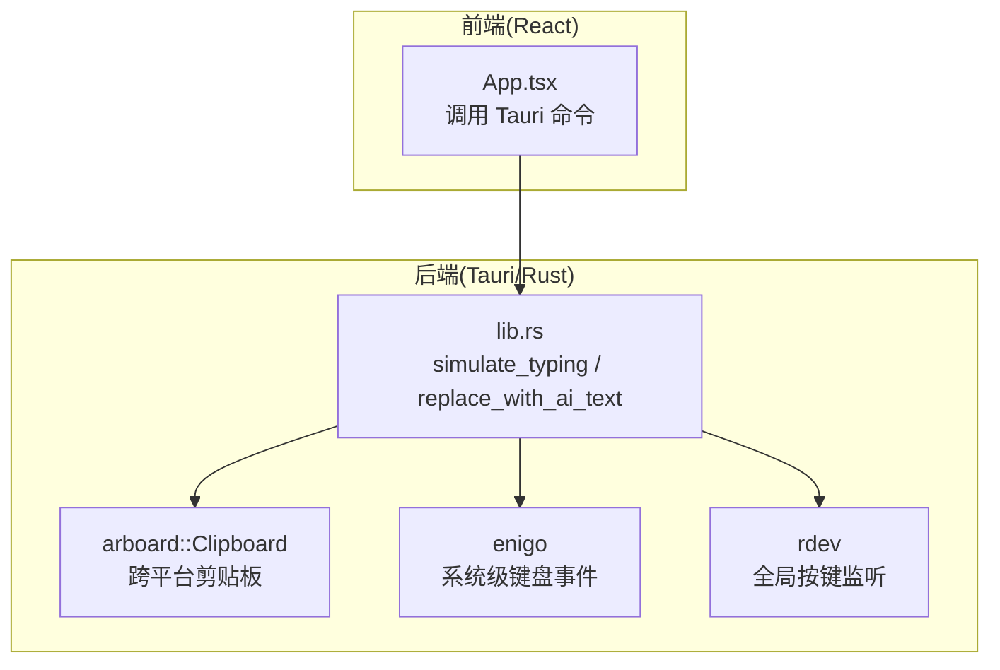
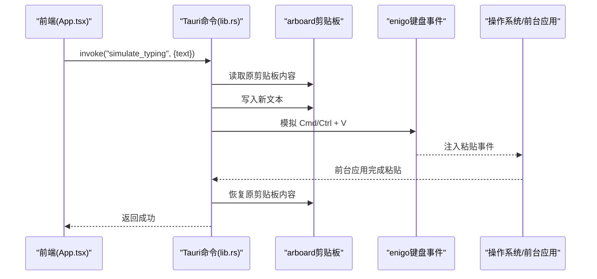
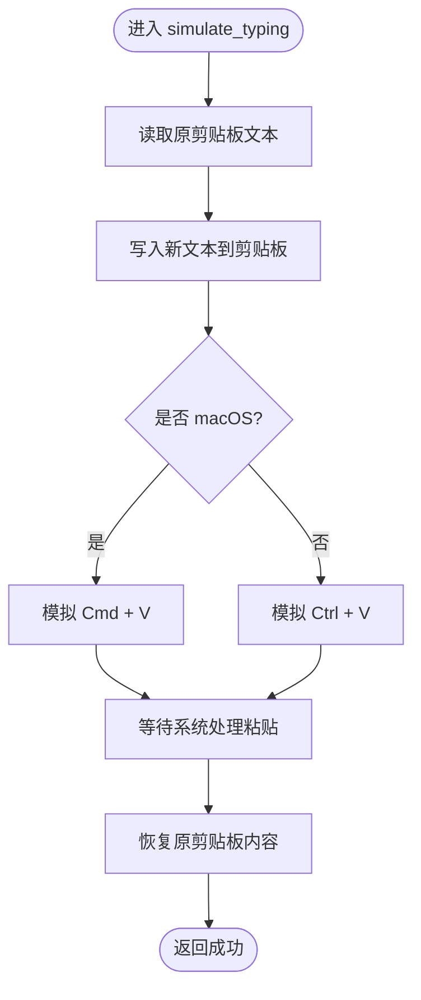
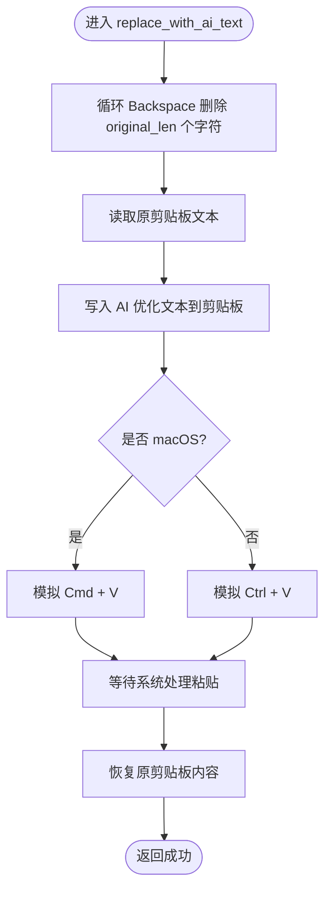
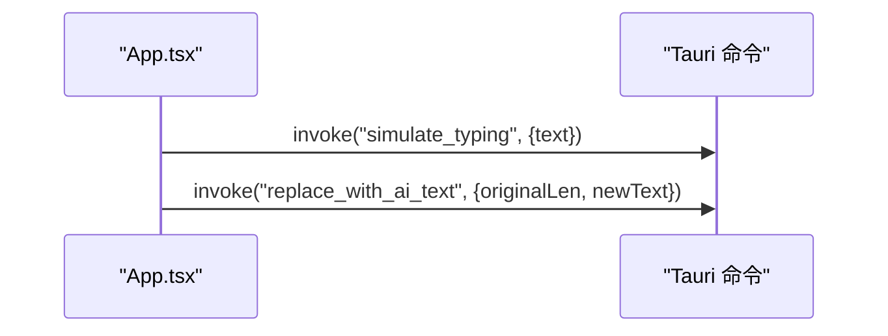
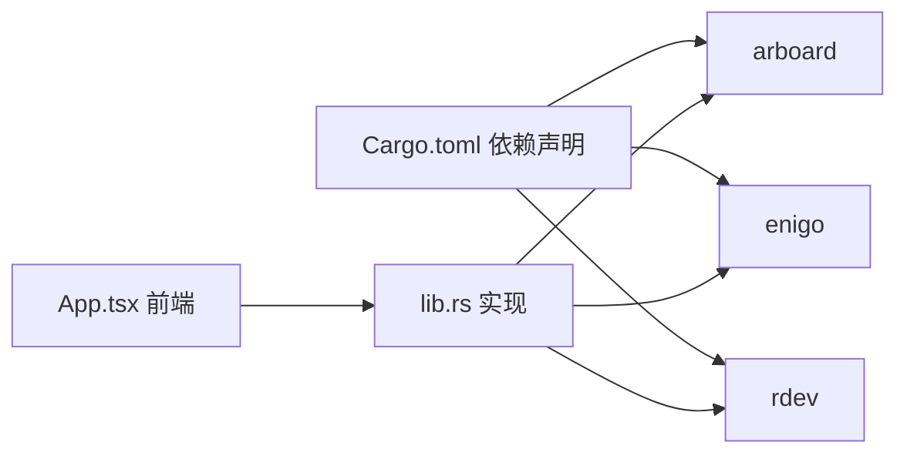

# 剪贴板操作

<cite>
**本文引用的文件**   
- [src-tauri/src/lib.rs](file://src-tauri/src/lib.rs)
- [src-tauri/Cargo.toml](file://src-tauri/Cargo.toml)
- [src/App.tsx](file://src/App.tsx)
- [src-tauri/capabilities/default.json](file://src-tauri/capabilities/default.json)
</cite>

## 目录
1. [简介](#简介)
2. [项目结构](#项目结构)
3. [核心组件](#核心组件)
4. [架构总览](#架构总览)
5. [详细组件分析](#详细组件分析)
6. [依赖关系分析](#依赖关系分析)
7. [性能与稳定性考量](#性能与稳定性考量)
8. [故障排查指南](#故障排查指南)
9. [结论](#结论)

## 简介
本章节面向 VoiceFlow_AI_002 的“剪贴板操作”能力，聚焦以下目标：
- 基于 arboard 库实现跨平台剪贴板的文本读取、写入与临时内容保护恢复
- 详解 simulate_typing 与 replace_with_ai_text 两个 Tauri 命令的实现原理
- 说明不同操作系统（macOS/Windows/Linux）下快捷键模拟差异（Cmd+V vs Ctrl+V）
- 梳理线程安全与异常处理策略
- 解释剪贴板权限管理与安全考虑，以及与其它应用的交互模式

## 项目结构
剪贴板相关逻辑位于后端 Rust 层（Tauri），前端通过 invoke 调用。关键文件如下：
- src-tauri/src/lib.rs：定义并实现剪贴板与键盘模拟的核心命令
- src/App.tsx：前端在语音识别后调用剪贴板命令进行上屏或替换
- src-tauri/Cargo.toml：声明 arboard、enigo、rdev 等依赖
- src-tauri/capabilities/default.json：窗口能力与权限配置

图表来源
- [src-tauri/src/lib.rs:45-118](file://src-tauri/src/lib.rs#L45-L118)
- [src/App.tsx:394-427](file://src/App.tsx#L394-L427)
- [src-tauri/Cargo.toml:20-36](file://src-tauri/Cargo.toml#L20-L36)

章节来源
- [src-tauri/src/lib.rs:1-287](file://src-tauri/src/lib.rs#L1-L287)
- [src/App.tsx:394-427](file://src/App.tsx#L394-L427)
- [src-tauri/Cargo.toml:20-36](file://src-tauri/Cargo.toml#L20-L36)

## 核心组件
- 剪贴板访问（arboard）
  - 提供 get_text/set_text 等统一接口，屏蔽 macOS/Windows/Linux 底层差异
  - 用于保存原剪贴板内容、写入待粘贴文本、最终恢复原内容
- 键盘事件模拟（enigo）
  - 发送系统级按键组合，完成“粘贴”动作
  - 根据 target_os 条件编译选择 Cmd+V（macOS）或 Ctrl+V（Windows/Linux）
- 全局按键监听（rdev）
  - 监听用户快捷键触发，驱动整个流程（如录音转写后自动上屏）
- Tauri 命令桥接
  - 暴露 simulate_typing 与 replace_with_ai_text 给前端调用

章节来源
- [src-tauri/src/lib.rs:1-287](file://src-tauri/src/lib.rs#L1-L287)
- [src-tauri/Cargo.toml:20-36](file://src-tauri/Cargo.toml#L20-L36)

## 架构总览
整体数据流：前端发起指令 → Tauri 命令执行 → 剪贴板读写 + 键盘事件注入 → 目标应用接收粘贴 → 恢复剪贴板。

图表来源
- [src-tauri/src/lib.rs:45-75](file://src-tauri/src/lib.rs#L45-L75)
- [src/App.tsx:394-427](file://src/App.tsx#L394-L427)

## 详细组件分析

### 组件一：simulate_typing（首次上屏）
功能概述
- 将传入文本写入剪贴板，然后模拟系统“粘贴”快捷键，使当前活动应用接收文本
- 操作前后会保存并恢复原剪贴板内容，避免污染用户剪贴板

实现要点
- 使用 arboard::Clipboard 获取/设置文本
- 使用 enigo 发送系统级按键组合：
  - macOS：Meta(V) 即 Cmd+V
  - Windows/Linux：Control(V) 即 Ctrl+V
- 短暂休眠等待系统处理粘贴事件
- 最后恢复原剪贴板内容

跨平台差异处理
- 通过 #[cfg(target_os = "macos")] 分支选择 Meta 或 Control 修饰键

错误处理
- 剪贴板初始化失败、写入失败均返回错误字符串
- 恢复原剪贴板失败被忽略，保证主流程不中断

线程与并发
- 每次调用新建 Enigo 与 Clipboard 实例，避免共享状态竞争
- 使用 thread::sleep 控制时序，确保粘贴事件被前台应用正确处理

图表来源
- [src-tauri/src/lib.rs:45-75](file://src-tauri/src/lib.rs#L45-L75)

章节来源
- [src-tauri/src/lib.rs:45-75](file://src-tauri/src/lib.rs#L45-L75)

### 组件二：replace_with_ai_text（AI 优化后瞬时替换）
功能概述
- 先逐字删除刚刚输入的原文（Backspace），再将 AI 润色后的文本写入剪贴板并粘贴，达到“瞬时替换”的效果
- 同样遵循“保存原剪贴板 → 写入新文本 → 粘贴 → 恢复原剪贴板”的安全闭环

实现要点
- 循环发送 Backspace 删除指定长度的原文，每次按键间加入极短延迟，提高稳定性
- 再次使用 arboard 与 enigo 完成粘贴
- 与 simulate_typing 一致的跨平台快捷键处理与错误处理策略

适用场景
- 流式识别阶段已上屏临时文本，最终结果需要覆盖替换
- 本地模型直接输出完整文本时也可复用该流程

图表来源
- [src-tauri/src/lib.rs:77-118](file://src-tauri/src/lib.rs#L77-L118)

章节来源
- [src-tauri/src/lib.rs:77-118](file://src-tauri/src/lib.rs#L77-L118)

### 组件三：前端调用链路（App.tsx）
职责
- 在语音识别完成后，根据上下文决定调用 simulate_typing 或 replace_with_ai_text
- 记录 lastTypedLengthRef 以支持后续替换

调用时机
- 流式识别阶段：若已有临时文本，则用 replace_with_ai_text 替换
- 非流式或直接输出：使用 simulate_typing 直接上屏

图表来源
- [src/App.tsx:394-427](file://src/App.tsx#L394-L427)
- [src/App.tsx:562-640](file://src/App.tsx#L562-L640)

章节来源
- [src/App.tsx:394-427](file://src/App.tsx#L394-L427)
- [src/App.tsx:562-640](file://src/App.tsx#L562-L640)

## 依赖关系分析
- arboard：跨平台剪贴板抽象，内部封装各平台原生 API
- enigo：跨平台键盘事件注入，用于模拟粘贴快捷键
- rdev：全局按键监听，驱动上层业务（如快捷键触发录音/转写）
- Tauri：进程内命令桥接与事件总线

图表来源
- [src-tauri/Cargo.toml:20-36](file://src-tauri/Cargo.toml#L20-L36)
- [src-tauri/src/lib.rs:1-20](file://src-tauri/src/lib.rs#L1-L20)

章节来源
- [src-tauri/Cargo.toml:20-36](file://src-tauri/Cargo.toml#L20-L36)
- [src-tauri/src/lib.rs:1-20](file://src-tauri/src/lib.rs#L1-L20)

## 性能与稳定性考量
- 剪贴板 I/O 开销较小，但频繁读写可能影响用户体验；建议合并批量操作
- 粘贴前 sleep 50ms 可提升成功率，但在高负载环境下可适当延长
- Backspace 删除采用 2ms 间隔，兼顾效率与稳定性；超长文本替换时可评估增大间隔
- 每个命令独立创建 Enigo/Clipboard 实例，避免锁竞争，但存在对象创建开销；如需高频调用可考虑复用（需引入同步机制）
- 恢复原剪贴板失败被忽略，防止异常扩散；必要时可增加重试或告警

[本节为通用指导，无需具体文件引用]

## 故障排查指南
常见问题与定位思路
- 粘贴无效
  - 检查前台应用是否具备焦点
  - 确认快捷键映射是否正确（macOS 使用 Meta/V，Windows/Linux 使用 Control/V）
  - 查看日志中是否有剪贴板初始化/写入失败的错误信息
- 剪贴板内容被污染
  - 确认 restore 步骤是否执行；若失败，检查 set_text 返回值
- 替换长度不一致
  - 核对前端传入的 originalLen 与实际输入长度是否一致
- 权限问题
  - 某些系统对辅助功能/输入监控有权限要求，需在系统设置中授权

章节来源
- [src-tauri/src/lib.rs:45-118](file://src-tauri/src/lib.rs#L45-L118)

## 结论
本项目通过 arboard 与 enigo 的组合，实现了稳定可靠的跨平台剪贴板访问与键盘事件注入。simulate_typing 与 replace_with_ai_text 两个命令覆盖了“首次上屏”和“AI 优化后替换”两大典型场景，并在实现中充分考虑了：
- 跨平台差异（Cmd+V vs Ctrl+V）
- 剪贴板内容的保护与恢复
- 错误处理与健壮性
- 与前端工作流的无缝集成

建议在后续迭代中：
- 增加更细粒度的日志与指标上报
- 针对高频调用场景优化对象生命周期管理
- 增强对特殊应用/输入法的兼容性测试

[本节为总结性内容，无需具体文件引用]