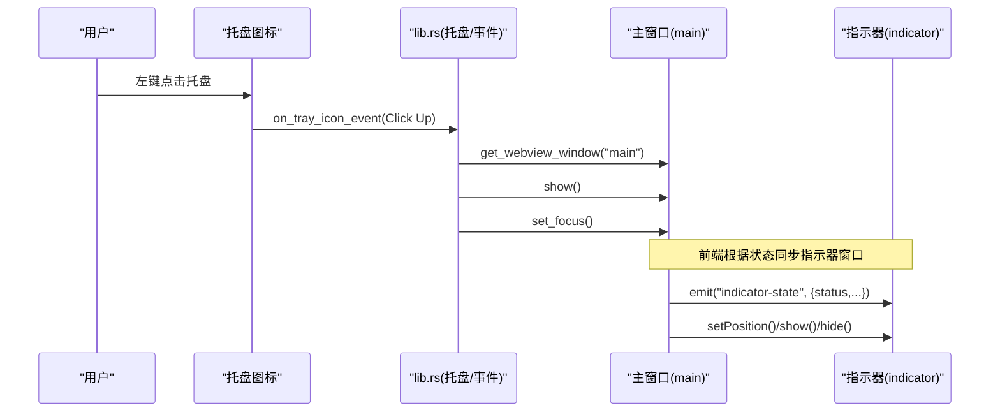
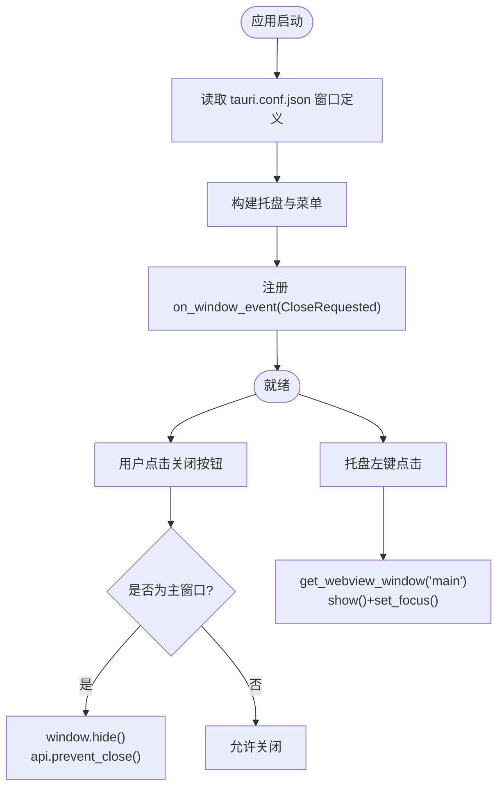
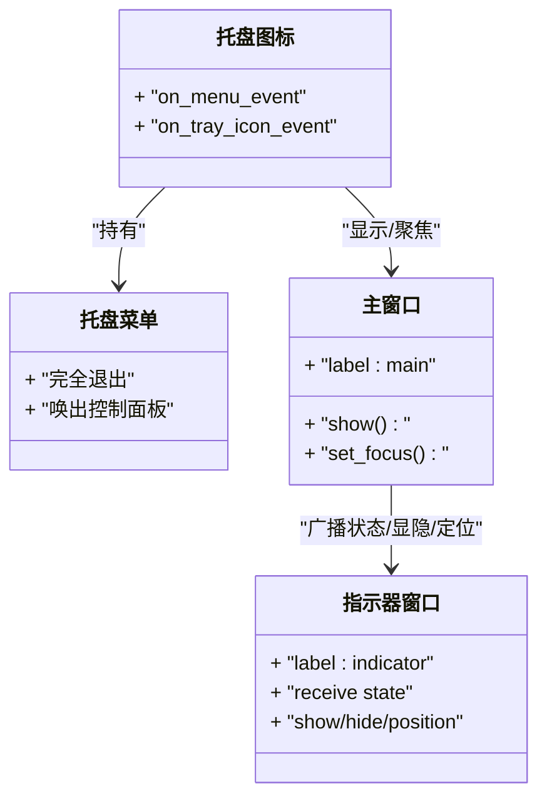
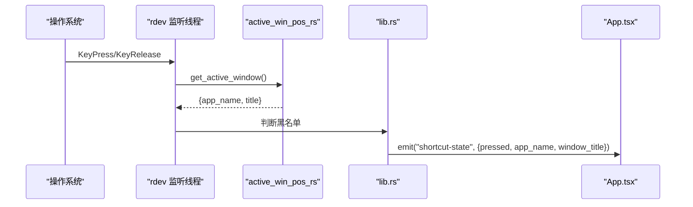
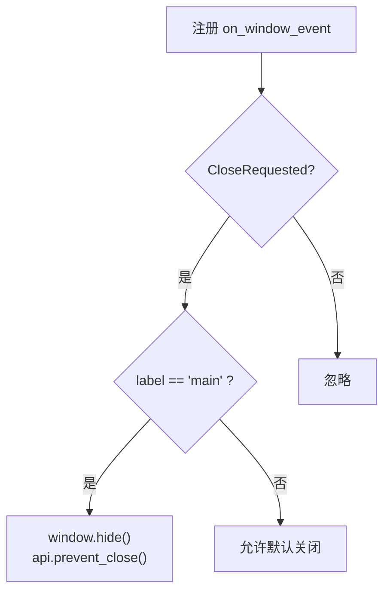
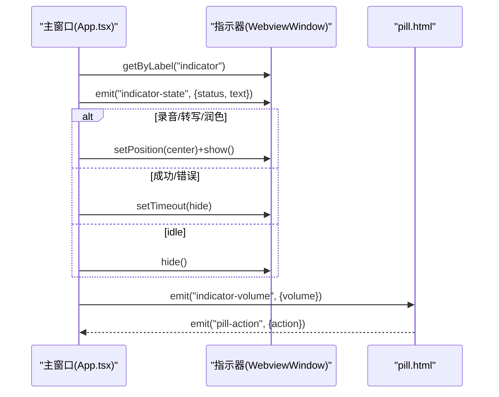
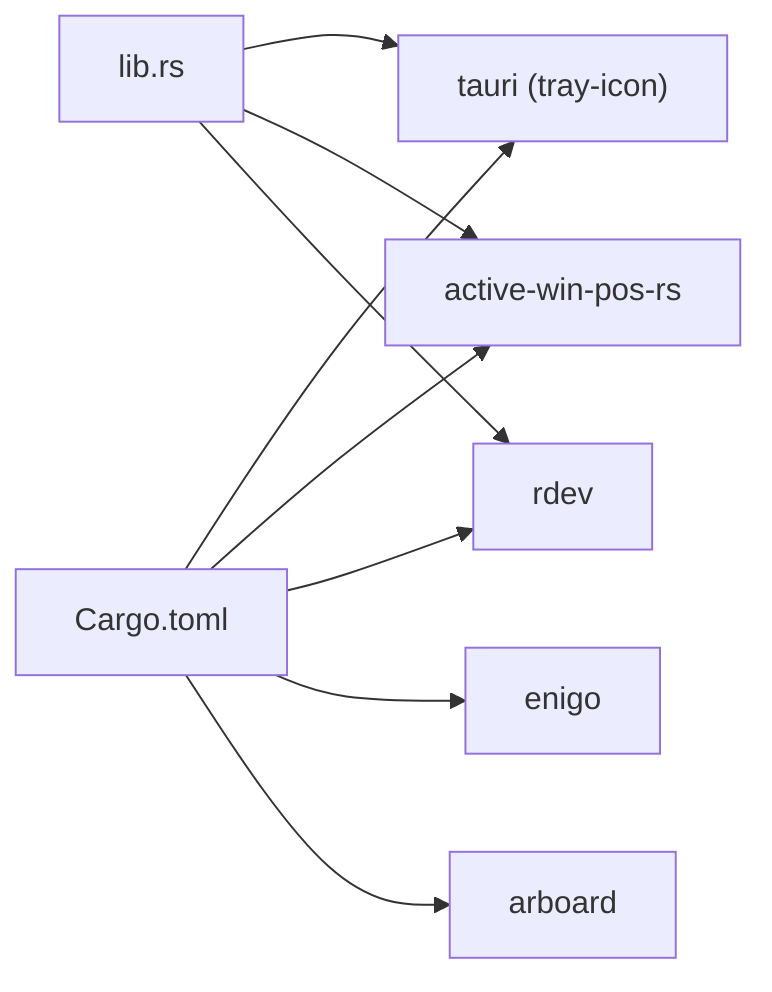

# 窗口管理

<cite>
**本文引用的文件**
- [src-tauri/src/main.rs](file://src-tauri/src/main.rs)
- [src-tauri/src/lib.rs](file://src-tauri/src/lib.rs)
- [src-tauri/Cargo.toml](file://src-tauri/Cargo.toml)
- [src-tauri/tauri.conf.json](file://src-tauri/tauri.conf.json)
- [public/pill.html](file://public/pill.html)
- [src/App.tsx](file://src/App.tsx)
- [src/components/MainPanel.tsx](file://src/components/MainPanel.tsx)
</cite>

## 目录
1. [简介](#简介)
2. [项目结构](#项目结构)
3. [核心组件](#核心组件)
4. [架构总览](#架构总览)
5. [详细组件分析](#详细组件分析)
6. [依赖关系分析](#依赖关系分析)
7. [性能与资源管理](#性能与资源管理)
8. [故障排查指南](#故障排查指南)
9. [结论](#结论)

## 简介
本文件聚焦 VoiceFlow_AI_002 的窗口管理能力，围绕 Tauri v2 的窗口生命周期、托盘图标集成、活动窗口检测、事件监听模式以及多窗口协调进行系统化说明。文档既为初学者提供窗口概念入门，也为高级开发者提供自定义行为与扩展实践建议。

## 项目结构
本项目采用前后端分离：前端基于 React + Vite，后端使用 Tauri v2（Rust）。窗口定义在配置中声明，主进程负责托盘、全局快捷键、关闭拦截等系统级能力；前端负责 UI 状态与多窗口协作。

```mermaid
graph TB
subgraph "前端"
A["App.tsx<br/>窗口显隐/定位/事件"]
B["pill.html<br/>独立浮窗UI"]
C["MainPanel.tsx<br/>主面板UI"]
end
subgraph "Tauri 后端"
D["main.rs<br/>入口"]
E["lib.rs<br/>托盘/事件/命令"]
F["tauri.conf.json<br/>窗口定义"]
G["Cargo.toml<br/>依赖: tray-icon, active-win-pos-rs, rdev"]
end
A --> |调用 WebviewWindow API| B
A --> |emit/listen 事件| E
E --> |get_webview_window("main")| A
E --> |on_tray_icon_event/on_menu_event| A
F --> |声明 main/indicator 窗口| D
D --> E
G --> E
```

图表来源
- [src-tauri/tauri.conf.json:12-43](file://src-tauri/tauri.conf.json#L12-L43)
- [src-tauri/src/main.rs:4-6](file://src-tauri/src/main.rs#L4-L6)
- [src-tauri/src/lib.rs:218-286](file://src-tauri/src/lib.rs#L218-L286)
- [src/App.tsx:120-171](file://src/App.tsx#L120-L171)
- [public/pill.html:152-173](file://public/pill.html#L152-L173)

章节来源
- [src-tauri/tauri.conf.json:12-43](file://src-tauri/tauri.conf.json#L12-L43)
- [src-tauri/src/main.rs:4-6](file://src-tauri/src/main.rs#L4-L6)
- [src-tauri/src/lib.rs:218-286](file://src-tauri/src/lib.rs#L218-L286)
- [src/App.tsx:120-171](file://src/App.tsx#L120-L171)
- [public/pill.html:152-173](file://public/pill.html#L152-L173)

## 核心组件
- 窗口定义与启动
  - 通过 tauri.conf.json 声明两个窗口：主窗口 main 与指示器窗口 indicator。主窗口默认不可见，指示器窗口透明且置顶。
- 托盘图标与菜单
  - 在 lib.rs 中构建托盘菜单项“完全退出”和“唤出控制面板”，并处理托盘点击事件以显示主窗口并获取焦点。
- 窗口生命周期与关闭拦截
  - 注册 on_window_event，对 CloseRequested 事件进行处理：当主窗口被请求关闭时，隐藏窗口并阻止默认关闭，实现后台常驻。
- 活动窗口检测
  - 使用 active_win_pos_rs 获取当前活动应用名与标题，结合黑名单策略控制快捷键触发范围。
- 多窗口协调
  - 前端 App.tsx 根据状态广播到 indicator 窗口，并统一控制其显隐与屏幕居中定位；pill.html 接收状态并渲染动态岛样式。

章节来源
- [src-tauri/tauri.conf.json:12-43](file://src-tauri/tauri.conf.json#L12-L43)
- [src-tauri/src/lib.rs:225-274](file://src-tauri/src/lib.rs#L225-L274)
- [src-tauri/src/lib.rs:132-138](file://src-tauri/src/lib.rs#L132-L138)
- [src/App.tsx:120-171](file://src/App.tsx#L120-L171)
- [public/pill.html:152-173](file://public/pill.html#L152-L173)

## 架构总览
下图展示从用户交互到窗口管理的端到端流程：托盘点击或快捷键触发，后端拦截关闭事件，前端协调主窗口与指示器窗口状态与位置。



图表来源
- [src-tauri/src/lib.rs:246-260](file://src-tauri/src/lib.rs#L246-L260)
- [src/App.tsx:120-171](file://src/App.tsx#L120-L171)

## 详细组件分析

### 窗口生命周期管理（创建、显示/隐藏、焦点、关闭）
- 窗口创建
  - 由 tauri.conf.json 中的 windows 数组声明，包含 label、title、url、尺寸、alwaysOnTop、decorations、visible 等属性。
- 显示/隐藏与焦点
  - 托盘点击事件中，后端通过 app.get_webview_window("main") 获取窗口实例，调用 show() 与 set_focus()。
  - 前端在初始化后也可主动 show()，并在就绪后 hide() 收起到托盘。
- 关闭事件处理
  - 注册 on_window_event，匹配 CloseRequested 事件，若窗口标签为 "main"，则执行 window.hide() 并 api.prevent_close()，使应用保持后台运行。



图表来源
- [src-tauri/tauri.conf.json:12-43](file://src-tauri/tauri.conf.json#L12-L43)
- [src-tauri/src/lib.rs:266-274](file://src-tauri/src/lib.rs#L266-L274)
- [src-tauri/src/lib.rs:246-260](file://src-tauri/src/lib.rs#L246-L260)
- [src/App.tsx:174-181](file://src/App.tsx#L174-L181)
- [src/App.tsx:244-254](file://src/App.tsx#L244-L254)

章节来源
- [src-tauri/tauri.conf.json:12-43](file://src-tauri/tauri.conf.json#L12-L43)
- [src-tauri/src/lib.rs:266-274](file://src-tauri/src/lib.rs#L266-L274)
- [src-tauri/src/lib.rs:246-260](file://src-tauri/src/lib.rs#L246-L260)
- [src/App.tsx:174-181](file://src/App.tsx#L174-L181)
- [src/App.tsx:244-254](file://src/App.tsx#L244-L254)

### 托盘图标集成机制（菜单项、点击事件、多窗口协调）
- 菜单项配置
  - 使用 Menu::with_items 添加“完全退出”和“唤出控制面板”两项。
- 点击事件响应
  - on_menu_event 处理菜单点击：“quit”直接退出进程，“show”获取主窗口并显示+聚焦。
  - on_tray_icon_event 处理托盘图标左键点击，同样显示并聚焦主窗口。
- 多窗口协调
  - 前端根据状态向 indicator 窗口广播状态，并控制其显隐与位置；pill.html 接收状态并更新 UI。



图表来源
- [src-tauri/src/lib.rs:225-260](file://src-tauri/src/lib.rs#L225-L260)
- [src/App.tsx:120-171](file://src/App.tsx#L120-L171)
- [public/pill.html:182-252](file://public/pill.html#L182-L252)

章节来源
- [src-tauri/src/lib.rs:225-260](file://src-tauri/src/lib.rs#L225-L260)
- [src/App.tsx:120-171](file://src/App.tsx#L120-L171)
- [public/pill.html:182-252](file://public/pill.html#L182-L252)

### 活动窗口检测功能（active_win_pos_rs 的使用）
- 获取活动窗口信息
  - 使用 active_win_pos_rs::get_active_window 返回应用名与标题，封装为辅助函数供快捷键监听使用。
- 黑名单策略
  - 将活动应用名与黑名单列表比对，忽略受保护应用的快捷键触发。
- 事件广播
  - 按键按下/释放时，通过 app_handle.emit 向前端发送 "shortcut-state" 事件，携带 pressed 标志与活动窗口信息。



图表来源
- [src-tauri/src/lib.rs:132-138](file://src-tauri/src/lib.rs#L132-L138)
- [src-tauri/src/lib.rs:141-212](file://src-tauri/src/lib.rs#L141-L212)
- [src/App.tsx:257-286](file://src/App.tsx#L257-L286)

章节来源
- [src-tauri/src/lib.rs:132-138](file://src-tauri/src/lib.rs#L132-L138)
- [src-tauri/src/lib.rs:141-212](file://src-tauri/src/lib.rs#L141-L212)
- [src/App.tsx:257-286](file://src/App.tsx#L257-L286)

### 窗口事件监听器的设计模式（CloseRequested 与自定义行为）
- 事件注册
  - 使用 .on_window_event 注册回调，匹配 WindowEvent::CloseRequested。
- 自定义行为
  - 针对主窗口，隐藏窗口并阻止默认关闭，实现后台常驻；其他窗口可保留默认关闭行为。
- 可扩展性
  - 可在同一回调中按窗口 label 分支处理不同逻辑，如二次确认、保存状态等。



图表来源
- [src-tauri/src/lib.rs:266-274](file://src-tauri/src/lib.rs#L266-L274)

章节来源
- [src-tauri/src/lib.rs:266-274](file://src-tauri/src/lib.rs#L266-L274)

### 多窗口协调最佳实践（主窗口与指示器窗口）
- 状态同步
  - 主窗口根据业务状态（录音、转写、润色、成功、错误）向 indicator 窗口 emit 状态数据。
- 显隐与定位
  - 在 recording/transcribing/rewriting 状态下显示 indicator 并计算屏幕中心位置；在 success/error 延迟隐藏；idle 直接隐藏。
- 实时音量反馈
  - 主窗口轮询麦克风音量并通过 indicator-volume 事件推送至 pill.html，驱动波形动画。



图表来源
- [src/App.tsx:120-171](file://src/App.tsx#L120-L171)
- [src/App.tsx:289-354](file://src/App.tsx#L289-L354)
- [public/pill.html:182-252](file://public/pill.html#L182-L252)

章节来源
- [src/App.tsx:120-171](file://src/App.tsx#L120-L171)
- [src/App.tsx:289-354](file://src/App.tsx#L289-L354)
- [public/pill.html:182-252](file://public/pill.html#L182-L252)

## 依赖关系分析
- 关键依赖
  - tauri v2 与 tray-icon 特性用于托盘图标与窗口管理。
  - active-win-pos-rs 用于获取活动窗口信息。
  - rdev 用于全局键盘事件监听。
  - enigo 与 arboard 用于模拟输入与剪贴板操作（与窗口管理间接相关）。
- 外部库作用
  - active-win-pos-rs 提供跨平台活动窗口查询能力，配合黑名单策略限制快捷键触发范围。
  - rdev 提供底层事件驱动的全局监听，避免轮询开销。



图表来源
- [src-tauri/Cargo.toml:20-31](file://src-tauri/Cargo.toml#L20-L31)
- [src-tauri/src/lib.rs:1-14](file://src-tauri/src/lib.rs#L1-L14)

章节来源
- [src-tauri/Cargo.toml:20-31](file://src-tauri/Cargo.toml#L20-L31)
- [src-tauri/src/lib.rs:1-14](file://src-tauri/src/lib.rs#L1-L14)

## 性能与资源管理
- 事件驱动监听
  - 使用 rdev::listen 阻塞式事件循环，避免 CPU 轮询，降低功耗。
- 异步下载与解压
  - 模型下载与解压使用异步流与 spawn_blocking，避免阻塞 UI 线程。
- 内存与资源清理
  - 临时文件在下载完成后删除；窗口隐藏不销毁，减少重复创建开销。
- 定位与显隐优化
  - 仅在必要状态显示 indicator，并使用延迟隐藏避免频繁切换导致的闪烁。

[本节为通用指导，无需具体文件引用]

## 故障排查指南
- 托盘无法显示主窗口
  - 检查托盘菜单与托盘图标事件是否正确绑定；确认 get_webview_window("main") 能返回有效实例。
- 关闭窗口未隐藏而是退出
  - 确认 on_window_event 已注册且 CloseRequested 分支正确调用 prevent_close()。
- 活动窗口检测失败
  - 检查 active-win_pos_rs 是否可用；确认黑名单字符串大小写匹配逻辑。
- 指示器窗口无响应
  - 确认前端 emit 的事件名称与 pill.html listen 的名称一致；检查窗口 label 是否为 "indicator"。

章节来源
- [src-tauri/src/lib.rs:246-260](file://src-tauri/src/lib.rs#L246-L260)
- [src-tauri/src/lib.rs:266-274](file://src-tauri/src/lib.rs#L266-L274)
- [src-tauri/src/lib.rs:132-138](file://src-tauri/src/lib.rs#L132-L138)
- [src/App.tsx:120-171](file://src/App.tsx#L120-L171)

## 结论
本项目通过 Tauri v2 的窗口与托盘能力，实现了稳定的后台常驻与多窗口协同。活动窗口检测与黑名单策略提升了快捷键触发的准确性与安全性。前端通过事件系统与窗口 API 完成状态同步与 UI 联动，整体架构清晰、可扩展性强。建议在后续迭代中继续完善错误提示、日志记录与窗口状态持久化，以提升用户体验与可维护性。