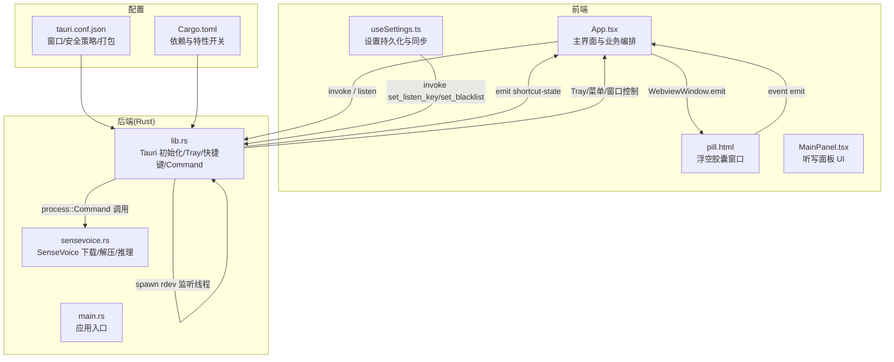
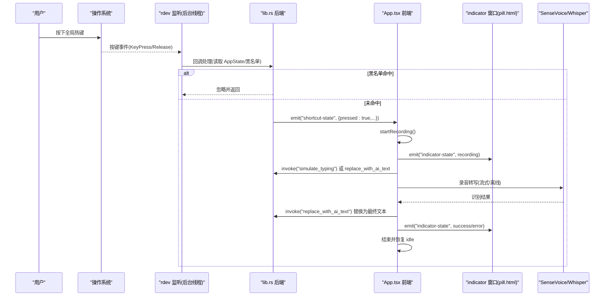
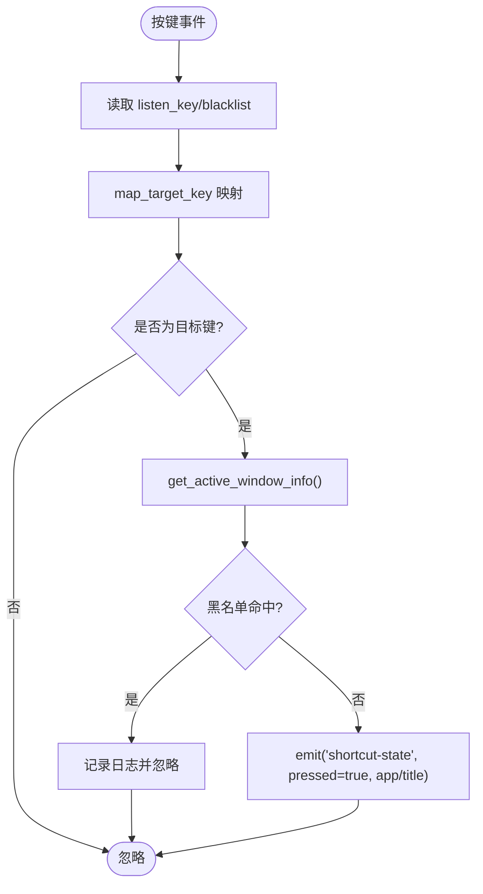
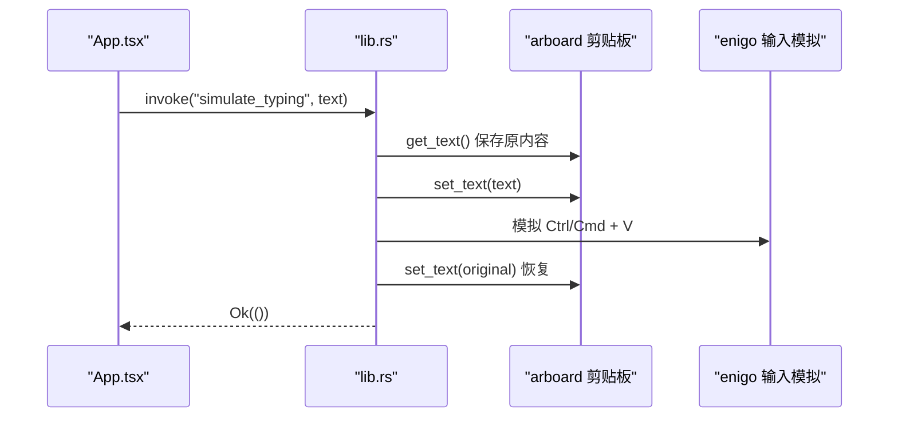
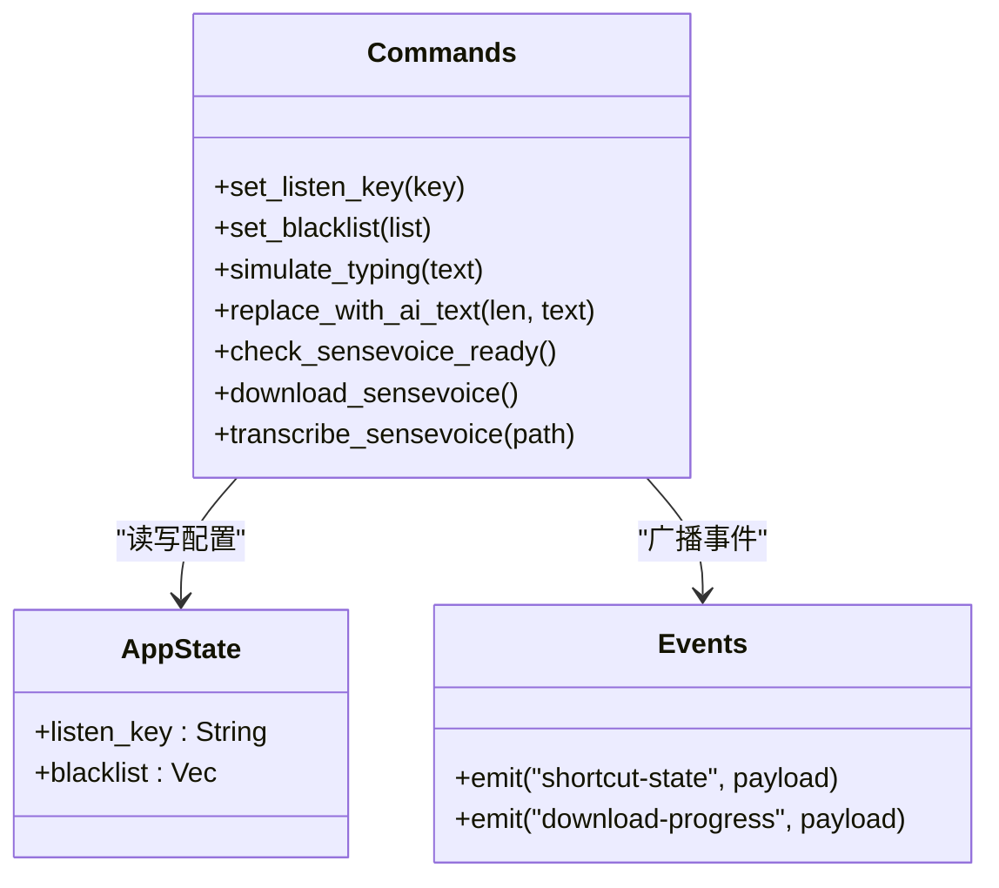
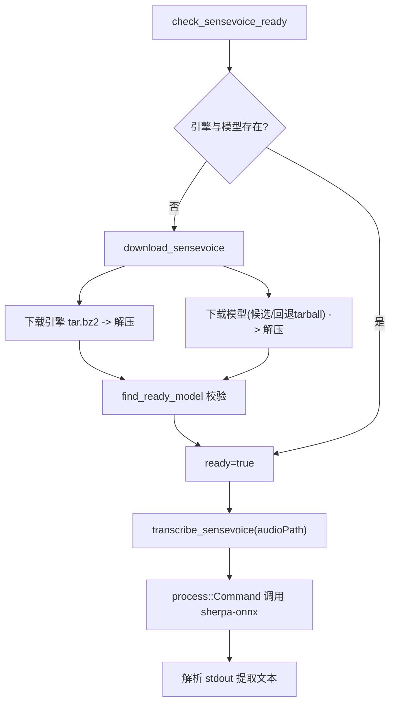
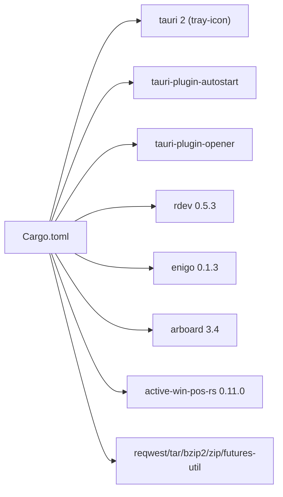

# 系统集成

<cite>
**本文引用的文件**   
- [src-tauri/src/main.rs](file://src-tauri/src/main.rs)
- [src-tauri/src/lib.rs](file://src-tauri/src/lib.rs)
- [src-tauri/src/sensevoice.rs](file://src-tauri/src/sensevoice.rs)
- [src-tauri/tauri.conf.json](file://src-tauri/tauri.conf.json)
- [src-tauri/Cargo.toml](file://src-tauri/Cargo.toml)
- [src/App.tsx](file://src/App.tsx)
- [public/pill.html](file://public/pill.html)
- [src/components/MainPanel.tsx](file://src/components/MainPanel.tsx)
- [src/hooks/useSettings.ts](file://src/hooks/useSettings.ts)
</cite>

## 目录
1. [简介](#简介)
2. [项目结构](#项目结构)
3. [核心组件](#核心组件)
4. [架构总览](#架构总览)
5. [详细组件分析](#详细组件分析)
6. [依赖关系分析](#依赖关系分析)
7. [性能与兼容性](#性能与兼容性)
8. [故障排查指南](#故障排查指南)
9. [结论](#结论)
10. [附录：Tauri 基础与扩展开发](#附录tauri-基础与扩展开发)

## 简介
本文件聚焦 VoiceFlow_AI_002 的系统集成功能，围绕以下目标展开：
- 全局快捷键监听机制（跨平台键盘事件捕获、热键注册）
- 剪贴板操作、活动窗口检测与黑名单过滤
- Tauri Commands 设计模式与前后端通信机制
- 系统级 API 调用、权限管理与安全考虑
- 自启动配置、托盘图标集成与多窗口管理
- 面向初学者的 Tauri 框架基础概念，以及面向高级开发者的系统扩展点与自定义命令开发指南
- 不同操作系统平台的兼容性与性能优化技巧

## 项目结构
本项目采用 Tauri 2 + React + TypeScript 的混合架构。Rust 后端负责系统级能力（全局快捷键、剪贴板、进程外模型推理），前端负责交互与状态展示；通过 Tauri 的事件系统与 Command 机制进行前后端通信。

图表来源
- [src-tauri/src/main.rs:1-9](file://src-tauri/src/main.rs#L1-L9)
- [src-tauri/src/lib.rs:214-286](file://src-tauri/src/lib.rs#L214-L286)
- [src-tauri/src/sensevoice.rs:295-476](file://src-tauri/src/sensevoice.rs#L295-L476)
- [src-tauri/tauri.conf.json:12-46](file://src-tauri/tauri.conf.json#L12-L46)
- [src-tauri/Cargo.toml:20-47](file://src-tauri/Cargo.toml#L20-L47)
- [src/App.tsx:1-774](file://src/App.tsx#L1-L774)
- [public/pill.html:152-278](file://public/pill.html#L152-L278)

章节来源
- [src-tauri/src/main.rs:1-9](file://src-tauri/src/main.rs#L1-L9)
- [src-tauri/src/lib.rs:214-286](file://src-tauri/src/lib.rs#L214-L286)
- [src-tauri/tauri.conf.json:12-46](file://src-tauri/tauri.conf.json#L12-L46)
- [src-tauri/Cargo.toml:20-47](file://src-tauri/Cargo.toml#L20-L47)
- [src/App.tsx:1-774](file://src/App.tsx#L1-L774)
- [public/pill.html:152-278](file://public/pill.html#L152-L278)

## 核心组件
- 全局快捷键监听器：基于 rdev 在后台线程中监听按键事件，结合 active-win-pos-rs 获取当前活动窗口信息，按黑名单过滤后通过 Tauri 事件推送至前端。
- 剪贴板与输入模拟：使用 arboard 读写剪贴板，enigo 模拟粘贴/退格等系统输入，实现“占位文本”和“AI 润色替换”。
- 活动窗口检测与黑名单：根据 app_name 模糊匹配黑名单项，阻止特定应用的快捷键触发。
- Tauri Commands：暴露 set_listen_key、set_blacklist、simulate_typing、replace_with_ai_text、SenseVoice 相关命令，供前端 invoke 调用。
- 自启动与托盘：启用 tauri-plugin-autostart 与 tray-icon 特性，提供托盘菜单与窗口显隐控制。
- 多窗口管理：定义 main 与 indicator 两个 Webview 窗口，主窗口隐藏到托盘，indicator 作为动态岛式小窗显示状态与波形。

章节来源
- [src-tauri/src/lib.rs:18-212](file://src-tauri/src/lib.rs#L18-L212)
- [src-tauri/src/lib.rs:214-286](file://src-tauri/src/lib.rs#L214-L286)
- [src-tauri/Cargo.toml:20-47](file://src-tauri/Cargo.toml#L20-L47)
- [src-tauri/tauri.conf.json:12-46](file://src-tauri/tauri.conf.json#L12-L46)
- [src/App.tsx:120-171](file://src/App.tsx#L120-L171)

## 架构总览
下图展示了从用户按下全局快捷键到最终文本上屏的完整流程，包括前端状态机、后端事件分发、剪贴板与输入模拟、以及 SenseVoice 本地推理路径。

图表来源
- [src-tauri/src/lib.rs:140-212](file://src-tauri/src/lib.rs#L140-L212)
- [src/App.tsx:256-286](file://src/App.tsx#L256-L286)
- [src/App.tsx:373-435](file://src/App.tsx#L373-L435)
- [src/App.tsx:462-640](file://src/App.tsx#L462-L640)
- [public/pill.html:182-278](file://public/pill.html#L182-L278)

## 详细组件分析

### 全局快捷键监听机制
- 跨平台键盘事件捕获
  - 使用 rdev 的 listen 在独立线程中阻塞监听系统级按键事件，支持 KeyPress 与 KeyRelease。
  - 通过 map_target_key 将配置字符串映射为 rdev::Key，默认回退为右 Control。
- 热键注册与状态同步
  - 前端 useSettings 监听 listenKey 变化，通过 invoke("set_listen_key") 写入后端 AppState.listen_key。
  - 后端 start_key_listener 每次事件回调时读取最新配置，避免重启应用即可生效。
- 活动窗口检测与黑名单过滤
  - 使用 active_win_pos_rs::get_active_window 获取 app_name 与 window_title。
  - 黑名单以逗号/换行分隔的字符串保存在前端，经 split 后通过 invoke("set_blacklist") 同步到后端 AppState.blacklist。
  - 若 app_name 包含任意黑名单子串则拦截该次快捷键触发。
- 事件派发
  - 后端通过 app_handle.emit("shortcut-state", payload) 将 pressed/app_name/window_title 推送给前端。
  - 前端 App.tsx 监听该事件，在 pressed=true 且未录音时开始录音，在 pressed=false 且正在录音时停止并处理。

图表来源
- [src-tauri/src/lib.rs:120-212](file://src-tauri/src/lib.rs#L120-L212)
- [src/hooks/useSettings.ts:85-88](file://src/hooks/useSettings.ts#L85-L88)
- [src/App.tsx:235-240](file://src/App.tsx#L235-L240)
- [src/App.tsx:256-286](file://src/App.tsx#L256-L286)

章节来源
- [src-tauri/src/lib.rs:18-212](file://src-tauri/src/lib.rs#L18-L212)
- [src/hooks/useSettings.ts:85-88](file://src/hooks/useSettings.ts#L85-L88)
- [src/App.tsx:235-240](file://src/App.tsx#L235-L240)
- [src/App.tsx:256-286](file://src/App.tsx#L256-L286)

### 剪贴板操作与输入模拟
- 剪贴板读写
  - 使用 arboard::Clipboard 保存原内容，写入临时文本，完成后恢复原内容，避免污染用户剪贴板。
- 输入模拟
  - 使用 enigo 模拟 Ctrl+V（Windows/Linux）或 Cmd+V（macOS）完成粘贴。
  - 使用 Backspace 逐字删除原文，再粘贴新文本，实现“瞬时替换”，降低输入法/应用快捷键干扰。
- 关键命令
  - simulate_typing(text)：直接粘贴文本。
  - replace_with_ai_text(original_len, new_text)：先删除 original_len 个字符，再粘贴新文本。

图表来源
- [src-tauri/src/lib.rs:45-75](file://src-tauri/src/lib.rs#L45-L75)
- [src-tauri/src/lib.rs:77-118](file://src-tauri/src/lib.rs#L77-L118)
- [src/App.tsx:389-435](file://src/App.tsx#L389-L435)
- [src/App.tsx:579-590](file://src/App.tsx#L579-L590)

章节来源
- [src-tauri/src/lib.rs:45-118](file://src-tauri/src/lib.rs#L45-L118)
- [src/App.tsx:389-435](file://src/App.tsx#L389-L435)
- [src/App.tsx:579-590](file://src/App.tsx#L579-L590)

### 活动窗口检测与黑名单过滤
- 活动窗口信息
  - 通过 active_win_pos_rs::get_active_window 获取 app_name 与 window_title，用于日志与上下文提示。
- 黑名单过滤
  - 前端将 blacklistStr 分割为数组并通过 invoke("set_blacklist") 同步到后端。
  - 后端在按键事件中判断 app_name 是否包含任一黑名单项，命中则忽略本次快捷键。

章节来源
- [src-tauri/src/lib.rs:132-176](file://src-tauri/src/lib.rs#L132-L176)
- [src/App.tsx:235-240](file://src/App.tsx#L235-L240)
- [src/hooks/useSettings.ts:33](file://src/hooks/useSettings.ts#L33)

### Tauri Commands 设计与前后端通信
- 命令注册
  - 在 lib.rs 中使用 tauri::generate_handler! 注册 set_listen_key、set_blacklist、simulate_typing、replace_with_ai_text 及 sensevoice 模块中的三个命令。
- 状态共享
  - 使用 .manage(AppState{listen_key, blacklist}) 将配置注入到全局状态，所有命令与监听线程均可读写。
- 事件通道
  - 后端通过 app_handle.emit 向前端广播事件（如 shortcut-state、download-progress）。
  - 前端通过 @tauri-apps/api/event 的 listen 订阅事件，或通过 WebviewWindow.emit 向其他窗口发送消息。

图表来源
- [src-tauri/src/lib.rs:18-43](file://src-tauri/src/lib.rs#L18-L43)
- [src-tauri/src/lib.rs:275-283](file://src-tauri/src/lib.rs#L275-L283)
- [src-tauri/src/sensevoice.rs:295-476](file://src-tauri/src/sensevoice.rs#L295-L476)

章节来源
- [src-tauri/src/lib.rs:275-283](file://src-tauri/src/lib.rs#L275-L283)
- [src-tauri/src/sensevoice.rs:295-476](file://src-tauri/src/sensevoice.rs#L295-L476)

### 自启动配置
- 插件启用
  - 后端通过 .plugin(tauri_plugin_autostart::Builder::new().build()) 启用自启动。
- 前端控制
  - 使用 @tauri-apps/plugin-autostart 的 enable/disable/isEnabled 在前端切换自启动状态。

章节来源
- [src-tauri/src/lib.rs:218-219](file://src-tauri/src/lib.rs#L218-L219)
- [src/App.tsx:93-117](file://src/App.tsx#L93-L117)

### 托盘图标集成与窗口显隐
- 托盘菜单
  - 使用 TrayIconBuilder 创建托盘图标与菜单项（完全退出、唤出控制面板）。
- 窗口行为
  - 关闭 main 窗口时执行 prevent_close 并 hide，保持后台运行。
  - 点击托盘图标或菜单“唤出”时 show 并 set_focus。

章节来源
- [src-tauri/src/lib.rs:225-274](file://src-tauri/src/lib.rs#L225-L274)

### 多窗口管理机制
- 窗口定义
  - tauri.conf.json 中定义 main 与 indicator 两个窗口，indicator 透明、无边框、置顶、跳过任务栏。
- 窗口间通信
  - 主窗口通过 WebviewWindow.getByLabel("indicator").emit 向 indicator 广播状态与音量数据。
  - indicator 通过 event emit 将取消/提交动作发回主窗口。

章节来源
- [src-tauri/tauri.conf.json:14-42](file://src-tauri/tauri.conf.json#L14-L42)
- [src/App.tsx:120-171](file://src/App.tsx#L120-L171)
- [public/pill.html:182-278](file://public/pill.html#L182-L278)

### SenseVoice 本地推理与资源管理
- 检查就绪
  - check_sensevoice_ready 校验引擎可执行文件与模型文件是否存在。
- 自动下载与解压
  - download_sensevoice 优先下载国内镜像源，失败回退 tarball；使用原子解压与重命名保证一致性。
  - 下载过程通过 download-progress 事件上报进度。
- 推理调用
  - transcribe_sensevoice 通过 std::process::Command 调用 sherpa-onnx-offline.exe，传入模型与 tokens 路径，解析 stdout 得到文本。

图表来源
- [src-tauri/src/sensevoice.rs:295-476](file://src-tauri/src/sensevoice.rs#L295-L476)

章节来源
- [src-tauri/src/sensevoice.rs:295-476](file://src-tauri/src/sensevoice.rs#L295-L476)

## 依赖关系分析
- 后端依赖
  - tauri 2（tray-icon 特性）、tauri-plugin-opener、tauri-plugin-autostart（非移动端）
  - rdev 0.5.3（全局键盘监听）
  - enigo 0.1.3（输入模拟）
  - arboard 3.4（剪贴板）
  - active-win-pos-rs 0.11.0（活动窗口）
  - reqwest/tar/bzip2/zip/futures-util（网络下载与归档）
- 前端依赖
  - @tauri-apps/api/core、event、window、webviewWindow、plugin-autostart、path、plugin-fs

图表来源
- [src-tauri/Cargo.toml:20-47](file://src-tauri/Cargo.toml#L20-L47)

章节来源
- [src-tauri/Cargo.toml:20-47](file://src-tauri/Cargo.toml#L20-L47)

## 性能与兼容性
- 性能优化
  - 后台线程监听：rdev::listen 在独立线程运行，避免阻塞主循环。
  - 异步下载与解压：download_file 使用 reqwest 流式下载，unpack_tar_bz2_atomic 在 spawn_blocking 中执行，减少 UI 卡顿。
  - 最小化输入延迟：replace_with_ai_text 使用极短 sleep 确保每个退格被应用接收，同时避免过度占用 CPU。
- 兼容性处理
  - 跨平台粘贴组合键：macOS 使用 Meta+V，其他平台使用 Control+V。
  - 多镜像源与回退策略：SenseVoice 模型优先国内镜像，失败回退 tarball，提高首次安装成功率。
  - 安全策略：tauri.conf.json 中 CSP 限制脚本与连接来源，仅允许必要域名与本地端口。
- 建议
  - 对高频事件（如音量采集）使用节流/去抖，避免过多 emit 造成前端渲染压力。
  - 对于长耗时操作（模型下载/解压）始终通过事件反馈进度，提升用户体验。

[本节为通用指导，不直接分析具体文件]

## 故障排查指南
- 快捷键无响应
  - 确认 listenKey 已同步至后端（useSettings 会 invoke set_listen_key）。
  - 检查黑名单是否命中当前活动应用。
  - 查看后端日志输出（env_logger 初始化于 run 前）。
- 剪贴板异常
  - 确认 arboard 初始化成功，必要时重试。
  - 注意某些应用可能屏蔽外部粘贴，尝试在其他编辑器测试。
- SenseVoice 无法使用
  - 检查 check_sensevoice_ready 返回值，若为 false 则重新 download_sensevoice。
  - 观察 download-progress 事件，定位下载阶段错误。
  - 确认 sherpa-onnx-offline.exe 可执行权限与路径正确。
- 窗口问题
  - main 窗口关闭被拦截属于预期行为（prevent_close + hide）。
  - indicator 窗口需由主窗口主动 show/hide，否则不会自动出现。

章节来源
- [src-tauri/src/lib.rs:214-286](file://src-tauri/src/lib.rs#L214-L286)
- [src-tauri/src/sensevoice.rs:295-476](file://src-tauri/src/sensevoice.rs#L295-L476)
- [src/App.tsx:242-254](file://src/App.tsx#L242-L254)

## 结论
本项目通过 Tauri 将系统级能力与前端体验良好融合：rdev 提供稳定的全局快捷键监听，arboard+enigo 实现可靠的剪贴板与输入模拟，active-win-pos-rs 配合黑名单增强可用性；SenseVoice 的自动下载与原子解压提升了鲁棒性；托盘与多窗口机制完善了桌面应用形态。整体架构清晰、职责分明，具备良好的可扩展性与跨平台兼容性。

[本节为总结，不直接分析具体文件]

## 附录：Tauri 基础与扩展开发
- 基本概念
  - 入口：main.rs 调用 tauri_app_lib::run()。
  - 构建：lib.rs 中 tauri::Builder 链式配置插件、状态、setup、事件处理器与命令。
  - 配置：tauri.conf.json 定义窗口、安全策略与打包选项。
- 自定义命令开发指南
  - 在 Rust 侧使用 #[tauri::command] 声明函数，并在 generate_handler! 中注册。
  - 通过 State<'_, AppState> 访问共享状态，使用 AppHandle 进行事件广播与窗口操作。
  - 前端通过 @tauri-apps/api/core 的 invoke 调用命令，通过 event 的 listen 订阅事件。
- 权限与安全
  - 使用 capabilities/default.json 与 desktop.json 控制能力范围（如需进一步收紧请按需调整）。
  - CSP 严格限制脚本来源，避免注入风险。
- 扩展点
  - 新增系统级功能：在 lib.rs 中增加新的 command 与事件，或在 sensevoice.rs 中扩展模型管理逻辑。
  - 多窗口扩展：在 tauri.conf.json 中追加窗口定义，前端通过 WebviewWindow API 管理生命周期与通信。

章节来源
- [src-tauri/src/main.rs:1-9](file://src-tauri/src/main.rs#L1-L9)
- [src-tauri/src/lib.rs:214-286](file://src-tauri/src/lib.rs#L214-L286)
- [src-tauri/tauri.conf.json:12-46](file://src-tauri/tauri.conf.json#L12-L46)