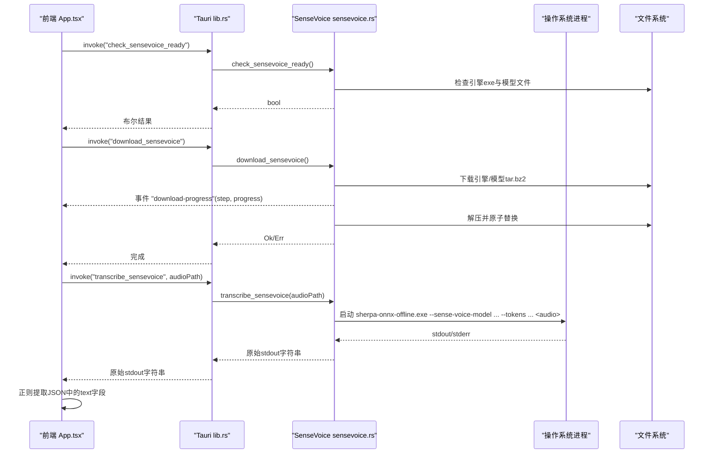
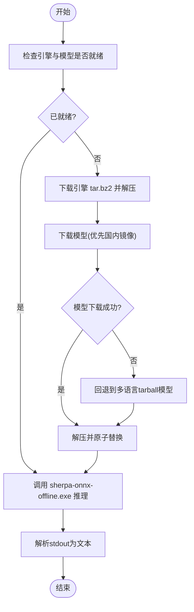
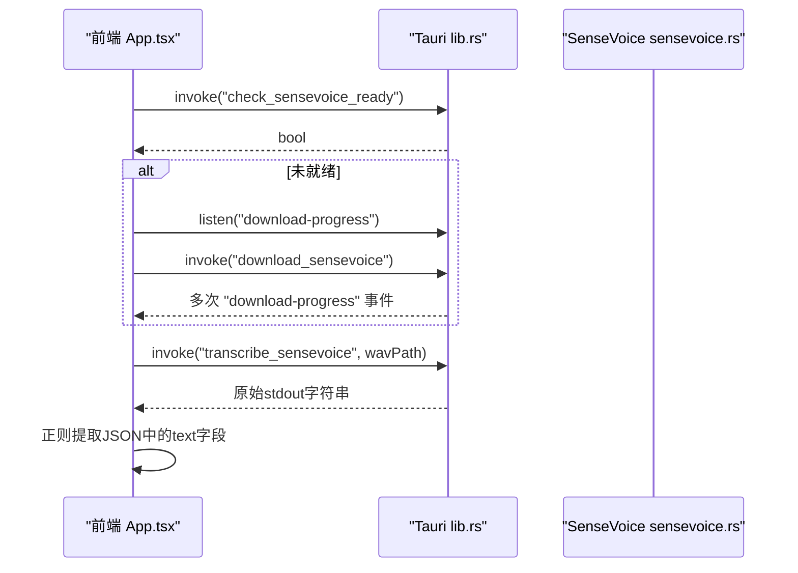
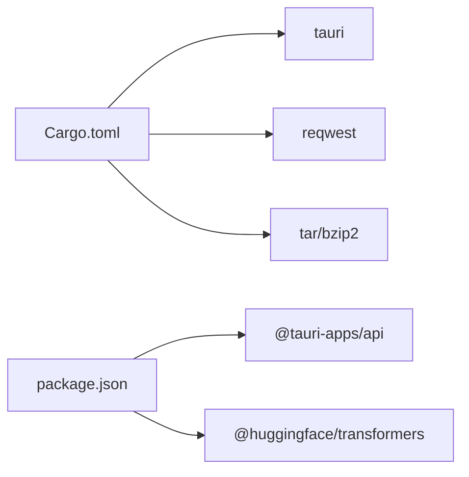

# SenseVoice 原生推理引擎

<cite>
**本文引用的文件列表**
- [src-tauri/src/sensevoice.rs](file://src-tauri/src/sensevoice.rs)
- [src-tauri/src/lib.rs](file://src-tauri/src/lib.rs)
- [src-tauri/src/main.rs](file://src-tauri/src/main.rs)
- [src-tauri/Cargo.toml](file://src-tauri/Cargo.toml)
- [src-tauri/tauri.conf.json](file://src-tauri/tauri.conf.json)
- [src/App.tsx](file://src/App.tsx)
- [src/utils/audio.ts](file://src/utils/audio.ts)
- [src/utils/api_asr.ts](file://src/utils/api_asr.ts)
- [src/utils/whisper.ts](file://src/utils/whisper.ts)
</cite>

## 目录
1. [简介](#简介)
2. [项目结构](#项目结构)
3. [核心组件](#核心组件)
4. [架构总览](#架构总览)
5. [详细组件分析](#详细组件分析)
6. [依赖关系分析](#依赖关系分析)
7. [性能与内存管理](#性能与内存管理)
8. [故障排查指南](#故障排查指南)
9. [结论](#结论)
10. [附录：API 调用示例与最佳实践](#附录api-调用示例与最佳实践)

## 简介
本技术文档面向 SenseVoice 原生推理引擎，聚焦于基于 Rust 实现的 Tauri 后端如何集成 sherpa-onnx 离线识别引擎、下载并管理模型资源、通过子进程调用 ONNX Runtime 进行语音转写，以及与前端 TypeScript 的 IPC 通信协议。文档覆盖以下要点：
- Tauri 命令注册与事件通道（download-progress、shortcut-state）
- 模型与引擎文件的下载、校验、解压与原子替换策略
- 音频预处理（Float32Array -> WAV）、结果后处理（正则提取文本）
- 与前端 TypeScript 的数据格式转换与错误传播机制
- 多语言支持、实时识别模式与批量处理的实现现状与建议
- 编译配置、依赖管理与部署注意事项

## 项目结构
本项目采用 Tauri + React + TypeScript 的前后端混合架构：
- 前端（React + Vite）负责 UI、录音、流式分片与状态展示
- 后端（Rust + Tauri）提供系统级能力：全局快捷键监听、剪贴板粘贴、子进程调用 sherpa-onnx 执行推理
- 模型与引擎以 tar.bz2 包形式下载到应用数据目录，按需解压并缓存

```mermaid
graph TB
subgraph "前端"
A["App.tsx<br/>状态机与IPC调用"]
B["audio.ts<br/>录音与WAV编码"]
C["whisper.ts<br/>浏览器端Whisper(可选)"]
D["api_asr.ts<br/>云端ASR(可选)"]
end
subgraph "Tauri 后端"
E["lib.rs<br/>命令注册/托盘/快捷键"]
F["sensevoice.rs<br/>模型下载/校验/子进程推理"]
G["main.rs<br/>入口"]
end
subgraph "外部资源"
H["sherpa-onnx 引擎(.tar.bz2)"]
I["SenseVoice 模型(.onnx + tokens.txt)"]
end
A --> |invoke("check_sensevoice_ready")| E
A --> |invoke("download_sensevoice")| E
A --> |invoke("transcribe_sensevoice")| E
A --> |listen("download-progress")| E
A --> |listen("shortcut-state")| E
E --> F
F --> |spawn_process| H
F --> |读取| I
B --> A
C --> A
D --> A
```

图表来源
- [src/App.tsx:186-221](file://src/App.tsx#L186-L221)
- [src-tauri/src/lib.rs:275-283](file://src-tauri/src/lib.rs#L275-L283)
- [src-tauri/src/sensevoice.rs:295-476](file://src-tauri/src/sensevoice.rs#L295-L476)
- [src/utils/audio.ts:1-221](file://src/utils/audio.ts#L1-L221)
- [src/utils/whisper.ts:1-174](file://src/utils/whisper.ts#L1-L174)
- [src/utils/api_asr.ts:1-73](file://src/utils/api_asr.ts#L1-L73)

章节来源
- [src-tauri/src/lib.rs:275-283](file://src-tauri/src/lib.rs#L275-L283)
- [src-tauri/src/sensevoice.rs:295-476](file://src-tauri/src/sensevoice.rs#L295-L476)
- [src/App.tsx:186-221](file://src/App.tsx#L186-L221)

## 核心组件
- 模型与引擎管理（sensevoice.rs）
  - 检查就绪：检查引擎可执行文件与模型文件是否存在
  - 下载流程：优先从国内镜像下载模型，失败回退到官方 tarball；引擎下载包含多个镜像源
  - 原子解压：使用临时目录解压并校验“ready”文件，成功后原子替换目标目录
  - 推理调用：通过 std::process::Command 启动 sherpa-onnx-offline.exe，传入模型路径与 tokens 路径，返回标准输出
- Tauri 命令与事件（lib.rs）
  - 注册命令：check_sensevoice_ready、download_sensevoice、transcribe_sensevoice
  - 事件广播：download-progress（前端进度条）、shortcut-state（全局快捷键）
- 前端集成（App.tsx）
  - 初始化流程：根据设置选择 SenseVoice 或 Whisper；SenseVoice 未就绪时触发下载并监听进度
  - 录音与转写：将 Float32Array 转为 WAV 写入本地临时文件，调用 transcribe_sensevoice 获取原始输出，再解析出最终文本
  - 错误传播：捕获异常并更新 UI 状态

章节来源
- [src-tauri/src/sensevoice.rs:295-476](file://src-tauri/src/sensevoice.rs#L295-L476)
- [src-tauri/src/lib.rs:275-283](file://src-tauri/src/lib.rs#L275-L283)
- [src/App.tsx:186-221](file://src/App.tsx#L186-L221)

## 架构总览
下图展示了 SenseVoice 原生推理的关键调用链路与数据流向：



图表来源
- [src/App.tsx:186-221](file://src/App.tsx#L186-L221)
- [src-tauri/src/lib.rs:275-283](file://src-tauri/src/lib.rs#L275-L283)
- [src-tauri/src/sensevoice.rs:295-476](file://src-tauri/src/sensevoice.rs#L295-L476)

## 详细组件分析

### 模型与引擎管理（sensevoice.rs）
- 关键常量与候选模型
  - 定义了引擎目录、就绪文件、主模型与多语言 tarball 模型的目录与文件名
  - 定义了两个候选模型集（primary 与 manyeyes），以及一个多语言 tarball 模型
- 下载与校验
  - 下载函数支持多镜像重试、断点续传（按块写入）、进度事件上报、完整性校验（content-length 或预期大小）
  - 原子解压：先解压到 staging 目录，校验 ready 文件存在后，重命名到目标目录，清理 staging
- 模型发现
  - find_ready_model 会遍历候选模型与 tarball 模型，只要 model.onnx 与 tokens.txt 同时存在即视为就绪
- 推理调用
  - 通过命令行参数传递模型与 tokens 路径，并将音频路径作为输入，返回 stdout 内容



图表来源
- [src-tauri/src/sensevoice.rs:216-232](file://src-tauri/src/sensevoice.rs#L216-L232)
- [src-tauri/src/sensevoice.rs:234-293](file://src-tauri/src/sensevoice.rs#L234-L293)
- [src-tauri/src/sensevoice.rs:310-443](file://src-tauri/src/sensevoice.rs#L310-L443)
- [src-tauri/src/sensevoice.rs:445-476](file://src-tauri/src/sensevoice.rs#L445-L476)

章节来源
- [src-tauri/src/sensevoice.rs:216-232](file://src-tauri/src/sensevoice.rs#L216-L232)
- [src-tauri/src/sensevoice.rs:234-293](file://src-tauri/src/sensevoice.rs#L234-L293)
- [src-tauri/src/sensevoice.rs:310-443](file://src-tauri/src/sensevoice.rs#L310-L443)
- [src-tauri/src/sensevoice.rs:445-476](file://src-tauri/src/sensevoice.rs#L445-L476)

### Tauri 命令与事件（lib.rs）
- 命令注册
  - 注册了 SenseVoice 相关的三个命令：check_sensevoice_ready、download_sensevoice、transcribe_sensevoice
- 事件通道
  - download-progress：用于前端显示下载进度与步骤
  - shortcut-state：全局快捷键按下/释放事件，携带当前活动窗口信息
- 其他功能
  - 模拟粘贴、替换文本、黑名单过滤等辅助能力

章节来源
- [src-tauri/src/lib.rs:275-283](file://src-tauri/src/lib.rs#L275-L283)
- [src-tauri/src/lib.rs:140-212](file://src-tauri/src/lib.rs#L140-L212)

### 前端集成与 IPC 协议（App.tsx）
- 初始化流程
  - 若选择 SenseVoice，则调用 check_sensevoice_ready；未就绪则监听 download-progress 并调用 download_sensevoice
- 录音与转写
  - 使用 AudioRecorder 采集音频，必要时将 Float32Array 转换为 WAV 字节数组并写入临时文件
  - 调用 transcribe_sensevoice 获取原始 stdout，使用正则匹配 JSON 中的 text 字段，否则取最后一行作为兜底
- 错误传播
  - 捕获异常并设置 errorMessage 与 status，UI 层据此提示用户



图表来源
- [src/App.tsx:186-221](file://src/App.tsx#L186-L221)
- [src/App.tsx:516-544](file://src/App.tsx#L516-L544)
- [src-tauri/src/lib.rs:275-283](file://src-tauri/src/lib.rs#L275-L283)
- [src-tauri/src/sensevoice.rs:445-476](file://src-tauri/src/sensevoice.rs#L445-L476)

章节来源
- [src/App.tsx:186-221](file://src/App.tsx#L186-L221)
- [src/App.tsx:516-544](file://src/App.tsx#L516-L544)

### 音频预处理与结果后处理
- 音频预处理
  - AudioRecorder 类负责麦克风采集、分片回调、VAD 静音切除与合并
  - float32ToWav 将 Float32Array 编码为 16-bit PCM WAV 字节数组
- 结果后处理
  - 前端对 stdout 进行正则匹配，尝试提取 JSON 中的 text 字段；若无 JSON，则取最后一行作为兜底

章节来源
- [src/utils/audio.ts:1-221](file://src/utils/audio.ts#L1-L221)
- [src/App.tsx:516-544](file://src/App.tsx#L516-L544)

## 依赖关系分析
- Rust 依赖（Cargo.toml）
  - tauri、serde、reqwest（网络下载）、tar/bzip2（解压）、futures-util（异步流）
- 前端依赖（package.json）
  - @tauri-apps/api、@huggingface/transformers（Whisper 浏览器端，可选）
- 运行时依赖
  - sherpa-onnx 引擎与 SenseVoice 模型在首次使用时自动下载并缓存至应用数据目录



图表来源
- [src-tauri/Cargo.toml:20-36](file://src-tauri/Cargo.toml#L20-L36)
- [package.json:13-22](file://package.json#L13-L22)

章节来源
- [src-tauri/Cargo.toml:20-36](file://src-tauri/Cargo.toml#L20-L36)
- [package.json:13-22](file://package.json#L13-L22)

## 性能与内存管理
- 模型与引擎缓存
  - 引擎与模型文件持久化到应用数据目录，后续启动直接复用，避免重复下载
- 原子解压与校验
  - 使用临时目录解压并校验 ready 文件，成功后原子替换，降低损坏风险
- 推理性能
  - 通过 sherpa-onnx 的 ONNX Runtime 执行推理，具体性能取决于硬件与模型精度（int8/fp32）
- 内存管理建议
  - 对于长会话，建议限制单次音频长度，避免一次性加载过大音频
  - 可在前端增加分段上传与增量拼接策略（当前实现为整段提交）

[本节为通用指导，不直接分析具体文件]

## 故障排查指南
- 下载失败
  - 现象：download-progress 长时间无进展或报错
  - 排查：检查网络连通性与镜像可用性；确认预期文件大小与实际一致
- 模型未就绪
  - 现象：check_sensevoice_ready 返回 false
  - 排查：确认 sherpa-onnx 引擎 exe 与模型 onnx/tokens.txt 是否存在
- 推理出错
  - 现象：transcribe_sensevoice 抛出异常或返回空文本
  - 排查：检查 sherpa-onnx 版本与模型兼容性；确认音频路径有效且格式正确
- 前端解析失败
  - 现象：stdout 非 JSON 导致无法提取 text
  - 排查：查看原始 stdout 内容，调整正则或取最后一行兜底

章节来源
- [src-tauri/src/sensevoice.rs:295-476](file://src-tauri/src/sensevoice.rs#L295-L476)
- [src/App.tsx:516-544](file://src/App.tsx#L516-L544)

## 结论
SenseVoice 原生推理引擎通过 Tauri 命令与事件通道实现了端到端的离线语音识别流程。其优势在于：
- 无需云端依赖，模型与引擎本地缓存，首用下载、后续快速启动
- 多镜像与回退策略提升下载成功率
- 原子解压与校验保障资源完整性
- 前端与后端 IPC 清晰，错误传播完善

建议在后续迭代中：
- 引入更稳健的 stdout 解析策略（如结构化日志或 JSON 输出）
- 支持流式推理（chunked input）以降低延迟
- 增加更多模型选项与量化级别控制

[本节为总结性内容，不直接分析具体文件]

## 附录：API 调用示例与最佳实践

### 初始化与下载
- 前端调用
  - 检查就绪：invoke("check_sensevoice_ready")
  - 监听进度：listen("download-progress")
  - 触发下载：invoke("download_sensevoice")
- 后端行为
  - 下载引擎与模型，解压并原子替换，完成后发送 "Done" 进度事件

章节来源
- [src/App.tsx:186-221](file://src/App.tsx#L186-L221)
- [src-tauri/src/sensevoice.rs:310-443](file://src-tauri/src/sensevoice.rs#L310-L443)

### 转写调用
- 前端准备
  - 使用 AudioRecorder 采集音频，必要时将 Float32Array 转为 WAV 并写入临时文件
- 后端推理
  - 调用 transcribe_sensevoice(audioPath)，返回 stdout
- 前端后处理
  - 正则提取 JSON 中的 text 字段，否则取最后一行

章节来源
- [src/utils/audio.ts:1-221](file://src/utils/audio.ts#L1-L221)
- [src/App.tsx:516-544](file://src/App.tsx#L516-L544)
- [src-tauri/src/sensevoice.rs:445-476](file://src-tauri/src/sensevoice.rs#L445-L476)

### 错误处理与重试
- 前端捕获异常并更新状态
- 提供“重试下载”按钮，重新触发 download_sensevoice
- 针对网络异常与解析失败的兜底逻辑

章节来源
- [src/App.tsx:214-221](file://src/App.tsx#L214-L221)
- [src/App.tsx:539-544](file://src/App.tsx#L539-L544)

### 多语言支持与实时识别模式
- 多语言支持
  - 当前通过多语言 tarball 模型（zh-en-ja-ko-yue-int8）实现
- 实时识别模式
  - 当前实现为整段提交；建议未来接入 sherpa-onnx 的流式 API 或分块推理以降低延迟

章节来源
- [src-tauri/src/sensevoice.rs:19-20](file://src-tauri/src/sensevoice.rs#L19-L20)
- [src-tauri/src/sensevoice.rs:310-443](file://src-tauri/src/sensevoice.rs#L310-L443)

### 批量处理能力
- 当前设计为单任务串行处理
- 建议扩展为队列与并发控制，避免阻塞 UI 线程

[本节为概念性建议，不直接分析具体文件]

### 编译配置、依赖管理与部署注意事项
- 编译配置
  - release profile 启用 strip、lto、opt-level=z、codegen-units=1、panic=abort，优化体积与性能
- 依赖管理
  - Rust 侧使用 reqwest、tar、bzip2 进行网络与压缩处理
  - 前端使用 @tauri-apps/api 与 transformers.js（可选）
- 部署注意
  - 确保应用数据目录有读写权限
  - 首次运行需允许下载引擎与模型，注意防火墙与代理设置
  - Windows 平台需信任 sherpa-onnx-offline.exe 签名或添加例外

章节来源
- [src-tauri/Cargo.toml:41-47](file://src-tauri/Cargo.toml#L41-L47)
- [src-tauri/tauri.conf.json:12-46](file://src-tauri/tauri.conf.json#L12-46)