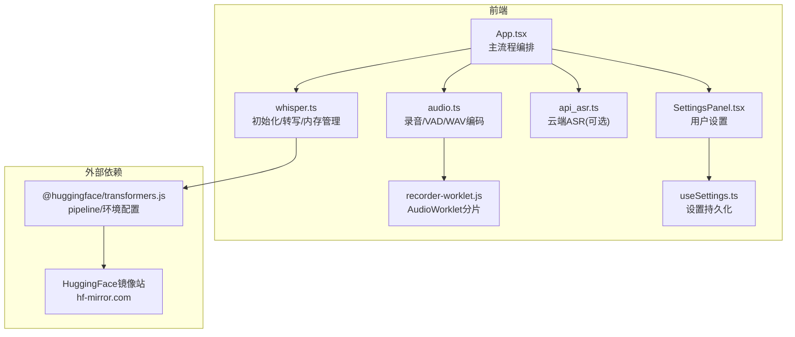
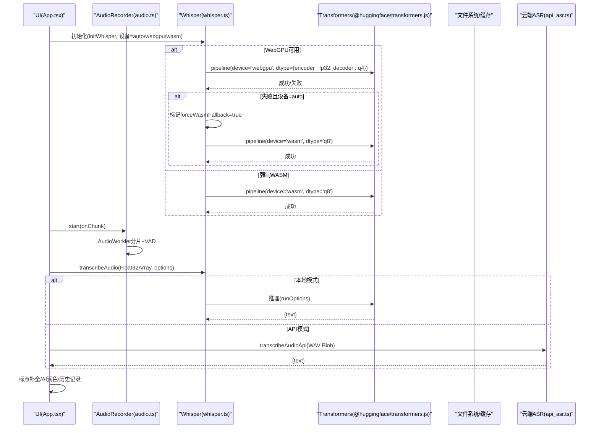
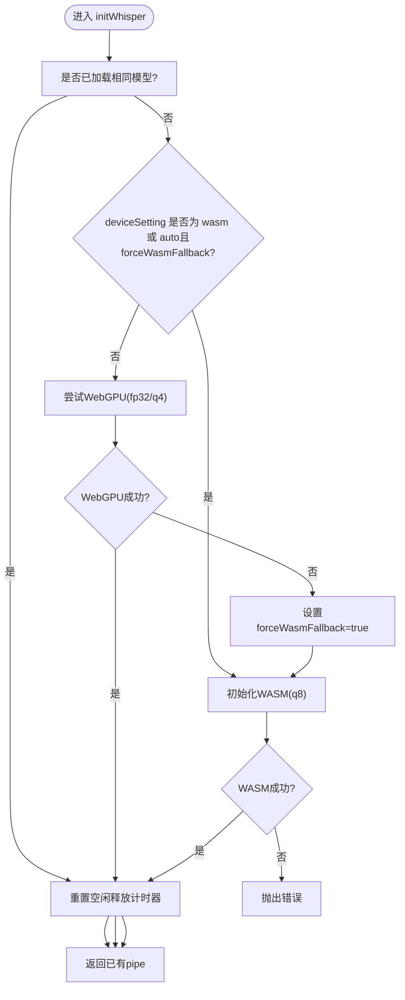
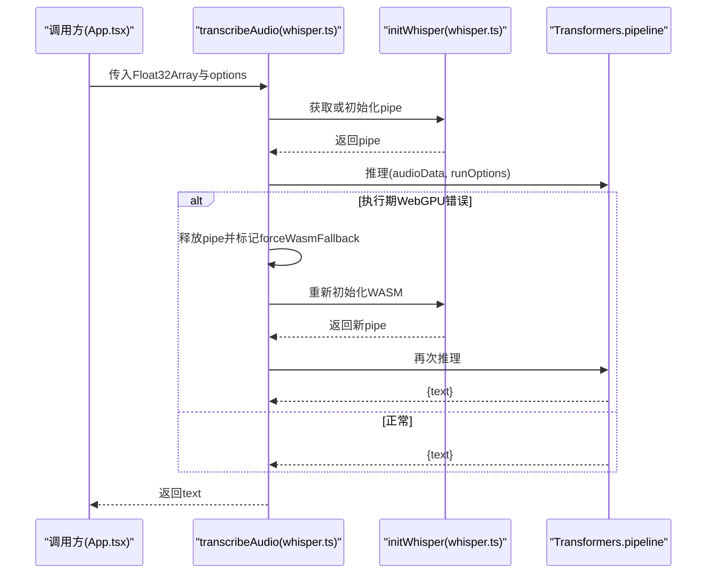
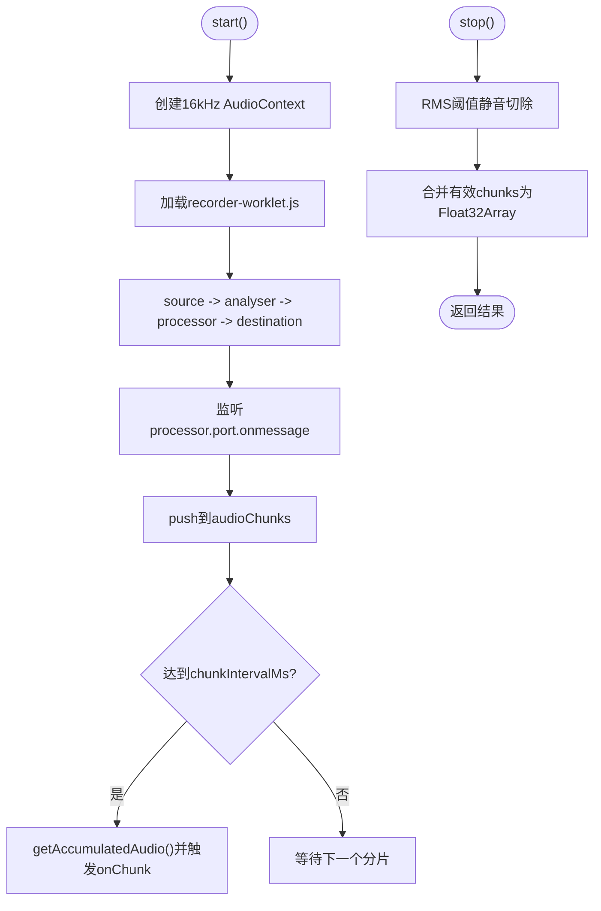
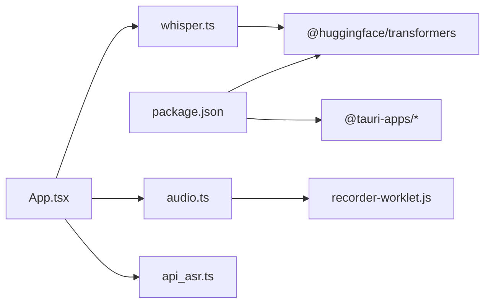

# Whisper 本地推理引擎

<cite>
**本文引用的文件列表**
- [whisper.ts](file://src/utils/whisper.ts)
- [audio.ts](file://src/utils/audio.ts)
- [App.tsx](file://src/App.tsx)
- [SettingsPanel.tsx](file://src/components/SettingsPanel.tsx)
- [useSettings.ts](file://src/hooks/useSettings.ts)
- [recorder-worklet.js](file://public/recorder-worklet.js)
- [api_asr.ts](file://src/utils/api_asr.ts)
- [package.json](file://package.json)
</cite>

## 目录
1. [简介](#简介)
2. [项目结构](#项目结构)
3. [核心组件](#核心组件)
4. [架构总览](#架构总览)
5. [详细组件分析](#详细组件分析)
6. [依赖关系分析](#依赖关系分析)
7. [性能与内存优化](#性能与内存优化)
8. [故障排查指南](#故障排查指南)
9. [结论](#结论)
10. [附录：使用示例与最佳实践](#附录使用示例与最佳实践)

## 简介
本技术文档面向基于 @huggingface/transformers.js 的浏览器端语音识别实现，聚焦 Whisper 本地推理引擎。内容涵盖 WebGPU 与 WASM 双后端架构、模型加载策略与缓存机制、设备选择与降级策略、音频采集与处理流程、转写接口参数与回调、跨域资源访问配置、10分钟空闲自动释放策略，以及常见问题排查与调试方法。读者无需深入底层即可理解并正确使用该引擎。

## 项目结构
本项目采用 Tauri + React 的前端应用，核心推理逻辑位于前端模块中，通过 @huggingface/transformers.js 在浏览器内完成 Whisper 模型的加载与推理；同时提供云端 API 模式作为备选路径。关键文件职责如下：
- src/utils/whisper.ts：Whisper 初始化、设备选择、进度回调、错误降级与内存管理
- src/utils/audio.ts：麦克风采集、分片、静音检测（VAD）、WAV 编码
- public/recorder-worklet.js：Web Audio Worklet 实时音频分片处理器
- src/App.tsx：主流程编排，集成录音、转写、AI 润色、状态同步与 UI 控制
- src/components/SettingsPanel.tsx：设置面板，含模型、语言、设备调度等选项
- src/hooks/useSettings.ts：设置持久化与默认值
- src/utils/api_asr.ts：云端 ASR 调用封装（OpenAI 兼容）
- package.json：依赖声明（@huggingface/transformers 等）

图表来源
- [App.tsx:186-221](file://src/App.tsx#L186-L221)
- [whisper.ts:1-173](file://src/utils/whisper.ts#L1-L173)
- [audio.ts:1-221](file://src/utils/audio.ts#L1-L221)
- [recorder-worklet.js:1-39](file://public/recorder-worklet.js#L1-L39)
- [api_asr.ts:1-73](file://src/utils/api_asr.ts#L1-L73)
- [SettingsPanel.tsx:150-245](file://src/components/SettingsPanel.tsx#L150-L245)
- [useSettings.ts:20-34](file://src/hooks/useSettings.ts#L20-L34)

章节来源
- [App.tsx:186-221](file://src/App.tsx#L186-L221)
- [whisper.ts:1-173](file://src/utils/whisper.ts#L1-L173)
- [audio.ts:1-221](file://src/utils/audio.ts#L1-L221)
- [recorder-worklet.js:1-39](file://public/recorder-worklet.js#L1-L39)
- [api_asr.ts:1-73](file://src/utils/api_asr.ts#L1-L73)
- [SettingsPanel.tsx:150-245](file://src/components/SettingsPanel.tsx#L150-L245)
- [useSettings.ts:20-34](file://src/hooks/useSettings.ts#L20-L34)

## 核心组件
- 设备与模型初始化器 initWhisper
  - 负责根据设备设置（auto/webgpu/wasm）选择后端，优先尝试 WebGPU，失败则回退到 WASM；支持进度回调与重复调用保护；维护全局 pipe 实例与当前模型名，避免重复加载。
- 转写接口 transcribeAudio
  - 接收 Float32Array 音频数据与运行选项（语言、模型、设备、提示词），执行推理并返回文本；内置 WebGPU 执行期崩溃检测与自动回退至 WASM 的重试逻辑。
- 音频采集与处理 AudioRecorder
  - 基于 Web Audio API 与 AudioWorklet 进行 16kHz 单声道采样、分片收集、静音阈值检测（VAD）与合并输出；提供 WAV 编码工具函数。
- 云端 ASR 封装 transcribeAudioApi
  - 将 Float32Array 编码为 WAV Blob，按 OpenAI 兼容格式 POST 到指定 URL，返回 text。

章节来源
- [whisper.ts:35-112](file://src/utils/whisper.ts#L35-L112)
- [whisper.ts:121-173](file://src/utils/whisper.ts#L121-L173)
- [audio.ts:1-174](file://src/utils/audio.ts#L1-L174)
- [api_asr.ts:41-73](file://src/utils/api_asr.ts#L41-L73)

## 架构总览
系统以“本地优先”为原则，在浏览器内完成 Whisper 推理；当设备不支持或驱动异常时，自动降级到 CPU 的 WASM 后端。同时提供云端 API 模式用于极速流式上屏体验。整体流程包括：
- 启动阶段：根据设置初始化本地模型或跳过（API 模式）
- 录音阶段：AudioWorklet 分片采集，可选流式上传（API 模式）
- 转写阶段：本地 pipeline 推理或云端 API 请求
- 后处理：标点补全、AI 润色（可选）、历史保存与 UI 更新

图表来源
- [whisper.ts:35-112](file://src/utils/whisper.ts#L35-L112)
- [whisper.ts:121-173](file://src/utils/whisper.ts#L121-L173)
- [audio.ts:1-174](file://src/utils/audio.ts#L1-L174)
- [api_asr.ts:41-73](file://src/utils/api_asr.ts#L41-L73)
- [App.tsx:186-221](file://src/App.tsx#L186-L221)

## 详细组件分析

### 初始化流程与设备选择（initWhisper）
- 远程源配置
  - 开发环境：通过本地代理规避跨域
  - 生产环境：直连 hf-mirror.com 镜像站
- 模型缓存与并发保护
  - 全局 pipe 与 currentModelName 记录已加载模型
  - initPromise 防止重复并行初始化同一模型
- 设备选择与降级
  - deviceSetting='auto'：先尝试 WebGPU，失败则标记 forceWasmFallback=true，后续走 WASM
  - deviceSetting='webgpu'：仅尝试 WebGPU
  - deviceSetting='wasm'：直接走 WASM
- 精度与兼容性
  - WebGPU 下 encoder_model 使用 fp32，decoder_model_merged 使用 q4，规避部分显卡/WebView2 驱动对 fp16 Cast 算子的兼容性问题
  - WASM 下使用 q8 量化
- 进度回调
  - 聚合多文件下载进度，计算总体百分比回调给上层 UI
- 内存管理
  - 每次成功加载后重置 10 分钟空闲定时器，超时后 dispose 释放 GPU/CPU 上下文与模型权重

图表来源
- [whisper.ts:35-112](file://src/utils/whisper.ts#L35-L112)

章节来源
- [whisper.ts:1-173](file://src/utils/whisper.ts#L1-L173)

### 转写接口（transcribeAudio）
- 输入
  - audioData: Float32Array（16kHz 单声道）
  - options: TranscribeOptions（language、model、device、prompt）
  - onProgress: 可选进度回调（主要用于首次加载）
- 运行参数
  - chunk_length_s: 30
  - stride_length_s: 5
  - language: null 表示自动检测首要语言
  - task: 'transcribe'
  - prompt: 可选注入上下文提示（部分模型版本可能生效）
- 错误处理与降级
  - 捕获执行期 WebGPU 错误（包含关键字如 WebGPU/ExecuteKernel），自动释放上下文并回退到 WASM 重试一次
- 返回值
  - 返回识别文本字符串

图表来源
- [whisper.ts:121-173](file://src/utils/whisper.ts#L121-L173)

章节来源
- [whisper.ts:121-173](file://src/utils/whisper.ts#L121-L173)

### 音频采集与处理（AudioRecorder）
- 采样与分片
  - 创建 16kHz AudioContext，加载 recorder-worklet.js，每 4096 采样点向主线程发送一个 Float32Array 分片
- 伪流式输出
  - 可配置 chunkIntervalMs，周期性合并已积累的分片触发 onChunk 回调
- 静音检测（VAD）
  - 计算每个分片的 RMS，设定阈值去除首尾长静音段，保留前后各约 0.5 秒余量
- 停止与合并
  - stop() 返回最终合并后的 Float32Array，供 Whisper 推理或 WAV 编码

图表来源
- [audio.ts:1-174](file://src/utils/audio.ts#L1-L174)
- [recorder-worklet.js:1-39](file://public/recorder-worklet.js#L1-L39)

章节来源
- [audio.ts:1-174](file://src/utils/audio.ts#L1-L174)
- [recorder-worklet.js:1-39](file://public/recorder-worklet.js#L1-L39)

### 云端 ASR 封装（transcribeAudioApi）
- 输入
  - audioData: Float32Array
  - config: AsrApiConfig（apiUrl、apiKey、model）
- 处理
  - 将 Float32Array 编码为 16-bit PCM WAV Blob
  - 构造 FormData，POST 到 OpenAI 兼容的 /v1/audio/transcriptions 接口
- 输出
  - 返回 JSON 中的 text 字段

章节来源
- [api_asr.ts:1-73](file://src/utils/api_asr.ts#L1-L73)

### 设置与持久化（SettingsPanel & useSettings）
- 设置项
  - 大模型接口（LLM）：apiKey、baseUrl、modelName、promptStyle
  - 听写偏好：asrLanguage、asrEngine（local/api）、whisperModel、inferenceDevice、listenKey、黑名单
  - API 语音模型：asrApiUrl、asrApiKey、asrApiModel
- 持久化
  - 统一 JSON 存储 vf_settings，兼容旧版分散键
  - 监听 listenKey 变化，同步到 Rust 后端

章节来源
- [SettingsPanel.tsx:115-245](file://src/components/SettingsPanel.tsx#L115-L245)
- [useSettings.ts:20-97](file://src/hooks/useSettings.ts#L20-L97)

## 依赖关系分析
- 运行时依赖
  - @huggingface/transformers：提供 pipeline 与环境配置，支持 WebGPU 与 WASM 后端
  - Tauri 插件：autostart、fs、opener、core、event、window 等
- 构建与脚本
  - vite、typescript、react 生态
- 外部资源
  - HuggingFace 镜像站 hf-mirror.com（生产环境）
  - 云端 ASR 服务（OpenAI 兼容）

图表来源
- [package.json:13-22](file://package.json#L13-L22)
- [App.tsx:186-221](file://src/App.tsx#L186-L221)
- [whisper.ts:1-173](file://src/utils/whisper.ts#L1-L173)
- [audio.ts:1-221](file://src/utils/audio.ts#L1-L221)
- [api_asr.ts:1-73](file://src/utils/api_asr.ts#L1-L73)
- [recorder-worklet.js:1-39](file://public/recorder-worklet.js#L1-L39)

章节来源
- [package.json:13-22](file://package.json#L13-L22)

## 性能与内存优化
- 设备选择建议
  - 自动模式（推荐）：优先 WebGPU，失败自动回退 WASM
  - 低配设备或 WebView2 环境：强制 WASM 提升稳定性
- 精度与速度权衡
  - WebGPU：encoder fp32 + decoder q4，兼顾稳定与速度
  - WASM：q8 量化，CPU 推理，兼容性高但延迟较高
- 分块与步长
  - chunk_length_s=30，stride_length_s=5，适合长语音分段推理，降低峰值内存占用
- 内存释放策略
  - 10 分钟无操作自动 dispose，释放 GPU/CPU 上下文与模型权重，避免长期驻留导致内存泄漏
- 音频预处理
  - VAD 静音切除减少无效推理时长
  - 16kHz 单声道采样降低带宽与计算开销

[本节为通用指导，不直接分析具体文件]

## 故障排查指南
- 无法加载模型或网络错误
  - 检查生产环境远程源是否可达（hf-mirror.com）
  - 开发环境确认本地代理 /hf 路由正确
- WebGPU 崩溃或无法执行
  - 观察错误信息是否包含 WebGPU/ExecuteKernel 关键字
  - 切换 inferenceDevice 为 wasm 强制 CPU 推理
  - 重启应用以清理 GPU 上下文
- 识别结果为空或静音
  - 检查麦克风权限与音量，确认 VAD 未误判
  - 调整麦克风距离或提高说话音量
- 云端 API 失败
  - 校验 apiKey、apiUrl 是否正确
  - 检查服务端响应码与错误体
- 日志与调试
  - 使用设置面板的“开发调试日志”查看 console 输出
  - 关注初始化与推理阶段的日志，定位问题阶段

章节来源
- [whisper.ts:1-173](file://src/utils/whisper.ts#L1-L173)
- [App.tsx:34-69](file://src/App.tsx#L34-L69)
- [api_asr.ts:41-73](file://src/utils/api_asr.ts#L41-L73)

## 结论
本引擎在浏览器端实现了 Whisper 的本地推理能力，具备 WebGPU 与 WASM 双后端、智能设备选择与自动降级、完善的进度反馈与错误恢复、以及 10 分钟空闲自动释放的内存管理策略。配合 VAD 静音切除与分块推理，可在多种设备上获得稳定的离线识别体验；同时提供云端 API 模式以满足极致速度与流式上屏需求。

[本节为总结性内容，不直接分析具体文件]

## 附录：使用示例与最佳实践
- 初始化与转写
  - 初始化：调用 initWhisper(modelName, deviceSetting, onProgress)，其中 deviceSetting 可为 auto/webgpu/wasm
  - 转写：调用 transcribeAudio(audioData, options, onProgress)，options 包含 language、model、device、prompt
- 不同模型配置
  - tiny/base/small/medium：在设置面板中选择对应模型，首次会下载权重，后续复用缓存
  - SenseVoice Small：通过 Rust 后端下载与推理，适用于极速多语言场景
- 语言设置
  - 中文/英文/日文/韩文/法文/德文/西班牙文/自动检测
  - 手动指定语言通常能提升准确率
- 提示词注入
  - 通过 options.prompt 注入上下文提示，部分模型版本可能生效
- 跨域资源访问配置
  - 开发环境：env.remoteHost 指向本地代理，避免跨域
  - 生产环境：env.remoteHost 指向 hf-mirror.com
- 性能优化技巧
  - 优先使用 auto 设备选择，必要时强制 wasm
  - 合理设置 chunk_length_s 与 stride_length_s
  - 利用 VAD 静音切除减少无效推理
- 常见问题排查
  - 参考“故障排查指南”，结合调试日志快速定位问题

章节来源
- [whisper.ts:35-173](file://src/utils/whisper.ts#L35-L173)
- [SettingsPanel.tsx:150-245](file://src/components/SettingsPanel.tsx#L150-L245)
- [useSettings.ts:20-34](file://src/hooks/useSettings.ts#L20-L34)
- [App.tsx:186-221](file://src/App.tsx#L186-L221)