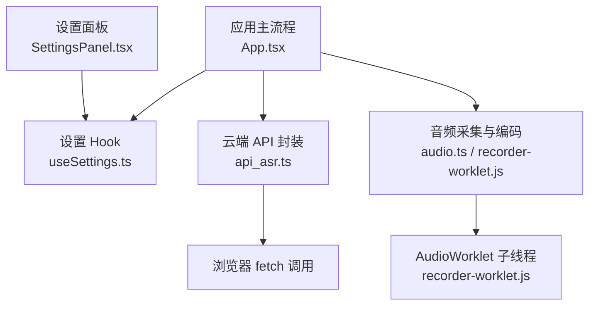
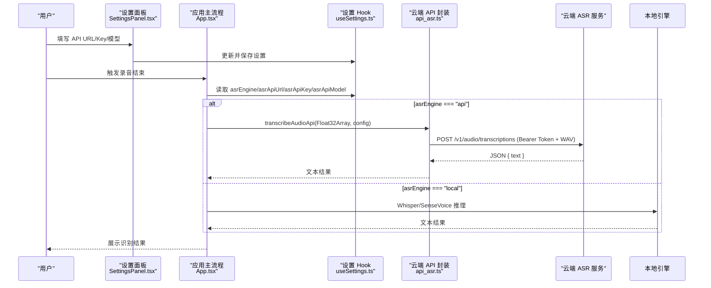
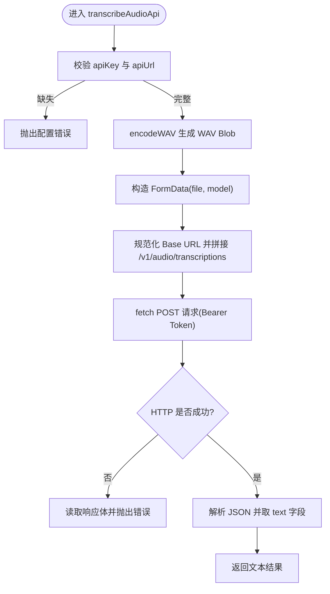
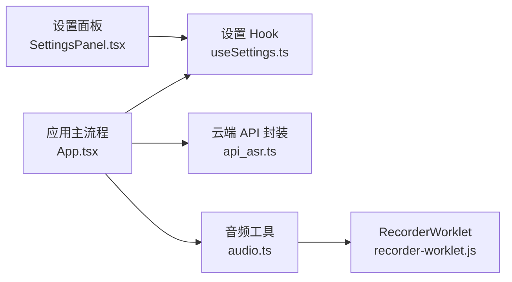

# 云端 API 集成

<cite>
**本文引用的文件**
- [src/utils/api_asr.ts](file://src/utils/api_asr.ts)
- [src/hooks/useSettings.ts](file://src/hooks/useSettings.ts)
- [src/components/SettingsPanel.tsx](file://src/components/SettingsPanel.tsx)
- [src/App.tsx](file://src/App.tsx)
- [src/utils/audio.ts](file://src/utils/audio.ts)
- [public/recorder-worklet.js](file://public/recorder-worklet.js)
</cite>

## 目录
1. [简介](#简介)
2. [项目结构](#项目结构)
3. [核心组件](#核心组件)
4. [架构总览](#架构总览)
5. [详细组件分析](#详细组件分析)
6. [依赖关系分析](#依赖关系分析)
7. [性能与成本优化](#性能与成本优化)
8. [故障排查指南](#故障排查指南)
9. [结论](#结论)
10. [附录：配置与接入示例](#附录配置与接入示例)

## 简介
本文件面向开发者，系统化梳理并扩展当前仓库中的“云端 API 语音识别”能力。现有实现已提供统一的 OpenAI 兼容接口封装（基于 fetch），支持通过设置面板配置 API URL、API Key 和模型名；同时具备音频采集、WAV 编码、错误处理等基础能力。本文在此基础上，给出统一抽象层设计、请求构建器、响应解析器、认证与安全最佳实践、流式与批量方案、重试/超时/限流/监控日志、成本优化、服务切换与故障转移策略，以及各主流云服务商的接入要点与示例路径。

## 项目结构
围绕云端 ASR 的核心代码集中在以下位置：
- 云端 API 封装：src/utils/api_asr.ts
- 设置与持久化：src/hooks/useSettings.ts
- 设置界面：src/components/SettingsPanel.tsx
- 应用主流程与引擎选择：src/App.tsx
- 音频采集与 WAV 编码：src/utils/audio.ts、public/recorder-worklet.js

图表来源
- [src/components/SettingsPanel.tsx:177-210](file://src/components/SettingsPanel.tsx#L177-L210)
- [src/hooks/useSettings.ts:20-34](file://src/hooks/useSettings.ts#L20-L34)
- [src/App.tsx:509-516](file://src/App.tsx#L509-L516)
- [src/utils/api_asr.ts:41-72](file://src/utils/api_asr.ts#L41-L72)
- [src/utils/audio.ts:1-73](file://src/utils/audio.ts#L1-L73)
- [public/recorder-worklet.js:1-39](file://public/recorder-worklet.js#L1-L39)

章节来源
- [src/utils/api_asr.ts:1-73](file://src/utils/api_asr.ts#L1-L73)
- [src/hooks/useSettings.ts:1-97](file://src/hooks/useSettings.ts#L1-L97)
- [src/components/SettingsPanel.tsx:177-210](file://src/components/SettingsPanel.tsx#L177-L210)
- [src/App.tsx:509-516](file://src/App.tsx#L509-L516)
- [src/utils/audio.ts:1-73](file://src/utils/audio.ts#L1-L73)
- [public/recorder-worklet.js:1-39](file://public/recorder-worklet.js#L1-L39)

## 核心组件
- 统一 API 抽象层
  - 定义 AsrApiConfig 接口，包含 apiUrl、apiKey、model 三个字段，作为所有云端 ASR 的统一输入契约。
  - 对外暴露 transcribeAudioApi(audioData, config)，接收 Float32Array 音频数据与配置，返回 Promise<string> 文本结果。
- 请求构建器
  - 将 Float32Array 编码为 WAV Blob，构造 FormData，追加 file 与 model 字段。
  - 自动规范化 Base URL，确保以 /v1/audio/transcriptions 结尾。
- 认证与鉴权
  - 使用 Authorization: Bearer <apiKey> 头进行认证。
- 响应解析器
  - 期望服务端返回 JSON，且包含 text 字段；若不存在则回退为空字符串。
- 错误处理
  - 校验必填配置；对非 2xx 响应抛出带状态码与响应体的错误信息。

章节来源
- [src/utils/api_asr.ts:1-73](file://src/utils/api_asr.ts#L1-L73)

## 架构总览
整体流程：用户在设置面板中配置云端 ASR 的 URL、Key 与模型；录音结束后，应用根据选择的引擎（本地或云端）路由到对应实现；云端模式下，调用统一封装的 transcribeAudioApi，完成编码、请求、解析与错误处理。

图表来源
- [src/components/SettingsPanel.tsx:177-210](file://src/components/SettingsPanel.tsx#L177-L210)
- [src/hooks/useSettings.ts:20-34](file://src/hooks/useSettings.ts#L20-L34)
- [src/App.tsx:509-516](file://src/App.tsx#L509-L516)
- [src/utils/api_asr.ts:41-72](file://src/utils/api_asr.ts#L41-L72)

## 详细组件分析

### 统一 API 抽象层与请求构建器
- 输入契约
  - AsrApiConfig：包含 apiUrl、apiKey、model。
- 音频编码
  - encodeWAV：将 Float32Array 转换为 16kHz 单声道 PCM 的 WAV Blob。
- 请求构建
  - 构造 FormData，附加 file 与 model。
  - 规范化 URL，确保以 /v1/audio/transcriptions 结尾。
- 认证
  - 在请求头注入 Authorization: Bearer <apiKey>。
- 响应解析
  - 解析 JSON，取 data.text 作为最终文本。
- 错误处理
  - 未配置 apiKey 或 apiUrl 时直接抛错。
  - HTTP 非 2xx 时抛出包含状态码与响应体的错误。

图表来源
- [src/utils/api_asr.ts:41-72](file://src/utils/api_asr.ts#L41-L72)

章节来源
- [src/utils/api_asr.ts:1-73](file://src/utils/api_asr.ts#L1-L73)

### 认证配置、密钥管理与安全最佳实践
- 配置入口
  - 设置面板提供 API URL、API Key、模型名的输入项，默认值指向 Groq 的 OpenAI 兼容端点。
- 存储方式
  - useSettings 将设置持久化到 localStorage，并提供向后兼容的旧键迁移逻辑。
- 安全建议
  - 前端仅用于演示与开发环境；生产环境应通过后端代理转发请求，避免在前端暴露密钥。
  - 使用 HTTPS 与最小权限原则，限制域名白名单与 IP 白名单。
  - 定期轮换密钥，启用访问审计与用量告警。
  - 对敏感字段在 UI 中以密码模式显示，避免明文缓存于控制台。

章节来源
- [src/components/SettingsPanel.tsx:185-210](file://src/components/SettingsPanel.tsx#L185-L210)
- [src/hooks/useSettings.ts:20-34](file://src/hooks/useSettings.ts#L20-L34)
- [src/hooks/useSettings.ts:36-67](file://src/hooks/useSettings.ts#L36-L67)

### 流式识别与批量处理方案
- 现状
  - 当前实现为一次性上传整段录音（WAV Blob），适用于离线片段转写。
- 流式识别（推荐）
  - 采用 WebSocket 长连接，按固定时长分片发送音频帧，服务端实时返回增量文本。
  - 客户端维护连接生命周期、心跳保活、断线重连与乱序合并。
- 批量处理
  - 将长音频切分为若干片段（如每 30s），并行或串行上传，聚合结果并按时间戳排序合并。
- 分片与聚合
  - 分片策略：固定时长或能量阈值触发；保留前后静音余量以减少边界误差。
  - 聚合策略：按片段序号或时间戳归并，去重重叠部分，输出连贯文本。

[本节为概念性说明，不直接分析具体源码文件]

### 错误处理与健壮性
- 配置校验：缺少必要参数立即报错，便于快速定位问题。
- HTTP 错误：捕获状态码与响应体，向上抛出结构化错误。
- 网络异常：建议增加超时控制与重试机制（见后文）。
- 前端日志：应用内劫持 console 输出，便于调试。

章节来源
- [src/utils/api_asr.ts:41-72](file://src/utils/api_asr.ts#L41-L72)
- [src/App.tsx:34-69](file://src/App.tsx#L34-L69)

### 音频采集与编码
- 采集链路
  - 使用 MediaDevices.getUserMedia 获取麦克风流，创建 AudioContext 与 AnalyserNode。
  - 通过 AudioWorklet 子线程高效收集音频块，主线程定时合并并回调。
- 编码格式
  - 统一输出 16kHz 单声道 PCM，编码为 WAV Blob 供云端 API 消费。
- VAD 静音切除
  - 停止时计算 RMS，去除首尾静音，减少无效数据与费用。

章节来源
- [src/utils/audio.ts:1-73](file://src/utils/audio.ts#L1-L73)
- [src/utils/audio.ts:176-214](file://src/utils/audio.ts#L176-L214)
- [public/recorder-worklet.js:1-39](file://public/recorder-worklet.js#L1-L39)

## 依赖关系分析
- 组件耦合
  - App 依赖 useSettings 获取配置，并在 asrEngine=api 时调用 api_asr.ts 的 transcribeAudioApi。
  - SettingsPanel 负责渲染与更新设置，useSettings 负责持久化与默认值。
  - audio.ts 与 recorder-worklet.js 提供音频采集与编码能力。
- 外部依赖
  - 浏览器原生 API：navigator.mediaDevices、AudioContext、AudioWorklet、fetch。
  - Tauri 插件：用于文件系统、窗口管理、事件监听等（与本模块间接相关）。

图表来源
- [src/components/SettingsPanel.tsx:177-210](file://src/components/SettingsPanel.tsx#L177-L210)
- [src/hooks/useSettings.ts:20-34](file://src/hooks/useSettings.ts#L20-L34)
- [src/App.tsx:509-516](file://src/App.tsx#L509-L516)
- [src/utils/api_asr.ts:41-72](file://src/utils/api_asr.ts#L41-L72)
- [src/utils/audio.ts:1-73](file://src/utils/audio.ts#L1-L73)
- [public/recorder-worklet.js:1-39](file://public/recorder-worklet.js#L1-L39)

章节来源
- [src/components/SettingsPanel.tsx:177-210](file://src/components/SettingsPanel.tsx#L177-L210)
- [src/hooks/useSettings.ts:20-34](file://src/hooks/useSettings.ts#L20-L34)
- [src/App.tsx:509-516](file://src/App.tsx#L509-L516)
- [src/utils/api_asr.ts:41-72](file://src/utils/api_asr.ts#L41-L72)
- [src/utils/audio.ts:1-73](file://src/utils/audio.ts#L1-L73)
- [public/recorder-worklet.js:1-39](file://public/recorder-worklet.js#L1-L39)

## 性能与成本优化
- 采样率与时长
  - 保持 16kHz 单声道，合理设置分片时长（如 10~30s），降低带宽与计费。
- 静音检测与裁剪
  - 利用 RMS 阈值剔除首尾静音，减少无效音频长度。
- 并发与队列
  - 批量场景下采用任务队列与并发上限，避免瞬时峰值导致限流。
- 缓存与复用
  - 对相同音频片段做指纹缓存，避免重复上传。
- 传输压缩
  - 优先使用 gzip/br 压缩的 HTTP 通道；WebSocket 可考虑二进制帧压缩。
- 模型选择
  - 根据场景选择轻量模型（如 whisper-tiny/base），平衡延迟与准确率。
- 监控与告警
  - 记录耗时、失败率、QPS、P95/P99 延迟，设置阈值告警。

[本节为通用指导，不直接分析具体源码文件]

## 故障排查指南
- 常见错误
  - 未配置 API Key 或 URL：检查设置面板是否正确填写并保存。
  - 401/403：确认密钥有效、域名/IP 白名单正确。
  - 429：触发限流，需降级并发或等待冷却。
  - 5xx：服务端异常，建议重试与熔断。
- 定位方法
  - 查看应用内日志面板，关注错误堆栈与响应体。
  - 使用浏览器开发者工具 Network 面板检查请求头、表单内容与响应。
- 恢复策略
  - 指数退避重试、短路熔断、降级到备用服务或本地模型。

章节来源
- [src/utils/api_asr.ts:41-72](file://src/utils/api_asr.ts#L41-L72)
- [src/App.tsx:34-69](file://src/App.tsx#L34-L69)

## 结论
当前仓库已具备云端 ASR 的基础能力：统一抽象层、OpenAI 兼容请求格式、WAV 编码与错误处理。为实现企业级稳定性与高性能，建议引入流式识别、重试与超时、限流与熔断、监控日志、多服务切换与故障转移等机制，并结合业务场景进行成本优化。

[本节为总结性内容，不直接分析具体源码文件]

## 附录：配置与接入示例

### 统一抽象层扩展建议
- 新增 ServiceAdapter 接口
  - 定义统一的 initialize、transcribeStream、transcribeBatch、healthCheck 等方法。
- 适配器注册表
  - 运行时根据 settings.asrEngine 与 settings.provider 动态选择适配器实例。
- 配置对象扩展
  - 在 AsrApiConfig 基础上增加 provider、region、timeout、retryPolicy、rateLimit 等字段。

[本节为设计建议，不直接分析具体源码文件]

### 阿里云（DashScope/通义千问语音）
- SDK 安装
  - 参考官方文档安装 @alicloud/dashscope-sdk-node 或浏览器适配包。
- 初始化
  - 设置 DASHSCOPE_API_KEY，创建 DashScopeClient。
- 流式识别
  - 使用 createRealtimeTranscription 或类似接口，建立 WebSocket 连接，分片发送音频帧，接收增量文本。
- 批量识别
  - 使用异步任务提交音频文件，轮询任务状态，聚合结果。
- 错误与重试
  - 捕获网络与服务端错误，结合指数退避重试。
- 限流与配额
  - 遵循 QPS 限制，必要时排队与降级。
- 成本优化
  - 选择合适的模型与语言，开启静音裁剪，按需选择实时或离线模式。

[本节为接入指引，不直接分析具体源码文件]

### 腾讯云（TRTC/ASR）
- SDK 安装
  - 参考官方文档安装 tencentcloud-sdk-nodejs 或浏览器适配包。
- 初始化
  - 配置 SecretId、SecretKey、Endpoint。
- 流式识别
  - 使用 TRTC 实时音视频或 ASR 流式接口，建立 WebSocket，分片发送音频，接收增量文本。
- 批量识别
  - 上传音频至 COS，调用 ASR 异步任务接口，轮询结果。
- 错误与重试
  - 处理鉴权、网络与服务端错误，实施重试与熔断。
- 限流与配额
  - 遵守 QPS 与并发限制，合理拆分任务。
- 成本优化
  - 使用合适的采样率与时长，开启静音裁剪，选择性价比高的模型。

[本节为接入指引，不直接分析具体源码文件]

### 百度智能云（语音识别）
- SDK 安装
  - 参考官方文档安装 baidu-aip-sdk 或浏览器适配包。
- 初始化
  - 配置 APP_ID、API_KEY、SECRET_KEY。
- 流式识别
  - 使用 WebSocket 流式接口，分片发送音频帧，接收增量文本。
- 批量识别
  - 上传音频至 BOS，调用异步识别接口，轮询结果。
- 错误与重试
  - 处理鉴权、网络与服务端错误，实施重试与熔断。
- 限流与配额
  - 遵守 QPS 与并发限制，合理拆分任务。
- 成本优化
  - 选择合适的模型与语言，开启静音裁剪，按需选择实时或离线模式。

[本节为接入指引，不直接分析具体源码文件]

### 其他主流服务商（OpenAI/Whisper、Groq、Azure Speech、Google Cloud STT）
- OpenAI/Whisper
  - 使用 /v1/audio/transcriptions 接口，POST multipart/form-data，携带 file 与 model。
- Groq
  - 兼容 OpenAI 格式，设置 Base URL 与 API Key，其余一致。
- Azure Speech
  - 使用 Speech SDK，建立 WebSocket 连接，分片发送音频，接收增量文本。
- Google Cloud STT
  - 使用 gRPC StreamingRecognize，分片发送音频，接收增量文本。

[本节为接入指引，不直接分析具体源码文件]

### 重试、超时、限流与监控日志
- 重试机制
  - 指数退避 + 抖动，最大重试次数与冷却时间可配置。
- 超时处理
  - 设置连接超时与读写超时，避免长时间阻塞。
- 限流控制
  - 令牌桶或滑动窗口算法，全局与租户维度限流。
- 监控日志
  - 记录关键指标：耗时、成功率、错误码分布、QPS、P95/P99 延迟。
  - 对接 APM 与告警系统，设置阈值与通知渠道。

[本节为通用指导，不直接分析具体源码文件]

### 服务切换策略与故障转移
- 健康检查
  - 周期性探测各服务可用性，标记健康状态。
- 权重路由
  - 基于健康度与成本动态调整流量权重。
- 故障转移
  - 主服务不可用时自动切换到备用服务或本地模型。
- 灰度发布
  - 小流量验证新服务，逐步放量。

[本节为通用指导，不直接分析具体源码文件]