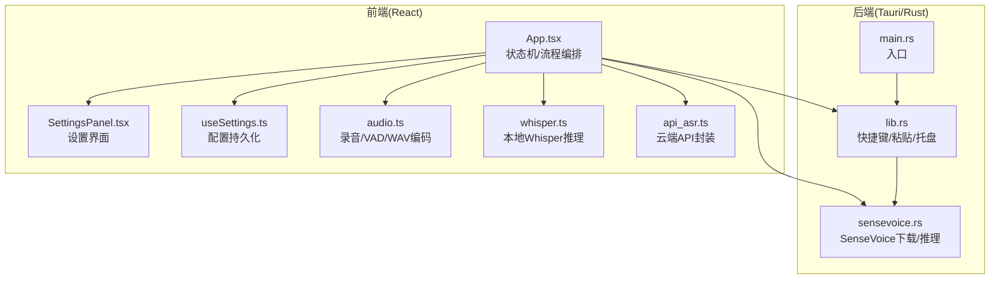
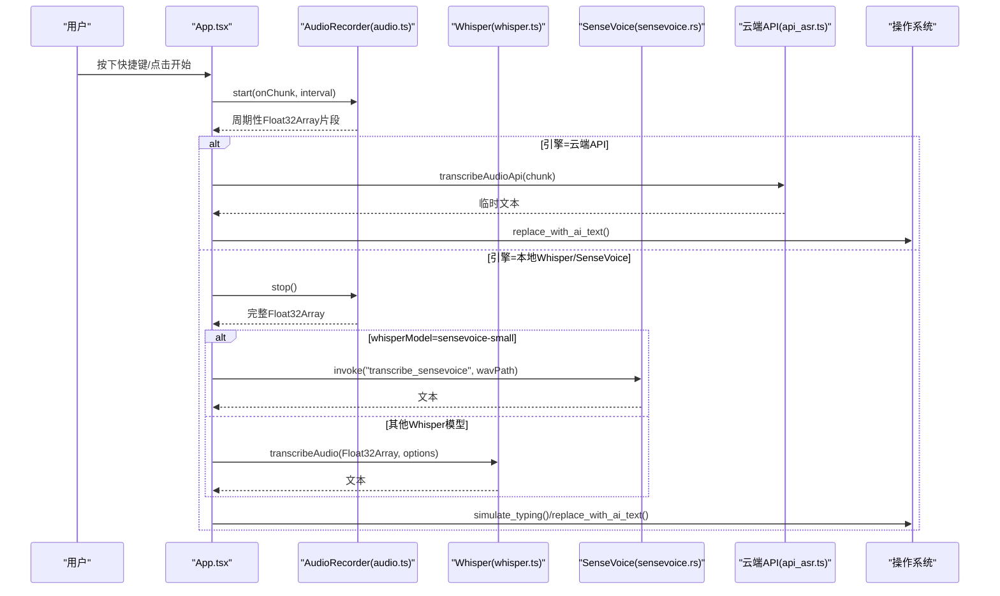
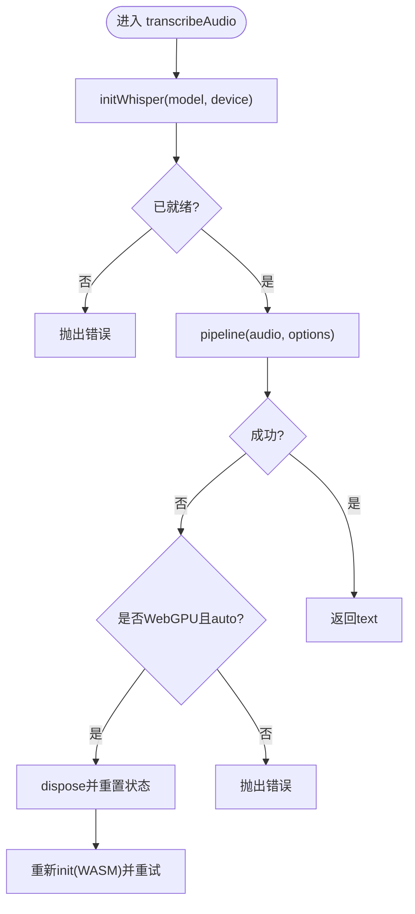
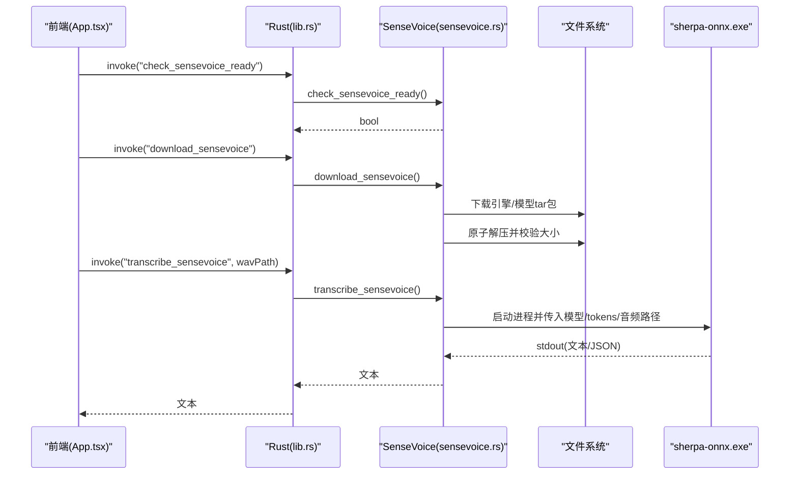
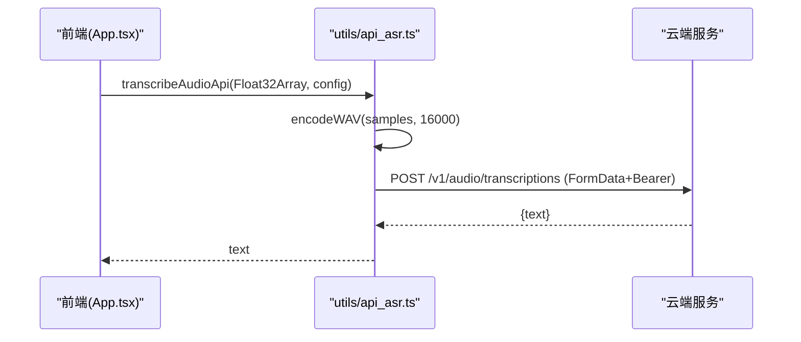
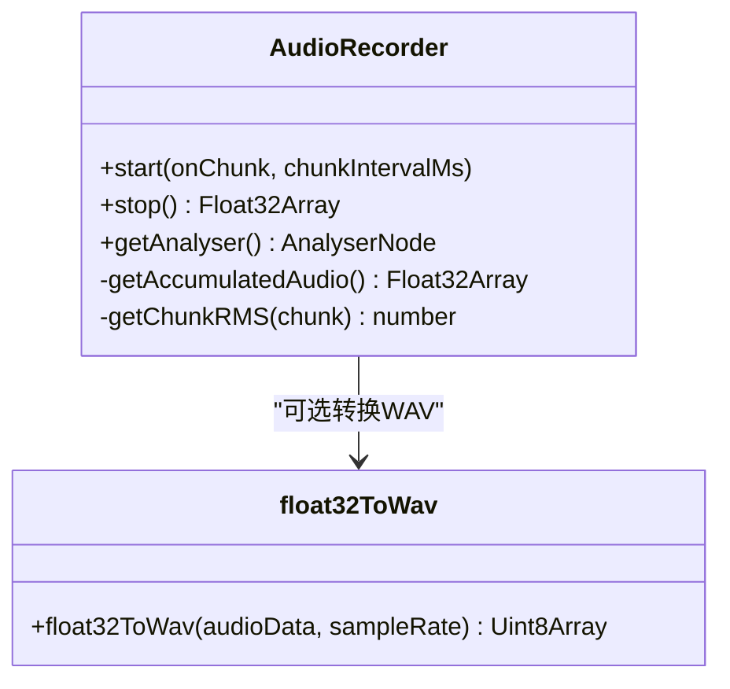
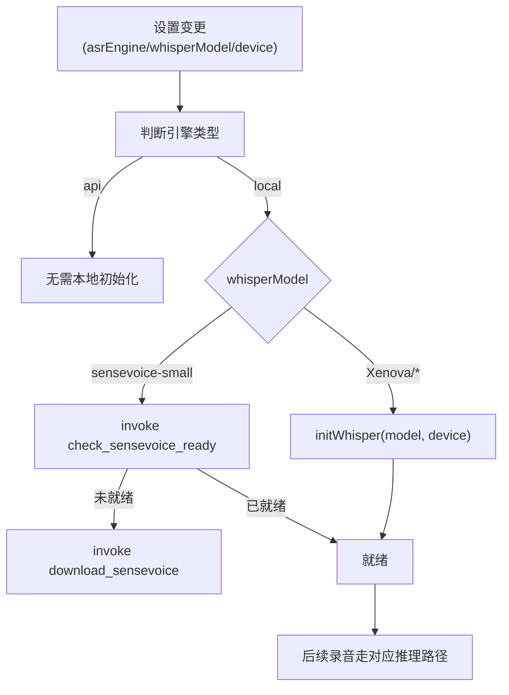
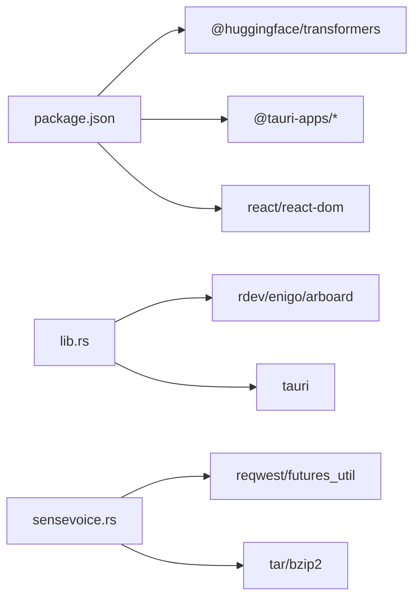

# 语音识别引擎

<cite>
**本文引用的文件列表**
- [App.tsx](file://src/App.tsx)
- [SettingsPanel.tsx](file://src/components/SettingsPanel.tsx)
- [useSettings.ts](file://src/hooks/useSettings.ts)
- [api_asr.ts](file://src/utils/api_asr.ts)
- [whisper.ts](file://src/utils/whisper.ts)
- [audio.ts](file://src/utils/audio.ts)
- [sensevoice.rs](file://src-tauri/src/sensevoice.rs)
- [lib.rs](file://src-tauri/src/lib.rs)
- [main.rs](file://src-tauri/src/main.rs)
- [package.json](file://package.json)
</cite>

## 目录
1. [简介](#简介)
2. [项目结构](#项目结构)
3. [核心组件](#核心组件)
4. [架构总览](#架构总览)
5. [详细组件分析](#详细组件分析)
6. [依赖关系分析](#依赖关系分析)
7. [性能与优化](#性能与优化)
8. [故障排查指南](#故障排查指南)
9. [结论](#结论)
10. [附录：配置与扩展](#附录：配置与扩展)

## 简介
本文件为 VoiceFlow_AI_002 的语音识别（ASR）引擎模块提供系统化文档，覆盖三种实现路径：
- 本地 Whisper 模型推理（浏览器端 Transformers.js + WebGPU/WASM）
- SenseVoice 原生集成（Tauri 后端调用 sherpa-onnx 可执行文件）
- 云端 API 调用（兼容 OpenAI 格式的转写接口）

文档将解释各引擎的技术架构、优缺点、适用场景、选择策略与动态切换机制；给出配置示例、API 调用方式与错误处理模式；并说明模型下载管理、缓存策略与性能优化技巧。同时为初学者提供 ASR 基础概念，为高级开发者提供扩展接口与自定义实现指南，涵盖多语言支持、实时识别与批量处理等高级能力。

## 项目结构
前端采用 React + TypeScript + Vite，通过 Tauri 桥接 Rust 后端能力。ASR 相关代码主要分布在以下位置：
- 前端工具层：音频采集与格式转换、Whisper 本地推理封装、云端 API 封装
- 前端应用层：状态机、引擎初始化与切换、录音流程编排、结果输出与 AI 润色
- 后端能力层：SenseVoice 模型与引擎下载、就绪检查、离线推理调用
- 系统交互层：全局快捷键监听、剪贴板与键盘模拟、托盘与窗口控制

图表来源
- [App.tsx:186-221](file://src/App.tsx#L186-L221)
- [SettingsPanel.tsx:177-245](file://src/components/SettingsPanel.tsx#L177-L245)
- [useSettings.ts:20-34](file://src/hooks/useSettings.ts#L20-L34)
- [audio.ts:12-73](file://src/utils/audio.ts#L12-L73)
- [whisper.ts:35-112](file://src/utils/whisper.ts#L35-L112)
- [api_asr.ts:41-72](file://src/utils/api_asr.ts#L41-L72)
- [sensevoice.rs:295-476](file://src-tauri/src/sensevoice.rs#L295-L476)
- [lib.rs:214-286](file://src-tauri/src/lib.rs#L214-L286)
- [main.rs:4-6](file://src-tauri/src/main.rs#L4-L6)

章节来源
- [App.tsx:186-221](file://src/App.tsx#L186-L221)
- [SettingsPanel.tsx:177-245](file://src/components/SettingsPanel.tsx#L177-L245)
- [useSettings.ts:20-34](file://src/hooks/useSettings.ts#L20-L34)
- [audio.ts:12-73](file://src/utils/audio.ts#L12-L73)
- [whisper.ts:35-112](file://src/utils/whisper.ts#L35-L112)
- [api_asr.ts:41-72](file://src/utils/api_asr.ts#L41-L72)
- [sensevoice.rs:295-476](file://src-tauri/src/sensevoice.rs#L295-L476)
- [lib.rs:214-286](file://src-tauri/src/lib.rs#L214-L286)
- [main.rs:4-6](file://src-tauri/src/main.rs#L4-L6)

## 核心组件
- 音频采集与预处理
  - 使用浏览器 MediaDevices 获取麦克风流，创建 16kHz AudioContext，经 AnalyserNode 与 AudioWorklet 节点进行低延迟分片采集。
  - 内置简易 VAD（基于 RMS 阈值），在停止时裁剪首尾静音段，减少无效数据。
  - 提供 Float32Array 到 WAV 字节数组的编码器，用于本地或后端推理。
- 本地 Whisper 推理
  - 基于 @huggingface/transformers，优先尝试 WebGPU 设备，失败自动降级至 WASM。
  - 支持进度回调、内存休眠释放（空闲 10 分钟自动 dispose）、WebGPU 崩溃回退。
  - 支持 chunk_length_s、stride_length_s、language、prompt 等参数。
- SenseVoice 原生集成
  - 通过 Tauri 命令检查/下载引擎与模型（含多个镜像源与断点续传式重试）。
  - 以子进程方式调用 sherpa-onnx 可执行文件完成离线推理，解析 stdout 文本。
- 云端 API 调用
  - 将 Float32Array 编码为 WAV Blob，POST 到兼容 OpenAI 的 /v1/audio/transcriptions 接口，返回 text。
  - 支持流式伪上屏：每 2 秒合并一次片段发送，降低网络开销。

章节来源
- [audio.ts:12-173](file://src/utils/audio.ts#L12-L173)
- [whisper.ts:35-174](file://src/utils/whisper.ts#L35-L174)
- [sensevoice.rs:295-476](file://src-tauri/src/sensevoice.rs#L295-L476)
- [api_asr.ts:41-72](file://src/utils/api_asr.ts#L41-L72)

## 架构总览
整体采用“前端编排 + 后端能力”的分层架构。前端负责用户交互、录音、状态管理与结果展示；后端负责系统级能力（快捷键、粘贴、托盘）与高性能离线推理（SenseVoice）。

图表来源
- [App.tsx:374-640](file://src/App.tsx#L374-L640)
- [audio.ts:12-173](file://src/utils/audio.ts#L12-L173)
- [whisper.ts:121-174](file://src/utils/whisper.ts#L121-L174)
- [sensevoice.rs:445-476](file://src-tauri/src/sensevoice.rs#L445-L476)
- [api_asr.ts:41-72](file://src/utils/api_asr.ts#L41-L72)
- [lib.rs:46-118](file://src-tauri/src/lib.rs#L46-L118)

## 详细组件分析

### 组件一：本地 Whisper 模型推理
- 技术要点
  - 设备选择：auto/webgpu/wasm。auto 优先 WebGPU，失败标记后强制回退 WASM。
  - 模型加载：首次加载按进度回调聚合显示；空闲 10 分钟自动 dispose 释放内存。
  - 推理参数：chunk_length_s、stride_length_s、language、task、prompt。
  - 错误处理：捕获 WebGPU 执行期异常，主动 dispose 上下文并重试 WASM。
- 适用场景
  - 隐私敏感、无网络环境、需要离线可用。
  - 对延迟要求中等，硬件具备一定 GPU 能力更佳。
- 配置项
  - whisperModel：tiny/base/small/medium 等 Xenova 仓库模型。
  - inferenceDevice：auto/webgpu/wasm。
  - language：指定目标语言或留空自动检测。
- 性能建议
  - 优先使用 WebGPU；若出现驱动问题，切换到 wasm。
  - 合理设置 chunk_length_s 与 stride_length_s 平衡精度与速度。
  - 利用 idle 自动释放避免长时间占用显存。

图表来源
- [whisper.ts:121-174](file://src/utils/whisper.ts#L121-L174)
- [whisper.ts:35-112](file://src/utils/whisper.ts#L35-L112)

章节来源
- [whisper.ts:35-174](file://src/utils/whisper.ts#L35-L174)

### 组件二：SenseVoice 原生集成
- 技术要点
  - 就绪检查：检查 sherpa-onnx 引擎 exe 与模型文件是否存在。
  - 下载策略：引擎与模型分别打包 tar.bz2，支持多镜像源与多次重试；原子解压与重命名保证一致性。
  - 推理流程：写入临时 WAV 文件，调用 sherpa-onnx 可执行，解析 stdout 中的 JSON 或末行文本。
- 适用场景
  - 追求极致速度与多语言（中/英/日/韩/粤）识别，适合桌面端离线高吞吐场景。
- 配置项
  - whisperModel 选择 sensevoice-small 即启用该路径。
- 性能建议
  - 首次运行需下载约数百 MB 资源，建议在后台静默完成。
  - 确保磁盘空间充足，避免下载中断导致脏文件。

图表来源
- [sensevoice.rs:295-476](file://src-tauri/src/sensevoice.rs#L295-L476)
- [lib.rs:275-283](file://src-tauri/src/lib.rs#L275-L283)
- [App.tsx:516-544](file://src/App.tsx#L516-L544)

章节来源
- [sensevoice.rs:295-476](file://src-tauri/src/sensevoice.rs#L295-L476)
- [lib.rs:275-283](file://src-tauri/src/lib.rs#L275-L283)
- [App.tsx:516-544](file://src/App.tsx#L516-L544)

### 组件三：云端 API 调用
- 技术要点
  - 输入：Float32Array，采样率 16kHz。
  - 编码：转换为 WAV Blob，构造 FormData，字段 file 与 model。
  - 请求：POST 到 {baseUrl}/v1/audio/transcriptions，携带 Authorization Bearer。
  - 响应：JSON 包含 text 字段。
  - 流式体验：前端每 2 秒合并一段音频片段发送，逐步替换上屏文本。
- 适用场景
  - 需要极低延迟与高准确率，具备稳定网络与 API Key。
- 配置项
  - asrEngine=api，asrApiUrl/asrApiKey/asrApiModel。
- 错误处理
  - 未配置 URL/Key 直接抛错；HTTP 非 2xx 返回错误信息；网络异常由上层捕获。

图表来源
- [api_asr.ts:41-72](file://src/utils/api_asr.ts#L41-L72)
- [App.tsx:397-425](file://src/App.tsx#L397-L425)

章节来源
- [api_asr.ts:41-72](file://src/utils/api_asr.ts#L41-L72)
- [App.tsx:397-425](file://src/App.tsx#L397-L425)

### 组件四：音频采集与 VAD
- 技术要点
  - 使用 getUserMedia 获取单声道、开启回声消除与降噪。
  - 16kHz AudioContext，AnalyserNode 用于可视化与音量追踪。
  - AudioWorklet 子线程采集，主线程累积 Float32Array。
  - 停止时基于 RMS 阈值裁剪首尾静音，提升识别质量。
- 适用场景
  - 所有本地与云端路径均依赖此模块作为统一输入。
- 性能建议
  - 合理设置 onChunk 间隔（云端推荐 2s，本地 0 表示不触发伪流式）。
  - 保持安静环境，避免背景噪声影响 VAD 判定。

图表来源
- [audio.ts:1-221](file://src/utils/audio.ts#L1-L221)

章节来源
- [audio.ts:1-221](file://src/utils/audio.ts#L1-L221)

### 组件五：引擎选择与动态切换
- 选择策略
  - 用户在设置面板中选择 asrEngine（local/api）。
  - local 下进一步选择 whisperModel（sensevoice-small 或其他 Xenova 模型）。
  - 保存设置后，App 根据当前配置初始化对应引擎。
- 动态切换
  - 当 settings.whisperModel/inferenceDevice/asrEngine 变化时，App 会重新初始化引擎。
  - 对于 SenseVoice，若未就绪则触发下载流程，完成后继续。
  - 对于 Whisper，自动设备调度与回退逻辑透明处理。
- 用户体验
  - 初始化阶段显示进度条与步骤提示。
  - 录音期间小药丸窗口显示状态与音量波形。

图表来源
- [App.tsx:186-221](file://src/App.tsx#L186-L221)
- [SettingsPanel.tsx:177-245](file://src/components/SettingsPanel.tsx#L177-L245)
- [useSettings.ts:20-34](file://src/hooks/useSettings.ts#L20-L34)

章节来源
- [App.tsx:186-221](file://src/App.tsx#L186-L221)
- [SettingsPanel.tsx:177-245](file://src/components/SettingsPanel.tsx#L177-L245)
- [useSettings.ts:20-34](file://src/hooks/useSettings.ts#L20-L34)

## 依赖关系分析
- 前端依赖
  - @huggingface/transformers：本地 Whisper 推理。
  - @tauri-apps/*：与 Rust 后端通信、文件系统、自动启动、窗口管理等。
  - react/react-dom：UI 框架。
- 后端依赖
  - tauri：应用壳与命令注册。
  - rdev/enigo/arboard/active_win_pos_rs：全局按键监听、剪贴板、活动窗口信息。
  - reqwest/futures_util/tar/bzip2：网络下载与归档解压。
- 耦合与内聚
  - App.tsx 作为编排中心，耦合度高但职责清晰；具体推理逻辑下沉到 utils 与 Rust 模块，内聚良好。
  - 前后端通过 Tauri 命令解耦，便于扩展新引擎。

图表来源
- [package.json:13-22](file://package.json#L13-L22)
- [lib.rs:1-16](file://src-tauri/src/lib.rs#L1-L16)
- [sensevoice.rs:1-8](file://src-tauri/src/sensevoice.rs#L1-L8)

章节来源
- [package.json:13-22](file://package.json#L13-L22)
- [lib.rs:1-16](file://src-tauri/src/lib.rs#L1-L16)
- [sensevoice.rs:1-8](file://src-tauri/src/sensevoice.rs#L1-L8)

## 性能与优化
- 本地 Whisper
  - 优先 WebGPU，失败自动回退 WASM；空闲 10 分钟自动释放，避免显存泄漏。
  - 调整 chunk_length_s 与 stride_length_s 平衡速度与连续性。
  - 在低配设备上选择 tiny/base 模型，减少内存与计算压力。
- SenseVoice
  - 首次下载体积较大，建议在后台静默完成；确保磁盘空间与网络稳定。
  - 使用 sherpa-onnx 可执行，CPU 友好，适合多核 CPU 环境。
- 云端 API
  - 伪流式每 2 秒提交一次，兼顾延迟与带宽；可根据需求缩短间隔以提升实时性。
  - 选择合适的模型名称以获得更高准确率（如 large-v3）。
- 通用优化
  - 使用 VAD 裁剪静音，减少无效推理。
  - 合理设置语言，避免自动检测带来的额外开销。
  - 记录日志与错误信息，便于定位性能瓶颈。

[本节为通用指导，不直接分析具体文件]

## 故障排查指南
- 初始化失败
  - 现象：引擎初始化报错，可能涉及网络或驱动问题。
  - 处理：检查网络连通性与代理；尝试切换 inferenceDevice 为 wasm；查看调试日志。
- WebGPU 崩溃
  - 现象：推理阶段出现 WebGPU 相关错误。
  - 处理：自动回退 WASM；若仍失败，手动切换为 wasm 并重启应用。
- SenseVoice 下载失败
  - 现象：下载中断或校验失败。
  - 处理：检查镜像源可用性；清理临时文件后重试；确保磁盘空间足够。
- 云端 API 错误
  - 现象：HTTP 非 2xx 或未配置 Key/URL。
  - 处理：确认 API Key 与 Base URL 正确；检查服务端状态与配额。
- 麦克风权限/静音
  - 现象：无法启动麦克风或全静音被拦截。
  - 处理：授予麦克风权限；靠近麦克风或提高音量；检查系统声音设置。

章节来源
- [App.tsx:214-221](file://src/App.tsx#L214-L221)
- [whisper.ts:152-172](file://src/utils/whisper.ts#L152-L172)
- [sensevoice.rs:176-181](file://src-tauri/src/sensevoice.rs#L176-L181)
- [api_asr.ts:42-68](file://src/utils/api_asr.ts#L42-L68)
- [App.tsx:493-505](file://src/App.tsx#L493-L505)

## 结论
本项目提供了三种互补的 ASR 引擎实现，覆盖离线隐私、高性能桌面端与云端极速三大场景。通过统一的音频采集与状态编排，结合灵活的设置与动态切换机制，用户可在不同环境与需求间无缝迁移。对于扩展新引擎，建议遵循现有前后端解耦模式，新增 Tauri 命令并在前端路由相应逻辑。

[本节为总结，不直接分析具体文件]

## 附录：配置与扩展

### 配置示例
- 本地 Whisper
  - whisperModel：Xenova/whisper-tiny | base | small | medium
  - inferenceDevice：auto | webgpu | wasm
  - asrLanguage：chinese | english | auto 等
- SenseVoice
  - whisperModel：sensevoice-small
  - 首次运行自动下载引擎与模型
- 云端 API
  - asrEngine：api
  - asrApiUrl：例如 https://api.groq.com/openai/v1/audio/transcriptions
  - asrApiKey：你的密钥
  - asrApiModel：whisper-large-v3 等

章节来源
- [SettingsPanel.tsx:177-245](file://src/components/SettingsPanel.tsx#L177-L245)
- [useSettings.ts:20-34](file://src/hooks/useSettings.ts#L20-L34)

### API 调用方式
- 本地 Whisper
  - 调用 transcribeAudio(Float32Array, options)，返回 Promise<string>。
- SenseVoice
  - 前端写入 temp_sensevoice.wav，调用 invoke("transcribe_sensevoice", { audioPath })，返回文本。
- 云端 API
  - 调用 transcribeAudioApi(Float32Array, AsrApiConfig)，返回 Promise<string>。

章节来源
- [whisper.ts:121-174](file://src/utils/whisper.ts#L121-L174)
- [sensevoice.rs:445-476](file://src-tauri/src/sensevoice.rs#L445-L476)
- [api_asr.ts:41-72](file://src/utils/api_asr.ts#L41-L72)

### 错误处理模式
- 前端统一 try/catch 包裹关键流程，设置 errorMessage 与 status。
- 后端命令返回 Result<T, String>，错误信息透传到前端。
- 针对特定错误（如 WebGPU 崩溃、下载不完整）进行针对性回退与提示。

章节来源
- [App.tsx:635-640](file://src/App.tsx#L635-L640)
- [sensevoice.rs:176-181](file://src-tauri/src/sensevoice.rs#L176-L181)
- [api_asr.ts:65-68](file://src/utils/api_asr.ts#L65-L68)

### 模型下载管理与缓存策略
- SenseVoice
  - 引擎与模型分别下载，原子解压与重命名，校验文件大小，失败清理临时文件。
  - 多镜像源与多次重试，提升成功率。
- Whisper
  - 模型由 @huggingface/transformers 管理，默认远程源，生产环境使用 hf-mirror.com 镜像。
  - 空闲 10 分钟自动 dispose，避免长期占用内存。

章节来源
- [sensevoice.rs:234-293](file://src-tauri/src/sensevoice.rs#L234-L293)
- [whisper.ts:3-13](file://src/utils/whisper.ts#L3-L13)
- [whisper.ts:23-33](file://src/utils/whisper.ts#L23-L33)

### 高级功能
- 多语言支持
  - Whisper 支持指定语言或自动检测；SenseVoice 支持中/英/日/韩/粤等多语言。
- 实时识别
  - 云端 API 伪流式每 2 秒提交片段，逐步替换上屏文本；本地模型也可通过分片处理实现近似实时。
- 批量处理
  - 可将多个 Float32Array 或 WAV 文件排队，串行或并行调用对应引擎；注意并发限制与资源占用。

章节来源
- [SettingsPanel.tsx:162-175](file://src/components/SettingsPanel.tsx#L162-L175)
- [App.tsx:397-425](file://src/App.tsx#L397-L425)

### 扩展接口与自定义实现指南
- 新增本地引擎
  - 在 src/utils 下新增引擎封装（如 custom_asr.ts），暴露 transcribeAudio 函数。
  - 在 App.tsx 中添加分支逻辑，根据设置调用新引擎。
- 新增后端引擎
  - 在 src-tauri/src 下新增模块，实现 Tauri 命令（检查/下载/推理）。
  - 在 lib.rs 中注册命令，并在 App.tsx 中通过 invoke 调用。
- 统一接口约定
  - 输入：Float32Array（16kHz），输出：Promise<string>。
  - 错误：抛出带 message 的错误对象，便于前端统一处理。

章节来源
- [App.tsx:516-552](file://src/App.tsx#L516-L552)
- [lib.rs:275-283](file://src-tauri/src/lib.rs#L275-L283)