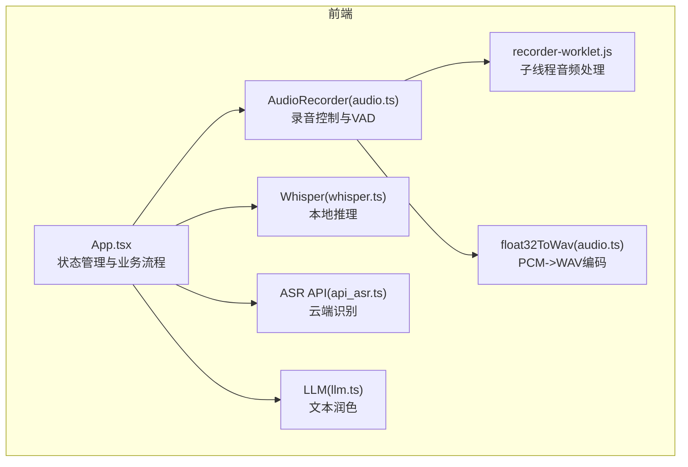
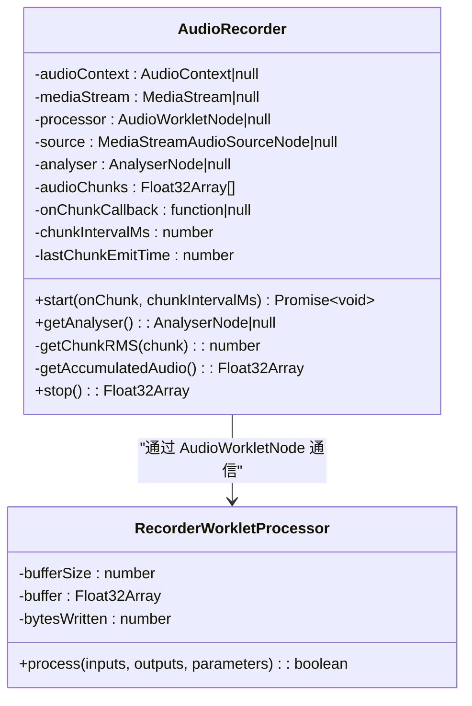
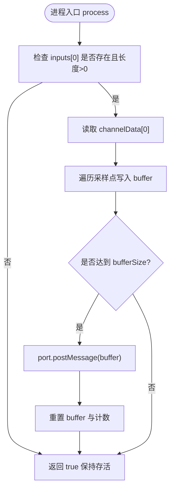
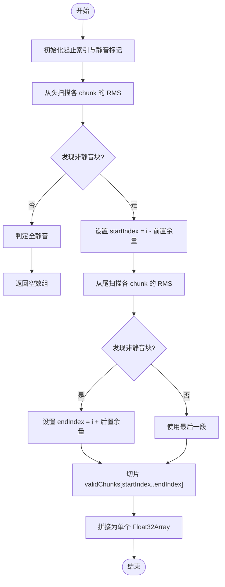
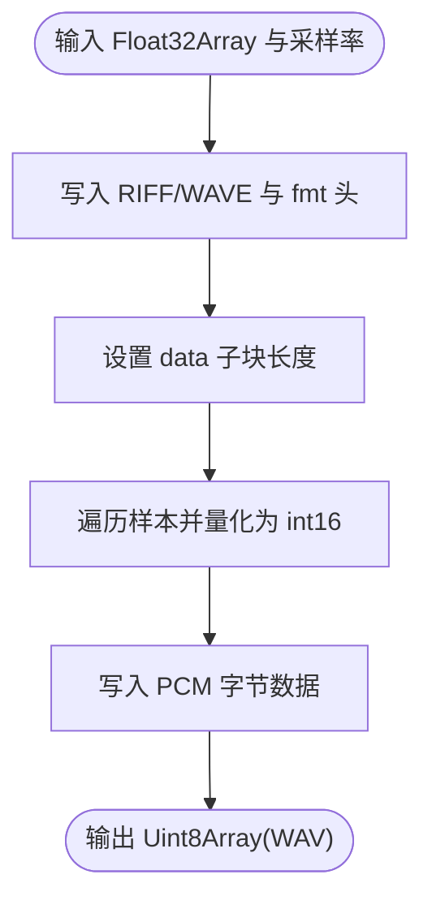
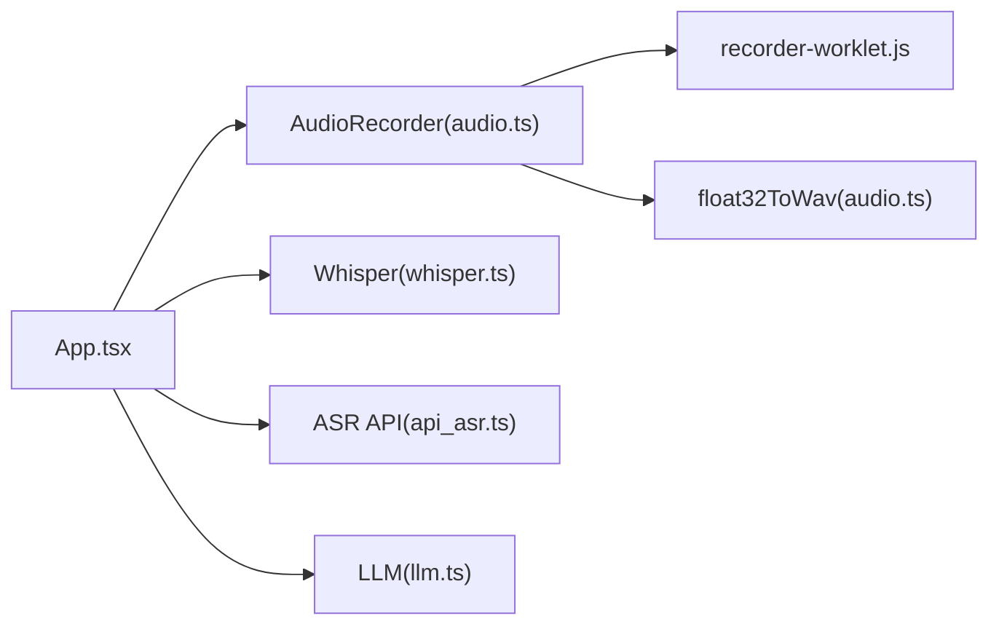

# 音频处理系统

<cite>
**本文引用的文件**   
- [recorder-worklet.js](file://public/recorder-worklet.js)
- [audio.ts](file://src/utils/audio.ts)
- [App.tsx](file://src/App.tsx)
- [whisper.ts](file://src/utils/whisper.ts)
- [api_asr.ts](file://src/utils/api_asr.ts)
- [llm.ts](file://src/utils/llm.ts)
</cite>

## 目录
1. [简介](#简介)
2. [项目结构](#项目结构)
3. [核心组件](#核心组件)
4. [架构总览](#架构总览)
5. [详细组件分析](#详细组件分析)
6. [依赖关系分析](#依赖关系分析)
7. [性能考量](#性能考量)
8. [故障排查指南](#故障排查指南)
9. [结论](#结论)
10. [附录：使用示例与最佳实践](#附录使用示例与最佳实践)

## 简介
本文件为 VoiceFlow_AI_002 的音频处理系统提供深入文档，重点覆盖以下方面：
- AudioRecorder 类的实现原理与 Web Audio API 的使用方式
- 基于 AudioWorklet 的多线程音频采集与分片机制
- VAD（语音活动检测）算法：RMS 静音检测与自动裁剪
- 音频格式转换函数 float32ToWav：从 PCM 数据到 WAV 文件的完整流程
- 初始化录音器、参数配置、错误处理与性能优化技巧
- 面向初学者的 Web Audio API 基础概念介绍
- 面向高级开发者的底层音频处理技术细节

## 项目结构
本项目采用 Tauri + React + TypeScript 的前端应用，音频处理逻辑集中在前端模块中，通过 Web Audio API 完成实时采集与处理，并通过本地或远程 ASR 引擎进行识别。



图表来源
- [App.tsx:1-774](file://src/App.tsx#L1-L774)
- [audio.ts:1-221](file://src/utils/audio.ts#L1-L221)
- [recorder-worklet.js:1-39](file://public/recorder-worklet.js#L1-L39)
- [whisper.ts:1-174](file://src/utils/whisper.ts#L1-L174)
- [api_asr.ts:1-73](file://src/utils/api_asr.ts#L1-L73)
- [llm.ts:1-65](file://src/utils/llm.ts#L1-L65)

章节来源
- [App.tsx:1-774](file://src/App.tsx#L1-L774)
- [audio.ts:1-221](file://src/utils/audio.ts#L1-L221)
- [recorder-worklet.js:1-39](file://public/recorder-worklet.js#L1-L39)
- [whisper.ts:1-174](file://src/utils/whisper.ts#L1-L174)
- [api_asr.ts:1-73](file://src/utils/api_asr.ts#L1-L73)
- [llm.ts:1-65](file://src/utils/llm.ts#L1-L65)

## 核心组件
- AudioRecorder：封装了麦克风访问、AudioContext 创建、AnalyserNode 可视化、AudioWorklet 节点注册与消息通信、分片累积与回调、VAD 静音切除等能力。
- recorder-worklet.js：在独立工作线程中执行音频采样收集，按固定缓冲区大小将 Float32Array 片段投递给主线程。
- float32ToWav：将 Float32Array 的 PCM 样本转换为符合 RIFF/WAV 规范的字节数组，供 SenseVoice 或外部服务使用。
- Whisper 与 ASR API：分别提供本地与云端两种识别路径；前者基于 transformers.js，后者通过标准 OpenAI 兼容接口上传 WAV。
- LLM 文本润色：根据场景与风格对识别结果进行二次加工。

章节来源
- [audio.ts:1-221](file://src/utils/audio.ts#L1-L221)
- [recorder-worklet.js:1-39](file://public/recorder-worklet.js#L1-L39)
- [api_asr.ts:1-73](file://src/utils/api_asr.ts#L1-L73)
- [whisper.ts:1-174](file://src/utils/whisper.ts#L1-L174)
- [llm.ts:1-65](file://src/utils/llm.ts#L1-L65)

## 架构总览
整体数据流如下：
- 用户触发录音 -> App 调用 AudioRecorder.start()
- MediaStream 接入 AudioContext，经 AnalyserNode 后进入 AudioWorkletNode
- 工作线程 RecorderWorkletProcessor 每收集满一个缓冲区即 postMessage 回主线程
- 主线程累积 chunks，按时间间隔合并并回调上层（伪流式）
- 停止时执行 VAD 静音切除，返回完整 Float32Array
- 根据配置选择本地 Whisper 或云端 ASR API 进行识别，可选 LLM 润色

```mermaid
sequenceDiagram
participant UI as "App.tsx"
participant Rec as "AudioRecorder(audio.ts)"
participant AC as "AudioContext"
participant Src as "MediaStreamSource"
participant Ana as "AnalyserNode"
participant Worklet as "AudioWorkletNode"
participant Proc as "RecorderWorkletProcessor"
participant ASR as "Whisper/ASR API"
participant LLM as "LLM 润色"
UI->>Rec : start(onChunk, interval)
Rec->>AC : new AudioContext({sampleRate : 16000})
Rec->>Src : createMediaStreamSource(mediaStream)
Rec->>Ana : createAnalyser()
Rec->>AC : audioWorklet.addModule('/recorder-worklet.js')
Rec->>Worklet : new AudioWorkletNode('recorder-worklet')
Src->>Ana->>Worklet->>Proc : 音频图连接
Proc-->>Rec : port.postMessage(Float32Array)
Rec->>UI : onChunk(accumulatedFloat32) 周期性触发
UI->>Rec : stop()
Rec->>Rec : VAD 静音切除
Rec-->>UI : Float32Array
UI->>ASR : 转写(本地或云端)
ASR-->>UI : text
UI->>LLM : 可选润色
LLM-->>UI : refinedText
```

图表来源
- [App.tsx:374-435](file://src/App.tsx#L374-L435)
- [App.tsx:462-640](file://src/App.tsx#L462-L640)
- [audio.ts:12-73](file://src/utils/audio.ts#L12-L73)
- [audio.ts:109-173](file://src/utils/audio.ts#L109-L173)
- [recorder-worklet.js:9-35](file://public/recorder-worklet.js#L9-L35)
- [whisper.ts:121-174](file://src/utils/whisper.ts#L121-L174)
- [api_asr.ts:41-73](file://src/utils/api_asr.ts#L41-L73)
- [llm.ts:16-65](file://src/utils/llm.ts#L16-L65)

## 详细组件分析

### AudioRecorder 类与 Web Audio API 集成
- 设备与上下文
  - 通过 navigator.mediaDevices.getUserMedia 获取单声道麦克风流，开启回声消除与降噪。
  - 创建指定 16000Hz 采样的 AudioContext，并在需要时恢复 suspended 状态。
- 音频图构建
  - source -> analyser -> processor -> destination，确保可同时进行波形分析与录制。
- AudioWorklet 加载与通信
  - 动态加载 /recorder-worklet.js，实例化 AudioWorkletNode，监听 port.onmessage 接收 Float32Array 片段。
- 分片与伪流式输出
  - 维护 audioChunks 队列，按 chunkIntervalMs 周期合并已积累的数据，调用 onChunk 回调。
- 可视化支持
  - 暴露 getAnalyser() 以在主线程计算音量并驱动 UI 动效。

章节来源
- [audio.ts:12-73](file://src/utils/audio.ts#L12-L73)
- [audio.ts:75-77](file://src/utils/audio.ts#L75-L77)

#### 类关系图


图表来源
- [audio.ts:1-174](file://src/utils/audio.ts#L1-L174)
- [recorder-worklet.js:1-39](file://public/recorder-worklet.js#L1-L39)

### AudioWorklet 多线程音频处理
- 工作线程职责
  - 仅关注第一个输入通道（单声道），将采样点写入内部缓冲。
  - 当缓冲达到 bufferSize（默认 4096）时，postMessage 发送当前缓冲至主线程，并重置缓冲。
- 主线程消费
  - 收到 Float32Array 后入队，并按时间阈值合并输出，形成“伪流式”效果。

章节来源
- [recorder-worklet.js:1-39](file://public/recorder-worklet.js#L1-L39)
- [audio.ts:50-67](file://src/utils/audio.ts#L50-L67)

#### 工作线程处理流程图


图表来源
- [recorder-worklet.js:9-35](file://public/recorder-worklet.js#L9-L35)

### VAD（语音活动检测）与自动裁剪
- RMS 静音检测
  - 对每个 chunk 计算均方根能量，若低于阈值则视为静音。
- 自动裁剪策略
  - 停止录音时，从前向后扫描找到首个非静音块，保留若干前置余量（约 0.5 秒）。
  - 从后向前扫描找到最后一个非静音块，保留若干后置余量。
  - 若全静音，直接丢弃并返回空数组。
- 实时累积裁剪（用于伪流式）
  - 在周期性合并前，去除开头连续静音段，提升首字响应速度。

章节来源
- [audio.ts:79-107](file://src/utils/audio.ts#L79-L107)
- [audio.ts:132-173](file://src/utils/audio.ts#L132-L173)

#### VAD 算法流程图


图表来源
- [audio.ts:132-173](file://src/utils/audio.ts#L132-L173)

### 音频格式转换：float32ToWav
- 输入：Float32Array PCM 样本（范围 [-1, 1]）、采样率（默认 16000）
- 输出：Uint8Array 表示的 WAV 字节流
- 关键步骤
  - 构造 RIFF/WAVE 头部（RIFF、WAVE、fmt、data 子块）
  - 将浮点样本归一化并量化为 16-bit PCM（小端序）
  - 填充 data 子块长度与字节数据
- 用途
  - 本地 SenseVoice 推理需写入 .wav 文件
  - 云端 ASR API 可直接使用 Blob 形式的 WAV

章节来源
- [audio.ts:176-221](file://src/utils/audio.ts#L176-L221)
- [api_asr.ts:8-39](file://src/utils/api_asr.ts#L8-L39)

#### WAV 编码流程图


图表来源
- [audio.ts:176-221](file://src/utils/audio.ts#L176-L221)

### 识别与润色链路
- 本地 Whisper
  - 优先尝试 WebGPU，失败自动回退 WASM；支持进度回调与内存休眠策略。
- 云端 ASR API
  - 将 Float32Array 编码为 WAV Blob，POST 到 OpenAI 兼容接口，返回 text。
- LLM 润色
  - 根据提示词风格与应用场景注入上下文，生成精炼文本。

章节来源
- [whisper.ts:35-112](file://src/utils/whisper.ts#L35-L112)
- [whisper.ts:121-174](file://src/utils/whisper.ts#L121-L174)
- [api_asr.ts:41-73](file://src/utils/api_asr.ts#L41-L73)
- [llm.ts:16-65](file://src/utils/llm.ts#L16-L65)

## 依赖关系分析
- 组件耦合
  - App.tsx 作为编排层，协调 AudioRecorder、Whisper、ASR API 与 LLM。
  - AudioRecorder 依赖浏览器原生 API（MediaDevices、AudioContext、AudioWorklet）。
  - Whisper 依赖 @huggingface/transformers，具备设备自适应与降级策略。
  - ASR API 依赖网络请求与标准表单上传。
- 外部依赖
  - Tauri 事件与窗口管理用于全局快捷键与指示器窗口联动。
  - 文件系统用于临时写入 wav 文件（SenseVoice 场景）。



图表来源
- [App.tsx:1-774](file://src/App.tsx#L1-L774)
- [audio.ts:1-221](file://src/utils/audio.ts#L1-L221)
- [recorder-worklet.js:1-39](file://public/recorder-worklet.js#L1-L39)
- [whisper.ts:1-174](file://src/utils/whisper.ts#L1-L174)
- [api_asr.ts:1-73](file://src/utils/api_asr.ts#L1-L73)
- [llm.ts:1-65](file://src/utils/llm.ts#L1-L65)

## 性能考量
- 采样率与重采样
  - 使用 16000Hz 采样，满足大多数 ASR 模型需求，减少带宽与计算开销。
- 分片大小与频率
  - 工作线程缓冲区 4096 采样（约 256ms），主线程按 2s 周期合并输出，平衡延迟与吞吐。
- 静音切除
  - 前后各保留约 0.5 秒余量，避免截断首尾音节，提高识别准确率。
- 设备适配与降级
  - Whisper 优先 WebGPU，失败自动回退 WASM，增强兼容性。
- 资源释放
  - 停止录音时断开所有节点、关闭 AudioContext、释放媒体轨道，防止内存泄漏。

[本节为通用性能建议，不直接分析具体代码文件]

## 故障排查指南
- 无法启动麦克风
  - 检查权限与浏览器策略；确认 getUserMedia 成功；查看控制台错误信息。
- AudioWorklet 加载失败
  - 确认 /recorder-worklet.js 位于 public 目录且可被访问；检查 addModule 异常。
- 无声音或识别结果为空
  - 检查 VAD 阈值与最大振幅判断；靠近麦克风或提高音量；确认环境噪声抑制设置。
- 云端 ASR 请求失败
  - 校验 API Key、URL 与模型名；检查网络连通性与跨域策略；查看响应状态码与错误体。
- 本地 Whisper 推理崩溃
  - 观察是否触发 WebGPU 执行阶段异常；系统将自动回退 WASM 并重试；必要时清理缓存或更新驱动。

章节来源
- [audio.ts:40-45](file://src/utils/audio.ts#L40-L45)
- [api_asr.ts:41-73](file://src/utils/api_asr.ts#L41-L73)
- [whisper.ts:86-108](file://src/utils/whisper.ts#L86-L108)
- [whisper.ts:152-172](file://src/utils/whisper.ts#L152-L172)

## 结论
本音频处理系统通过 Web Audio API 与 AudioWorklet 实现了低延迟、高可靠的实时采集与分片传输；结合 RMS 静音检测与自动裁剪，显著提升了识别质量与用户体验。同时，系统提供了本地与云端双路径识别方案，并支持 LLM 文本润色，满足不同场景需求。对于初学者，理解 Web Audio 基本概念即可上手；对于高级开发者，可通过调整分片大小、VAD 阈值与设备策略进一步优化性能与稳定性。

[本节为总结性内容，不直接分析具体代码文件]

## 附录：使用示例与最佳实践

### 初始化录音器与基本用法
- 创建 AudioRecorder 实例
  - 参考路径：[audio.ts:1-11](file://src/utils/audio.ts#L1-L11)
- 启动录音
  - 传入 onChunk 回调与分片间隔（毫秒）
  - 参考路径：[audio.ts:12-73](file://src/utils/audio.ts#L12-L73)
- 停止录音并获取最终音频
  - 返回 Float32Array，包含 VAD 裁剪后的有效片段
  - 参考路径：[audio.ts:109-173](file://src/utils/audio.ts#L109-L173)

章节来源
- [audio.ts:1-173](file://src/utils/audio.ts#L1-L173)

### 参数配置建议
- 采样率：16000Hz（兼顾清晰度与效率）
- 分片大小：4096 采样（约 256ms）
- 分片间隔：2000ms（伪流式输出）
- VAD 阈值：0.005（RMS），可根据环境微调
- 前置/后置余量：约 0.5 秒（2 个 chunk）

章节来源
- [recorder-worklet.js:4-6](file://public/recorder-worklet.js#L4-L6)
- [audio.ts:56-67](file://src/utils/audio.ts#L56-L67)
- [audio.ts:132-173](file://src/utils/audio.ts#L132-L173)

### 错误处理要点
- 捕获 getUserMedia 与 addModule 异常
- 处理 ASR API 与 LLM 的网络错误
- 针对 WebGPU 执行异常进行自动回退

章节来源
- [audio.ts:40-45](file://src/utils/audio.ts#L40-L45)
- [api_asr.ts:65-73](file://src/utils/api_asr.ts#L65-L73)
- [whisper.ts:86-108](file://src/utils/whisper.ts#L86-L108)
- [whisper.ts:152-172](file://src/utils/whisper.ts#L152-L172)

### 性能优化技巧
- 合理设置分片间隔，降低主线程压力
- 利用 AnalyserNode 进行轻量级音量监控，避免频繁 DOM 操作
- 使用内存休眠策略释放 Whisper 引擎占用
- 在无需流式输出的场景下禁用 onChunk 回调

章节来源
- [audio.ts:35-37](file://src/utils/audio.ts#L35-L37)
- [whisper.ts:23-33](file://src/utils/whisper.ts#L23-L33)