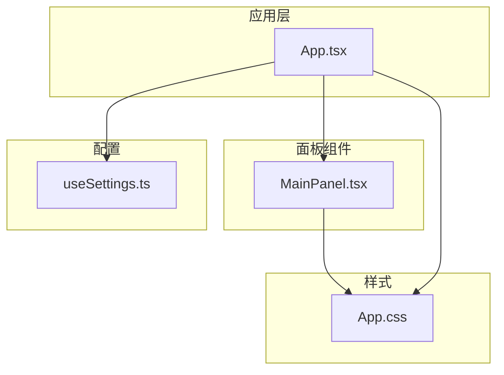
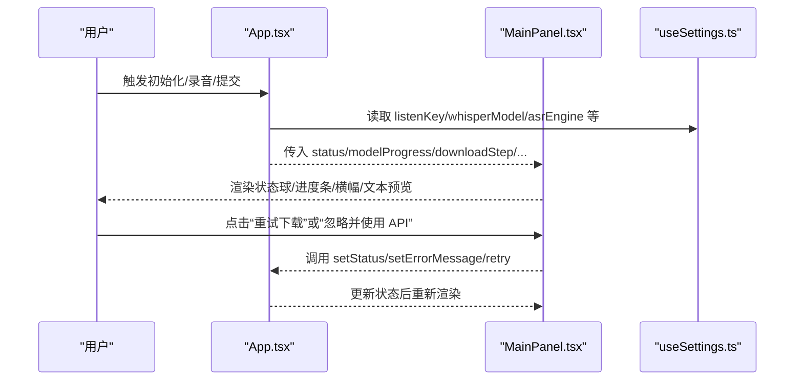
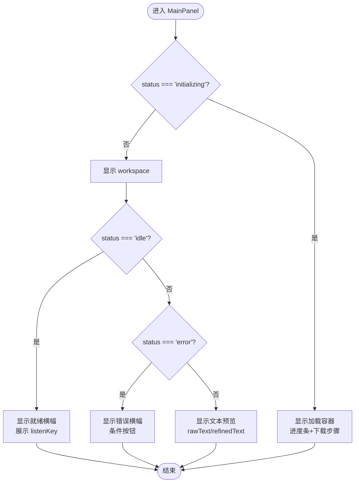
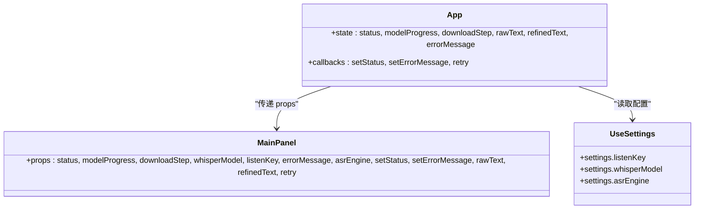

# 主控制面板

<cite>
**本文引用的文件**
- [MainPanel.tsx](file://src/components/MainPanel.tsx)
- [App.tsx](file://src/App.tsx)
- [App.css](file://src/App.css)
- [useSettings.ts](file://src/hooks/useSettings.ts)
</cite>

## 目录
1. [简介](#简介)
2. [项目结构](#项目结构)
3. [核心组件](#核心组件)
4. [架构总览](#架构总览)
5. [详细组件分析](#详细组件分析)
6. [依赖关系分析](#依赖关系分析)
7. [性能与可访问性](#性能与可访问性)
8. [样式定制与主题支持](#样式定制与主题支持)
9. [故障排查指南](#故障排查指南)
10. [结论](#结论)

## 简介
本文件聚焦于 VoiceFlow_AI_002 的主控制面板组件 MainPanel，系统性说明其视觉外观、行为逻辑、用户交互模式、属性与事件处理机制，并给出状态球动画、进度条、错误横幅、实时文本预览（ASR 原文与 AI 优化文本）的实现细节。同时提供响应式设计与可访问性建议，以及样式定制与主题覆盖方法。

## 项目结构
主面板位于 src/components/MainPanel.tsx，由 App.tsx 作为父容器注入状态与回调；样式集中于 src/App.css；设置项来源为 hooks/useSettings.ts。

图表来源
- [App.tsx:726-739](file://src/App.tsx#L726-L739)
- [MainPanel.tsx:19-32](file://src/components/MainPanel.tsx#L19-L32)
- [App.css:183-246](file://src/App.css#L183-L246)
- [useSettings.ts:36-96](file://src/hooks/useSettings.ts#L36-L96)

章节来源
- [App.tsx:726-739](file://src/App.tsx#L726-L739)
- [MainPanel.tsx:19-32](file://src/components/MainPanel.tsx#L19-L32)
- [App.css:183-246](file://src/App.css#L183-L246)
- [useSettings.ts:36-96](file://src/hooks/useSettings.ts#L36-L96)

## 核心组件
MainPanel 是一个无副作用的展示型组件，负责：
- 模型初始化加载态（进度条与下载步骤提示）
- 中心状态球（idle/recording/transcribing/rewriting/success/error）
- 就绪提示横幅（显示监听快捷键）
- 错误提示横幅（含重试或忽略操作）
- 实时文本预览区（ASR 识别原文 + AI 优化文本）

章节来源
- [MainPanel.tsx:4-17](file://src/components/MainPanel.tsx#L4-L17)
- [MainPanel.tsx:33-126](file://src/components/MainPanel.tsx#L33-L126)

## 架构总览
MainPanel 通过 props 接收状态与回调，不直接持有业务逻辑。父组件 App.tsx 管理录音、转写、AI 润色等流程，并将结果与状态同步至 MainPanel 渲染。

图表来源
- [App.tsx:726-739](file://src/App.tsx#L726-L739)
- [MainPanel.tsx:82-98](file://src/components/MainPanel.tsx#L82-L98)
- [useSettings.ts:36-96](file://src/hooks/useSettings.ts#L36-L96)

## 详细组件分析

### 组件属性与类型
- status: 当前工作流状态，用于驱动不同 UI 分支与动效
- modelProgress: 模型下载/加载进度百分比
- downloadStep: 下载步骤描述（可选）
- whisperModel: 当前选择的本地模型标识（用于估算大小与提示）
- listenKey: 全局监听快捷键（如 RControl），在就绪横幅中展示
- errorMessage: 错误信息文本
- asrEngine: 识别引擎选择（local/api）
- setStatus / setErrorMessage: 状态与错误消息的回调
- rawText / refinedText: ASR 识别原文与 AI 优化后的文本
- retry: 可选的重试回调（用于重新触发模型下载/初始化）

章节来源
- [MainPanel.tsx:4-17](file://src/components/MainPanel.tsx#L4-L17)
- [App.tsx:726-739](file://src/App.tsx#L726-L739)

### 视觉外观与布局
- 整体容器 main-pane 居中布局，workspace 内部纵向排列各模块
- 状态球 orb-inner 与光晕 orb-glow 组合，随状态切换边框颜色、阴影与缩放
- 就绪横幅 status-text-banner 展示欢迎语与快捷键 kbd 高亮
- 错误横幅 error-banner 包含标题、说明与操作按钮
- 文本预览卡片 text-preview-card 分为两段：ASR 识别原文与 AI 优化文本，后者带分隔线与图标

章节来源
- [MainPanel.tsx:33-126](file://src/components/MainPanel.tsx#L33-L126)
- [App.css:183-246](file://src/App.css#L183-L246)
- [App.css:248-332](file://src/App.css#L248-L332)
- [App.css:335-367](file://src/App.css#L335-L367)
- [App.css:369-412](file://src/App.css#L369-L412)
- [App.css:785-853](file://src/App.css#L785-L853)

### 行为逻辑与交互
- 初始化阶段：当 status 为 initializing 时，显示旋转图标、提示文案、下载步骤与进度条
- 就绪阶段：status 为 idle 时，显示就绪横幅与快捷键提示
- 错误阶段：status 为 error 时，显示错误横幅与操作按钮
  - 若错误信息包含特定提示且 asrEngine 为 api，显示“忽略并使用 API”按钮，点击将清空错误并回到 idle
  - 若存在 retry 回调，显示“重试下载”按钮，点击将清空错误并触发重试
- 文本预览：当 rawText 或 refinedText 非空时，显示预览卡片；两者分别独立区块展示

章节来源
- [MainPanel.tsx:35-50](file://src/components/MainPanel.tsx#L35-L50)
- [MainPanel.tsx:69-74](file://src/components/MainPanel.tsx#L69-L74)
- [MainPanel.tsx:77-100](file://src/components/MainPanel.tsx#L77-L100)
- [MainPanel.tsx:102-121](file://src/components/MainPanel.tsx#L102-L121)

### 状态球动画效果
- 状态类名附加到 status-orb-container，控制 orb-inner 边框色与 orb-glow 背景色、模糊度与透明度
- recording：红色边框与发光，配合脉冲红图标
- transcribing：蓝色边框与发光，配合旋转图标
- rewriting：绿色边框与发光，配合闪烁图标
- success：绿色边框与发光，内圈轻微放大
- error：橙色边框与发光

章节来源
- [MainPanel.tsx:56-66](file://src/components/MainPanel.tsx#L56-L66)
- [App.css:248-332](file://src/App.css#L248-L332)
- [App.css:437-467](file://src/App.css#L437-L467)

### 进度条显示
- 进度条背景 progress-bar-bg 与填充 progress-bar-fill，宽度由 modelProgress 动态计算
- 下方显示百分比文本 progress-text

章节来源
- [MainPanel.tsx:45-48](file://src/components/MainPanel.tsx#L45-L48)
- [App.css:226-246](file://src/App.css#L226-L246)

### 错误提示横幅
- 错误横幅 error-banner 使用柔和红色背景与边框，标题与正文采用暖红色系
- 操作按钮 btn-error-action 具备悬停与按下反馈

章节来源
- [MainPanel.tsx:77-100](file://src/components/MainPanel.tsx#L77-L100)
- [App.css:785-853](file://src/App.css#L785-L853)

### 实时文本预览区域
- 预览卡片 text-preview-card 以卡片形式呈现，支持滚动与换行
- ASR 识别原文区块：仅显示原始识别结果
- AI 优化文本区块：带分隔线、图标与标题，展示经 LLM 润色后的文本

章节来源
- [MainPanel.tsx:102-121](file://src/components/MainPanel.tsx#L102-L121)
- [App.css:369-412](file://src/App.css#L369-L412)

### 事件处理机制
- 父组件 App.tsx 通过 props 向 MainPanel 注入 setStatus、setErrorMessage、retry
- MainPanel 在错误横幅中根据条件调用这些回调，实现“忽略并使用 API”和“重试下载”两种路径
- 所有状态变更最终回落到 App.tsx 的状态机，再驱动 MainPanel 重渲染

章节来源
- [MainPanel.tsx:82-98](file://src/components/MainPanel.tsx#L82-L98)
- [App.tsx:726-739](file://src/App.tsx#L726-L739)

### 数据流与状态流转

图表来源
- [MainPanel.tsx:33-126](file://src/components/MainPanel.tsx#L33-L126)

## 依赖关系分析
- MainPanel 依赖 React 与 lucide-react 图标库
- 样式依赖 App.css 中的类名与变量
- 父组件 App.tsx 提供状态与回调，并通过 useSettings 获取 listenKey、whisperModel、asrEngine 等配置

图表来源
- [MainPanel.tsx:4-17](file://src/components/MainPanel.tsx#L4-L17)
- [App.tsx:726-739](file://src/App.tsx#L726-L739)
- [useSettings.ts:36-96](file://src/hooks/useSettings.ts#L36-L96)

章节来源
- [MainPanel.tsx:4-17](file://src/components/MainPanel.tsx#L4-L17)
- [App.tsx:726-739](file://src/App.tsx#L726-L739)
- [useSettings.ts:36-96](file://src/hooks/useSettings.ts#L36-L96)

## 性能与可访问性
- 性能
  - MainPanel 为纯展示组件，避免在渲染中进行复杂计算
  - 进度条宽度通过内联 style 直接绑定，减少额外 DOM 操作
  - 图标按需渲染，避免不必要的重绘
- 可访问性
  - 错误横幅标题与正文语义清晰，便于屏幕阅读器理解
  - 快捷键提示使用 kbd 元素，增强可读性与可发现性
  - 建议为关键按钮添加 aria-label，提升键盘导航体验

章节来源
- [MainPanel.tsx:77-100](file://src/components/MainPanel.tsx#L77-L100)
- [MainPanel.tsx:69-74](file://src/components/MainPanel.tsx#L69-L74)

## 样式定制与主题支持
- 主题变量
  - 根级 CSS 变量定义深色主题配色与渐变，包括背景、面板、边框、文字、强调色、霓虹色等
  - 可通过覆盖 :root 下的变量快速调整整体风格
- 关键类名与覆盖点
  - .main-pane/.workspace：主面板与工作台布局
  - .loading-container/.progress-bar-bg/.progress-bar-fill/.progress-text：加载与进度条
  - .status-orb-container/.orb-inner/.orb-glow：状态球及其光晕
  - .status-text-banner/kbd：就绪横幅与快捷键样式
  - .text-preview-card/.preview-section/.section-header/.section-body：文本预览卡片与内容块
  - .error-banner/.btn-error-action：错误横幅与操作按钮
- 自定义样式覆盖方法
  - 在应用入口引入自定义 CSS，并在其中覆盖上述类名或变量
  - 针对状态球，可在对应状态类下扩展边框色、阴影与动画参数
  - 对于文本预览，可调整 section-body 的背景、圆角与行高以适配品牌风格

章节来源
- [App.css:4-23](file://src/App.css#L4-L23)
- [App.css:183-246](file://src/App.css#L183-L246)
- [App.css:248-332](file://src/App.css#L248-L332)
- [App.css:335-367](file://src/App.css#L335-L367)
- [App.css:369-412](file://src/App.css#L369-L412)
- [App.css:785-853](file://src/App.css#L785-L853)

## 故障排查指南
- 初始化失败
  - 现象：进入 error 状态并显示错误横幅
  - 处理：若 asrEngine 为 api 且错误信息匹配，可点击“忽略并使用 API”；否则点击“重试下载”
- 麦克风无法启动
  - 现象：error 状态，错误信息提示无法启动麦克风
  - 处理：检查系统权限与设备占用，必要时重启应用
- 音量过低
  - 现象：error 状态，提示未检测到人声或音量过低
  - 处理：靠近麦克风或提高音量，确保环境安静
- 网络异常导致 AI 润色失败
  - 现象：error 状态，保留识别原文
  - 处理：检查网络连接与 API 密钥配置

章节来源
- [MainPanel.tsx:77-100](file://src/components/MainPanel.tsx#L77-L100)
- [App.tsx:429-434](file://src/App.tsx#L429-L434)
- [App.tsx:493-505](file://src/App.tsx#L493-L505)
- [App.tsx:627-633](file://src/App.tsx#L627-L633)

## 结论
MainPanel 作为主控制面板的核心展示层，通过清晰的 props 接口与丰富的视觉反馈，为用户提供了直观的语音听写与 AI 润色体验。结合 App.tsx 的状态管理与 useSettings 的配置能力，实现了从模型初始化、录音、转写到文本优化的完整链路。通过 CSS 变量与类名体系，开发者可以便捷地进行主题化与样式定制，满足多场景与品牌化的需求。