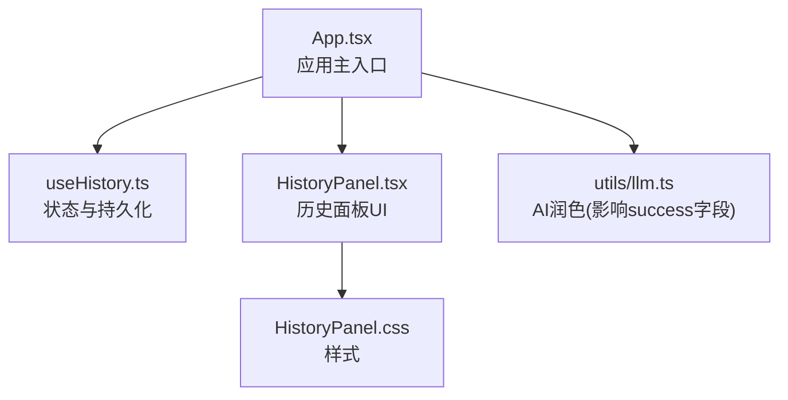
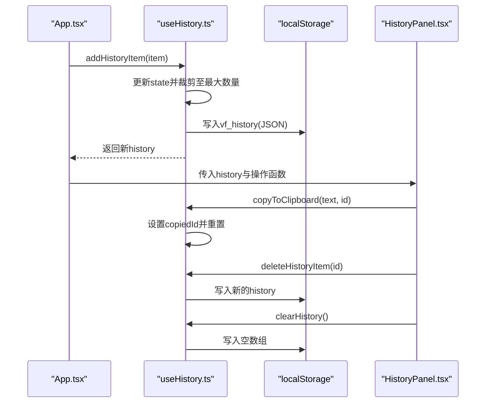
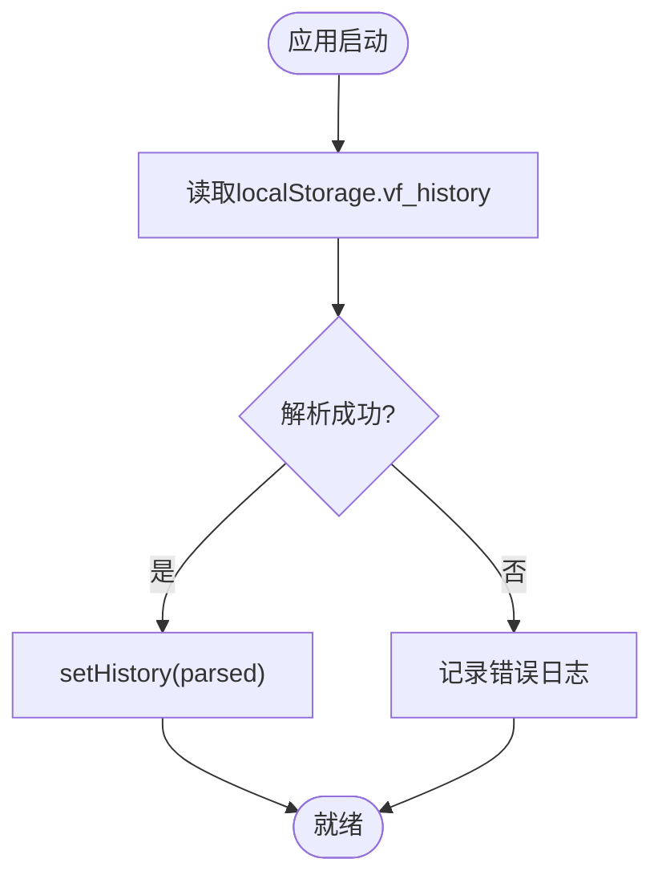
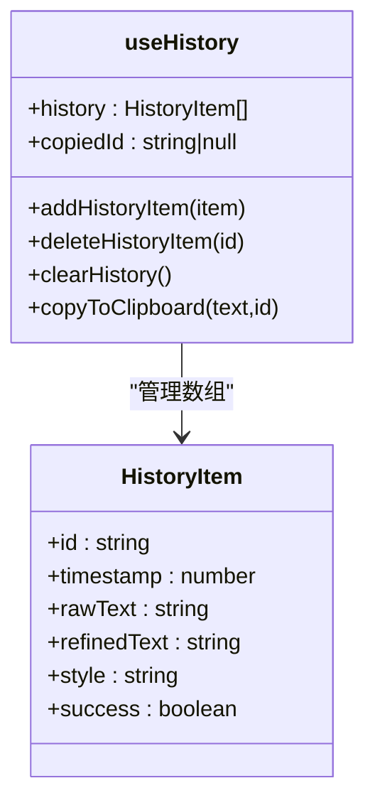
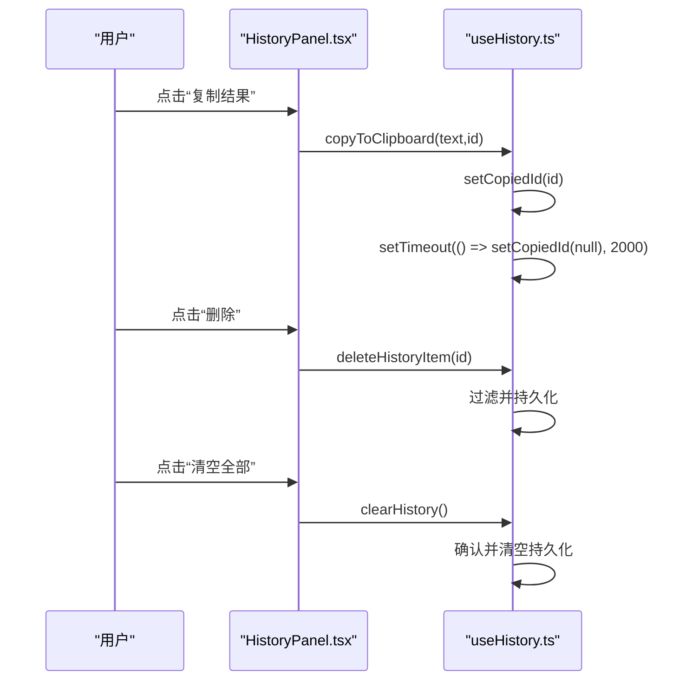
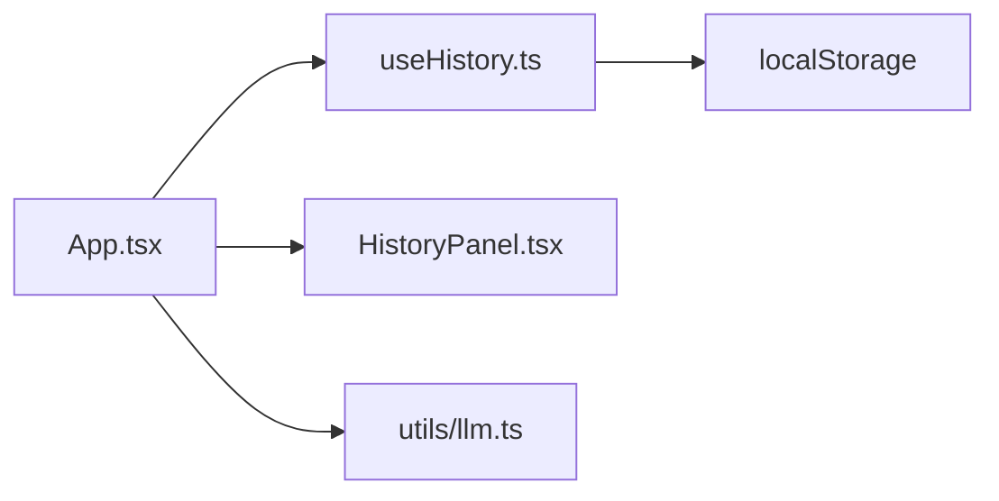

# 历史记录面板

<cite>
**本文引用的文件**
- [src/hooks/useHistory.ts](file://src/hooks/useHistory.ts)
- [src/components/HistoryPanel.tsx](file://src/components/HistoryPanel.tsx)
- [src/components/HistoryPanel.css](file://src/components/HistoryPanel.css)
- [src/App.tsx](file://src/App.tsx)
- [src/utils/llm.ts](file://src/utils/llm.ts)
</cite>

## 目录
1. [简介](#简介)
2. [项目结构](#项目结构)
3. [核心组件与数据结构](#核心组件与数据结构)
4. [架构总览](#架构总览)
5. [详细组件分析](#详细组件分析)
6. [依赖关系分析](#依赖关系分析)
7. [性能考虑](#性能考虑)
8. [故障排查指南](#故障排查指南)
9. [结论](#结论)
10. [附录：导入导出格式与兼容性](#附录导入导出格式与兼容性)

## 简介
本文件为 VoiceFlow_AI_002 的“历史记录管理面板”提供系统化文档，覆盖以下方面：
- 数据结构 HistoryItem 的定义与字段含义
- 持久化存储机制（localStorage）与数据同步策略
- 历史记录的状态管理模式（useHistory Hook）
- 渲染组件、时间线布局与交互操作
- 当前实现中缺失的能力（搜索、过滤、排序、导出）及扩展建议
- 数据清理、批量操作与性能优化技巧
- 导入导出格式说明与兼容性注意事项

## 项目结构
与历史记录面板直接相关的代码位于前端 React 层，采用“Hook + 组件”的分层组织方式：
- src/hooks/useHistory.ts：定义 HistoryItem 类型与 useHistory Hook，负责状态管理与 localStorage 持久化
- src/components/HistoryPanel.tsx：历史列表 UI 渲染与用户交互
- src/components/HistoryPanel.css：历史面板样式
- src/App.tsx：应用主入口，集成 useHistory Hook 并注入到 HistoryPanel

图表来源
- [src/App.tsx:86-87](file://src/App.tsx#L86-L87)
- [src/hooks/useHistory.ts:12-69](file://src/hooks/useHistory.ts#L12-L69)
- [src/components/HistoryPanel.tsx:14-20](file://src/components/HistoryPanel.tsx#L14-L20)
- [src/utils/llm.ts:16-64](file://src/utils/llm.ts#L16-L64)

章节来源
- [src/App.tsx:86-87](file://src/App.tsx#L86-L87)
- [src/hooks/useHistory.ts:12-69](file://src/hooks/useHistory.ts#L12-L69)
- [src/components/HistoryPanel.tsx:14-20](file://src/components/HistoryPanel.tsx#L14-L20)
- [src/components/HistoryPanel.css:1-150](file://src/components/HistoryPanel.css#L1-L150)
- [src/utils/llm.ts:16-64](file://src/utils/llm.ts#L16-L64)

## 核心组件与数据结构
- HistoryItem 数据结构
  - id: string，唯一标识
  - timestamp: number，记录创建时间戳
  - rawText: string，ASR 原始识别文本
  - refinedText: string，AI 优化后的文本（可能为空或与 rawText 相同）
  - style: string，提示词风格（如自然、正式、精简、学术等）
  - success: boolean，是否成功完成 AI 润色
- useHistory Hook
  - 维护 history 数组与 copiedId 状态
  - 启动时从 localStorage 读取 vf_history 并解析
  - 提供 addHistoryItem、deleteHistoryItem、clearHistory、copyToClipboard 等方法
  - 每次变更都会将最新数组写入 localStorage
- HistoryPanel 组件
  - 接收 history 与操作方法作为 props
  - 展示统计卡片（累计字数、预估节省时间）
  - 按时间倒序渲染历史项，显示 ASR 原文与 AI 优化结果
  - 支持复制单条结果、删除单条、清空全部

章节来源
- [src/hooks/useHistory.ts:3-10](file://src/hooks/useHistory.ts#L3-L10)
- [src/hooks/useHistory.ts:12-69](file://src/hooks/useHistory.ts#L12-L69)
- [src/components/HistoryPanel.tsx:6-20](file://src/components/HistoryPanel.tsx#L6-L20)
- [src/components/HistoryPanel.tsx:21-102](file://src/components/HistoryPanel.tsx#L21-L102)

## 架构总览
历史记录的数据流与控制流如下：
- 录音流程结束后，根据是否配置 LLM API Key 决定是否进行 AI 润色
- 无论是否润色，最终都会调用 addHistoryItem 写入历史
- useHistory 在写入前对数组长度做上限裁剪，随后持久化到 localStorage
- HistoryPanel 消费 history 并渲染，同时触发复制、删除、清空等操作

图表来源
- [src/App.tsx:594-633](file://src/App.tsx#L594-L633)
- [src/hooks/useHistory.ts:31-52](file://src/hooks/useHistory.ts#L31-L52)
- [src/hooks/useHistory.ts:54-59](file://src/hooks/useHistory.ts#L54-L59)
- [src/components/HistoryPanel.tsx:87-95](file://src/components/HistoryPanel.tsx#L87-L95)

## 详细组件分析

### 数据结构 HistoryItem
- 字段说明
  - id：用于定位与删除的单条记录
  - timestamp：用于排序与展示时间
  - rawText：ASR 输出，作为事实源
  - refinedText：可选，AI 润色后文本；若未开启或失败则与 rawText 一致或为空
  - style：记录使用的提示词风格，便于后续筛选或审计
  - success：标记本次是否成功完成 AI 润色
- 复杂度与约束
  - 数组长度限制：新增时保留最近 N 条（N=100），避免无限增长
  - JSON 序列化：所有条目通过 JSON.stringify/parse 读写，需保证字段可序列化

章节来源
- [src/hooks/useHistory.ts:3-10](file://src/hooks/useHistory.ts#L3-L10)
- [src/hooks/useHistory.ts:31-37](file://src/hooks/useHistory.ts#L31-L37)

### 持久化存储机制与数据同步策略
- 存储键名：vf_history
- 初始化加载：组件挂载时读取并解析，异常捕获并打印错误日志
- 写策略：每次增删改都立即落盘，确保状态与存储强一致
- 容量控制：新增时 slice(0, 100)，防止超出浏览器存储配额
- 错误处理：JSON.parse 失败会记录错误但不中断运行

图表来源
- [src/hooks/useHistory.ts:16-25](file://src/hooks/useHistory.ts#L16-L25)

章节来源
- [src/hooks/useHistory.ts:16-29](file://src/hooks/useHistory.ts#L16-L29)
- [src/hooks/useHistory.ts:31-37](file://src/hooks/useHistory.ts#L31-L37)

### 状态管理模式（useHistory Hook）
- 状态
  - history: HistoryItem[]，按时间倒序排列（新项插入头部）
  - copiedId: string | null，用于复制反馈
- 方法
  - addHistoryItem：前置插入并裁剪，再持久化
  - deleteHistoryItem：按 id 过滤后持久化
  - clearHistory：二次确认后清空
  - copyToClipboard：使用 Clipboard API，2秒后清除复制态
- 副作用
  - 首次加载时从 localStorage 恢复历史

图表来源
- [src/hooks/useHistory.ts:3-10](file://src/hooks/useHistory.ts#L3-L10)
- [src/hooks/useHistory.ts:12-69](file://src/hooks/useHistory.ts#L12-L69)

章节来源
- [src/hooks/useHistory.ts:12-69](file://src/hooks/useHistory.ts#L12-L69)

### 渲染组件与交互（HistoryPanel）
- 顶部统计
  - 累计生成字数：遍历 history，累加 (refinedText || rawText).length
  - 预估节省时间：基于字数除以 80 估算分钟数
- 列表渲染
  - 每条记录显示时间、标签（已润色/未润色）、ASR 原文、AI 优化结果（如有）
  - 无优化时显示“本地纯离线保护模式”提示
- 交互按钮
  - 复制结果：调用 copyToClipboard，2秒内显示“已复制”
  - 删除：调用 deleteHistoryItem
  - 清空全部：调用 clearHistory，带确认提示

图表来源
- [src/components/HistoryPanel.tsx:87-95](file://src/components/HistoryPanel.tsx#L87-L95)
- [src/hooks/useHistory.ts:54-59](file://src/hooks/useHistory.ts#L54-L59)
- [src/hooks/useHistory.ts:39-52](file://src/hooks/useHistory.ts#L39-L52)

章节来源
- [src/components/HistoryPanel.tsx:21-102](file://src/components/HistoryPanel.tsx#L21-L102)
- [src/components/HistoryPanel.css:1-150](file://src/components/HistoryPanel.css#L1-L150)

### 与 AI 润色的联动
- 当未配置 LLM API Key 时，跳过润色，直接将原文记入历史，success=false
- 当配置了 API Key 且润色成功，将优化文本记入历史，success=true
- 当润色失败，回退为原文并记录 success=false

章节来源
- [src/App.tsx:594-633](file://src/App.tsx#L594-L633)
- [src/utils/llm.ts:16-64](file://src/utils/llm.ts#L16-L64)

## 依赖关系分析
- App.tsx 引入 useHistory 并将 history 与方法传递给 HistoryPanel
- HistoryPanel 仅消费数据与回调，不直接访问存储
- useHistory 封装了所有与 localStorage 的交互，对外暴露稳定接口
- 历史记录的 success 字段受 LLM 调用结果影响

图表来源
- [src/App.tsx:86-87](file://src/App.tsx#L86-L87)
- [src/hooks/useHistory.ts:12-69](file://src/hooks/useHistory.ts#L12-L69)
- [src/utils/llm.ts:16-64](file://src/utils/llm.ts#L16-L64)

章节来源
- [src/App.tsx:86-87](file://src/App.tsx#L86-L87)
- [src/hooks/useHistory.ts:12-69](file://src/hooks/useHistory.ts#L12-L69)
- [src/utils/llm.ts:16-64](file://src/utils/llm.ts#L16-L64)

## 性能考虑
- 列表长度限制：新增时 slice(0, 100)，避免 DOM 节点过多导致卡顿
- 即时持久化：每次变更即写入 localStorage，减少数据丢失风险，但频繁 I/O 可能带来轻微开销
- 复制反馈：copiedId 状态仅在 2 秒内存在，避免长期持有引用
- 渲染优化建议
  - 对长列表可使用虚拟滚动（如 react-window）
  - 对大文本内容可懒加载或分页渲染
  - 避免在 render 中进行复杂计算（当前统计计算量较小，可接受）

[本节为通用性能建议，无需特定文件来源]

## 故障排查指南
- 历史记录无法加载
  - 检查 localStorage 中是否存在 vf_history
  - 查看控制台是否有 JSON 解析错误日志
- 复制功能无效
  - 检查浏览器是否允许剪贴板权限
  - 确认 copiedId 是否在 2 秒后自动复位
- 清空历史未生效
  - 确认用户是否点击确认
  - 检查 localStorage 是否被清空
- 历史项 success 字段不符合预期
  - 检查 LLM API Key 与 baseUrl 是否正确
  - 查看网络请求与响应状态码

章节来源
- [src/hooks/useHistory.ts:16-25](file://src/hooks/useHistory.ts#L16-L25)
- [src/hooks/useHistory.ts:54-59](file://src/hooks/useHistory.ts#L54-L59)
- [src/hooks/useHistory.ts:47-52](file://src/hooks/useHistory.ts#L47-L52)
- [src/utils/llm.ts:16-64](file://src/utils/llm.ts#L16-L64)

## 结论
历史记录面板以 useHistory Hook 为核心，实现了稳定的状态管理与持久化。当前版本提供了基础的增删查与复制能力，并在 UI 上呈现了时间线与统计信息。搜索、过滤、排序与导出等功能尚未实现，可在现有数据结构基础上平滑扩展。

[本节为总结性内容，无需特定文件来源]

## 附录：导入导出格式与兼容性

### 当前实现现状
- 导出：未实现
- 导入：未实现
- 存储格式：JSON 字符串，键名为 vf_history，值为 HistoryItem 数组

### 推荐导出格式（JSON）
- 文件名：voiceflow_history.json
- 根结构：HistoryItem[]
- 字段要求：
  - id：string，唯一标识
  - timestamp：number，毫秒时间戳
  - rawText：string
  - refinedText：string
  - style：string
  - success：boolean
- 示例结构（示意）：
  - [
      {
        "id": "a1b2c3d",
        "timestamp": 1710000000000,
        "rawText": "你好世界",
        "refinedText": "你好，世界。",
        "style": "natural",
        "success": true
      }
    ]

### 兼容性与迁移建议
- 向后兼容
  - 若未来增加字段，应保留旧字段解析逻辑，缺失字段提供默认值
  - 若字段类型变更，应在导入时进行类型校验与转换
- 数据完整性
  - 导入前校验必填字段（id、timestamp、rawText）
  - 去重策略：可按 id 合并，或追加并重新分配 id
- 安全性
  - 导入前对文本内容进行基础清洗，避免 XSS 风险
  - 限制单次导入的最大条目数，防止内存溢出

[本节为概念性说明，无需特定文件来源]