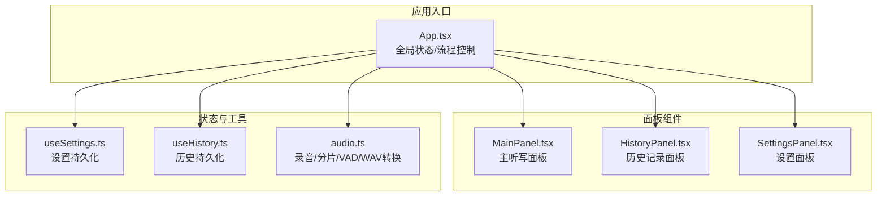
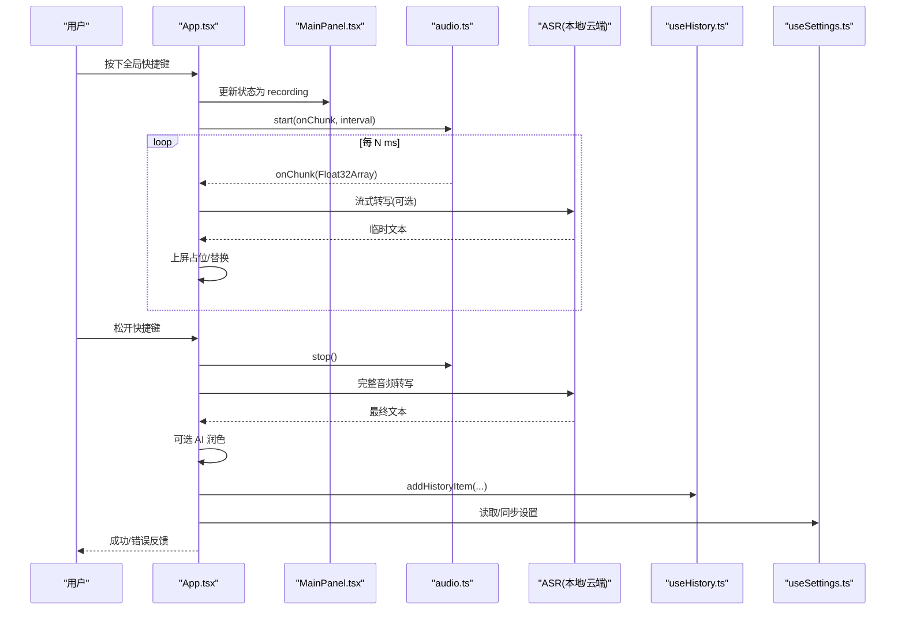
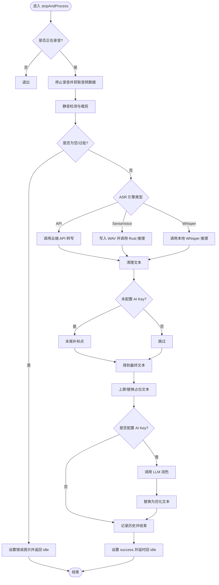
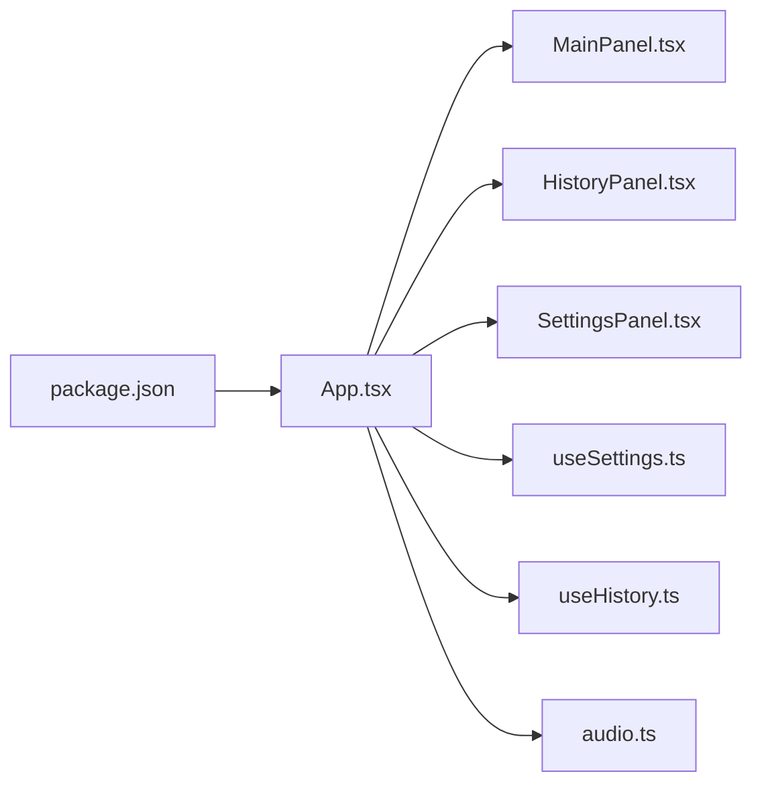

# 用户界面设计

<cite>
**本文引用的文件列表**
- [src/App.tsx](file://src/App.tsx)
- [src/components/MainPanel.tsx](file://src/components/MainPanel.tsx)
- [src/components/HistoryPanel.tsx](file://src/components/HistoryPanel.tsx)
- [src/components/SettingsPanel.tsx](file://src/components/SettingsPanel.tsx)
- [src/hooks/useHistory.ts](file://src/hooks/useHistory.ts)
- [src/hooks/useSettings.ts](file://src/hooks/useSettings.ts)
- [src/utils/audio.ts](file://src/utils/audio.ts)
- [src/App.css](file://src/App.css)
- [src/components/HistoryPanel.css](file://src/components/HistoryPanel.css)
- [src/components/SettingsPanel.css](file://src/components/SettingsPanel.css)
- [package.json](file://package.json)
</cite>

## 目录
1. [简介](#简介)
2. [项目结构](#项目结构)
3. [核心组件](#核心组件)
4. [架构总览](#架构总览)
5. [详细组件分析](#详细组件分析)
6. [依赖关系分析](#依赖关系分析)
7. [性能与体验优化](#性能与体验优化)
8. [故障排查指南](#故障排查指南)
9. [结论](#结论)
10. [附录：样式定制与主题、可访问性与兼容性](#附录样式定制与主题可访问性与兼容性)

## 简介
本文件面向 VoiceFlow_AI_002 的用户界面设计与实现，聚焦主控制面板、历史记录管理、设置管理等 UI 组件的结构与行为，解释组件间的数据流与状态管理机制（React Hooks 使用模式与 localStorage 持久化策略），并提供组件属性、事件与自定义选项说明。同时给出响应式设计指导、可访问性合规建议、样式定制与主题支持方案，以及跨浏览器兼容性注意事项。

## 项目结构
前端采用 React + Tauri 的桌面应用架构，UI 层由三个主要面板组成：主听写面板、历史面板、设置面板。状态通过自定义 Hook 在 App 根组件中集中管理，并通过 props 下发到子组件；本地数据持久化使用 localStorage。

图表来源
- [src/App.tsx:1-774](file://src/App.tsx#L1-L774)
- [src/components/MainPanel.tsx:1-127](file://src/components/MainPanel.tsx#L1-L127)
- [src/components/HistoryPanel.tsx:1-103](file://src/components/HistoryPanel.tsx#L1-L103)
- [src/components/SettingsPanel.tsx:1-344](file://src/components/SettingsPanel.tsx#L1-L344)
- [src/hooks/useSettings.ts:1-97](file://src/hooks/useSettings.ts#L1-L97)
- [src/hooks/useHistory.ts:1-70](file://src/hooks/useHistory.ts#L1-L70)
- [src/utils/audio.ts:1-221](file://src/utils/audio.ts#L1-L221)

章节来源
- [src/App.tsx:1-774](file://src/App.tsx#L1-L774)
- [package.json:1-32](file://package.json#L1-L32)

## 核心组件
- 主控制面板（MainPanel）
  - 负责展示识别引擎初始化进度、当前状态球、错误提示、实时文本预览（ASR 原文与 AI 优化文本）。
  - 接收来自 App 的状态与回调，不直接持有业务逻辑。
- 历史记录面板（HistoryPanel）
  - 展示历史条目、统计信息（累计字数、预估节省时间）、复制与删除操作。
  - 通过 useHistory Hook 提供的能力进行增删改查与剪贴板交互。
- 设置面板（SettingsPanel）
  - 提供 LLM 接口配置、ASR 引擎选择、模型与设备调度、快捷键、黑名单、开机自启等设置项。
  - 支持搜索定位与高亮导航，保存后同步至 Rust 后端（如监听键）。

章节来源
- [src/components/MainPanel.tsx:1-127](file://src/components/MainPanel.tsx#L1-L127)
- [src/components/HistoryPanel.tsx:1-103](file://src/components/HistoryPanel.tsx#L1-L103)
- [src/components/SettingsPanel.tsx:1-344](file://src/components/SettingsPanel.tsx#L1-L344)

## 架构总览
整体数据流遵循“集中状态 + 单向数据流”的模式：
- App 作为唯一状态源，维护识别流程状态、模型进度、错误信息等。
- useSettings 与 useHistory 分别封装设置与历史的读取、更新与持久化。
- 各面板仅消费 props 并触发回调，避免跨层级状态耦合。
- 音频采集与处理集中在 audio.ts，结合 Web Audio API 与可选的云端/本地 ASR 引擎。

图表来源
- [src/App.tsx:256-371](file://src/App.tsx#L256-L371)
- [src/App.tsx:374-640](file://src/App.tsx#L374-L640)
- [src/utils/audio.ts:12-73](file://src/utils/audio.ts#L12-L73)
- [src/hooks/useHistory.ts:31-37](file://src/hooks/useHistory.ts#L31-L37)
- [src/hooks/useSettings.ts:71-88](file://src/hooks/useSettings.ts#L71-L88)

## 详细组件分析

### 主控制面板（MainPanel）
- 职责
  - 渲染加载进度条与下载步骤提示。
  - 显示状态球动画与文案提示。
  - 展示错误横幅及重试/忽略按钮。
  - 展示 ASR 原文与 AI 优化文本对比卡片。
- 关键属性
  - status、modelProgress、downloadStep、whisperModel、listenKey、errorMessage、asrEngine、setStatus、setErrorMessage、rawText、refinedText、retry。
- 交互行为
  - 点击重试时调用 retry 回调以重新初始化模型。
  - 根据 asrEngine 与 errorMessage 内容动态显示不同操作按钮。
- 视觉与动效
  - 状态球在不同状态下呈现不同边框颜色与发光效果。
  - 旋转、脉冲、弹跳等 CSS 动画增强反馈。

章节来源
- [src/components/MainPanel.tsx:1-127](file://src/components/MainPanel.tsx#L1-L127)
- [src/App.css:248-332](file://src/App.css#L248-L332)

### 历史记录面板（HistoryPanel）
- 职责
  - 展示历史列表、空态引导、统计卡片（累计字数、预估节省时间）。
  - 提供复制结果、删除单条、清空全部等操作。
- 关键属性
  - history、deleteHistoryItem、clearHistory、copyToClipboard、copiedId。
- 交互行为
  - 复制成功后短暂显示“已复制”状态。
  - 清空前弹出确认对话框。
- 数据持久化
  - 通过 useHistory Hook 将历史写入 localStorage，限制最大条目数以避免存储膨胀。

章节来源
- [src/components/HistoryPanel.tsx:1-103](file://src/components/HistoryPanel.tsx#L1-L103)
- [src/hooks/useHistory.ts:1-70](file://src/hooks/useHistory.ts#L1-L70)
- [src/components/HistoryPanel.css:1-150](file://src/components/HistoryPanel.css#L1-L150)

### 设置面板（SettingsPanel）
- 职责
  - 分组展示大语言模型接口、听写与优化偏好、ASR 引擎与模型、硬件调度、快捷键、黑名单、开机自启等。
  - 提供搜索框，匹配输入项与标题并高亮导航。
  - 保存设置并反馈保存状态。
- 关键属性
  - settings、updateSetting、saveSettings、saveStatus、logs、setLogs、autostartEnabled、toggleAutostart。
- 交互行为
  - 修改 listenKey 时自动同步至 Rust 后端。
  - 切换 ASR 引擎时动态显示对应配置区。
  - 搜索时滚动到首个匹配项并支持上下导航。
- 数据持久化
  - 统一 JSON 格式存储于 localStorage，兼容旧版分散 key 的迁移。

章节来源
- [src/components/SettingsPanel.tsx:1-344](file://src/components/SettingsPanel.tsx#L1-L344)
- [src/hooks/useSettings.ts:1-97](file://src/hooks/useSettings.ts#L1-L97)
- [src/components/SettingsPanel.css:1-170](file://src/components/SettingsPanel.css#L1-L170)

### 状态管理与数据流（App 根组件）
- 状态定义
  - 识别流程状态：initializing、idle、recording、transcribing、rewriting、success、error。
  - 模型进度与下载步骤、错误消息、当前活动应用名、原始与优化文本等。
- 生命周期与副作用
  - 初始化阶段：创建录音器、显示主窗口、检测并启动独立指示小窗。
  - 模型初始化：根据设置选择本地或 SenseVoice 模型，监听下载进度。
  - 快捷键监听：按下开始录音，松开停止并处理。
  - 音量追踪：轮询 AnalyserNode 计算 RMS，广播给指示小窗。
  - 小药丸窗口事件：取消/强制提交。
- 业务流程
  - 开始录音：准备占位文本、启动麦克风、按间隔推送分片音频。
  - 停止处理：VAD 静音切除、调用 ASR、可选离线标点补偿、AI 润色、上屏替换、记录历史。
  - 错误处理：捕获异常并设置错误状态与提示。

图表来源
- [src/App.tsx:462-640](file://src/App.tsx#L462-L640)

章节来源
- [src/App.tsx:30-181](file://src/App.tsx#L30-L181)
- [src/App.tsx:186-221](file://src/App.tsx#L186-L221)
- [src/App.tsx:256-371](file://src/App.tsx#L256-L371)
- [src/App.tsx:374-640](file://src/App.tsx#L374-L640)

## 依赖关系分析
- 外部依赖
  - React 与 React DOM：UI 框架。
  - @tauri-apps/*：窗口、事件、文件系统、自启动等系统级能力。
  - lucide-react：图标库。
  - @huggingface/transformers：本地语音识别模型运行。
- 内部模块
  - App 组合 MainPanel、HistoryPanel、SettingsPanel。
  - useSettings 与 useHistory 提供持久化能力。
  - audio.ts 提供录音、分片、VAD、WAV 转换。

图表来源
- [package.json:1-32](file://package.json#L1-L32)
- [src/App.tsx:1-28](file://src/App.tsx#L1-L28)

章节来源
- [package.json:1-32](file://package.json#L1-L32)
- [src/App.tsx:1-28](file://src/App.tsx#L1-L28)

## 性能与体验优化
- 音频采集
  - 使用 AudioWorklet 在独立线程处理音频，降低主线程压力。
  - 分片上传（伪流式）减少网络请求频率，提升用户体验。
  - VAD 静音切除去除首尾静音，提高识别质量与效率。
- 模型加载
  - 首次下载进度可视化，后续从本地缓存加载，减少等待时间。
  - 支持多模型与设备调度（WebGPU/WASM/auto），适配不同硬件。
- 界面交互
  - 平滑过渡与微动效提升反馈感，避免阻塞主线程。
  - 设置搜索高亮与滚动定位，提升长表单可用性。

[本节为通用性能讨论，无需具体文件引用]

## 故障排查指南
- 常见问题
  - 无法启动麦克风：检查权限与浏览器策略，确保页面处于激活状态。
  - 识别结果为空或过短：调整麦克风距离与音量，或切换 ASR 引擎。
  - 模型初始化失败：检查网络与代理设置，尝试切换推理设备。
  - 快捷键无效：确认黑名单未包含当前应用，且快捷键未被系统占用。
- 调试手段
  - 查看设置面板中的日志区域，定位错误堆栈与关键步骤。
  - 使用控制台输出与错误横幅提示快速定位问题。

章节来源
- [src/components/SettingsPanel.tsx:293-326](file://src/components/SettingsPanel.tsx#L293-L326)
- [src/App.tsx:33-69](file://src/App.tsx#L33-L69)

## 结论
本 UI 设计围绕“集中状态、单向数据流、可持久化”的原则构建，通过清晰的组件边界与 Hook 抽象，实现了稳定的听写工作流与良好的用户体验。配合深色主题、流畅动效与完善的设置体系，既满足日常办公场景，也兼顾隐私与离线需求。

[本节为总结性内容，无需具体文件引用]

## 附录：样式定制与主题、可访问性与兼容性

### 样式定制与主题支持
- 主题变量
  - 通过 CSS 变量统一管理背景、面板、边框、文字、强调色与霓虹色，便于扩展新主题。
  - 参考位置：全局变量定义与组件样式类。
- 组件样式
  - 主面板：状态球、进度条、文本预览卡片。
  - 历史面板：卡片悬停、标签、操作按钮。
  - 设置面板：分组容器、输入项焦点态、搜索高亮与导航。
- 自定义建议
  - 覆盖 :root 变量即可实现全局换肤。
  - 针对特定组件，可在其 CSS 文件中扩展类名与变体。

章节来源
- [src/App.css:4-23](file://src/App.css#L4-L23)
- [src/App.css:182-412](file://src/App.css#L182-L412)
- [src/components/HistoryPanel.css:50-149](file://src/components/HistoryPanel.css#L50-L149)
- [src/components/SettingsPanel.css:14-95](file://src/components/SettingsPanel.css#L14-L95)

### 可访问性（a11y）合规建议
- 键盘可达性
  - 所有交互按钮具备可聚焦与可点击能力，建议补充 aria-label 与 role 描述。
- 语义化与对比度
  - 使用语义化标签（header、nav、main、section）组织结构。
  - 保持文本与背景对比度符合 WCAG AA 标准。
- 屏幕阅读器友好
  - 为状态变化添加 aria-live 区域，及时播报状态变更。
  - 为输入项关联 label 与 placeholder 辅助信息。

[本节为通用 a11y 指导，无需具体文件引用]

### 响应式设计指导
- 布局
  - 使用 Flexbox 与百分比宽度，保证在不同分辨率下的自适应。
  - 面板内纵向滚动，避免横向溢出。
- 字体与间距
  - 基于相对单位（rem/em）与 CSS 变量，确保缩放一致性。
- 触控与鼠标
  - 按钮尺寸与间距适合鼠标与触控操作。

[本节为通用响应式指导，无需具体文件引用]

### 跨浏览器兼容性注意事项
- Web Audio API
  - 主流现代浏览器均支持，但需处理 AudioContext 的 suspended 状态并在用户交互后恢复。
- MediaDevices
  - 需要 HTTPS 或 localhost 环境，部分浏览器要求显式用户手势授权。
- Tauri 集成
  - 窗口、事件、文件系统、自启动等能力依赖 Tauri 运行时，打包后在桌面端稳定可用。
- 字体与滤镜
  - backdrop-filter 与渐变在部分平台可能表现不一致，建议提供降级样式。

章节来源
- [src/utils/audio.ts:25-31](file://src/utils/audio.ts#L25-L31)
- [package.json:13-22](file://package.json#L13-L22)