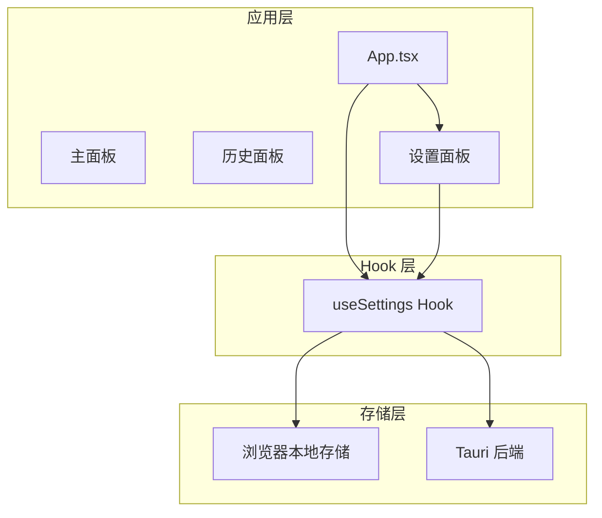
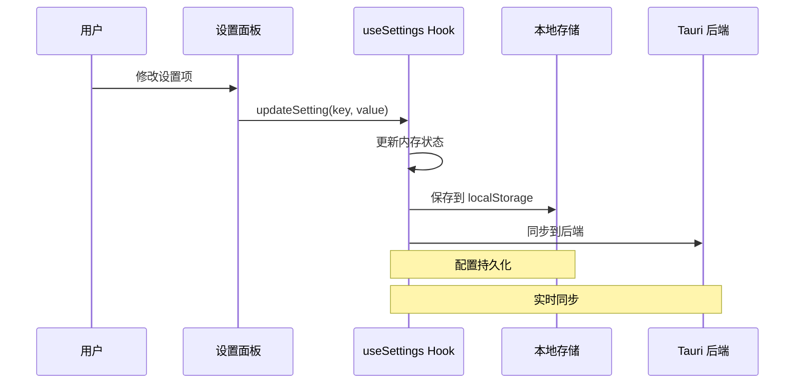
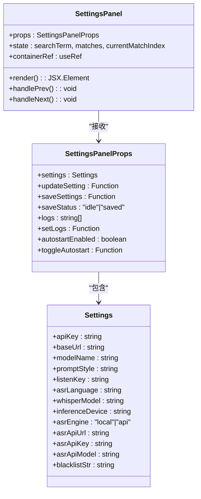
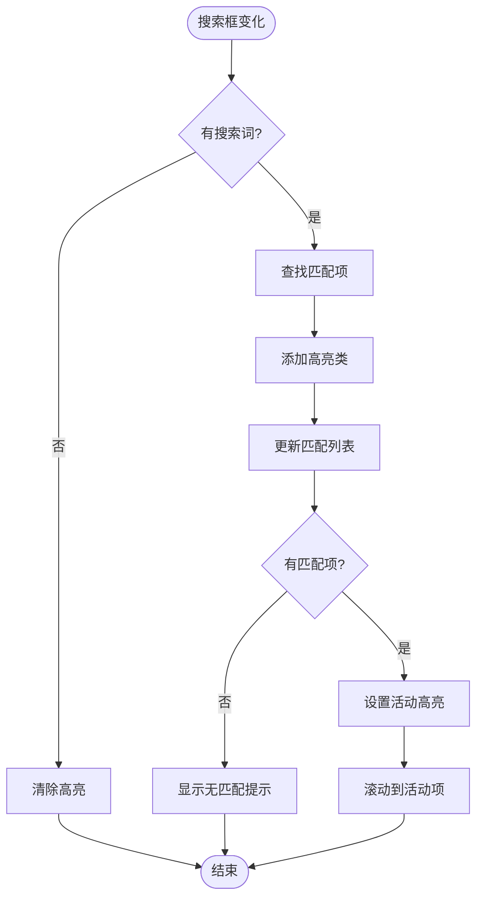
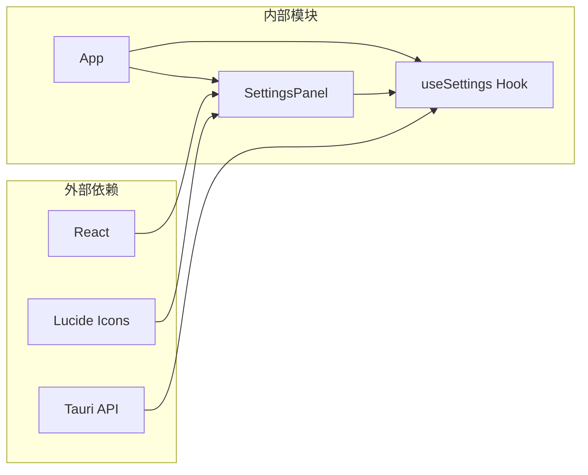

# 设置管理面板

<cite>
**本文档引用的文件**
- [SettingsPanel.tsx](file://src/components/SettingsPanel.tsx)
- [useSettings.ts](file://src/hooks/useSettings.ts)
- [SettingsPanel.css](file://src/components/SettingsPanel.css)
- [App.tsx](file://src/App.tsx)
- [README.md](file://README.md)
</cite>

## 目录
1. [简介](#简介)
2. [项目结构](#项目结构)
3. [核心组件](#核心组件)
4. [架构概览](#架构概览)
5. [详细组件分析](#详细组件分析)
6. [依赖关系分析](#依赖关系分析)
7. [性能考虑](#性能考虑)
8. [故障排除指南](#故障排除指南)
9. [结论](#结论)
10. [附录](#附录)

## 简介
VoiceFlow_AI_002 的设置管理面板是一个功能完整的配置界面，提供了语音识别引擎配置、AI 润色设置、快捷键绑定等功能模块。该面板采用现代化的 React 构建，集成了搜索功能、实时预览和错误提示等用户体验特性。

## 项目结构
设置管理面板位于项目的组件层，与核心业务逻辑通过自定义 Hook 解耦。整体架构采用分层设计，确保配置管理的独立性和可维护性。



**图表来源**
- [App.tsx:753-765](file://src/App.tsx#L753-L765)
- [useSettings.ts:36-96](file://src/hooks/useSettings.ts#L36-L96)

**章节来源**
- [README.md:1-8](file://README.md#L1-L8)
- [App.tsx:24-28](file://src/App.tsx#L24-L28)

## 核心组件
设置管理面板由三个主要部分组成：配置表单、搜索功能和状态管理。每个部分都有明确的职责分工和交互逻辑。

### 配置表单结构
面板采用分组设计，将相关的设置项组织在一起，提供清晰的视觉层次：

- **大语言模型接口配置**：API 密钥、基础 URL 和模型名称
- **听写与优化偏好**：AI 优化风格、语音识别语言和引擎选择
- **语音识别引擎配置**：本地模型和云端 API 的详细设置
- **快捷键绑定**：全局监听按键和防误触黑名单
- **开发调试日志**：实时日志显示和清理功能

### 搜索功能实现
内置的搜索系统支持实时过滤和高亮显示，提供便捷的设置项查找体验。

**章节来源**
- [SettingsPanel.tsx:115-291](file://src/components/SettingsPanel.tsx#L115-L291)
- [SettingsPanel.tsx:92-112](file://src/components/SettingsPanel.tsx#L92-L112)

## 架构概览
设置管理面板采用 React 函数组件配合自定义 Hook 的架构模式，实现了配置状态的集中管理和实时同步。



**图表来源**
- [useSettings.ts:71-83](file://src/hooks/useSettings.ts#L71-L83)
- [useSettings.ts:85-88](file://src/hooks/useSettings.ts#L85-L88)

## 详细组件分析

### SettingsPanel 组件分析

#### 组件结构设计
SettingsPanel 采用函数式组件设计，通过 props 接口传递配置状态和回调函数，实现了组件的高内聚和低耦合。



**图表来源**
- [SettingsPanel.tsx:6-26](file://src/components/SettingsPanel.tsx#L6-L26)
- [SettingsPanel.tsx:4-4](file://src/components/SettingsPanel.tsx#L4-L4)

#### 搜索功能实现
搜索功能通过 React 的 useEffect 和 useRef 实现，提供了实时的设置项过滤和导航能力。



**图表来源**
- [SettingsPanel.tsx:32-80](file://src/components/SettingsPanel.tsx#L32-L80)

**章节来源**
- [SettingsPanel.tsx:17-26](file://src/components/SettingsPanel.tsx#L17-L26)
- [SettingsPanel.tsx:32-90](file://src/components/SettingsPanel.tsx#L32-L90)

### useSettings Hook 分析

#### 配置管理机制
useSettings Hook 提供了完整的配置管理功能，包括状态初始化、更新、保存和同步。

```mermaid
stateDiagram-v2
[*] --> Loading
Loading --> Initialized : 加载成功
Loading --> LegacyLoaded : 旧格式加载
Loading --> Default : 默认配置
Initialized --> Updating : updateSetting
LegacyLoaded --> Updating : updateSetting
Default --> Updating : updateSetting
Updating --> Saving : saveSettings
Saving --> Saved : 保存成功
Saved --> Initialized : 状态恢复
note right of Loading
从 localStorage
加载配置
end note
note right of Saving
保存到
localStorage
end note
```

**图表来源**
- [useSettings.ts:37-67](file://src/hooks/useSettings.ts#L37-L67)
- [useSettings.ts:75-83](file://src/hooks/useSettings.ts#L75-L83)

#### 配置验证和默认值处理
Hook 实现了多层次的配置验证和回退机制：

1. **统一 JSON 格式优先**：优先从单一 JSON 字段加载完整配置
2. **旧格式兼容**：自动迁移旧版本的独立键值对配置
3. **默认值保证**：确保所有配置项都有合理的默认值

**章节来源**
- [useSettings.ts:20-34](file://src/hooks/useSettings.ts#L20-L34)
- [useSettings.ts:37-67](file://src/hooks/useSettings.ts#L37-L67)

### 表单组件交互设计

#### 输入验证机制
表单组件采用了多种验证策略：

- **类型安全**：通过 TypeScript 确保配置项的类型正确性
- **实时反馈**：onChange 事件提供即时的状态更新
- **条件渲染**：根据配置值动态显示相关设置项

#### 实时预览功能
面板提供了丰富的实时预览能力：

- **搜索结果高亮**：匹配的设置项会自动高亮显示
- **保存状态反馈**：保存按钮会显示成功状态
- **快捷键预览**：当前选择的快捷键会在界面上显示

**章节来源**
- [SettingsPanel.tsx:118-146](file://src/components/SettingsPanel.tsx#L118-L146)
- [SettingsPanel.tsx:154-175](file://src/components/SettingsPanel.tsx#L154-L175)

## 依赖关系分析

### 组件间依赖关系
设置管理面板与应用其他部分的依赖关系清晰明确：



**图表来源**
- [SettingsPanel.tsx:1-4](file://src/components/SettingsPanel.tsx#L1-L4)
- [useSettings.ts:1-2](file://src/hooks/useSettings.ts#L1-L2)

### 数据流分析
配置数据在组件间的流动遵循单向数据流原则：

1. **初始化流程**：App 组件调用 useSettings Hook 获取初始配置
2. **更新流程**：SettingsPanel 组件通过 updateSetting 回调更新配置
3. **保存流程**：saveSettings 方法持久化配置到本地存储
4. **同步流程**：配置变更实时同步到 Tauri 后端

**章节来源**
- [App.tsx:86-87](file://src/App.tsx#L86-L87)
- [useSettings.ts:71-83](file://src/hooks/useSettings.ts#L71-L83)

## 性能考虑

### 渲染优化
设置面板采用了多项性能优化措施：

- **条件渲染**：根据配置值动态显示相关设置项，减少不必要的 DOM 元素
- **受控组件**：通过 React 的受控组件模式避免不必要的重渲染
- **事件节流**：搜索功能使用防抖机制减少频繁的 DOM 操作

### 存储优化
配置数据的存储采用了高效的策略：

- **批量保存**：配置变更时只保存必要的字段
- **增量更新**：使用对象展开运算符实现增量状态更新
- **内存管理**：及时清理搜索高亮状态，避免内存泄漏

## 故障排除指南

### 常见问题诊断

#### 配置加载失败
如果设置无法正确加载，可能的原因包括：
- localStorage 数据损坏
- 旧版本配置格式不兼容
- 浏览器存储权限问题

#### 快捷键失效
快捷键功能异常的排查步骤：
1. 检查系统快捷键冲突
2. 验证黑名单设置是否正确
3. 确认 Tauri 后端服务状态

#### 语音识别问题
识别功能异常的常见原因：
- 网络连接问题
- API 密钥配置错误
- 模型下载失败

**章节来源**
- [useSettings.ts:63-65](file://src/hooks/useSettings.ts#L63-L65)
- [App.tsx:235-240](file://src/App.tsx#L235-L240)

## 结论
VoiceFlow_AI_002 的设置管理面板展现了现代前端应用的最佳实践，通过清晰的架构设计、完善的配置管理和优秀的用户体验，为用户提供了一个强大而易用的配置界面。其模块化的组件设计和健壮的状态管理机制，为后续的功能扩展奠定了坚实的基础。

## 附录

### 配置项详细说明

#### 大语言模型接口配置
- **API Key**：用于访问 LLM 服务的认证密钥
- **接口代理地址**：自定义 API 基础 URL，支持代理服务
- **模型名称**：指定使用的 LLM 模型标识符

#### 听写与优化偏好
- **AI 优化风格**：控制文本润色的风格类型
- **语音识别语言**：指定 Whisper 识别的语言选项
- **语音识别引擎**：选择本地或云端识别服务

#### 语音识别引擎配置
- **本地识别模型**：选择不同精度和性能的本地模型
- **强制硬件调度切换**：控制推理设备的选择策略
- **API 语音模型配置**：云端 API 的详细配置参数

#### 快捷键绑定
- **触发快捷键**：全局监听的触发按键
- **全局防误触黑名单**：指定不响应快捷键的应用程序列表

### 最佳实践建议
1. **配置备份**：定期导出配置以防意外丢失
2. **性能优化**：根据硬件配置选择合适的识别模型
3. **安全性**：妥善保管 API 密钥，避免泄露
4. **兼容性**：保持软件版本更新以获得最新功能