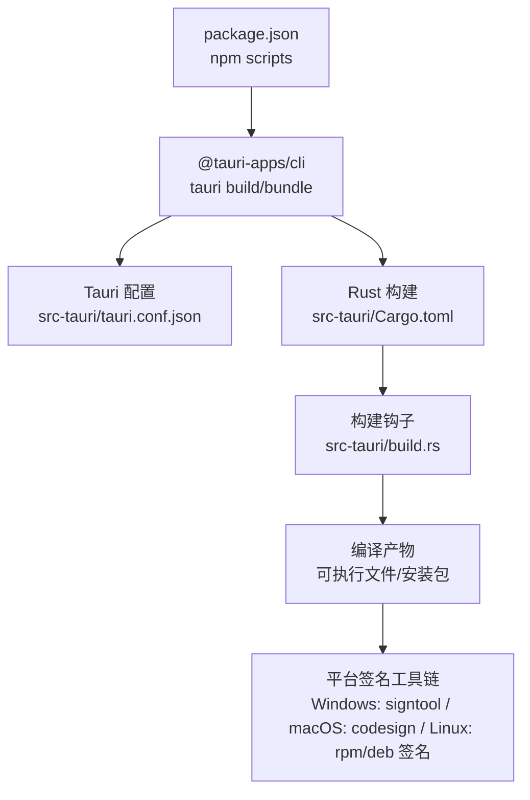
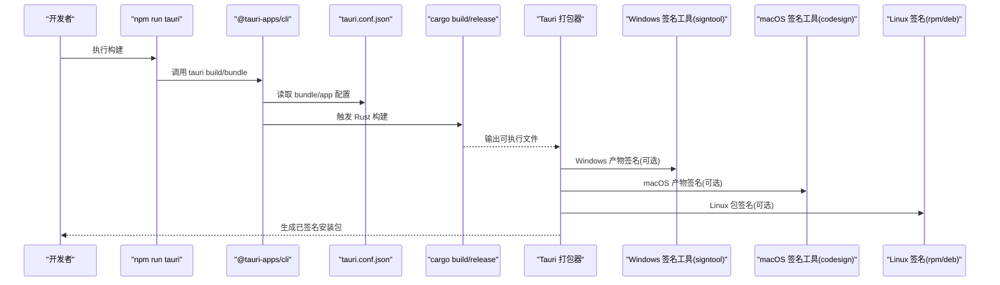
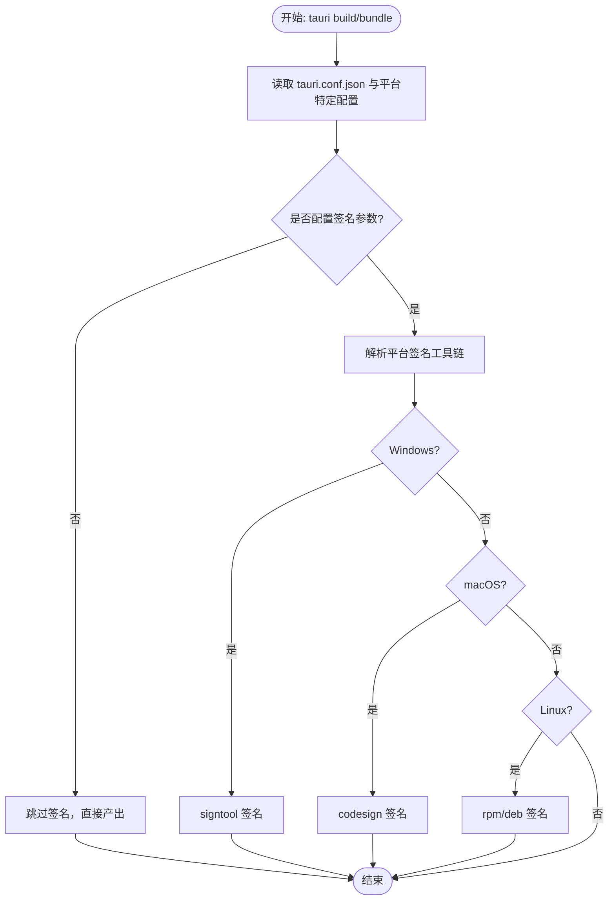
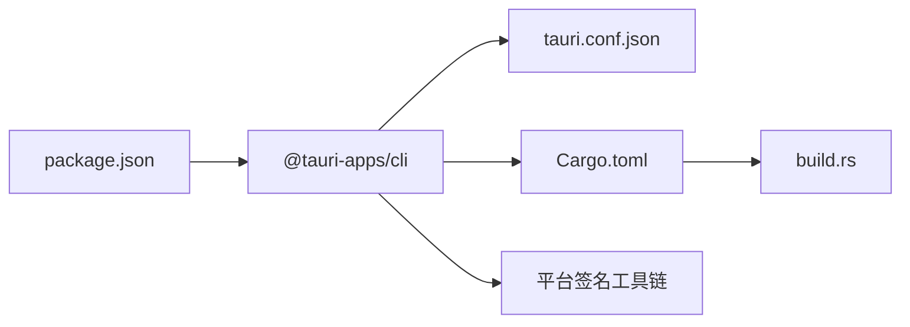

# 代码签名

<cite>
**本文引用的文件**   
- [README.md](file://README.md)
- [tauri.conf.json](file://src-tauri/tauri.conf.json)
- [Cargo.toml](file://src-tauri/Cargo.toml)
- [build.rs](file://src-tauri/build.rs)
- [main.rs](file://src-tauri/src/main.rs)
- [lib.rs](file://src-tauri/src/lib.rs)
- [package.json](file://package.json)
- [config.schema.json](file://node_modules/@tauri-apps/cli/config.schema.json)
</cite>

## 目录
1. [简介](#简介)
2. [项目结构](#项目结构)
3. [核心组件](#核心组件)
4. [架构总览](#架构总览)
5. [详细组件分析](#详细组件分析)
6. [依赖关系分析](#依赖关系分析)
7. [性能与构建考量](#性能与构建考量)
8. [故障排查指南](#故障排查指南)
9. [结论](#结论)
10. [附录](#附录)

## 简介
本文件面向 VoiceFlow_AI_002 项目的代码签名与安全验证，覆盖以下目标：
- 数字证书获取与配置方法（Windows、macOS、Linux）
- Tauri 打包与签名配置要点
- 构建时自动签名流程说明
- 证书管理最佳实践与安全考虑
- 常见签名问题的排查与解决方法

本项目基于 Tauri v2 + React + TypeScript 技术栈，使用 Vite 进行前端构建，Rust 作为后端运行时。当前仓库未包含任何平台特定的签名配置，因此本节提供在现有工程基础上启用并自动化签名的完整指导。

## 项目结构
与签名相关的关键位置：
- Tauri 应用配置位于 src-tauri/tauri.conf.json，用于控制产物格式、图标、NSIS 语言等
- Rust 包元数据位于 src-tauri/Cargo.toml，定义二进制名称、版本、依赖与发布优化
- 构建入口脚本 src-tauri/build.rs 调用 tauri_build::build()
- 应用主入口 src-tauri/src/main.rs 启动 Tauri 运行时
- Node 侧脚本 package.json 暴露 tauri CLI 命令

图表来源
- [package.json:1-32](file://package.json#L1-L32)
- [tauri.conf.json:1-68](file://src-tauri/tauri.conf.json#L1-L68)
- [Cargo.toml:1-47](file://src-tauri/Cargo.toml#L1-L47)
- [build.rs:1-3](file://src-tauri/build.rs#L1-L3)

章节来源
- [README.md:1-8](file://README.md#L1-L8)
- [package.json:1-32](file://package.json#L1-L32)
- [tauri.conf.json:1-68](file://src-tauri/tauri.conf.json#L1-L68)
- [Cargo.toml:1-47](file://src-tauri/Cargo.toml#L1-L47)
- [build.rs:1-3](file://src-tauri/build.rs#L1-L3)

## 核心组件
- Tauri 配置（bundle 与 app 段）：决定打包目标、图标、NSIS 语言、窗口行为等
- Cargo 发布配置：release profile 开启 strip、lto、opt-level=z 等优化
- Node 脚本：通过 npm run tauri 调用 @tauri-apps/cli 执行构建与打包

章节来源
- [tauri.conf.json:48-66](file://src-tauri/tauri.conf.json#L48-L66)
- [Cargo.toml:41-47](file://src-tauri/Cargo.toml#L41-L47)
- [package.json:6-12](file://package.json#L6-L12)

## 架构总览
下图展示从 npm 到平台签名工具的端到端流程。当前仓库未内置签名配置，但可通过环境变量或平台特定配置文件接入系统签名工具链。

图表来源
- [package.json:6-12](file://package.json#L6-L12)
- [tauri.conf.json:1-68](file://src-tauri/tauri.conf.json#L1-L68)
- [Cargo.toml:1-47](file://src-tauri/Cargo.toml#L1-L47)

## 详细组件分析

### Windows 代码签名
- 证书类型
  - EV 代码签名证书（推荐）或标准代码签名证书
  - 本地开发可使用自签名证书；生产建议使用受信任 CA 颁发的证书
- 获取与安装
  - 从受信任 CA 购买证书，导出为 .pfx/.p12 并导入到 Windows 证书存储
  - 确保私钥可被当前用户访问，且具备“允许导出”策略（仅用于迁移）
- 配置方式
  - 通过环境变量向 Tauri 传递签名参数（例如证书指纹、时间戳服务器、密码等）
  - 或在平台特定配置文件中设置签名选项（如 certificateThumbprint、signCommand 等）
- 构建时自动签名
  - 在 CI 中注入证书与密码，调用 tauri build/bundle 时由打包器自动签名
  - 若需自定义签名逻辑，可通过 signCommand 指定外部脚本

章节来源
- [config.schema.json:120-140](file://node_modules/@tauri-apps/cli/config.schema.json#L120-L140)
- [package.json:6-12](file://package.json#L6-L12)

### macOS 开发者证书与签名
- 证书类型
  - Apple Developer Program 的 “Developer ID Application” 证书
  - 同时需要有效的分发描述文件（Distribution Profile）
- 获取与安装
  - 在 Apple Developer 门户创建证书与描述文件，下载后导入到本机钥匙串
- 配置方式
  - 通过环境变量或平台特定配置指定签名身份（identity）、时间戳服务器、签名选项
  - 可在 bundle 配置中设置签名相关字段（如 identity、timestampServer 等）
- 构建时自动签名
  - 在 CI 中从安全存储恢复证书与钥匙串，执行 tauri build/bundle 自动签名
  - 如需自定义签名步骤，可通过 signCommand 指向自定义脚本

章节来源
- [config.schema.json:120-140](file://node_modules/@tauri-apps/cli/config.schema.json#L120-L140)
- [package.json:6-12](file://package.json#L6-L12)

### Linux 包签名
- 签名机制
  - RPM：使用 GPG 私钥对包进行签名（rpm --addsign）
  - DEB：使用 dpkg-sig 或 gpg 对包进行签名
- 获取与安装
  - 生成 GPG 密钥对，将私钥导入构建环境的安全存储
- 配置方式
  - 通过环境变量或平台特定配置指定签名命令与密钥路径
  - 在 CI 中注入 GPG 私钥，执行 tauri build/bundle 自动签名
- 构建时自动签名
  - 使用 signCommand 指向封装好的签名脚本，统一处理不同发行版差异

章节来源
- [config.schema.json:120-140](file://node_modules/@tauri-apps/cli/config.schema.json#L120-L140)
- [package.json:6-12](file://package.json#L6-L12)

### Tauri 签名配置与自动签名流程
- 配置入口
  - 主配置：src-tauri/tauri.conf.json
  - 平台特定配置：tauri.windows.conf.json、tauri.macos.conf.json、tauri.linux.conf.json（按需创建）
- 关键配置项（示例字段名，具体以 schema 为准）
  - bundle.signing.*：用于 Windows/macOS/Linux 的签名参数
  - bundle.signCommand：自定义签名命令
  - bundle.targets：选择打包目标（nsis/msi/app/dmg/rpm/deb/appimage 等）
- 自动签名流程
  - 当检测到有效证书与必要环境变量时，Tauri 打包器会在生成最终产物前调用平台签名工具完成签名
  - 若未配置，则跳过签名，产物为未签名状态

图表来源
- [tauri.conf.json:48-66](file://src-tauri/tauri.conf.json#L48-L66)
- [config.schema.json:2100-2140](file://node_modules/@tauri-apps/cli/config.schema.json#L2100-L2140)

章节来源
- [tauri.conf.json:1-68](file://src-tauri/tauri.conf.json#L1-L68)
- [config.schema.json:2100-2140](file://node_modules/@tauri-apps/cli/config.schema.json#L2100-L2140)

### 构建与发布流水线集成
- 本地开发
  - 使用自签名证书进行快速验证
  - 通过命令行参数或环境变量传入证书信息
- CI/CD
  - 在安全存储中保存证书与密码（Windows PFX、macOS Keychain、Linux GPG 私钥）
  - 构建阶段恢复凭据，执行 tauri build/bundle
  - 产物上传至制品库或发布渠道

章节来源
- [package.json:6-12](file://package.json#L6-L12)
- [config.schema.json:2100-2140](file://node_modules/@tauri-apps/cli/config.schema.json#L2100-L2140)

## 依赖关系分析
- Node 层
  - package.json 中的 tauri 脚本驱动 @tauri-apps/cli
- Tauri 层
  - tauri.conf.json 控制打包目标与平台特性
  - Cargo.toml 定义 Rust 包信息与 release profile
  - build.rs 调用 tauri_build::build() 参与构建过程
- 平台签名工具链
  - Windows: signtool.exe（随 Windows SDK 提供）
  - macOS: codesign（Xcode Command Line Tools 提供）
  - Linux: rpm、dpkg-sig/gpg（根据发行版与打包目标）

图表来源
- [package.json:6-12](file://package.json#L6-L12)
- [tauri.conf.json:1-68](file://src-tauri/tauri.conf.json#L1-L68)
- [Cargo.toml:1-47](file://src-tauri/Cargo.toml#L1-L47)
- [build.rs:1-3](file://src-tauri/build.rs#L1-L3)

章节来源
- [package.json:6-12](file://package.json#L6-L12)
- [tauri.conf.json:1-68](file://src-tauri/tauri.conf.json#L1-L68)
- [Cargo.toml:1-47](file://src-tauri/Cargo.toml#L1-L47)
- [build.rs:1-3](file://src-tauri/build.rs#L1-L3)

## 性能与构建考量
- Release 优化
  - Cargo.toml 的 release profile 已启用 strip、lto、opt-level=z，有助于减小体积与提升运行效率
- 签名对构建时间的影响
  - 签名会引入额外耗时，建议在 CI 中缓存证书与密钥，避免重复导入
  - 并行构建与增量构建可减少整体时间

章节来源
- [Cargo.toml:41-47](file://src-tauri/Cargo.toml#L41-L47)

## 故障排查指南
- Windows 签名失败
  - 检查证书是否导入到当前用户证书存储，且私钥可用
  - 确认 signtool 路径与环境变量 PATH 正确
  - 校验证书指纹、时间戳服务器地址与网络可达性
- macOS 签名失败
  - 确认 Developer ID Application 证书与描述文件有效
  - 检查钥匙串权限与签名身份匹配
  - 校验时间戳服务器与网络连通性
- Linux 签名失败
  - 确认 GPG 私钥存在且权限正确
  - 校验 rpm/deb 签名命令与参数
  - 检查发行版兼容性与依赖工具链
- 通用问题
  - 确认 tauri.conf.json 与平台特定配置未被错误覆盖
  - 查看构建日志定位具体签名错误码与消息
  - 在本地先手动执行签名命令复现问题

章节来源
- [config.schema.json:120-140](file://node_modules/@tauri-apps/cli/config.schema.json#L120-L140)
- [tauri.conf.json:1-68](file://src-tauri/tauri.conf.json#L1-L68)

## 结论
本项目当前未内置平台签名配置，但已具备完整的 Tauri 构建与打包基础。通过在 tauri.conf.json 或平台特定配置文件中添加签名参数，并结合 CI 安全存储管理证书与密钥，即可实现跨平台的自动化代码签名与发布。建议优先采用 EV 证书与可信时间戳服务，以提升用户信任与合规性。

## 附录
- 参考命令（概念性说明，非仓库内脚本）
  - Windows: signtool sign /f <pfx> /p <password> /tr <timestamp-server> /td sha256 <exe>
  - macOS: codesign --sign "<identity>" --timestamp --options runtime <app>
  - Linux (RPM): rpm --addsign --gpg-name "<key-id>" <rpm>
  - Linux (DEB): dpkg-sig --sign <mode> --keyid <key-id> <deb>
- 安全最佳实践
  - 最小权限原则：仅授予构建账户必要的证书访问权限
  - 密钥隔离：CI 中使用独立的服务账号与密钥管理服务
  - 审计与轮换：定期轮换证书与密钥，保留审计日志
  - 时间戳服务：始终启用可信时间戳，确保证书过期后仍有效

[本节为通用指导，不直接分析具体源文件]