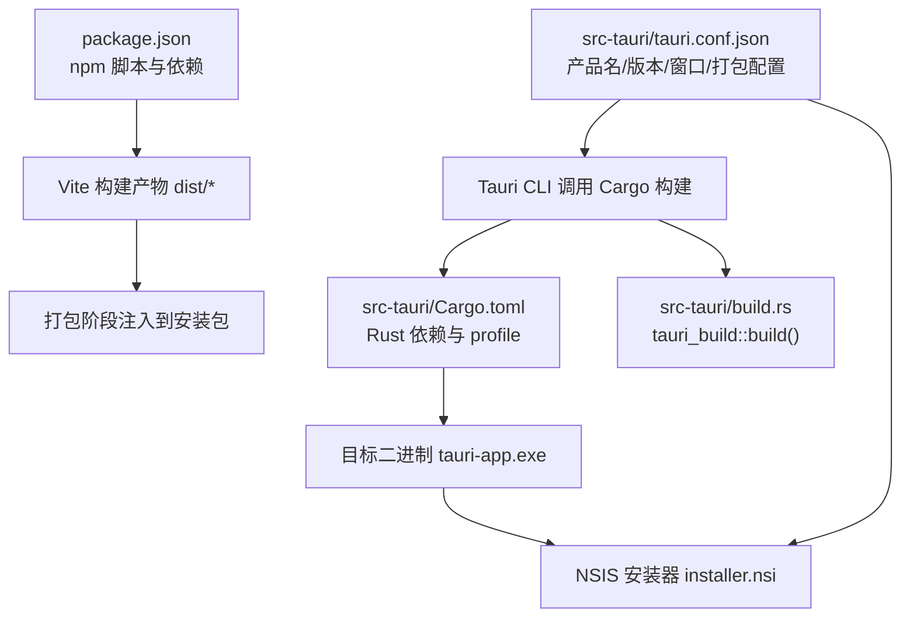
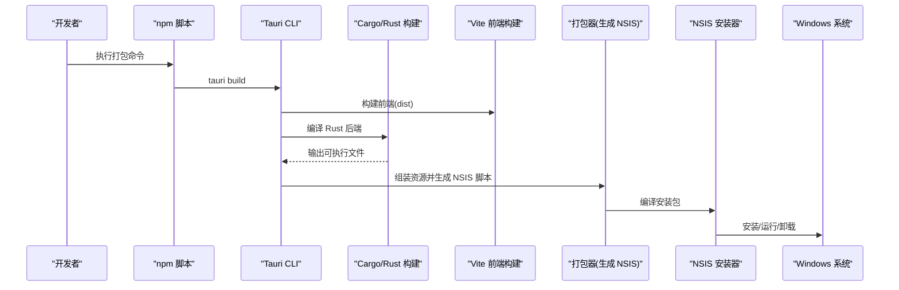
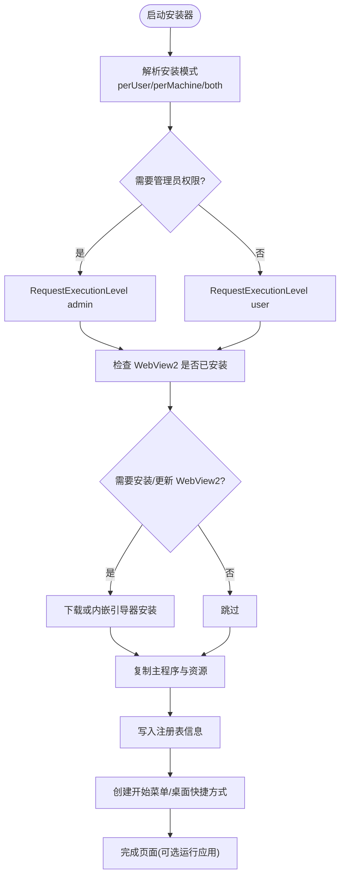
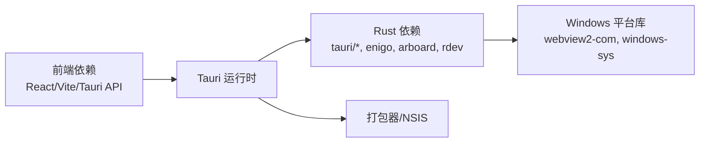

# Windows 平台打包

<cite>
**本文引用的文件**
- [README.md](file://README.md)
- [package.json](file://package.json)
- [src-tauri/tauri.conf.json](file://src-tauri/tauri.conf.json)
- [src-tauri/Cargo.toml](file://src-tauri/Cargo.toml)
- [src-tauri/build.rs](file://src-tauri/build.rs)
- [src-tauri/capabilities/desktop.json](file://src-tauri/capabilities/desktop.json)
- [src-tauri/target/release/nsis/x64/installer.nsi](file://src-tauri/target/release/nsis/x64/installer.nsi)
</cite>

## 目录
1. [简介](#简介)
2. [项目结构](#项目结构)
3. [核心组件](#核心组件)
4. [架构总览](#架构总览)
5. [详细组件分析](#详细组件分析)
6. [依赖分析](#依赖分析)
7. [性能考虑](#性能考虑)
8. [故障排查指南](#故障排查指南)
9. [结论](#结论)
10. [附录](#附录)

## 简介
本文件面向在 Windows 平台上为 VoiceFlow_AI_002 进行打包与发布，重点覆盖以下内容：
- NSIS 安装程序配置（安装包图标、语言设置简体中文、安装向导定制）
- Windows 特定构建要求（Visual Studio 依赖、Rust 工具链配置）
- Windows 应用签名与代码验证的配置方法
- Windows Store 发布准备与资源文件处理最佳实践
- 常见 Windows 打包问题（权限提升、UAC 提示、系统依赖库集成等）的解决方案

本项目基于 Tauri + React + TypeScript + Vite，使用 NSIS 生成 Windows 安装包。

## 项目结构
与 Windows 打包直接相关的顶层与 src-tauri 关键文件如下：
- 前端与脚本入口：package.json、vite.config.ts、index.html
- Tauri 配置与能力声明：src-tauri/tauri.conf.json、src-tauri/capabilities/*.json
- Rust 包与构建：src-tauri/Cargo.toml、src-tauri/build.rs
- 生成的 NSIS 安装脚本：src-tauri/target/release/nsis/x64/installer.nsi

图表来源
- [package.json:1-32](file://package.json#L1-L32)
- [src-tauri/tauri.conf.json:1-68](file://src-tauri/tauri.conf.json#L1-L68)
- [src-tauri/Cargo.toml:1-47](file://src-tauri/Cargo.toml#L1-L47)
- [src-tauri/build.rs:1-4](file://src-tauri/build.rs#L1-L4)
- [src-tauri/target/release/nsis/x64/installer.nsi:1-800](file://src-tauri/target/release/nsis/x64/installer.nsi#L1-L800)

章节来源
- [README.md:1-8](file://README.md#L1-L8)
- [package.json:1-32](file://package.json#L1-L32)
- [src-tauri/tauri.conf.json:1-68](file://src-tauri/tauri.conf.json#L1-L68)
- [src-tauri/Cargo.toml:1-47](file://src-tauri/Cargo.toml#L1-L47)
- [src-tauri/build.rs:1-4](file://src-tauri/build.rs#L1-L4)

## 核心组件
- Tauri 配置（Windows 打包与 NSIS）
  - 产品名称、版本号、标识符
  - 窗口定义（主窗口与指示器窗口）
  - bundle.windows.nsis 中设置安装包图标与语言（简体中文）
  - 打包图标集（ico/png/icns）
- NSIS 安装器（installer.nsi）
  - 安装模式（当前用户/所有用户）、权限级别控制
  - WebView2 运行时检测与安装流程
  - 注册表写入、快捷方式创建、卸载逻辑
  - 语言宏与本地化资源加载
- Rust 构建与优化
  - release profile 开启 strip、LTO、opt-level=z、codegen-units=1、panic=abort
  - build.rs 调用 tauri_build::build() 参与资源与元数据生成

章节来源
- [src-tauri/tauri.conf.json:48-67](file://src-tauri/tauri.conf.json#L48-L67)
- [src-tauri/target/release/nsis/x64/installer.nsi:98-122](file://src-tauri/target/release/nsis/x64/installer.nsi#L98-L122)
- [src-tauri/target/release/nsis/x64/installer.nsi:462-465](file://src-tauri/target/release/nsis/x64/installer.nsi#L462-L465)
- [src-tauri/Cargo.toml:41-47](file://src-tauri/Cargo.toml#L41-L47)
- [src-tauri/build.rs:1-4](file://src-tauri/build.rs#L1-L4)

## 架构总览
下图展示了从源码到 Windows 安装包的关键路径与交互关系。

图表来源
- [package.json:6-12](file://package.json#L6-L12)
- [src-tauri/tauri.conf.json:6-11](file://src-tauri/tauri.conf.json#L6-L11)
- [src-tauri/Cargo.toml:17-21](file://src-tauri/Cargo.toml#L17-L21)
- [src-tauri/target/release/nsis/x64/installer.nsi:628-711](file://src-tauri/target/release/nsis/x64/installer.nsi#L628-L711)

## 详细组件分析

### NSIS 安装程序配置
- 安装包图标
  - 通过 tauri.conf.json 的 bundle.windows.nsis.installerIcon 指定 .ico 路径
  - 安装器最终会读取该路径并在界面显示
- 语言设置（简体中文）
  - tauri.conf.json 中 bundle.windows.nsis.languages 包含 "SimpChinese"
  - 安装器脚本中插入 MUI_LANGUAGE "SimpChinese" 并包含对应语言资源
- 安装向导定制
  - 支持欢迎页、许可协议页、安装模式选择（perMachine/perUser/both）、目录选择、开始菜单、安装进度、完成页
  - 完成页提供“创建桌面快捷方式”和“运行应用”选项
  - 支持静默安装参数 /P、/NS、/UPDATE、/R、/ARGS 等
  - 支持卸载时勾选“删除应用数据”

图表来源
- [src-tauri/target/release/nsis/x64/installer.nsi:98-122](file://src-tauri/target/release/nsis/x64/installer.nsi#L98-L122)
- [src-tauri/target/release/nsis/x64/installer.nsi:462-465](file://src-tauri/target/release/nsis/x64/installer.nsi#L462-L465)
- [src-tauri/target/release/nsis/x64/installer.nsi:536-626](file://src-tauri/target/release/nsis/x64/installer.nsi#L536-L626)
- [src-tauri/target/release/nsis/x64/installer.nsi:628-711](file://src-tauri/target/release/nsis/x64/installer.nsi#L628-L711)

章节来源
- [src-tauri/tauri.conf.json:51-57](file://src-tauri/tauri.conf.json#L51-L57)
- [src-tauri/target/release/nsis/x64/installer.nsi:124-154](file://src-tauri/target/release/nsis/x64/installer.nsi#L124-L154)
- [src-tauri/target/release/nsis/x64/installer.nsi:402-411](file://src-tauri/target/release/nsis/x64/installer.nsi#L402-L411)
- [src-tauri/target/release/nsis/x64/installer.nsi:467-514](file://src-tauri/target/release/nsis/x64/installer.nsi#L467-L514)

### Windows 特定的构建要求
- Visual Studio 依赖
  - 使用 MSVC 工具链进行 Rust 编译，需安装 Visual Studio Build Tools（含 C++ 工作负载）
  - 确保 PATH 中包含 cl.exe、link.exe 等必要工具
- Rust 工具链配置
  - 目标平台：x86_64-pc-windows-msvc
  - 推荐启用 rustup target add x86_64-pc-windows-msvc
  - 若使用多架构打包，按需添加 arm64 目标
- Node.js 与 npm
  - 前端构建依赖 npm run build（Vite + TypeScript）
  - 确保 Node.js 版本满足项目要求

章节来源
- [package.json:6-12](file://package.json#L6-L12)
- [src-tauri/Cargo.toml:41-47](file://src-tauri/Cargo.toml#L41-L47)

### Windows 应用签名与代码验证
- 安装包签名
  - 可在 NSIS 安装器中配置 UNINSTALLERSIGNCOMMAND 以签名卸载程序
  - 建议对主程序与安装包均进行时间戳签名，避免过期后无法验证
- 应用签名
  - 在 Rust 侧可通过嵌入资源或使用第三方工具对 tauri-app.exe 进行签名
  - 建议在 CI 中使用受信任的代码签名证书，并配置时间戳服务器
- 代码验证与 SmartScreen
  - 签名后可提升 SmartScreen 可信度；长期积累企业信誉有助于降低拦截率
  - 如需企业内部分发，可结合组策略或企业商店分发策略

章节来源
- [src-tauri/target/release/nsis/x64/installer.nsi:93-96](file://src-tauri/target/release/nsis/x64/installer.nsi#L93-L96)

### Windows Store 发布准备与资源文件处理
- 应用清单与图标
  - 准备符合 Store 要求的图标集（ico/png），并确保在 tauri.conf.json 的 bundle.icon 中列出
- 应用名称与标识
  - 统一 productName、identifier，便于 Store 审核与品牌一致性
- 资源文件处理
  - 将静态资源放入 dist 或通过 Tauri 资源机制打包，确保安装后路径正确
  - 避免在运行时依赖未随包分发的外部动态库
- 合规与安全
  - 遵循 Microsoft Store 政策，禁用不必要的系统权限
  - 合理设置 CSP 与插件权限，最小化暴露面

章节来源
- [src-tauri/tauri.conf.json:3-6](file://src-tauri/tauri.conf.json#L3-L6)
- [src-tauri/tauri.conf.json:59-66](file://src-tauri/tauri.conf.json#L59-L66)

### 常见问题与解决
- 权限提升与 UAC 提示
  - perMachine 安装会触发 UAC；如希望免提权，使用 perUser 安装并将默认路径设为 %LOCALAPPDATA%
  - 安装器根据 INSTALLMODE 自动设置 RequestExecutionLevel
- WebView2 缺失或版本过低
  - 安装器会自动检测并安装/更新 WebView2；网络受限环境可使用离线安装包模式
- 系统依赖库集成
  - 若应用依赖 VC++ Redistributable 或其他 DLL，需在安装阶段安装或随包分发
  - 优先使用静态链接减少运行时依赖
- 卸载残留与应用数据清理
  - 卸载确认页提供“删除应用数据”复选框，便于彻底清理

章节来源
- [src-tauri/target/release/nsis/x64/installer.nsi:98-122](file://src-tauri/target/release/nsis/x64/installer.nsi#L98-L122)
- [src-tauri/target/release/nsis/x64/installer.nsi:536-626](file://src-tauri/target/release/nsis/x64/installer.nsi#L536-L626)
- [src-tauri/target/release/nsis/x64/installer.nsi:419-455](file://src-tauri/target/release/nsis/x64/installer.nsi#L419-L455)

## 依赖分析
- 前端依赖
  - React、TypeScript、Vite、Tauri API 插件（autostart、fs、opener）
- Rust 依赖
  - tauri、tauri-plugin-opener、tauri-plugin-autostart（非移动端）
  - 系统交互与剪贴板等第三方库（enigo、arboard、rdev 等）
- Windows 平台相关
  - webview2-com、windows-sys 等用于 WebView2 与系统 API 访问

图表来源
- [package.json:13-30](file://package.json#L13-L30)
- [src-tauri/Cargo.toml:20-39](file://src-tauri/Cargo.toml#L20-L39)
- [src-tauri/target/release/nsis/x64/installer.nsi:536-626](file://src-tauri/target/release/nsis/x64/installer.nsi#L536-L626)

章节来源
- [package.json:13-30](file://package.json#L13-L30)
- [src-tauri/Cargo.toml:20-39](file://src-tauri/Cargo.toml#L20-L39)

## 性能考虑
- 使用 release profile 优化
  - strip=true、lto=true、opt-level=z、codegen-units=1、panic=abort 减小体积并提升性能
- 资源压缩与懒加载
  - 前端静态资源尽量压缩，按需加载大模型或资源文件
- 安装器体积
  - 仅打包必要资源，避免冗余文件；必要时采用增量更新策略

章节来源
- [src-tauri/Cargo.toml:41-47](file://src-tauri/Cargo.toml#L41-L47)

## 故障排查指南
- 构建失败（MSVC 工具链）
  - 确认已安装 Visual Studio Build Tools（C++ 工作负载）
  - 检查 PATH 与 rustup target 配置
- WebView2 安装失败
  - 检查网络连接与代理设置
  - 使用离线安装包模式或手动预装 WebView2
- 权限不足导致安装失败
  - 切换 perUser 安装或提升权限重新运行
- 卸载不干净
  - 勾选“删除应用数据”，或手动清理 %LOCALAPPDATA% 下应用目录

章节来源
- [src-tauri/target/release/nsis/x64/installer.nsi:536-626](file://src-tauri/target/release/nsis/x64/installer.nsi#L536-L626)
- [src-tauri/target/release/nsis/x64/installer.nsi:419-455](file://src-tauri/target/release/nsis/x64/installer.nsi#L419-L455)

## 结论
通过对 Tauri 配置、NSIS 安装器与 Rust 构建链路的梳理，可以稳定地在 Windows 上产出高质量安装包。建议在生产环境中启用应用与安装包签名，完善 WebView2 依赖处理，并结合 Store 发布规范进行资源与清单管理。遇到权限与依赖问题时，优先调整安装模式与预置系统组件，以提升用户体验与成功率。

## 附录
- 常用命令行参数（安装器）
  - /P：静默安装
  - /NS：不创建桌面快捷方式
  - /UPDATE：更新模式
  - /R：安装完成后运行应用
  - /ARGS：传递给应用的参数
- 能力与权限
  - capabilities/desktop.json 声明了 autostart 权限，适用于桌面平台

章节来源
- [src-tauri/target/release/nsis/x64/installer.nsi:467-481](file://src-tauri/target/release/nsis/x64/installer.nsi#L467-L481)
- [src-tauri/capabilities/desktop.json:1-14](file://src-tauri/capabilities/desktop.json#L1-L14)