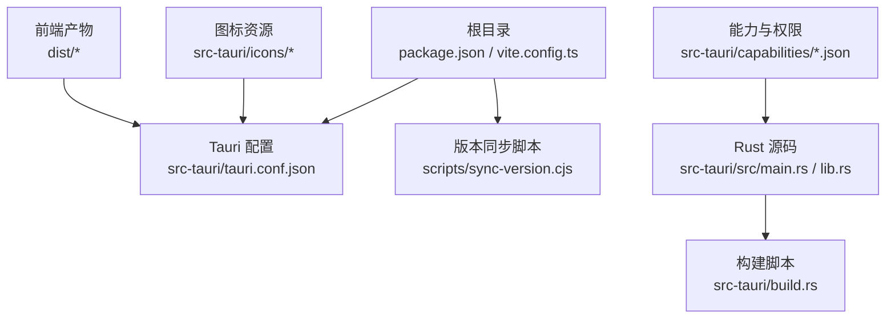
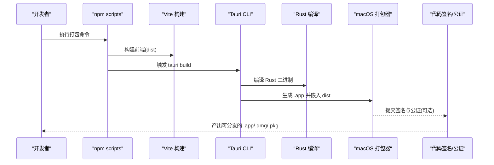
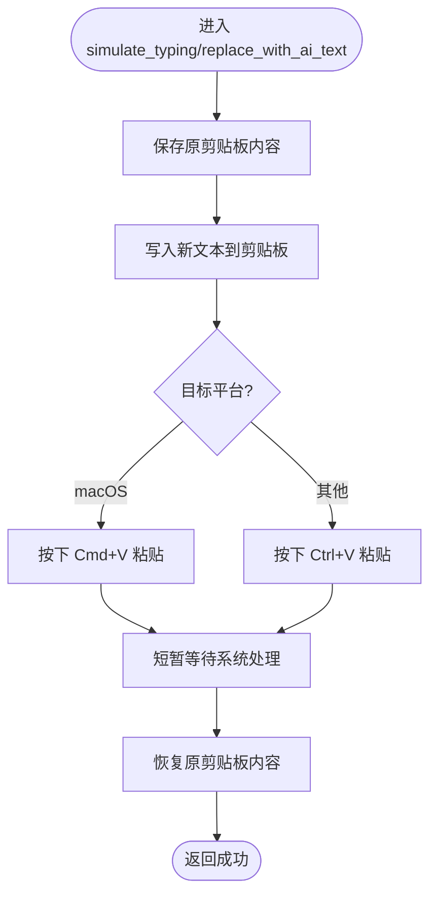
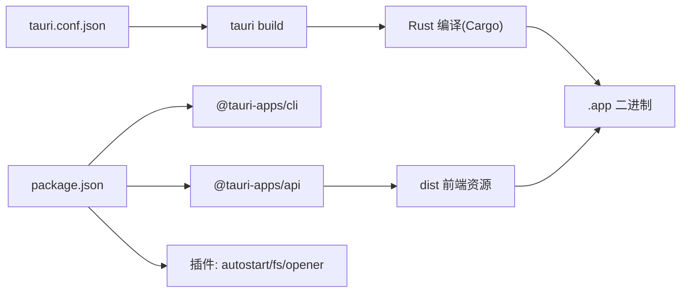

# macOS 平台打包

<cite>
**本文引用的文件**   
- [package.json](file://package.json)
- [vite.config.ts](file://vite.config.ts)
- [src-tauri/tauri.conf.json](file://src-tauri/tauri.conf.json)
- [src-tauri/Cargo.toml](file://src-tauri/Cargo.toml)
- [src-tauri/build.rs](file://src-tauri/build.rs)
- [src-tauri/src/main.rs](file://src-tauri/src/main.rs)
- [src-tauri/src/lib.rs](file://src-tauri/src/lib.rs)
- [src-tauri/capabilities/default.json](file://src-tauri/capabilities/default.json)
- [src-tauri/capabilities/desktop.json](file://src-tauri/capabilities/desktop.json)
- [scripts/sync-version.cjs](file://scripts/sync-version.cjs)
</cite>

## 目录
1. [简介](#简介)
2. [项目结构](#项目结构)
3. [核心组件](#核心组件)
4. [架构总览](#架构总览)
5. [详细组件分析](#详细组件分析)
6. [依赖分析](#依赖分析)
7. [性能考虑](#性能考虑)
8. [故障排查指南](#故障排查指南)
9. [结论](#结论)
10. [附录](#附录)

## 简介
本文件面向在 macOS 上为 VoiceFlow_AI_002（基于 Tauri 2 + React + TypeScript）进行应用打包与发布的工程实践，覆盖以下内容：
- macOS 应用包结构与 .app 生成流程
- Apple 开发者证书配置、代码签名与 Notarization 流程
- App Store Connect 集成与 Mac App Store 发布要求
- macOS 特有权限配置（麦克风、辅助功能等）
- 常见问题与排障（沙盒限制、Universal Binary、签名失败等）

说明：
- 本项目使用 Tauri 2 构建桌面应用，前端由 Vite 构建，Rust 后端通过 tauri-build 参与打包。
- 当前仓库未包含 macOS 专属的 entitlements 或 Info.plist 自定义配置；如需启用沙盒或特定系统权限，需按本节方案补充。

## 项目结构
下图展示了与 macOS 打包相关的关键目录与职责：

图示来源
- [package.json:1-32](file://package.json#L1-L32)
- [vite.config.ts:1-44](file://vite.config.ts#L1-L44)
- [src-tauri/tauri.conf.json:1-68](file://src-tauri/tauri.conf.json#L1-L68)
- [src-tauri/build.rs:1-4](file://src-tauri/build.rs#L1-L4)
- [src-tauri/src/main.rs:1-9](file://src-tauri/src/main.rs#L1-L9)
- [src-tauri/src/lib.rs:1-287](file://src-tauri/src/lib.rs#L1-L287)
- [src-tauri/capabilities/default.json:1-19](file://src-tauri/capabilities/default.json#L1-L19)
- [src-tauri/capabilities/desktop.json:1-14](file://src-tauri/capabilities/desktop.json#L1-L14)
- [scripts/sync-version.cjs:1-35](file://scripts/sync-version.cjs#L1-L35)

章节来源
- [package.json:1-32](file://package.json#L1-L32)
- [vite.config.ts:1-44](file://vite.config.ts#L1-L44)
- [src-tauri/tauri.conf.json:1-68](file://src-tauri/tauri.conf.json#L1-L68)
- [src-tauri/Cargo.toml:1-47](file://src-tauri/Cargo.toml#L1-L47)
- [src-tauri/build.rs:1-4](file://src-tauri/build.rs#L1-L4)
- [src-tauri/src/main.rs:1-9](file://src-tauri/src/main.rs#L1-L9)
- [src-tauri/src/lib.rs:1-287](file://src-tauri/src/lib.rs#L1-L287)
- [src-tauri/capabilities/default.json:1-19](file://src-tauri/capabilities/default.json#L1-L19)
- [src-tauri/capabilities/desktop.json:1-14](file://src-tauri/capabilities/desktop.json#L1-L14)
- [scripts/sync-version.cjs:1-35](file://scripts/sync-version.cjs#L1-L35)

## 核心组件
- 前端构建与开发服务器
  - Vite 端口固定为 1420，HMR 端口 1421，忽略 src-tauri 变更监听，提供代理以访问外部镜像源。
- Tauri 应用配置
  - 应用标识符、产品名称、窗口定义、安全策略（CSP）、打包目标与图标资源路径。
- Rust 后端与插件
  - 主入口调用库函数 run()；注册菜单、托盘、快捷键监听、剪贴板粘贴、AI 文本替换等命令；启用 autostart 与 opener 插件。
- 能力与权限
  - default.json 为两个窗口授予基础窗口与 Webview 操作权限；desktop.json 为 macOS/Windows/Linux 开启 autostart 能力。
- 版本同步
  - 脚本将 package.json 的版本同步到 tauri.conf.json 与 Cargo.toml，保证多配置文件版本一致。

章节来源
- [vite.config.ts:1-44](file://vite.config.ts#L1-L44)
- [src-tauri/tauri.conf.json:1-68](file://src-tauri/tauri.conf.json#L1-L68)
- [src-tauri/src/lib.rs:1-287](file://src-tauri/src/lib.rs#L1-L287)
- [src-tauri/capabilities/default.json:1-19](file://src-tauri/capabilities/default.json#L1-L19)
- [src-tauri/capabilities/desktop.json:1-14](file://src-tauri/capabilities/desktop.json#L1-L14)
- [scripts/sync-version.cjs:1-35](file://scripts/sync-version.cjs#L1-L35)

## 架构总览
下图展示从 npm 脚本到 Tauri 构建、再到 macOS .app 产物的整体流程：

图示来源
- [package.json:1-32](file://package.json#L1-L32)
- [vite.config.ts:1-44](file://vite.config.ts#L1-L44)
- [src-tauri/tauri.conf.json:1-68](file://src-tauri/tauri.conf.json#L1-L68)
- [src-tauri/build.rs:1-4](file://src-tauri/build.rs#L1-L4)
- [src-tauri/src/main.rs:1-9](file://src-tauri/src/main.rs#L1-L9)

## 详细组件分析

### 应用包结构与 .app 生成
- 应用标识与名称
  - 应用标识符用于唯一识别与签名上下文；产品名称决定 .app 显示名。
- 窗口与安全
  - 定义了 main 与 indicator 两个窗口，设置尺寸、置顶、无边框、透明等属性；CSP 允许本地与指定远程资源加载。
- 打包目标与图标
  - targets 设置为 all，表示支持所有平台；icon 列表包含多种分辨率与 .icns 格式，供 macOS 使用。
- 前端资源
  - frontendDist 指向 dist，构建后会被嵌入到最终应用中。

章节来源
- [src-tauri/tauri.conf.json:1-68](file://src-tauri/tauri.conf.json#L1-L68)

### Apple 开发者证书与代码签名
- 证书准备
  - 需要安装 Xcode 命令行工具，并在“钥匙串访问”中持有有效的“Developer ID Application”证书（用于独立分发）或“Mac App Distribution”证书（用于 App Store）。
- 签名与公证
  - 使用 codesign 对 .app 及内部二进制签名，随后通过 notarytool 提交至 Apple 进行公证；最后 stapler 打回票据以便离线验证。
- 自动化建议
  - 建议在 CI 中通过环境变量注入证书与凭据，避免本地泄露；签名前确保版本号一致且无冲突。

章节来源
- [src-tauri/tauri.conf.json:1-68](file://src-tauri/tauri.conf.json#L1-L68)

### App Store Connect 集成与 Mac App Store 发布
- 应用元数据
  - 应用标识符、版本号、产品名需与 App Store Connect 中的条目保持一致。
- 上传与审核
  - 使用 Transporter 或 Application Loader 上传已签名并公证的应用包；填写审核信息并提交审核。
- 版本管理
  - 使用版本同步脚本确保 package.json、tauri.conf.json、Cargo.toml 三者版本一致，减少不一致导致的审核失败。

章节来源
- [scripts/sync-version.cjs:1-35](file://scripts/sync-version.cjs#L1-L35)
- [src-tauri/tauri.conf.json:1-68](file://src-tauri/tauri.conf.json#L1-L68)
- [src-tauri/Cargo.toml:1-47](file://src-tauri/Cargo.toml#L1-L47)

### macOS 特有权限配置
- 麦克风访问
  - 若应用需要录音，需在 Info.plist 中添加 NSMicrophoneUsageDescription 键并提供用户可见的描述文案。
- 辅助功能权限
  - 全局键盘监听与模拟输入通常需要“辅助功能”权限；可在首次运行时引导用户前往“系统设置 > 隐私与安全性 > 辅助功能”授权。
- 剪贴板与输入模拟
  - 应用涉及剪贴板读写与按键模拟，需确保仅在必要场景下访问，并向用户提供清晰说明。
- 自动启动
  - 已通过 desktop.json 启用 autostart 能力；macOS 上可能需要用户手动允许开机自启或在首次运行后确认。

章节来源
- [src-tauri/capabilities/desktop.json:1-14](file://src-tauri/capabilities/desktop.json#L1-L14)
- [src-tauri/src/lib.rs:1-287](file://src-tauri/src/lib.rs#L1-L287)

### 沙盒与 Notarization 流程
- 沙盒模式
  - 若计划上架 Mac App Store，需启用沙盒并配置相应的 Entitlements（如网络、文件系统、辅助功能等）。
- 公证流程
  - 独立分发（Developer ID）必须完成公证；App Store 分发由 App Store 处理公证，但仍需正确签名。
- 常见错误
  - 签名链不完整、时间戳服务不可用、bundle 内二进制未签名、Info.plist 缺失或权限描述不符等。

章节来源
- [src-tauri/tauri.conf.json:1-68](file://src-tauri/tauri.conf.json#L1-L68)

### Universal Binary 构建
- 目标架构
  - 为确保在 Intel 与 Apple Silicon 机器上均可运行，应构建 Universal Binary（x86_64 + arm64）。
- 交叉编译
  - 在 macOS 上使用 Tauri 默认目标即可；若需单独构建某一架构，可通过目标三元组指定。
- 验证
  - 使用 file 或 lipo 检查二进制是否包含多架构；在两种架构机器上分别测试。

章节来源
- [src-tauri/tauri.conf.json:1-68](file://src-tauri/tauri.conf.json#L1-L68)
- [src-tauri/Cargo.toml:1-47](file://src-tauri/Cargo.toml#L1-L47)

### 关键流程图：快捷键监听与输入模拟（macOS）

图示来源
- [src-tauri/src/lib.rs:45-75](file://src-tauri/src/lib.rs#L45-L75)
- [src-tauri/src/lib.rs:77-118](file://src-tauri/src/lib.rs#L77-L118)

## 依赖分析
- 前端依赖
  - React、TypeScript、Vite 及其插件；@tauri-apps/api 与若干 Tauri 插件（autostart、fs、opener）。
- Rust 依赖
  - tauri 2 核心、tray-icon、opener、autostart；rdev 用于全局键盘事件监听；enigo 用于按键模拟；arboard 用于剪贴板；reqwest 用于网络请求；压缩与日志库等。
- 构建依赖
  - tauri-build 参与构建期代码生成；Vite 负责前端打包。

图示来源
- [package.json:1-32](file://package.json#L1-L32)
- [src-tauri/tauri.conf.json:1-68](file://src-tauri/tauri.conf.json#L1-L68)
- [src-tauri/Cargo.toml:1-47](file://src-tauri/Cargo.toml#L1-L47)

章节来源
- [package.json:1-32](file://package.json#L1-L32)
- [src-tauri/Cargo.toml:1-47](file://src-tauri/Cargo.toml#L1-L47)

## 性能考虑
- 优化级别
  - release profile 已启用 strip、lto、opt-level=z、codegen-units=1，有助于减小体积与提升运行效率。
- 前端体积
  - 合理拆分路由与组件，按需加载模型与资源，避免一次性引入大模块。
- 音频与转写
  - 若涉及本地语音模型，注意内存占用与磁盘 I/O；必要时采用流式处理与缓存策略。

章节来源
- [src-tauri/Cargo.toml:41-47](file://src-tauri/Cargo.toml#L41-L47)

## 故障排查指南
- 无法打开或提示“已损坏”
  - 检查是否正确签名与公证；确认签名链完整且时间戳有效。
- 权限被拒绝（麦克风/辅助功能）
  - 在“系统设置 > 隐私与安全性”中逐项授权；确保 Info.plist 中包含必要的权限描述。
- 快捷键不生效
  - 确认 rdev 监听线程正常启动；检查黑名单逻辑与目标键映射；在终端查看日志输出。
- 自动启动无效
  - 检查 autostart 能力是否启用；macOS 可能需要在“登录项”中手动添加。
- 版本不一致导致构建失败
  - 使用版本同步脚本统一版本后再构建。

章节来源
- [src-tauri/src/lib.rs:140-212](file://src-tauri/src/lib.rs#L140-L212)
- [src-tauri/capabilities/desktop.json:1-14](file://src-tauri/capabilities/desktop.json#L1-L14)
- [scripts/sync-version.cjs:1-35](file://scripts/sync-version.cjs#L1-L35)

## 结论
通过合理的 Tauri 配置、严格的代码签名与公证流程、完善的权限声明与沙盒策略，VoiceFlow_AI_002 可以在 macOS 上稳定构建与分发。建议在生产环境引入自动化签名与公证流水线，并持续监控权限与兼容性变化，以确保用户体验与审核通过率。

## 附录
- 常用命令参考（概念性）
  - 构建：npm run build 后执行 tauri build
  - 签名：codesign --deep --force --sign <证书> --timestamp --options runtime
  - 公证：notarytool submit ...
  - 打回票据：stapler staple ...
- 资源清单
  - 图标：确保包含 .icns 与多分辨率 PNG，便于在不同场景下正确显示。