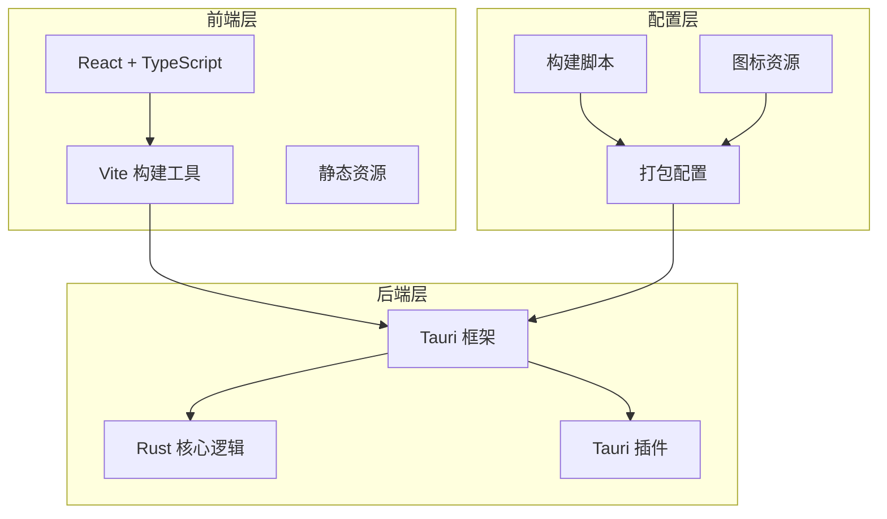
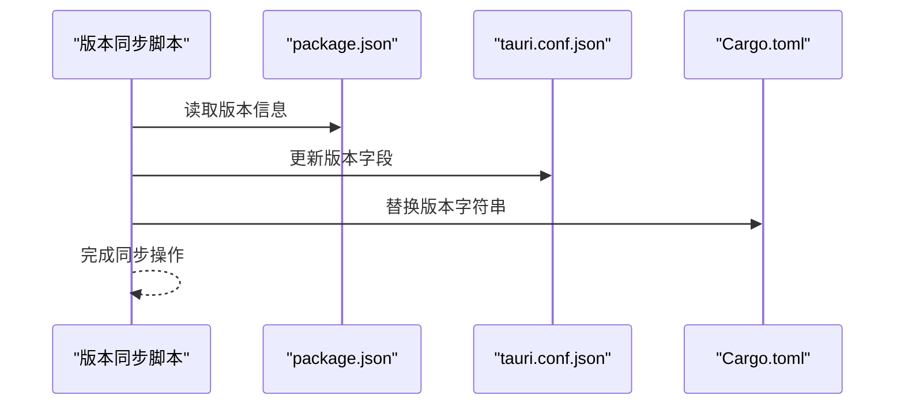
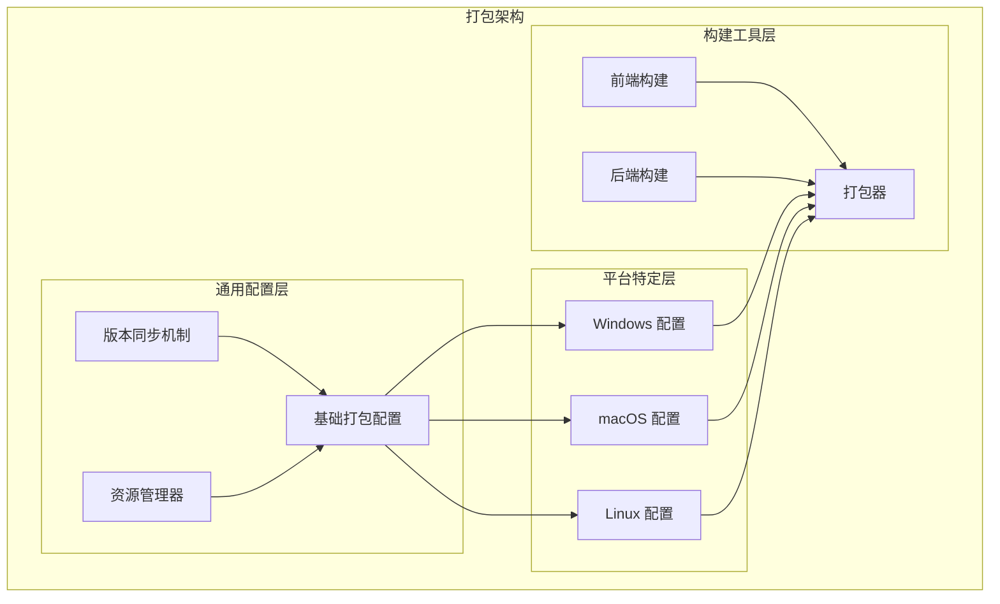
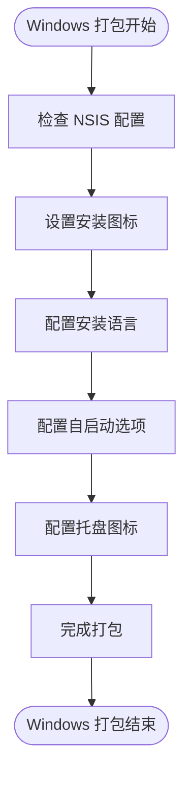
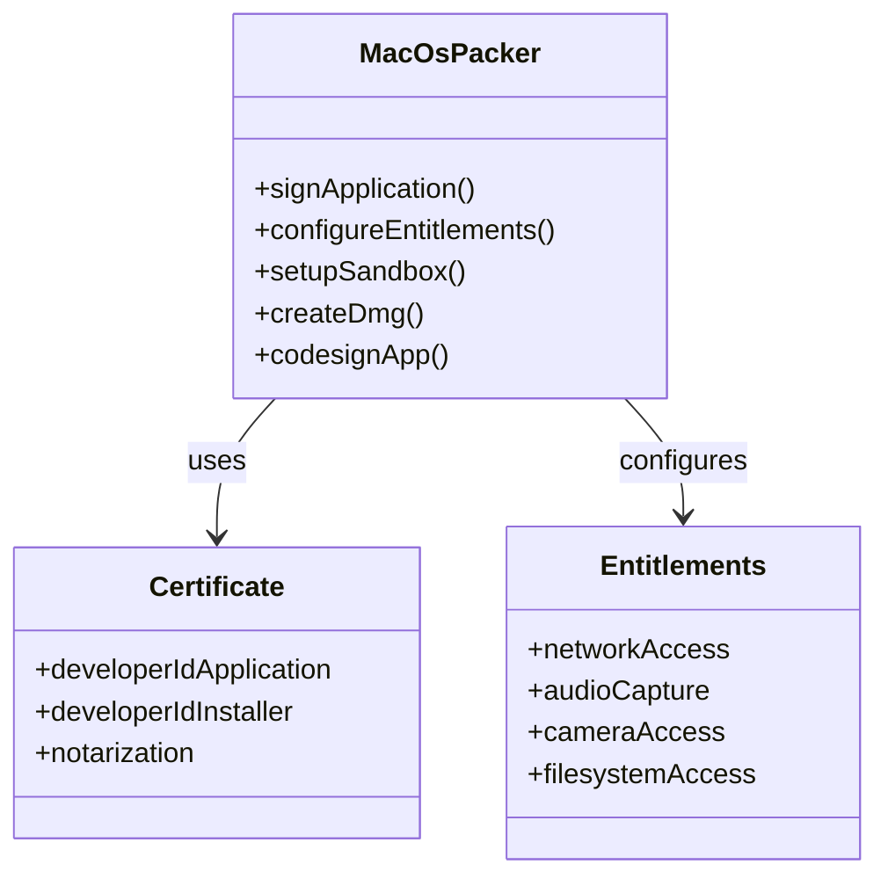
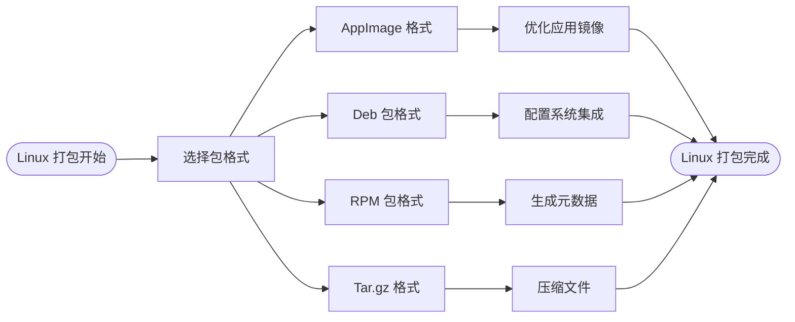
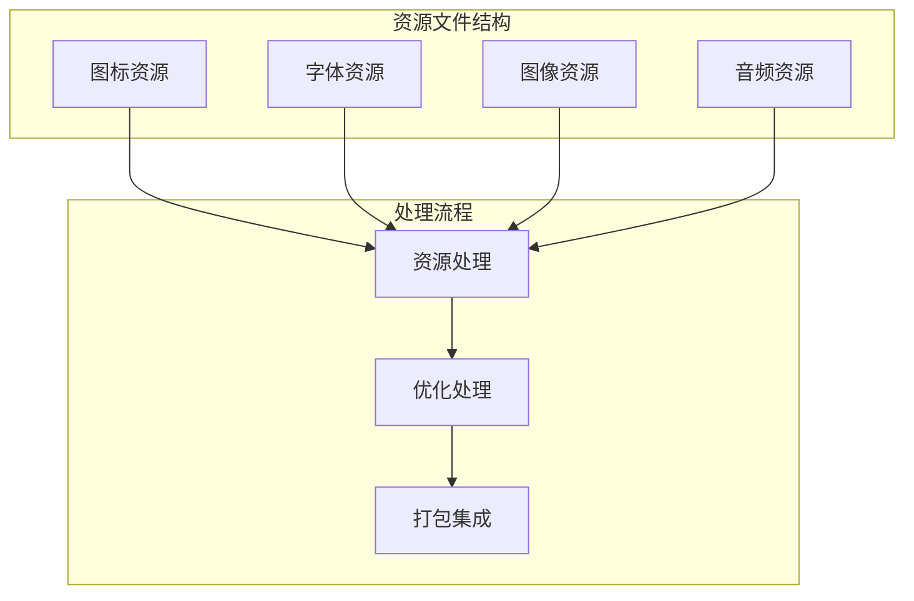
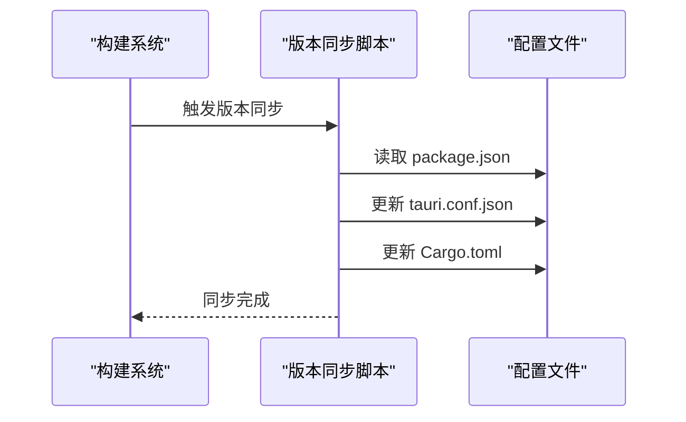
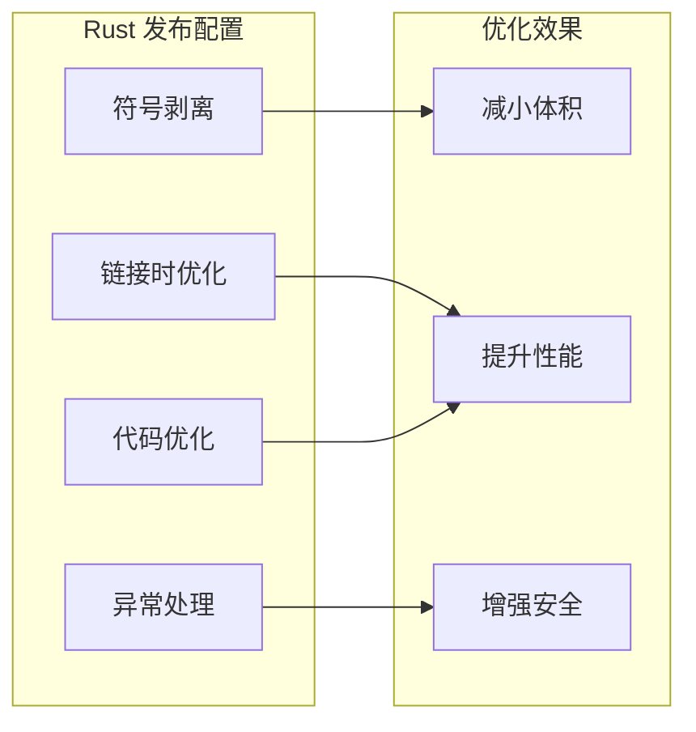
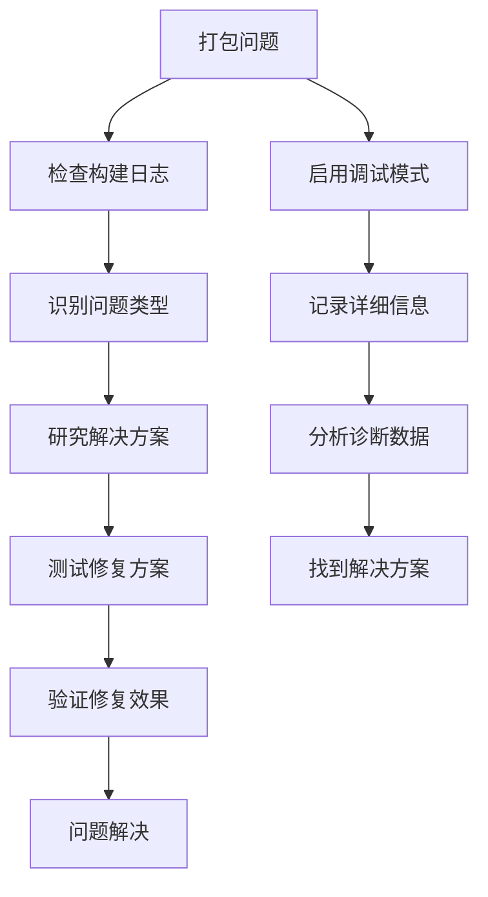

# 平台打包

<cite>
**本文档引用的文件**
- [package.json](file://package.json)
- [tauri.conf.json](file://src-tauri/tauri.conf.json)
- [Cargo.toml](file://src-tauri/Cargo.toml)
- [vite.config.ts](file://vite.config.ts)
- [sync-version.cjs](file://scripts/sync-version.cjs)
- [build.rs](file://src-tauri/build.rs)
- [README.md](file://README.md)
</cite>

## 目录
1. [简介](#简介)
2. [项目结构](#项目结构)
3. [核心组件](#核心组件)
4. [架构概览](#架构概览)
5. [详细组件分析](#详细组件分析)
6. [依赖关系分析](#依赖关系分析)
7. [性能考虑](#性能考虑)
8. [故障排除指南](#故障排除指南)
9. [结论](#结论)

## 简介

VoiceFlow_AI_002 是一个基于 Tauri 框架开发的跨平台桌面应用程序，使用 React 和 TypeScript 构建前端界面。该项目采用现代的开发工具链，包括 Vite 作为构建工具和 Tauri 作为应用框架。本文档专注于该应用的跨平台打包配置，详细说明 Windows、macOS 和 Linux 三个平台的特定打包要求和最佳实践。

## 项目结构

VoiceFlow_AI_002 项目采用模块化结构，主要分为前端和后端两个部分：



**图表来源**
- [package.json:1-32](file://package.json#L1-L32)
- [tauri.conf.json:1-68](file://src-tauri/tauri.conf.json#L1-L68)
- [Cargo.toml:1-47](file://src-tauri/Cargo.toml#L1-L47)

**章节来源**
- [package.json:1-32](file://package.json#L1-L32)
- [tauri.conf.json:1-68](file://src-tauri/tauri.conf.json#L1-L68)
- [Cargo.toml:1-47](file://src-tauri/Cargo.toml#L1-L47)

## 核心组件

### 打包配置核心组件

VoiceFlow_AI_002 的打包系统由以下核心组件构成：

1. **Tauri 配置管理器**：负责跨平台打包配置
2. **版本同步系统**：确保多文件版本一致性
3. **构建管道**：协调前端和后端构建流程
4. **资源管理系统**：处理图标和静态资源

### 版本同步机制

项目实现了自动化的版本同步系统，确保 package.json、tauri.conf.json 和 Cargo.toml 中的版本保持一致：



**图表来源**
- [sync-version.cjs:1-35](file://scripts/sync-version.cjs#L1-L35)

**章节来源**
- [sync-version.cjs:1-35](file://scripts/sync-version.cjs#L1-L35)

## 架构概览

VoiceFlow_AI_002 的打包架构采用分层设计，每个平台都有特定的配置和优化策略：



**图表来源**
- [tauri.conf.json:48-66](file://src-tauri/tauri.conf.json#L48-L66)
- [Cargo.toml:41-47](file://src-tauri/Cargo.toml#L41-L47)

## 详细组件分析

### Windows 平台打包配置

Windows 平台的打包配置重点关注用户安装体验和系统集成：

#### NSIS 安装程序配置

NSIS（Nullsoft Scriptable Install System）是 Windows 平台的标准安装程序工具。VoiceFlow_AI_002 的 NSIS 配置包含以下关键设置：

- **安装图标配置**：使用 `icons/icon.ico` 作为安装程序图标
- **语言支持**：配置简体中文支持
- **用户界面**：提供友好的安装向导

#### Windows 特定优化



**图表来源**
- [tauri.conf.json:51-57](file://src-tauri/tauri.conf.json#L51-L57)

**章节来源**
- [tauri.conf.json:51-57](file://src-tauri/tauri.conf.json#L51-L57)

### macOS 平台打包配置

macOS 平台的打包配置需要满足 Apple 的严格要求：

#### 应用签名配置

macOS 应用需要进行数字签名以确保应用完整性：

- **开发者证书**：用于应用签名
- **公证流程**：通过 Apple 公证服务验证应用
- **沙盒配置**：遵循 macOS 安全模型

#### macOS 特定优化



**图表来源**
- [tauri.conf.json:63](file://src-tauri/tauri.conf.json#L63)

**章节来源**
- [tauri.conf.json:63](file://src-tauri/tauri.conf.json#L63)

### Linux 平台打包配置

Linux 平台支持多种包格式，每种格式都有其特定的用途：

#### 支持的包格式

- **AppImage**：便携式应用格式，无需安装即可运行
- **Deb**：适用于 Debian/Ubuntu 系统的软件包
- **RPM**：适用于 Red Hat/Fedora 系统的软件包
- **Tar.gz**：压缩的源码包格式

#### Linux 特定优化



**图表来源**
- [tauri.conf.json:50](file://src-tauri/tauri.conf.json#L50)

**章节来源**
- [tauri.conf.json:50](file://src-tauri/tauri.conf.json#L50)

### 资源文件处理

资源文件管理是跨平台打包的重要组成部分：

#### 图标资源配置

项目包含多分辨率的图标资源，确保在不同缩放比例下都能清晰显示：

- **32x32 像素**：系统图标
- **128x128 像素**：标准应用图标
- **256x256 像素**：高 DPI 支持
- **macOS ICNS 格式**：macOS 原生图标格式
- **Windows ICO 格式**：Windows 原生图标格式

#### 静态资源管理



**图表来源**
- [tauri.conf.json:59-65](file://src-tauri/tauri.conf.json#L59-L65)

**章节来源**
- [tauri.conf.json:59-65](file://src-tauri/tauri.conf.json#L59-L65)

## 依赖关系分析

### 构建依赖关系

VoiceFlow_AI_002 的构建系统具有清晰的依赖层次结构：

```mermaid
graph TB
subgraph "开发依赖"
TauriCLI[@tauri-apps/cli]
Vite[Vite]
TypeScript[TypeScript]
React[React]
end
subgraph "运行时依赖"
TauriAPI[@tauri-apps/api]
Transformers[@huggingface/transformers]
ReactDOM[react-dom]
end
subgraph "系统依赖"
Rust[Rust 工具链]
PlatformSDK[平台 SDK]
end
TauriCLI --> TauriAPI
Vite --> React
TypeScript --> Vite
React --> TauriAPI
TauriAPI --> PlatformSDK
Rust --> PlatformSDK
```

**图表来源**
- [package.json:13-30](file://package.json#L13-L30)
- [Cargo.toml:20-37](file://src-tauri/Cargo.toml#L20-L37)

### 版本同步依赖

版本同步系统确保所有配置文件保持版本一致性：



**图表来源**
- [sync-version.cjs:8-32](file://scripts/sync-version.cjs#L8-L32)

**章节来源**
- [package.json:13-30](file://package.json#L13-L30)
- [Cargo.toml:20-37](file://src-tauri/Cargo.toml#L20-L37)
- [sync-version.cjs:8-32](file://scripts/sync-version.cjs#L8-L32)

## 性能考虑

### 构建性能优化

VoiceFlow_AI_002 在构建配置中采用了多项性能优化措施：

#### Rust 发布配置优化



**图表来源**
- [Cargo.toml:41-47](file://src-tauri/Cargo.toml#L41-L47)

#### 前端构建优化

Vite 配置针对开发和生产环境进行了专门优化：

- **开发环境**：启用热重载和错误显示
- **生产环境**：代码分割和资源压缩
- **代理配置**：支持 API 请求转发

**章节来源**
- [Cargo.toml:41-47](file://src-tauri/Cargo.toml#L41-L47)
- [vite.config.ts:14-42](file://vite.config.ts#L14-L42)

## 故障排除指南

### 常见打包问题及解决方案

#### Windows 平台问题

**问题：NSIS 安装程序无法创建**
- **原因**：缺少必要的图标文件或权限不足
- **解决方案**：确保 `icons/icon.ico` 存在且具有正确的权限

**问题：自启动功能失效**
- **原因**：Windows 注册表权限问题
- **解决方案**：以管理员权限运行安装程序

#### macOS 平台问题

**问题：应用无法通过 Gatekeeper 验证**
- **原因**：缺少有效的开发者签名
- **解决方案**：使用有效的 Apple Developer 证书进行签名

**问题：应用在 macOS 上崩溃**
- **原因**：沙盒配置不正确
- **解决方案**：检查 entitlements.plist 文件配置

#### Linux 平台问题

**问题：AppImage 应用无法运行**
- **原因**：缺少必要的运行时库
- **解决方案**：使用 AppImageLauncher 或手动安装依赖

**问题：Deb/RPM 包安装失败**
- **原因**：依赖关系不匹配
- **解决方案**：检查系统依赖并更新包管理器

### 调试和诊断



**章节来源**
- [README.md:1-8](file://README.md#L1-L8)

## 结论

VoiceFlow_AI_002 的跨平台打包系统展现了现代桌面应用开发的最佳实践。通过精心设计的配置文件和自动化脚本，项目实现了：

1. **统一的版本管理**：确保所有平台使用一致的应用版本
2. **平台特定优化**：针对 Windows、macOS 和 Linux 进行专门优化
3. **资源高效管理**：合理组织和处理各种资源文件
4. **构建性能优化**：采用多种技术提升构建效率

该打包系统为类似项目提供了良好的参考模板，特别是在 Tauri 框架下的跨平台应用开发方面。通过遵循本文档中的最佳实践，开发者可以快速建立可靠的跨平台打包流程。