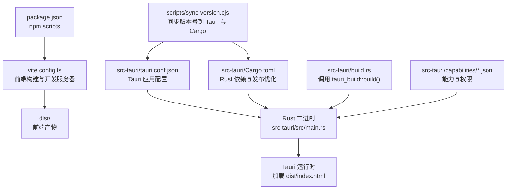
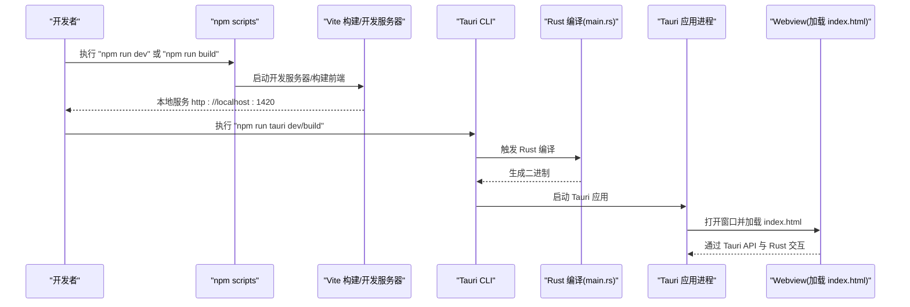
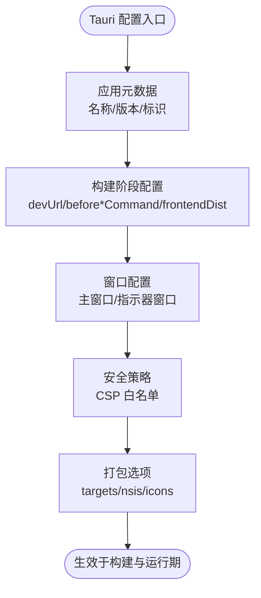
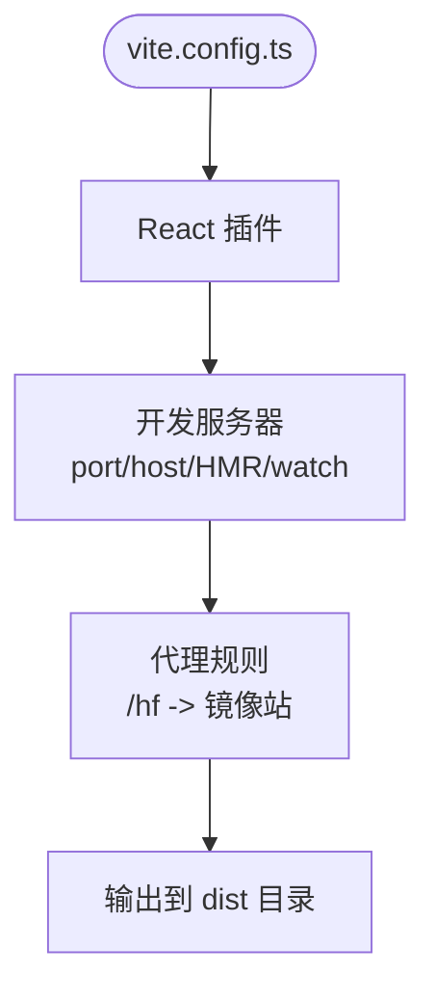
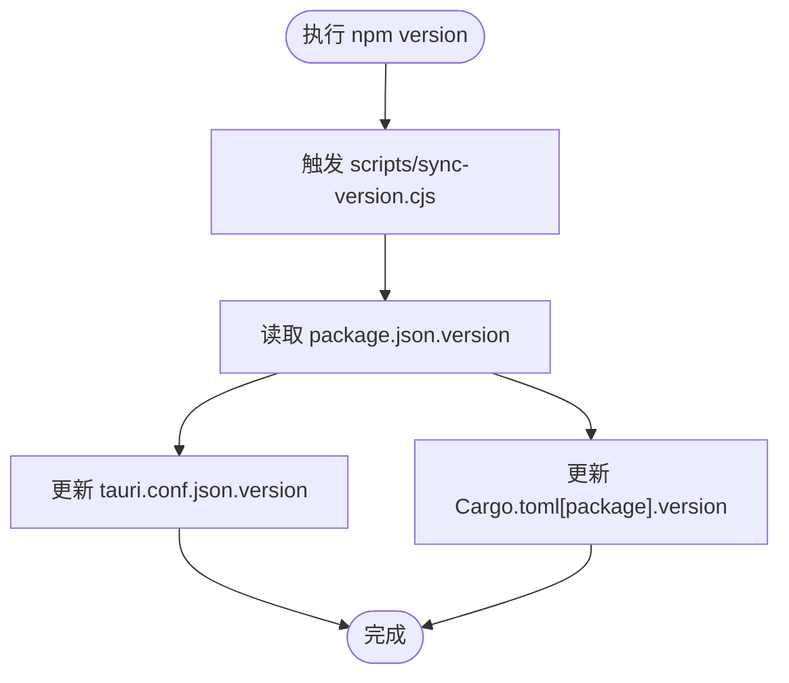
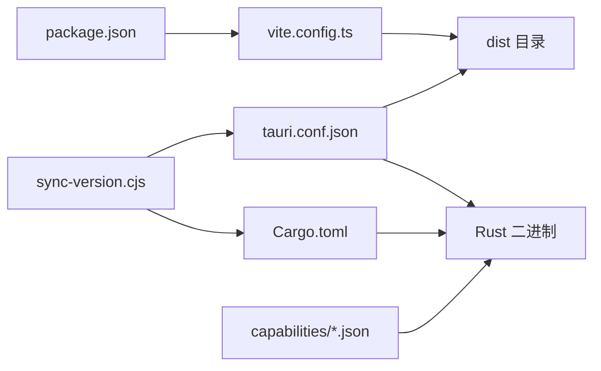

# 构建配置

<cite>
**本文引用的文件**   
- [tauri.conf.json](file://src-tauri/tauri.conf.json)
- [vite.config.ts](file://vite.config.ts)
- [package.json](file://package.json)
- [Cargo.toml](file://src-tauri/Cargo.toml)
- [build.rs](file://src-tauri/build.rs)
- [sync-version.cjs](file://scripts/sync-version.cjs)
- [default.json](file://src-tauri/capabilities/default.json)
- [desktop.json](file://src-tauri/capabilities/desktop.json)
- [index.html](file://index.html)
</cite>

## 目录
1. [简介](#简介)
2. [项目结构](#项目结构)
3. [核心组件](#核心组件)
4. [架构总览](#架构总览)
5. [详细组件分析](#详细组件分析)
6. [依赖关系分析](#依赖关系分析)
7. [性能与体积优化](#性能与体积优化)
8. [故障排查指南](#故障排查指南)
9. [结论](#结论)
10. [附录：多环境构建参数与环境变量](#附录多环境构建参数与环境变量)

## 简介
本文件面向 VoiceFlow_AI_002 的构建系统，系统性说明 Tauri 前端（Vite + React + TypeScript）与 Rust 后端（Tauri v2）的构建配置、安全策略、打包选项以及跨环境的构建参数。文档还包含版本同步脚本、能力权限配置、Windows NSIS 安装器设置等实践要点，并提供自定义构建脚本与自动化流程的实现建议。

## 项目结构
本项目采用“前端 Vite + React + TS”与“后端 Rust + Tauri v2”的双端协作模式。关键构建相关位置如下：
- 前端构建：根目录 vite.config.ts、tsconfig*.json、package.json scripts
- 后端构建：src-tauri/Cargo.toml、src-tauri/build.rs
- Tauri 应用配置：src-tauri/tauri.conf.json
- 能力与权限：src-tauri/capabilities/*.json
- 入口页面：index.html（主窗口）、public/pill.html（指示器窗口）
- 版本同步脚本：scripts/sync-version.cjs

图表来源
- [package.json:1-32](file://package.json#L1-L32)
- [vite.config.ts:1-44](file://vite.config.ts#L1-L44)
- [tauri.conf.json:1-68](file://src-tauri/tauri.conf.json#L1-L68)
- [Cargo.toml:1-47](file://src-tauri/Cargo.toml#L1-L47)
- [build.rs:1-4](file://src-tauri/build.rs#L1-L4)
- [default.json:1-19](file://src-tauri/capabilities/default.json#L1-L19)
- [desktop.json:1-14](file://src-tauri/capabilities/desktop.json#L1-L14)
- [sync-version.cjs:1-35](file://scripts/sync-version.cjs#L1-L35)

章节来源
- [package.json:1-32](file://package.json#L1-L32)
- [vite.config.ts:1-44](file://vite.config.ts#L1-L44)
- [tauri.conf.json:1-68](file://src-tauri/tauri.conf.json#L1-L68)
- [Cargo.toml:1-47](file://src-tauri/Cargo.toml#L1-L47)
- [build.rs:1-4](file://src-tauri/build.rs#L1-L4)
- [default.json:1-19](file://src-tauri/capabilities/default.json#L1-L19)
- [desktop.json:1-14](file://src-tauri/capabilities/desktop.json#L1-L14)
- [sync-version.cjs:1-35](file://scripts/sync-version.cjs#L1-L35)

## 核心组件
本节聚焦构建系统的核心配置文件及其职责：
- Tauri 应用配置（tauri.conf.json）：定义应用元数据、窗口、安全策略、打包目标与图标等
- 前端构建（vite.config.ts）：端口、HMR、代理、忽略监听等
- 包管理与脚本（package.json）：开发、构建、预览、Tauri CLI 集成、版本同步钩子
- Rust 后端（Cargo.toml）：库/二进制、插件、依赖、发布优化
- 构建脚本（build.rs）：调用 tauri_build 生成代码
- 能力与权限（capabilities/*.json）：窗口级能力与平台特定权限
- 版本同步脚本（scripts/sync-version.cjs）：统一 package.json、tauri.conf.json、Cargo.toml 的版本号

章节来源
- [tauri.conf.json:1-68](file://src-tauri/tauri.conf.json#L1-L68)
- [vite.config.ts:1-44](file://vite.config.ts#L1-L44)
- [package.json:1-32](file://package.json#L1-L32)
- [Cargo.toml:1-47](file://src-tauri/Cargo.toml#L1-L47)
- [build.rs:1-4](file://src-tauri/build.rs#L1-L4)
- [default.json:1-19](file://src-tauri/capabilities/default.json#L1-L19)
- [desktop.json:1-14](file://src-tauri/capabilities/desktop.json#L1-L14)
- [sync-version.cjs:1-35](file://scripts/sync-version.cjs#L1-L35)

## 架构总览
下图展示了从 npm 脚本到 Tauri 运行时的完整构建与启动链路，包括前后端产物如何被装配为桌面应用。

图表来源
- [package.json:6-12](file://package.json#L6-L12)
- [vite.config.ts:16-26](file://vite.config.ts#L16-L26)
- [tauri.conf.json:6-11](file://src-tauri/tauri.conf.json#L6-L11)
- [main.rs:4-6](file://src-tauri/src/main.rs#L4-L6)

章节来源
- [package.json:6-12](file://package.json#L6-L12)
- [vite.config.ts:16-26](file://vite.config.ts#L16-L26)
- [tauri.conf.json:6-11](file://src-tauri/tauri.conf.json#L6-L11)
- [main.rs:4-6](file://src-tauri/src/main.rs#L4-L6)

## 详细组件分析

### Tauri 配置（tauri.conf.json）
- 应用元数据
  - 产品名称、版本号、唯一标识符用于应用识别与分发
- 构建阶段
  - 开发前命令、构建前命令、前端资源目录、开发服务器地址
- 窗口配置
  - 主窗口与指示器窗口的尺寸、置顶、无边框、透明、任务栏显示、焦点行为、额外浏览器参数等
- 安全策略
  - CSP 内容安全策略，限制默认源、连接源、脚本与工作线程来源等
- 打包选项
  - 是否启用打包、目标平台、Windows NSIS 安装器语言与图标、多分辨率图标集

图表来源
- [tauri.conf.json:1-68](file://src-tauri/tauri.conf.json#L1-L68)

章节来源
- [tauri.conf.json:1-68](file://src-tauri/tauri.conf.json#L1-L68)

### 前端构建（vite.config.ts）
- 插件与基础配置
  - 使用 React 插件；关闭清屏以保留 Rust 错误输出
- 开发服务器
  - 固定端口、严格端口模式、HMR 协议与端口、忽略 src-tauri 变更监听
- 代理
  - 将 /hf 请求代理至镜像站点，便于国内访问
- 环境变量
  - 通过 TAURI_DEV_HOST 控制 host 与 HMR 主机

图表来源
- [vite.config.ts:1-44](file://vite.config.ts#L1-L44)

章节来源
- [vite.config.ts:1-44](file://vite.config.ts#L1-L44)

### 包管理与脚本（package.json）
- 脚本
  - dev：启动 Vite 开发服务器
  - build：TypeScript 类型检查后构建前端
  - preview：预览构建产物
  - tauri：转发到 Tauri CLI
  - version：在版本变更时执行同步脚本
- 依赖
  - 运行时依赖包含 Tauri API、文件系统、自动启动、Opener 等插件
  - 开发依赖包含 Tauri CLI、React 插件、TypeScript、Vite

章节来源
- [package.json:1-32](file://package.json#L1-L32)

### Rust 后端（Cargo.toml）
- 包与库
  - 二进制名与库名分离，避免命名冲突；提供静态库、动态库与 rlib
- 构建依赖
  - tauri-build 用于代码生成
- 运行时依赖
  - tauri 及多个插件（opener、autostart 等），系统交互与网络、压缩、日志等库
- 发布优化
  - strip、LTO、opt-level z、codegen-units 1、panic=abort，显著减小体积并提升性能

章节来源
- [Cargo.toml:1-47](file://src-tauri/Cargo.toml#L1-L47)

### 构建脚本（build.rs）
- 调用 tauri_build::build()，在 Rust 编译期间生成 Tauri 所需代码（如能力、窗口 schema 等）

章节来源
- [build.rs:1-4](file://src-tauri/build.rs#L1-L4)

### 能力与权限（capabilities/*.json）
- default.json
  - 对 main 与 indicator 窗口授予核心窗口操作、事件、Webview 等权限
- desktop.json
  - 针对 macOS/Windows/Linux 平台授予 autostart 权限，仅应用于主窗口

章节来源
- [default.json:1-19](file://src-tauri/capabilities/default.json#L1-L19)
- [desktop.json:1-14](file://src-tauri/capabilities/desktop.json#L1-L14)

### 入口页面（index.html）
- 定义主窗口入口，挂载 React 根节点，引入模块入口 main.tsx

章节来源
- [index.html:1-15](file://index.html#L1-L15)

### 版本同步脚本（scripts/sync-version.cjs）
- 读取 package.json 的版本号，写入 tauri.conf.json 与 Cargo.toml 对应字段，确保三者一致
- 作为 npm version 生命周期钩子，实现一键同步

图表来源
- [sync-version.cjs:1-35](file://scripts/sync-version.cjs#L1-L35)
- [package.json:11](file://package.json#L11)

章节来源
- [sync-version.cjs:1-35](file://scripts/sync-version.cjs#L1-L35)
- [package.json:11](file://package.json#L11)

## 依赖关系分析
- 前端与后端解耦：Vite 产出静态资源，Tauri 在构建时将 dist 打包进应用
- 构建链耦合点：
  - tauri.conf.json 的 beforeBuildCommand 与 frontendDist 决定前端产物路径
  - Cargo.toml 的发布优化影响最终二进制大小与启动速度
  - capabilities 决定运行时权限边界
  - sync-version.cjs 保证多配置文件版本一致性

图表来源
- [package.json:6-12](file://package.json#L6-L12)
- [vite.config.ts:1-44](file://vite.config.ts#L1-L44)
- [tauri.conf.json:6-11](file://src-tauri/tauri.conf.json#L6-L11)
- [Cargo.toml:1-47](file://src-tauri/Cargo.toml#L1-L47)
- [default.json:1-19](file://src-tauri/capabilities/default.json#L1-L19)
- [desktop.json:1-14](file://src-tauri/capabilities/desktop.json#L1-L14)
- [sync-version.cjs:1-35](file://scripts/sync-version.cjs#L1-L35)

章节来源
- [package.json:6-12](file://package.json#L6-L12)
- [vite.config.ts:1-44](file://vite.config.ts#L1-L44)
- [tauri.conf.json:6-11](file://src-tauri/tauri.conf.json#L6-L11)
- [Cargo.toml:1-47](file://src-tauri/Cargo.toml#L1-L47)
- [default.json:1-19](file://src-tauri/capabilities/default.json#L1-L19)
- [desktop.json:1-14](file://src-tauri/capabilities/desktop.json#L1-L14)
- [sync-version.cjs:1-35](file://scripts/sync-version.cjs#L1-L35)

## 性能与体积优化
- Rust 发布优化
  - 开启 strip、LTO、opt-level z、减少 codegen-units、panic=abort，可显著降低二进制体积并提升启动性能
- 前端优化
  - 使用 Vite 生产构建，按需分包与 Tree-shaking
  - 谨慎使用 unsafe-inline 与 wasm-unsafe-eval，仅在必要时开启
- 窗口与渲染
  - 指示器窗口设置为不可聚焦、跳过任务栏、无阴影，减少 UI 开销
- 网络与缓存
  - 合理配置代理与缓存策略，避免重复下载大模型或资源

章节来源
- [Cargo.toml:41-47](file://src-tauri/Cargo.toml#L41-L47)
- [tauri.conf.json:44-46](file://src-tauri/tauri.conf.json#L44-L46)
- [tauri.conf.json:27-42](file://src-tauri/tauri.conf.json#L27-L42)

## 故障排查指南
- 端口占用
  - 若 Vite 无法绑定 1420 端口，确认 strictPort 与端口未被占用
- 热重载不生效
  - 检查 TAURI_DEV_HOST 是否正确设置，HMR 端口是否与配置一致
- 代理失败
  - 确认 /hf 代理目标可达，User-Agent 与重定向策略符合服务端要求
- 权限不足
  - 若出现窗口操作或自动启动失败，检查 capabilities 中对应权限是否已授予
- 版本不一致
  - 若 Tauri 与 Cargo 版本不同步，执行 npm version 触发同步脚本

章节来源
- [vite.config.ts:16-26](file://vite.config.ts#L16-L26)
- [vite.config.ts:31-41](file://vite.config.ts#L31-L41)
- [default.json:1-19](file://src-tauri/capabilities/default.json#L1-L19)
- [desktop.json:1-14](file://src-tauri/capabilities/desktop.json#L1-L14)
- [sync-version.cjs:1-35](file://scripts/sync-version.cjs#L1-L35)

## 结论
本项目的构建体系以 Tauri v2 为核心，结合 Vite 的前端工程化能力与 Rust 的高性能后端，形成清晰的开发与发布流程。通过统一的版本同步脚本、精细的安全策略与打包配置，可在保证安全性的同时获得良好的用户体验与交付质量。

## 附录：多环境构建参数与环境变量
- 开发环境
  - 使用 npm run dev 启动 Vite 开发服务器，配合 npm run tauri dev 进行联调
  - 可通过 TAURI_DEV_HOST 指定 HMR 主机
- 测试环境
  - 建议在 CI 中设置环境变量以切换代理目标或功能开关
  - 可使用 npm run build 构建前端，再执行 npm run tauri build 生成测试包
- 生产环境
  - 使用 npm run build 与 npm run tauri build 进行发布构建
  - 根据平台选择 targets，Windows 下可配置 NSIS 语言与图标
- 自定义构建脚本
  - 在 package.json 中扩展脚本，例如在构建前后执行 lint、测试、资源预处理
  - 利用 npm version 钩子驱动 scripts/sync-version.cjs 保持版本一致
- 环境变量注入
  - 前端可通过 import.meta.env 访问 Vite 注入的环境变量
  - Rust 侧可通过 env! 宏或标准库读取环境变量，用于区分环境行为

章节来源
- [package.json:6-12](file://package.json#L6-L12)
- [vite.config.ts:5-6](file://vite.config.ts#L5-L6)
- [tauri.conf.json:6-11](file://src-tauri/tauri.conf.json#L6-L11)
- [tauri.conf.json:48-66](file://src-tauri/tauri.conf.json#L48-L66)
- [sync-version.cjs:1-35](file://scripts/sync-version.cjs#L1-L35)