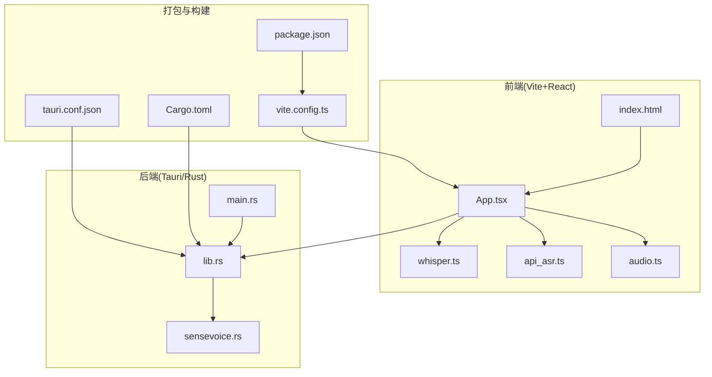
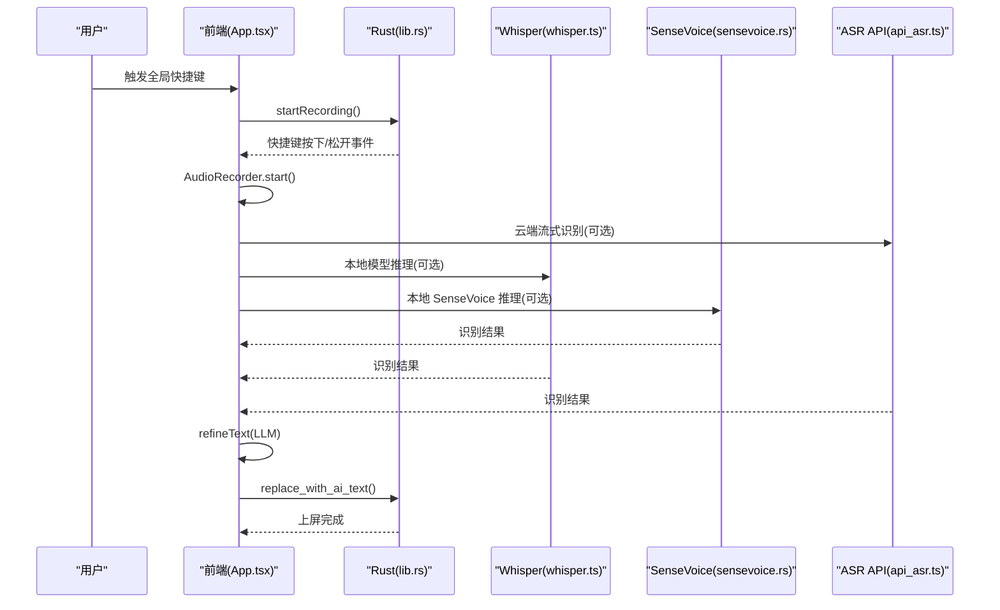
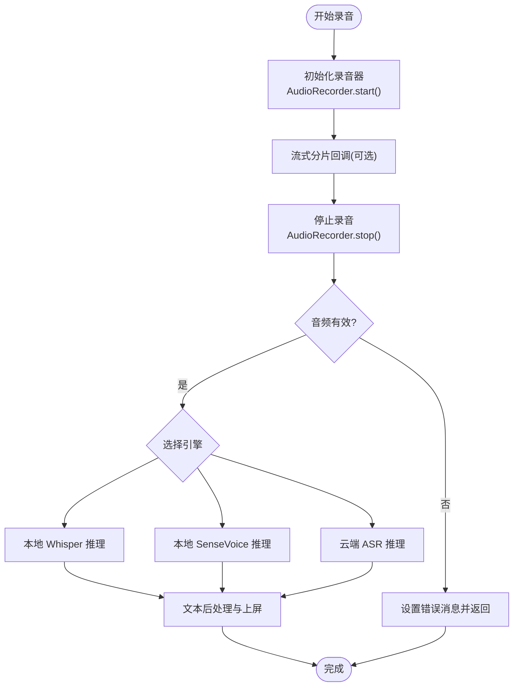
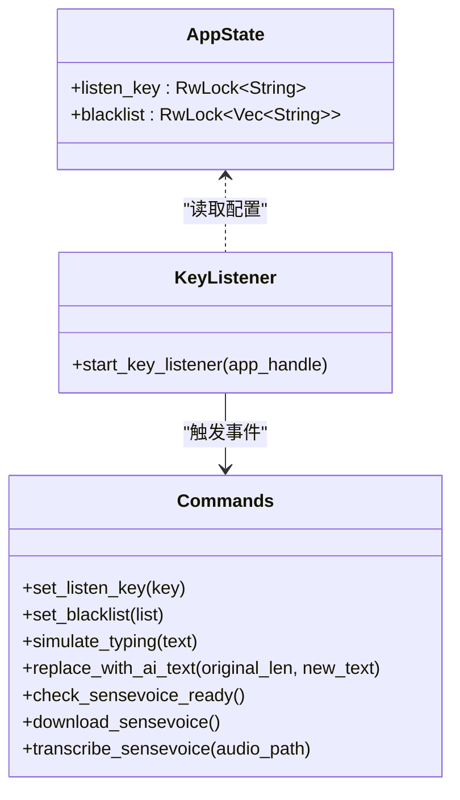
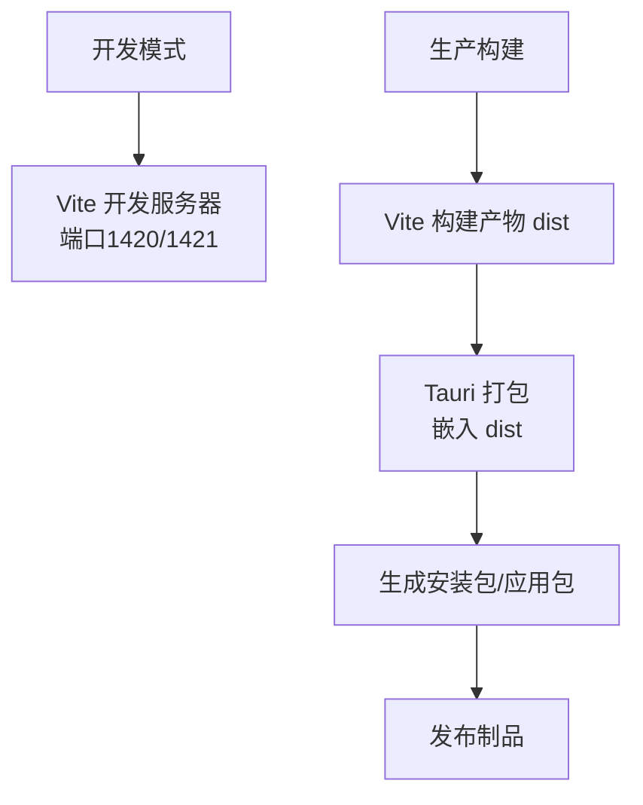
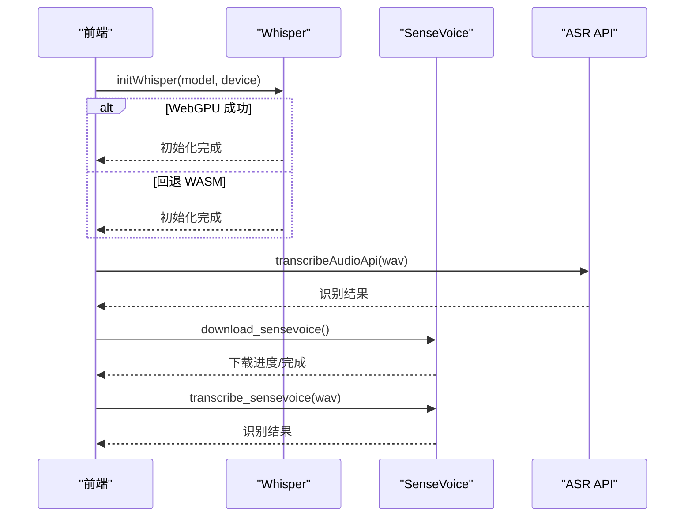
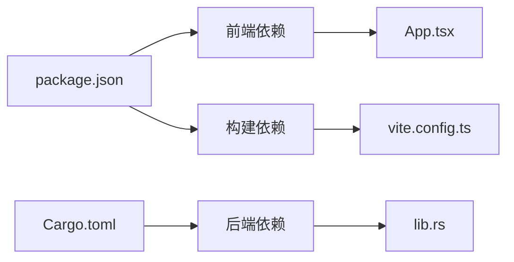

# 生产环境部署

<cite>
**本文引用的文件**
- [package.json](file://package.json)
- [vite.config.ts](file://vite.config.ts)
- [tauri.conf.json](file://src-tauri/tauri.conf.json)
- [Cargo.toml](file://src-tauri/Cargo.toml)
- [main.rs](file://src-tauri/src/main.rs)
- [lib.rs](file://src-tauri/src/lib.rs)
- [sensevoice.rs](file://src-tauri/src/sensevoice.rs)
- [App.tsx](file://src/App.tsx)
- [api_asr.ts](file://src/utils/api_asr.ts)
- [whisper.ts](file://src/utils/whisper.ts)
- [audio.ts](file://src/utils/audio.ts)
- [index.html](file://index.html)
- [tsconfig.json](file://tsconfig.json)
</cite>

## 目录
1. [简介](#简介)
2. [项目结构](#项目结构)
3. [核心组件](#核心组件)
4. [架构总览](#架构总览)
5. [详细组件分析](#详细组件分析)
6. [依赖关系分析](#依赖关系分析)
7. [性能考虑](#性能考虑)
8. [故障排查指南](#故障排查指南)
9. [结论](#结论)
10. [附录](#附录)

## 简介
本指南面向 VoiceFlow_AI_002 的生产环境部署，覆盖构建优化、资源与性能调优、日志与错误监控、应用健康检查、容器化与云平台部署最佳实践，以及安全加固与访问控制策略。文档基于仓库现有配置与源码进行分析，确保可操作性与可追溯性。

## 项目结构
项目采用 Tauri + React + TypeScript 架构，前端通过 Vite 构建，后端 Rust 提供系统级能力与插件扩展，核心流程围绕“全局快捷键监听 → 录音采集 → 本地/云端识别 → AI 润色 → 文本上屏”展开。

**图表来源**
- [index.html:1-15](file://index.html#L1-L15)
- [App.tsx:1-774](file://src/App.tsx#L1-L774)
- [whisper.ts:1-174](file://src/utils/whisper.ts#L1-L174)
- [api_asr.ts:1-73](file://src/utils/api_asr.ts#L1-L73)
- [audio.ts:1-221](file://src/utils/audio.ts#L1-L221)
- [main.rs:1-9](file://src-tauri/src/main.rs#L1-L9)
- [lib.rs:1-287](file://src-tauri/src/lib.rs#L1-L287)
- [sensevoice.rs:1-476](file://src-tauri/src/sensevoice.rs#L1-L476)
- [vite.config.ts:1-44](file://vite.config.ts#L1-L44)
- [package.json:1-32](file://package.json#L1-L32)
- [Cargo.toml:1-47](file://src-tauri/Cargo.toml#L1-L47)
- [tauri.conf.json:1-68](file://src-tauri/tauri.conf.json#L1-L68)

**章节来源**
- [package.json:1-32](file://package.json#L1-L32)
- [vite.config.ts:1-44](file://vite.config.ts#L1-L44)
- [tauri.conf.json:1-68](file://src-tauri/tauri.conf.json#L1-L68)
- [Cargo.toml:1-47](file://src-tauri/Cargo.toml#L1-L47)
- [index.html:1-15](file://index.html#L1-L15)

## 核心组件
- 前端应用与状态管理：负责 UI、录音控制、ASR 识别、LLM 润色、日志与错误收集、窗口与托盘交互。
- Rust 插件与系统集成：提供全局快捷键监听、模拟输入、剪贴板操作、SenseVoice 模型下载与推理、自动启动等。
- 构建与打包：Vite 配置、Tauri 配置、Rust Profile 优化、CSP 安全策略。

**章节来源**
- [App.tsx:1-774](file://src/App.tsx#L1-L774)
- [lib.rs:1-287](file://src-tauri/src/lib.rs#L1-L287)
- [sensevoice.rs:1-476](file://src-tauri/src/sensevoice.rs#L1-L476)
- [vite.config.ts:1-44](file://vite.config.ts#L1-L44)
- [tauri.conf.json:1-68](file://src-tauri/tauri.conf.json#L1-L68)
- [Cargo.toml:1-47](file://src-tauri/Cargo.toml#L1-L47)

## 架构总览
生产部署需关注以下关键点：
- 构建产物由 Vite 生成，Tauri 在构建后将其作为前端资源打包。
- Rust 层通过命令暴露能力给前端，前端通过 @tauri-apps/api 调用。
- 安全策略通过 CSP 限制资源加载与脚本执行范围。
- 性能优化集中在 Rust Release Profile、WebGPU/WASM 设备选择、模型内存释放策略与音频流式处理。

**图表来源**
- [App.tsx:374-640](file://src/App.tsx#L374-L640)
- [lib.rs:77-118](file://src-tauri/src/lib.rs#L77-L118)
- [whisper.ts:35-174](file://src/utils/whisper.ts#L35-L174)
- [api_asr.ts:41-73](file://src/utils/api_asr.ts#L41-L73)
- [sensevoice.rs:445-476](file://src-tauri/src/sensevoice.rs#L445-L476)

## 详细组件分析

### 前端应用与日志监控
- 日志劫持：前端通过重写 console.log/warn/error，将输出追加到内存日志列表，便于设置面板查看与导出。
- 错误收集：各阶段设置错误消息并在 UI 中展示；录音与识别过程捕获异常并更新状态。
- 窗口与托盘：主窗口关闭行为改为隐藏，托盘菜单提供唤出与退出选项。

**图表来源**
- [App.tsx:374-640](file://src/App.tsx#L374-L640)
- [audio.ts:12-174](file://src/utils/audio.ts#L12-L174)

**章节来源**
- [App.tsx:30-117](file://src/App.tsx#L30-L117)
- [audio.ts:1-221](file://src/utils/audio.ts#L1-L221)

### Rust 插件与系统集成
- 全局快捷键监听：使用 rdev 事件驱动，支持黑名单过滤与前后台窗口信息获取。
- 模拟输入与剪贴板：通过 Enigo 与 arboard 实现粘贴与回退替换，保证替换稳定性。
- SenseVoice 下载与推理：多镜像站点下载、原子解包、模型校验与进程调用推理引擎。
- 自动启动与托盘：提供 autostart 插件与托盘菜单事件处理。

**图表来源**
- [lib.rs:18-43](file://src-tauri/src/lib.rs#L18-L43)
- [lib.rs:140-212](file://src-tauri/src/lib.rs#L140-L212)
- [lib.rs:275-283](file://src-tauri/src/lib.rs#L275-L283)
- [sensevoice.rs:295-443](file://src-tauri/src/sensevoice.rs#L295-L443)

**章节来源**
- [lib.rs:1-287](file://src-tauri/src/lib.rs#L1-L287)
- [sensevoice.rs:1-476](file://src-tauri/src/sensevoice.rs#L1-L476)

### 构建与打包配置
- Vite：开发服务器固定端口、严格端口、HMR 配置、代理到镜像站、忽略 src-tauri 目录。
- Tauri：前后端路径、窗口配置、CSP 安全策略、打包图标与安装器。
- Rust：Release Profile 启用符号剥离、LTO、优化级别、panic=abort。

**图表来源**
- [vite.config.ts:8-43](file://vite.config.ts#L8-L43)
- [tauri.conf.json:6-11](file://src-tauri/tauri.conf.json#L6-L11)
- [Cargo.toml:41-47](file://src-tauri/Cargo.toml#L41-L47)

**章节来源**
- [vite.config.ts:1-44](file://vite.config.ts#L1-L44)
- [tauri.conf.json:1-68](file://src-tauri/tauri.conf.json#L1-L68)
- [Cargo.toml:1-47](file://src-tauri/Cargo.toml#L1-L47)

### 识别与推理链路
- 本地 Whisper：自动选择 WebGPU，失败则回退 WASM；空闲 10 分钟释放内存。
- 云端 API：将 Float32Array 编码为 WAV，按需拼接 /v1/audio/transcriptions。
- SenseVoice：多镜像下载模型与引擎，原子解包，调用外部可执行文件推理。

**图表来源**
- [whisper.ts:35-174](file://src/utils/whisper.ts#L35-L174)
- [api_asr.ts:41-73](file://src/utils/api_asr.ts#L41-L73)
- [sensevoice.rs:310-443](file://src-tauri/src/sensevoice.rs#L310-L443)

**章节来源**
- [whisper.ts:1-174](file://src/utils/whisper.ts#L1-L174)
- [api_asr.ts:1-73](file://src/utils/api_asr.ts#L1-L73)
- [sensevoice.rs:1-476](file://src-tauri/src/sensevoice.rs#L1-L476)

## 依赖关系分析
- 前端依赖：React、@tauri-apps/api、@huggingface/transformers、相关 Tauri 插件。
- 后端依赖：tauri、tauri-plugin-autostart、tauri-plugin-opener、enigo、rdev、reqwest、log/env_logger 等。
- 构建依赖：@vitejs/plugin-react、vite、@tauri-apps/cli、typescript。

**图表来源**
- [package.json:13-30](file://package.json#L13-L30)
- [Cargo.toml:20-47](file://src-tauri/Cargo.toml#L20-L47)
- [vite.config.ts:1-44](file://vite.config.ts#L1-L44)
- [App.tsx:1-30](file://src/App.tsx#L1-L30)

**章节来源**
- [package.json:1-32](file://package.json#L1-L32)
- [Cargo.toml:1-47](file://src-tauri/Cargo.toml#L1-L47)

## 性能考虑
- Rust Release Profile
  - 符号剥离、链接时优化、单代码单元、panic=abort，降低体积与提升启动性能。
  - 建议在 CI 中启用对应 Profile 进行构建与测试。
- 前端性能
  - Whisper 内存释放策略：空闲 10 分钟自动 dispose，避免长期占用。
  - WebGPU 优先，失败回退 WASM，兼顾兼容性与性能。
  - Vite 严格端口与 HMR 仅限开发，生产构建禁用 HMR。
- 资源与网络
  - 代理到镜像站减少跨域与网络抖动，提高模型与权重加载成功率。
  - 云端 API 请求时自动补齐路径，避免重复拼接错误。
- 音频处理
  - VAD 静音检测与首尾静音裁剪，减少无效数据传输与推理成本。

**章节来源**
- [Cargo.toml:41-47](file://src-tauri/Cargo.toml#L41-L47)
- [whisper.ts:21-33](file://src/utils/whisper.ts#L21-L33)
- [vite.config.ts:14-43](file://vite.config.ts#L14-L43)
- [api_asr.ts:51-55](file://src/utils/api_asr.ts#L51-L55)
- [audio.ts:132-173](file://src/utils/audio.ts#L132-L173)

## 故障排查指南
- 日志与错误收集
  - 前端劫持 console 输出，可在设置面板查看最近日志，辅助定位问题。
  - 关键错误分支：麦克风权限、模型初始化失败、识别引擎异常、网络请求失败。
- 常见问题
  - WebGPU 推理崩溃：自动回退 WASM 并重试；若仍失败，检查设备兼容性与驱动。
  - SenseVoice 下载失败：多镜像站点重试与原子解包，确认磁盘空间与网络可达性。
  - 云端 API 返回非 2xx：检查鉴权头与 URL 路径拼接。
- 健康检查建议
  - 启动后检查：模型就绪状态、快捷键监听线程、托盘图标与菜单响应。
  - 运行期监控：录音状态、识别耗时、内存占用、日志级别告警阈值。

**章节来源**
- [App.tsx:30-117](file://src/App.tsx#L30-L117)
- [lib.rs:140-212](file://src-tauri/src/lib.rs#L140-L212)
- [sensevoice.rs:83-181](file://src-tauri/src/sensevoice.rs#L83-L181)
- [api_asr.ts:65-68](file://src/utils/api_asr.ts#L65-L68)

## 结论
本指南基于仓库现有配置与源码，给出了生产环境部署的完整路径：构建优化、资源与性能调优、日志与错误监控、健康检查、容器化与云平台部署最佳实践，以及安全加固与访问控制策略。建议在 CI/CD 中固化构建与测试流程，并结合实际硬件与网络环境进一步微调性能参数。

## 附录

### 生产构建与优化清单
- 构建
  - 使用 Vite 生产构建生成 dist。
  - 使用 Tauri 打包，确保 frontendDist 指向 dist。
- 性能
  - 启用 Rust Release Profile。
  - 前端 Whisper 空闲释放与设备回退策略。
  - Vite 严格端口与 HMR 关闭。
- 安全
  - CSP 限制脚本与连接源，仅允许必要资源。
  - 仅在可信网络内使用代理与镜像站。
- 监控
  - 前端日志收集与错误上报。
  - 后端日志初始化与关键事件记录。

**章节来源**
- [vite.config.ts:14-43](file://vite.config.ts#L14-L43)
- [tauri.conf.json:44-46](file://src-tauri/tauri.conf.json#L44-L46)
- [Cargo.toml:41-47](file://src-tauri/Cargo.toml#L41-L47)
- [lib.rs:216-216](file://src-tauri/src/lib.rs#L216-L216)