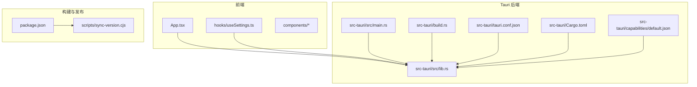
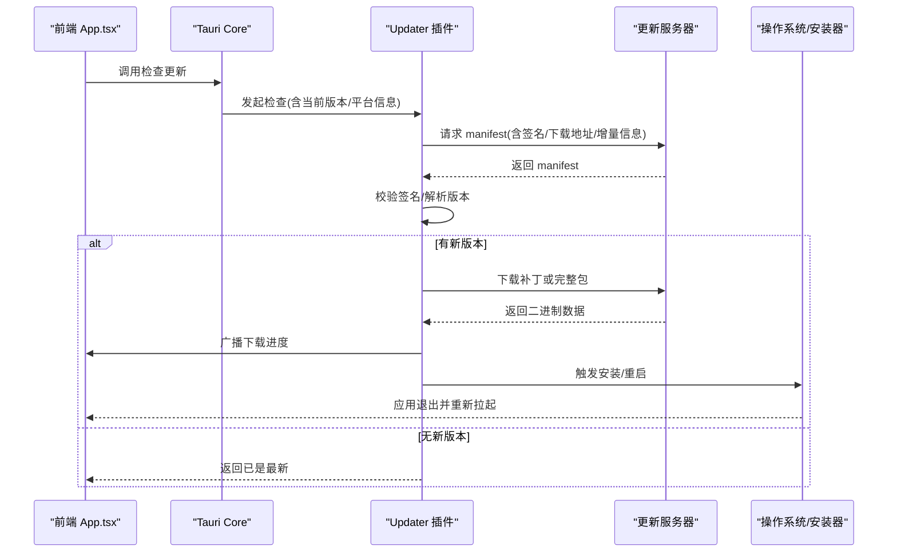
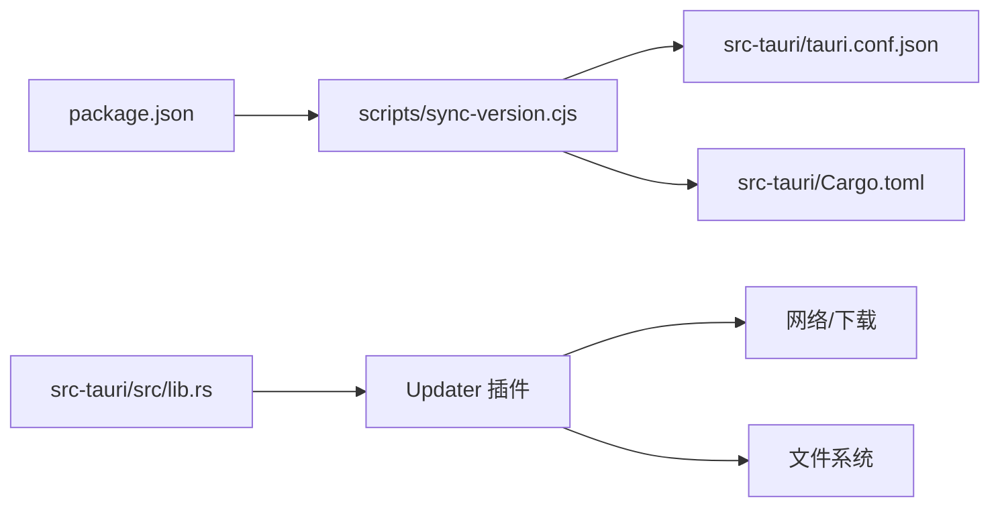

# 自动更新

<cite>
**本文引用的文件**   
- [tauri.conf.json](file://src-tauri/tauri.conf.json)
- [Cargo.toml](file://src-tauri/Cargo.toml)
- [lib.rs](file://src-tauri/src/lib.rs)
- [main.rs](file://src-tauri/src/main.rs)
- [build.rs](file://src-tauri/build.rs)
- [default.json](file://src-tauri/capabilities/default.json)
- [package.json](file://package.json)
- [sync-version.cjs](file://scripts/sync-version.cjs)
- [App.tsx](file://src/App.tsx)
</cite>

## 目录
1. [简介](#简介)
2. [项目结构](#项目结构)
3. [核心组件](#核心组件)
4. [架构总览](#架构总览)
5. [详细组件分析](#详细组件分析)
6. [依赖分析](#依赖分析)
7. [性能考虑](#性能考虑)
8. [故障排查指南](#故障排查指南)
9. [结论](#结论)
10. [附录](#附录)

## 简介
本文件为 VoiceFlow_AI_002 的“自动更新”机制设计与落地方案，目标是在现有 Tauri v2 + React 工程基础上，集成并配置官方更新插件（tauri-plugin-updater），实现：
- 更新服务器与签名校验配置
- 版本比较逻辑与增量更新策略
- 更新包生成、分发与下载流程
- 用户友好的更新提示与进度显示
- 更新失败处理与回滚机制

当前仓库尚未启用 updater 插件。本文在保持与现有代码兼容的前提下，给出最小改动路径与最佳实践，确保在不破坏现有功能（如全局快捷键、SenseVoice 模型下载等）的情况下完成更新能力接入。

## 项目结构
本项目采用 Tauri v2 标准结构：
- 前端：React + TypeScript + Vite
- 后端：Rust（Tauri 应用入口与命令）
- 构建与打包：Tauri CLI 与 Cargo
- 版本同步脚本：npm 生命周期钩子驱动

图表来源
- [main.rs:1-9](file://src-tauri/src/main.rs#L1-L9)
- [lib.rs:214-286](file://src-tauri/src/lib.rs#L214-L286)
- [tauri.conf.json:1-68](file://src-tauri/tauri.conf.json#L1-L68)
- [Cargo.toml:1-47](file://src-tauri/Cargo.toml#L1-L47)
- [default.json:1-19](file://src-tauri/capabilities/default.json#L1-L19)
- [package.json:1-32](file://package.json#L1-L32)
- [sync-version.cjs:1-34](file://scripts/sync-version.cjs#L1-L34)

章节来源
- [main.rs:1-9](file://src-tauri/src/main.rs#L1-L9)
- [lib.rs:214-286](file://src-tauri/src/lib.rs#L214-L286)
- [tauri.conf.json:1-68](file://src-tauri/tauri.conf.json#L1-L68)
- [Cargo.toml:1-47](file://src-tauri/Cargo.toml#L1-L47)
- [default.json:1-19](file://src-tauri/capabilities/default.json#L1-L19)
- [package.json:1-32](file://package.json#L1-L32)
- [sync-version.cjs:1-34](file://scripts/sync-version.cjs#L1-L34)

## 核心组件
- 应用入口与插件注册：位于 Rust 侧 lib.rs，负责初始化 Tauri Builder、注册插件与命令、托盘菜单与窗口事件。
- 配置中心：tauri.conf.json 定义产品名、版本号、窗口与安全策略；Cargo.toml 声明依赖与编译特性。
- 权限与能力：capabilities/default.json 控制前后端可访问的能力集。
- 版本同步：scripts/sync-version.cjs 将 package.json 的版本同步到 tauri.conf.json 与 Cargo.toml，保证多源版本一致。
- 前端交互：App.tsx 监听系统事件、管理 UI 状态，可作为更新提示与进度的承载层。

章节来源
- [lib.rs:214-286](file://src-tauri/src/lib.rs#L214-L286)
- [tauri.conf.json:1-68](file://src-tauri/tauri.conf.json#L1-L68)
- [Cargo.toml:1-47](file://src-tauri/Cargo.toml#L1-L47)
- [default.json:1-19](file://src-tauri/capabilities/default.json#L1-L19)
- [sync-version.cjs:1-34](file://scripts/sync-version.cjs#L1-L34)
- [App.tsx:1-774](file://src/App.tsx#L1-L774)

## 架构总览
下图展示“自动更新”在系统中的位置与数据流：前端通过 Tauri API 调用更新插件，插件从配置的更新服务器拉取 manifest 与补丁/安装包，进行签名校验、版本比较与增量计算，随后执行下载与安装，并在关键节点向前端广播进度与结果。

图表来源
- [lib.rs:214-286](file://src-tauri/src/lib.rs#L214-L286)
- [tauri.conf.json:1-68](file://src-tauri/tauri.conf.json#L1-L68)
- [App.tsx:1-774](file://src/App.tsx#L1-L774)

## 详细组件分析

### 1) 更新插件配置与启用
- 在 Rust 侧启用 updater 插件，并在 Builder 中注册。
- 在 tauri.conf.json 中配置 updater 的 manifest URL、签名公钥、是否允许静默安装等。
- 在 capabilities 中按需授予 updater 相关权限（若使用默认能力则通常无需额外配置）。

建议的最小变更点：
- 在 lib.rs 的插件注册处添加 updater 插件初始化。
- 在 tauri.conf.json 的顶层新增 updater 配置段。
- 在 default.json 中确认未禁用 updater 所需能力（默认情况下不冲突）。

章节来源
- [lib.rs:214-286](file://src-tauri/src/lib.rs#L214-L286)
- [tauri.conf.json:1-68](file://src-tauri/tauri.conf.json#L1-L68)
- [default.json:1-19](file://src-tauri/capabilities/default.json#L1-L19)

### 2) 更新服务器与 Manifest 规范
- 更新服务器需托管一个 JSON manifest，包含：
  - 目标平台列表及每个平台的下载地址
  - 版本号（遵循语义化版本）
  - 可选：增量补丁地址与大小、发布日期、说明
  - 可选：强制更新标志
- 服务器需支持 HTTPS，并提供完整的签名链（公钥用于客户端校验）。

注意：
- 版本号必须与 tauri.conf.json 和 Cargo.toml 中的版本保持一致（由 sync-version.cjs 保障）。
- 建议使用稳定的 CDN 或对象存储，开启缓存与断点续传以提升可靠性。

章节来源
- [tauri.conf.json:1-68](file://src-tauri/tauri.conf.json#L1-L68)
- [Cargo.toml:1-47](file://src-tauri/Cargo.toml#L1-L47)
- [sync-version.cjs:1-34](file://scripts/sync-version.cjs#L1-L34)

### 3) 版本比较与增量更新策略
- 版本比较：基于语义化版本（SemVer），仅当远程版本大于本地版本时触发更新。
- 增量更新：优先使用补丁包（体积更小、下载更快）；若无补丁则回退到完整包。
- 平台差异：按平台分别提供包与补丁，避免跨平台误用。

建议：
- 首次大版本升级尽量提供完整包，后续小版本优先提供补丁。
- 对 Windows 平台，结合 NSIS 安装包与自更新流程，减少权限问题。

章节来源
- [tauri.conf.json:1-68](file://src-tauri/tauri.conf.json#L1-L68)
- [Cargo.toml:1-47](file://src-tauri/Cargo.toml#L1-L47)

### 4) 更新包生成、签名与分发
- 生成：使用 Tauri CLI 构建产物，输出各平台安装包/补丁。
- 签名：对 manifest 与二进制包进行签名，并将公钥嵌入客户端配置。
- 分发：将 manifest 与包上传至更新服务器（CDN/对象存储），确保可被公开访问。

建议：
- 在 CI/CD 中自动化生成、签名与上传，避免人工失误。
- 保留历史版本以便回滚。

章节来源
- [tauri.conf.json:1-68](file://src-tauri/tauri.conf.json#L1-L68)
- [Cargo.toml:1-47](file://src-tauri/Cargo.toml#L1-L47)

### 5) 前端更新提示与进度显示
- 触发时机：应用启动后延迟检查更新；或在设置页提供“立即检查”按钮。
- 进度反馈：监听更新插件的事件，展示下载百分比、剩余时间估算、错误原因。
- 用户交互：提供“稍后提醒”、“立即安装并重启”选项；对于强制更新，隐藏取消按钮。

参考现有模式：
- 项目中已有“下载进度”事件监听模式（SenseVoice 模型下载），可复用该模式对接更新插件的事件通道。

章节来源
- [App.tsx:1-774](file://src/App.tsx#L1-L774)

### 6) 更新失败处理与回滚机制
- 网络失败：重试策略（指数退避）、切换镜像源、降级为完整包。
- 校验失败：丢弃已下载内容，记录日志，提示用户手动重试。
- 安装失败：保留旧版本运行态，必要时提供“回滚到上一版本”的入口。
- 静默安装失败：引导用户以管理员权限安装，或提供离线安装包下载链接。

建议：
- 在安装前备份关键数据目录（如有）。
- 记录详细的更新日志，便于定位问题。

章节来源
- [lib.rs:214-286](file://src-tauri/src/lib.rs#L214-L286)
- [App.tsx:1-774](file://src/App.tsx#L1-L774)

## 依赖分析
- 运行时依赖：
  - Tauri 核心与插件体系（updater 插件）
  - 网络库（HTTP/HTTPS 请求、流式下载）
  - 文件系统（临时目录、原子替换）
- 构建期依赖：
  - Tauri CLI 与 build 工具链
  - 版本同步脚本（npm 生命周期）

图表来源
- [package.json:1-32](file://package.json#L1-L32)
- [sync-version.cjs:1-34](file://scripts/sync-version.cjs#L1-L34)
- [tauri.conf.json:1-68](file://src-tauri/tauri.conf.json#L1-L68)
- [Cargo.toml:1-47](file://src-tauri/Cargo.toml#L1-L47)
- [lib.rs:214-286](file://src-tauri/src/lib.rs#L214-L286)

章节来源
- [package.json:1-32](file://package.json#L1-L32)
- [sync-version.cjs:1-34](file://scripts/sync-version.cjs#L1-L34)
- [tauri.conf.json:1-68](file://src-tauri/tauri.conf.json#L1-L68)
- [Cargo.toml:1-47](file://src-tauri/Cargo.toml#L1-L47)
- [lib.rs:214-286](file://src-tauri/src/lib.rs#L214-L286)

## 性能考虑
- 增量优先：优先下载补丁，显著降低带宽与耗时。
- 并发与限速：合理限制并发下载线程，避免影响主业务体验。
- 缓存与断点续传：利用 HTTP Range 与 ETag 提升重连成功率。
- 后台下载：在非活跃时段或低优先级线程中进行，避免阻塞 UI。
- 磁盘 IO：使用临时目录与原子替换，减少写入竞争与损坏风险。

[本节为通用指导，不涉及具体文件]

## 故障排查指南
- 无法连接更新服务器：
  - 检查网络连通性与代理设置
  - 确认 manifest URL 可达且返回正确 JSON
- 签名校验失败：
  - 核对客户端配置的公钥与服务端签名是否匹配
  - 检查证书链完整性
- 下载中断或不完整：
  - 启用重试与断点续传
  - 对比文件大小与哈希值
- 安装失败或权限不足：
  - 引导用户使用管理员权限
  - 提供离线安装包下载链接
- 回滚失败：
  - 检查备份目录是否存在
  - 记录回滚日志并提示用户重试

章节来源
- [lib.rs:214-286](file://src-tauri/src/lib.rs#L214-L286)
- [App.tsx:1-774](file://src/App.tsx#L1-L774)

## 结论
通过在 Tauri v2 工程中引入 updater 插件，并结合现有的版本同步脚本与前端事件监听模式，可以低成本地实现稳定可靠的自动更新能力。建议在 CI/CD 中完善生成、签名与分发流程，同时在客户端做好失败重试、回滚与用户提示，以确保用户体验与系统稳定性。

[本节为总结性内容，不涉及具体文件]

## 附录

### A. 关键配置清单（示例字段说明）
- tauri.conf.json 中 updater 配置项（字段含义）：
  - endpoints：更新服务器 manifest 地址列表（支持多个）
  - pubkey：用于校验 manifest 签名的公钥
  - dialog：是否显示更新对话框
  - install_mode：安装模式（静默/交互式）
  - windows：Windows 特定安装行为（如是否需要管理员权限）
- Cargo.toml：
  - 确保 tauri 与 updater 插件版本与 Tauri 主版本兼容
- capabilities/default.json：
  - 默认能力通常已满足 updater 需求，无需额外放开

章节来源
- [tauri.conf.json:1-68](file://src-tauri/tauri.conf.json#L1-L68)
- [Cargo.toml:1-47](file://src-tauri/Cargo.toml#L1-L47)
- [default.json:1-19](file://src-tauri/capabilities/default.json#L1-L19)

### B. 版本同步与一致性
- 统一版本源：以 package.json 为准，通过 npm version 命令触发同步脚本
- 同步范围：package.json → tauri.conf.json → Cargo.toml
- 建议：在 CI 中强制校验三者版本一致

章节来源
- [package.json:1-32](file://package.json#L1-L32)
- [sync-version.cjs:1-34](file://scripts/sync-version.cjs#L1-L34)
- [tauri.conf.json:1-68](file://src-tauri/tauri.conf.json#L1-L68)
- [Cargo.toml:1-47](file://src-tauri/Cargo.toml#L1-L47)

### C. 前端事件监听模式参考
- 项目已实现“下载进度”事件监听（SenseVoice 模型下载），可类比实现更新插件的进度事件监听与 UI 渲染。
- 建议在前端增加“检查更新”入口，并在设置页展示最近一次检查结果与错误信息。

章节来源
- [App.tsx:1-774](file://src/App.tsx#L1-L774)