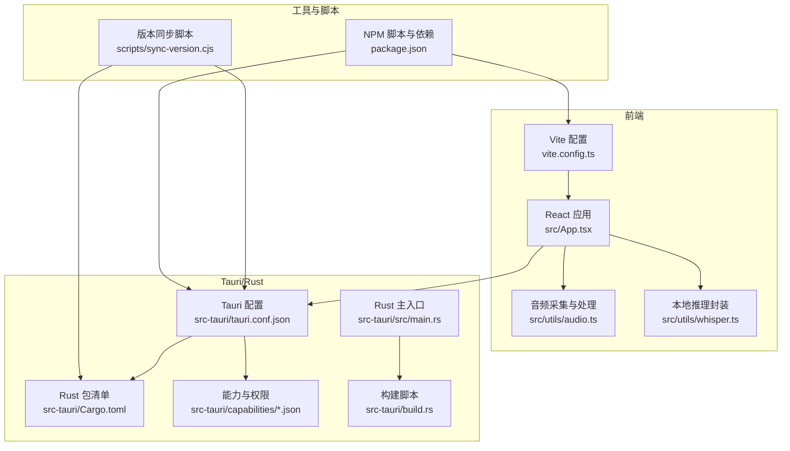
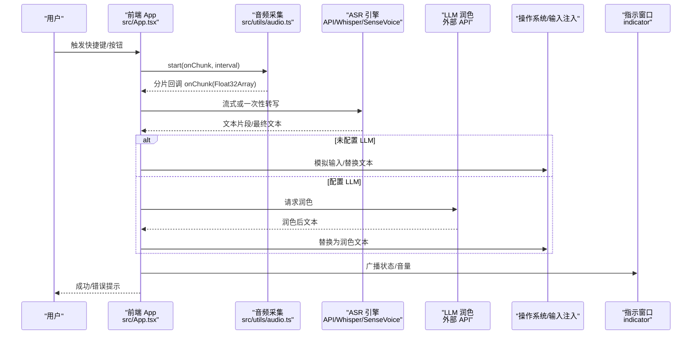
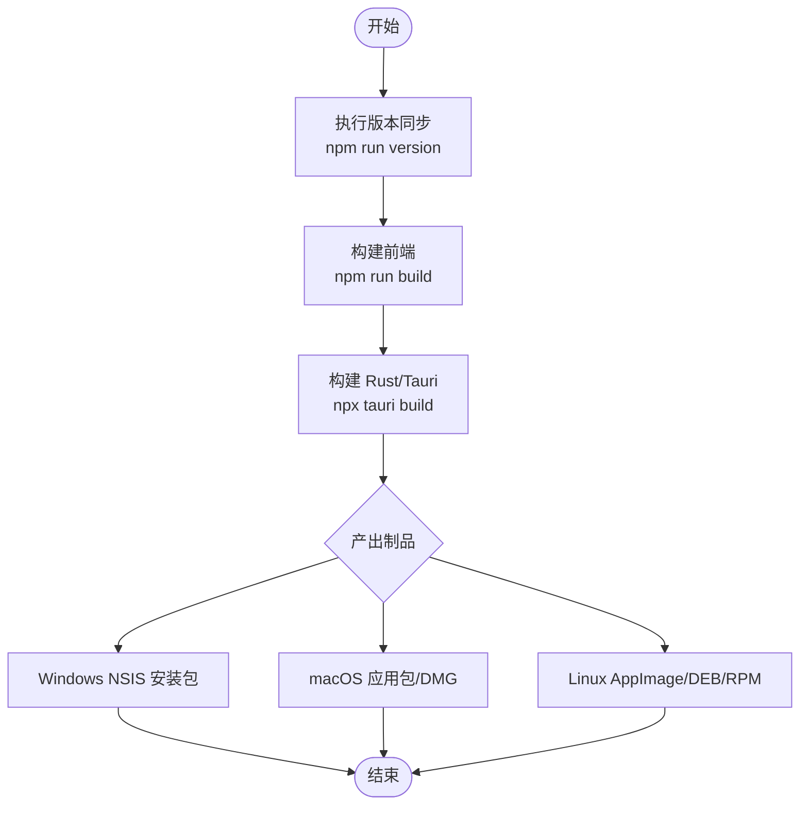
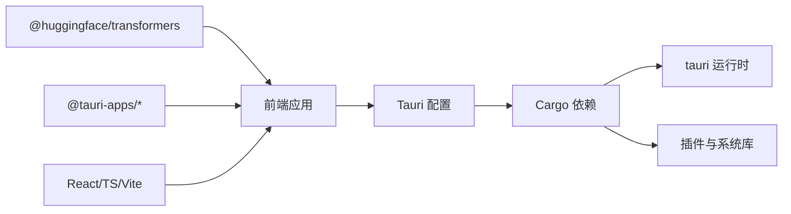

# 部署和分发

<cite>
**本文引用的文件**
- [package.json](file://package.json)
- [vite.config.ts](file://vite.config.ts)
- [src-tauri/tauri.conf.json](file://src-tauri/tauri.conf.json)
- [src-tauri/Cargo.toml](file://src-tauri/Cargo.toml)
- [scripts/sync-version.cjs](file://scripts/sync-version.cjs)
- [src-tauri/capabilities/default.json](file://src-tauri/capabilities/default.json)
- [src-tauri/capabilities/desktop.json](file://src-tauri/capabilities/desktop.json)
- [src-tauri/src/main.rs](file://src-tauri/src/main.rs)
- [src-tauri/build.rs](file://src-tauri/build.rs)
- [src/App.tsx](file://src/App.tsx)
- [src/utils/audio.ts](file://src/utils/audio.ts)
- [src/utils/whisper.ts](file://src/utils/whisper.ts)
</cite>

## 目录
1. [简介](#简介)
2. [项目结构](#项目结构)
3. [核心组件](#核心组件)
4. [架构总览](#架构总览)
5. [详细组件分析](#详细组件分析)
6. [依赖分析](#依赖分析)
7. [性能考虑](#性能考虑)
8. [故障排查指南](#故障排查指南)
9. [结论](#结论)
10. [附录](#附录)

## 简介
本文件面向 VoiceFlow_AI_002 的构建、打包、签名与分发，覆盖 Windows、macOS、Linux 三大平台。内容包含：
- 多平台构建配置与打包流程
- 应用签名、代码验证与数字证书配置方法
- 自动更新机制的实现指南（版本管理与增量更新）
- 应用商店发布的准备与规范要求
- 生产环境部署最佳实践与性能优化建议

本项目基于 Tauri v2 + React + TypeScript + Vite，前端资源由 Vite 构建输出到 dist，Rust 侧通过 Cargo 编译并集成 Tauri 运行时进行打包。

## 项目结构
- 前端工程：React + TypeScript + Vite，开发端口固定为 1420，HMR 使用 ws 协议；生产构建产物位于 dist。
- Rust/Tauri 工程：位于 src-tauri，包含 tauri.conf.json、Cargo.toml、能力权限定义、主入口与构建脚本。
- 版本同步脚本：scripts/sync-version.cjs 用于将 package.json 的版本同步至 tauri.conf.json 与 Cargo.toml。

图示来源
- [vite.config.ts:1-44](file://vite.config.ts#L1-L44)
- [src/App.tsx:1-774](file://src/App.tsx#L1-L774)
- [src/utils/audio.ts:1-221](file://src/utils/audio.ts#L1-L221)
- [src/utils/whisper.ts:1-174](file://src/utils/whisper.ts#L1-L174)
- [src-tauri/tauri.conf.json:1-68](file://src-tauri/tauri.conf.json#L1-L68)
- [src-tauri/Cargo.toml:1-47](file://src-tauri/Cargo.toml#L1-L47)
- [src-tauri/capabilities/default.json:1-19](file://src-tauri/capabilities/default.json#L1-L19)
- [src-tauri/capabilities/desktop.json:1-14](file://src-tauri/capabilities/desktop.json#L1-L14)
- [src-tauri/src/main.rs:1-9](file://src-tauri/src/main.rs#L1-L9)
- [src-tauri/build.rs:1-4](file://src-tauri/build.rs#L1-L4)
- [scripts/sync-version.cjs:1-35](file://scripts/sync-version.cjs#L1-L35)
- [package.json:1-32](file://package.json#L1-L32)

章节来源
- [package.json:1-32](file://package.json#L1-L32)
- [vite.config.ts:1-44](file://vite.config.ts#L1-L44)
- [src-tauri/tauri.conf.json:1-68](file://src-tauri/tauri.conf.json#L1-L68)
- [src-tauri/Cargo.toml:1-47](file://src-tauri/Cargo.toml#L1-L47)
- [scripts/sync-version.cjs:1-35](file://scripts/sync-version.cjs#L1-L35)

## 核心组件
- 构建与打包
  - NPM 脚本：提供 dev、build、preview、tauri、version 等命令，其中 version 调用版本同步脚本。
  - Vite：开发服务器端口 1420，严格端口模式，忽略 src-tauri 变更监听，支持代理以访问模型镜像站。
  - Tauri：打包目标 all，Windows 使用 NSIS 安装包语言配置，图标集已配置。
  - Cargo：release profile 启用 strip、LTO、opt-level=z、单 codegen-units、panic=abort，利于体积与性能。
- 能力与权限
  - default 能力：允许窗口控制、事件、Webview 默认权限。
  - desktop 能力：在 macOS、Windows、Linux 上启用 autostart 插件权限。
- 版本管理
  - scripts/sync-version.cjs 将 package.json 的版本同步到 tauri.conf.json 与 Cargo.toml，保证前后端版本一致。

章节来源
- [package.json:1-32](file://package.json#L1-L32)
- [vite.config.ts:1-44](file://vite.config.ts#L1-L44)
- [src-tauri/tauri.conf.json:1-68](file://src-tauri/tauri.conf.json#L1-L68)
- [src-tauri/Cargo.toml:1-47](file://src-tauri/Cargo.toml#L1-L47)
- [src-tauri/capabilities/default.json:1-19](file://src-tauri/capabilities/default.json#L1-L19)
- [src-tauri/capabilities/desktop.json:1-14](file://src-tauri/capabilities/desktop.json#L1-L14)
- [scripts/sync-version.cjs:1-35](file://scripts/sync-version.cjs#L1-L35)

## 架构总览
下图展示了从用户交互到系统级能力的端到端流程，包括录音、转写、AI 润色、结果上屏与状态指示窗口的联动。

图示来源
- [src/App.tsx:1-774](file://src/App.tsx#L1-L774)
- [src/utils/audio.ts:1-221](file://src/utils/audio.ts#L1-L221)
- [src/utils/whisper.ts:1-174](file://src/utils/whisper.ts#L1-L174)

## 详细组件分析

### 构建与打包流程（跨平台）
- 前置条件
  - Node.js 与 npm 可用
  - Rust 工具链（cargo、rustc）
  - 各平台打包所需工具链（见“平台特定设置”）
- 统一版本号
  - 修改 package.json 中的 version，执行 npm run version 以同步至 tauri.conf.json 与 Cargo.toml。
- 开发与预览
  - npm run dev：启动 Vite 开发服务（端口 1420），Tauri 开发模式连接该地址。
  - npm run preview：预览构建产物。
- 构建与打包
  - npm run build：TypeScript 编译 + Vite 构建，产物输出到 dist。
  - npx tauri build：根据 tauri.conf.json 的 targets=all 生成各平台安装包/可执行文件。
- 发布制品
  - Windows：NSIS 安装包（含中文语言包）。
  - macOS：应用包与可选 DMG/ZIP。
  - Linux：AppImage/DEB/RPM（取决于宿主环境）。

图示来源
- [package.json:1-32](file://package.json#L1-L32)
- [scripts/sync-version.cjs:1-35](file://scripts/sync-version.cjs#L1-L35)
- [vite.config.ts:1-44](file://vite.config.ts#L1-L44)
- [src-tauri/tauri.conf.json:1-68](file://src-tauri/tauri.conf.json#L1-L68)
- [src-tauri/Cargo.toml:1-47](file://src-tauri/Cargo.toml#L1-L47)

章节来源
- [package.json:1-32](file://package.json#L1-L32)
- [scripts/sync-version.cjs:1-35](file://scripts/sync-version.cjs#L1-L35)
- [vite.config.ts:1-44](file://vite.config.ts#L1-L44)
- [src-tauri/tauri.conf.json:1-68](file://src-tauri/tauri.conf.json#L1-L68)
- [src-tauri/Cargo.toml:1-47](file://src-tauri/Cargo.toml#L1-L47)

### 平台特定设置与要求
- Windows
  - 需要安装 Visual Studio Build Tools（MSVC 工作负载）以编译 Rust 原生依赖。
  - NSIS 打包器需可用（通常随 Tauri CLI 安装）。
  - 若需代码签名，请配置 signtool 与证书路径（见“签名与验证”）。
- macOS
  - 需要 Xcode Command Line Tools。
  - 如需上架或内部分发，需配置 Apple Developer ID 与 Notary Tool。
- Linux
  - 需要对应发行版的打包工具链（如 dpkg、rpm、appimagetool）。
  - 桌面集成（菜单、图标）依赖发行版规范。

章节来源
- [src-tauri/tauri.conf.json:48-66](file://src-tauri/tauri.conf.json#L48-L66)

### 应用签名、代码验证与数字证书
- Windows 代码签名
  - 使用 Microsoft Authenticode 与 signtool.exe 对安装包与二进制进行签名。
  - 建议在 CI 中通过环境变量注入证书 PFX/P12 与密码，避免硬编码。
  - 可在 Tauri 构建阶段调用签名脚本，或在制品产出后进行二次签名。
- macOS 代码签名与公证
  - 使用 codesign 对应用包签名，使用 notarytool 提交公证。
  - 推荐在 CI 中使用 Apple Developer ID 证书与钥匙串条目完成自动化签名。
- Linux 签名
  - 可使用 gpg 对 DEB/RPM 包签名，提升可信度。
- 安全策略与 CSP
  - 当前 tauri.conf.json 中定义了较宽松的 CSP，生产环境建议收紧 connect-src、script-src 等白名单，仅允许必要域名与协议。

章节来源
- [src-tauri/tauri.conf.json:44-46](file://src-tauri/tauri.conf.json#L44-L46)

### 自动更新机制实现指南
- 版本管理
  - 单一版本源：以 package.json 的 version 为准，通过 scripts/sync-version.cjs 同步至 tauri.conf.json 与 Cargo.toml，确保应用内显示与打包版本一致。
- 增量更新策略
  - 方案一：基于差分包（diff）+ 全量回滚包。服务端维护 diff 与校验信息，客户端下载后校验哈希再合并。
  - 方案二：按平台/架构分发最小化增量包，减少带宽与时间成本。
- 更新检查与下载
  - 前端定时或首次启动时请求远端版本接口，比较本地版本与远端版本。
  - 下载过程需断点续传、并发分块、完整性校验（SHA-256）、失败重试与回滚。
- 安装与重启
  - Windows：使用 NSIS 静默安装参数或自定义安装器执行升级。
  - macOS：替换应用包并重新签名，必要时重启应用。
  - Linux：使用发行版包管理器或自更新器替换二进制与资源。
- 安全与回滚
  - 所有更新包必须签名与校验，失败自动回滚至上一稳定版本。
  - 记录更新日志与遥测，便于问题定位。

[本节为通用实现指南，不直接分析具体源码文件]

### 应用商店发布准备与规范
- Windows
  - Microsoft Store：需准备应用清单、隐私声明、截图、评分与描述；遵循 MSIX 打包与签名要求。
  - 第三方渠道：遵循其安装包格式、图标尺寸、元数据与合规要求。
- macOS
  - Mac App Store：需使用开发者账号、应用签名、沙盒与隐私清单；遵循 MAS 审核指南。
  - 企业/个人分发：使用 Developer ID 签名与公证，提供 DMG/ZIP 下载。
- Linux
  - 主流发行版仓库（如 Flathub）：遵循 Flatpak 规范与元数据要求；或使用官方包管理器（deb/rpm）配合签名。

[本节为通用规范说明，不直接分析具体源码文件]

### 生产环境部署最佳实践
- 构建优化
  - 启用 Tauri release profile 的 strip、LTO、opt-level=z、单 codegen-units，减小体积并提升运行效率。
  - 前端静态资源开启压缩与缓存策略，CDN 加速模型与资源加载。
- 安全加固
  - 收紧 CSP，限制 connect-src 与 script-src 白名单。
  - 敏感配置（API Key、Base URL）通过环境变量注入，避免硬编码。
- 稳定性与容错
  - 网络异常重试与超时控制；关键操作具备降级策略（如离线兜底标点补偿）。
  - 崩溃捕获与日志上报，结合错误码与上下文快速定位。
- 用户体验
  - 首屏加载进度反馈；长耗时任务后台化与取消机制。
  - 多窗口协作（主窗口与指示窗口）状态同步与显隐控制。

章节来源
- [src-tauri/Cargo.toml:41-47](file://src-tauri/Cargo.toml#L41-L47)
- [src-tauri/tauri.conf.json:44-46](file://src-tauri/tauri.conf.json#L44-L46)
- [src/App.tsx:1-774](file://src/App.tsx#L1-L774)

## 依赖分析
- 前端依赖
  - @huggingface/transformers：本地语音识别推理（Whisper）。
  - @tauri-apps/*：窗口、事件、文件系统、自动启动等能力。
  - React、TypeScript、Vite：UI 框架与构建工具。
- Rust 依赖
  - tauri、tauri-plugin-opener、tauri-plugin-autostart：运行时与扩展能力。
  - enigo、device_query、arboard、active-win-pos-rs、rdev：系统交互与剪贴板、窗口位置等。
  - reqwest、tar、bzip2、zip、futures-util：网络与归档处理。
- 构建依赖
  - tauri-build：Tauri 构建期代码生成。

图示来源
- [package.json:13-30](file://package.json#L13-L30)
- [src-tauri/Cargo.toml:20-40](file://src-tauri/Cargo.toml#L20-L40)
- [src-tauri/tauri.conf.json:1-68](file://src-tauri/tauri.conf.json#L1-L68)

章节来源
- [package.json:13-30](file://package.json#L13-L30)
- [src-tauri/Cargo.toml:20-40](file://src-tauri/Cargo.toml#L20-L40)

## 性能考虑
- 前端
  - 音频采集采用 AudioWorklet 子线程处理，降低主线程压力。
  - 分片上传与伪流式处理，平衡延迟与吞吐。
  - Whisper 初始化支持 WebGPU 优先，失败自动回退 WASM，兼顾兼容性与性能。
  - 空闲内存回收策略：长时间无活动后释放推理管道，降低驻留内存。
- Rust/Tauri
  - Release 构建启用 strip、LTO、opt-level=z，显著减小体积与提升性能。
  - panic=abort 避免展开开销，适合高性能场景。
- 网络与资源
  - 开发环境通过 Vite 代理访问 hf-mirror.com，生产环境直连镜像站，提升国内可用性。
  - 合理设置缓存与 CDN，减少重复下载。

章节来源
- [src/utils/audio.ts:1-221](file://src/utils/audio.ts#L1-L221)
- [src/utils/whisper.ts:1-174](file://src/utils/whisper.ts#L1-L174)
- [vite.config.ts:31-41](file://vite.config.ts#L31-L41)
- [src-tauri/Cargo.toml:41-47](file://src-tauri/Cargo.toml#L41-L47)

## 故障排查指南
- 麦克风无法启动
  - 检查浏览器/WebView 权限与设备可用性；确认 AudioContext 未被挂起。
  - 查看控制台错误与日志，确认 recorder-worklet.js 是否被正确加载。
- 转写失败或结果为空
  - 检查网络连通性与 API Key；确认模型是否就绪（SenseVoice 下载进度）。
  - 观察最大振幅阈值与静音检测逻辑，调整灵敏度或靠近麦克风。
- AI 润色失败
  - 检查 LLM 配置（baseUrl、apiKey、modelName）；网络异常时保留原文本。
- 自动启动失败
  - 确认 desktop 能力已启用 autostart 权限；在不同平台下检查系统设置。
- 窗口状态不同步
  - 检查 indicator 窗口标签与事件通信；确认主窗口与指示窗口之间的 emit/listen 链路。

章节来源
- [src/App.tsx:1-774](file://src/App.tsx#L1-L774)
- [src/utils/audio.ts:1-221](file://src/utils/audio.ts#L1-L221)
- [src/utils/whisper.ts:1-174](file://src/utils/whisper.ts#L1-L174)
- [src-tauri/capabilities/desktop.json:1-14](file://src-tauri/capabilities/desktop.json#L1-L14)

## 结论
通过统一的版本同步、严格的构建优化与安全加固，VoiceFlow_AI_002 能够在 Windows、macOS、Linux 上高效构建与分发。结合自动更新机制与完善的故障排查流程，可显著提升用户体验与运维效率。生产环境应持续收紧安全策略、优化资源加载与内存占用，并建立稳定的 CI/CD 流水线以保障发布质量。

## 附录
- 常用命令
  - 同步版本：npm run version
  - 开发：npm run dev
  - 构建前端：npm run build
  - 打包：npx tauri build
- 参考配置路径
  - 前端构建：vite.config.ts
  - Tauri 配置：src-tauri/tauri.conf.json
  - Rust 依赖与优化：src-tauri/Cargo.toml
  - 能力权限：src-tauri/capabilities/*.json