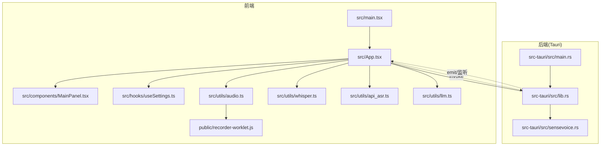
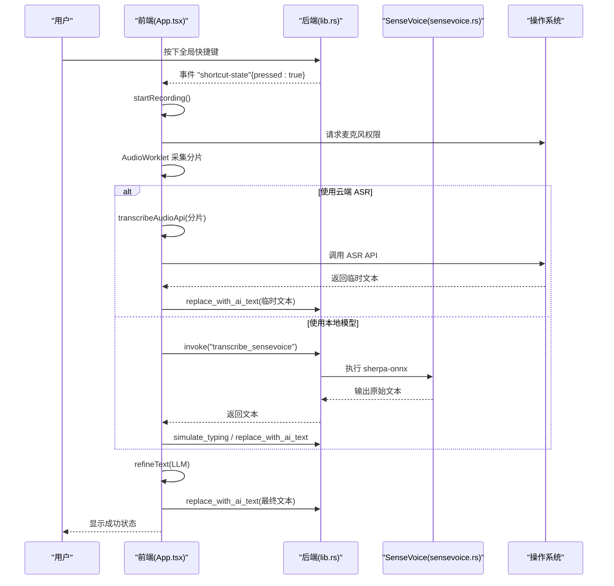
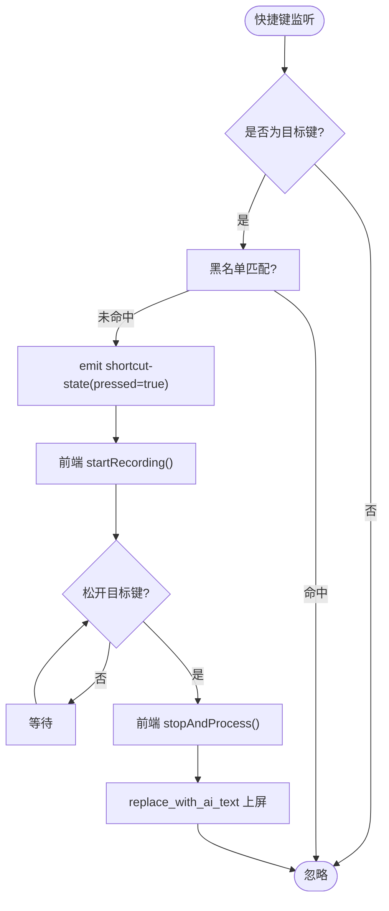
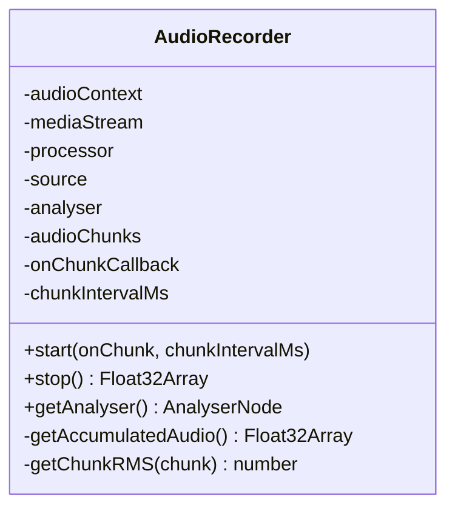
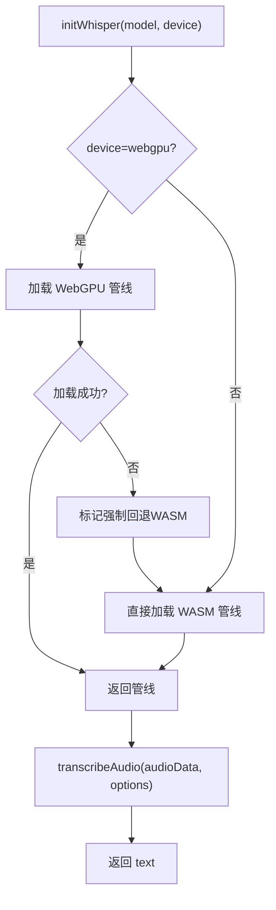
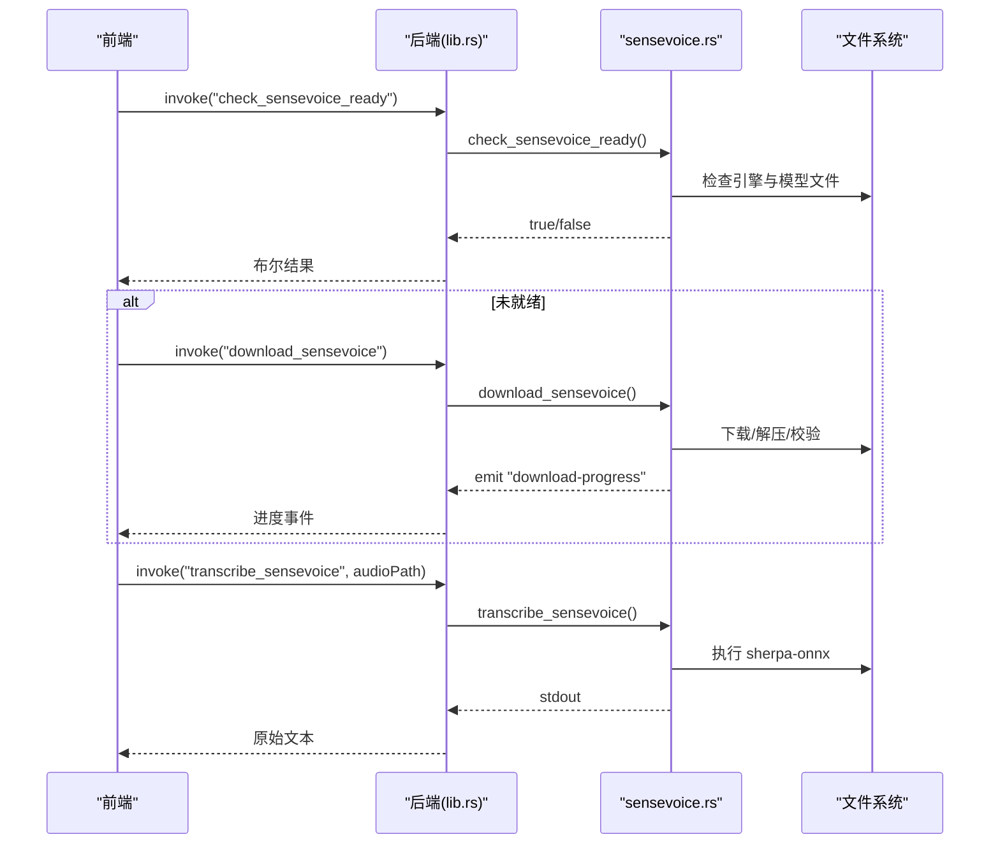
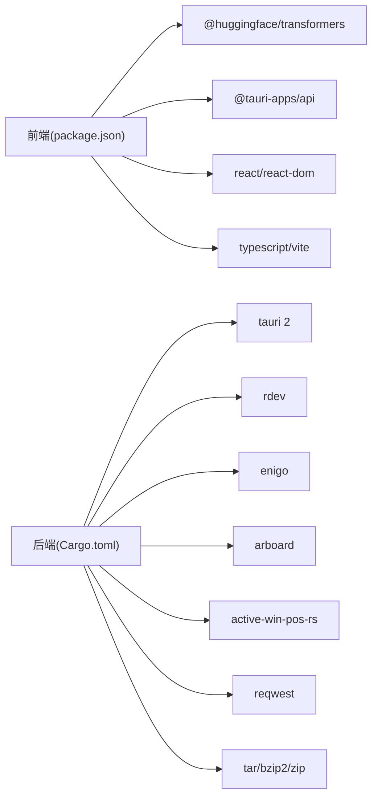

# 项目概述

<cite>
**本文引用的文件**   
- [README.md](file://README.md)
- [package.json](file://package.json)
- [tsconfig.json](file://tsconfig.json)
- [vite.config.ts](file://vite.config.ts)
- [index.html](file://index.html)
- [src/main.tsx](file://src/main.tsx)
- [src/App.tsx](file://src/App.tsx)
- [src/components/MainPanel.tsx](file://src/components/MainPanel.tsx)
- [src/hooks/useSettings.ts](file://src/hooks/useSettings.ts)
- [src/utils/audio.ts](file://src/utils/audio.ts)
- [src/utils/whisper.ts](file://src/utils/whisper.ts)
- [src/utils/api_asr.ts](file://src/utils/api_asr.ts)
- [src/utils/llm.ts](file://src/utils/llm.ts)
- [public/recorder-worklet.js](file://public/recorder-worklet.js)
- [src-tauri/Cargo.toml](file://src-tauri/Cargo.toml)
- [src-tauri/tauri.conf.json](file://src-tauri/tauri.conf.json)
- [src-tauri/src/main.rs](file://src-tauri/src/main.rs)
- [src-tauri/src/lib.rs](file://src-tauri/src/lib.rs)
- [src-tauri/src/sensevoice.rs](file://src-tauri/src/sensevoice.rs)
</cite>

## 目录
1. [简介](#简介)
2. [项目结构](#项目结构)
3. [核心组件](#核心组件)
4. [架构总览](#架构总览)
5. [详细组件分析](#详细组件分析)
6. [依赖关系分析](#依赖关系分析)
7. [性能与体验优化](#性能与体验优化)
8. [快速开始](#快速开始)
9. [故障排查指南](#故障排查指南)
10. [结论](#结论)

## 简介
VoiceFlow_AI_002 是一款基于 Tauri 构建的跨平台桌面语音转写应用，采用 React + TypeScript（前端）与 Rust（后端）的前后端分离架构。其核心价值在于：
- 智能语音转写：支持本地 Whisper/SenseVoice 与云端 ASR API 两种识别路径，兼顾离线可用性与高质量识别。
- AI 文本润色：可选接入 LLM，对识别结果进行风格化润色（自然、正式、精简、学术），并自动适配当前输入场景（聊天、办公、编程）。
- 全局快捷键：后台监听系统按键，实现“按住即录、松开即停”的高效听写体验。
- 多窗口交互：主面板 + 浮空胶囊指示器双窗协同，实时反馈录音/识别/润色状态与音量波形。
- 轻量稳定：Tauri 提供原生能力（剪贴板、键盘模拟、托盘、自启动），体积小巧、启动迅速。

## 项目结构
本项目采用前后端分层组织：
- 前端（React + Vite + TypeScript）
  - 入口与路由：src/main.tsx、index.html
  - 应用根组件：src/App.tsx（状态机、窗口联动、事件总线）
  - 业务面板：src/components/MainPanel.tsx（主面板 UI）
  - 设置与历史：src/hooks/useSettings.ts（配置持久化）、hooks/useHistory.ts（历史记录）
  - 音频采集：src/utils/audio.ts（AudioWorklet 流式采集、VAD 静音切除）
  - 识别引擎：src/utils/whisper.ts（WebGPU/WASM 本地推理）、src/utils/api_asr.ts（OpenAI 兼容 ASR API）
  - AI 润色：src/utils/llm.ts（LLM 调用与提示词模板）
  - 音频工作线程：public/recorder-worklet.js（低延迟音频分片）
- 后端（Tauri + Rust）
  - 进程入口：src-tauri/src/main.rs
  - 命令与系统能力：src-tauri/src/lib.rs（全局快捷键、剪贴板粘贴、替换上屏、托盘菜单、窗口控制）
  - SenseVoice 本地模型管理：src-tauri/src/sensevoice.rs（下载、解压、校验、执行）
  - 构建与打包：src-tauri/Cargo.toml、src-tauri/tauri.conf.json

图表来源
- [src/main.tsx](file://src/main.tsx)
- [src/App.tsx](file://src/App.tsx)
- [src/components/MainPanel.tsx](file://src/components/MainPanel.tsx)
- [src/hooks/useSettings.ts](file://src/hooks/useSettings.ts)
- [src/utils/audio.ts](file://src/utils/audio.ts)
- [src/utils/whisper.ts](file://src/utils/whisper.ts)
- [src/utils/api_asr.ts](file://src/utils/api_asr.ts)
- [src/utils/llm.ts](file://src/utils/llm.ts)
- [public/recorder-worklet.js](file://public/recorder-worklet.js)
- [src-tauri/src/main.rs](file://src-tauri/src/main.rs)
- [src-tauri/src/lib.rs](file://src-tauri/src/lib.rs)
- [src-tauri/src/sensevoice.rs](file://src-tauri/src/sensevoice.rs)

章节来源
- [README.md:1-8](file://README.md#L1-L8)
- [package.json:1-32](file://package.json#L1-L32)
- [tsconfig.json](file://tsconfig.json)
- [vite.config.ts](file://vite.config.ts)
- [index.html](file://index.html)

## 核心组件
- 应用根组件（App）
  - 负责全局状态机（初始化/空闲/录音/转写/润色/成功/错误）、主窗口与浮空指示器窗口联动、全局快捷键监听、录音流程编排、ASR 与 LLM 调用、历史记录写入等。
- 音频采集（AudioRecorder）
  - 使用 AudioContext + AudioWorklet 实现低延迟分片采集；内置 RMS 静音阈值检测，停止时做首尾静音切除，输出 Float32Array。
- 本地识别（Whisper）
  - 基于 @huggingface/transformers，优先 WebGPU，失败回退 WASM；支持进度回调与内存休眠策略。
- 云端识别（ASR API）
  - 将 Float32Array 编码为 WAV Blob，按 OpenAI 兼容接口上传，返回 text。
- AI 润色（LLM）
  - 根据 promptStyle 注入系统提示词，结合当前活跃应用上下文，调用 chat/completions 完成风格化改写。
- 后端能力（lib.rs）
  - 全局快捷键监听（rdev）、剪贴板读写与 Ctrl/Cmd+V 粘贴、Backspace 逐字删除后瞬时替换、托盘菜单、窗口显隐控制。
- SenseVoice 本地引擎（sensevoice.rs）
  - 检查/下载/解压/校验模型与引擎，通过命令行方式执行 sherpa-onnx 离线推理，并向前端广播下载进度。

章节来源
- [src/App.tsx](file://src/App.tsx)
- [src/utils/audio.ts](file://src/utils/audio.ts)
- [src/utils/whisper.ts](file://src/utils/whisper.ts)
- [src/utils/api_asr.ts](file://src/utils/api_asr.ts)
- [src/utils/llm.ts](file://src/utils/llm.ts)
- [src-tauri/src/lib.rs](file://src-tauri/src/lib.rs)
- [src-tauri/src/sensevoice.rs](file://src-tauri/src/sensevoice.rs)

## 架构总览
本应用采用“前端渲染 + 后端系统能力”的解耦设计：
- 前端专注 UI 与业务流程编排，通过 Tauri invoke 调用后端命令，并通过事件系统与后端双向通信。
- 后端封装操作系统级能力（键盘监听、剪贴板、窗口、托盘、进程执行），保证高性能与稳定性。

图表来源
- [src/App.tsx](file://src/App.tsx)
- [src-tauri/src/lib.rs](file://src-tauri/src/lib.rs)
- [src-tauri/src/sensevoice.rs](file://src-tauri/src/sensevoice.rs)
- [src/utils/api_asr.ts](file://src/utils/api_asr.ts)
- [src/utils/llm.ts](file://src/utils/llm.ts)

## 详细组件分析

### 全局快捷键与输入接管
- 后端在独立线程中监听目标键（默认右 Ctrl），获取当前活动窗口信息，并根据黑名单过滤。
- 按键按下/释放时，通过 Tauri 事件 "shortcut-state" 通知前端。
- 前端收到事件后，进入录音或停止处理流程；同时通过后端命令将文本以“先占位再替换”的方式上屏，避免输入法干扰。

图表来源
- [src-tauri/src/lib.rs](file://src-tauri/src/lib.rs)
- [src/App.tsx](file://src/App.tsx)

章节来源
- [src-tauri/src/lib.rs:140-212](file://src-tauri/src/lib.rs#L140-L212)
- [src/App.tsx:256-286](file://src/App.tsx#L256-L286)

### 音频采集与静音切除
- 使用 AudioWorklet 在子线程收集 PCM 样本，主线程定时合并成固定时长分片，用于伪流式识别。
- 停止时计算每个分片的 RMS，移除首尾长静音片段，提升识别质量与速度。

图表来源
- [src/utils/audio.ts:1-174](file://src/utils/audio.ts#L1-L174)
- [public/recorder-worklet.js:1-39](file://public/recorder-worklet.js#L1-L39)

章节来源
- [src/utils/audio.ts:12-173](file://src/utils/audio.ts#L12-L173)
- [public/recorder-worklet.js:1-39](file://public/recorder-worklet.js#L1-L39)

### 本地识别（Whisper）
- 优先尝试 WebGPU 加载 pipeline，失败则回退到 WASM；支持进度回调与闲置内存回收。
- 推理参数包含分片长度、步长、语言与任务类型，必要时注入上下文提示。

图表来源
- [src/utils/whisper.ts:35-112](file://src/utils/whisper.ts#L35-L112)
- [src/utils/whisper.ts:121-174](file://src/utils/whisper.ts#L121-L174)

章节来源
- [src/utils/whisper.ts:35-112](file://src/utils/whisper.ts#L35-L112)
- [src/utils/whisper.ts:121-174](file://src/utils/whisper.ts#L121-L174)

### 云端识别（ASR API）
- 将 Float32Array 编码为 WAV Blob，拼接 OpenAI 兼容接口地址，携带 Authorization 头提交。
- 返回 text 字段作为识别结果。

章节来源
- [src/utils/api_asr.ts:1-73](file://src/utils/api_asr.ts#L1-L73)

### AI 文本润色（LLM）
- 根据 promptStyle 选择系统提示词，并结合当前活跃应用上下文动态增强提示。
- 调用 chat/completions，返回精炼后的文本。

章节来源
- [src/utils/llm.ts:1-65](file://src/utils/llm.ts#L1-L65)

### SenseVoice 本地引擎
- 检查本地是否存在可执行的 sherpa-onnx 与模型文件，不存在则触发下载与解压流程。
- 下载过程通过事件 "download-progress" 向前端推送步骤与进度。
- 推理时调用外部进程，解析 stdout 中的 JSON 或末行文本。

图表来源
- [src-tauri/src/sensevoice.rs:295-476](file://src-tauri/src/sensevoice.rs#L295-L476)
- [src-tauri/src/lib.rs:275-283](file://src-tauri/src/lib.rs#L275-L283)
- [src/App.tsx:186-221](file://src/App.tsx#L186-L221)

章节来源
- [src-tauri/src/sensevoice.rs:295-476](file://src-tauri/src/sensevoice.rs#L295-L476)
- [src-tauri/src/lib.rs:275-283](file://src-tauri/src/lib.rs#L275-L283)
- [src/App.tsx:186-221](file://src/App.tsx#L186-L221)

### 多窗口交互（主面板 + 浮空胶囊）
- 主窗口负责核心逻辑与展示，浮空胶囊仅用于状态与音量可视化。
- 主窗口通过 WebviewWindow API 向指示器窗口发送状态与音量数据，并在合适时机显示/隐藏。

章节来源
- [src/App.tsx:120-171](file://src/App.tsx#L120-L171)
- [src/App.tsx:288-354](file://src/App.tsx#L288-L354)
- [src-tauri/tauri.conf.json:14-42](file://src-tauri/tauri.conf.json#L14-L42)

## 依赖关系分析
- 前端依赖
  - React 19、@tauri-apps/api 2、@huggingface/transformers、lucide-react、Vite、TypeScript。
- 后端依赖
  - tauri 2、tauri-plugin-autostart、tauri-plugin-opener、enigo（键盘模拟）、arboard（剪贴板）、rdev（全局按键）、active-win-pos-rs（活动窗口）、reqwest（网络）、tar/bzip2/zip（归档）、futures-util（异步流）。
- 构建与打包
  - Cargo profile 启用 strip/LTO/opt-level=z/codegen-units=1/panic=abort，追求体积与性能。
  - Tauri 配置定义双窗口、CSP、NSIS 安装器语言与图标集。

图表来源
- [package.json:13-30](file://package.json#L13-L30)
- [src-tauri/Cargo.toml:20-46](file://src-tauri/Cargo.toml#L20-L46)

章节来源
- [package.json:1-32](file://package.json#L1-L32)
- [src-tauri/Cargo.toml:1-47](file://src-tauri/Cargo.toml#L1-L47)

## 性能与体验优化
- 识别引擎
  - Whisper 优先 WebGPU，失败自动回退 WASM；闲置 10 分钟自动释放管线，降低常驻内存占用。
- 音频处理
  - AudioWorklet 低延迟分片；RMS 静音阈值剔除首尾静音，减少无效推理。
- 上屏策略
  - 先占位再替换，避免输入法与快捷键冲突；逐字 Backspace 删除更稳健。
- 打包体积
  - Rust release profile 开启 strip/LTO/优化等级与单 codegen unit，显著减小二进制体积。
- 用户体验
  - 浮空胶囊实时反馈状态与音量；主窗口初始完成后自动隐藏至托盘，减少打扰。

[本节为通用指导，不直接分析具体文件]

## 快速开始
- 环境要求
  - Node.js（与 package.json 脚本兼容的版本）
  - Rust 工具链（用于 Tauri 后端编译）
  - 支持 WebGPU 的浏览器内核（WebView2/系统 WebView）以获得最佳本地识别性能
- 安装与运行
  - 安装依赖：npm install
  - 开发模式：npm run dev（Vite 前端 + Tauri 热重载）
  - 构建产物：npm run build（生成 dist 与 Tauri 包）
  - 预览构建：npm run preview
- 基本使用
  - 首次启动会自动下载本地识别模型（Whisper 或 SenseVoice），可在设置中选择引擎与设备。
  - 按住全局快捷键（默认右 Ctrl）说话，松开后自动转写并上屏；若配置了 LLM，将自动润色。
  - 可通过托盘菜单唤出控制面板或完全退出。

章节来源
- [package.json:6-11](file://package.json#L6-L11)
- [src-tauri/tauri.conf.json:6-11](file://src-tauri/tauri.conf.json#L6-L11)
- [src-tauri/tauri.conf.json:12-46](file://src-tauri/tauri.conf.json#L12-L46)
- [src-tauri/src/lib.rs:225-264](file://src-tauri/src/lib.rs#L225-L264)

## 故障排查指南
- 无法启动麦克风
  - 检查浏览器/WebView 媒体权限；确认设备未被其他程序独占。
- 本地模型加载失败
  - 切换推理设备（auto/webgpu/wasm）；确保网络可达镜像站；必要时重试下载。
- SenseVoice 下载失败
  - 检查代理/防火墙；查看 "download-progress" 事件定位失败阶段；确认磁盘空间。
- 上屏异常或乱码
  - 检查目标应用兼容性；确认输入法状态；观察 replace_with_ai_text 的执行日志。
- 快捷键无响应
  - 确认黑名单未命中当前应用；检查目标键映射；查看 "shortcut-state" 事件。
- 云端 ASR/LLM 报错
  - 校验 API Key、Base URL、Model 名称；检查 CORS 与网络连通性；查看返回体错误信息。

章节来源
- [src/App.tsx:429-434](file://src/App.tsx#L429-L434)
- [src/utils/whisper.ts:86-108](file://src/utils/whisper.ts#L86-L108)
- [src-tauri/src/sensevoice.rs:176-181](file://src-tauri/src/sensevoice.rs#L176-L181)
- [src-tauri/src/lib.rs:77-118](file://src-tauri/src/lib.rs#L77-L118)
- [src-tauri/src/lib.rs:140-212](file://src-tauri/src/lib.rs#L140-L212)
- [src/utils/api_asr.ts:41-73](file://src/utils/api_asr.ts#L41-L73)
- [src/utils/llm.ts:35-65](file://src/utils/llm.ts#L35-L65)

## 结论
VoiceFlow_AI_002 以 Tauri 为核心，将现代前端生态与原生系统能力深度融合，实现了“随时可用、随处可写”的智能听写体验。通过灵活的识别引擎选择、AI 润色与多窗口协作，既满足个人效率需求，也为二次开发与集成提供了清晰的扩展点。建议在生产环境中优先启用 WebGPU 加速，合理配置缓存与资源清理策略，以获得最佳性能与稳定性。