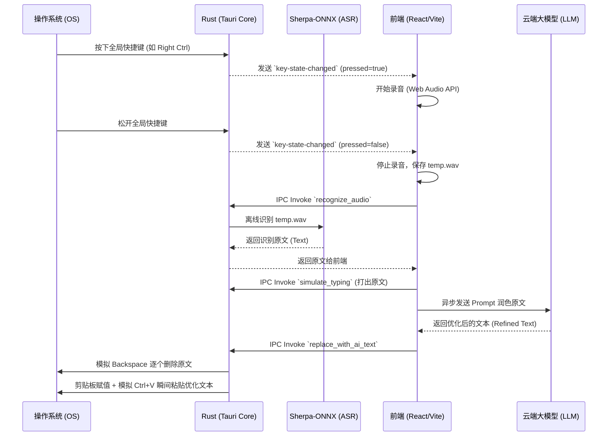

# VoiceFlow AI 开发与架构详解指南

本文档是 VoiceFlow AI 项目的深度开发指南，旨在帮助后续开发者理解项目的底层架构设计、IPC 通信机制、关键实现细节（如键鼠模拟与剪贴板操作），以及如何为项目扩展新功能。

---

## 0. 本地开发环境搭建 (Getting Started)

对于准备接手本项目的开源团队或个人开发者，请先按照以下步骤配置好本地环境。本项目基于 Tauri (Rust + React/TypeScript) 构建。

### 0.1 环境依赖预检
1. **Node.js**: 推荐使用 `v18.x` 或更高版本。
2. **Rust 工具链**:
   - 安装 [rustup](https://rustup.rs/) 以获取最新的稳定版 Rust (推荐 `>= 1.70.0`)。
3. **系统级原生依赖 (关键)**:
   - **Windows**: 必须安装 **Visual Studio C++ Build Tools**，并勾选“使用 C++ 的桌面开发”以及 **Windows 10/11 SDK**。否则 `rdev` 和 `enigo` 等底层 C++ 绑定库将无法编译。
   - **macOS**: 必须安装 **Xcode Command Line Tools** (`xcode-select --install`)。
   - **Linux**: 需安装 `webkit2gtk-4.0` 及相关编译工具包，详见 [Tauri 官方前置准备](https://v2.tauri.app/start/prerequisites/)。

### 0.2 项目初始化与启动
1. **拉取代码与安装 Node 依赖**:
   ```bash
   git clone <repository_url>
   cd VoiceFlow_AI_002
   npm install
   ```
2. **启动本地调试 (Dev 模式)**:
   ```bash
   npm run tauri dev
   ```
   *⚠️ 提示：初次运行此命令时，Cargo 需要下载并全量编译数十个 Rust Crate（包括重量级的跨平台窗口和外设控制库），可能耗时 5-15 分钟，请保持网络畅通并耐心等待。前端 Vite 服务会在后台自动拉起。*

### 0.3 开发环境的“坑”与注意事项
- **本地 ASR 模型加载**：项目在启动或首次录音时，会自动从远端拉取 `Sherpa-ONNX` 引擎及 `SenseVoice` 模型，并解压至系统应用数据目录。若你在断网环境下开发，或发现模型调用失败，请检查系统缓存目录下的引擎文件是否被杀毒软件误删或下载不全。
- **全局快捷键冲突**：开发调试时，若使用 `rdev` 监听了快捷键，强杀进程可能导致热键挂起。请尽量通过正常关闭窗口来退出 `tauri dev` 进程。

---

## 1. 核心架构图

VoiceFlow AI 采用标准的 Tauri 多进程架构：
- **前端 (Webview / Frontend)**：负责 UI 展示、状态管理、录音 (Web Audio API)、与大语言模型 (LLM API) 的网络通信。
- **后端 (Rust Core)**：负责操作系统级别的全局快捷键监听、进程与活动窗口检测、本地离线模型的调用 (`sherpa-onnx`) 以及底层键鼠和剪贴板控制。



---

## 2. 关键目录与模块解析

### 2.1 前端核心模块 (`src/`)

*   **`App.tsx`**: 整个应用的主控中心。
    *   通过 `listen("key-state-changed", ...)` 监听来自 Rust 的全局快捷键状态。
    *   管理录音的声明周期 (`startRecording`, `stopAndProcess`)。
    *   在 `stopAndProcess` 中串联了：**离线识别 -> 第一次上屏原文 -> LLM API 优化 -> 触发替换更新** 的完整流水线。
*   **`utils/llm.ts`**: 处理与各家大语言模型服务商（OpenAI 规范）的 HTTP 交互，包含模型测试与流式/非流式文本请求。
*   **`hooks/useSettings.ts`**: 全局状态存储器，与 `localStorage` 同步，保存所有用户配置（API Key、模型名称、防误触黑名单等）。

### 2.2 Rust 后端核心模块 (`src-tauri/src/`)

*   **`lib.rs`**: Tauri 的主入口和命令注册中心。
    *   **全局快捷键**：使用 `rdev` 的 `listen` 在独立线程中死循环监听按键事件。由于 `rdev` 会阻塞，必须用 `std::thread::spawn` 运行。
    *   **防误触机制**：利用 `active_win_pos_rs::get_active_window()` 在按下按键瞬间检测当前置顶窗口对应的进程名。如果命中前端传过来的黑名单（`blacklist`），则丢弃按键事件。
*   **`sensevoice.rs`**: 封装对本地 `sherpa-onnx` 离线执行程序的命令行调用。通过 `std::process::Command` 启动引擎并将生成的 `.wav` 音频路径传入，解析其标准输出（STDOUT）。

### 2.3 辅助服务 (`updater-proxy/`)
*   该目录包含一个用于代理 GitHub 自动更新请求的 Vercel 无服务器函数（Serverless Proxy）。
*   主要用于绕过网络访问限制，处理私有仓库 Release 的鉴权与分发。开发时如需修改更新逻辑，可在该目录下运行 `npm run start` (基于 Vercel CLI) 进行调试。

---

## 3. IPC 通信接口字典

前后端主要通过以下 Tauri Commands 交互：

| 接口名称 | 参数类型 | 返回值 | 作用描述 |
| :--- | :--- | :--- | :--- |
| `set_listen_key` | `key: String` | `Result<(), String>` | 设置触发录音的全局快捷键（前端传入 `RControl`, `LAlt` 等）。 |
| `set_blacklist` | `blacklist: Vec<String>` | `Result<(), String>` | 传入防误触黑名单进程名列表，用于 Rust 端拦截判定。 |
| `recognize_audio` | `audio_path: String` | `Result<String, String>` | 传入音频路径，调用本地大模型进行离线 ASR 识别。 |
| `simulate_typing` | `text: String` | `Result<(), String>` | 将文本复制入剪贴板，并通过 `enigo` 模拟 `Ctrl + V` 进行瞬间输出。 |
| `replace_with_ai_text` | `original_len: usize, new_text: String` | `Result<(), String>` | **核心：** 接收原文字符数和新文本，先打出 `original_len` 次退格键，再粘贴新文本。 |

---

## 4. 技术踩坑与特殊处理细节 (开发者必读)

### 4.1 剪贴板污染与时序问题
在调用 `simulate_typing` 模拟粘贴动作时，我们利用了系统的剪贴板。但是直接操作剪贴板极容易因为异步和系统的延迟造成严重 Bug：
1. **内容未同步便粘贴**：在调用 `clipboard.set_text(text)` 后，必须主动加上 `thread::sleep(Duration::from_millis(30))` 的微小延迟。因为剪贴板操作需要操作系统总线通信，立刻模拟按下 `Ctrl+V` 会导致粘贴出之前旧的剪贴板内容。
2. **剪贴板还原过快**：在模拟了 `Ctrl+V` 按下与抬起后，我们为了不破坏用户原来的剪贴板历史，会将其恢复原状。恢复操作必须等系统把前一次粘贴的内容消费完毕（约留 `200ms` 延迟），否则应用还没来得及读取剪贴板，内容就被恢复成了旧内容。

### 4.2 长文本替换难题 (`replace_with_ai_text`)
原始设计中，替换文本使用的是 `Shift + LeftArrow` 连续选中，再粘贴覆盖。但这导致了两个致命问题：
*   **VS Code 等编辑器的多行跳跃**：Shift+左方向键跨行时容易选错行或被编辑器的快捷键劫持。
*   **系统吞键**：如果在极短时间内密集发送数十个 Shift+Left，Windows 底层缓冲池会被塞满，导致后面的按键全部丢失。

**终极解决方案：**
改用 **退格键 (`Backspace`) 逐个删除** 机制。在 `lib.rs` 的 `replace_with_ai_text` 函数中：
```rust
for _ in 0..original_len {
    enigo.key_down(Key::Backspace);
    thread::sleep(Duration::from_millis(10)); // 必要的 10ms 物理缓冲延迟
    enigo.key_up(Key::Backspace);
    thread::sleep(Duration::from_millis(10));
}
```
虽然增加了一点视觉上的“倒退”动画时间，但换来了 100% 的输入框兼容性和极高的稳定性。

### 4.3 macOS 与 Windows 的修饰键差异
在模拟粘贴时，通过条件编译分开了 Windows 和 Mac 的快捷键：
```rust
#[cfg(target_os = "macos")]
// Mac: Meta(Cmd) + V
#[cfg(not(target_os = "macos"))]
// Win/Linux: Control + V
```
且在操作前后必须调用 `enigo.key_up(Key::Control);`，强制释放修饰键，防止用户刚刚一直按住 Ctrl (作为触发快捷键) 没有彻底松开，导致的按键粘连。

---

## 5. 如何扩展新功能

### 5.1 增加新的云端模型 (LLM Provider)
1. 打开 `src/utils/llm-providers.ts`。
2. 在 `LLM_PROVIDERS` 数组中增加一个新的对象配置即可，前端的 SetupWizard 与 SettingsPanel 会自动识别渲染。
```typescript
{
  id: "new-provider",
  name: "New Provider Name",
  baseUrl: "https://api.new-provider.com/v1",
  models: ["model-name-1", "model-name-2"],
  description: "简短描述..."
}
```

### 5.2 修改 ASR 模型 (SenseVoice)
当前版本默认下载的 Sherpa-ONNX 库和模型链接硬编码在相关脚本和预载逻辑中（如果你修改了它）。如果要升级 SenseVoice：
1. 下载最新的 ONNX `int8` 模型。
2. 替换 `temp` 中自动拉取的 URL。
3. 调整 `lib.rs` -> `sensevoice.rs` 中组装 Command Arguments 的 `model_path` 和 `tokens_path` 映射。

---

## 6. 构建与发布

*   **本地开发**：`npm run tauri dev`
*   **本地构建**：`npm run tauri build`
*   **自动化发布**：修改 `package.json` 及 `tauri.conf.json` 的版本号，提交至 `main` 分支后，打上 `v` 开头的 Tag（例如 `git tag v1.0.18`）推送至 GitHub 触发 Actions 进行跨平台打包。
